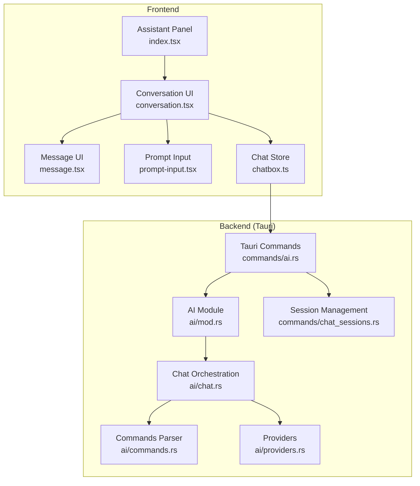
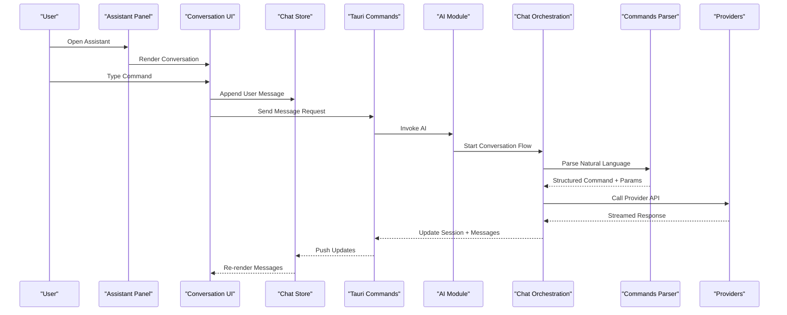
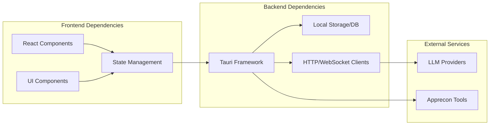

# AI Assistant & Chat Interface

<cite>
**Referenced Files in This Document**
- [src/layout/assistant/index.tsx](file://src/layout/assistant/index.tsx)
- [src/layout/assistant/types.ts](file://src/layout/assistant/types.ts)
- [src/components/ai-elements/conversation.tsx](file://src/components/ai-elements/conversation.tsx)
- [src/components/ai-elements/message.tsx](file://src/components/ai-elements/message.tsx)
- [src/components/ai-elements/prompt-input.tsx](file://src/components/ai-elements/prompt-input.tsx)
- [src/stores/chatbox.ts](file://src/stores/chatbox.ts)
- [src-tauri/src/ai/mod.rs](file://src-tauri/src/ai/mod.rs)
- [src-tauri/src/ai/chat.rs](file://src-tauri/src/ai/chat.rs)
- [src-tauri/src/ai/commands.rs](file://src-tauri/src/ai/commands.rs)
- [src-tauri/src/ai/providers.rs](file://src-tauri/src/ai/providers.rs)
- [src-tauri/src/commands/chat_sessions.rs](file://src-tauri/src/commands/chat_sessions.rs)
- [src-tauri/src/commands/ai.rs](file://src-tauri/src/commands/ai.rs)
</cite>

## Table of Contents
1. [Introduction](#introduction)
2. [Project Structure](#project-structure)
3. [Core Components](#core-components)
4. [Architecture Overview](#architecture-overview)
5. [Detailed Component Analysis](#detailed-component-analysis)
6. [Dependency Analysis](#dependency-analysis)
7. [Performance Considerations](#performance-considerations)
8. [Troubleshooting Guide](#troubleshooting-guide)
9. [Conclusion](#conclusion)
10. [Appendices](#appendices)

## Introduction
This document explains Apprecon’s AI assistant and chat interface, focusing on the natural language command system, conversation management, context-aware responses, and UI components. It covers how users interact with the assistant panel, message handling, state management, persistence, and multi-turn interactions. It also provides examples of common commands for security testing, code analysis, and workflow automation, and describes integration points with other Apprecon features.

## Project Structure
The AI assistant spans both frontend (React/TypeScript) and backend (Rust/Tauri). The frontend exposes the assistant panel, chat UI components, and stores for conversation state. The backend implements AI orchestration, provider selection, command processing, and session persistence via Tauri commands.

**Diagram sources**
- [src/layout/assistant/index.tsx](file://src/layout/assistant/index.tsx)
- [src/components/ai-elements/conversation.tsx](file://src/components/ai-elements/conversation.tsx)
- [src/components/ai-elements/message.tsx](file://src/components/ai-elements/message.tsx)
- [src/components/ai-elements/prompt-input.tsx](file://src/components/ai-elements/prompt-input.tsx)
- [src/stores/chatbox.ts](file://src/stores/chatbox.ts)
- [src-tauri/src/ai/mod.rs](file://src-tauri/src/ai/mod.rs)
- [src-tauri/src/ai/chat.rs](file://src-tauri/src/ai/chat.rs)
- [src-tauri/src/ai/commands.rs](file://src-tauri/src/ai/commands.rs)
- [src-tauri/src/ai/providers.rs](file://src-tauri/src/ai/providers.rs)
- [src-tauri/src/commands/ai.rs](file://src-tauri/src/commands/ai.rs)
- [src-tauri/src/commands/chat_sessions.rs](file://src-tauri/src/commands/chat_sessions.rs)

**Section sources**
- [src/layout/assistant/index.tsx](file://src/layout/assistant/index.tsx)
- [src/components/ai-elements/conversation.tsx](file://src/components/ai-elements/conversation.tsx)
- [src/components/ai-elements/message.tsx](file://src/components/ai-elements/message.tsx)
- [src/components/ai-elements/prompt-input.tsx](file://src/components/ai-elements/prompt-input.tsx)
- [src/stores/chatbox.ts](file://src/stores/chatbox.ts)
- [src-tauri/src/ai/mod.rs](file://src-tauri/src/ai/mod.rs)
- [src-tauri/src/ai/chat.rs](file://src-tauri/src/ai/chat.rs)
- [src-tauri/src/ai/commands.rs](file://src-tauri/src/ai/commands.rs)
- [src-tauri/src/ai/providers.rs](file://src-tauri/src/ai/providers.rs)
- [src-tauri/src/commands/ai.rs](file://src-tauri/src/commands/ai.rs)
- [src-tauri/src/commands/chat_sessions.rs](file://src-tauri/src/commands/chat_sessions.rs)

## Core Components
- Assistant Panel: Entry point to the AI assistant UI, manages visibility and layout within the app shell.
- Conversation UI: Renders messages, handles streaming updates, and coordinates user actions.
- Message UI: Displays individual messages with rich formatting and interactive elements.
- Prompt Input: Captures user input, supports natural language commands, and triggers send actions.
- Chat Store: Centralized state for conversations, messages, typing indicators, and session metadata.
- Backend AI Module: Orchestrates provider selection, prompt assembly, and response streaming.
- Chat Orchestration: Manages conversation context, tool invocation, and multi-turn flows.
- Commands Parser: Interprets natural language into structured commands and parameters.
- Providers: Abstracts LLM integrations and configuration.
- Tauri Commands: Bridges frontend calls to backend logic for chat sessions and AI operations.
- Session Management: Persists and retrieves conversations across app sessions.

**Section sources**
- [src/layout/assistant/index.tsx](file://src/layout/assistant/index.tsx)
- [src/components/ai-elements/conversation.tsx](file://src/components/ai-elements/conversation.tsx)
- [src/components/ai-elements/message.tsx](file://src/components/ai-elements/message.tsx)
- [src/components/ai-elements/prompt-input.tsx](file://src/components/ai-elements/prompt-input.tsx)
- [src/stores/chatbox.ts](file://src/stores/chatbox.ts)
- [src-tauri/src/ai/mod.rs](file://src-tauri/src/ai/mod.rs)
- [src-tauri/src/ai/chat.rs](file://src-tauri/src/ai/chat.rs)
- [src-tauri/src/ai/commands.rs](file://src-tauri/src/ai/commands.rs)
- [src-tauri/src/ai/providers.rs](file://src-tauri/src/ai/providers.rs)
- [src-tauri/src/commands/ai.rs](file://src-tauri/src/commands/ai.rs)
- [src-tauri/src/commands/chat_sessions.rs](file://src-tauri/src/commands/chat_sessions.rs)

## Architecture Overview
The assistant follows a layered architecture:
- Frontend UI layer renders the assistant panel and chat interface.
- State layer maintains conversation history and UI state.
- Integration layer invokes Tauri commands to perform AI tasks and manage sessions.
- Backend orchestrates providers, parses commands, and persists data.

**Diagram sources**
- [src/layout/assistant/index.tsx](file://src/layout/assistant/index.tsx)
- [src/components/ai-elements/conversation.tsx](file://src/components/ai-elements/conversation.tsx)
- [src/stores/chatbox.ts](file://src/stores/chatbox.ts)
- [src-tauri/src/commands/ai.rs](file://src-tauri/src/commands/ai.rs)
- [src-tauri/src/ai/mod.rs](file://src-tauri/src/ai/mod.rs)
- [src-tauri/src/ai/chat.rs](file://src-tauri/src/ai/chat.rs)
- [src-tauri/src/ai/commands.rs](file://src-tauri/src/ai/commands.rs)
- [src-tauri/src/ai/providers.rs](file://src-tauri/src/ai/providers.rs)

## Detailed Component Analysis

### Assistant Panel
- Responsibilities:
  - Toggle visibility and layout of the assistant within the app shell.
  - Initialize conversation context and load recent sessions.
  - Coordinate with global navigation and workspace state.

- Key behaviors:
  - Mounts conversation UI and binds store listeners.
  - Handles keyboard shortcuts and focus management.
  - Integrates with workspace tabs and panels.

**Section sources**
- [src/layout/assistant/index.tsx](file://src/layout/assistant/index.tsx)

### Conversation UI
- Responsibilities:
  - Render message list with streaming support.
  - Manage scroll-to-bottom behavior and auto-resize.
  - Handle user actions like retry, copy, and expand/collapse.

- Data flow:
  - Receives messages from store updates.
  - Emits events for new messages and user interactions.
  - Coordinates with prompt input for sending commands.

**Section sources**
- [src/components/ai-elements/conversation.tsx](file://src/components/ai-elements/conversation.tsx)

### Message UI
- Responsibilities:
  - Display individual messages with rich content types.
  - Support markdown, code blocks, and interactive elements.
  - Provide contextual actions per message type.

- Rendering strategy:
  - Type-based rendering for different message formats.
  - Safe HTML/markdown parsing and sanitization.
  - Accessibility considerations for screen readers.

**Section sources**
- [src/components/ai-elements/message.tsx](file://src/components/ai-elements/message.tsx)

### Prompt Input
- Responsibilities:
  - Capture user input and validate before sending.
  - Support multi-line input and command syntax hints.
  - Trigger send action and clear input after submission.

- Interaction patterns:
  - Keyboard shortcuts (Enter to send, Shift+Enter for newline).
  - Auto-focus and placeholder guidance.
  - Debounced input for performance.

**Section sources**
- [src/components/ai-elements/prompt-input.tsx](file://src/components/ai-elements/prompt-input.tsx)

### Chat Store
- Responsibilities:
  - Maintain conversation history, current message, and typing indicators.
  - Manage session metadata and persistence hooks.
  - Emit reactive updates to UI components.

- State structure:
  - Conversations array with message objects.
  - Active session ID and loading states.
  - Error handling and retry mechanisms.

**Section sources**
- [src/stores/chatbox.ts](file://src/stores/chatbox.ts)

### Backend AI Module
- Responsibilities:
  - Orchestrate provider selection based on configuration.
  - Assemble prompts with context and system instructions.
  - Handle streaming responses and error propagation.

- Integration points:
  - Tauri command handlers for frontend requests.
  - Session persistence and retrieval.
  - Tool invocation and result aggregation.

**Section sources**
- [src-tauri/src/ai/mod.rs](file://src-tauri/src/ai/mod.rs)

### Chat Orchestration
- Responsibilities:
  - Manage multi-turn conversation context.
  - Parse natural language into structured commands.
  - Execute tools and integrate with Apprecon features.

- Processing pipeline:
  - Context assembly from conversation history.
  - Command parsing and validation.
  - Tool execution and response generation.

**Section sources**
- [src-tauri/src/ai/chat.rs](file://src-tauri/src/ai/chat.rs)

### Commands Parser
- Responsibilities:
  - Interpret natural language commands into structured format.
  - Extract parameters and validate inputs.
  - Map commands to available tools and actions.

- Supported patterns:
  - Keyword-based command recognition.
  - Parameter extraction with type coercion.
  - Fallback to general chat when no command matches.

**Section sources**
- [src-tauri/src/ai/commands.rs](file://src-tauri/src/ai/commands.rs)

### Providers
- Responsibilities:
  - Abstract LLM API integrations.
  - Handle authentication and rate limiting.
  - Normalize responses across different providers.

- Configuration:
  - Provider-specific settings and endpoints.
  - Model selection and temperature controls.
  - Fallback mechanisms for reliability.

**Section sources**
- [src-tauri/src/ai/providers.rs](file://src-tauri/src/ai/providers.rs)

### Tauri Commands
- Responsibilities:
  - Expose AI functionality to frontend via Tauri IPC.
  - Validate inputs and handle errors gracefully.
  - Manage async operations and progress updates.

- Key commands:
  - Send message to AI assistant.
  - Create and manage chat sessions.
  - Retrieve conversation history.

**Section sources**
- [src-tauri/src/commands/ai.rs](file://src-tauri/src/commands/ai.rs)

### Session Management
- Responsibilities:
  - Persist conversations to local storage or database.
  - Load and restore previous sessions.
  - Clean up old sessions and manage storage limits.

- Persistence strategy:
  - JSON serialization for conversation data.
  - Incremental updates for large conversations.
  - Backup and recovery mechanisms.

**Section sources**
- [src-tauri/src/commands/chat_sessions.rs](file://src-tauri/src/commands/chat_sessions.rs)

## Dependency Analysis
The AI assistant has clear separation between frontend and backend concerns:

**Diagram sources**
- [src/stores/chatbox.ts](file://src/stores/chatbox.ts)
- [src-tauri/src/commands/ai.rs](file://src-tauri/src/commands/ai.rs)
- [src-tauri/src/ai/providers.rs](file://src-tauri/src/ai/providers.rs)

**Section sources**
- [src/stores/chatbox.ts](file://src/stores/chatbox.ts)
- [src-tauri/src/commands/ai.rs](file://src-tauri/src/commands/ai.rs)
- [src-tauri/src/ai/providers.rs](file://src-tauri/src/ai/providers.rs)

## Performance Considerations
- Streaming responses: Implement progressive updates for better user experience.
- Memory management: Limit conversation history size and implement garbage collection.
- Network optimization: Use connection pooling and request deduplication.
- UI responsiveness: Debounce user input and virtualize long message lists.
- Background processing: Offload heavy computations to worker threads.

[No sources needed since this section provides general guidance]

## Troubleshooting Guide
Common issues and solutions:
- Connection failures: Check network connectivity and provider credentials.
- Session corruption: Clear local storage and reinitialize sessions.
- Memory leaks: Monitor memory usage and implement proper cleanup.
- UI freezes: Optimize rendering and avoid blocking operations.
- Command parsing errors: Validate input format and provide helpful error messages.

**Section sources**
- [src-tauri/src/commands/ai.rs](file://src-tauri/src/commands/ai.rs)
- [src-tauri/src/ai/chat.rs](file://src-tauri/src/ai/chat.rs)

## Conclusion
Apprecon’s AI assistant provides a comprehensive chat interface with natural language command processing, context-aware responses, and seamless integration with other application features. The modular architecture ensures maintainability and scalability while providing an intuitive user experience for security testing, code analysis, and workflow automation tasks.

[No sources needed since this section summarizes without analyzing specific files]

## Appendices

### Natural Language Command System
The command system supports various patterns for interacting with AI capabilities:

- Security Testing Commands:
  - "Scan target for vulnerabilities"
  - "Analyze intercepted request for XSS"
  - "Test SQL injection on parameter"

- Code Analysis Commands:
  - "Review code for security issues"
  - "Generate unit tests for function"
  - "Refactor code for performance"

- Workflow Automation Commands:
  - "Create automated test sequence"
  - "Export results to report"
  - "Schedule recurring scan"

### Response Formats
AI responses support multiple formats:
- Plain text for general information
- Markdown for formatted documentation
- JSON for structured data
- Code blocks for technical content
- Interactive elements for actionable items

### Multi-Turn Interactions
The system maintains conversation context through:
- Session-based state management
- History tracking with message timestamps
- Contextual references to previous messages
- Cross-feature integration awareness

### Integration Points
The assistant integrates with:
- Browser automation tools
- HTTP intercept and replay
- File explorer and documents
- Terminal and command execution
- Settings and configuration management

**Section sources**
- [src-tauri/src/ai/commands.rs](file://src-tauri/src/ai/commands.rs)
- [src/stores/chatbox.ts](file://src/stores/chatbox.ts)
- [src-tauri/src/ai/chat.rs](file://src-tauri/src/ai/chat.rs)