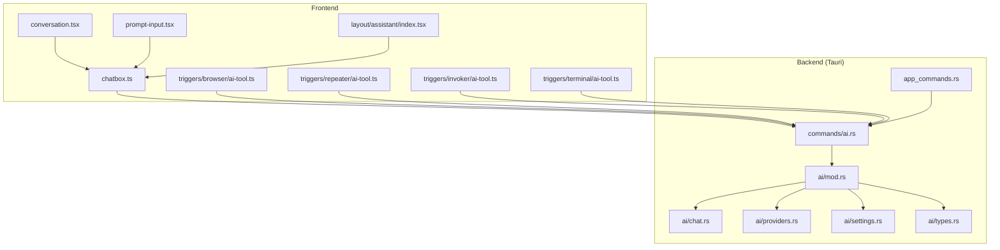
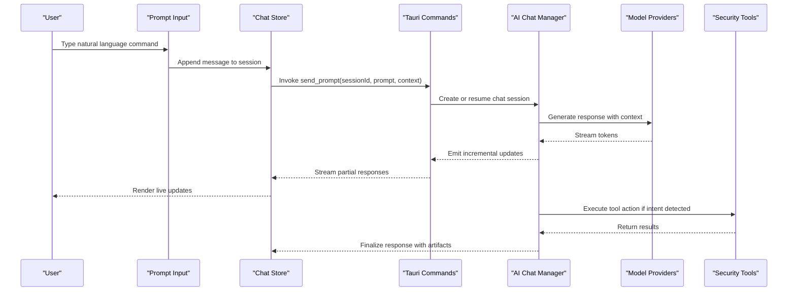
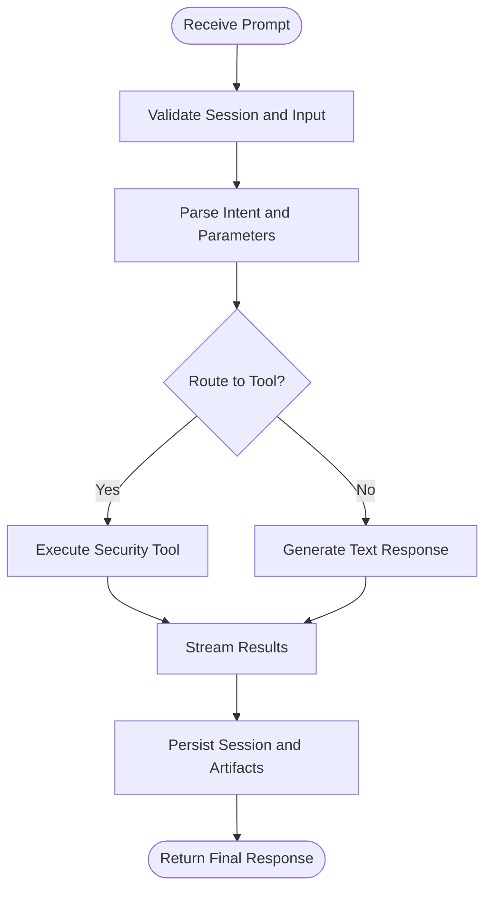
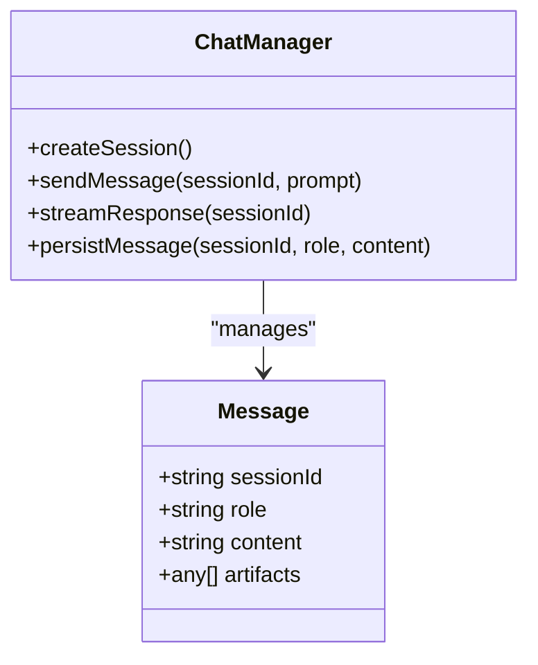
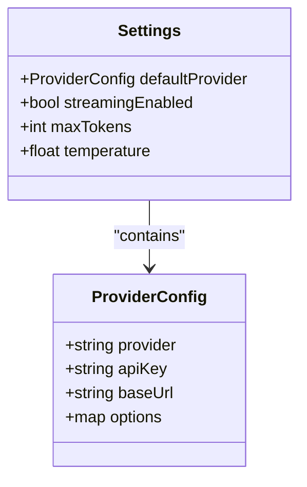
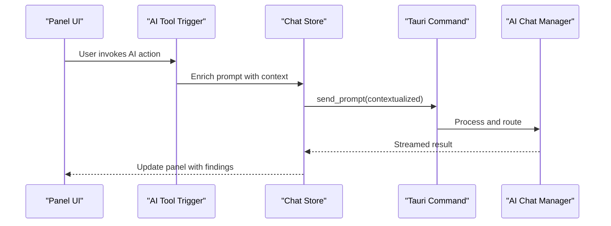
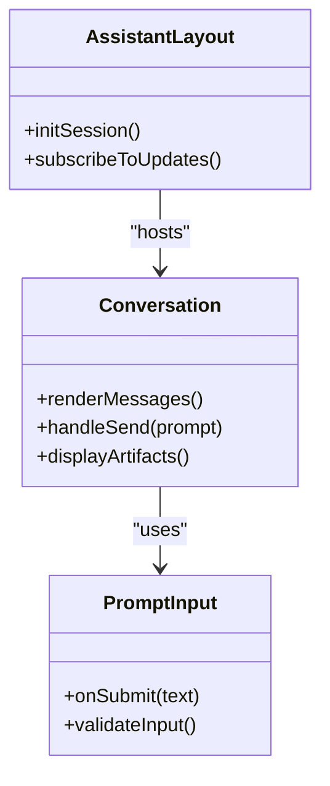
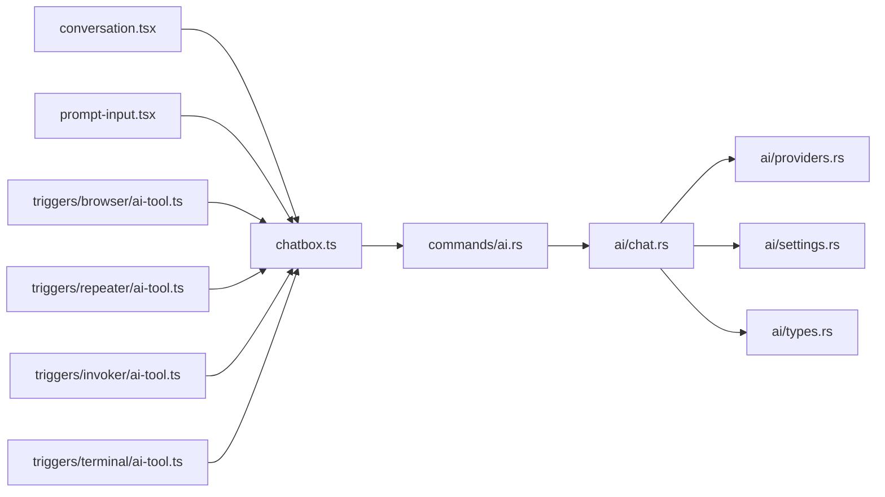

# AI Command System & Natural Language Processing

<cite>
**Referenced Files in This Document**
- [src-tauri/src/ai/mod.rs](file://src-tauri/src/ai/mod.rs)
- [src-tauri/src/ai/commands.rs](file://src-tauri/src/ai/commands.rs)
- [src-tauri/src/ai/chat.rs](file://src-tauri/src/ai/chat.rs)
- [src-tauri/src/ai/providers.rs](file://src-tauri/src/ai/providers.rs)
- [src-tauri/src/ai/settings.rs](file://src-tauri/src/ai/settings.rs)
- [src-tauri/src/ai/types.rs](file://src-tauri/src/ai/types.rs)
- [src-tauri/src/commands/ai.rs](file://src-tauri/src/commands/ai.rs)
- [src-tauri/src/app_commands.rs](file://src-tauri/src/app_commands.rs)
- [src/components/ai-elements/conversation.tsx](file://src/components/ai-elements/conversation.tsx)
- [src/components/ai-elements/prompt-input.tsx](file://src/components/ai-elements/prompt-input.tsx)
- [src/stores/chatbox.ts](file://src/stores/chatbox.ts)
- [src/layout/assistant/index.tsx](file://src/layout/assistant/index.tsx)
- [src/layout/assistant/constants.ts](file://src/layout/assistant/constants.ts)
- [src/triggers/index.ts](file://src/triggers/index.ts)
- [src/triggers/browser/ai-tool.ts](file://src/triggers/browser/ai-tool.ts)
- [src/triggers/repeater/ai-tool.ts](file://src/triggers/repeater/ai-tool.ts)
- [src/triggers/invoker/ai-tool.ts](file://src/triggers/invoker/ai-tool.ts)
- [src/triggers/terminal/ai-tool.ts](file://src/triggers/terminal/ai-tool.ts)
</cite>

## Table of Contents
1. [Introduction](#introduction)
2. [Project Structure](#project-structure)
3. [Core Components](#core-components)
4. [Architecture Overview](#architecture-overview)
5. [Detailed Component Analysis](#detailed-component-analysis)
6. [Dependency Analysis](#dependency-analysis)
7. [Performance Considerations](#performance-considerations)
8. [Troubleshooting Guide](#troubleshooting-guide)
9. [Conclusion](#conclusion)
10. [Appendices](#appendices)

## Introduction
This document explains the AI command system and natural language processing capabilities in Apprecon. It covers how users interact with the application using natural language commands, including supported operations, parameter specification, parsing logic, intent recognition, and response generation. It also documents integration points with security testing tools (browser automation, repeater, invoker, terminal), code analysis features, and workflow automation. Examples are provided for vulnerability scanning, API testing, and debugging tasks. Finally, it addresses customization, aliases, and advanced usage patterns.

## Project Structure
The AI command system spans both the Rust backend (Tauri) and the React frontend:
- Backend modules handle provider configuration, chat sessions, command definitions, and Tauri command bindings.
- Frontend components provide the conversation UI, prompt input, and trigger integrations that expose context-aware AI actions from various panels.

**Diagram sources**
- [src/components/ai-elements/conversation.tsx](file://src/components/ai-elements/conversation.tsx)
- [src/components/ai-elements/prompt-input.tsx](file://src/components/ai-elements/prompt-input.tsx)
- [src/stores/chatbox.ts](file://src/stores/chatbox.ts)
- [src/layout/assistant/index.tsx](file://src/layout/assistant/index.tsx)
- [src/triggers/browser/ai-tool.ts](file://src/triggers/browser/ai-tool.ts)
- [src/triggers/repeater/ai-tool.ts](file://src/triggers/repeater/ai-tool.ts)
- [src/triggers/invoker/ai-tool.ts](file://src/triggers/invoker/ai-tool.ts)
- [src/triggers/terminal/ai-tool.ts](file://src/triggers/terminal/ai-tool.ts)
- [src-tauri/src/ai/mod.rs](file://src-tauri/src/ai/mod.rs)
- [src-tauri/src/ai/chat.rs](file://src-tauri/src/ai/chat.rs)
- [src-tauri/src/ai/providers.rs](file://src-tauri/src/ai/providers.rs)
- [src-tauri/src/ai/settings.rs](file://src-tauri/src/ai/settings.rs)
- [src-tauri/src/ai/types.rs](file://src-tauri/src/ai/types.rs)
- [src-tauri/src/commands/ai.rs](file://src-tauri/src/commands/ai.rs)
- [src-tauri/src/app_commands.rs](file://src-tauri/src/app_commands.rs)

**Section sources**
- [src-tauri/src/ai/mod.rs](file://src-tauri/src/ai/mod.rs)
- [src-tauri/src/commands/ai.rs](file://src-tauri/src/commands/ai.rs)
- [src-tauri/src/app_commands.rs](file://src-tauri/src/app_commands.rs)
- [src/components/ai-elements/conversation.tsx](file://src/components/ai-elements/conversation.tsx)
- [src/components/ai-elements/prompt-input.tsx](file://src/components/ai-elements/prompt-input.tsx)
- [src/stores/chatbox.ts](file://src/stores/chatbox.ts)
- [src/layout/assistant/index.tsx](file://src/layout/assistant/index.tsx)
- [src/triggers/index.ts](file://src/triggers/index.ts)

## Core Components
- AI Provider and Settings: Configuration for model providers, keys, and runtime settings.
- Chat Session Management: Creation, persistence, and streaming of messages.
- Command Bindings: Tauri commands exposed to the frontend for sending prompts and receiving responses.
- Trigger Integrations: Context-aware AI tooling from browser, repeater, invoker, and terminal panels.

Key responsibilities:
- Parse user prompts into structured intents and parameters.
- Route requests to appropriate tools or workflows.
- Stream results back to the UI and persist session history.

**Section sources**
- [src-tauri/src/ai/providers.rs](file://src-tauri/src/ai/providers.rs)
- [src-tauri/src/ai/settings.rs](file://src-tauri/src/ai/settings.rs)
- [src-tauri/src/ai/chat.rs](file://src-tauri/src/ai/chat.rs)
- [src-tauri/src/ai/types.rs](file://src-tauri/src/ai/types.rs)
- [src-tauri/src/commands/ai.rs](file://src-tauri/src/commands/ai.rs)

## Architecture Overview
The AI command flow integrates frontend triggers and inputs with backend command handlers and AI providers. The assistant orchestrates conversations and delegates execution to specialized tools via Tauri commands.

**Diagram sources**
- [src/components/ai-elements/prompt-input.tsx](file://src/components/ai-elements/prompt-input.tsx)
- [src/stores/chatbox.ts](file://src/stores/chatbox.ts)
- [src-tauri/src/commands/ai.rs](file://src-tauri/src/commands/ai.rs)
- [src-tauri/src/ai/chat.rs](file://src-tauri/src/ai/chat.rs)
- [src-tauri/src/ai/providers.rs](file://src-tauri/src/ai/providers.rs)

## Detailed Component Analysis

### AI Command Bindings and Parsing
- Tauri command layer exposes endpoints for sending prompts, managing sessions, and invoking tools.
- Parsing logic extracts intents and parameters from natural language, mapping them to structured payloads for downstream execution.
- Responses are streamed incrementally to the frontend for real-time feedback.

**Diagram sources**
- [src-tauri/src/commands/ai.rs](file://src-tauri/src/commands/ai.rs)
- [src-tauri/src/ai/chat.rs](file://src-tauri/src/ai/chat.rs)
- [src-tauri/src/ai/types.rs](file://src-tauri/src/ai/types.rs)

**Section sources**
- [src-tauri/src/commands/ai.rs](file://src-tauri/src/commands/ai.rs)
- [src-tauri/src/ai/chat.rs](file://src-tauri/src/ai/chat.rs)
- [src-tauri/src/ai/types.rs](file://src-tauri/src/ai/types.rs)

### Chat Sessions and Streaming
- Chat manager handles session lifecycle, message ordering, and streaming events.
- Supports multi-turn conversations with context retention and artifact attachments.

**Diagram sources**
- [src-tauri/src/ai/chat.rs](file://src-tauri/src/ai/chat.rs)
- [src-tauri/src/ai/types.rs](file://src-tauri/src/ai/types.rs)

**Section sources**
- [src-tauri/src/ai/chat.rs](file://src-tauri/src/ai/chat.rs)
- [src-tauri/src/ai/types.rs](file://src-tauri/src/ai/types.rs)

### Provider Configuration and Settings
- Provider module configures model endpoints, authentication, and request shaping.
- Settings module centralizes runtime configuration, defaults, and environment overrides.

**Diagram sources**
- [src-tauri/src/ai/providers.rs](file://src-tauri/src/ai/providers.rs)
- [src-tauri/src/ai/settings.rs](file://src-tauri/src/ai/settings.rs)

**Section sources**
- [src-tauri/src/ai/providers.rs](file://src-tauri/src/ai/providers.rs)
- [src-tauri/src/ai/settings.rs](file://src-tauri/src/ai/settings.rs)

### Trigger Integrations (Context-Aware AI Actions)
- Triggers expose panel-specific contexts (e.g., selected HTTP request, browser page state, terminal output) to AI commands.
- They translate UI interactions into structured prompts and tool calls.

**Diagram sources**
- [src/triggers/browser/ai-tool.ts](file://src/triggers/browser/ai-tool.ts)
- [src/triggers/repeater/ai-tool.ts](file://src/triggers/repeater/ai-tool.ts)
- [src/triggers/invoker/ai-tool.ts](file://src/triggers/invoker/ai-tool.ts)
- [src/triggers/terminal/ai-tool.ts](file://src/triggers/terminal/ai-tool.ts)
- [src/stores/chatbox.ts](file://src/stores/chatbox.ts)
- [src-tauri/src/commands/ai.rs](file://src-tauri/src/commands/ai.rs)

**Section sources**
- [src/triggers/browser/ai-tool.ts](file://src/triggers/browser/ai-tool.ts)
- [src/triggers/repeater/ai-tool.ts](file://src/triggers/repeater/ai-tool.ts)
- [src/triggers/invoker/ai-tool.ts](file://src/triggers/invoker/ai-tool.ts)
- [src/triggers/terminal/ai-tool.ts](file://src/triggers/terminal/ai-tool.ts)
- [src/stores/chatbox.ts](file://src/stores/chatbox.ts)
- [src-tauri/src/commands/ai.rs](file://src-tauri/src/commands/ai.rs)

### Conversation UI and Assistant Layout
- Conversation component renders messages, artifacts, and streaming indicators.
- Prompt input captures user text and submits to the store.
- Assistant layout coordinates global state and navigation.

**Diagram sources**
- [src/components/ai-elements/conversation.tsx](file://src/components/ai-elements/conversation.tsx)
- [src/components/ai-elements/prompt-input.tsx](file://src/components/ai-elements/prompt-input.tsx)
- [src/layout/assistant/index.tsx](file://src/layout/assistant/index.tsx)

**Section sources**
- [src/components/ai-elements/conversation.tsx](file://src/components/ai-elements/conversation.tsx)
- [src/components/ai-elements/prompt-input.tsx](file://src/components/ai-elements/prompt-input.tsx)
- [src/layout/assistant/index.tsx](file://src/layout/assistant/index.tsx)

## Dependency Analysis
- Frontend dependencies:
  - Conversation and prompt input rely on the chat store for state management.
  - Triggers depend on panel-specific data models and emit contextual prompts.
- Backend dependencies:
  - Command layer depends on chat manager, providers, and settings.
  - Chat manager interacts with providers and persists messages.

**Diagram sources**
- [src/components/ai-elements/conversation.tsx](file://src/components/ai-elements/conversation.tsx)
- [src/components/ai-elements/prompt-input.tsx](file://src/components/ai-elements/prompt-input.tsx)
- [src/stores/chatbox.ts](file://src/stores/chatbox.ts)
- [src/triggers/browser/ai-tool.ts](file://src/triggers/browser/ai-tool.ts)
- [src/triggers/repeater/ai-tool.ts](file://src/triggers/repeater/ai-tool.ts)
- [src/triggers/invoker/ai-tool.ts](file://src/triggers/invoker/ai-tool.ts)
- [src/triggers/terminal/ai-tool.ts](file://src/triggers/terminal/ai-tool.ts)
- [src-tauri/src/commands/ai.rs](file://src-tauri/src/commands/ai.rs)
- [src-tauri/src/ai/chat.rs](file://src-tauri/src/ai/chat.rs)
- [src-tauri/src/ai/providers.rs](file://src-tauri/src/ai/providers.rs)
- [src-tauri/src/ai/settings.rs](file://src-tauri/src/ai/settings.rs)
- [src-tauri/src/ai/types.rs](file://src-tauri/src/ai/types.rs)

**Section sources**
- [src/stores/chatbox.ts](file://src/stores/chatbox.ts)
- [src-tauri/src/commands/ai.rs](file://src-tauri/src/commands/ai.rs)
- [src-tauri/src/ai/chat.rs](file://src-tauri/src/ai/chat.rs)

## Performance Considerations
- Streaming responses reduce perceived latency and improve UX during long-running operations.
- Context enrichment should be minimized to avoid large payloads; prefer selective fields.
- Caching frequently used prompts and results can speed up repeated tasks.
- Rate limiting and backoff strategies protect provider endpoints under heavy load.

[No sources needed since this section provides general guidance]

## Troubleshooting Guide
Common issues and resolutions:
- Provider configuration errors: Verify API keys, base URLs, and model names in settings.
- Session not found: Ensure a valid session ID is passed with each prompt.
- Streaming interruptions: Check network stability and provider rate limits.
- Tool execution failures: Inspect tool logs and ensure required permissions or dependencies are installed.

**Section sources**
- [src-tauri/src/ai/settings.rs](file://src-tauri/src/ai/settings.rs)
- [src-tauri/src/ai/providers.rs](file://src-tauri/src/ai/providers.rs)
- [src-tauri/src/ai/chat.rs](file://src-tauri/src/ai/chat.rs)

## Conclusion
Apprecon’s AI command system enables natural language interaction across security testing and development workflows. By combining context-aware triggers, robust command bindings, and streaming responses, it delivers an efficient and extensible interface for vulnerability scanning, API testing, and debugging. Customization through aliases and advanced prompt patterns further enhances productivity.

[No sources needed since this section summarizes without analyzing specific files]

## Appendices

### Supported Operations and Syntax Patterns
- Vulnerability Scanning:
  - Example: “Scan target for SQL injection”
  - Parameters: target URL, scope, severity threshold
- API Testing:
  - Example: “Test /api/users endpoint with POST payload”
  - Parameters: method, path, headers, body, expected status
- Debugging Tasks:
  - Example: “Debug failed login flow in browser”
  - Parameters: session context, steps to reproduce, logs to include

[No sources needed since this section provides general guidance]

### Command Customization and Aliases
- Define aliases for frequent commands to streamline workflows.
- Use templates to standardize complex prompts with placeholders.
- Integrate custom tools by extending trigger modules and command bindings.

[No sources needed since this section provides general guidance]