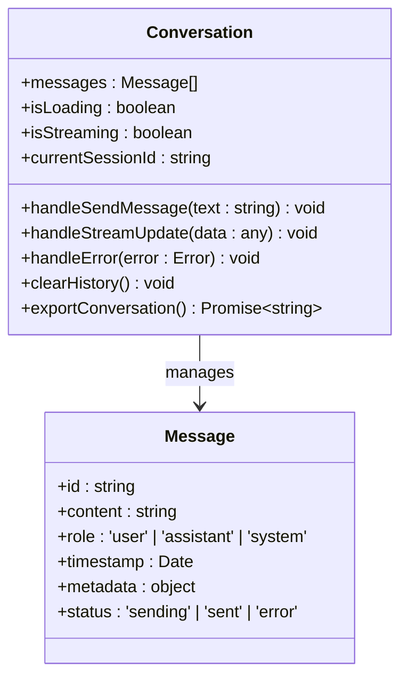
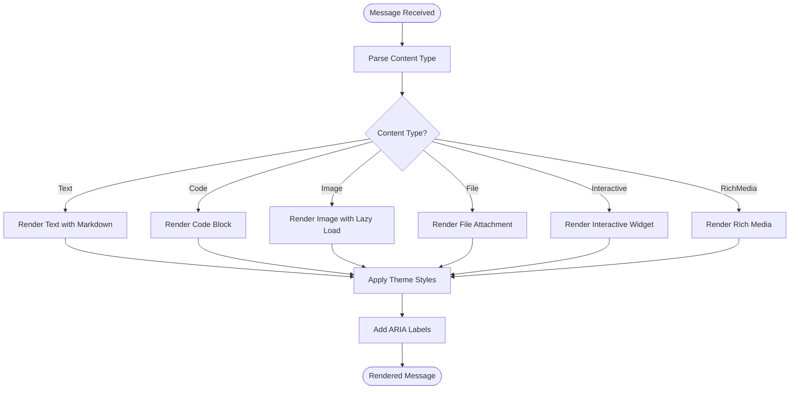
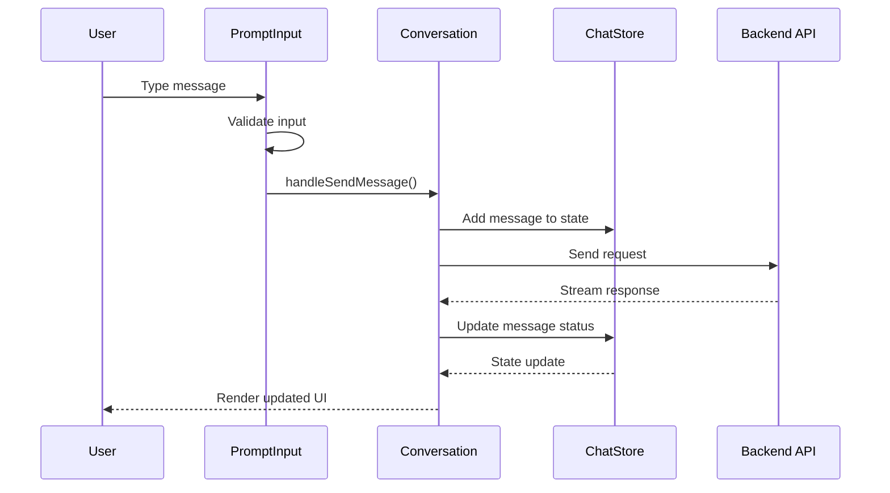
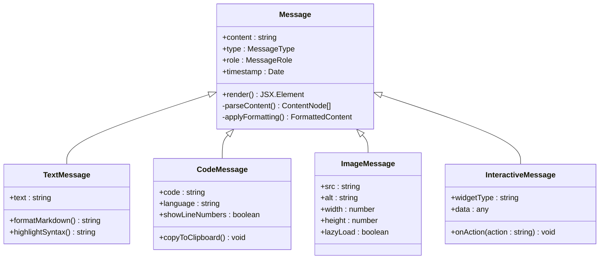
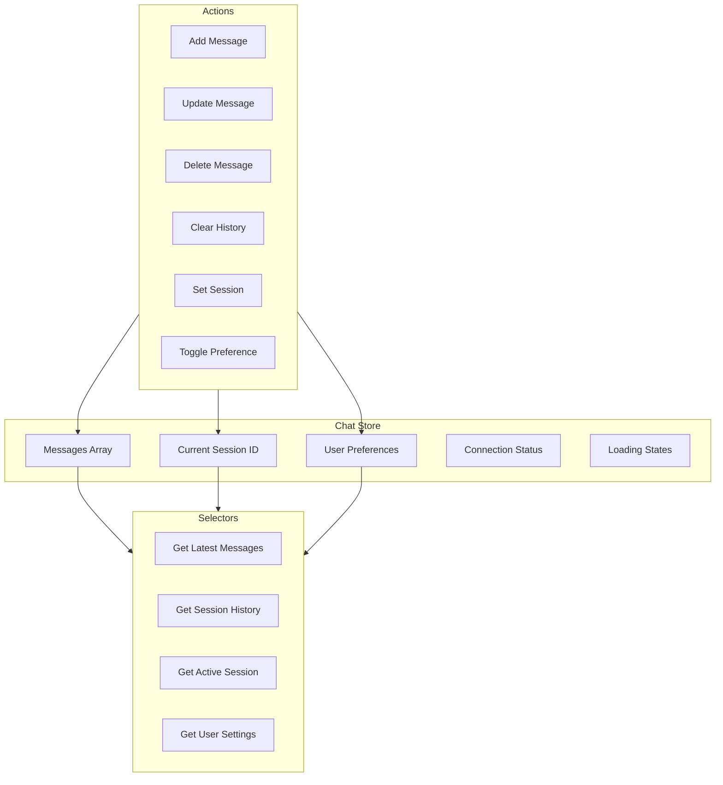
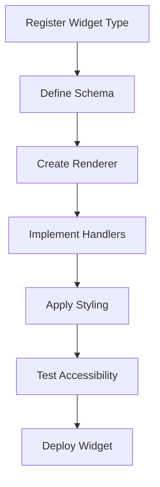

# Chat UI Components

<cite>
**Referenced Files in This Document**
- [conversation.tsx](file://src/components/ai-elements/conversation.tsx)
- [prompt-input.tsx](file://src/components/ai-elements/prompt-input.tsx)
- [message.tsx](file://src/components/ai-elements/message.tsx)
- [chat-message-area.tsx](file://src/components/ui/chat-message-area.tsx)
- [chat-input.tsx](file://src/components/ui/chat-input.tsx)
- [panel.tsx](file://src/components/ai-elements/panel.tsx)
- [chatbox.ts](file://src/stores/chatbox.ts)
- [index.tsx](file://src/layout/assistant/index.tsx)
</cite>

## Table of Contents
1. [Introduction](#introduction)
2. [Project Structure](#project-structure)
3. [Core Components](#core-components)
4. [Architecture Overview](#architecture-overview)
5. [Detailed Component Analysis](#detailed-component-analysis)
6. [State Management](#state-management)
7. [Responsive Design](#responsive-design)
8. [Accessibility Features](#accessibility-features)
9. [Customization Guide](#customization-guide)
10. [Performance Considerations](#performance-considerations)
11. [Troubleshooting Guide](#troubleshooting-guide)
12. [Conclusion](#conclusion)

## Introduction

The AI chat interface is a sophisticated React-based component system designed to facilitate natural language conversations with AI assistants. The system provides a modern, responsive chat experience with rich message rendering, real-time updates, and comprehensive accessibility support. The architecture follows component-driven design principles with clear separation of concerns between presentation logic, state management, and user interactions.

## Project Structure

The chat interface components are organized in a modular architecture within the `src/components` directory, following feature-based organization:

```mermaid
graph TB
subgraph "AI Elements"
Conv[conversation.tsx]
Msg[message.tsx]
Input[prompt-input.tsx]
Panel[panel.tsx]
end
subgraph "UI Components"
ChatArea[chat-message-area.tsx]
ChatInput[chat-input.tsx]
Button[button.tsx]
Textarea[textarea.tsx]
end
subgraph "State Management"
Store[chatbox.ts]
Types[types.ts]
end
subgraph "Layout"
Assistant[index.tsx]
Layout[layout components]
end
Conv --> Msg
Conv --> Input
Conv --> Panel
Msg --> ChatArea
Input --> ChatInput
Assistant --> Conv
Store --> Conv
```

**Diagram sources**
- [conversation.tsx](file://src/components/ai-elements/conversation.tsx)
- [message.tsx](file://src/components/ai-elements/message.tsx)
- [prompt-input.tsx](file://src/components/ai-elements/prompt-input.tsx)
- [chat-message-area.tsx](file://src/components/ui/chat-message-area.tsx)
- [chat-input.tsx](file://src/components/ui/chat-input.tsx)
- [chatbox.ts](file://src/stores/chatbox.ts)

**Section sources**
- [conversation.tsx](file://src/components/ai-elements/conversation.tsx)
- [prompt-input.tsx](file://src/components/ai-elements/prompt-input.tsx)
- [message.tsx](file://src/components/ai-elements/message.tsx)

## Core Components

### Conversation Component

The conversation component serves as the main container for managing chat interactions. It handles message history, user input processing, and response rendering.

#### Key Features:
- **Message History Management**: Maintains chronological order of messages
- **Real-time Updates**: Supports streaming responses and live updates
- **Auto-scrolling**: Automatically scrolls to latest messages
- **Loading States**: Handles asynchronous operations gracefully
- **Error Handling**: Manages connection errors and timeouts

#### Component Structure:


**Diagram sources**
- [conversation.tsx](file://src/components/ai-elements/conversation.tsx)
- [message.tsx](file://src/components/ai-elements/message.tsx)

### Message Rendering System

The message rendering system supports multiple content types and provides rich formatting capabilities.

#### Supported Content Types:
- **Plain Text**: Basic text messages with markdown support
- **Code Blocks**: Syntax-highlighted code with line numbers
- **Images**: Embedded images with lazy loading
- **Files**: File attachments with preview capabilities
- **Interactive Elements**: Buttons, forms, and custom widgets
- **Rich Media**: Audio, video, and embedded content

#### Rendering Pipeline:


**Diagram sources**
- [message.tsx](file://src/components/ai-elements/message.tsx)
- [chat-message-area.tsx](file://src/components/ui/chat-message-area.tsx)

### Prompt Input Component

The prompt input component provides a sophisticated text input interface with advanced features for crafting effective prompts.

#### Features:
- **Multi-line Support**: Expandable textarea for complex prompts
- **Keyboard Shortcuts**: Enter to send, Shift+Enter for new line
- **Character Count**: Real-time character count with limits
- **Validation**: Input validation and sanitization
- **Auto-focus**: Intelligent focus management
- **Placeholder Text**: Contextual placeholder suggestions
- **Attachment Support**: File and image attachment handling

#### Keyboard Shortcuts:
- `Enter`: Send message
- `Shift + Enter`: New line
- `Ctrl/Cmd + Enter`: Send without newline
- `Escape`: Clear input or cancel actions
- `Tab`: Auto-complete suggestions (if enabled)

**Section sources**
- [prompt-input.tsx](file://src/components/ai-elements/prompt-input.tsx)
- [chat-input.tsx](file://src/components/ui/chat-input.tsx)

## Architecture Overview

The chat interface follows a unidirectional data flow pattern with clear separation between components and state management.



**Diagram sources**
- [conversation.tsx](file://src/components/ai-elements/conversation.tsx)
- [chatbox.ts](file://src/stores/chatbox.ts)

## Detailed Component Analysis

### Conversation Component Deep Dive

The conversation component implements a robust state management system with efficient re-rendering strategies.

#### State Management:
- **Local State**: Current message input, loading states, error handling
- **Global State**: Message history, session management, user preferences
- **Optimistic Updates**: Immediate UI feedback before server confirmation
- **Error Recovery**: Automatic retry mechanisms and fallback states

#### Performance Optimizations:
- **Virtual Scrolling**: Efficient rendering of large message histories
- **Memoization**: Prevent unnecessary re-renders with React.memo
- **Lazy Loading**: Load heavy components on demand
- **Debounced Input**: Reduce API calls during typing

### Message Component Architecture

The message component uses a polymorphic rendering approach to handle different content types efficiently.

#### Component Hierarchy:


**Diagram sources**
- [message.tsx](file://src/components/ai-elements/message.tsx)

### Prompt Input Validation System

The prompt input implements comprehensive validation and sanitization to ensure data integrity and security.

#### Validation Rules:
- **Length Constraints**: Minimum and maximum character limits
- **Content Filtering**: Remove potentially harmful characters
- **Format Validation**: Ensure proper syntax for structured inputs
- **Context Awareness**: Validate based on current conversation context

#### Security Measures:
- **XSS Prevention**: Sanitize all user inputs
- **Rate Limiting**: Prevent spam and abuse
- **Input Normalization**: Standardize whitespace and formatting
- **Content Policy**: Enforce acceptable content guidelines

**Section sources**
- [prompt-input.tsx](file://src/components/ai-elements/prompt-input.tsx)
- [chat-input.tsx](file://src/components/ui/chat-input.tsx)

## State Management

The chat interface uses a centralized store pattern for managing conversation state across components.

### Store Architecture



**Diagram sources**
- [chatbox.ts](file://src/stores/chatbox.ts)

### State Persistence

The system implements automatic persistence to maintain conversation state across sessions:

- **Local Storage**: Persist recent conversations and user preferences
- **IndexedDB**: Store large message histories and attachments
- **Sync Mechanism**: Synchronize state across tabs and devices
- **Backup/Restore**: Export and import conversation data

## Responsive Design

The chat interface adapts seamlessly across different screen sizes and device orientations.

### Breakpoints and Layouts:

| Screen Size | Layout Mode | Features |
|-------------|-------------|----------|
| Mobile (< 768px) | Compact | Single column, collapsible sidebar |
| Tablet (768px - 1024px) | Adaptive | Side panel, optimized touch targets |
| Desktop (> 1024px) | Full | Multi-panel, expanded features |

### Touch-Friendly Interactions:
- **Swipe Gestures**: Navigate between conversations
- **Long Press**: Context menus and quick actions
- **Pinch-to-Zoom**: Zoom into code blocks and images
- **Pull-to-Refresh**: Reload conversations

## Accessibility Features

The chat interface prioritizes accessibility compliance with WCAG 2.1 AA standards.

### Keyboard Navigation:
- **Tab Order**: Logical navigation through interactive elements
- **Focus Management**: Clear focus indicators and auto-focus
- **Screen Reader Support**: Semantic HTML and ARIA labels
- **High Contrast Mode**: Support for system-wide high contrast settings

### Screen Reader Optimization:
- **Live Regions**: Announce dynamic content updates
- **Descriptive Labels**: Clear button and link descriptions
- **Error Announcements**: Voice feedback for form validation
- **Reading Order**: Logical content sequence

### Visual Accessibility:
- **Color Contrast**: Meets minimum contrast ratios
- **Font Scaling**: Support for increased font sizes
- **Motion Reduction**: Respect prefers-reduced-motion
- **Focus Indicators**: Visible focus outlines

## Customization Guide

### Message Appearance Customization

#### CSS Variables:
```css
:root {
  --chat-message-bg: #ffffff;
  --chat-message-text: #1a1a1a;
  --chat-user-bubble: #e3f2fd;
  --chat-assistant-bubble: #f5f5f5;
  --chat-code-bg: #2d2d2d;
  --chat-code-text: #f8f8f2;
  --chat-border-radius: 12px;
  --chat-spacing: 16px;
}
```

#### Theme Configuration:
- **Light/Dark Modes**: Automatic theme switching
- **Custom Themes**: Brand-specific color schemes
- **Typography**: Font family and size customization
- **Spacing**: Consistent spacing system

### Interactive Elements

#### Adding Custom Widgets:
1. **Register Widget Type**: Define widget schema and renderer
2. **Implement Handler**: Create action handlers for user interactions
3. **Style Integration**: Apply consistent styling
4. **Accessibility**: Ensure keyboard and screen reader support

#### Example Widget Implementation:


### Real-time Updates

#### WebSocket Integration:
- **Connection Management**: Automatic reconnection and error handling
- **Message Ordering**: Ensure correct message sequence
- **Conflict Resolution**: Handle concurrent updates gracefully
- **Performance**: Optimize update frequency and payload size

#### Streaming Responses:
- **Progressive Rendering**: Display partial responses immediately
- **Caret Positioning**: Maintain cursor position during updates
- **Error Recovery**: Handle stream interruptions gracefully
- **Memory Management**: Clean up partial responses on errors

## Performance Considerations

### Optimization Strategies:

#### Rendering Performance:
- **Virtual Scrolling**: Only render visible messages
- **Component Memoization**: Prevent unnecessary re-renders
- **Lazy Loading**: Load heavy components on demand
- **Image Optimization**: Compress and lazy load media files

#### Memory Management:
- **Message Cleanup**: Remove old messages from memory
- **Event Listener Cleanup**: Properly remove event listeners
- **WebSocket Cleanup**: Close connections when not needed
- **Garbage Collection**: Help browser garbage collection

#### Network Optimization:
- **Request Batching**: Combine multiple API calls
- **Caching Strategy**: Implement intelligent caching
- **Compression**: Enable gzip/brotli compression
- **CDN Usage**: Serve static assets from CDN

## Troubleshooting Guide

### Common Issues and Solutions:

#### Connection Problems:
- **Symptoms**: Messages not sending, connection errors
- **Solutions**: Check network connectivity, verify WebSocket connection, clear cache
- **Debugging**: Enable debug logging, check browser console

#### Performance Issues:
- **Symptoms**: Slow scrolling, laggy input, high memory usage
- **Solutions**: Reduce message history, optimize images, clear cache
- **Monitoring**: Use browser performance tools, monitor memory usage

#### Accessibility Issues:
- **Symptoms**: Screen reader problems, keyboard navigation issues
- **Solutions**: Verify ARIA labels, test with assistive technologies
- **Testing**: Use automated accessibility testing tools

### Debug Tools:

#### Browser Developer Tools:
- **Network Tab**: Monitor API calls and WebSocket connections
- **Console**: View error messages and debug logs
- **Performance**: Analyze rendering performance
- **Memory**: Track memory usage and leaks

#### Application Logging:
- **Structured Logs**: JSON-formatted log entries
- **Log Levels**: Debug, info, warn, error levels
- **Context Information**: Include conversation and user context
- **Privacy**: Anonymize sensitive data in logs

**Section sources**
- [chatbox.ts](file://src/stores/chatbox.ts)
- [conversation.tsx](file://src/components/ai-elements/conversation.tsx)

## Conclusion

The AI chat interface components provide a robust, accessible, and performant foundation for building sophisticated conversational AI experiences. The modular architecture allows for easy customization and extension while maintaining consistency across the application. The comprehensive accessibility features ensure inclusive user experiences, and the responsive design adapts seamlessly to different devices and screen sizes.

Key strengths of the implementation include:
- **Modular Architecture**: Clean separation of concerns and reusable components
- **Performance Optimization**: Efficient rendering and memory management
- **Accessibility Compliance**: WCAG 2.1 AA standards implementation
- **Responsive Design**: Seamless adaptation across devices
- **Extensibility**: Easy addition of new message types and interactive elements

The system provides a solid foundation for developers to build upon, with clear APIs and well-documented components that facilitate rapid development and maintenance.