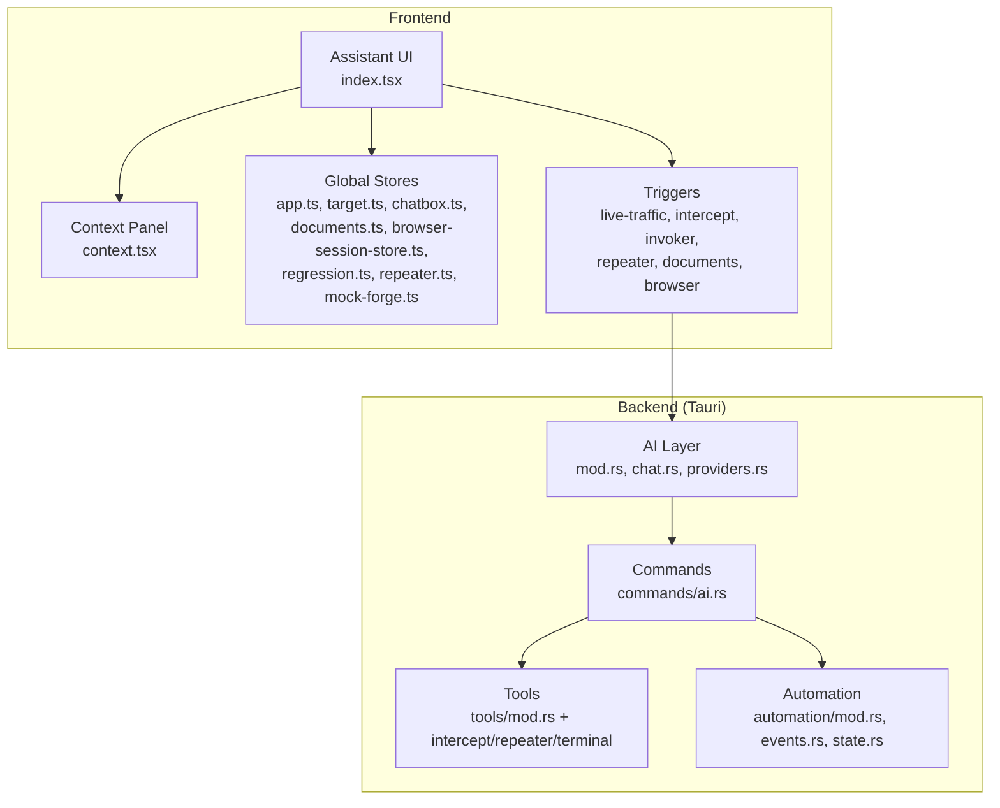
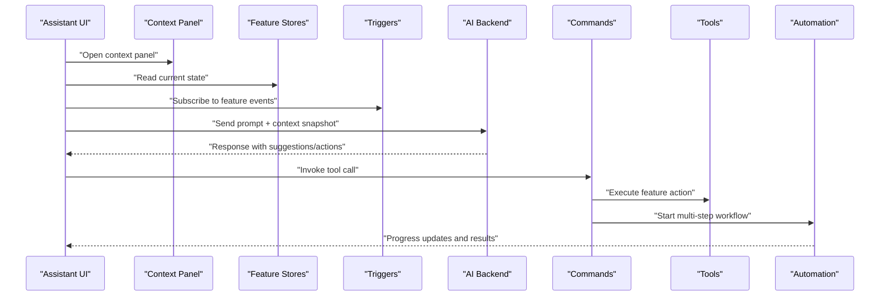
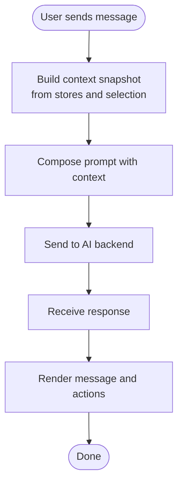
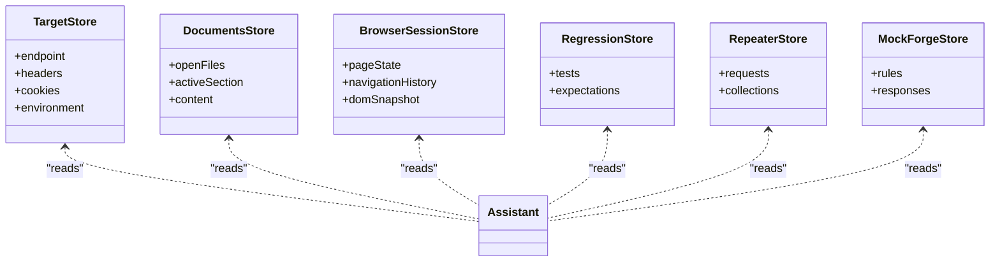
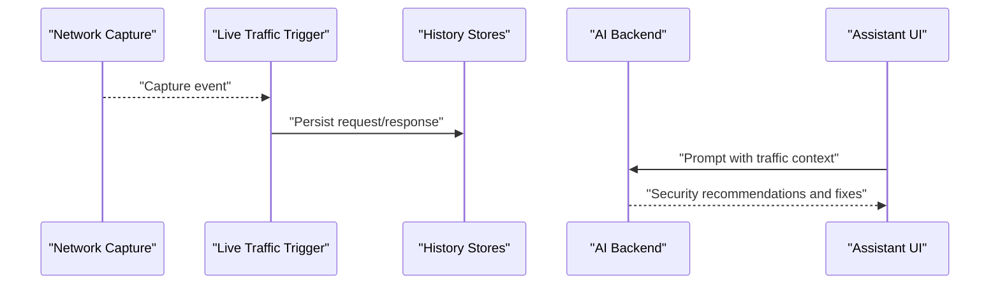
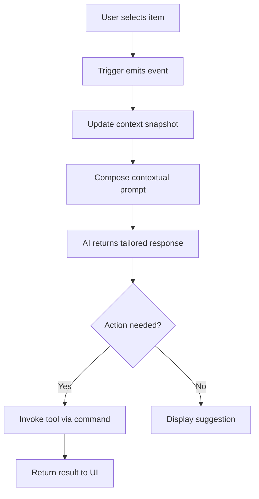
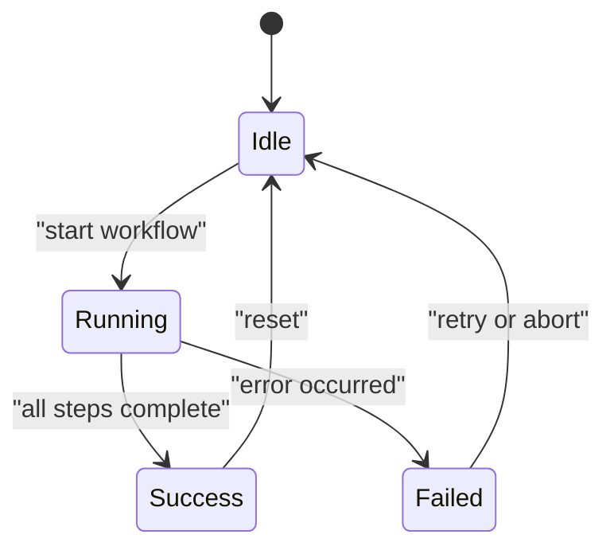
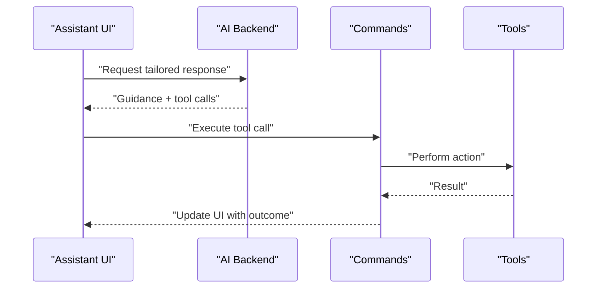
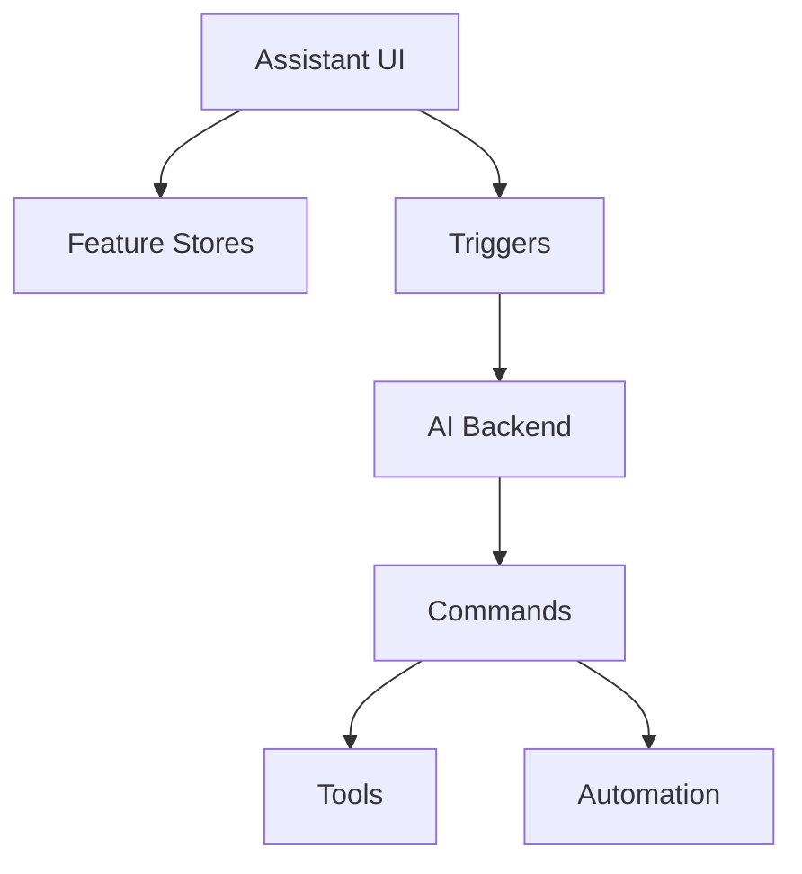

# Context-Aware Responses & Integration

<cite>
**Referenced Files in This Document**
- [src/layout/assistant/index.tsx](file://src/layout/assistant/index.tsx)
- [src/components/ai-elements/context.tsx](file://src/components/ai-elements/context.tsx)
- [src/stores/chatbox.ts](file://src/stores/chatbox.ts)
- [src/stores/app.ts](file://src/stores/app.ts)
- [src/stores/target.ts](file://src/stores/target.ts)
- [src/stores/history/http-query.ts](file://src/stores/history/http-query.ts)
- [src/stores/history/websocket-query.ts](file://src/stores/history/websocket-query.ts)
- [src/stores/documents.ts](file://src/stores/documents.ts)
- [src/stores/browser-session-store.ts](file://src/stores/browser-session-store.ts)
- [src/stores/regression.ts](file://src/stores/regression.ts)
- [src/stores/repeater.ts](file://src/stores/repeater.ts)
- [src/stores/mock-forge.ts](file://src/stores/mock-forge.ts)
- [src/stores/automation/index.ts](file://src/stores/automation/index.ts)
- [src/triggers/index.ts](file://src/triggers/index.ts)
- [src/triggers/live-traffic/captured.ts](file://src/triggers/live-traffic/captured.ts)
- [src/triggers/intercept/lifecycle.ts](file://src/triggers/intercept/lifecycle.ts)
- [src/triggers/invoker/attack.ts](file://src/triggers/invoker/attack.ts)
- [src/triggers/repeater/send-to.ts](file://src/triggers/repeater/send-to.ts)
- [src/triggers/repeater/craft.ts](file://src/triggers/repeater/craft.ts)
- [src/triggers/documents/sections.ts](file://src/triggers/documents/sections.ts)
- [src/triggers/browser/page-crawled.ts](file://src/triggers/browser/page-crawled.ts)
- [src-tauri/src/ai/mod.rs](file://src-tauri/src/ai/mod.rs)
- [src-tauri/src/ai/chat.rs](file://src-tauri/src/ai/chat.rs)
- [src-tauri/src/ai/providers.rs](file://src-tauri/src/ai/providers.rs)
- [src-tauri/src/commands/ai.rs](file://src-tauri/src/commands/ai.rs)
- [src-tauri/src/tools/mod.rs](file://src-tauri/src/tools/mod.rs)
- [src-tauri/src/tools/intercept.rs](file://src-tauri/src/tools/intercept.rs)
- [src-tauri/src/tools/repeater.rs](file://src-tauri/src/tools/repeater.rs)
- [src-tauri/src/tools/terminal.rs](file://src-tauri/src/tools/terminal.rs)
- [src-tauri/src/automation/mod.rs](file://src-tauri/src/automation/mod.rs)
- [src-tauri/src/automation/events.rs](file://src-tauri/src/automation/events.rs)
- [src-tauri/src/automation/state.rs](file://src-tauri/src/automation/state.rs)
</cite>

## Table of Contents
1. [Introduction](#introduction)
2. [Project Structure](#project-structure)
3. [Core Components](#core-components)
4. [Architecture Overview](#architecture-overview)
5. [Detailed Component Analysis](#detailed-component-analysis)
6. [Dependency Analysis](#dependency-analysis)
7. [Performance Considerations](#performance-considerations)
8. [Troubleshooting Guide](#troubleshooting-guide)
9. [Conclusion](#conclusion)

## Introduction
This document explains the context-aware response system that powers the AI assistant within Apprecon. It covers how the assistant understands and uses application context, maintains conversation history, and integrates with other features such as HTTP traffic inspection, browser automation, document editing, repeater crafting, mock generation, and terminal execution. The system extracts context from current application state, file content, network traffic, and user selections to tailor responses including code suggestions, security recommendations, and workflow automation steps.

## Project Structure
The context-aware system spans both the frontend (React/Tauri webview) and backend (Tauri Rust layer). Key areas include:
- Assistant UI and context panel for presenting and managing context
- Global stores for app state, targets, history, documents, and feature-specific stores
- Trigger system that emits events when users interact with features
- Tauri commands and tools that bridge frontend requests to backend capabilities
- Automation subsystem for orchestrating multi-step workflows

**Diagram sources**
- [src/layout/assistant/index.tsx](file://src/layout/assistant/index.tsx)
- [src/components/ai-elements/context.tsx](file://src/components/ai-elements/context.tsx)
- [src/stores/app.ts](file://src/stores/app.ts)
- [src/stores/target.ts](file://src/stores/target.ts)
- [src/stores/chatbox.ts](file://src/stores/chatbox.ts)
- [src/stores/documents.ts](file://src/stores/documents.ts)
- [src/stores/browser-session-store.ts](file://src/stores/browser-session-store.ts)
- [src/stores/regression.ts](file://src/stores/regression.ts)
- [src/stores/repeater.ts](file://src/stores/repeater.ts)
- [src/stores/mock-forge.ts](file://src/stores/mock-forge.ts)
- [src/triggers/index.ts](file://src/triggers/index.ts)
- [src-tauri/src/ai/mod.rs](file://src-tauri/src/ai/mod.rs)
- [src-tauri/src/ai/chat.rs](file://src-tauri/src/ai/chat.rs)
- [src-tauri/src/ai/providers.rs](file://src-tauri/src/ai/providers.rs)
- [src-tauri/src/commands/ai.rs](file://src-tauri/src/commands/ai.rs)
- [src-tauri/src/tools/mod.rs](file://src-tauri/src/tools/mod.rs)
- [src-tauri/src/automation/mod.rs](file://src-tauri/src/automation/mod.rs)

**Section sources**
- [src/layout/assistant/index.tsx](file://src/layout/assistant/index.tsx)
- [src/components/ai-elements/context.tsx](file://src/components/ai-elements/context.tsx)
- [src/stores/app.ts](file://src/stores/app.ts)
- [src/stores/target.ts](file://src/stores/target.ts)
- [src/stores/chatbox.ts](file://src/stores/chatbox.ts)
- [src/stores/documents.ts](file://src/stores/documents.ts)
- [src/stores/browser-session-store.ts](file://src/stores/browser-session-store.ts)
- [src/stores/regression.ts](file://src/stores/regression.ts)
- [src/stores/repeater.ts](file://src/stores/repeater.ts)
- [src/stores/mock-forge.ts](file://src/stores/mock-forge.ts)
- [src/triggers/index.ts](file://src/triggers/index.ts)
- [src-tauri/src/ai/mod.rs](file://src-tauri/src/ai/mod.rs)
- [src-tauri/src/ai/chat.rs](file://src-tauri/src/ai/chat.rs)
- [src-tauri/src/ai/providers.rs](file://src-tauri/src/ai/providers.rs)
- [src-tauri/src/commands/ai.rs](file://src-tauri/src/commands/ai.rs)
- [src-tauri/src/tools/mod.rs](file://src-tauri/src/tools/mod.rs)
- [src-tauri/src/automation/mod.rs](file://src-tauri/src/automation/mod.rs)

## Core Components
- Assistant UI and Context Panel: Presents the conversation and a contextual view of selected or relevant data.
- Chat Store: Maintains conversation history and message payloads.
- Feature Stores: Provide current application state (target, documents, browser session, repeater, mock forge, regression tests).
- Triggers: Emit events tied to user actions and feature lifecycle changes.
- AI Backend: Manages provider configuration, chat sessions, and command orchestration.
- Tools: Bridge between commands and feature-specific capabilities (e.g., intercept, repeater, terminal).
- Automation: Executes multi-step workflows triggered by commands or events.

Key responsibilities:
- Extracting context from stores and triggers
- Building prompts enriched with application state
- Returning tailored responses and actionable steps
- Invoking tools and automation to implement suggested actions

**Section sources**
- [src/layout/assistant/index.tsx](file://src/layout/assistant/index.tsx)
- [src/components/ai-elements/context.tsx](file://src/components/ai-elements/context.tsx)
- [src/stores/chatbox.ts](file://src/stores/chatbox.ts)
- [src/stores/app.ts](file://src/stores/app.ts)
- [src/stores/target.ts](file://src/stores/target.ts)
- [src/stores/documents.ts](file://src/stores/documents.ts)
- [src/stores/browser-session-store.ts](file://src/stores/browser-session-store.ts)
- [src/stores/regression.ts](file://src/stores/regression.ts)
- [src/stores/repeater.ts](file://src/stores/repeater.ts)
- [src/stores/mock-forge.ts](file://src/stores/mock-forge.ts)
- [src/triggers/index.ts](file://src/triggers/index.ts)
- [src-tauri/src/ai/mod.rs](file://src-tauri/src/ai/mod.rs)
- [src-tauri/src/ai/chat.rs](file://src-tauri/src/ai/chat.rs)
- [src-tauri/src/commands/ai.rs](file://src-tauri/src/commands/ai.rs)
- [src-tauri/src/tools/mod.rs](file://src-tauri/src/tools/mod.rs)
- [src-tauri/src/automation/mod.rs](file://src-tauri/src/automation/mod.rs)

## Architecture Overview
The assistant composes context from multiple sources and sends it to the AI backend. The backend responds with structured guidance and tool calls. Tools execute feature-specific actions, while automation orchestrates complex sequences.

**Diagram sources**
- [src/layout/assistant/index.tsx](file://src/layout/assistant/index.tsx)
- [src/components/ai-elements/context.tsx](file://src/components/ai-elements/context.tsx)
- [src/stores/chatbox.ts](file://src/stores/chatbox.ts)
- [src/triggers/index.ts](file://src/triggers/index.ts)
- [src-tauri/src/ai/chat.rs](file://src-tauri/src/ai/chat.rs)
- [src-tauri/src/commands/ai.rs](file://src-tauri/src/commands/ai.rs)
- [src-tauri/src/tools/mod.rs](file://src-tauri/src/tools/mod.rs)
- [src-tauri/src/automation/mod.rs](file://src-tauri/src/automation/mod.rs)

## Detailed Component Analysis

### Conversation Context Management
- Chat store maintains messages and metadata to preserve conversation continuity across interactions.
- Assistant UI renders messages and integrates with the context panel to show related artifacts.
- Context panel aggregates relevant snapshots (selected items, active tab, recent traffic) to enrich prompts.

**Diagram sources**
- [src/stores/chatbox.ts](file://src/stores/chatbox.ts)
- [src/components/ai-elements/context.tsx](file://src/components/ai-elements/context.tsx)
- [src/layout/assistant/index.tsx](file://src/layout/assistant/index.tsx)

**Section sources**
- [src/stores/chatbox.ts](file://src/stores/chatbox.ts)
- [src/components/ai-elements/context.tsx](file://src/components/ai-elements/context.tsx)
- [src/layout/assistant/index.tsx](file://src/layout/assistant/index.tsx)

### Context Extraction from Application State
- Target store provides current endpoint, headers, cookies, and environment details.
- Documents store exposes open files and sections for code-aware suggestions.
- Browser session store captures page state, DOM context, and navigation history.
- Regression store holds test cases and expectations for security-focused feedback.
- Repeater and Mock Forge stores expose crafted requests and mocks for precise suggestions.

**Diagram sources**
- [src/stores/target.ts](file://src/stores/target.ts)
- [src/stores/documents.ts](file://src/stores/documents.ts)
- [src/stores/browser-session-store.ts](file://src/stores/browser-session-store.ts)
- [src/stores/regression.ts](file://src/stores/regression.ts)
- [src/stores/repeater.ts](file://src/stores/repeater.ts)
- [src/stores/mock-forge.ts](file://src/stores/mock-forge.ts)

**Section sources**
- [src/stores/target.ts](file://src/stores/target.ts)
- [src/stores/documents.ts](file://src/stores/documents.ts)
- [src/stores/browser-session-store.ts](file://src/stores/browser-session-store.ts)
- [src/stores/regression.ts](file://src/stores/regression.ts)
- [src/stores/repeater.ts](file://src/stores/repeater.ts)
- [src/stores/mock-forge.ts](file://src/stores/mock-forge.ts)

### Network Traffic Context
- Live traffic captured via triggers injects request/response snapshots into context.
- Intercept lifecycle hooks provide interception points and modification opportunities.
- History queries allow retrieving past traffic for comparative analysis.

**Diagram sources**
- [src/triggers/live-traffic/captured.ts](file://src/triggers/live-traffic/captured.ts)
- [src/triggers/intercept/lifecycle.ts](file://src/triggers/intercept/lifecycle.ts)
- [src/stores/history/http-query.ts](file://src/stores/history/http-query.ts)
- [src/stores/history/websocket-query.ts](file://src/stores/history/websocket-query.ts)
- [src-tauri/src/ai/chat.rs](file://src-tauri/src/ai/chat.rs)

**Section sources**
- [src/triggers/live-traffic/captured.ts](file://src/triggers/live-traffic/captured.ts)
- [src/triggers/intercept/lifecycle.ts](file://src/triggers/intercept/lifecycle.ts)
- [src/stores/history/http-query.ts](file://src/stores/history/http-query.ts)
- [src/stores/history/websocket-query.ts](file://src/stores/history/websocket-query.ts)

### User Selections and Cross-Feature Integration
- Triggers emit events when users select items in various panels (e.g., invoker attack, repeater send-to, document sections).
- Assistant consumes these events to build targeted prompts and suggest next steps.
- Commands invoke tools to perform actions like sending requests, generating mocks, or running terminal commands.

**Diagram sources**
- [src/triggers/invoker/attack.ts](file://src/triggers/invoker/attack.ts)
- [src/triggers/repeater/send-to.ts](file://src/triggers/repeater/send-to.ts)
- [src/triggers/repeater/craft.ts](file://src/triggers/repeater/craft.ts)
- [src/triggers/documents/sections.ts](file://src/triggers/documents/sections.ts)
- [src-tauri/src/commands/ai.rs](file://src-tauri/src/commands/ai.rs)
- [src-tauri/src/tools/mod.rs](file://src-tauri/src/tools/mod.rs)

**Section sources**
- [src/triggers/invoker/attack.ts](file://src/triggers/invoker/attack.ts)
- [src/triggers/repeater/send-to.ts](file://src/triggers/repeater/send-to.ts)
- [src/triggers/repeater/craft.ts](file://src/triggers/repeater/craft.ts)
- [src/triggers/documents/sections.ts](file://src/triggers/documents/sections.ts)
- [src-tauri/src/commands/ai.rs](file://src-tauri/src/commands/ai.rs)
- [src-tauri/src/tools/mod.rs](file://src-tauri/src/tools/mod.rs)

### Multi-Step Workflows and Automation
- Automation subsystem coordinates sequences of actions based on AI suggestions or trigger events.
- Events define conditions and outcomes; state tracks progress and persistence.
- Commands can start automation flows that update UI and return intermediate results.

**Diagram sources**
- [src-tauri/src/automation/mod.rs](file://src-tauri/src/automation/mod.rs)
- [src-tauri/src/automation/events.rs](file://src-tauri/src/automation/events.rs)
- [src-tauri/src/automation/state.rs](file://src-tauri/src/automation/state.rs)

**Section sources**
- [src-tauri/src/automation/mod.rs](file://src-tauri/src/automation/mod.rs)
- [src-tauri/src/automation/events.rs](file://src-tauri/src/automation/events.rs)
- [src-tauri/src/automation/state.rs](file://src/tauri/src/automation/state.rs)

### Tailored Responses: Code Suggestions, Security Recommendations, Workflow Steps
- AI backend leverages provider configurations and chat sessions to generate responses.
- Tools enable direct integration with intercept rules, repeater requests, and terminal execution.
- Responses include actionable steps, code snippets references, and links to relevant stores.

**Diagram sources**
- [src-tauri/src/ai/providers.rs](file://src-tauri/src/ai/providers.rs)
- [src-tauri/src/ai/chat.rs](file://src-tauri/src/ai/chat.rs)
- [src-tauri/src/commands/ai.rs](file://src-tauri/src/commands/ai.rs)
- [src-tauri/src/tools/intercept.rs](file://src-tauri/src/tools/intercept.rs)
- [src-tauri/src/tools/repeater.rs](file://src-tauri/src/tools/repeater.rs)
- [src-tauri/src/tools/terminal.rs](file://src-tauri/src/tools/terminal.rs)

**Section sources**
- [src-tauri/src/ai/providers.rs](file://src-tauri/src/ai/providers.rs)
- [src-tauri/src/ai/chat.rs](file://src-tauri/src/ai/chat.rs)
- [src-tauri/src/commands/ai.rs](file://src-tauri/src/commands/ai.rs)
- [src-tauri/src/tools/intercept.rs](file://src-tauri/src/tools/intercept.rs)
- [src-tauri/src/tools/repeater.rs](file://src-tauri/src/tools/repeater.rs)
- [src-tauri/src/tools/terminal.rs](file://src-tauri/src/tools/terminal.rs)

### Examples of Contextual Commands and Workflows
- “Analyze this request” uses live traffic context to suggest security improvements and payload adjustments.
- “Generate a mock for this endpoint” leverages repeater and mock forge stores to create consistent responses.
- “Run terminal command to fix dependency” invokes terminal tool with context from project files and errors.
- “Create a regression test” uses regression store and intercepted traffic to produce test cases.

These examples demonstrate how context drives precise, actionable outputs and seamless cross-feature integration.

[No sources needed since this section summarizes usage patterns without analyzing specific files]

## Dependency Analysis
The assistant depends on stores for state, triggers for events, and Tauri commands/tools for execution. The AI backend coordinates provider settings and chat sessions.

**Diagram sources**
- [src/layout/assistant/index.tsx](file://src/layout/assistant/index.tsx)
- [src/stores/app.ts](file://src/stores/app.ts)
- [src/triggers/index.ts](file://src/triggers/index.ts)
- [src-tauri/src/ai/mod.rs](file://src-tauri/src/ai/mod.rs)
- [src-tauri/src/commands/ai.rs](file://src-tauri/src/commands/ai.rs)
- [src-tauri/src/tools/mod.rs](file://src-tauri/src/tools/mod.rs)
- [src-tauri/src/automation/mod.rs](file://src-tauri/src/automation/mod.rs)

**Section sources**
- [src/layout/assistant/index.tsx](file://src/layout/assistant/index.tsx)
- [src/stores/app.ts](file://src/stores/app.ts)
- [src/triggers/index.ts](file://src/triggers/index.ts)
- [src-tauri/src/ai/mod.rs](file://src-tauri/src/ai/mod.rs)
- [src-tauri/src/commands/ai.rs](file://src-tauri/src/commands/ai.rs)
- [src-tauri/src/tools/mod.rs](file://src-tauri/src/tools/mod.rs)
- [src-tauri/src/automation/mod.rs](file://src/tauri/src/automation/mod.rs)

## Performance Considerations
- Minimize context payload size by selecting only relevant fields per prompt.
- Debounce trigger emissions to avoid excessive re-computation.
- Cache frequently used snapshots (e.g., target headers) to reduce overhead.
- Stream responses where possible to improve perceived latency.

[No sources needed since this section provides general guidance]

## Troubleshooting Guide
- If context is missing, verify stores are updated before prompting and ensure triggers subscribe correctly.
- For failed tool executions, check command routing and tool availability in the backend.
- When automation stalls, inspect event definitions and state transitions for correctness.
- Review AI provider configuration and chat session integrity if responses are inconsistent.

**Section sources**
- [src/stores/chatbox.ts](file://src/stores/chatbox.ts)
- [src/triggers/index.ts](file://src/triggers/index.ts)
- [src-tauri/src/commands/ai.rs](file://src-tauri/src/commands/ai.rs)
- [src-tauri/src/tools/mod.rs](file://src-tauri/src/tools/mod.rs)
- [src-tauri/src/automation/events.rs](file://src-tauri/src/automation/events.rs)
- [src-tauri/src/automation/state.rs](file://src-tauri/src/automation/state.rs)

## Conclusion
The context-aware response system integrates application state, network traffic, and user selections to deliver precise, actionable AI assistance. By leveraging stores, triggers, commands, tools, and automation, the assistant tailors responses for code suggestions, security recommendations, and workflow automation, enabling seamless cross-feature collaboration within Apprecon.

[No sources needed since this section summarizes without analyzing specific files]