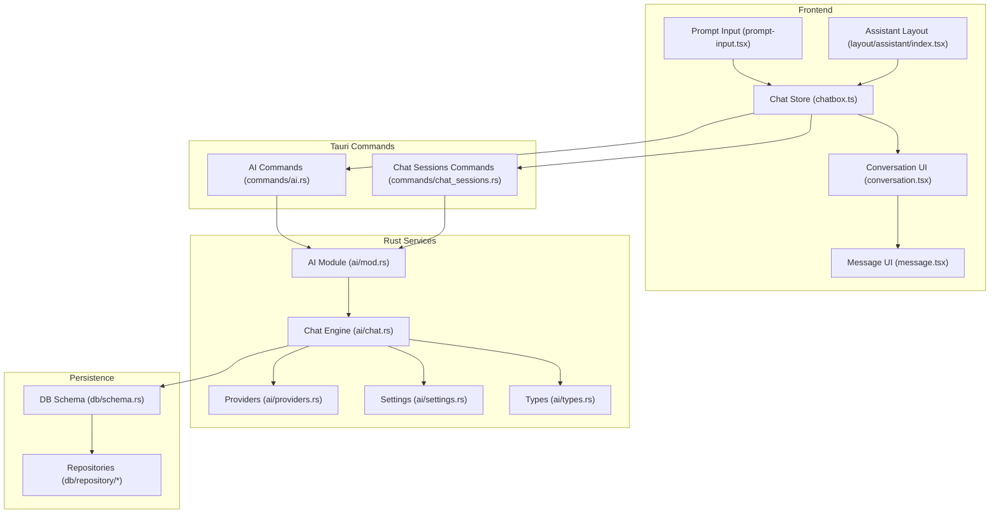
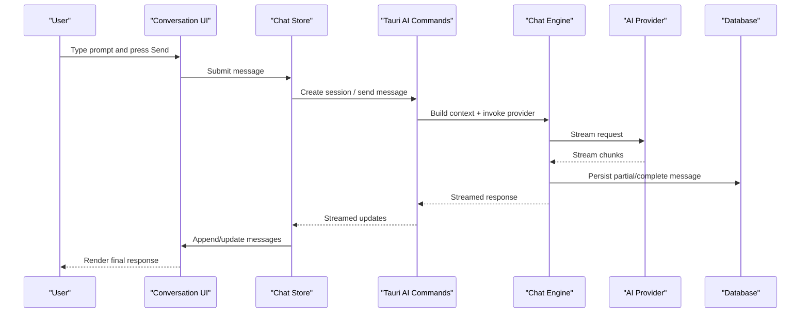
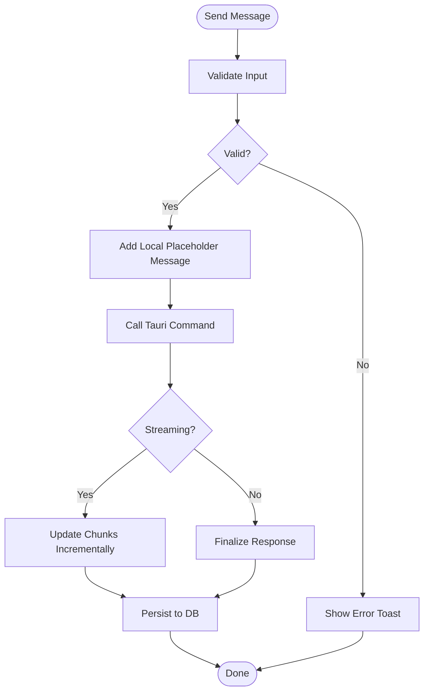
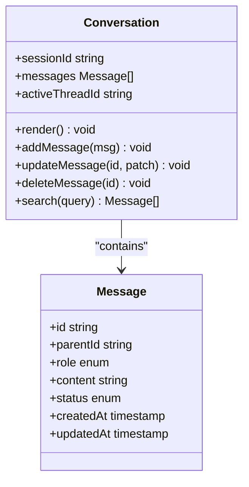
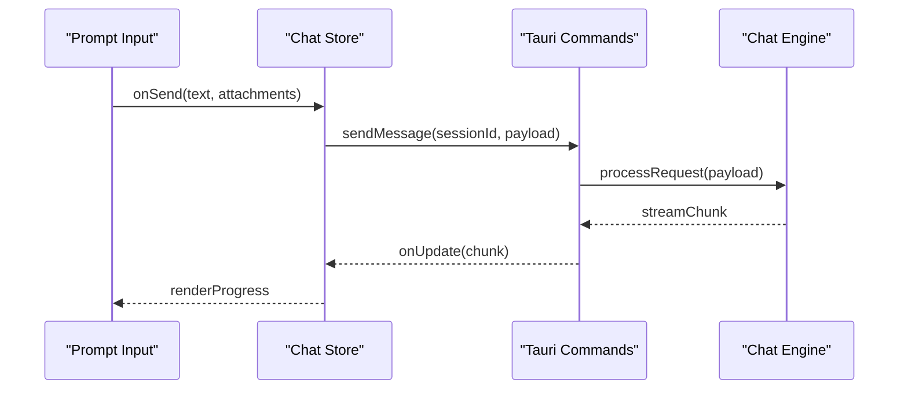
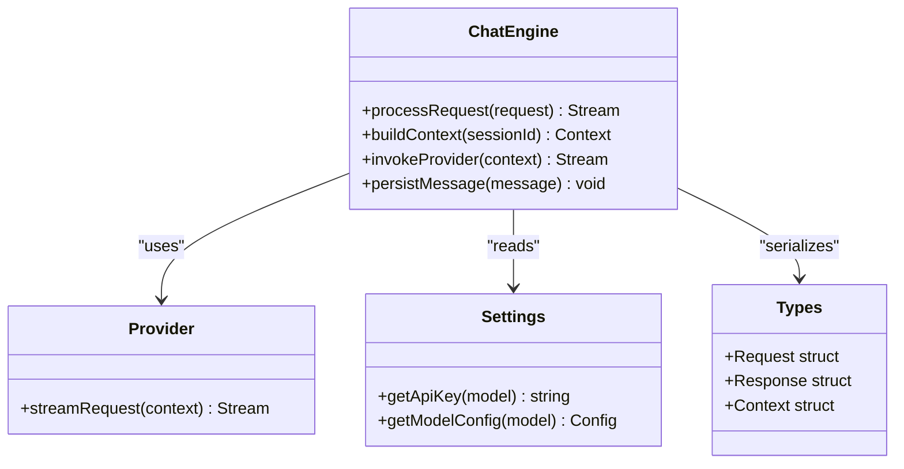
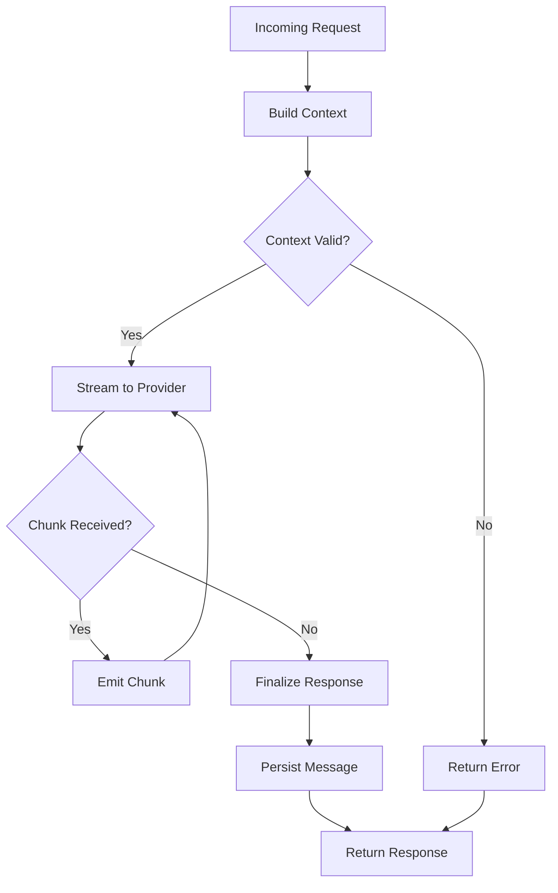
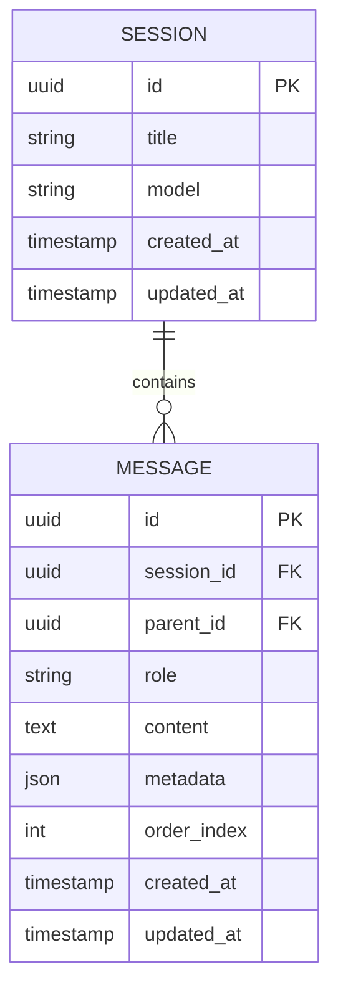
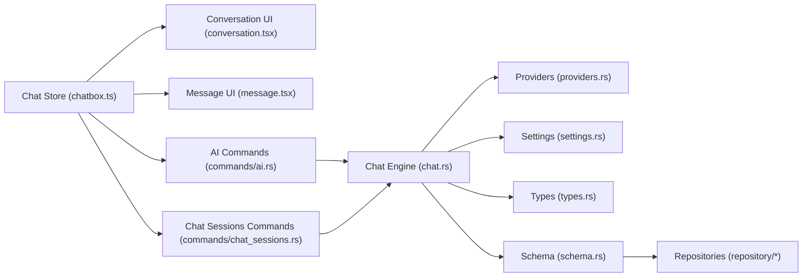

# Conversation Management & State

<cite>
**Referenced Files in This Document**
- [chatbox.ts](file://src/stores/chatbox.ts)
- [conversation.tsx](file://src/components/ai-elements/conversation.tsx)
- [message.tsx](file://src/components/ai-elements/message.tsx)
- [prompt-input.tsx](file://src/components/ai-elements/prompt-input.tsx)
- [index.ts](file://src/layout/assistant/index.tsx)
- [types.ts](file://src/layout/assistant/types.ts)
- [constants.ts](file://src/layout/assistant/constants.ts)
- [lib/context.mjs](file://.gemini/skills/impeccable/scripts/lib/context.mjs)
- [live-server.mjs](file://.agents/skills/impeccable/scripts/live/live-server.mjs)
- [session-store.mjs](file://.agents/skills/impeccable/scripts/live/session-store.mjs)
- [mod.rs](file://src-tauri/src/ai/mod.rs)
- [chat.rs](file://src-tauri/src/ai/chat.rs)
- [providers.rs](file://src-tauri/src/ai/providers.rs)
- [settings.rs](file://src-tauri/src/ai/settings.rs)
- [types.rs](file://src-tauri/src/ai/types.rs)
- [commands/ai.rs](file://src-tauri/src/commands/ai.rs)
- [commands/chat_sessions.rs](file://src-tauri/src/commands/chat_sessions.rs)
- [db/schema.rs](file://src-tauri/src/db/schema.rs)
- [db/repository/](file://src-tauri/src/db/repository/)
</cite>

## Table of Contents
1. [Introduction](#introduction)
2. [Project Structure](#project-structure)
3. [Core Components](#core-components)
4. [Architecture Overview](#architecture-overview)
5. [Detailed Component Analysis](#detailed-component-analysis)
6. [Dependency Analysis](#dependency-analysis)
7. [Performance Considerations](#performance-considerations)
8. [Troubleshooting Guide](#troubleshooting-guide)
9. [Conclusion](#conclusion)
10. [Appendices](#appendices)

## Introduction
This document explains how conversation management and state handling are implemented across the frontend and Rust backend for the AI assistant. It covers the chat store architecture, message persistence, session management, request/response flows, context management, error handling, threading, message ordering, real-time synchronization, search functionality, and strategies for long conversations and memory management.

## Project Structure
The conversation system spans three layers:
- Frontend UI and state: React components and stores manage user interactions, local state, and rendering.
- Tauri commands and Rust services: Handle requests, orchestrate providers, persist sessions/messages, and expose APIs to the frontend.
- Persistence layer: Database schema and repositories store sessions and messages reliably.

**Diagram sources**
- [chatbox.ts](file://src/stores/chatbox.ts)
- [conversation.tsx](file://src/components/ai-elements/conversation.tsx)
- [message.tsx](file://src/components/ai-elements/message.tsx)
- [prompt-input.tsx](file://src/components/ai-elements/prompt-input.tsx)
- [index.ts](file://src/layout/assistant/index.tsx)
- [commands/ai.rs](file://src-tauri/src/commands/ai.rs)
- [commands/chat_sessions.rs](file://src-tauri/src/commands/chat_sessions.rs)
- [mod.rs](file://src-tauri/src/ai/mod.rs)
- [chat.rs](file://src-tauri/src/ai/chat.rs)
- [providers.rs](file://src-tauri/src/ai/providers.rs)
- [settings.rs](file://src-tauri/src/ai/settings.rs)
- [types.rs](file://src-tauri/src/ai/types.rs)
- [schema.rs](file://src-tauri/src/db/schema.rs)
- [repository/](file://src-tauri/src/db/repository/)

**Section sources**
- [chatbox.ts](file://src/stores/chatbox.ts)
- [conversation.tsx](file://src/components/ai-elements/conversation.tsx)
- [message.tsx](file://src/components/ai-elements/message.tsx)
- [prompt-input.tsx](file://src/components/ai-elements/prompt-input.tsx)
- [index.ts](file://src/layout/assistant/index.tsx)
- [commands/ai.rs](file://src-tauri/src/commands/ai.rs)
- [commands/chat_sessions.rs](file://src-tauri/src/commands/chat_sessions.rs)
- [mod.rs](file://src-tauri/src/ai/mod.rs)
- [chat.rs](file://src-tauri/src/ai/chat.rs)
- [providers.rs](file://src-tauri/src/ai/providers.rs)
- [settings.rs](file://src-tauri/src/ai/settings.rs)
- [types.rs](file://src-tauri/src/ai/types.rs)
- [schema.rs](file://src-tauri/src/db/schema.rs)
- [repository/](file://src-tauri/src/db/repository/)

## Core Components
- Chat Store (frontend): Centralized state for active session, messages, streaming updates, and operations like sending, editing, deleting, and searching.
- Conversation UI: Renders thread-like conversations with ordered messages, supports inline actions, and integrates with input controls.
- Message UI: Displays individual messages with rich content and status indicators.
- Prompt Input: Captures user input, handles attachments, and triggers send flow.
- Assistant Layout: Orchestrates the assistant view, manages tabs or panels, and wires up global shortcuts.
- Tauri AI Commands: Expose functions to create/list sessions, send messages, stream responses, and manage settings.
- Rust Chat Engine: Builds context, invokes providers, streams responses, and persists messages.
- Providers: Abstraction over different AI backends; configuration and selection handled via settings.
- Settings: Manage API keys, model selection, and runtime options.
- Types: Shared data structures between frontend and backend for consistency.
- DB Schema and Repositories: Define tables and implement CRUD for sessions and messages.

**Section sources**
- [chatbox.ts](file://src/stores/chatbox.ts)
- [conversation.tsx](file://src/components/ai-elements/conversation.tsx)
- [message.tsx](file://src/components/ai-elements/message.tsx)
- [prompt-input.tsx](file://src/components/ai-elements/prompt-input.tsx)
- [index.ts](file://src/layout/assistant/index.tsx)
- [commands/ai.rs](file://src-tauri/src/commands/ai.rs)
- [commands/chat_sessions.rs](file://src-tauri/src/commands/chat_sessions.rs)
- [chat.rs](file://src-tauri/src/ai/chat.rs)
- [providers.rs](file://src-tauri/src/ai/providers.rs)
- [settings.rs](file://src-tauri/src/ai/settings.rs)
- [types.rs](file://src-tauri/src/ai/types.rs)
- [schema.rs](file://src-tauri/src/db/schema.rs)
- [repository/](file://src-tauri/src/db/repository/)

## Architecture Overview
The conversation flow is a multi-step pipeline from UI to provider and back, with persistence at each stage.

**Diagram sources**
- [conversation.tsx](file://src/components/ai-elements/conversation.tsx)
- [chatbox.ts](file://src/stores/chatbox.ts)
- [commands/ai.rs](file://src-tauri/src/commands/ai.rs)
- [chat.rs](file://src-tauri/src/ai/chat.rs)
- [providers.rs](file://src-tauri/src/ai/providers.rs)
- [schema.rs](file://src-tauri/src/db/schema.rs)
- [repository/](file://src-tauri/src/db/repository/)

## Detailed Component Analysis

### Chat Store Architecture (Frontend)
Responsibilities:
- Maintain current session ID and list of messages.
- Manage streaming state for incremental updates.
- Provide methods to send, edit, delete, and search messages.
- Coordinate with Tauri commands for persistence and provider calls.

Key patterns:
- Immutable updates for performance.
- Debounced search on large histories.
- Optimistic UI updates with rollback on errors.

**Diagram sources**
- [chatbox.ts](file://src/stores/chatbox.ts)
- [commands/ai.rs](file://src-tauri/src/commands/ai.rs)

**Section sources**
- [chatbox.ts](file://src/stores/chatbox.ts)

### Conversation UI and Threading
- Renders messages in order using stable IDs and timestamps.
- Supports threaded replies by grouping related messages under a parent ID.
- Handles real-time updates without re-rendering entire lists.

**Diagram sources**
- [conversation.tsx](file://src/components/ai-elements/conversation.tsx)
- [message.tsx](file://src/components/ai-elements/message.tsx)

**Section sources**
- [conversation.tsx](file://src/components/ai-elements/conversation.tsx)
- [message.tsx](file://src/components/ai-elements/message.tsx)

### Prompt Input and Real-Time Synchronization
- Captures text, attachments, and metadata.
- Triggers send flow and subscribes to streaming updates.
- Ensures consistent ordering and deduplication.

**Diagram sources**
- [prompt-input.tsx](file://src/components/ai-elements/prompt-input.tsx)
- [chatbox.ts](file://src/stores/chatbox.ts)
- [commands/ai.rs](file://src-tauri/src/commands/ai.rs)
- [chat.rs](file://src-tauri/src/ai/chat.rs)

**Section sources**
- [prompt-input.tsx](file://src/components/ai-elements/prompt-input.tsx)
- [chatbox.ts](file://src/stores/chatbox.ts)
- [commands/ai.rs](file://src-tauri/src/commands/ai.rs)
- [chat.rs](file://src-tauri/src/ai/chat.rs)

### Assistant Layout Integration
- Manages layout state, tab switching, and global shortcuts.
- Wires up chat store to UI components and command handlers.

**Section sources**
- [index.ts](file://src/layout/assistant/index.tsx)
- [types.ts](file://src/layout/assistant/types.ts)
- [constants.ts](file://src/layout/assistant/constants.ts)

### Rust Backend Chat Processing
Responsibilities:
- Receive requests from Tauri commands.
- Build context from session history and environment variables.
- Invoke selected provider with streaming support.
- Persist messages and handle errors consistently.

**Diagram sources**
- [chat.rs](file://src-tauri/src/ai/chat.rs)
- [providers.rs](file://src-tauri/src/ai/providers.rs)
- [settings.rs](file://src-tauri/src/ai/settings.rs)
- [types.rs](file://src-tauri/src/ai/types.rs)

**Section sources**
- [mod.rs](file://src-tauri/src/ai/mod.rs)
- [chat.rs](file://src-tauri/src/ai/chat.rs)
- [providers.rs](file://src-tauri/src/ai/providers.rs)
- [settings.rs](file://src-tauri/src/ai/settings.rs)
- [types.rs](file://src-tauri/src/ai/types.rs)

### Request/Response Handling and Context Management
- Requests include session ID, role, content, and optional attachments.
- Context aggregates recent messages, environment variables, and tool outputs.
- Responses stream chunks and finalize with complete content and metadata.

**Diagram sources**
- [commands/ai.rs](file://src-tauri/src/commands/ai.rs)
- [chat.rs](file://src-tauri/src/ai/chat.rs)

**Section sources**
- [commands/ai.rs](file://src-tauri/src/commands/ai.rs)
- [chat.rs](file://src-tauri/src/ai/chat.rs)

### Session Management and Persistence
- Sessions represent independent conversations with unique IDs.
- Messages are stored with ordering fields and parent-child relationships for threads.
- Repositories provide efficient queries for pagination and search.

**Diagram sources**
- [schema.rs](file://src-tauri/src/db/schema.rs)
- [repository/](file://src-tauri/src/db/repository/)

**Section sources**
- [commands/chat_sessions.rs](file://src-tauri/src/commands/chat_sessions.rs)
- [schema.rs](file://src-tauri/src/db/schema.rs)
- [repository/](file://src-tauri/src/db/repository/)

### Conversation Threading and Message Ordering
- Threaded replies use parent_id to group related messages.
- Order index ensures deterministic display order within threads.
- UI renders threads hierarchically while preserving chronological order.

**Section sources**
- [conversation.tsx](file://src/components/ai-elements/conversation.tsx)
- [message.tsx](file://src/components/ai-elements/message.tsx)
- [schema.rs](file://src-tauri/src/db/schema.rs)

### Real-Time Synchronization Between Frontend and Backend
- Streaming updates are emitted from backend and consumed incrementally by the store.
- Deduplication prevents duplicate chunks and maintains consistent state.
- Error events trigger UI feedback and potential retry logic.

**Section sources**
- [chatbox.ts](file://src/stores/chatbox.ts)
- [commands/ai.rs](file://src-tauri/src/commands/ai.rs)
- [chat.rs](file://src-tauri/src/ai/chat.rs)

### Managing Multiple Conversations
- The store maintains a map of sessions keyed by ID.
- Switching sessions loads messages efficiently via paginated queries.
- Active session is persisted to avoid losing focus.

**Section sources**
- [chatbox.ts](file://src/stores/chatbox.ts)
- [commands/chat_sessions.rs](file://src-tauri/src/commands/chat_sessions.rs)

### Implementing Search Functionality
- Client-side search uses debounced queries against local message arrays.
- Server-side search leverages indexed columns for performance on large histories.
- Results highlight matching segments and navigate to relevant messages.

**Section sources**
- [chatbox.ts](file://src/stores/chatbox.ts)
- [schema.rs](file://src-tauri/src/db/schema.rs)
- [repository/](file://src-tauri/src/db/repository/)

### Handling Large Conversation Histories
- Pagination loads initial chunks and lazy-loads older messages.
- Virtualization reduces DOM size for smooth scrolling.
- Memory management trims old messages when thresholds are exceeded.

**Section sources**
- [conversation.tsx](file://src/components/ai-elements/conversation.tsx)
- [chatbox.ts](file://src/stores/chatbox.ts)
- [schema.rs](file://src-tauri/src/db/schema.rs)

## Dependency Analysis

**Diagram sources**
- [chatbox.ts](file://src/stores/chatbox.ts)
- [conversation.tsx](file://src/components/ai-elements/conversation.tsx)
- [message.tsx](file://src/components/ai-elements/message.tsx)
- [commands/ai.rs](file://src-tauri/src/commands/ai.rs)
- [commands/chat_sessions.rs](file://src-tauri/src/commands/chat_sessions.rs)
- [chat.rs](file://src-tauri/src/ai/chat.rs)
- [providers.rs](file://src-tauri/src/ai/providers.rs)
- [settings.rs](file://src-tauri/src/ai/settings.rs)
- [types.rs](file://src-tauri/src/ai/types.rs)
- [schema.rs](file://src-tauri/src/db/schema.rs)
- [repository/](file://src-tauri/src/db/repository/)

**Section sources**
- [chatbox.ts](file://src/stores/chatbox.ts)
- [commands/ai.rs](file://src-tauri/src/commands/ai.rs)
- [commands/chat_sessions.rs](file://src-tauri/src/commands/chat_sessions.rs)
- [chat.rs](file://src-tauri/src/ai/chat.rs)
- [providers.rs](file://src-tauri/src/ai/providers.rs)
- [settings.rs](file://src-tauri/src/ai/settings.rs)
- [types.rs](file://src-tauri/src/ai/types.rs)
- [schema.rs](file://src/t