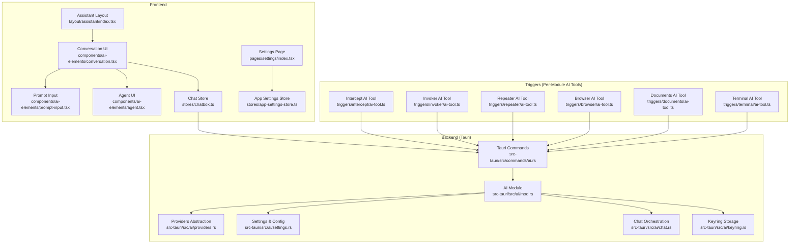
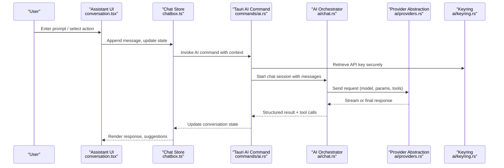
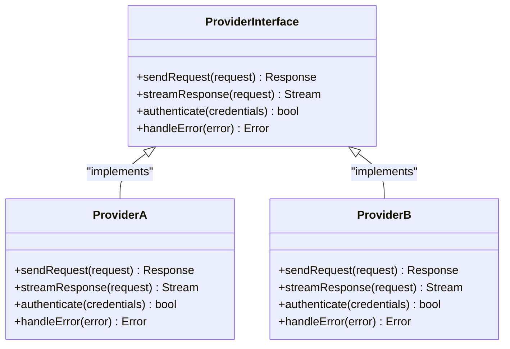
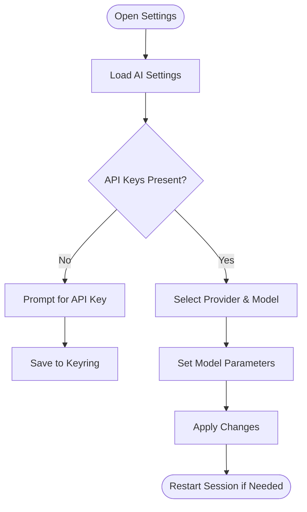
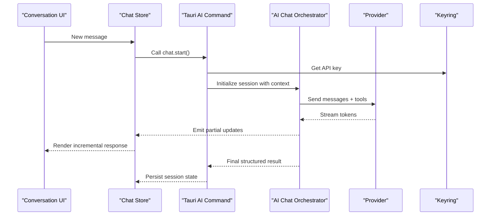
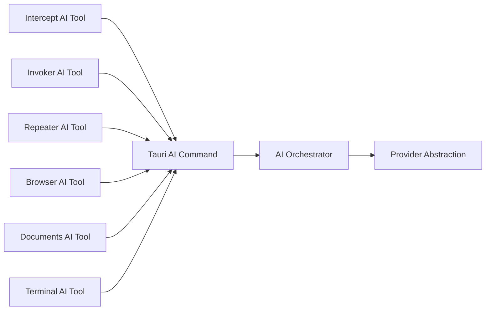
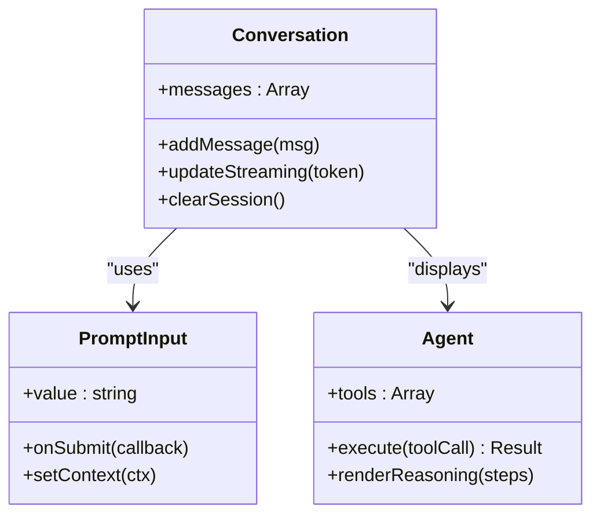
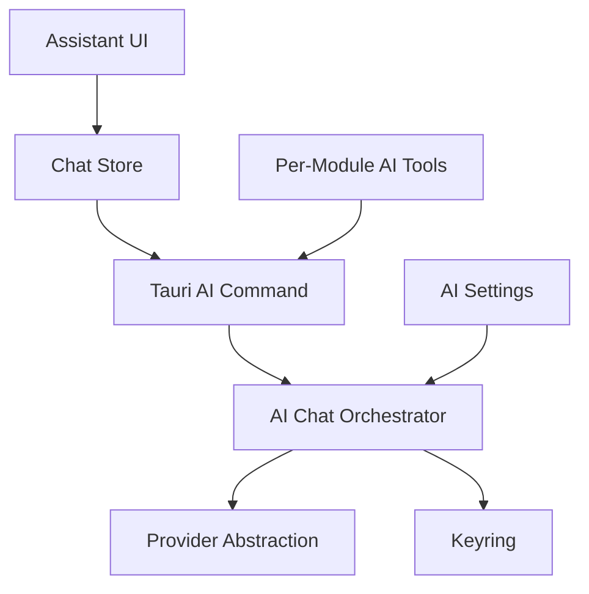

# AI Integration & Automation

<cite>
**Referenced Files in This Document**
- [src-tauri/src/ai/mod.rs](file://src-tauri/src/ai/mod.rs)
- [src-tauri/src/ai/providers.rs](file://src-tauri/src/ai/providers.rs)
- [src-tauri/src/ai/settings.rs](file://src-tauri/src/ai/settings.rs)
- [src-tauri/src/ai/chat.rs](file://src-tauri/src/ai/chat.rs)
- [src-tauri/src/ai/commands.rs](file://src-tauri/src/ai/commands.rs)
- [src-tauri/src/ai/keyring.rs](file://src-tauri/src/ai/keyring.rs)
- [src-tauri/src/commands/ai.rs](file://src-tauri/src/commands/ai.rs)
- [src/components/ai-elements/agent.tsx](file://src/components/ai-elements/agent.tsx)
- [src/components/ai-elements/conversation.tsx](file://src/components/ai-elements/conversation.tsx)
- [src/components/ai-elements/prompt-input.tsx](file://src/components/ai-elements/prompt-input.tsx)
- [src/layout/assistant/index.tsx](file://src/layout/assistant/index.tsx)
- [src/stores/chatbox.ts](file://src/stores/chatbox.ts)
- [src/triggers/intercept/ai-tool.ts](file://src/triggers/intercept/ai-tool.ts)
- [src/triggers/invoker/ai-tool.ts](file://src/triggers/invoker/ai-tool.ts)
- [src/triggers/repeater/ai-tool.ts](file://src/triggers/repeater/ai-tool.ts)
- [src/triggers/browser/ai-tool.ts](file://src/triggers/browser/ai-tool.ts)
- [src/triggers/documents/ai-tool.ts](file://src/triggers/documents/ai-tool.ts)
- [src/triggers/terminal/ai-tool.ts](file://src/triggers/terminal/ai-tool.ts)
- [src/pages/settings/index.tsx](file://src/pages/settings/index.tsx)
- [src/stores/app-settings-store.ts](file://src/stores/app-settings-store.ts)
</cite>

## Table of Contents
1. [Introduction](#introduction)
2. [Project Structure](#project-structure)
3. [Core Components](#core-components)
4. [Architecture Overview](#architecture-overview)
5. [Detailed Component Analysis](#detailed-component-analysis)
6. [Dependency Analysis](#dependency-analysis)
7. [Performance Considerations](#performance-considerations)
8. [Troubleshooting Guide](#troubleshooting-guide)
9. [Conclusion](#conclusion)
10. [Appendices](#appendices)

## Introduction
This document explains Apprecon’s AI-powered features and automation capabilities, including the integrated AI assistant for natural language commands, automated security analysis, intelligent recommendations, and cross-module AI tool integrations. It covers prompt engineering practices for security testing, automation workflows powered by AI, configuration of AI providers and API key management, privacy considerations, limitations, best practices, and troubleshooting guidance.

## Project Structure
Apprecon implements AI functionality across both the Rust backend (Tauri) and the React frontend:
- Backend AI core: provider abstraction, settings, chat orchestration, Tauri command exposure, and secure key storage.
- Frontend AI UI: assistant layout, conversation components, prompt input, and per-module AI tools exposed via triggers.
- Settings and stores: centralized configuration for AI providers and runtime state for conversations.

**Diagram sources**
- [src/layout/assistant/index.tsx](file://src/layout/assistant/index.tsx)
- [src/components/ai-elements/conversation.tsx](file://src/components/ai-elements/conversation.tsx)
- [src/components/ai-elements/prompt-input.tsx](file://src/components/ai-elements/prompt-input.tsx)
- [src/components/ai-elements/agent.tsx](file://src/components/ai-elements/agent.tsx)
- [src/stores/chatbox.ts](file://src/stores/chatbox.ts)
- [src/pages/settings/index.tsx](file://src/pages/settings/index.tsx)
- [src/stores/app-settings-store.ts](file://src/stores/app-settings-store.ts)
- [src-tauri/src/ai/mod.rs](file://src-tauri/src/ai/mod.rs)
- [src-tauri/src/ai/providers.rs](file://src-tauri/src/ai/providers.rs)
- [src-tauri/src/ai/settings.rs](file://src-tauri/src/ai/settings.rs)
- [src-tauri/src/ai/chat.rs](file://src-tauri/src/ai/chat.rs)
- [src-tauri/src/commands/ai.rs](file://src-tauri/src/commands/ai.rs)
- [src-tauri/src/ai/keyring.rs](file://src-tauri/src/ai/keyring.rs)
- [src/triggers/intercept/ai-tool.ts](file://src/triggers/intercept/ai-tool.ts)
- [src/triggers/invoker/ai-tool.ts](file://src/triggers/invoker/ai-tool.ts)
- [src/triggers/repeater/ai-tool.ts](file://src/triggers/repeater/ai-tool.ts)
- [src/triggers/browser/ai-tool.ts](file://src/triggers/browser/ai-tool.ts)
- [src/triggers/documents/ai-tool.ts](file://src/triggers/documents/ai-tool.ts)
- [src/triggers/terminal/ai-tool.ts](file://src/triggers/terminal/ai-tool.ts)

**Section sources**
- [src-tauri/src/ai/mod.rs](file://src-tauri/src/ai/mod.rs)
- [src-tauri/src/ai/providers.rs](file://src-tauri/src/ai/providers.rs)
- [src-tauri/src/ai/settings.rs](file://src-tauri/src/ai/settings.rs)
- [src-tauri/src/ai/chat.rs](file://src-tauri/src/ai/chat.rs)
- [src-tauri/src/commands/ai.rs](file://src-tauri/src/commands/ai.rs)
- [src-tauri/src/ai/keyring.rs](file://src-tauri/src/ai/keyring.rs)
- [src/layout/assistant/index.tsx](file://src/layout/assistant/index.tsx)
- [src/components/ai-elements/conversation.tsx](file://src/components/ai-elements/conversation.tsx)
- [src/components/ai-elements/prompt-input.tsx](file://src/components/ai-elements/prompt-input.tsx)
- [src/components/ai-elements/agent.tsx](file://src/components/ai-elements/agent.tsx)
- [src/stores/chatbox.ts](file://src/stores/chatbox.ts)
- [src/pages/settings/index.tsx](file://src/pages/settings/index.tsx)
- [src/stores/app-settings-store.ts](file://src/stores/app-settings-store.ts)
- [src/triggers/intercept/ai-tool.ts](file://src/triggers/intercept/ai-tool.ts)
- [src/triggers/invoker/ai-tool.ts](file://src/triggers/invoker/ai-tool.ts)
- [src/triggers/repeater/ai-tool.ts](file://src/triggers/repeater/ai-tool.ts)
- [src/triggers/browser/ai-tool.ts](file://src/triggers/browser/ai-tool.ts)
- [src/triggers/documents/ai-tool.ts](file://src/triggers/documents/ai-tool.ts)
- [src/triggers/terminal/ai-tool.ts](file://src/triggers/terminal/ai-tool.ts)

## Core Components
- AI Providers Abstraction: Defines a unified interface for multiple AI backends, enabling pluggable model providers with consistent request/response handling.
- AI Settings: Centralized configuration for provider selection, model parameters, and feature toggles.
- Chat Orchestration: Manages sessions, message history, streaming responses, and tool calls.
- Tauri Commands: Exposes AI operations to the frontend securely through Tauri’s command system.
- Keyring Storage: Securely manages API keys and secrets using platform-native keyrings.
- Assistant UI: Provides a conversational interface with rich rendering, agent interactions, and context-aware prompts.
- Per-Module AI Tools: Triggers that expose AI capabilities within specific modules (e.g., Intercept, Invoker, Repeater).

**Section sources**
- [src-tauri/src/ai/providers.rs](file://src-tauri/src/ai/providers.rs)
- [src-tauri/src/ai/settings.rs](file://src-tauri/src/ai/settings.rs)
- [src-tauri/src/ai/chat.rs](file://src-tauri/src/ai/chat.rs)
- [src-tauri/src/commands/ai.rs](file://src-tauri/src/commands/ai.rs)
- [src-tauri/src/ai/keyring.rs](file://src-tauri/src/ai/keyring.rs)
- [src/components/ai-elements/agent.tsx](file://src/components/ai-elements/agent.tsx)
- [src/components/ai-elements/conversation.tsx](file://src/components/ai-elements/conversation.tsx)
- [src/components/ai-elements/prompt-input.tsx](file://src/components/ai-elements/prompt-input.tsx)
- [src/triggers/intercept/ai-tool.ts](file://src/triggers/intercept/ai-tool.ts)
- [src/triggers/invoker/ai-tool.ts](file://src/triggers/invoker/ai-tool.ts)
- [src/triggers/repeater/ai-tool.ts](file://src/triggers/repeater/ai-tool.ts)
- [src/triggers/browser/ai-tool.ts](file://src/triggers/browser/ai-tool.ts)
- [src/triggers/documents/ai-tool.ts](file://src/triggers/documents/ai-tool.ts)
- [src/triggers/terminal/ai-tool.ts](file://src/triggers/terminal/ai-tool.ts)

## Architecture Overview
The AI architecture follows a layered design:
- Frontend layers render the assistant UI and manage conversation state.
- Tauri commands bridge frontend requests to backend services.
- The AI module orchestrates provider calls, session management, and tool execution.
- Provider abstraction decouples different AI vendors.
- Keyring ensures secure secret handling.

**Diagram sources**
- [src/components/ai-elements/conversation.tsx](file://src/components/ai-elements/conversation.tsx)
- [src/stores/chatbox.ts](file://src/stores/chatbox.ts)
- [src-tauri/src/commands/ai.rs](file://src-tauri/src/commands/ai.rs)
- [src-tauri/src/ai/chat.rs](file://src-tauri/src/ai/chat.rs)
- [src-tauri/src/ai/providers.rs](file://src-tauri/src/ai/providers.rs)
- [src-tauri/src/ai/keyring.rs](file://src-tauri/src/ai/keyring.rs)

## Detailed Component Analysis

### AI Providers Abstraction
- Purpose: Standardize interactions with multiple AI backends.
- Responsibilities: Request formatting, authentication, streaming, error mapping, and rate-limit handling.
- Extensibility: New providers implement the same interface, allowing seamless switching.

**Diagram sources**
- [src-tauri/src/ai/providers.rs](file://src-tauri/src/ai/providers.rs)

**Section sources**
- [src-tauri/src/ai/providers.rs](file://src-tauri/src/ai/providers.rs)

### AI Settings and Configuration
- Purpose: Manage provider selection, model parameters, timeouts, and feature flags.
- Scope: Global app settings and per-session overrides.
- Security: Sensitive values are not stored in plain text; keys are retrieved from keyring.

**Diagram sources**
- [src-tauri/src/ai/settings.rs](file://src-tauri/src/ai/settings.rs)
- [src-tauri/src/ai/keyring.rs](file://src-tauri/src/ai/keyring.rs)
- [src/pages/settings/index.tsx](file://src/pages/settings/index.tsx)
- [src/stores/app-settings-store.ts](file://src/stores/app-settings-store.ts)

**Section sources**
- [src-tauri/src/ai/settings.rs](file://src-tauri/src/ai/settings.rs)
- [src-tauri/src/ai/keyring.rs](file://src-tauri/src/ai/keyring.rs)
- [src/pages/settings/index.tsx](file://src/pages/settings/index.tsx)
- [src/stores/app-settings-store.ts](file://src/stores/app-settings-store.ts)

### Chat Orchestration and Sessions
- Purpose: Manage multi-turn conversations, tool calls, and streaming responses.
- Features: Context injection, memory persistence, structured outputs, and error recovery.
- Integration: Works with provider abstraction and Tauri commands.

**Diagram sources**
- [src-tauri/src/ai/chat.rs](file://src-tauri/src/ai/chat.rs)
- [src-tauri/src/commands/ai.rs](file://src-tauri/src/commands/ai.rs)
- [src-tauri/src/ai/providers.rs](file://src-tauri/src/ai/providers.rs)
- [src-tauri/src/ai/keyring.rs](file://src-tauri/src/ai/keyring.rs)
- [src/components/ai-elements/conversation.tsx](file://src/components/ai-elements/conversation.tsx)
- [src/stores/chatbox.ts](file://src/stores/chatbox.ts)

**Section sources**
- [src-tauri/src/ai/chat.rs](file://src-tauri/src/ai/chat.rs)
- [src-tauri/src/commands/ai.rs](file://src-tauri/src/commands/ai.rs)
- [src/components/ai-elements/conversation.tsx](file://src/components/ai-elements/conversation.tsx)
- [src/stores/chatbox.ts](file://src/stores/chatbox.ts)

### Per-Module AI Tools (Triggers)
- Intercept AI Tool: Analyze intercepted HTTP traffic, suggest payloads, and generate remediation advice.
- Invoker AI Tool: Assist crafting attack vectors and interpreting results.
- Repeater AI Tool: Optimize request variations and propose test cases.
- Browser AI Tool: Automate browser actions based on natural language instructions.
- Documents AI Tool: Summarize findings, extract patterns, and recommend next steps.
- Terminal AI Tool: Generate commands, explain outputs, and propose fixes.

**Diagram sources**
- [src/triggers/intercept/ai-tool.ts](file://src/triggers/intercept/ai-tool.ts)
- [src/triggers/invoker/ai-tool.ts](file://src/triggers/invoker/ai-tool.ts)
- [src/triggers/repeater/ai-tool.ts](file://src/triggers/repeater/ai-tool.ts)
- [src/triggers/browser/ai-tool.ts](file://src/triggers/browser/ai-tool.ts)
- [src/triggers/documents/ai-tool.ts](file://src/triggers/documents/ai-tool.ts)
- [src/triggers/terminal/ai-tool.ts](file://src/triggers/terminal/ai-tool.ts)
- [src-tauri/src/commands/ai.rs](file://src-tauri/src/commands/ai.rs)
- [src-tauri/src/ai/chat.rs](file://src-tauri/src/ai/chat.rs)
- [src-tauri/src/ai/providers.rs](file://src-tauri/src/ai/providers.rs)

**Section sources**
- [src/triggers/intercept/ai-tool.ts](file://src/triggers/intercept/ai-tool.ts)
- [src/triggers/invoker/ai-tool.ts](file://src/triggers/invoker/ai-tool.ts)
- [src/triggers/repeater/ai-tool.ts](file://src/triggers/repeater/ai-tool.ts)
- [src/triggers/browser/ai-tool.ts](file://src/triggers/browser/ai-tool.ts)
- [src/triggers/documents/ai-tool.ts](file://src/triggers/documents/ai-tool.ts)
- [src/triggers/terminal/ai-tool.ts](file://src/triggers/terminal/ai-tool.ts)

### Assistant UI and Agent Interaction
- Conversation UI: Renders messages, supports streaming, and integrates with stores for state management.
- Prompt Input: Captures user intent, supports attachments, and contextual hints.
- Agent UI: Visualizes tool usage, reasoning steps, and structured outputs.

**Diagram sources**
- [src/components/ai-elements/conversation.tsx](file://src/components/ai-elements/conversation.tsx)
- [src/components/ai-elements/prompt-input.tsx](file://src/components/ai-elements/prompt-input.tsx)
- [src/components/ai-elements/agent.tsx](file://src/components/ai-elements/agent.tsx)

**Section sources**
- [src/components/ai-elements/conversation.tsx](file://src/components/ai-elements/conversation.tsx)
- [src/components/ai-elements/prompt-input.tsx](file://src/components/ai-elements/prompt-input.tsx)
- [src/components/ai-elements/agent.tsx](file://src/components/ai-elements/agent.tsx)

## Dependency Analysis
- Frontend dependencies: Assistant UI depends on stores and trigger modules; stores depend on Tauri commands.
- Backend dependencies: Commands depend on AI orchestrator, which depends on providers and keyring.
- Cross-cutting concerns: Settings and keyring are used throughout the AI pipeline.

**Diagram sources**
- [src/layout/assistant/index.tsx](file://src/layout/assistant/index.tsx)
- [src/stores/chatbox.ts](file://src/stores/chatbox.ts)
- [src-tauri/src/commands/ai.rs](file://src-tauri/src/commands/ai.rs)
- [src-tauri/src/ai/chat.rs](file://src-tauri/src/ai/chat.rs)
- [src-tauri/src/ai/providers.rs](file://src-tauri/src/ai/providers.rs)
- [src-tauri/src/ai/keyring.rs](file://src-tauri/src/ai/keyring.rs)
- [src-tauri/src/ai/settings.rs](file://src-tauri/src/ai/settings.rs)
- [src/triggers/intercept/ai-tool.ts](file://src/triggers/intercept/ai-tool.ts)
- [src/triggers/invoker/ai-tool.ts](file://src/triggers/invoker/ai-tool.ts)
- [src/triggers/repeater/ai-tool.ts](file://src/triggers/repeater/ai-tool.ts)
- [src/triggers/browser/ai-tool.ts](file://src/triggers/browser/ai-tool.ts)
- [src/triggers/documents/ai-tool.ts](file://src/triggers/documents/ai-tool.ts)
- [src/triggers/terminal/ai-tool.ts](file://src/triggers/terminal/ai-tool.ts)

**Section sources**
- [src/stores/chatbox.ts](file://src/stores/chatbox.ts)
- [src-tauri/src/commands/ai.rs](file://src-tauri/src/commands/ai.rs)
- [src-tauri/src/ai/chat.rs](file://src-tauri/src/ai/chat.rs)
- [src-tauri/src/ai/providers.rs](file://src-tauri/src/ai/providers.rs)
- [src-tauri/src/ai/keyring.rs](file://src-tauri/src/ai/keyring.rs)
- [src-tauri/src/ai/settings.rs](file://src-tauri/src/ai/settings.rs)
- [src/triggers/intercept/ai-tool.ts](file://src/triggers/intercept/ai-tool.ts)
- [src/triggers/invoker/ai-tool.ts](file://src/triggers/invoker/ai-tool.ts)
- [src/triggers/repeater/ai-tool.ts](file://src/triggers/repeater/ai-tool.ts)
- [src/triggers/browser/ai-tool.ts](file://src/triggers/browser/ai-tool.ts)
- [src/triggers/documents/ai-tool.ts](file://src/triggers/documents/ai-tool.ts)
- [src/triggers/terminal/ai-tool.ts](file://src/triggers/terminal/ai-tool.ts)

## Performance Considerations
- Streaming responses reduce perceived latency and improve UX during long-running analyses.
- Caching provider responses where appropriate can minimize redundant calls.
- Rate limiting and retry policies protect against provider throttling.
- Efficient context management prevents excessive token usage and cost.
- Debounce rapid user inputs in prompt input to avoid unnecessary requests.

[No sources needed since this section provides general guidance]

## Troubleshooting Guide
Common issues and resolutions:
- Missing or invalid API keys: Ensure keys are present in keyring and valid for the selected provider.
- Provider connectivity errors: Check network access, proxy settings, and provider status.
- Rate limit exceeded: Implement backoff strategies and consider switching providers or models.
- Session state corruption: Reset chat sessions and clear local state if inconsistencies occur.
- UI rendering delays: Monitor streaming updates and ensure store updates are batched efficiently.

**Section sources**
- [src-tauri/src/ai/keyring.rs](file://src-tauri/src/ai/keyring.rs)
- [src-tauri/src/ai/providers.rs](file://src-tauri/src/ai/providers.rs)
- [src-tauri/src/ai/chat.rs](file://src-tauri/src/ai/chat.rs)
- [src/stores/chatbox.ts](file://src/stores/chatbox.ts)

## Conclusion
Apprecon’s AI integration delivers a cohesive assistant experience across modules, enabling natural language-driven security workflows. With a robust provider abstraction, secure key management, and modular AI tools, users can automate vulnerability detection, code analysis, test generation, and receive intelligent recommendations. Proper configuration, privacy safeguards, and adherence to best practices ensure reliable and efficient AI-assisted security testing.

[No sources needed since this section summarizes without analyzing specific files]

## Appendices

### Using AI for Vulnerability Detection
- Intercept: Provide traffic samples and ask for vulnerability classification and remediation steps.
- Invoker: Use AI to craft targeted payloads and interpret server responses.
- Repeater: Generate variations to confirm vulnerabilities and assess impact.

### Code Analysis and Test Generation
- Documents: Summarize code changes and suggest security-focused tests.
- Terminal: Generate unit/integration tests based on function signatures and behavior descriptions.

### Security Recommendations
- Leverage AI to prioritize findings, map them to frameworks (e.g., OWASP), and propose mitigations.

### Configuration of AI Providers and API Key Management
- Configure provider selection and model parameters in settings.
- Store API keys securely using keyring; avoid hardcoding credentials.

### Privacy Considerations
- Avoid sending sensitive data to external providers unless necessary.
- Use local processing when available and review provider data retention policies.

### Limitations and Best Practices
- AI outputs should be validated and verified before deployment.
- Combine AI insights with manual review and established security processes.
- Monitor costs and token usage; optimize prompts for clarity and specificity.

[No sources needed since this section provides general guidance]