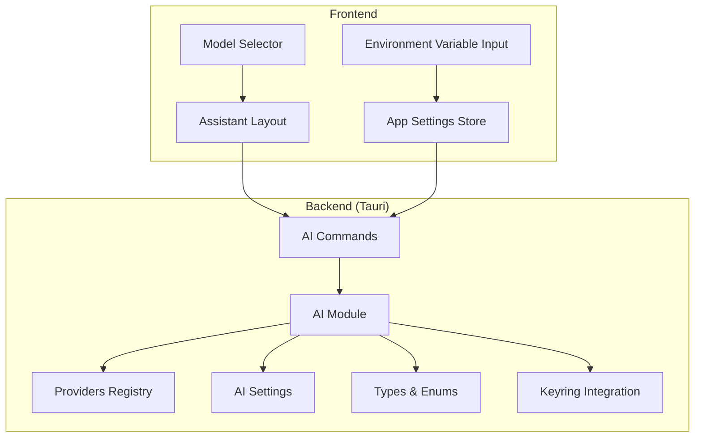
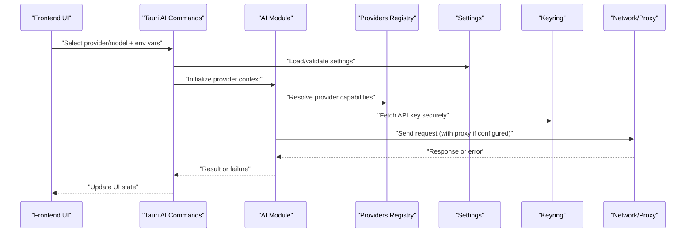
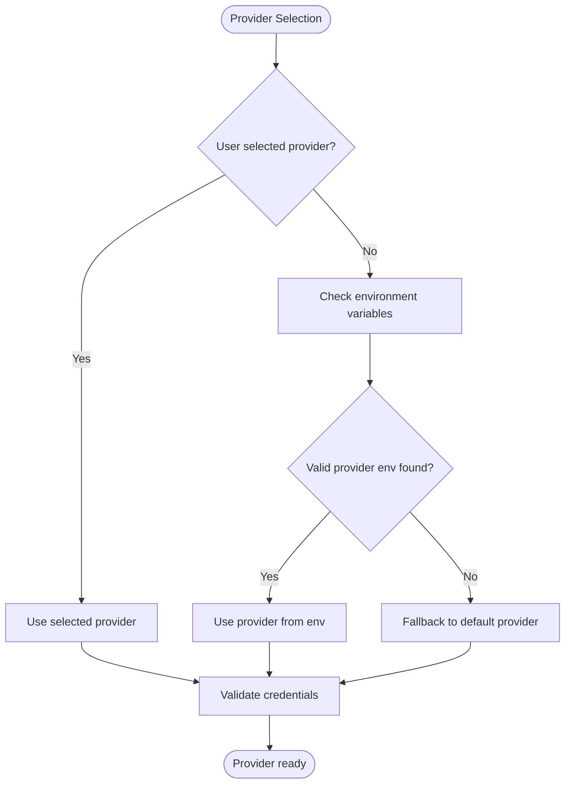
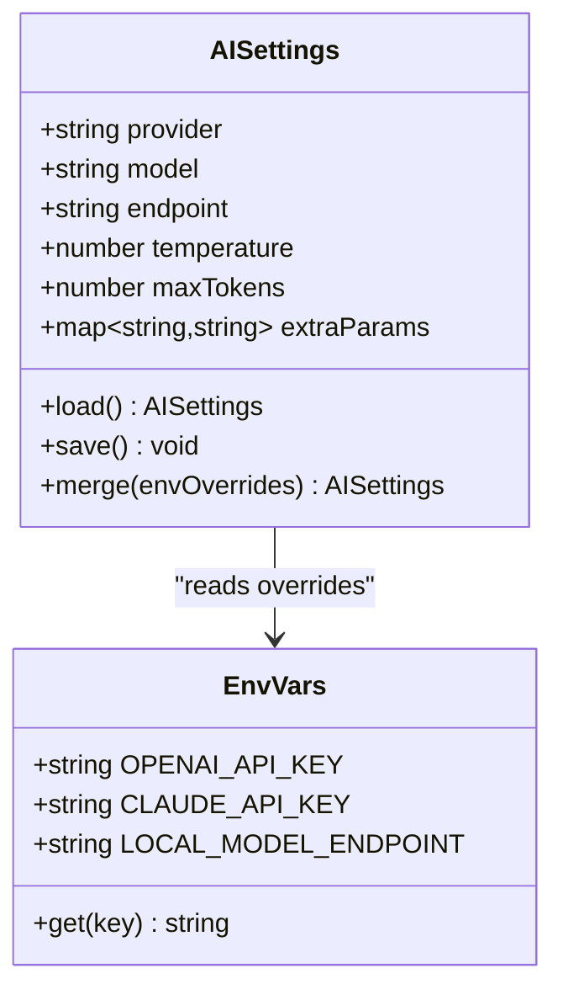
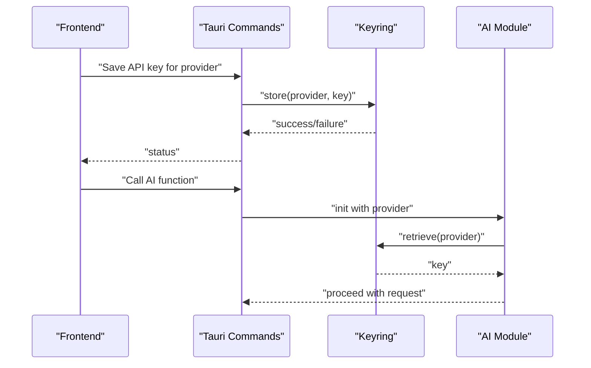
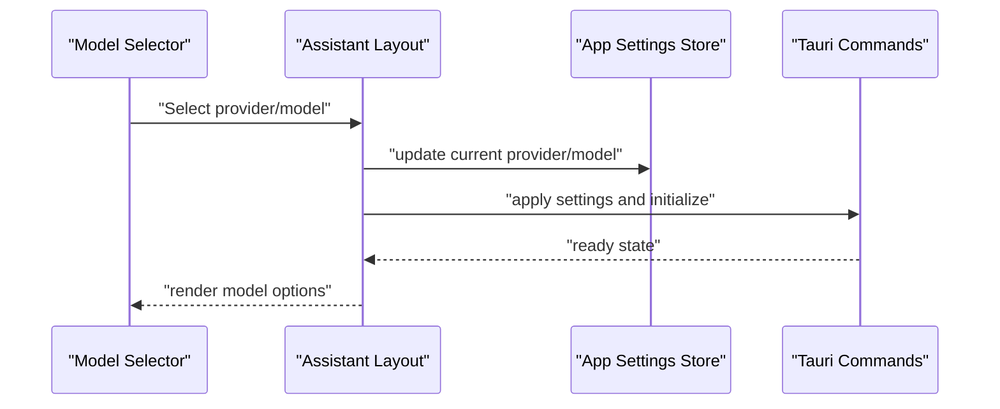
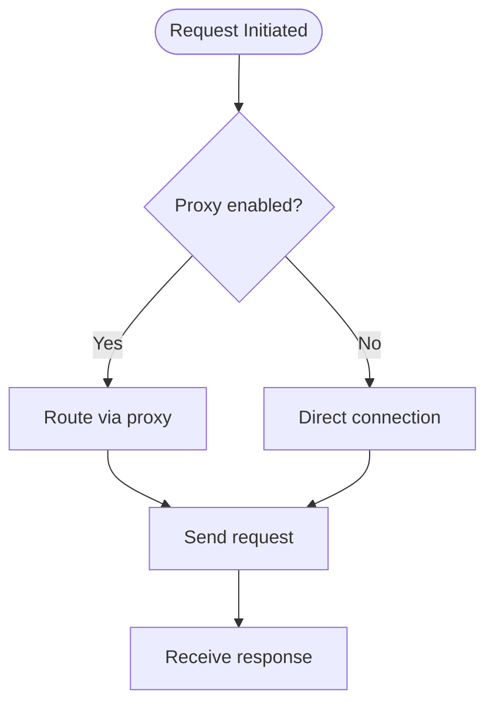
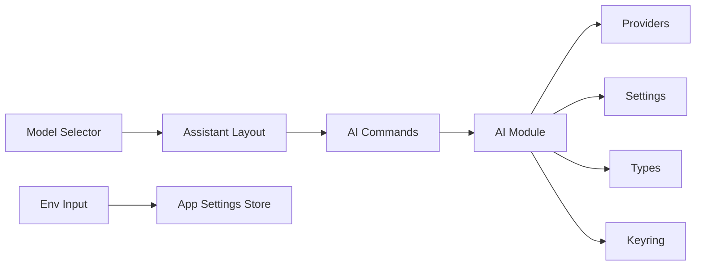

# AI Provider Configuration

<cite>
**Referenced Files in This Document**
- [src-tauri/src/ai/mod.rs](file://src-tauri/src/ai/mod.rs)
- [src-tauri/src/ai/providers.rs](file://src-tauri/src/ai/providers.rs)
- [src-tauri/src/ai/settings.rs](file://src-tauri/src/ai/settings.rs)
- [src-tauri/src/ai/types.rs](file://src-tauri/src/ai/types.rs)
- [src-tauri/src/ai/keyring.rs](file://src-tauri/src/ai/keyring.rs)
- [src-tauri/src/commands/ai.rs](file://src-tauri/src/commands/ai.rs)
- [src/components/ai-elements/model-selector.tsx](file://src/components/ai-elements/model-selector.tsx)
- [src/components/ui/select-env-input.tsx](file://src/components/ui/select-env-input.tsx)
- [src/stores/app-settings-store.ts](file://src/stores/app-settings-store.ts)
- [src/layout/assistant/index.tsx](file://src/layout/assistant/index.tsx)
- [src/layout/assistant/lib/assistant-config.ts](file://src/layout/assistant/lib/assistant-config.ts)
- [src/layout/footer/proxy-status.tsx](file://src/layout/footer/proxy-status.tsx)
- [src/hooks/use-proxy-start.ts](file://src/hooks/use-proxy-start.ts)
- [docs/website/proxy.ts](file://docs/website/proxy.ts)
</cite>

## Table of Contents
1. [Introduction](#introduction)
2. [Project Structure](#project-structure)
3. [Core Components](#core-components)
4. [Architecture Overview](#architecture-overview)
5. [Detailed Component Analysis](#detailed-component-analysis)
6. [Dependency Analysis](#dependency-analysis)
7. [Performance Considerations](#performance-considerations)
8. [Troubleshooting Guide](#troubleshooting-guide)
9. [Conclusion](#conclusion)
10. [Appendices](#appendices)

## Introduction
This document explains how to configure and manage AI providers in Apprecon, including supported models (OpenAI, Claude, local models), API key setup, provider-specific configurations, secure credential storage via keyring, provider selection logic, fallback mechanisms, environment variables, proxy settings, troubleshooting connection issues, rate limiting considerations, and cost optimization strategies. It is intended for both technical and non-technical users who need to set up or troubleshoot AI features within the application.

## Project Structure
Apprecon’s AI configuration spans both the Rust backend (Tauri) and the frontend UI:
- Backend modules handle provider definitions, settings, types, keyring integration, and commands exposed to the UI.
- Frontend components provide model selection, environment variable inputs, and assistant orchestration.
- Proxy utilities help route requests through a configured proxy when required by your network policy.

**Diagram sources**
- [src/components/ai-elements/model-selector.tsx](file://src/components/ai-elements/model-selector.tsx)
- [src/components/ui/select-env-input.tsx](file://src/components/ui/select-env-input.tsx)
- [src/layout/assistant/index.tsx](file://src/layout/assistant/index.tsx)
- [src/stores/app-settings-store.ts](file://src/stores/app-settings-store.ts)
- [src-tauri/src/ai/mod.rs](file://src-tauri/src/ai/mod.rs)
- [src-tauri/src/ai/providers.rs](file://src-tauri/src/ai/providers.rs)
- [src-tauri/src/ai/settings.rs](file://src-tauri/src/ai/settings.rs)
- [src-tauri/src/ai/types.rs](file://src-tauri/src/ai/types.rs)
- [src-tauri/src/ai/keyring.rs](file://src-tauri/src/ai/keyring.rs)
- [src-tauri/src/commands/ai.rs](file://src-tauri/src/commands/ai.rs)

**Section sources**
- [src-tauri/src/ai/mod.rs](file://src-tauri/src/ai/mod.rs)
- [src-tauri/src/ai/providers.rs](file://src-tauri/src/ai/providers.rs)
- [src-tauri/src/ai/settings.rs](file://src-tauri/src/ai/settings.rs)
- [src-tauri/src/ai/types.rs](file://src-tauri/src/ai/types.rs)
- [src-tauri/src/ai/keyring.rs](file://src-tauri/src/ai/keyring.rs)
- [src-tauri/src/commands/ai.rs](file://src-tauri/src/commands/ai.rs)
- [src/components/ai-elements/model-selector.tsx](file://src/components/ai-elements/model-selector.tsx)
- [src/components/ui/select-env-input.tsx](file://src/components/ui/select-env-input.tsx)
- [src/stores/app-settings-store.ts](file://src/stores/app-settings-store.ts)
- [src/layout/assistant/index.tsx](file://src/layout/assistant/index.tsx)

## Core Components
- Providers registry: Defines supported AI providers and their capabilities.
- Settings module: Loads and persists provider configurations, including endpoints and model names.
- Types: Enumerations and structures that standardize provider parameters and responses.
- Keyring integration: Securely stores and retrieves API keys using the system keychain.
- Commands: Tauri commands that expose provider operations to the frontend.
- Frontend model selector: Lets users choose a provider and model from available options.
- Environment variable input: Allows setting provider-specific environment variables securely.
- Assistant layout: Orchestrates AI interactions and applies selected provider settings.

**Section sources**
- [src-tauri/src/ai/providers.rs](file://src-tauri/src/ai/providers.rs)
- [src-tauri/src/ai/settings.rs](file://src-tauri/src/ai/settings.rs)
- [src-tauri/src/ai/types.rs](file://src-tauri/src/ai/types.rs)
- [src-tauri/src/ai/keyring.rs](file://src-tauri/src/ai/keyring.rs)
- [src-tauri/src/commands/ai.rs](file://src-tauri/src/commands/ai.rs)
- [src/components/ai-elements/model-selector.tsx](file://src/components/ai-elements/model-selector.tsx)
- [src/components/ui/select-env-input.tsx](file://src/components/ui/select-env-input.tsx)
- [src/layout/assistant/index.tsx](file://src/layout/assistant/index.tsx)

## Architecture Overview
The AI subsystem follows a layered architecture:
- The frontend collects user selections and environment variables.
- Tauri commands validate and apply settings, then interact with the AI module.
- The AI module resolves the active provider based on configuration and availability.
- Credentials are retrieved from the keyring to ensure secure access.
- Requests are routed through optional proxies as configured.

**Diagram sources**
- [src-tauri/src/commands/ai.rs](file://src-tauri/src/commands/ai.rs)
- [src-tauri/src/ai/mod.rs](file://src-tauri/src/ai/mod.rs)
- [src-tauri/src/ai/providers.rs](file://src-tauri/src/ai/providers.rs)
- [src-tauri/src/ai/settings.rs](file://src-tauri/src/ai/settings.rs)
- [src-tauri/src/ai/keyring.rs](file://src-tauri/src/ai/keyring.rs)

## Detailed Component Analysis

### Providers Registry and Selection Logic
- Supported providers include OpenAI, Claude, and local models.
- The registry enumerates available models per provider and exposes capability flags (e.g., streaming, tools).
- Provider selection prioritizes explicit user choice, then falls back to defaults based on environment variables and availability.

**Diagram sources**
- [src-tauri/src/ai/providers.rs](file://src-tauri/src/ai/providers.rs)
- [src-tauri/src/ai/settings.rs](file://src-tauri/src/ai/settings.rs)

**Section sources**
- [src-tauri/src/ai/providers.rs](file://src-tauri/src/ai/providers.rs)
- [src-tauri/src/ai/settings.rs](file://src-tauri/src/ai/settings.rs)

### Settings and Environment Variables
- Provider settings include endpoint URLs, model names, temperature, max tokens, and other parameters.
- Environment variables allow overriding settings at runtime without changing persisted configuration.
- The settings module merges defaults, persisted values, and environment overrides.

**Diagram sources**
- [src-tauri/src/ai/settings.rs](file://src-tauri/src/ai/settings.rs)

**Section sources**
- [src-tauri/src/ai/settings.rs](file://src-tauri/src/ai/settings.rs)
- [src/components/ui/select-env-input.tsx](file://src/components/ui/select-env-input.tsx)

### Keyring Integration for Secure Credential Storage
- API keys are stored in the system keychain via the keyring module.
- The keyring provides methods to get/set/delete keys scoped by provider.
- The AI module retrieves keys at runtime to avoid exposing secrets in logs or memory unnecessarily.

**Diagram sources**
- [src-tauri/src/ai/keyring.rs](file://src-tauri/src/ai/keyring.rs)
- [src-tauri/src/commands/ai.rs](file://src-tauri/src/commands/ai.rs)

**Section sources**
- [src-tauri/src/ai/keyring.rs](file://src-tauri/src/ai/keyring.rs)
- [src-tauri/src/commands/ai.rs](file://src-tauri/src/commands/ai.rs)

### Model Selector and Assistant Orchestration
- The model selector component lists available models per provider and updates the assistant context.
- The assistant layout coordinates prompts, tool usage, and response handling based on the selected provider.
- Changes propagate to the app settings store to persist the current selection.

**Diagram sources**
- [src/components/ai-elements/model-selector.tsx](file://src/components/ai-elements/model-selector.tsx)
- [src/layout/assistant/index.tsx](file://src/layout/assistant/index.tsx)
- [src/stores/app-settings-store.ts](file://src/stores/app-settings-store.ts)
- [src-tauri/src/commands/ai.rs](file://src-tauri/src/commands/ai.rs)

**Section sources**
- [src/components/ai-elements/model-selector.tsx](file://src/components/ai-elements/model-selector.tsx)
- [src/layout/assistant/index.tsx](file://src/layout/assistant/index.tsx)
- [src/stores/app-settings-store.ts](file://src/stores/app-settings-store.ts)

### Proxy Configuration and Network Routing
- Proxy settings can be applied globally or per-request depending on configuration.
- The proxy status indicator shows whether traffic is being routed through a proxy.
- The hook for starting the proxy ensures network requests use the correct endpoint.

**Diagram sources**
- [src/layout/footer/proxy-status.tsx](file://src/layout/footer/proxy-status.tsx)
- [src/hooks/use-proxy-start.ts](file://src/hooks/use-proxy-start.ts)
- [docs/website/proxy.ts](file://docs/website/proxy.ts)

**Section sources**
- [src/layout/footer/proxy-status.tsx](file://src/layout/footer/proxy-status.tsx)
- [src/hooks/use-proxy-start.ts](file://src/hooks/use-proxy-start.ts)
- [docs/website/proxy.ts](file://docs/website/proxy.ts)

## Dependency Analysis
- The AI module depends on providers, settings, types, and keyring.
- Commands act as an interface between the frontend and backend AI functionality.
- Frontend components rely on the assistant layout and settings store to reflect provider choices.

**Diagram sources**
- [src/components/ai-elements/model-selector.tsx](file://src/components/ai-elements/model-selector.tsx)
- [src/components/ui/select-env-input.tsx](file://src/components/ui/select-env-input.tsx)
- [src/layout/assistant/index.tsx](file://src/layout/assistant/index.tsx)
- [src/stores/app-settings-store.ts](file://src/stores/app-settings-store.ts)
- [src-tauri/src/commands/ai.rs](file://src-tauri/src/commands/ai.rs)
- [src-tauri/src/ai/mod.rs](file://src-tauri/src/ai/mod.rs)
- [src-tauri/src/ai/providers.rs](file://src-tauri/src/ai/providers.rs)
- [src-tauri/src/ai/settings.rs](file://src-tauri/src/ai/settings.rs)
- [src-tauri/src/ai/types.rs](file://src-tauri/src/ai/types.rs)
- [src-tauri/src/ai/keyring.rs](file://src-tauri/src/ai/keyring.rs)

**Section sources**
- [src-tauri/src/ai/mod.rs](file://src-tauri/src/ai/mod.rs)
- [src-tauri/src/commands/ai.rs](file://src-tauri/src/commands/ai.rs)

## Performance Considerations
- Prefer smaller models for quick iterations; reserve larger models for complex tasks.
- Use streaming responses where supported to reduce perceived latency.
- Cache repeated prompts or results locally when appropriate to minimize API calls.
- Adjust temperature and max tokens to balance creativity and token consumption.
- Monitor rate limits and implement client-side backoff to avoid throttling.

[No sources needed since this section provides general guidance]

## Troubleshooting Guide
Common issues and resolutions:
- Missing or invalid API key: Ensure the key is stored in the keyring and matches the selected provider.
- Endpoint misconfiguration: Verify provider endpoint URLs and any custom base paths.
- Proxy connectivity: Confirm proxy settings and network permissions; check proxy status indicator.
- Rate limiting: Implement retries with exponential backoff and monitor usage quotas.
- Local model failures: Validate local server health and accessibility from the application.

**Section sources**
- [src-tauri/src/ai/keyring.rs](file://src-tauri/src/ai/keyring.rs)
- [src-tauri/src/ai/settings.rs](file://src-tauri/src/ai/settings.rs)
- [src/layout/footer/proxy-status.tsx](file://src/layout/footer/proxy-status.tsx)

## Conclusion
Apprecon’s AI provider configuration combines secure credential management, flexible provider selection, and robust networking support. By following the guidance here, you can set up OpenAI, Claude, or local models efficiently, optimize costs, and troubleshoot common issues effectively.

[No sources needed since this section summarizes without analyzing specific files]

## Appendices

### Example Setup Scenarios
- OpenAI:
  - Set API key in keyring.
  - Choose model from the selector.
  - Optionally configure proxy if required.
- Claude:
  - Set API key in keyring.
  - Select model and adjust parameters.
  - Use proxy if necessary.
- Local Models:
  - Configure local endpoint URL.
  - Ensure local service is running and accessible.
  - Test connectivity via assistant.

[No sources needed since this section provides general guidance]

### Rate Limiting and Cost Optimization Strategies
- Use lower temperature and max tokens for routine tasks.
- Batch similar requests when possible.
- Monitor usage dashboards and set alerts for quota thresholds.
- Prefer cheaper models for exploratory work; switch to premium models for final outputs.

[No sources needed since this section provides general guidance]