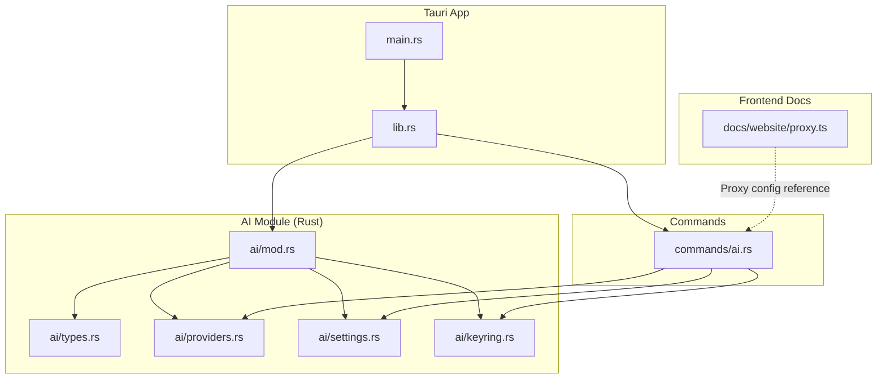
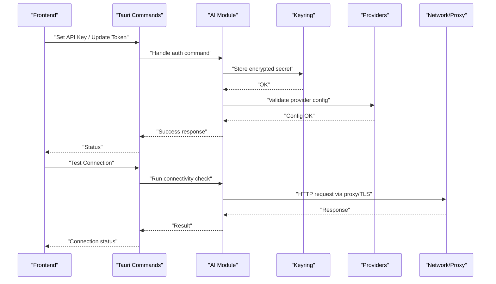
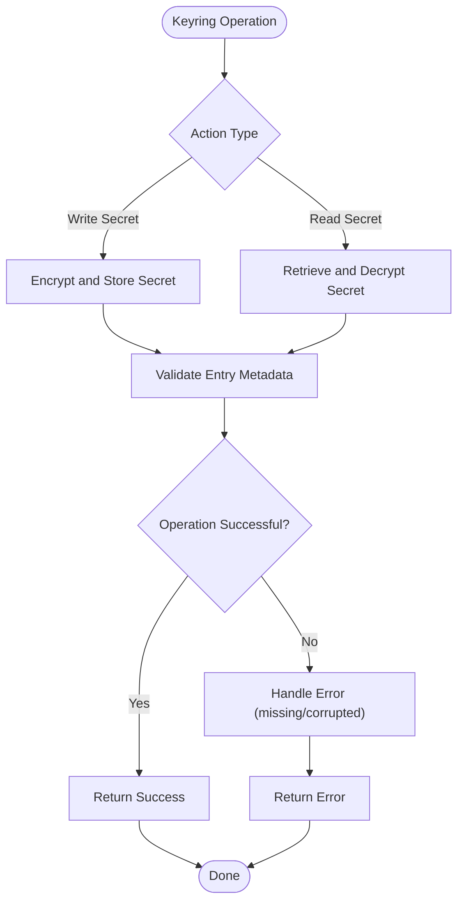
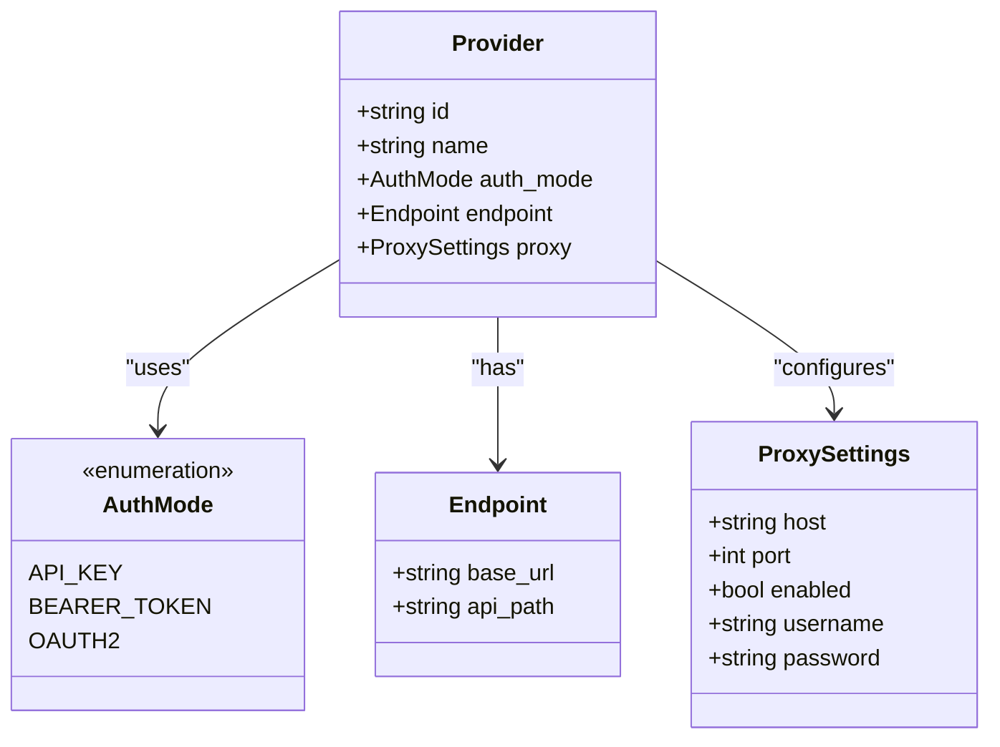
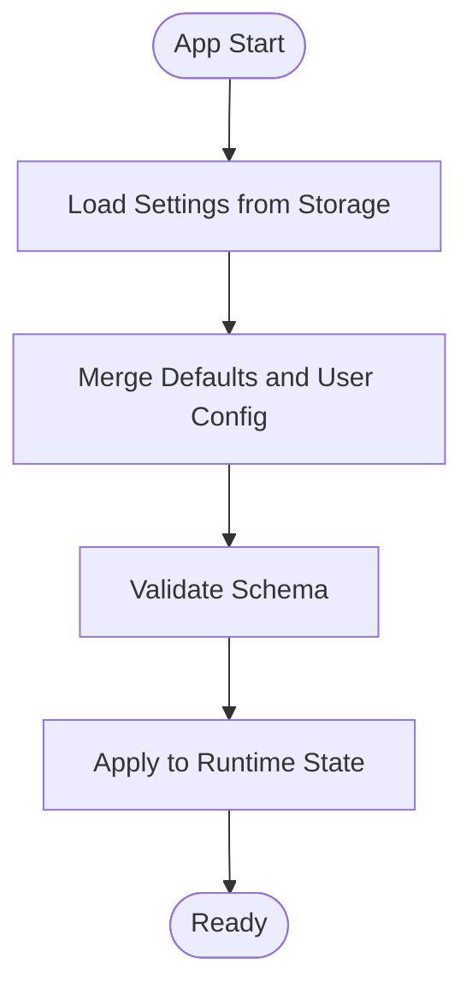
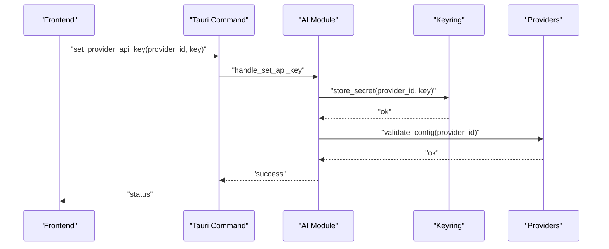
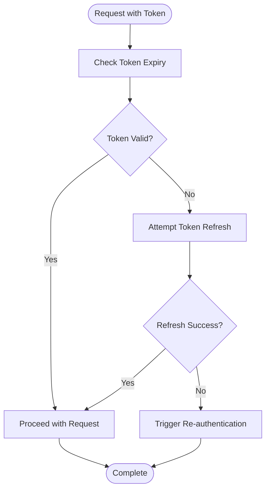
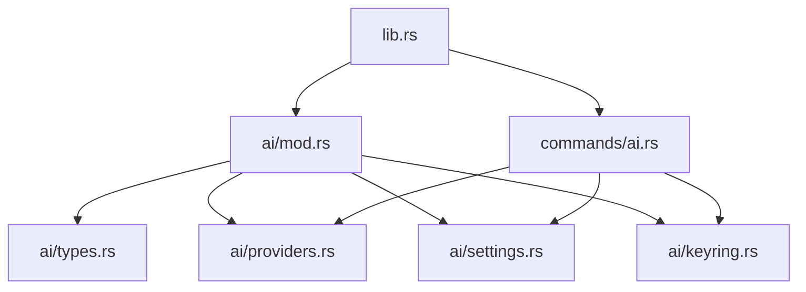

# Authentication & Security

<cite>
**Referenced Files in This Document**
- [keyring.rs](file://src-tauri/src/ai/keyring.rs)
- [providers.rs](file://src-tauri/src/ai/providers.rs)
- [settings.rs](file://src-tauri/src/ai/settings.rs)
- [types.rs](file://src-tauri/src/ai/types.rs)
- [mod.rs](file://src-tauri/src/ai/mod.rs)
- [commands/ai.rs](file://src-tauri/src/commands/ai.rs)
- [lib.rs](file://src-tauri/src/lib.rs)
- [main.rs](file://src-tauri/src/main.rs)
- [proxy.ts](file://docs/website/proxy.ts)
</cite>

## Table of Contents
1. Introduction
2. Project Structure
3. Core Components
4. Architecture Overview
5. Detailed Component Analysis
6. Dependency Analysis
7. Performance Considerations
8. Troubleshooting Guide
9. Conclusion

## Introduction
This document explains how AI provider authentication and security are implemented in the project, focusing on secure credential storage via keyring integration, API key encryption, token management, environment variable configuration, proxy settings for AI services, and network security considerations. It also covers credential rotation, best practices for secure storage, and troubleshooting authentication issues with practical examples for different authentication methods and API key updates.

## Project Structure
The authentication and security logic is primarily implemented in the Rust backend under src-tauri/src/ai and exposed to the frontend through Tauri commands. Key files include:
- AI module entrypoint and exports
- Keyring integration for secure storage
- Provider configuration and selection
- Settings persistence and validation
- Type definitions for providers and credentials
- Tauri command handlers that orchestrate authentication flows
- Application bootstrap wiring for commands and modules
- Proxy configuration for outbound requests

**Diagram sources**
- [main.rs](file://src-tauri/src/main.rs)
- [lib.rs](file://src-tauri/src/lib.rs)
- [mod.rs](file://src-tauri/src/ai/mod.rs)
- [types.rs](file://src-tauri/src/ai/types.rs)
- [providers.rs](file://src-tauri/src/ai/providers.rs)
- [settings.rs](file://src-tauri/src/ai/settings.rs)
- [keyring.rs](file://src-tauri/src/ai/keyring.rs)
- [commands/ai.rs](file://src-tauri/src/commands/ai.rs)
- [proxy.ts](file://docs/website/proxy.ts)

**Section sources**
- [mod.rs](file://src-tauri/src/ai/mod.rs)
- [lib.rs](file://src-tauri/src/lib.rs)
- [main.rs](file://src-tauri/src/main.rs)

## Core Components
- Keyring Integration: Securely stores and retrieves sensitive credentials such as API keys and tokens using the system keychain or equivalent secure store.
- Provider Configuration: Manages per-provider settings including endpoints, authentication modes, and optional proxies.
- Settings Persistence: Loads and saves application settings related to AI providers and security options.
- Type Definitions: Defines structures for providers, credentials, and configuration schemas used across the AI module.
- Command Handlers: Expose Tauri commands for reading/writing credentials, updating provider settings, and testing connectivity.

Key responsibilities:
- Encrypting and storing secrets at rest
- Loading secrets securely into memory only when needed
- Validating provider configurations and credentials
- Managing token lifecycles and refresh strategies
- Enforcing network security policies (e.g., TLS, proxy usage)

**Section sources**
- [keyring.rs](file://src-tauri/src/ai/keyring.rs)
- [providers.rs](file://src-tauri/src/ai/providers.rs)
- [settings.rs](file://src-tauri/src/ai/settings.rs)
- [types.rs](file://src-tauri/src/ai/types.rs)
- [commands/ai.rs](file://src-tauri/src/commands/ai.rs)

## Architecture Overview
The authentication architecture follows a layered approach:
- Frontend invokes Tauri commands to manage credentials and provider settings.
- Commands delegate to the AI module for business logic.
- The AI module uses keyring for secret storage and providers/settings modules for configuration.
- Network requests use configured proxies and enforce TLS where applicable.

**Diagram sources**
- [commands/ai.rs](file://src-tauri/src/commands/ai.rs)
- [keyring.rs](file://src-tauri/src/ai/keyring.rs)
- [providers.rs](file://src-tauri/src/ai/providers.rs)
- [settings.rs](file://src-tauri/src/ai/settings.rs)
- [proxy.ts](file://docs/website/proxy.ts)

## Detailed Component Analysis

### Keyring Integration
Purpose:
- Provide secure storage for API keys, tokens, and other secrets.
- Ensure secrets are never persisted in plaintext outside the OS keychain.
- Support retrieval only when required by authenticated operations.

Implementation highlights:
- Encrypted write/read operations for secrets keyed by provider identity.
- Error handling for missing or corrupted entries.
- Clear separation between secret storage and configuration values.

Best practices:
- Use unique identifiers per provider instance to avoid collisions.
- Rotate secrets by deleting old entries and writing new ones atomically.
- Avoid logging secret values; log identifiers and statuses only.

**Diagram sources**
- [keyring.rs](file://src-tauri/src/ai/keyring.rs)

**Section sources**
- [keyring.rs](file://src-tauri/src/ai/keyring.rs)

### Provider Configuration and Selection
Purpose:
- Define supported AI providers and their authentication modes.
- Manage per-provider settings like base URLs, headers, and proxy overrides.
- Validate configurations before use.

Implementation highlights:
- Enumerated provider types with associated configuration structs.
- Validation routines ensuring required fields and formats.
- Optional per-provider proxy and TLS settings.

**Diagram sources**
- [providers.rs](file://src-tauri/src/ai/providers.rs)
- [types.rs](file://src-tauri/src/ai/types.rs)

**Section sources**
- [providers.rs](file://src-tauri/src/ai/providers.rs)
- [types.rs](file://src-tauri/src/ai/types.rs)

### Settings Management
Purpose:
- Persist AI-related settings including provider configurations and security options.
- Load defaults and merge with user-provided values.
- Validate and migrate settings across versions.

Implementation highlights:
- Structured settings schema with typed fields.
- File-based or platform-specific storage backed by safe serialization.
- Hooks for applying changes and notifying consumers.

**Diagram sources**
- [settings.rs](file://src-tauri/src/ai/settings.rs)

**Section sources**
- [settings.rs](file://src-tauri/src/ai/settings.rs)

### Command Handlers for Authentication
Purpose:
- Expose Tauri commands for setting credentials, updating tokens, and testing connections.
- Orchestrate interactions between keyring, providers, and settings.

Common commands:
- Set provider API key
- Update bearer token
- Test provider connectivity
- List configured providers

**Diagram sources**
- [commands/ai.rs](file://src-tauri/src/commands/ai.rs)
- [keyring.rs](file://src-tauri/src/ai/keyring.rs)
- [providers.rs](file://src-tauri/src/ai/providers.rs)

**Section sources**
- [commands/ai.rs](file://src-tauri/src/commands/ai.rs)

### Environment Variables and Proxy Settings
Environment variables:
- Configure global proxy settings for outbound requests.
- Control TLS behavior and certificate validation flags.
- Specify default provider endpoints when not set in settings.

Proxy configuration:
- Per-provider proxy overrides can be specified in provider settings.
- Global proxy settings apply when per-provider is not configured.
- Proxy credentials are stored securely via keyring if provided.

Security considerations:
- Enforce HTTPS endpoints and validate certificates.
- Avoid logging sensitive headers or payloads.
- Restrict proxy access to trusted networks.

**Section sources**
- [proxy.ts](file://docs/website/proxy.ts)
- [settings.rs](file://src-tauri/src/ai/settings.rs)
- [providers.rs](file://src-tauri/src/ai/providers.rs)

### Token Management
Token lifecycle:
- Retrieve tokens from keyring on demand.
- Refresh tokens automatically based on expiration metadata.
- Invalidate and rotate tokens securely.

Refresh strategy:
- Check token expiry before each request.
- Use refresh endpoints when available.
- Fallback to re-authentication flow if refresh fails.

**Diagram sources**
- [providers.rs](file://src-tauri/src/ai/providers.rs)
- [keyring.rs](file://src-tauri/src/ai/keyring.rs)

**Section sources**
- [providers.rs](file://src-tauri/src/ai/providers.rs)
- [keyring.rs](file://src-tauri/src/ai/keyring.rs)

## Dependency Analysis
The AI module depends on keyring for secrets, providers for configuration, and settings for persistence. Commands act as the bridge between frontend and backend logic.

**Diagram sources**
- [lib.rs](file://src-tauri/src/lib.rs)
- [mod.rs](file://src-tauri/src/ai/mod.rs)
- [types.rs](file://src-tauri/src/ai/types.rs)
- [providers.rs](file://src-tauri/src/ai/providers.rs)
- [settings.rs](file://src-tauri/src/ai/settings.rs)
- [keyring.rs](file://src-tauri/src/ai/keyring.rs)
- [commands/ai.rs](file://src-tauri/src/commands/ai.rs)

**Section sources**
- [lib.rs](file://src-tauri/src/lib.rs)
- [mod.rs](file://src-tauri/src/ai/mod.rs)
- [commands/ai.rs](file://src-tauri/src/commands/ai.rs)

## Performance Considerations
- Minimize secret exposure: load keys only when necessary and clear them promptly.
- Cache validated provider configurations to reduce repeated parsing/validation.
- Use asynchronous operations for network calls to avoid blocking UI threads.
- Implement retry logic with exponential backoff for transient failures.
- Prefer streaming responses for large payloads to reduce memory pressure.

[No sources needed since this section provides general guidance]

## Troubleshooting Guide
Common issues and resolutions:
- Missing or invalid API key:
  - Verify key exists in keyring and matches provider ID.
  - Re-enter the key via the appropriate command and confirm success.
- Token expiration errors:
  - Trigger refresh or re-authentication flow.
  - Check provider endpoint availability and credentials validity.
- Proxy connection failures:
  - Validate proxy host/port and credentials.
  - Ensure TLS settings match provider requirements.
- Certificate validation errors:
  - Confirm CA bundle is up to date.
  - Adjust TLS verification flags cautiously and prefer proper certificates.

Diagnostic steps:
- Use test connection commands to isolate network vs. authentication issues.
- Inspect logs for error codes and messages without exposing secrets.
- Validate settings schema and migration state.

**Section sources**
- [commands/ai.rs](file://src-tauri/src/commands/ai.rs)
- [keyring.rs](file://src-tauri/src/ai/keyring.rs)
- [providers.rs](file://src-tauri/src/ai/providers.rs)
- [settings.rs](file://src-tauri/src/ai/settings.rs)

## Conclusion
The authentication and security implementation centers around secure keyring-backed storage, robust provider configuration, and careful token lifecycle management. By enforcing strict validation, leveraging proxies securely, and following best practices for credential rotation and storage, the system ensures reliable and safe interactions with AI providers. For ongoing maintenance, prioritize monitoring, automated rotation, and thorough testing of authentication flows.

[No sources needed since this section summarizes without analyzing specific files]