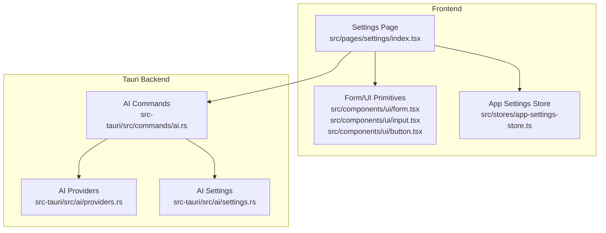
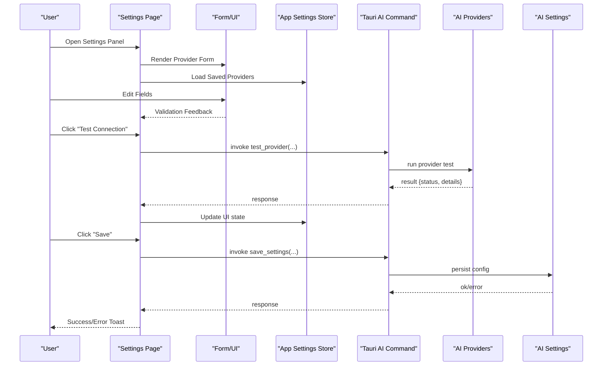
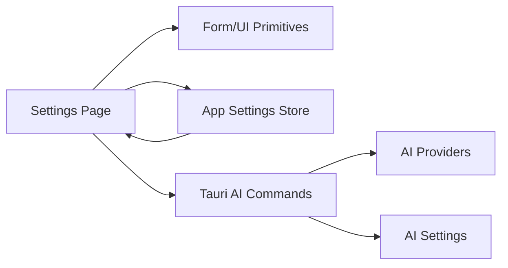

# Provider Settings Interface

<cite>
**Referenced Files in This Document**
- [settings/index.tsx](file://src/pages/settings/index.tsx)
- [settings/constants.ts](file://src/pages/settings/constants.ts)
- [app-settings-store.ts](file://src/stores/app-settings-store.ts)
- [ai/providers.rs](file://src-tauri/src/ai/providers.rs)
- [ai/settings.rs](file://src-tauri/src/ai/settings.rs)
- [commands/ai.rs](file://src-tauri/src/commands/ai.rs)
- [components/ui/form.tsx](file://src/components/ui/form.tsx)
- [components/ui/input.tsx](file://src/components/ui/input.tsx)
- [components/ui/button.tsx](file://src/components/ui/button.tsx)
- [components/ui/toast.tsx](file://src/components/ui/toast.tsx)
</cite>

## Table of Contents
1. [Introduction](#introduction)
2. [Project Structure](#project-structure)
3. [Core Components](#core-components)
4. [Architecture Overview](#architecture-overview)
5. [Detailed Component Analysis](#detailed-component-analysis)
6. [Dependency Analysis](#dependency-analysis)
7. [Performance Considerations](#performance-considerations)
8. [Troubleshooting Guide](#troubleshooting-guide)
9. [Conclusion](#conclusion)

## Introduction
This document explains the AI provider settings interface within Apprecon’s settings panel. It covers how users configure AI providers, validate inputs, and perform real-time tests directly from the UI. It also documents provider discovery, automatic configuration detection, error handling, and common troubleshooting steps for UI-related issues.

## Project Structure
The AI provider settings feature spans both the frontend (React/TypeScript) and the Tauri backend (Rust). The key areas are:
- Frontend settings page and form components
- Global app settings store
- Tauri commands and AI provider modules

**Diagram sources**
- [settings/index.tsx](file://src/pages/settings/index.tsx)
- [form.tsx](file://src/components/ui/form.tsx)
- [input.tsx](file://src/components/ui/input.tsx)
- [button.tsx](file://src/components/ui/button.tsx)
- [app-settings-store.ts](file://src/stores/app-settings-store.ts)
- [commands/ai.rs](file://src-tauri/src/commands/ai.rs)
- [providers.rs](file://src-tauri/src/ai/providers.rs)
- [settings.rs](file://src-tauri/src/ai/settings.rs)

**Section sources**
- [settings/index.tsx](file://src/pages/settings/index.tsx)
- [constants.ts](file://src/pages/settings/constants.ts)
- [app-settings-store.ts](file://src/stores/app-settings-store.ts)
- [commands/ai.rs](file://src-tauri/src/commands/ai.rs)
- [providers.rs](file://src-tauri/src/ai/providers.rs)
- [settings.rs](file://src-tauri/src/ai/settings.rs)

## Core Components
- Settings page: Renders the provider configuration form, manages local state, and invokes backend commands via Tauri.
- Form primitives: Reusable input, button, and form components that provide validation hooks and accessibility.
- App settings store: Persists provider configurations across sessions and exposes reactive state to the UI.
- Tauri AI commands: Expose endpoints for listing providers, validating credentials, testing connectivity, and saving settings.
- AI providers module: Implements provider-specific logic such as capability discovery and connection checks.
- AI settings module: Handles reading/writing provider configurations securely.

Key responsibilities:
- Input validation rules per provider field
- Real-time test execution with feedback
- Automatic configuration detection where supported
- Error display and recovery flows

**Section sources**
- [settings/index.tsx](file://src/pages/settings/index.tsx)
- [form.tsx](file://src/components/ui/form.tsx)
- [input.tsx](file://src/components/ui/input.tsx)
- [button.tsx](file://src/components/ui/button.tsx)
- [app-settings-store.ts](file://src/stores/app-settings-store.ts)
- [commands/ai.rs](file://src-tauri/src/commands/ai.rs)
- [providers.rs](file://src-tauri/src/ai/providers.rs)
- [settings.rs](file://src-tauri/src/ai/settings.rs)

## Architecture Overview
The settings flow integrates React components with Tauri commands to manage provider configurations.

**Diagram sources**
- [settings/index.tsx](file://src/pages/settings/index.tsx)
- [app-settings-store.ts](file://src/stores/app-settings-store.ts)
- [commands/ai.rs](file://src-tauri/src/commands/ai.rs)
- [providers.rs](file://src-tauri/src/ai/providers.rs)
- [settings.rs](file://src-tauri/src/ai/settings.rs)

## Detailed Component Analysis

### Settings Page and Provider Form
- Displays a list of available providers and their fields.
- Supports dynamic field rendering based on provider type.
- Integrates validation rules and real-time feedback.
- Provides “Test” and “Save” actions bound to Tauri commands.

Typical fields include:
- Provider selection
- API key or token
- Base URL or endpoint
- Optional model or region selectors
- Advanced toggles (e.g., enable/disable features)

Validation highlights:
- Required fields enforced before test/save
- Format checks for URLs and tokens
- Conditional fields shown based on provider capabilities

Real-time testing:
- Triggered by user action
- Shows loading states and results
- Updates UI with success or error messages

Automatic configuration detection:
- Some providers can auto-detect base URLs or models
- UI reflects detected values and allows overrides

Error handling:
- Network errors surfaced to the user
- Invalid credentials indicated clearly
- Graceful fallbacks when provider metadata is unavailable

**Section sources**
- [settings/index.tsx](file://src/pages/settings/index.tsx)
- [constants.ts](file://src/pages/settings/constants.ts)
- [form.tsx](file://src/components/ui/form.tsx)
- [input.tsx](file://src/components/ui/input.tsx)
- [button.tsx](file://src/components/ui/button.tsx)

### App Settings Store
- Centralized persistence for provider configurations.
- Reactive updates to keep the UI in sync.
- Methods to load, update, and validate settings.

Responsibilities:
- Merge saved settings with defaults
- Emit changes to subscribed components
- Provide helpers for schema validation

**Section sources**
- [app-settings-store.ts](file://src/stores/app-settings-store.ts)

### Tauri AI Commands
- Exposes functions for:
  - Listing available providers and capabilities
  - Validating provider credentials
  - Testing connectivity and basic operations
  - Saving and retrieving provider settings

Security considerations:
- Secrets handled via secure storage mechanisms
- Minimal logging of sensitive data

**Section sources**
- [commands/ai.rs](file://src-tauri/src/commands/ai.rs)

### AI Providers Module
- Implements provider-specific behaviors:
  - Capability discovery (models, regions, features)
  - Connection tests (auth check, minimal request)
  - Error classification (network vs auth vs rate limit)

Extensibility:
- New providers added by implementing standard interfaces
- Consistent error and result shapes returned to the UI

**Section sources**
- [providers.rs](file://src-tauri/src/ai/providers.rs)

### AI Settings Module
- Reads and writes provider configurations
- Validates schemas before persistence
- Manages environment variables and secure storage integration

**Section sources**
- [settings.rs](file://src-tauri/src/ai/settings.rs)

## Dependency Analysis
The following diagram shows how components depend on each other during provider configuration and testing.

**Diagram sources**
- [settings/index.tsx](file://src/pages/settings/index.tsx)
- [form.tsx](file://src/components/ui/form.tsx)
- [app-settings-store.ts](file://src/stores/app-settings-store.ts)
- [commands/ai.rs](file://src-tauri/src/commands/ai.rs)
- [providers.rs](file://src-tauri/src/ai/providers.rs)
- [settings.rs](file://src-tauri/src/ai/settings.rs)

**Section sources**
- [settings/index.tsx](file://src/pages/settings/index.tsx)
- [app-settings-store.ts](file://src/stores/app-settings-store.ts)
- [commands/ai.rs](file://src-tauri/src/commands/ai.rs)
- [providers.rs](file://src-tauri/src/ai/providers.rs)
- [settings.rs](file://src-tauri/src/ai/settings.rs)

## Performance Considerations
- Debounce rapid input changes to avoid excessive validation calls.
- Cache provider metadata to reduce repeated discovery requests.
- Use optimistic UI updates for non-critical actions; rollback on failure.
- Avoid blocking the main thread during long-running tests; show progress indicators.

[No sources needed since this section provides general guidance]

## Troubleshooting Guide
Common UI-related issues and resolutions:

- Test button does not respond
  - Ensure the provider fields are valid and required fields are filled.
  - Check network connectivity and proxy/firewall settings.
  - Inspect browser console and Tauri logs for command errors.

- Save fails silently
  - Verify permissions for secure storage access.
  - Confirm that the settings schema matches expected structure.
  - Look for toast notifications indicating specific failures.

- Provider discovery returns empty
  - Some providers require explicit base URL configuration.
  - Retry after ensuring internet access and correct credentials.
  - Check if the provider supports discovery in your region.

- Errors not displayed
  - Ensure toast/notification component is mounted.
  - Validate that error messages are mapped to user-friendly strings.

- Auto-detected values incorrect
  - Override auto-detected fields manually.
  - Clear cached metadata and retry discovery.

**Section sources**
- [toast.tsx](file://src/components/ui/toast.tsx)
- [commands/ai.rs](file://src-tauri/src/commands/ai.rs)
- [providers.rs](file://src-tauri/src/ai/providers.rs)
- [settings.rs](file://src-tauri/src/ai/settings.rs)

## Conclusion
The AI provider settings interface provides a robust, user-friendly way to configure and test multiple AI providers. With clear validation, real-time testing, and secure persistence, it streamlines setup while maintaining reliability. Proper error handling and discoverability ensure a smooth experience even in complex environments.

[No sources needed since this section summarizes without analyzing specific files]