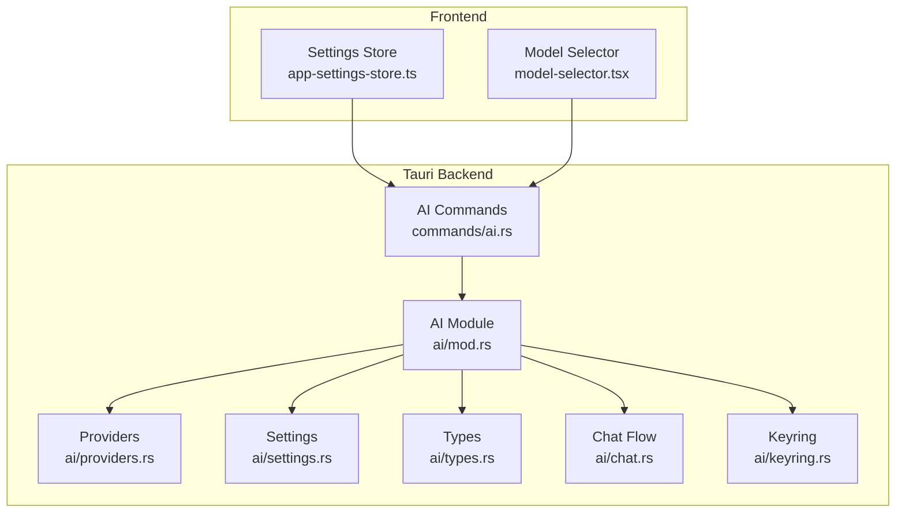
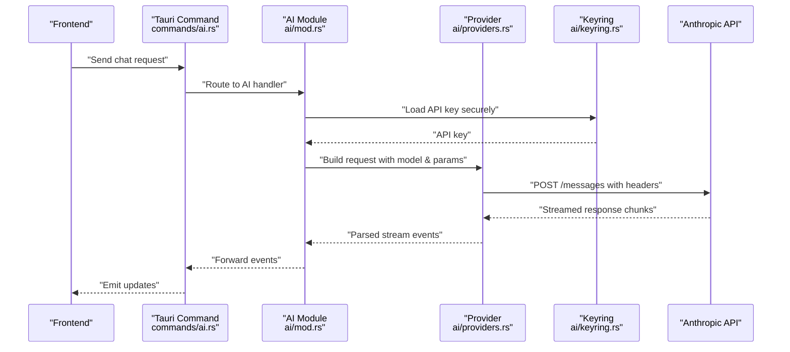
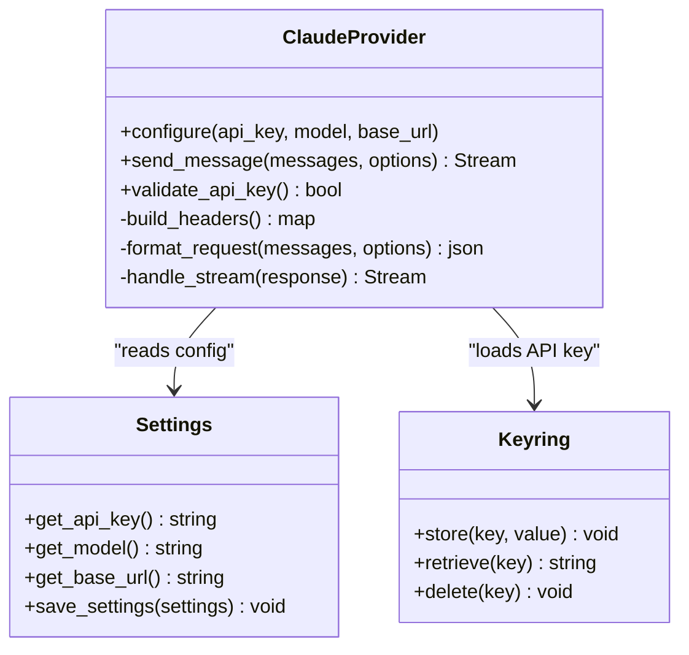
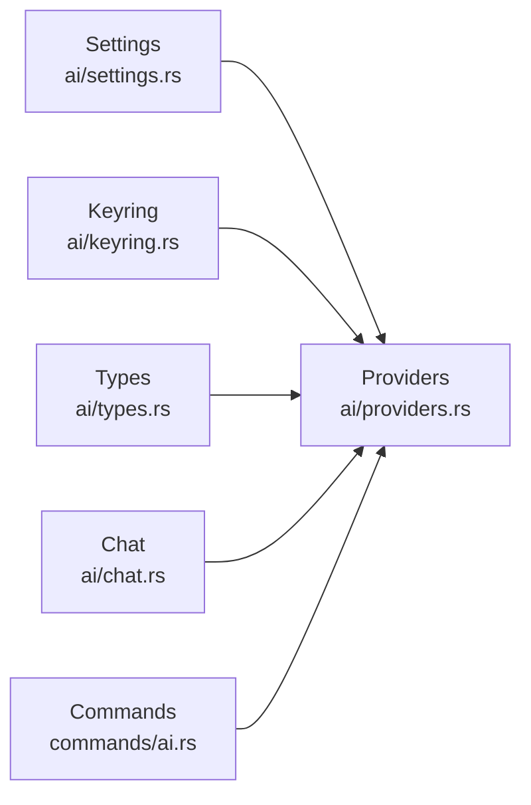

# Claude Provider

<cite>
**Referenced Files in This Document**
- [providers.rs](file://src-tauri/src/ai/providers.rs)
- [settings.rs](file://src-tauri/src/ai/settings.rs)
- [types.rs](file://src-tauri/src/ai/types.rs)
- [mod.rs](file://src-tauri/src/ai/mod.rs)
- [chat.rs](file://src-tauri/src/ai/chat.rs)
- [commands.rs](file://src-tauri/src/ai/commands.rs)
- [keyring.rs](file://src-tauri/src/ai/keyring.rs)
- [ai.rs](file://src-tauri/src/commands/ai.rs)
- [app-settings-store.ts](file://src/stores/app-settings-store.ts)
- [model-selector.tsx](file://src/components/ai-elements/model-selector.tsx)
</cite>

## Table of Contents
1. [Introduction](#introduction)
2. [Project Structure](#project-structure)
3. [Core Components](#core-components)
4. [Architecture Overview](#architecture-overview)
5. [Detailed Component Analysis](#detailed-component-analysis)
6. [Dependency Analysis](#dependency-analysis)
7. [Performance Considerations](#performance-considerations)
8. [Troubleshooting Guide](#troubleshooting-guide)
9. [Conclusion](#conclusion)
10. [Appendices](#appendices)

## Introduction
This document explains how to configure and use the Claude provider in Apprecon. It covers creating an Anthropic API key, configuring provider settings, supported models (Claude 3 and Claude 2), request parameters, validation steps, model capabilities and token limits, cost optimization strategies, and practical examples for Claude-specific features and error handling patterns.

## Project Structure
Apprecon integrates AI providers via a Rust backend (Tauri) and a TypeScript frontend. The Claude provider is implemented in the Rust AI module and exposed through Tauri commands. The frontend provides UI for selecting models and managing settings.

**Diagram sources**
- [ai.rs](file://src-tauri/src/commands/ai.rs)
- [mod.rs](file://src-tauri/src/ai/mod.rs)
- [providers.rs](file://src-tauri/src/ai/providers.rs)
- [settings.rs](file://src-tauri/src/ai/settings.rs)
- [types.rs](file://src-tauri/src/ai/types.rs)
- [chat.rs](file://src-tauri/src/ai/chat.rs)
- [keyring.rs](file://src-tauri/src/ai/keyring.rs)
- [app-settings-store.ts](file://src/stores/app-settings-store.ts)
- [model-selector.tsx](file://src/components/ai-elements/model-selector.tsx)

**Section sources**
- [providers.rs](file://src-tauri/src/ai/providers.rs)
- [settings.rs](file://src-tauri/src/ai/settings.rs)
- [types.rs](file://src-tauri/src/ai/types.rs)
- [mod.rs](file://src-tauri/src/ai/mod.rs)
- [chat.rs](file://src-tauri/src/ai/chat.rs)
- [commands.rs](file://src-tauri/src/ai/commands.rs)
- [keyring.rs](file://src-tauri/src/ai/keyring.rs)
- [ai.rs](file://src-tauri/src/commands/ai.rs)
- [app-settings-store.ts](file://src/stores/app-settings-store.ts)
- [model-selector.tsx](file://src/components/ai-elements/model-selector.tsx)

## Core Components
- Providers: Implements the Claude client, including authentication with the Anthropic API key and request formatting.
- Settings: Manages provider configuration such as API keys, base URLs, and model defaults.
- Types: Defines shared structures for messages, requests, responses, and provider options.
- Chat: Orchestrates chat sessions, streaming, and message history.
- Keyring: Securely stores and retrieves sensitive credentials like API keys.
- Commands: Exposes Tauri commands for the frontend to interact with the AI subsystem.

**Section sources**
- [providers.rs](file://src-tauri/src/ai/providers.rs)
- [settings.rs](file://src-tauri/src/ai/settings.rs)
- [types.rs](file://src-tauri/src/ai/types.rs)
- [chat.rs](file://src-tauri/src/ai/chat.rs)
- [keyring.rs](file://src-tauri/src/ai/keyring.rs)
- [commands.rs](file://src-tauri/src/ai/commands.rs)

## Architecture Overview
The Claude provider follows a layered architecture:
- Frontend triggers actions via Tauri commands.
- Backend validates inputs, loads settings, and invokes the provider.
- Provider constructs requests to the Anthropic API using the configured API key and model.
- Responses are streamed back to the frontend for real-time updates.

**Diagram sources**
- [ai.rs](file://src-tauri/src/commands/ai.rs)
- [mod.rs](file://src-tauri/src/ai/mod.rs)
- [providers.rs](file://src-tauri/src/ai/providers.rs)
- [keyring.rs](file://src-tauri/src/ai/keyring.rs)

## Detailed Component Analysis

### Claude Provider Implementation
- Authentication: Uses the Anthropic API key loaded from secure storage.
- Request Construction: Builds JSON payloads conforming to the Anthropic Messages API schema.
- Streaming: Handles server-sent events or chunked responses for real-time output.
- Error Handling: Maps HTTP and API errors to user-friendly messages.

**Diagram sources**
- [providers.rs](file://src-tauri/src/ai/providers.rs)
- [settings.rs](file://src-tauri/src/ai/settings.rs)
- [keyring.rs](file://src-tauri/src/ai/keyring.rs)

**Section sources**
- [providers.rs](file://src-tauri/src/ai/providers.rs)
- [settings.rs](file://src-tauri/src/ai/settings.rs)
- [keyring.rs](file://src-tauri/src/ai/keyring.rs)

### Supported Models and Capabilities
- Claude 3 family: Supports advanced reasoning, vision, and tool use depending on the specific model variant.
- Claude 2 family: Provides strong language understanding and generation capabilities.
- Model selection: Controlled via provider settings; validated against supported model names.

Capabilities include:
- Text generation and completion
- Vision input (image analysis) where supported
- Tool/function calling when enabled by the model
- Streaming responses for real-time interaction

Token limits vary by model; consult the Anthropic documentation for exact limits per model.

**Section sources**
- [types.rs](file://src-tauri/src/ai/types.rs)
- [providers.rs](file://src-tauri/src/ai/providers.rs)

### Request Parameters
Common parameters for Claude requests:
- model: Target Claude model identifier
- messages: Array of conversation turns with role and content
- max_tokens: Maximum tokens in the response
- temperature: Controls randomness
- top_p: Nucleus sampling parameter
- stop_sequences: Custom stop sequences
- tools: Function definitions for tool use (if supported)
- metadata: Optional metadata for tracking

These parameters are mapped to the Anthropic Messages API schema.

**Section sources**
- [types.rs](file://src-tauri/src/ai/types.rs)
- [providers.rs](file://src-tauri/src/ai/providers.rs)

### Creating an Anthropic API Key
Steps to create an API key in the Anthropic console:
1. Sign in to the Anthropic console.
2. Navigate to API Keys management.
3. Generate a new API key.
4. Copy and securely store the key.

Use this key in Apprecon’s provider settings.

[No sources needed since this section provides general guidance]

### Configuring Provider Settings in Apprecon
- Open the settings interface.
- Select Claude as the provider.
- Enter the Anthropic API key.
- Choose the desired Claude model.
- Save settings.

Validation ensures the key is present and the model is supported.

**Section sources**
- [settings.rs](file://src-tauri/src/ai/settings.rs)
- [app-settings-store.ts](file://src/stores/app-settings-store.ts)

### Validating the Connection
- Use the built-in connection test command.
- Send a minimal request to the Anthropic API.
- Confirm successful response or receive detailed error feedback.

**Section sources**
- [commands.rs](file://src-tauri/src/ai/commands.rs)
- [chat.rs](file://src-tauri/src/ai/chat.rs)

### Practical Examples of Claude-Specific Features
- Vision input: Include image content in messages where supported.
- Tool use: Define functions in the tools parameter to enable function calling.
- Streaming: Enable streaming to receive incremental responses.

Examples are demonstrated through the chat flow and provider implementation.

**Section sources**
- [providers.rs](file://src-tauri/src/ai/providers.rs)
- [chat.rs](file://src-tauri/src/ai/chat.rs)

### Error Handling Patterns
- Authentication errors: Invalid or missing API key.
- Rate limiting: Handle 429 responses with retry logic.
- Model errors: Unsupported model or invalid parameters.
- Network errors: Timeouts and connectivity issues.

Errors are mapped to user-friendly messages and logged for debugging.

**Section sources**
- [providers.rs](file://src-tauri/src/ai/providers.rs)
- [chat.rs](file://src-tauri/src/ai/chat.rs)

## Dependency Analysis
The Claude provider depends on:
- Settings for configuration values
- Keyring for secure credential storage
- Types for data structures
- Chat for session management
- Tauri commands for frontend integration

**Diagram sources**
- [settings.rs](file://src-tauri/src/ai/settings.rs)
- [keyring.rs](file://src-tauri/src/ai/keyring.rs)
- [types.rs](file://src-tauri/src/ai/types.rs)
- [chat.rs](file://src-tauri/src/ai/chat.rs)
- [ai.rs](file://src-tauri/src/commands/ai.rs)
- [providers.rs](file://src-tauri/src/ai/providers.rs)

**Section sources**
- [providers.rs](file://src-tauri/src/ai/providers.rs)
- [settings.rs](file://src-tauri/src/ai/settings.rs)
- [types.rs](file://src-tauri/src/ai/types.rs)
- [chat.rs](file://src-tauri/src/ai/chat.rs)
- [commands.rs](file://src-tauri/src/ai/commands.rs)

## Performance Considerations
- Use streaming to reduce perceived latency.
- Optimize payload size by limiting message length and unnecessary fields.
- Cache frequently used configurations to avoid repeated lookups.
- Implement retries with exponential backoff for transient errors.
- Monitor token usage to stay within rate limits and control costs.

[No sources needed since this section provides general guidance]

## Troubleshooting Guide
Common issues and resolutions:
- Invalid API key: Regenerate the key in the Anthropic console and update settings.
- Model not found: Verify the model name matches supported identifiers.
- Rate limit exceeded: Wait and retry; consider upgrading your plan.
- Network errors: Check internet connectivity and firewall settings.
- Streaming interruptions: Implement reconnection logic and handle partial responses.

Use logging and error messages provided by the provider to diagnose issues.

**Section sources**
- [providers.rs](file://src-tauri/src/ai/providers.rs)
- [chat.rs](file://src-tauri/src/ai/chat.rs)

## Conclusion
Configuring the Claude provider in Apprecon involves setting up an Anthropic API key, selecting a supported model, and validating the connection. The provider supports modern features like streaming, vision, and tool use. By following best practices for error handling and performance optimization, users can effectively leverage Claude models for their workflows.

[No sources needed since this section summarizes without analyzing specific files]

## Appendices

### Cost Optimization Strategies
- Choose appropriate models based on task complexity.
- Limit max_tokens to reduce response size.
- Use caching for repeated prompts where applicable.
- Monitor usage and set budget alerts in the Anthropic console.

[No sources needed since this section provides general guidance]

### Model Selection Guide
- Claude 3: Best for complex reasoning and multimodal tasks.
- Claude 2: Suitable for general-purpose text generation.
- Evaluate performance and cost trade-offs for each use case.

[No sources needed since this section provides general guidance]