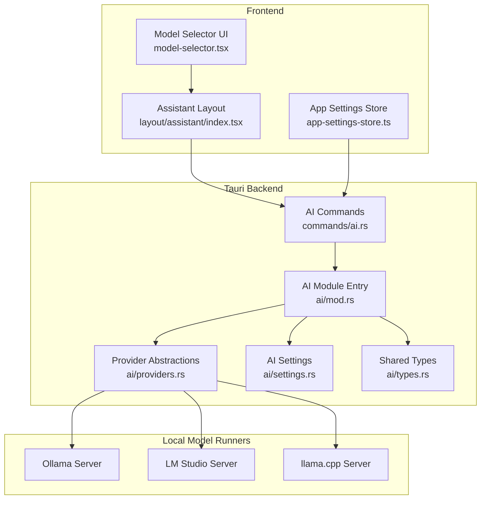
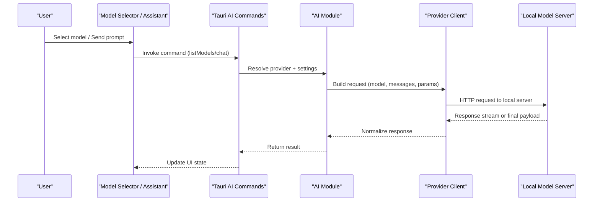
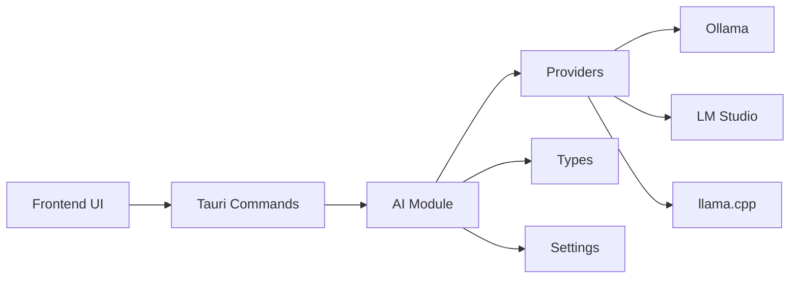

# Local Models

<cite>
**Referenced Files in This Document**
- [README.md](file://README.md)
- [src-tauri/src/ai/mod.rs](file://src-tauri/src/ai/mod.rs)
- [src-tauri/src/ai/providers.rs](file://src-tauri/src/ai/providers.rs)
- [src-tauri/src/ai/settings.rs](file://src-tauri/src/ai/settings.rs)
- [src-tauri/src/ai/types.rs](file://src-tauri/src/ai/types.rs)
- [src-tauri/src/commands/ai.rs](file://src-tauri/src/commands/ai.rs)
- [src/components/ai-elements/model-selector.tsx](file://src/components/ai-elements/model-selector.tsx)
- [src/layout/assistant/index.tsx](file://src/layout/assistant/index.tsx)
- [src/stores/app-settings-store.ts](file://src/stores/app-settings-store.ts)
</cite>

## Table of Contents
1. [Introduction](#introduction)
2. [Project Structure](#project-structure)
3. [Core Components](#core-components)
4. [Architecture Overview](#architecture-overview)
5. [Detailed Component Analysis](#detailed-component-analysis)
6. [Dependency Analysis](#dependency-analysis)
7. [Performance Considerations](#performance-considerations)
8. [Troubleshooting Guide](#troubleshooting-guide)
9. [Conclusion](#conclusion)
10. [Appendices](#appendices)

## Introduction
This document explains how to run local AI models with Apprecon, including setup procedures for popular local model runners such as Ollama, LM Studio, and llama.cpp. It covers model requirements, hardware specifications, performance tuning options, step-by-step installation guides, model downloading procedures, configuration examples, compatibility considerations, quantization options, memory management, troubleshooting tips, and optimization strategies.

## Project Structure
Apprecon integrates local AI providers through a modular Rust backend (Tauri) and a React frontend. The AI subsystem exposes commands and settings that the UI uses to manage provider connections, model selection, and chat interactions.

**Diagram sources**
- [src/components/ai-elements/model-selector.tsx](file://src/components/ai-elements/model-selector.tsx)
- [src/layout/assistant/index.tsx](file://src/layout/assistant/index.tsx)
- [src/stores/app-settings-store.ts](file://src/stores/app-settings-store.ts)
- [src-tauri/src/commands/ai.rs](file://src-tauri/src/commands/ai.rs)
- [src-tauri/src/ai/mod.rs](file://src-tauri/src/ai/mod.rs)
- [src-tauri/src/ai/providers.rs](file://src-tauri/src/ai/providers.rs)
- [src-tauri/src/ai/settings.rs](file://src-tauri/src/ai/settings.rs)
- [src-tauri/src/ai/types.rs](file://src-tauri/src/ai/types.rs)

**Section sources**
- [README.md](file://README.md)
- [src-tauri/src/ai/mod.rs](file://src-tauri/src/ai/mod.rs)
- [src-tauri/src/ai/providers.rs](file://src-tauri/src/ai/providers.rs)
- [src-tauri/src/ai/settings.rs](file://src-tauri/src/ai/settings.rs)
- [src-tauri/src/ai/types.rs](file://src-tauri/src/ai/types.rs)
- [src-tauri/src/commands/ai.rs](file://src-tauri/src/commands/ai.rs)
- [src/components/ai-elements/model-selector.tsx](file://src/components/ai-elements/model-selector.tsx)
- [src/layout/assistant/index.tsx](file://src/layout/assistant/index.tsx)
- [src/stores/app-settings-store.ts](file://src/stores/app-settings-store.ts)

## Core Components
- AI module entrypoint: Initializes provider abstractions, settings, and shared types used by Tauri commands.
- Provider abstractions: Define interfaces and implementations for connecting to local model servers (e.g., Ollama, LM Studio, llama.cpp).
- Settings: Persist and validate provider endpoints, authentication tokens, and runtime options.
- Types: Shared data structures for requests, responses, and model metadata.
- Tauri commands: Expose functions to list models, send prompts, and manage sessions via the frontend.
- Frontend UI: Model selector and assistant layout integrate with settings and commands to drive user workflows.

Key responsibilities:
- Discover available models from configured local servers.
- Stream or non-streaming chat completions.
- Validate and cache provider connectivity.
- Surface configuration controls in the UI.

**Section sources**
- [src-tauri/src/ai/mod.rs](file://src-tauri/src/ai/mod.rs)
- [src-tauri/src/ai/providers.rs](file://src-tauri/src/ai/providers.rs)
- [src-tauri/src/ai/settings.rs](file://src-tauri/src/ai/settings.rs)
- [src-tauri/src/ai/types.rs](file://src-tauri/src/ai/types.rs)
- [src-tauri/src/commands/ai.rs](file://src-tauri/src/commands/ai.rs)
- [src/components/ai-elements/model-selector.tsx](file://src/components/ai-elements/model-selector.tsx)
- [src/layout/assistant/index.tsx](file://src/layout/assistant/index.tsx)
- [src/stores/app-settings-store.ts](file://src/stores/app-settings-store.ts)

## Architecture Overview
The system follows a clear separation between UI, Tauri commands, and provider abstractions. The UI triggers actions (e.g., selecting a model or sending a prompt), which are routed through Tauri commands to the AI module. The AI module delegates to provider-specific clients that communicate with local model servers over HTTP or compatible APIs.

**Diagram sources**
- [src-tauri/src/commands/ai.rs](file://src-tauri/src/commands/ai.rs)
- [src-tauri/src/ai/mod.rs](file://src-tauri/src/ai/mod.rs)
- [src-tauri/src/ai/providers.rs](file://src-tauri/src/ai/providers.rs)
- [src/components/ai-elements/model-selector.tsx](file://src/components/ai-elements/model-selector.tsx)
- [src/layout/assistant/index.tsx](file://src/layout/assistant/index.tsx)

## Detailed Component Analysis

### AI Module and Settings
- Responsibilities:
  - Load and validate provider configurations.
  - Provide typed accessors for endpoints, timeouts, and feature flags.
  - Centralize error handling and retry policies where applicable.
- Configuration keys typically include:
  - Provider endpoint URLs (e.g., http://localhost:port).
  - Authentication tokens or API keys if required by the runner.
  - Runtime parameters like temperature, max tokens, and streaming toggles.

Operational notes:
- Settings are persisted and reloaded on app startup.
- Validation ensures required fields are present before invoking providers.

**Section sources**
- [src-tauri/src/ai/settings.rs](file://src-tauri/src/ai/settings.rs)
- [src-tauri/src/ai/mod.rs](file://src-tauri/src/ai/mod.rs)

### Provider Abstractions
- Responsibilities:
  - Implement protocol-specific clients for each local runner.
  - Normalize requests/responses across providers.
  - Handle connection errors, retries, and timeouts.
- Supported runners:
  - Ollama: OpenAI-compatible or native endpoints depending on configuration.
  - LM Studio: Typically exposes an OpenAI-compatible server.
  - llama.cpp: Can be served via compatible HTTP endpoints.

Implementation patterns:
- Builder pattern for constructing requests.
- Streaming support for real-time token generation.
- Error mapping to consistent error types.

**Section sources**
- [src-tauri/src/ai/providers.rs](file://src-tauri/src/ai/providers.rs)
- [src-tauri/src/ai/types.rs](file://src-tauri/src/ai/types.rs)

### Tauri Commands
- Responsibilities:
  - Expose safe, typed functions for the frontend to call.
  - Manage session state and concurrency limits.
  - Bridge UI events to provider calls and return results.

Common commands:
- List models for a selected provider.
- Send chat messages with optional streaming.
- Update provider settings and test connectivity.

**Section sources**
- [src-tauri/src/commands/ai.rs](file://src-tauri/src/commands/ai.rs)

### Frontend Integration
- Model Selector:
  - Displays available models from the active provider.
  - Allows switching models and viewing basic metadata.
- Assistant Layout:
  - Orchestrates conversation flow and renders streamed responses.
  - Integrates with settings store to persist preferences.
- Settings Store:
  - Manages provider endpoints and runtime options.
  - Provides reactive updates to the UI.

**Section sources**
- [src/components/ai-elements/model-selector.tsx](file://src/components/ai-elements/model-selector.tsx)
- [src/layout/assistant/index.tsx](file://src/layout/assistant/index.tsx)
- [src/stores/app-settings-store.ts](file://src/stores/app-settings-store.ts)

## Dependency Analysis
The AI subsystem depends on:
- Tauri runtime for cross-platform commands and IPC.
- HTTP client libraries for communicating with local servers.
- Serialization/deserialization for structured payloads.
- UI components for interactive configuration and chat.

**Diagram sources**
- [src-tauri/src/commands/ai.rs](file://src-tauri/src/commands/ai.rs)
- [src-tauri/src/ai/mod.rs](file://src-tauri/src/ai/mod.rs)
- [src-tauri/src/ai/providers.rs](file://src-tauri/src/ai/providers.rs)
- [src-tauri/src/ai/types.rs](file://src-tauri/src/ai/types.rs)
- [src-tauri/src/ai/settings.rs](file://src-tauri/src/ai/settings.rs)

**Section sources**
- [src-tauri/src/commands/ai.rs](file://src-tauri/src/commands/ai.rs)
- [src-tauri/src/ai/mod.rs](file://src-tauri/src/ai/mod.rs)
- [src-tauri/src/ai/providers.rs](file://src-tauri/src/ai/providers.rs)
- [src-tauri/src/ai/types.rs](file://src-tauri/src/ai/types.rs)
- [src-tauri/src/ai/settings.rs](file://src/tauri/src/ai/settings.rs)

## Performance Considerations
- Model size vs. RAM/VRAM:
  - Larger models require more memory; choose quantized variants when constrained.
  - Prefer GGUF or similar formats supported by your runner for efficiency.
- Quantization:
  - Use Q4_K_M/Q5_K_M for balanced quality/performance on mid-range GPUs.
  - Q8_Q0 for maximum fidelity when memory allows.
- Concurrency:
  - Limit concurrent requests to avoid GPU/CPU saturation.
  - Tune batch sizes and context lengths based on workload.
- Streaming:
  - Enable streaming for better perceived latency and responsiveness.
- Hardware acceleration:
  - Ensure CUDA/Metal/Vulkan drivers are installed and recognized by the runner.
- Caching:
  - Keep frequently used models loaded in memory to reduce cold-start latency.

[No sources needed since this section provides general guidance]

## Troubleshooting Guide
Common issues and resolutions:
- Connection refused:
  - Verify the local server is running and accessible at the configured endpoint.
  - Check firewall rules and port bindings.
- Authentication failures:
  - Confirm tokens or API keys match the runner’s expectations.
  - Ensure headers or query parameters are correctly set.
- Out-of-memory errors:
  - Reduce model size or switch to a lower quantization level.
  - Close other memory-intensive applications.
- Slow inference:
  - Enable hardware acceleration in the runner.
  - Decrease context length and max tokens.
  - Avoid excessive concurrency.
- Incompatible model format:
  - Ensure the model matches the runner’s supported formats (e.g., GGUF for llama.cpp).
  - Re-download or convert models as needed.

Diagnostics:
- Inspect logs from both Apprecon and the local runner.
- Test connectivity using curl or the runner’s built-in health endpoints.
- Validate settings in the Apprecon settings panel.

**Section sources**
- [src-tauri/src/ai/providers.rs](file://src-tauri/src/ai/providers.rs)
- [src-tauri/src/ai/settings.rs](file://src-tauri/src/ai/settings.rs)
- [src-tauri/src/commands/ai.rs](file://src-tauri/src/commands/ai.rs)

## Conclusion
Apprecon’s AI subsystem provides a flexible and extensible way to integrate local model runners. By configuring providers, selecting appropriate models, and tuning performance parameters, users can achieve responsive and efficient local AI workflows. Follow the setup steps, monitor resource usage, and apply troubleshooting guidance to ensure smooth operation.

[No sources needed since this section summarizes without analyzing specific files]

## Appendices

### Setup Guides

#### Ollama
- Install Ollama following official instructions for your platform.
- Start the Ollama server and ensure it listens on localhost with a known port.
- Download a model using the runner’s CLI or web interface.
- Configure Apprecon’s provider endpoint to point to the Ollama server.
- Select the downloaded model in the Model Selector.

Notes:
- Ollama may expose OpenAI-compatible endpoints; verify the expected path and headers.
- Adjust concurrency and context length in the runner settings if needed.

**Section sources**
- [src-tauri/src/ai/providers.rs](file://src-tauri/src/ai/providers.rs)
- [src-tauri/src/ai/settings.rs](file://src-tauri/src/ai/settings.rs)

#### LM Studio
- Install LM Studio and start the local server.
- Place desired models in the LM Studio model directory and load them.
- Confirm the server is reachable at the configured endpoint.
- Set Apprecon’s provider to LM Studio and select the model.

Notes:
- LM Studio typically serves an OpenAI-compatible API; ensure paths align.
- Monitor GPU memory usage and adjust model size accordingly.

**Section sources**
- [src-tauri/src/ai/providers.rs](file://src-tauri/src/ai/providers.rs)
- [src-tauri/src/ai/settings.rs](file://src-tauri/src/ai/settings.rs)

#### llama.cpp
- Install llama.cpp and build or download the server component.
- Launch the server with the target model file and desired parameters.
- Point Apprecon’s provider to the llama.cpp server endpoint.
- Choose the model name exposed by the server in the UI.

Notes:
- Use GGUF models for best compatibility.
- Tune threads and GPU layers based on hardware capabilities.

**Section sources**
- [src-tauri/src/ai/providers.rs](file://src-tauri/src/ai/providers.rs)
- [src-tauri/src/ai/settings.rs](file://src-tauri/src/ai/settings.rs)

### Model Requirements and Compatibility
- Supported formats:
  - GGUF for llama.cpp-based runners.
  - Formats accepted by Ollama and LM Studio as per their documentation.
- Recommended sizes:
  - 7B–13B parameter models for typical desktop setups.
  - Smaller models (1B–3B) for low-resource environments.
- Quantization levels:
  - Q4_K_M/Q5_K_M for balanced performance.
  - Q8_Q0 for high-fidelity use cases.

[No sources needed since this section provides general guidance]

### Hardware Specifications
- CPU-only:
  - Minimum 8 GB RAM; prefer 16 GB+ for larger models.
- GPU-accelerated:
  - NVIDIA: CUDA-capable GPU with sufficient VRAM (≥8 GB recommended).
  - Apple Silicon: Unified memory ≥16 GB for smoother experience.
- Storage:
  - Fast SSD for quick model loading.

[No sources needed since this section provides general guidance]

### Performance Tuning Options
- Temperature and top-p/top-k:
  - Lower temperature for deterministic outputs; higher for creativity.
- Max tokens and context length:
  - Reduce to minimize memory pressure and latency.
- Streaming:
  - Enable for improved UX during long generations.
- Batch size and concurrency:
  - Tune based on available resources and throughput needs.

[No sources needed since this section provides general guidance]

### Memory Management
- Preload frequently used models to reduce cold-start delays.
- Unload unused models to free memory.
- Monitor memory usage via system tools and runner logs.
- Adjust quantization and context length to fit within available memory.

[No sources needed since this section provides general guidance]

### Configuration Examples
- Provider endpoint:
  - Ollama: http://localhost:11434 (or configured port).
  - LM Studio: http://localhost:1234 (or configured port).
  - llama.cpp: http://localhost:8080 (or configured port).
- Authentication:
  - Set tokens or API keys if required by the runner.
- Runtime options:
  - Temperature, max tokens, streaming toggle, and concurrency limits.

[No sources needed since this section provides general guidance]