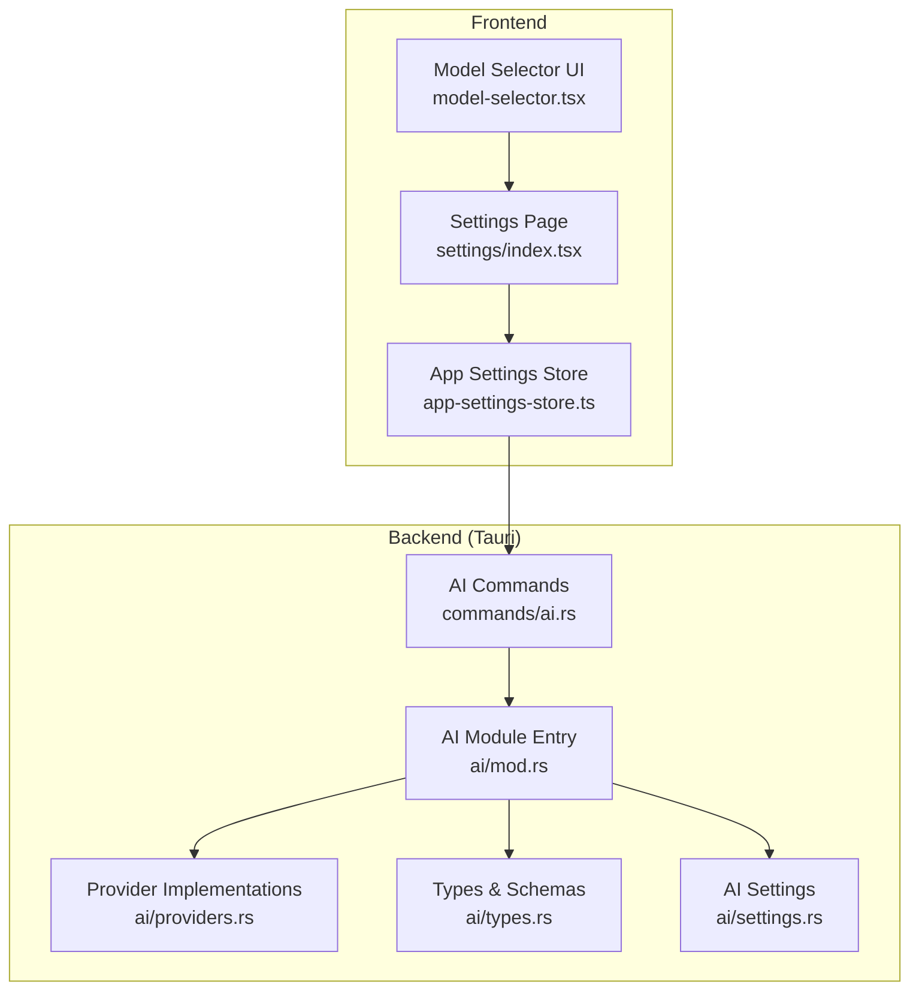
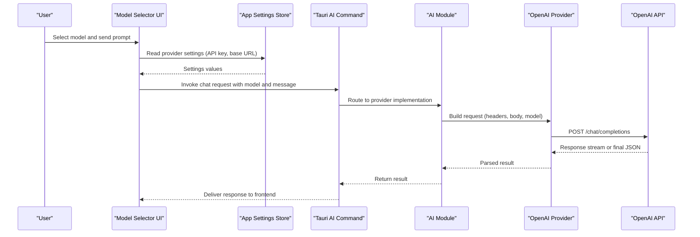
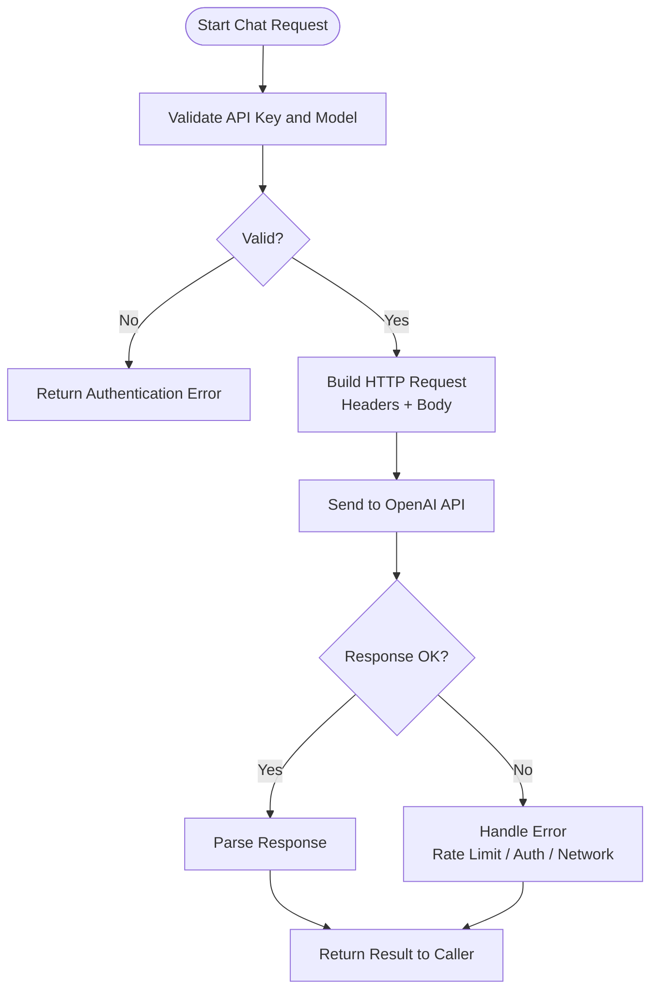
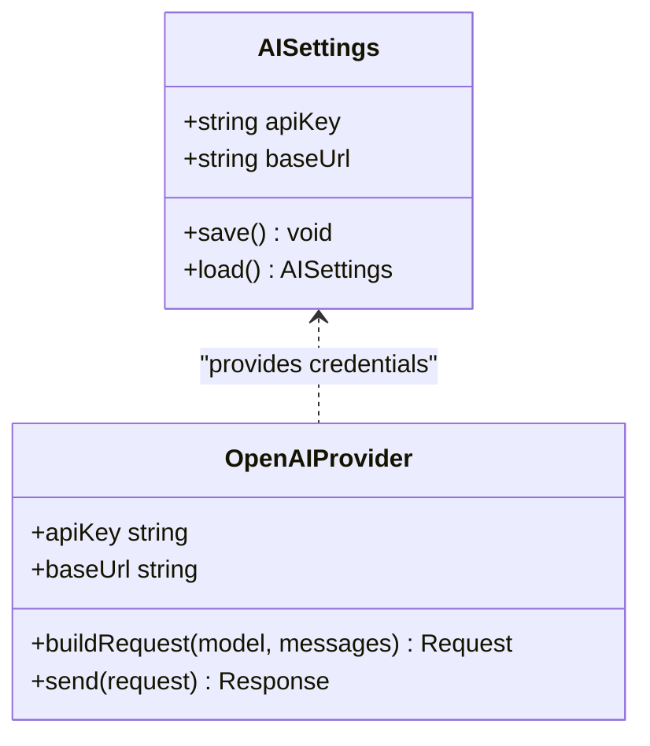
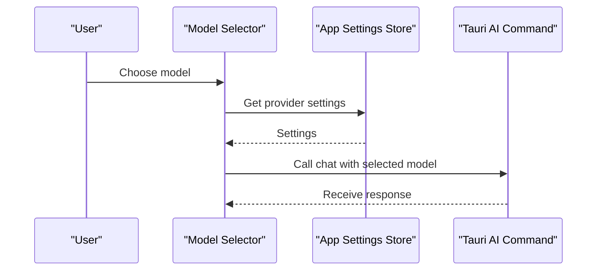
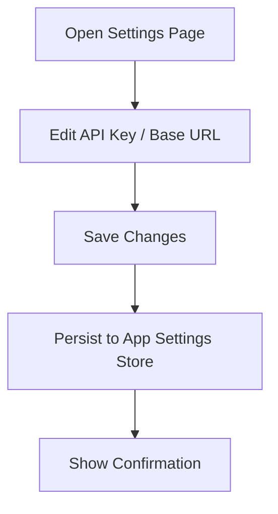
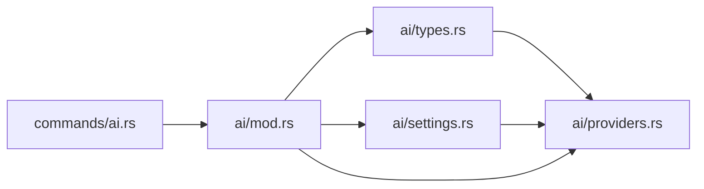

# OpenAI Provider

<cite>
**Referenced Files in This Document**
- [src-tauri/src/ai/mod.rs](file://src-tauri/src/ai/mod.rs)
- [src-tauri/src/ai/providers.rs](file://src-tauri/src/ai/providers.rs)
- [src-tauri/src/ai/settings.rs](file://src-tauri/src/ai/settings.rs)
- [src-tauri/src/ai/types.rs](file://src-tauri/src/ai/types.rs)
- [src-tauri/src/commands/ai.rs](file://src-tauri/src/commands/ai.rs)
- [src/components/ai-elements/model-selector.tsx](file://src/components/ai-elements/model-selector.tsx)
- [src/stores/app-settings-store.ts](file://src/stores/app-settings-store.ts)
- [src/pages/settings/index.tsx](file://src/pages/settings/index.tsx)
</cite>

## Table of Contents
1. [Introduction](#introduction)
2. [Project Structure](#project-structure)
3. [Core Components](#core-components)
4. [Architecture Overview](#architecture-overview)
5. [Detailed Component Analysis](#detailed-component-analysis)
6. [Dependency Analysis](#dependency-analysis)
7. [Performance Considerations](#performance-considerations)
8. [Troubleshooting Guide](#troubleshooting-guide)
9. [Conclusion](#conclusion)

## Introduction
This document explains how to configure and use the OpenAI provider within Apprecon. It covers obtaining an API key from the OpenAI dashboard, configuring provider settings in Apprecon, selecting models (such as GPT-4 and GPT-3.5-turbo), understanding rate limits and pricing considerations, testing your connection, and troubleshooting common authentication issues. The guidance is based on the Apprecon codebase’s AI module and UI components that expose provider configuration and model selection.

## Project Structure
Apprecon integrates AI capabilities through a Rust-based backend (Tauri) and a React frontend. The OpenAI provider is implemented in the Rust AI module and exposed via Tauri commands. The frontend provides UI for model selection and settings management.

**Diagram sources**
- [src/components/ai-elements/model-selector.tsx](file://src/components/ai-elements/model-selector.tsx)
- [src/pages/settings/index.tsx](file://src/pages/settings/index.tsx)
- [src/stores/app-settings-store.ts](file://src/stores/app-settings-store.ts)
- [src-tauri/src/commands/ai.rs](file://src-tauri/src/commands/ai.rs)
- [src-tauri/src/ai/mod.rs](file://src-tauri/src/ai/mod.rs)
- [src-tauri/src/ai/providers.rs](file://src-tauri/src/ai/providers.rs)
- [src-tauri/src/ai/types.rs](file://src-tauri/src/ai/types.rs)
- [src-tauri/src/ai/settings.rs](file://src-tauri/src/ai/settings.rs)

**Section sources**
- [src-tauri/src/ai/mod.rs](file://src-tauri/src/ai/mod.rs)
- [src-tauri/src/ai/providers.rs](file://src-tauri/src/ai/providers.rs)
- [src-tauri/src/ai/settings.rs](file://src-tauri/src/ai/settings.rs)
- [src-tauri/src/ai/types.rs](file://src-tauri/src/ai/types.rs)
- [src-tauri/src/commands/ai.rs](file://src-tauri/src/commands/ai.rs)
- [src/components/ai-elements/model-selector.tsx](file://src/components/ai-elements/model-selector.tsx)
- [src/stores/app-settings-store.ts](file://src/stores/app-settings-store.ts)
- [src/pages/settings/index.tsx](file://src/pages/settings/index.tsx)

## Core Components
- AI Module Entry: Centralizes AI functionality and routes calls to providers.
- Provider Implementations: Contains the OpenAI provider logic, including request formatting and response handling.
- Types and Schemas: Defines data structures used across AI operations, including model identifiers and request/response payloads.
- Settings: Manages persisted AI provider configuration, such as API keys and base URLs.
- Tauri Commands: Exposes AI operations to the frontend, enabling configuration updates and chat requests.
- Frontend Model Selector: UI component allowing users to choose available models.
- Settings Page and Store: Provide user-facing configuration and persist settings.

Key responsibilities:
- OpenAI provider: Builds HTTP requests to OpenAI endpoints using configured credentials and selected model.
- Settings: Stores and retrieves API keys securely and persists provider preferences.
- Commands: Bridges frontend actions with backend provider calls.
- UI: Presents model options and collects user inputs.

**Section sources**
- [src-tauri/src/ai/mod.rs](file://src-tauri/src/ai/mod.rs)
- [src-tauri/src/ai/providers.rs](file://src-tauri/src/ai/providers.rs)
- [src-tauri/src/ai/types.rs](file://src-tauri/src/ai/types.rs)
- [src-tauri/src/ai/settings.rs](file://src-tauri/src/ai/settings.rs)
- [src-tauri/src/commands/ai.rs](file://src-tauri/src/commands/ai.rs)
- [src/components/ai-elements/model-selector.tsx](file://src/components/ai-elements/model-selector.tsx)
- [src/stores/app-settings-store.ts](file://src/stores/app-settings-store.ts)
- [src/pages/settings/index.tsx](file://src/pages/settings/index.tsx)

## Architecture Overview
The OpenAI provider is invoked by the frontend through Tauri commands. The backend constructs requests to OpenAI’s API using the configured API key and selected model. Responses are returned to the frontend for display or further processing.

**Diagram sources**
- [src/components/ai-elements/model-selector.tsx](file://src/components/ai-elements/model-selector.tsx)
- [src/stores/app-settings-store.ts](file://src/stores/app-settings-store.ts)
- [src-tauri/src/commands/ai.rs](file://src-tauri/src/commands/ai.rs)
- [src-tauri/src/ai/mod.rs](file://src-tauri/src/ai/mod.rs)
- [src-tauri/src/ai/providers.rs](file://src-tauri/src/ai/providers.rs)

## Detailed Component Analysis

### OpenAI Provider Implementation
The OpenAI provider handles:
- Request construction: Adds Authorization headers with the API key and sets the model field.
- Endpoint usage: Targets OpenAI’s chat completions endpoint.
- Error mapping: Translates HTTP errors into meaningful messages for the UI.
- Rate limiting awareness: Observes retry-after headers and status codes indicating throttling.

**Diagram sources**
- [src-tauri/src/ai/providers.rs](file://src-tauri/src/ai/providers.rs)
- [src-tauri/src/ai/types.rs](file://src-tauri/src/ai/types.rs)

**Section sources**
- [src-tauri/src/ai/providers.rs](file://src-tauri/src/ai/providers.rs)
- [src-tauri/src/ai/types.rs](file://src-tauri/src/ai/types.rs)

### Settings and Configuration
- API Key Management: Stored securely and loaded when making requests.
- Base URL: Allows overriding default OpenAI endpoint if needed.
- Persistence: Settings are saved and reloaded across sessions.

**Diagram sources**
- [src-tauri/src/ai/settings.rs](file://src-tauri/src/ai/settings.rs)
- [src-tauri/src/ai/providers.rs](file://src-tauri/src/ai/providers.rs)

**Section sources**
- [src-tauri/src/ai/settings.rs](file://src-tauri/src/ai/settings.rs)
- [src-tauri/src/ai/providers.rs](file://src-tauri/src/ai/providers.rs)

### Frontend Model Selection
- Model Selector UI: Displays available models and sends the chosen model to the backend.
- Settings Integration: Reads current provider settings from the store before invoking commands.

**Diagram sources**
- [src/components/ai-elements/model-selector.tsx](file://src/components/ai-elements/model-selector.tsx)
- [src/stores/app-settings-store.ts](file://src/stores/app-settings-store.ts)
- [src-tauri/src/commands/ai.rs](file://src-tauri/src/commands/ai.rs)

**Section sources**
- [src/components/ai-elements/model-selector.tsx](file://src/components/ai-elements/model-selector.tsx)
- [src/stores/app-settings-store.ts](file://src/stores/app-settings-store.ts)
- [src-tauri/src/commands/ai.rs](file://src-tauri/src/commands/ai.rs)

### Settings Page
- Provides a UI to enter or update the OpenAI API key and base URL.
- Persists changes to the app settings store.

**Diagram sources**
- [src/pages/settings/index.tsx](file://src/pages/settings/index.tsx)
- [src/stores/app-settings-store.ts](file://src/stores/app-settings-store.ts)

**Section sources**
- [src/pages/settings/index.tsx](file://src/pages/settings/index.tsx)
- [src/stores/app-settings-store.ts](file://src/stores/app-settings-store.ts)

## Dependency Analysis
The OpenAI provider depends on:
- Types for consistent request/response schemas.
- Settings for credentials and base URL.
- Tauri commands for frontend-backend communication.
- The AI module entry for routing and orchestration.

**Diagram sources**
- [src-tauri/src/ai/types.rs](file://src-tauri/src/ai/types.rs)
- [src-tauri/src/ai/providers.rs](file://src-tauri/src/ai/providers.rs)
- [src-tauri/src/ai/settings.rs](file://src-tauri/src/ai/settings.rs)
- [src-tauri/src/commands/ai.rs](file://src-tauri/src/commands/ai.rs)
- [src-tauri/src/ai/mod.rs](file://src-tauri/src/ai/mod.rs)

**Section sources**
- [src-tauri/src/ai/types.rs](file://src-tauri/src/ai/types.rs)
- [src-tauri/src/ai/providers.rs](file://src-tauri/src/ai/providers.rs)
- [src-tauri/src/ai/settings.rs](file://src-tauri/src/ai/settings.rs)
- [src-tauri/src/commands/ai.rs](file://src-tauri/src/commands/ai.rs)
- [src-tauri/src/ai/mod.rs](file://src-tauri/src/ai/mod.rs)

## Performance Considerations
- Model Selection: Prefer smaller models (e.g., GPT-3.5-turbo) for high-volume tasks; use larger models (e.g., GPT-4) for complex reasoning.
- Request Batching: Combine related prompts where possible to reduce overhead.
- Caching: Cache repeated responses at the application level to avoid redundant API calls.
- Streaming: Use streaming responses when supported to improve perceived latency.
- Rate Limiting: Respect retry-after headers and implement exponential backoff to handle throttling gracefully.
- Token Usage: Monitor token consumption per request to optimize cost and throughput.

[No sources needed since this section provides general guidance]

## Troubleshooting Guide
Common authentication issues and resolutions:
- Missing or invalid API key: Ensure the API key is correctly set in the settings page and has not expired.
- Incorrect base URL: Verify the base URL points to the official OpenAI endpoint unless using a proxy.
- Insufficient permissions: Confirm the account has access to the selected model and sufficient quota.
- Rate limit errors: If receiving throttling responses, wait according to retry-after headers or reduce request frequency.
- Network connectivity: Check firewall/proxy settings that might block outbound HTTPS traffic to OpenAI.

Steps to test the connection:
- Open the Settings page and save the API key and base URL.
- Use the Model Selector to choose a model and send a simple prompt.
- Observe the response; if successful, the provider is configured correctly.
- If errors occur, review error messages and adjust credentials or network settings accordingly.

Best practices for efficient API usage:
- Use concise prompts and structured outputs to minimize tokens.
- Avoid unnecessary retries; implement backoff strategies.
- Monitor usage in the OpenAI dashboard to stay within budget and limits.
- Rotate API keys periodically and restrict scope where possible.

**Section sources**
- [src-tauri/src/ai/providers.rs](file://src-tauri/src/ai/providers.rs)
- [src-tauri/src/ai/settings.rs](file://src-tauri/src/ai/settings.rs)
- [src/components/ai-elements/model-selector.tsx](file://src/components/ai-elements/model-selector.tsx)
- [src/pages/settings/index.tsx](file://src/pages/settings/index.tsx)

## Conclusion
Configuring the OpenAI provider in Apprecon involves setting up an API key and base URL in the settings, selecting an appropriate model via the UI, and ensuring robust error handling and rate-limit awareness. By following the steps outlined here and adhering to best practices, you can achieve reliable and cost-effective AI integration within Apprecon.

[No sources needed since this section summarizes without analyzing specific files]