# Provider Comparison & Selection

<cite>
**Referenced Files in This Document**
- [providers.rs](file://src-tauri/src/ai/providers.rs)
- [settings.rs](file://src-tauri/src/ai/settings.rs)
- [types.rs](file://src-tauri/src/ai/types.rs)
- [mod.rs](file://src-tauri/src/ai/mod.rs)
- [chat.rs](file://src-tauri/src/ai/chat.rs)
- [commands.rs](file://src-tauri/src/ai/commands.rs)
- [keyring.rs](file://src-tauri/src/ai/keyring.rs)
- [auto_mark.rs](file://src-tauri/src/ai/auto_mark.rs)
- [ai.rs](file://src-tauri/src/commands/ai.rs)
- [app-settings-store.ts](file://src/stores/app-settings-store.ts)
- [model-selector.tsx](file://src/components/ai-elements/model-selector.tsx)
- [agent.tsx](file://src/components/ai-elements/agent.tsx)
- [conversation.tsx](file://src/components/ai-elements/conversation.tsx)
</cite>

## Table of Contents
1. [Introduction](#introduction)
2. [Project Structure](#project-structure)
3. [Core Components](#core-components)
4. [Architecture Overview](#architecture-overview)
5. [Detailed Component Analysis](#detailed-component-analysis)
6. [Dependency Analysis](#dependency-analysis)
7. [Performance Considerations](#performance-considerations)
8. [Troubleshooting Guide](#troubleshooting-guide)
9. [Conclusion](#conclusion)
10. [Appendices](#appendices)

## Introduction
This document provides a comprehensive comparison and selection guide for all supported AI providers in Apprecon. It focuses on feature differences, performance characteristics, cost considerations, and use case recommendations. It also documents provider switching mechanisms, fallback configurations, and multi-provider setups, along with decision matrices to help you choose the best provider based on privacy, cost, speed, and model capabilities.

## Project Structure
Apprecon’s AI subsystem is implemented primarily in Rust (Tauri backend) with UI integration via React components. The key areas are:
- AI core module and types
- Provider implementations and settings
- Command interfaces exposed to the frontend
- Keyring-based credential management
- Frontend stores and UI elements for model selection and conversation flows

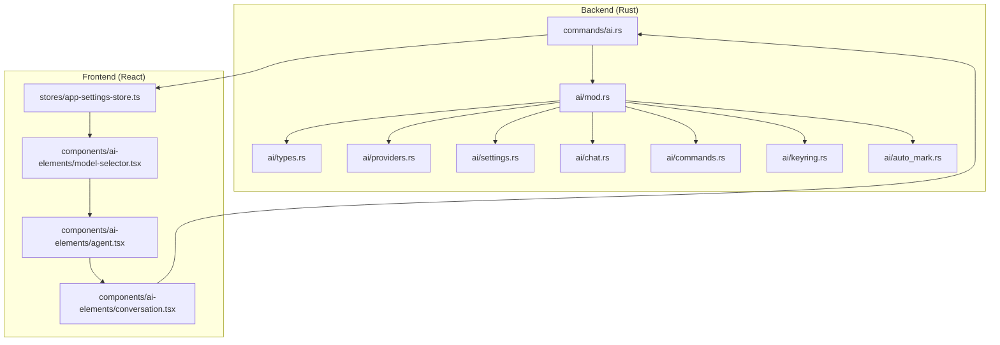

**Diagram sources**
- [mod.rs](file://src-tauri/src/ai/mod.rs)
- [types.rs](file://src-tauri/src/ai/types.rs)
- [providers.rs](file://src-tauri/src/ai/providers.rs)
- [settings.rs](file://src-tauri/src/ai/settings.rs)
- [chat.rs](file://src-tauri/src/ai/chat.rs)
- [commands.rs](file://src-tauri/src/ai/commands.rs)
- [keyring.rs](file://src-tauri/src/ai/keyring.rs)
- [auto_mark.rs](file://src-tauri/src/ai/auto_mark.rs)
- [ai.rs](file://src-tauri/src/commands/ai.rs)
- [app-settings-store.ts](file://src/stores/app-settings-store.ts)
- [model-selector.tsx](file://src/components/ai-elements/model-selector.tsx)
- [agent.tsx](file://src/components/ai-elements/agent.tsx)
- [conversation.tsx](file://src/components/ai-elements/conversation.tsx)

**Section sources**
- [mod.rs](file://src-tauri/src/ai/mod.rs)
- [types.rs](file://src-tauri/src/ai/types.rs)
- [providers.rs](file://src-tauri/src/ai/providers.rs)
- [settings.rs](file://src-tauri/src/ai/settings.rs)
- [chat.rs](file://src-tauri/src/ai/chat.rs)
- [commands.rs](file://src-tauri/src/ai/commands.rs)
- [keyring.rs](file://src-tauri/src/ai/keyring.rs)
- [auto_mark.rs](file://src-tauri/src/ai/auto_mark.rs)
- [ai.rs](file://src-tauri/src/commands/ai.rs)
- [app-settings-store.ts](file://src/stores/app-settings-store.ts)
- [model-selector.tsx](file://src/components/ai-elements/model-selector.tsx)
- [agent.tsx](file://src/components/ai-elements/agent.tsx)
- [conversation.tsx](file://src/components/ai-elements/conversation.tsx)

## Core Components
- AI Types and Contracts: Centralized type definitions for requests, responses, streaming chunks, and provider metadata.
- Providers Registry: Abstraction layer that registers and selects among multiple AI providers.
- Settings Management: Configuration for provider credentials, endpoints, timeouts, retries, and fallback chains.
- Chat Engine: Orchestrates message handling, streaming, and tool integrations across providers.
- Commands Bridge: Tauri commands exposing AI operations to the frontend.
- Keyring Integration: Secure storage and retrieval of API keys and secrets.
- Auto-marking: Automated tagging or classification utilities used by AI workflows.

Key responsibilities:
- Provider abstraction ensures consistent request/response formats regardless of underlying vendor.
- Settings encapsulate per-provider configuration and global defaults.
- Chat engine manages session state, context, and streaming output.
- Commands bridge exposes safe, versioned APIs to the UI.
- Keyring protects sensitive credentials.

**Section sources**
- [types.rs](file://src-tauri/src/ai/types.rs)
- [providers.rs](file://src-tauri/src/ai/providers.rs)
- [settings.rs](file://src-tauri/src/ai/settings.rs)
- [chat.rs](file://src-tauri/src/ai/chat.rs)
- [commands.rs](file://src-tauri/src/ai/commands.rs)
- [keyring.rs](file://src-tauri/src/ai/keyring.rs)
- [auto_mark.rs](file://src-tauri/src/ai/auto_mark.rs)

## Architecture Overview
The AI architecture follows a layered design:
- Frontend UI triggers actions through Tauri commands.
- Backend commands delegate to the chat engine.
- Chat engine selects a provider from the registry based on settings and current context.
- Provider implementation handles authentication, request formatting, streaming, and error mapping.
- Settings and keyring provide configuration and secure credential access.

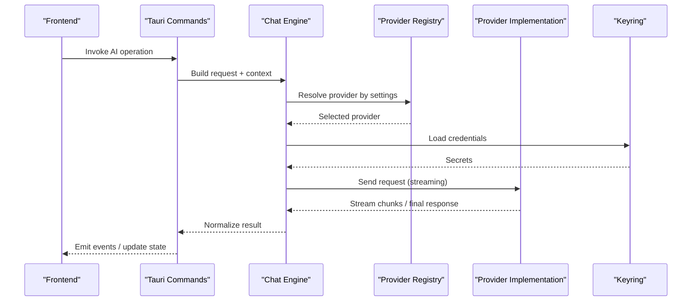

**Diagram sources**
- [ai.rs](file://src-tauri/src/commands/ai.rs)
- [chat.rs](file://src-tauri/src/ai/chat.rs)
- [providers.rs](file://src-tauri/src/ai/providers.rs)
- [keyring.rs](file://src-tauri/src/ai/keyring.rs)

**Section sources**
- [ai.rs](file://src-tauri/src/commands/ai.rs)
- [chat.rs](file://src-tauri/src/ai/chat.rs)
- [providers.rs](file://src-tauri/src/ai/providers.rs)
- [keyring.rs](file://src-tauri/src/ai/keyring.rs)

## Detailed Component Analysis

### AI Types and Contracts
- Defines standardized request/response schemas, streaming chunk structures, and provider capability flags.
- Ensures uniform behavior across providers and simplifies error handling.

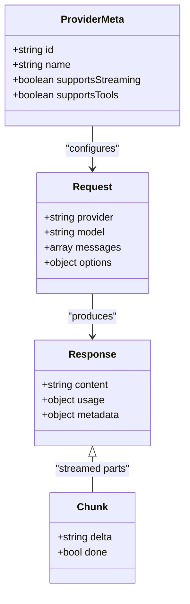

**Diagram sources**
- [types.rs](file://src-tauri/src/ai/types.rs)

**Section sources**
- [types.rs](file://src-tauri/src/ai/types.rs)

### Providers Registry and Implementations
- Registers available providers and exposes selection logic based on settings and runtime conditions.
- Each provider implements request construction, authentication, streaming, and error normalization.

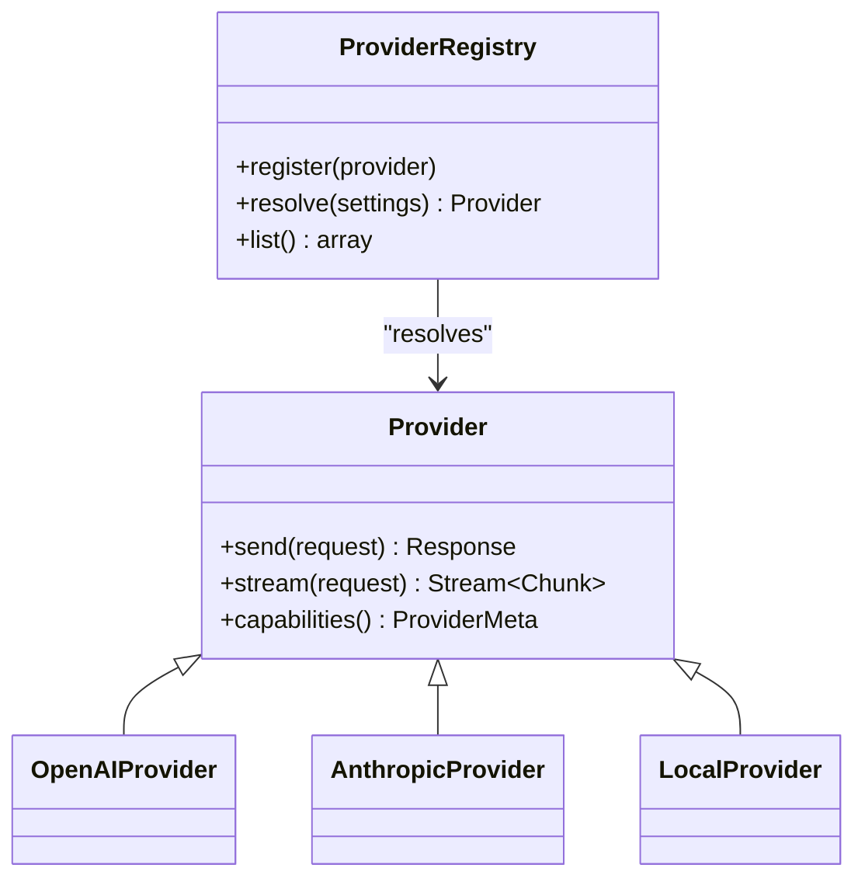

**Diagram sources**
- [providers.rs](file://src-tauri/src/ai/providers.rs)

**Section sources**
- [providers.rs](file://src-tauri/src/ai/providers.rs)

### Settings Management
- Stores per-provider configuration including endpoints, timeouts, retries, and fallback chains.
- Exposes getters/setters for dynamic updates and validates inputs.

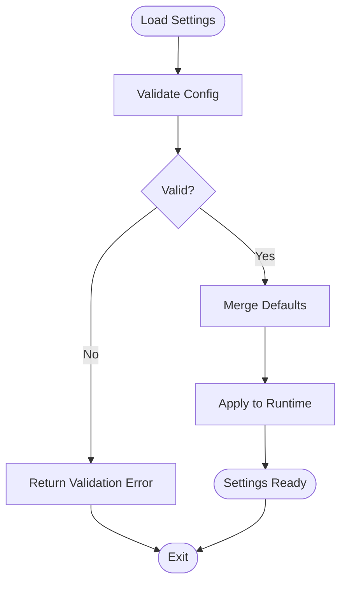

**Diagram sources**
- [settings.rs](file://src-tauri/src/ai/settings.rs)

**Section sources**
- [settings.rs](file://src-tauri/src/ai/settings.rs)

### Chat Engine
- Manages conversation state, builds prompts, integrates tools, and streams responses.
- Coordinates provider selection and fallback strategies.

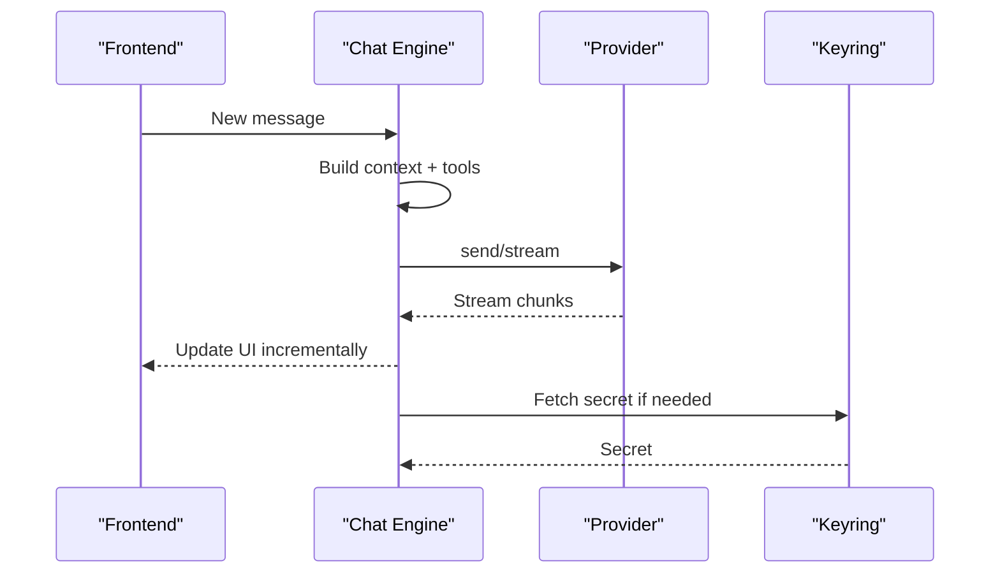

**Diagram sources**
- [chat.rs](file://src-tauri/src/ai/chat.rs)
- [keyring.rs](file://src-tauri/src/ai/keyring.rs)

**Section sources**
- [chat.rs](file://src-tauri/src/ai/chat.rs)
- [keyring.rs](file://src-tauri/src/ai/keyring.rs)

### Commands Bridge
- Exposes Tauri commands for AI operations invoked by the frontend.
- Validates inputs, delegates to chat engine, and returns normalized results.

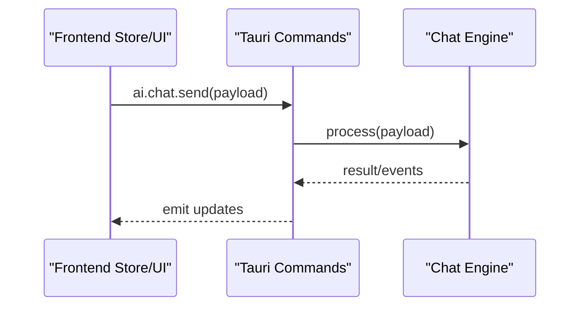

**Diagram sources**
- [ai.rs](file://src-tauri/src/commands/ai.rs)
- [chat.rs](file://src-tauri/src/ai/chat.rs)

**Section sources**
- [ai.rs](file://src-tauri/src/commands/ai.rs)
- [chat.rs](file://src-tauri/src/ai/chat.rs)

### Keyring Integration
- Securely stores and retrieves API keys and secrets.
- Provides platform-appropriate secure storage backends.

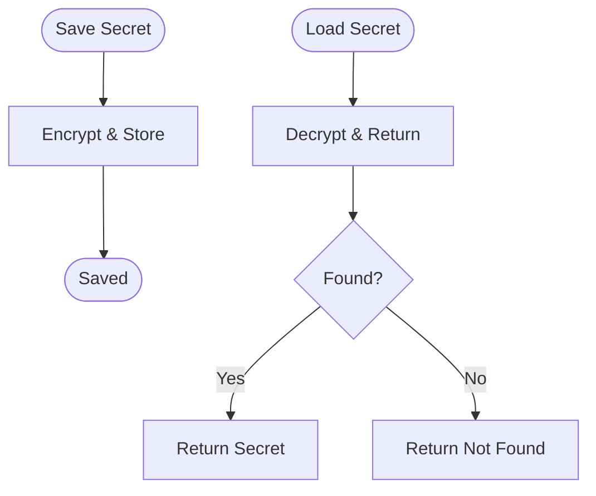

**Diagram sources**
- [keyring.rs](file://src-tauri/src/ai/keyring.rs)

**Section sources**
- [keyring.rs](file://src-tauri/src/ai/keyring.rs)

### Auto-marking Utilities
- Provides automated tagging/classification helpers used by AI workflows.
- Integrates with chat engine to enrich responses with structured metadata.

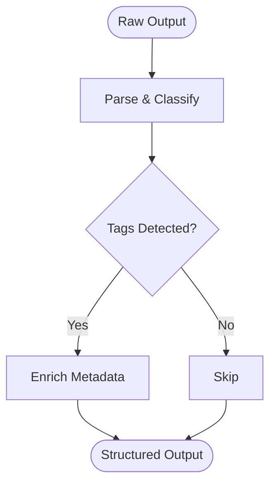

**Diagram sources**
- [auto_mark.rs](file://src-tauri/src/ai/auto_mark.rs)

**Section sources**
- [auto_mark.rs](file://src-tauri/src/ai/auto_mark.rs)

### Frontend Model Selector and Conversation UI
- Model selector component allows users to pick models and providers dynamically.
- Agent and conversation components manage prompt input, streaming display, and state synchronization.

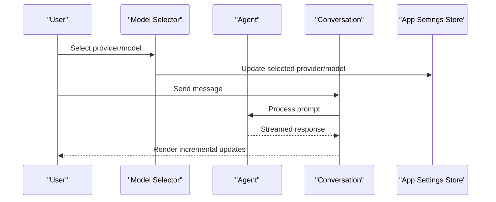

**Diagram sources**
- [model-selector.tsx](file://src/components/ai-elements/model-selector.tsx)
- [agent.tsx](file://src/components/ai-elements/agent.tsx)
- [conversation.tsx](file://src/components/ai-elements/conversation.tsx)
- [app-settings-store.ts](file://src/stores/app-settings-store.ts)

**Section sources**
- [model-selector.tsx](file://src/components/ai-elements/model-selector.tsx)
- [agent.tsx](file://src/components/ai-elements/agent.tsx)
- [conversation.tsx](file://src/components/ai-elements/conversation.tsx)
- [app-settings-store.ts](file://src/stores/app-settings-store.ts)

## Dependency Analysis
The AI subsystem has clear separation between UI and backend concerns:
- Frontend depends on Tauri commands and app settings store.
- Backend commands depend on chat engine, providers registry, settings, and keyring.
- Providers are decoupled via an abstract interface, enabling easy addition or replacement.

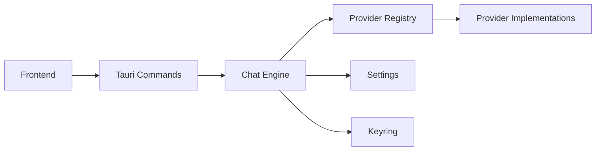

**Diagram sources**
- [ai.rs](file://src-tauri/src/commands/ai.rs)
- [chat.rs](file://src-tauri/src/ai/chat.rs)
- [providers.rs](file://src-tauri/src/ai/providers.rs)
- [settings.rs](file://src-tauri/src/ai/settings.rs)
- [keyring.rs](file://src-tauri/src/ai/keyring.rs)

**Section sources**
- [ai.rs](file://src-tauri/src/commands/ai.rs)
- [chat.rs](file://src-tauri/src/ai/chat.rs)
- [providers.rs](file://src-tauri/src/ai/providers.rs)
- [settings.rs](file://src-tauri/src/ai/settings.rs)
- [keyring.rs](file://src-tauri/src/ai/keyring.rs)

## Performance Considerations
- Streaming: Prefer providers that support streaming to reduce perceived latency and improve UX.
- Timeouts and Retries: Configure appropriate timeouts and retry policies per provider to balance reliability and responsiveness.
- Concurrency: Limit concurrent requests to avoid rate limits; implement backoff strategies where applicable.
- Caching: Cache frequent prompts or reusable contexts to reduce redundant calls.
- Resource Usage: Monitor memory and CPU usage when processing large payloads or long conversations.

[No sources needed since this section provides general guidance]

## Troubleshooting Guide
Common issues and resolutions:
- Authentication failures: Verify keyring entries and provider endpoint URLs; ensure correct scopes and permissions.
- Rate limiting: Implement exponential backoff and queue requests; consider rotating keys or providers.
- Streaming interruptions: Handle partial responses gracefully; resume or re-request failed segments.
- Model unavailability: Use fallback chains to switch to alternative models or providers automatically.
- Configuration errors: Validate settings at startup; surface user-friendly errors in the UI.

**Section sources**
- [keyring.rs](file://src-tauri/src/ai/keyring.rs)
- [settings.rs](file://src-tauri/src/ai/settings.rs)
- [chat.rs](file://src-tauri/src/ai/chat.rs)

## Conclusion
Apprecon’s AI subsystem provides a robust, extensible framework for integrating multiple AI providers. By leveraging a unified interface, secure credential management, and flexible configuration, teams can tailor provider selection to their specific needs around privacy, cost, speed, and capabilities. The provided diagrams and analysis should aid in understanding the architecture and making informed decisions about provider adoption and fallback strategies.

[No sources needed since this section summarizes without analyzing specific files]

## Appendices

### Feature Comparison Matrix
- Privacy: Evaluate data retention policies, local vs. cloud processing, and compliance requirements.
- Cost: Compare pricing models (per token, subscription, pay-as-you-go) and estimate usage costs.
- Speed: Measure latency and throughput under typical workloads; prefer streaming where possible.
- Accuracy: Benchmark model outputs against ground truth datasets for your domain tasks.
- Capabilities: Check support for tools, function calling, multimodal inputs, and custom fine-tuning.

[No sources needed since this section provides general guidance]

### Decision Matrices
- High privacy, low cost: Favor local providers or self-hosted models with minimal external dependencies.
- High accuracy, moderate cost: Choose top-tier commercial models with strong benchmarks in your domain.
- Low latency, high throughput: Optimize for providers with fast inference and streaming support.
- Multi-region availability: Select providers with global edge locations and redundancy.

[No sources needed since this section provides general guidance]

### Provider Switching and Fallbacks
- Dynamic switching: Allow runtime selection of providers/models via UI controls and settings.
- Fallback chains: Define ordered lists of providers/models to try on failure or rate limit.
- Health checks: Periodically probe provider endpoints and adjust routing accordingly.
- Metrics collection: Track success rates, latency, and costs per provider to inform decisions.

**Section sources**
- [settings.rs](file://src-tauri/src/ai/settings.rs)
- [providers.rs](file://src-tauri/src/ai/providers.rs)
- [chat.rs](file://src-tauri/src/ai/chat.rs)

### Multi-Provider Setup
- Register multiple providers in the registry with distinct identifiers.
- Configure per-provider credentials and endpoints securely via keyring.
- Set default provider and fallback order in settings.
- Use environment variables or config files for non-sensitive parameters.

**Section sources**
- [providers.rs](file://src-tauri/src/ai/providers.rs)
- [settings.rs](file://src-tauri/src/ai/settings.rs)
- [keyring.rs](file://src-tauri/src/ai/keyring.rs)