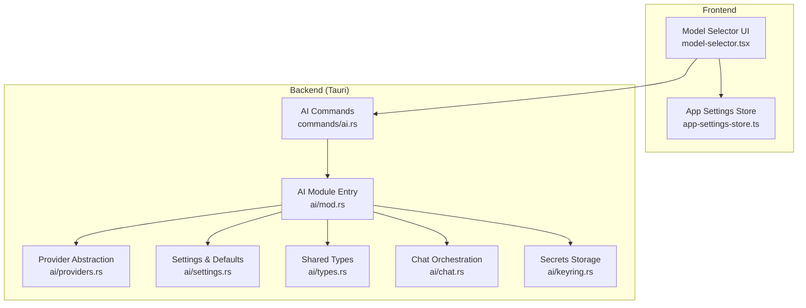
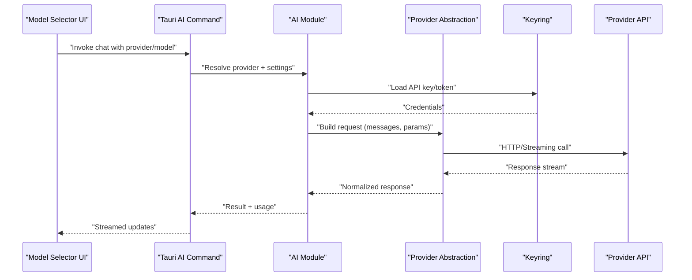
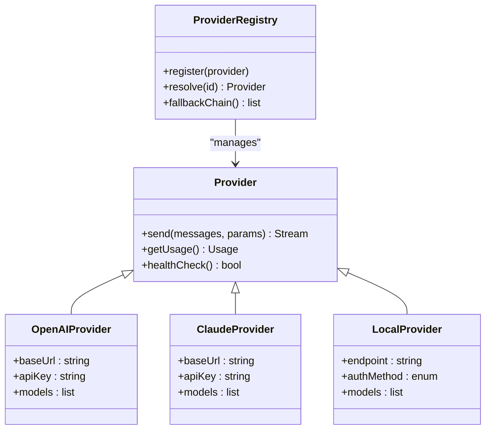
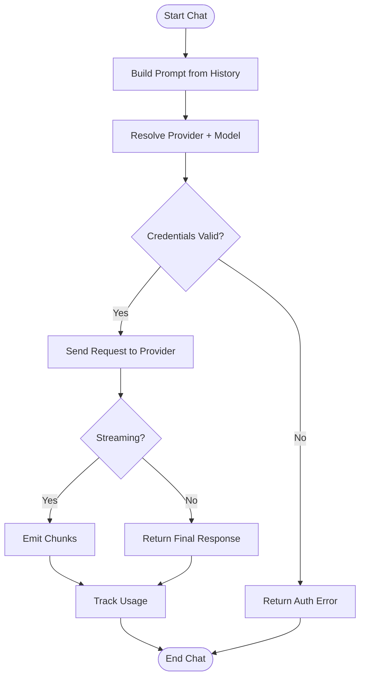
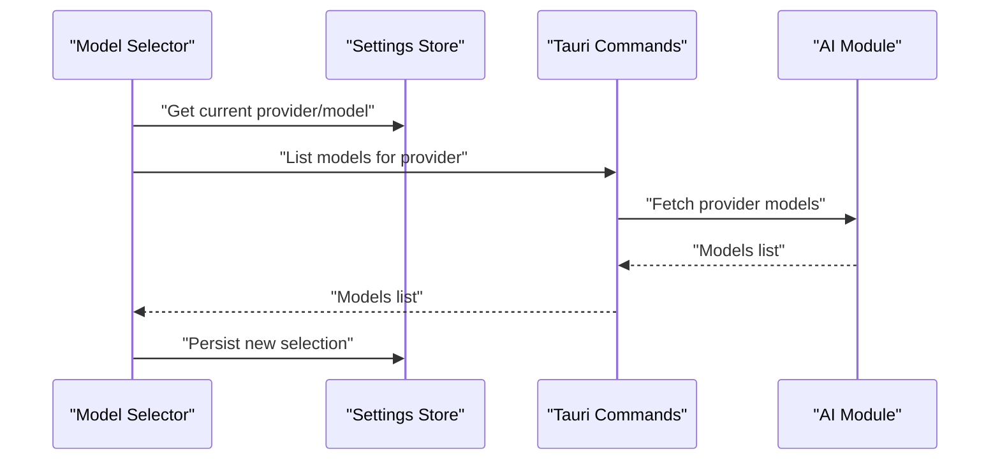
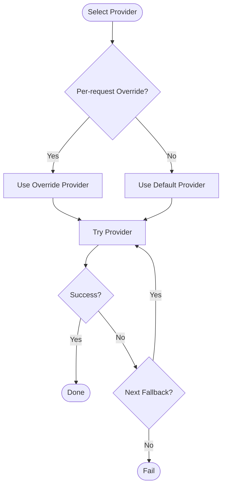
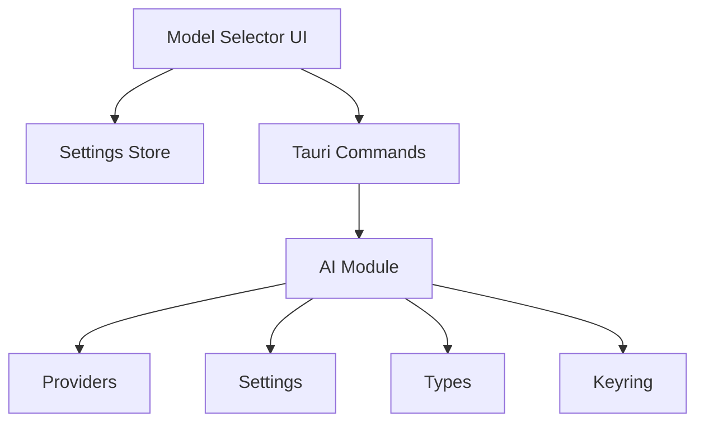

# Supported AI Providers

<cite>
**Referenced Files in This Document**
- [src-tauri/src/ai/mod.rs](file://src-tauri/src/ai/mod.rs)
- [src-tauri/src/ai/providers.rs](file://src-tauri/src/ai/providers.rs)
- [src-tauri/src/ai/settings.rs](file://src-tauri/src/ai/settings.rs)
- [src-tauri/src/ai/types.rs](file://src-tauri/src/ai/types.rs)
- [src-tauri/src/ai/chat.rs](file://src-tauri/src/ai/chat.rs)
- [src-tauri/src/ai/keyring.rs](file://src-tauri/src/ai/keyring.rs)
- [src-tauri/src/commands/ai.rs](file://src-tauri/src/commands/ai.rs)
- [src/components/ai-elements/model-selector.tsx](file://src/components/ai-elements/model-selector.tsx)
- [src/stores/app-settings-store.ts](file://src/stores/app-settings-store.ts)
</cite>

## Table of Contents
1. [Introduction](#introduction)
2. [Project Structure](#project-structure)
3. [Core Components](#core-components)
4. [Architecture Overview](#architecture-overview)
5. [Detailed Component Analysis](#detailed-component-analysis)
6. [Dependency Analysis](#dependency-analysis)
7. [Performance Considerations](#performance-considerations)
8. [Troubleshooting Guide](#troubleshooting-guide)
9. [Conclusion](#conclusion)
10. [Appendices](#appendices)

## Introduction
This document explains how Apprecon integrates with multiple AI providers, focusing on supported providers (OpenAI, Claude, and local models), configuration requirements, authentication methods, provider-specific parameters, rate limits, pricing considerations, setup instructions, provider selection logic, fallback mechanisms, and dynamic switching between providers. It is intended for both technical and non-technical users who need to configure and operate AI features within Apprecon.

## Project Structure
Apprecon’s AI integration spans the Rust backend (Tauri) and the React frontend:
- Backend modules define provider abstractions, settings, types, chat orchestration, and keyring-based secret storage.
- Frontend components expose model/provider selection UI and persist user preferences.

**Diagram sources**
- [src/components/ai-elements/model-selector.tsx](file://src/components/ai-elements/model-selector.tsx)
- [src/stores/app-settings-store.ts](file://src/stores/app-settings-store.ts)
- [src-tauri/src/commands/ai.rs](file://src-tauri/src/commands/ai.rs)
- [src-tauri/src/ai/mod.rs](file://src-tauri/src/ai/mod.rs)
- [src-tauri/src/ai/providers.rs](file://src-tauri/src/ai/providers.rs)
- [src-tauri/src/ai/settings.rs](file://src-tauri/src/ai/settings.rs)
- [src-tauri/src/ai/types.rs](file://src-tauri/src/ai/types.rs)
- [src-tauri/src/ai/chat.rs](file://src-tauri/src/ai/chat.rs)
- [src-tauri/src/ai/keyring.rs](file://src-tauri/src/ai/keyring.rs)

**Section sources**
- [src-tauri/src/ai/mod.rs](file://src-tauri/src/ai/mod.rs)
- [src-tauri/src/ai/providers.rs](file://src-tauri/src/ai/providers.rs)
- [src-tauri/src/ai/settings.rs](file://src-tauri/src/ai/settings.rs)
- [src-tauri/src/ai/types.rs](file://src-tauri/src/ai/types.rs)
- [src-tauri/src/ai/chat.rs](file://src-tauri/src/ai/chat.rs)
- [src-tauri/src/ai/keyring.rs](file://src-tauri/src/ai/keyring.rs)
- [src-tauri/src/commands/ai.rs](file://src-tauri/src/commands/ai.rs)
- [src/components/ai-elements/model-selector.tsx](file://src/components/ai-elements/model-selector.tsx)
- [src/stores/app-settings-store.ts](file://src/stores/app-settings-store.ts)

## Core Components
- Provider abstraction layer: Defines a common interface for all AI providers and encapsulates request/response handling, streaming, and error mapping.
- Settings module: Holds default configurations, environment variable mappings, and validation rules for provider credentials and endpoints.
- Types module: Centralizes shared data structures used across AI modules (e.g., messages, choices, usage).
- Chat orchestration: Manages conversation state, message formatting, and provider invocation.
- Keyring integration: Securely stores API keys and secrets using the system keychain.
- Tauri commands: Expose AI operations to the frontend via secure IPC.
- Frontend model selector: Allows users to pick a provider and model, and persists selections.

Key responsibilities:
- Provider selection and routing based on configured defaults or per-request overrides.
- Authentication handling (API keys, tokens, or local runtime).
- Rate limiting and retry strategies where applicable.
- Error normalization and reporting back to the UI.

**Section sources**
- [src-tauri/src/ai/providers.rs](file://src-tauri/src/ai/providers.rs)
- [src-tauri/src/ai/settings.rs](file://src-tauri/src/ai/settings.rs)
- [src-tauri/src/ai/types.rs](file://src-tauri/src/ai/types.rs)
- [src-tauri/src/ai/chat.rs](file://src-tauri/src/ai/chat.rs)
- [src-tauri/src/ai/keyring.rs](file://src-tauri/src/ai/keyring.rs)
- [src-tauri/src/commands/ai.rs](file://src-tauri/src/commands/ai.rs)
- [src/components/ai-elements/model-selector.tsx](file://src/components/ai-elements/model-selector.tsx)
- [src/stores/app-settings-store.ts](file://src/stores/app-settings-store.ts)

## Architecture Overview
The AI subsystem follows a layered architecture:
- Frontend triggers AI actions through Tauri commands.
- Backend commands delegate to the AI module, which resolves the active provider from settings or request context.
- The provider abstraction executes requests against the selected provider’s API, handling auth, headers, and streaming responses.
- Errors are normalized and returned to the frontend for display.

**Diagram sources**
- [src-tauri/src/commands/ai.rs](file://src-tauri/src/commands/ai.rs)
- [src-tauri/src/ai/mod.rs](file://src-tauri/src/ai/mod.rs)
- [src-tauri/src/ai/providers.rs](file://src-tauri/src/ai/providers.rs)
- [src-tauri/src/ai/keyring.rs](file://src-tauri/src/ai/keyring.rs)

## Detailed Component Analysis

### Provider Abstraction and Selection Logic
- Provider interface: Unified contract for sending messages, streaming responses, and retrieving usage metadata.
- Provider registry: Maps provider identifiers (e.g., OpenAI, Claude, Local) to concrete implementations.
- Selection logic: Chooses the active provider based on:
  - Global default provider from settings.
  - Per-request override if supplied by the caller.
  - Fallback chain when the primary provider is unavailable or returns errors.

**Diagram sources**
- [src-tauri/src/ai/providers.rs](file://src-tauri/src/ai/providers.rs)

**Section sources**
- [src-tauri/src/ai/providers.rs](file://src-tauri/src/ai/providers.rs)

### Settings and Configuration
- Default provider and model selection stored in app settings.
- Environment variables can override provider endpoints and keys.
- Validation ensures required fields (e.g., API keys, base URLs) are present before use.
- Secret management delegates to the keyring for secure storage.

Configuration touchpoints:
- Global defaults: provider id, model id, temperature, max tokens.
- Per-provider overrides: custom base URL, timeout, headers.
- Secrets: API keys, bearer tokens, or local runtime flags.

**Section sources**
- [src-tauri/src/ai/settings.rs](file://src-tauri/src/ai/settings.rs)
- [src-tauri/src/ai/keyring.rs](file://src-tauri/src/ai/keyring.rs)
- [src/stores/app-settings-store.ts](file://src/stores/app-settings-store.ts)

### Shared Types and Data Models
- Message schema: role, content, optional attachments or tool calls.
- Choice schema: index, finish reason, usage counters.
- Usage schema: token counts, cost estimates (if available).
- Error schema: normalized error codes and messages.

These types ensure consistent serialization across frontend and backend and simplify error handling.

**Section sources**
- [src-tauri/src/ai/types.rs](file://src-tauri/src/ai/types.rs)

### Chat Orchestration
- Builds provider-agnostic prompts from conversation history.
- Applies provider-specific parameters (temperature, top_p, stop sequences).
- Streams responses incrementally to the UI.
- Tracks usage and exposes metrics.

**Diagram sources**
- [src-tauri/src/ai/chat.rs](file://src-tauri/src/ai/chat.rs)

**Section sources**
- [src-tauri/src/ai/chat.rs](file://src-tauri/src/ai/chat.rs)

### Tauri Commands and Frontend Integration
- Commands expose functions like “create session,” “send message,” “list models,” and “update settings.”
- Frontend model selector reads available models and allows dynamic switching.
- Settings store persists provider choice and model selection across sessions.

**Diagram sources**
- [src-tauri/src/commands/ai.rs](file://src-tauri/src/commands/ai.rs)
- [src/components/ai-elements/model-selector.tsx](file://src/components/ai-elements/model-selector.tsx)
- [src/stores/app-settings-store.ts](file://src/stores/app-settings-store.ts)

**Section sources**
- [src-tauri/src/commands/ai.rs](file://src-tauri/src/commands/ai.rs)
- [src/components/ai-elements/model-selector.tsx](file://src/components/ai-elements/model-selector.tsx)
- [src/stores/app-settings-store.ts](file://src/stores/app-settings-store.ts)

### Provider-Specific Details

#### OpenAI
- Authentication: API key stored securely via keyring; passed as Authorization header.
- Base endpoint: Configurable; defaults to official OpenAI endpoint.
- Parameters: temperature, max_tokens, top_p, frequency_penalty, presence_penalty, stop sequences.
- Rate limits: Enforced by provider; implement retries with exponential backoff on 429 responses.
- Pricing: Token-based; monitor usage via response metadata.

Setup steps:
1. Obtain an OpenAI API key.
2. Configure the provider in settings or environment variables.
3. Select the desired model in the UI.
4. Test connectivity via the “list models” command.

Fallback behavior:
- If OpenAI fails due to network or quota issues, switch to the next provider in the fallback chain.

**Section sources**
- [src-tauri/src/ai/providers.rs](file://src-tauri/src/ai/providers.rs)
- [src-tauri/src/ai/settings.rs](file://src-tauri/src/ai/settings.rs)
- [src-tauri/src/ai/keyring.rs](file://src-tauri/src/ai/keyring.rs)

#### Claude (Anthropic)
- Authentication: API key stored securely via keyring; passed as Authorization header.
- Base endpoint: Configurable; defaults to official Anthropic endpoint.
- Parameters: temperature, max_tokens, top_p, stop sequences, system prompts.
- Rate limits: Enforced by provider; implement retries with exponential backoff on 429 responses.
- Pricing: Token-based; monitor usage via response metadata.

Setup steps:
1. Obtain an Anthropic API key.
2. Configure the provider in settings or environment variables.
3. Select the desired Claude model in the UI.
4. Test connectivity via the “list models” command.

Fallback behavior:
- If Claude fails due to network or quota issues, switch to the next provider in the fallback chain.

**Section sources**
- [src-tauri/src/ai/providers.rs](file://src-tauri/src/ai/providers.rs)
- [src-tauri/src/ai/settings.rs](file://src-tauri/src/ai/settings.rs)
- [src-tauri/src/ai/keyring.rs](file://src-tauri/src/ai/keyring.rs)

#### Local Models
- Authentication: No external API key; may require local server endpoint and optional bearer token.
- Base endpoint: Points to a local inference server (e.g., Ollama, vLLM, llama.cpp server).
- Parameters: Vary by server; typically temperature, top_p, max tokens, stop sequences.
- Rate limits: Determined by local hardware; manage concurrency to avoid resource exhaustion.
- Pricing: Free (local compute); consider CPU/GPU utilization costs.

Setup steps:
1. Install and start a local inference server.
2. Configure the local provider endpoint in settings.
3. Optionally set a bearer token if your server requires it.
4. Select a locally available model in the UI.
5. Test connectivity via the “list models” command.

Fallback behavior:
- If the local server is unreachable, fall back to a cloud provider if configured.

**Section sources**
- [src-tauri/src/ai/providers.rs](file://src-tauri/src/ai/providers.rs)
- [src-tauri/src/ai/settings.rs](file://src-tauri/src/ai/settings.rs)
- [src-tauri/src/ai/keyring.rs](file://src-tauri/src/ai/keyring.rs)

### Provider Selection Logic and Dynamic Switching
- Default provider is read from settings at startup.
- Per-request overrides allow temporary switching without changing global defaults.
- Fallback chain is evaluated sequentially until a provider responds successfully.
- UI enables dynamic switching; changes are persisted to the settings store.

**Diagram sources**
- [src-tauri/src/ai/providers.rs](file://src-tauri/src/ai/providers.rs)
- [src-tauri/src/ai/settings.rs](file://src-tauri/src/ai/settings.rs)

**Section sources**
- [src-tauri/src/ai/providers.rs](file://src-tauri/src/ai/providers.rs)
- [src-tauri/src/ai/settings.rs](file://src-tauri/src/ai/settings.rs)
- [src/components/ai-elements/model-selector.tsx](file://src/components/ai-elements/model-selector.tsx)
- [src/stores/app-settings-store.ts](file://src/stores/app-settings-store.ts)

## Dependency Analysis
- Frontend depends on Tauri commands for AI operations and on the settings store for persistence.
- Backend AI module depends on provider implementations, settings, types, and keyring.
- Commands depend on the AI module to execute operations securely.

**Diagram sources**
- [src/components/ai-elements/model-selector.tsx](file://src/components/ai-elements/model-selector.tsx)
- [src/stores/app-settings-store.ts](file://src/stores/app-settings-store.ts)
- [src-tauri/src/commands/ai.rs](file://src-tauri/src/commands/ai.rs)
- [src-tauri/src/ai/mod.rs](file://src-tauri/src/ai/mod.rs)
- [src-tauri/src/ai/providers.rs](file://src-tauri/src/ai/providers.rs)
- [src-tauri/src/ai/settings.rs](file://src-tauri/src/ai/settings.rs)
- [src-tauri/src/ai/types.rs](file://src-tauri/src/ai/types.rs)
- [src-tauri/src/ai/keyring.rs](file://src-tauri/src/ai/keyring.rs)

**Section sources**
- [src-tauri/src/ai/mod.rs](file://src-tauri/src/ai/mod.rs)
- [src-tauri/src/commands/ai.rs](file://src-tauri/src/commands/ai.rs)

## Performance Considerations
- Streaming responses reduce perceived latency; ensure efficient chunk processing in the UI.
- Implement exponential backoff and jitter for retries on transient errors (network, 429).
- Cache model lists where appropriate to minimize repeated requests.
- Monitor usage and enforce client-side rate limits to avoid hitting provider quotas.
- For local models, tune concurrency and batch sizes to match hardware capabilities.

[No sources needed since this section provides general guidance]

## Troubleshooting Guide
Common issues and resolutions:
- Authentication failures: Verify API keys in the keyring and ensure correct provider selection.
- Endpoint misconfiguration: Confirm base URLs and paths; test connectivity via “list models.”
- Rate limit errors: Implement retries with backoff; consider upgrading plan or reducing request volume.
- Local server unreachable: Ensure the local inference server is running and accessible; check firewall settings.
- Inconsistent settings: Clear and re-save provider settings; verify environment variable precedence.

Diagnostic steps:
- Use the “list models” command to validate provider connectivity.
- Inspect error messages from the provider abstraction for normalized codes.
- Check logs in the Tauri backend for detailed traces.

**Section sources**
- [src-tauri/src/ai/providers.rs](file://src-tauri/src/ai/providers.rs)
- [src-tauri/src/ai/keyring.rs](file://src-tauri/src/ai/keyring.rs)
- [src-tauri/src/commands/ai.rs](file://src-tauri/src/commands/ai.rs)

## Conclusion
Apprecon’s AI subsystem provides a robust, extensible framework for integrating multiple providers (OpenAI, Claude, local models) with secure credential management, flexible configuration, and resilient fallback mechanisms. By following the setup instructions and best practices outlined here, users can confidently configure and switch between providers while monitoring performance and costs.

[No sources needed since this section summarizes without analyzing specific files]

## Appendices

### Step-by-Step Setup Instructions

- OpenAI
  1. Create an OpenAI account and generate an API key.
  2. Add the API key to the keyring via settings.
  3. Set OpenAI as the default provider or select it per request.
  4. Choose a model and test via “list models.”

- Claude (Anthropic)
  1. Create an Anthropic account and generate an API key.
  2. Add the API key to the keyring via settings.
  3. Set Claude as the default provider or select it per request.
  4. Choose a model and test via “list models.”

- Local Models
  1. Install and start a local inference server (e.g., Ollama, vLLM).
  2. Configure the local endpoint in settings.
  3. Optionally set a bearer token if required by your server.
  4. Choose a local model and test via “list models.”

[No sources needed since this section provides general guidance]

### Provider Parameters Reference
- Common parameters: temperature, max_tokens, top_p, stop sequences.
- OpenAI-specific: frequency_penalty, presence_penalty, logit_bias.
- Claude-specific: system prompts, anthropic-specific headers.
- Local-specific: varies by server; consult server documentation.

[No sources needed since this section provides general guidance]

### Rate Limits and Pricing Notes
- OpenAI and Claude: Token-based pricing; monitor usage via response metadata.
- Local models: Free compute; watch CPU/GPU utilization.
- Implement client-side throttling and retries to respect provider limits.

[No sources needed since this section provides general guidance]