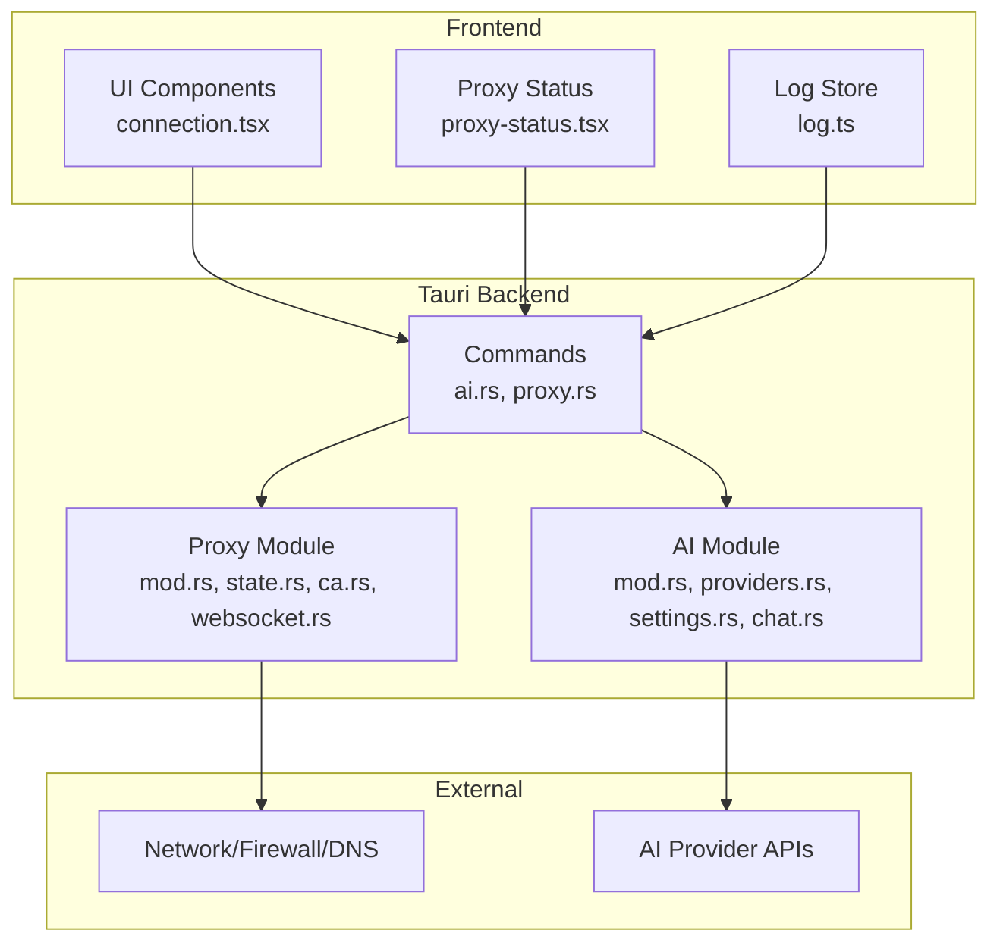
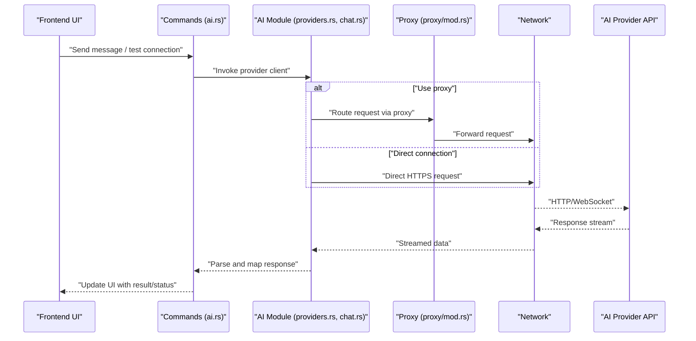
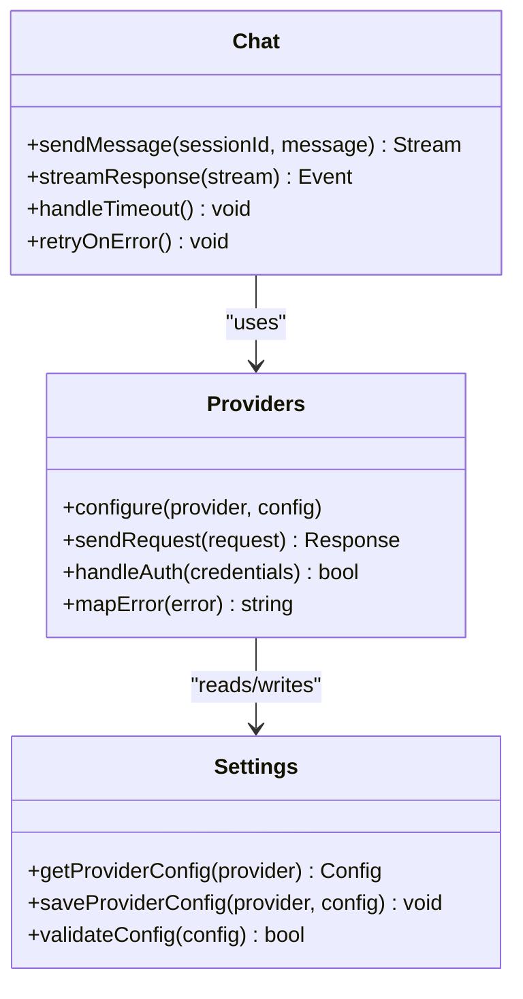
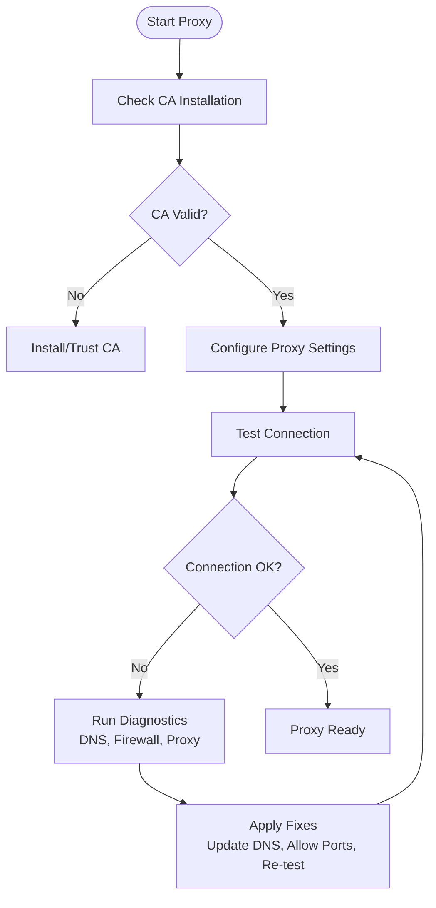
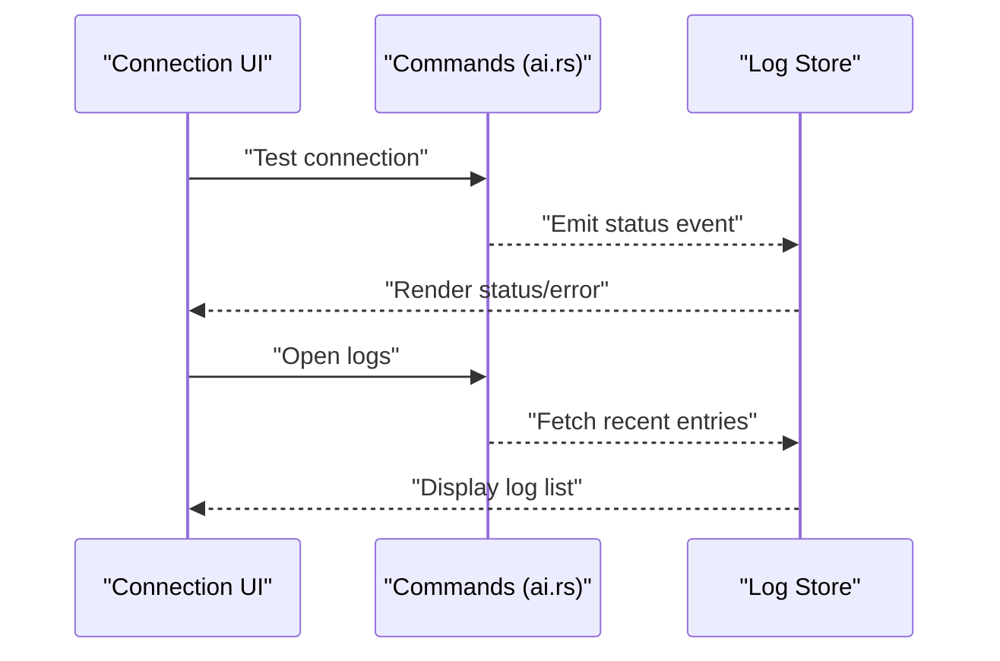
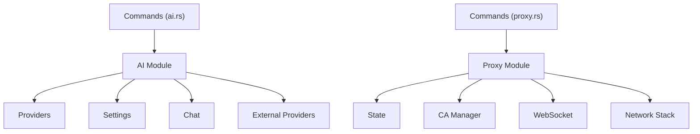

# Troubleshooting & Connectivity

<cite>
**Referenced Files in This Document**
- [README.md](file://README.md)
- [src-tauri/src/ai/mod.rs](file://src-tauri/src/ai/mod.rs)
- [src-tauri/src/ai/providers.rs](file://src-tauri/src/ai/providers.rs)
- [src-tauri/src/ai/settings.rs](file://src-tauri/src/ai/settings.rs)
- [src-tauri/src/ai/chat.rs](file://src-tauri/src/ai/chat.rs)
- [src-tauri/src/commands/proxy.rs](file://src-tauri/src/commands/proxy.rs)
- [src-tauri/src/proxy/mod.rs](file://src-tauri/src/proxy/mod.rs)
- [src-tauri/src/proxy/state.rs](file://src-tauri/src/proxy/state.rs)
- [src-tauri/src/proxy/ca.rs](file://src-tauri/src/proxy/ca.rs)
- [src-tauri/src/proxy/websocket.rs](file://src-tauri/src/proxy/websocket.rs)
- [src-tauri/src/commands/ai.rs](file://src-tauri/src/commands/ai.rs)
- [src-tauri/Cargo.toml](file://src-tauri/Cargo.toml)
- [src/stores/log.ts](file://src/stores/log.ts)
- [src/layout/footer/proxy-status.tsx](file://src/layout/footer/proxy-status.tsx)
- [src/components/ai-elements/connection.tsx](file://src/components/ai-elements/connection.tsx)
</cite>

## Table of Contents
1. [Introduction](#introduction)
2. [Project Structure](#project-structure)
3. [Core Components](#core-components)
4. [Architecture Overview](#architecture-overview)
5. [Detailed Component Analysis](#detailed-component-analysis)
6. [Dependency Analysis](#dependency-analysis)
7. [Performance Considerations](#performance-considerations)
8. [Troubleshooting Guide](#troubleshooting-guide)
9. [Conclusion](#conclusion)

## Introduction
This document provides a comprehensive troubleshooting guide for AI provider connectivity issues in Apprecon. It covers common connection problems, timeout errors, authentication failures, network proxy configuration, firewall considerations, DNS resolution issues, debugging techniques, logging levels, and diagnostic tools available within the application. Step-by-step workflows are included to help you diagnose and resolve issues quickly, along with performance optimization tips for slow connections.

## Project Structure
Apprecon integrates AI providers through a Tauri backend (Rust) and a React frontend. The AI subsystem includes provider management, settings, chat orchestration, and commands exposed to the UI. Network connectivity is managed via an internal HTTP/WebSocket proxy that can be configured for corporate environments. Logging and diagnostics are surfaced in both the Rust backend and the frontend stores and components.

**Diagram sources**
- [src/components/ai-elements/connection.tsx](file://src/components/ai-elements/connection.tsx)
- [src/layout/footer/proxy-status.tsx](file://src/layout/footer/proxy-status.tsx)
- [src/stores/log.ts](file://src/stores/log.ts)
- [src-tauri/src/commands/ai.rs](file://src-tauri/src/commands/ai.rs)
- [src-tauri/src/commands/proxy.rs](file://src-tauri/src/commands/proxy.rs)
- [src-tauri/src/ai/mod.rs](file://src-tauri/src/ai/mod.rs)
- [src-tauri/src/ai/providers.rs](file://src-tauri/src/ai/providers.rs)
- [src-tauri/src/ai/settings.rs](file://src-tauri/src/ai/settings.rs)
- [src-tauri/src/ai/chat.rs](file://src-tauri/src/ai/chat.rs)
- [src-tauri/src/proxy/mod.rs](file://src-tauri/src/proxy/mod.rs)
- [src-tauri/src/proxy/state.rs](file://src-tauri/src/proxy/state.rs)
- [src-tauri/src/proxy/ca.rs](file://src-tauri/src/proxy/ca.rs)
- [src-tauri/src/proxy/websocket.rs](file://src-tauri/src/proxy/websocket.rs)

**Section sources**
- [README.md](file://README.md)

## Core Components
- AI Module: Manages provider selection, configuration, and chat sessions. It exposes commands to the frontend for sending messages and retrieving responses.
- Providers: Implements client logic for different AI providers, handling authentication, request formatting, retries, and error mapping.
- Settings: Stores provider credentials, endpoints, timeouts, and retry policies.
- Chat: Orchestrates conversation flows, including streaming and error handling.
- Proxy Module: Provides an internal HTTP/WebSocket proxy used by Apprecon to route traffic, handle certificates, and support corporate proxies.
- Commands: Bridges frontend calls to backend modules (AI and Proxy).
- Frontend UI: Displays connection status, logs, and allows users to configure proxy and AI settings.

Key responsibilities:
- Authentication: Validate and store API keys or tokens securely.
- Connectivity: Manage network requests, timeouts, retries, and fallbacks.
- Diagnostics: Emit structured logs and expose status indicators.

**Section sources**
- [src-tauri/src/ai/mod.rs](file://src-tauri/src/ai/mod.rs)
- [src-tauri/src/ai/providers.rs](file://src-tauri/src/ai/providers.rs)
- [src-tauri/src/ai/settings.rs](file://src-tauri/src/ai/settings.rs)
- [src-tauri/src/ai/chat.rs](file://src-tauri/src/ai/chat.rs)
- [src-tauri/src/commands/ai.rs](file://src-tauri/src/commands/ai.rs)
- [src-tauri/src/commands/proxy.rs](file://src-tauri/src/commands/proxy.rs)
- [src-tauri/src/proxy/mod.rs](file://src-tauri/src/proxy/mod.rs)
- [src-tauri/src/proxy/state.rs](file://src-tauri/src/proxy/state.rs)
- [src-tauri/src/proxy/ca.rs](file://src-tauri/src/proxy/ca.rs)
- [src-tauri/src/proxy/websocket.rs](file://src-tauri/src/proxy/websocket.rs)
- [src/components/ai-elements/connection.tsx](file://src/components/ai-elements/connection.tsx)
- [src/layout/footer/proxy-status.tsx](file://src/layout/footer/proxy-status.tsx)
- [src/stores/log.ts](file://src/stores/log.ts)

## Architecture Overview
The AI connectivity flow involves the frontend invoking commands, which call into the AI module and optionally the proxy module. Requests are routed to external AI providers over HTTPS. For corporate networks, the proxy module may intercept and forward traffic while managing certificates and WebSocket upgrades.

**Diagram sources**
- [src-tauri/src/commands/ai.rs](file://src-tauri/src/commands/ai.rs)
- [src-tauri/src/ai/providers.rs](file://src-tauri/src/ai/providers.rs)
- [src-tauri/src/ai/chat.rs](file://src-tauri/src/ai/chat.rs)
- [src-tauri/src/proxy/mod.rs](file://src-tauri/src/proxy/mod.rs)
- [src-tauri/src/proxy/websocket.rs](file://src-tauri/src/proxy/websocket.rs)

## Detailed Component Analysis

### AI Providers and Settings
- Provider clients encapsulate authentication headers, endpoint URLs, and request/response schemas.
- Settings manage per-provider configurations such as base URL, API key, model selection, timeouts, and retry policies.
- Error mapping translates provider-specific errors into consistent messages for the UI.

**Diagram sources**
- [src-tauri/src/ai/providers.rs](file://src-tauri/src/ai/providers.rs)
- [src-tauri/src/ai/settings.rs](file://src-tauri/src/ai/settings.rs)
- [src-tauri/src/ai/chat.rs](file://src-tauri/src/ai/chat.rs)

**Section sources**
- [src-tauri/src/ai/providers.rs](file://src-tauri/src/ai/providers.rs)
- [src-tauri/src/ai/settings.rs](file://src-tauri/src/ai/settings.rs)
- [src-tauri/src/ai/chat.rs](file://src-tauri/src/ai/chat.rs)

### Proxy Module and Certificate Management
- The proxy module handles HTTP and WebSocket traffic, enabling corporate proxy support and certificate validation.
- CA management ensures trusted certificates are installed and recognized by the system.
- State tracks proxy lifecycle, active connections, and error states.

**Diagram sources**
- [src-tauri/src/proxy/mod.rs](file://src-tauri/src/proxy/mod.rs)
- [src-tauri/src/proxy/state.rs](file://src-tauri/src/proxy/state.rs)
- [src-tauri/src/proxy/ca.rs](file://src-tauri/src/proxy/ca.rs)

**Section sources**
- [src-tauri/src/proxy/mod.rs](file://src-tauri/src/proxy/mod.rs)
- [src-tauri/src/proxy/state.rs](file://src-tauri/src/proxy/state.rs)
- [src-tauri/src/proxy/ca.rs](file://src-tauri/src/proxy/ca.rs)

### Frontend Connection UI and Logs
- The connection component displays real-time status and errors for AI provider connectivity.
- Proxy status in the footer indicates whether the internal proxy is running and healthy.
- The log store captures backend events and errors for inspection.

**Diagram sources**
- [src/components/ai-elements/connection.tsx](file://src/components/ai-elements/connection.tsx)
- [src/layout/footer/proxy-status.tsx](file://src/layout/footer/proxy-status.tsx)
- [src/stores/log.ts](file://src/stores/log.ts)
- [src-tauri/src/commands/ai.rs](file://src-tauri/src/commands/ai.rs)

**Section sources**
- [src/components/ai-elements/connection.tsx](file://src/components/ai-elements/connection.tsx)
- [src/layout/footer/proxy-status.tsx](file://src/layout/footer/proxy-status.tsx)
- [src/stores/log.ts](file://src/stores/log.ts)

## Dependency Analysis
The AI subsystem depends on the proxy module for network routing and on settings for configuration. Commands act as the bridge between UI and backend modules. External dependencies include the AI provider APIs and system networking stack.

**Diagram sources**
- [src-tauri/src/ai/mod.rs](file://src-tauri/src/ai/mod.rs)
- [src-tauri/src/ai/providers.rs](file://src-tauri/src/ai/providers.rs)
- [src-tauri/src/ai/settings.rs](file://src-tauri/src/ai/settings.rs)
- [src-tauri/src/ai/chat.rs](file://src-tauri/src/ai/chat.rs)
- [src-tauri/src/commands/ai.rs](file://src-tauri/src/commands/ai.rs)
- [src-tauri/src/commands/proxy.rs](file://src-tauri/src/commands/proxy.rs)
- [src-tauri/src/proxy/mod.rs](file://src-tauri/src/proxy/mod.rs)
- [src-tauri/src/proxy/state.rs](file://src-tauri/src/proxy/state.rs)
- [src-tauri/src/proxy/ca.rs](file://src-tauri/src/proxy/ca.rs)
- [src-tauri/src/proxy/websocket.rs](file://src-tauri/src/proxy/websocket.rs)

**Section sources**
- [src-tauri/Cargo.toml](file://src-tauri/Cargo.toml)

## Performance Considerations
- Adjust timeouts and retry policies in provider settings to balance responsiveness and reliability.
- Use streaming responses where supported to reduce perceived latency.
- Prefer direct connections when possible; use proxy only if required by your network policy.
- Monitor connection quality and adjust model selection or payload size accordingly.
- Enable efficient logging levels to avoid overhead during normal operation.

[No sources needed since this section provides general guidance]

## Troubleshooting Guide

### Common Connection Problems
- Symptom: “Cannot connect to provider”
  - Causes: Incorrect endpoint URL, missing or invalid API key, blocked outbound traffic.
  - Steps:
    - Verify provider endpoint and credentials in settings.
    - Confirm outbound HTTPS is allowed by firewall.
    - Test direct connection without proxy.
    - Check DNS resolution for the provider domain.

- Symptom: “Authentication failed”
  - Causes: Expired token, wrong scope, incorrect header format.
  - Steps:
    - Re-enter API key or refresh token.
    - Ensure correct authorization header format.
    - Review provider documentation for required scopes.

- Symptom: “Timeout errors”
  - Causes: Slow network, high latency, misconfigured timeouts.
  - Steps:
    - Increase timeout values in settings.
    - Retry with smaller payloads or simpler prompts.
    - Switch to a faster network or disable VPN temporarily.

- Symptom: “WebSocket connection fails”
  - Causes: Proxy not allowing upgrade, firewall blocking ports.
  - Steps:
    - Ensure proxy supports WebSocket upgrades.
    - Check firewall rules for required ports.
    - Validate certificate trust chain.

**Section sources**
- [src-tauri/src/ai/providers.rs](file://src-tauri/src/ai/providers.rs)
- [src-tauri/src/ai/settings.rs](file://src-tauri/src/ai/settings.rs)
- [src-tauri/src/proxy/mod.rs](file://src-tauri/src/proxy/mod.rs)
- [src-tauri/src/proxy/websocket.rs](file://src-tauri/src/proxy/websocket.rs)

### Timeout Errors
- Increase request timeout in provider settings.
- Reduce payload size or complexity.
- Disable compression if causing delays.
- Use a closer region or endpoint if available.

**Section sources**
- [src-tauri/src/ai/settings.rs](file://src-tauri/src/ai/settings.rs)
- [src-tauri/src/ai/chat.rs](file://src-tauri/src/ai/chat.rs)

### Authentication Failures
- Re-validate API keys and tokens.
- Check expiration and permissions.
- Ensure correct header names and formats.
- Clear cached credentials and re-authenticate.

**Section sources**
- [src-tauri/src/ai/providers.rs](file://src-tauri/src/ai/providers.rs)
- [src-tauri/src/ai/settings.rs](file://src-tauri/src/ai/settings.rs)

### Network Proxy Configuration
- Configure proxy settings in Apprecon’s proxy command interface.
- Ensure CA certificate is installed and trusted.
- Test connectivity with and without proxy.
- Validate that the proxy allows HTTPS and WebSocket upgrades.

**Section sources**
- [src-tauri/src/commands/proxy.rs](file://src-tauri/src/commands/proxy.rs)
- [src-tauri/src/proxy/mod.rs](file://src-tauri/src/proxy/mod.rs)
- [src-tauri/src/proxy/ca.rs](file://src-tauri/src/proxy/ca.rs)

### Firewall Considerations
- Allow outbound HTTPS (port 443) to provider domains.
- Permit WebSocket upgrades if using streaming.
- Whitelist any corporate proxy endpoints.
- Temporarily disable local firewalls for testing.

[No sources needed since this section provides general guidance]

### DNS Resolution Issues
- Verify DNS servers are reachable and resolving correctly.
- Flush DNS cache if necessary.
- Use alternate DNS servers (e.g., public resolvers) for testing.
- Check for DNS filtering or blocking policies.

[No sources needed since this section provides general guidance]

### Debugging Techniques and Logging Levels
- Enable detailed logs in the log store to capture backend events.
- Inspect connection status in the UI components.
- Use proxy status indicator to verify proxy health.
- Export logs for analysis when reporting issues.

**Section sources**
- [src/stores/log.ts](file://src/stores/log.ts)
- [src/components/ai-elements/connection.tsx](file://src/components/ai-elements/connection.tsx)
- [src/layout/footer/proxy-status.tsx](file://src/layout/footer/proxy-status.tsx)

### Diagnostic Tools Available in Apprecon
- Connection tester in AI settings to validate provider reachability.
- Proxy health checks and certificate validation utilities.
- Log viewer for recent events and errors.
- WebSocket inspector for streaming connections.

**Section sources**
- [src-tauri/src/commands/ai.rs](file://src-tauri/src/commands/ai.rs)
- [src-tauri/src/commands/proxy.rs](file://src-tauri/src/commands/proxy.rs)
- [src-tauri/src/proxy/websocket.rs](file://src-tauri/src/proxy/websocket.rs)

### Step-by-Step Troubleshooting Workflows

#### Workflow: Cannot Connect to Provider
1. Open AI settings and verify endpoint and credentials.
2. Run connection test from the UI.
3. If failing, disable proxy and retry.
4. Check firewall and DNS resolution.
5. Review logs for specific error codes.
6. Contact provider support if errors persist.

**Section sources**
- [src-tauri/src/ai/settings.rs](file://src-tauri/src/ai/settings.rs)
- [src/components/ai-elements/connection.tsx](file://src/components/ai-elements/connection.tsx)
- [src/stores/log.ts](file://src/stores/log.ts)

#### Workflow: Authentication Failure
1. Re-enter API key or refresh token.
2. Validate token scope and expiration.
3. Ensure correct authorization header format.
4. Clear cached credentials and retry.
5. Check provider status page for outages.

**Section sources**
- [src-tauri/src/ai/providers.rs](file://src-tauri/src/ai/providers.rs)
- [src-tauri/src/ai/settings.rs](file://src-tauri/src/ai/settings.rs)

#### Workflow: Timeout Errors
1. Increase timeout values in settings.
2. Reduce payload size or complexity.
3. Test on a different network.
4. Disable VPN or corporate proxy temporarily.
5. Monitor logs for latency spikes.

**Section sources**
- [src-tauri/src/ai/settings.rs](file://src-tauri/src/ai/settings.rs)
- [src/stores/log.ts](file://src/stores/log.ts)

#### Workflow: WebSocket Connection Fails
1. Verify proxy supports WebSocket upgrades.
2. Check firewall rules for required ports.
3. Ensure CA certificate is trusted.
4. Inspect WebSocket logs for handshake errors.
5. Test direct connection without proxy.

**Section sources**
- [src-tauri/src/proxy/mod.rs](file://src-tauri/src/proxy/mod.rs)
- [src-tauri/src/proxy/websocket.rs](file://src-tauri/src/proxy/websocket.rs)
- [src-tauri/src/proxy/ca.rs](file://src-tauri/src/proxy/ca.rs)

### Performance Optimization Tips for Slow Connections
- Use streaming responses to reduce initial wait time.
- Select lightweight models or shorter prompts.
- Cache repeated requests where appropriate.
- Optimize network path by disabling unnecessary intermediaries.
- Monitor and adjust timeouts based on observed latency.

[No sources needed since this section provides general guidance]

## Conclusion
By following the structured troubleshooting workflows, leveraging built-in diagnostics, and understanding the role of the proxy and AI modules, you can efficiently resolve connectivity issues with AI providers. Proper configuration of timeouts, authentication, and network settings will improve reliability and performance. Use the provided logging and status indicators to pinpoint problems quickly and minimize downtime.