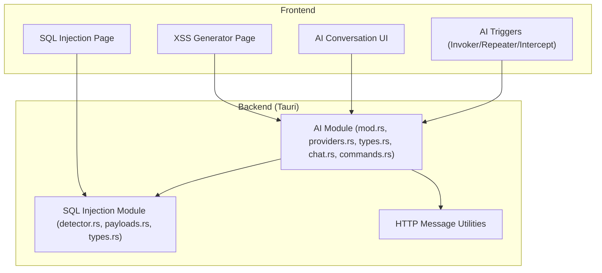
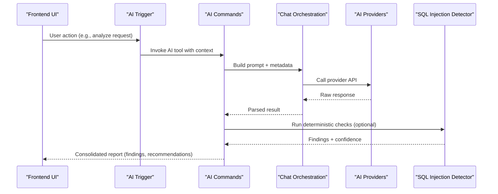
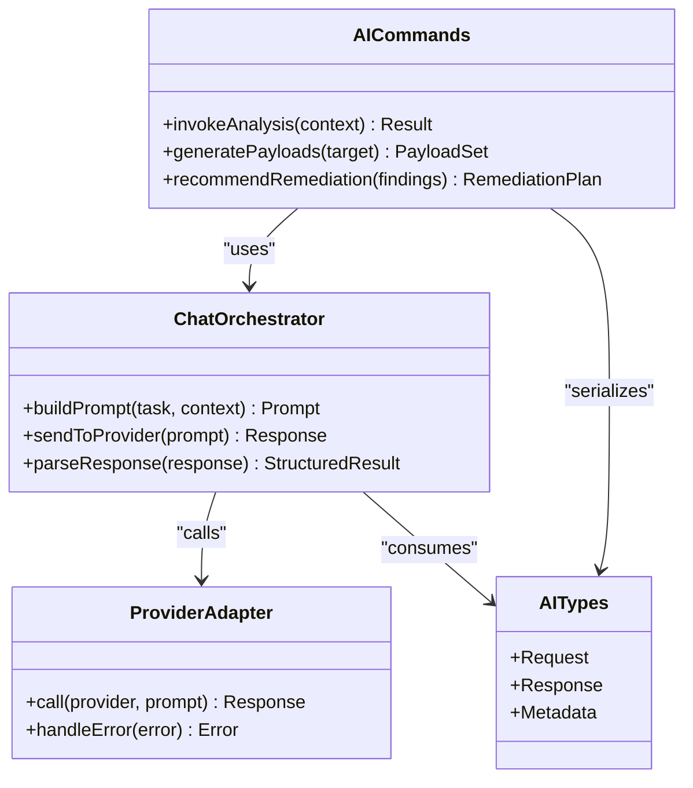
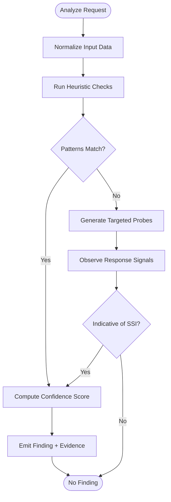
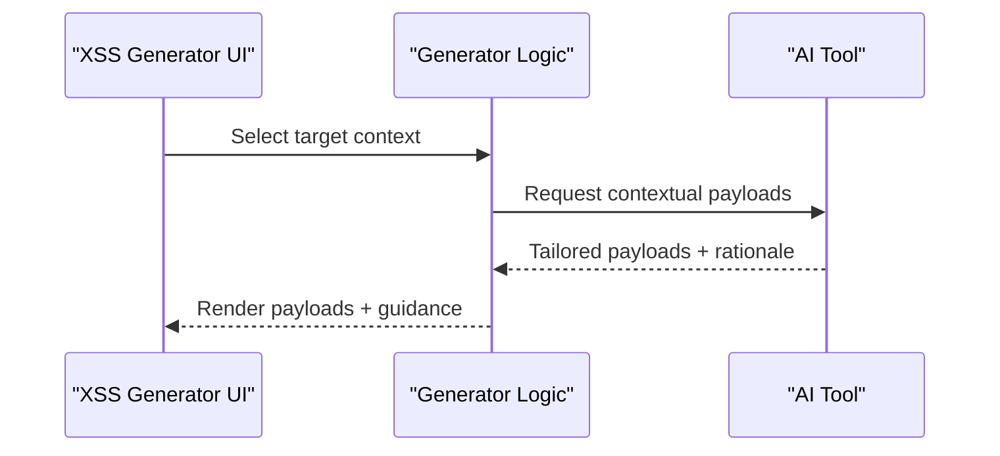
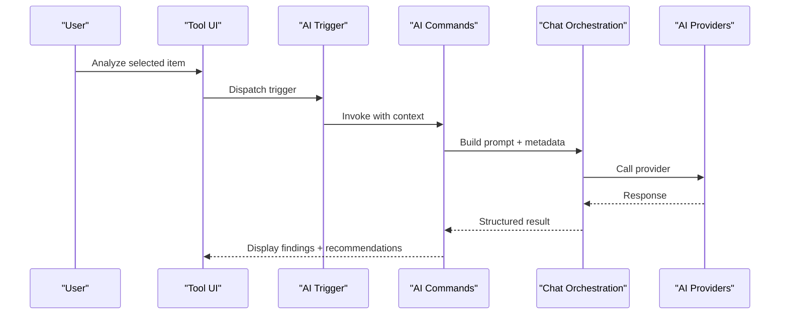
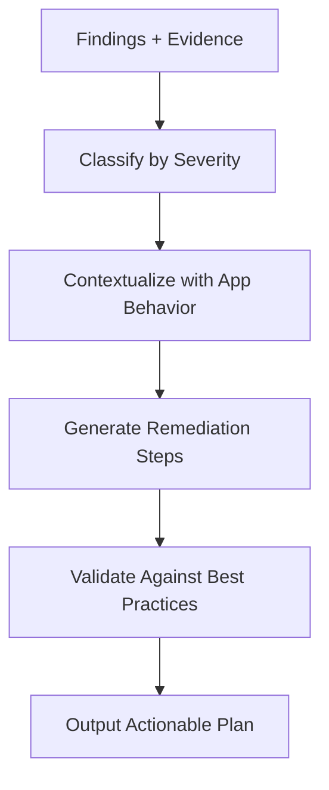
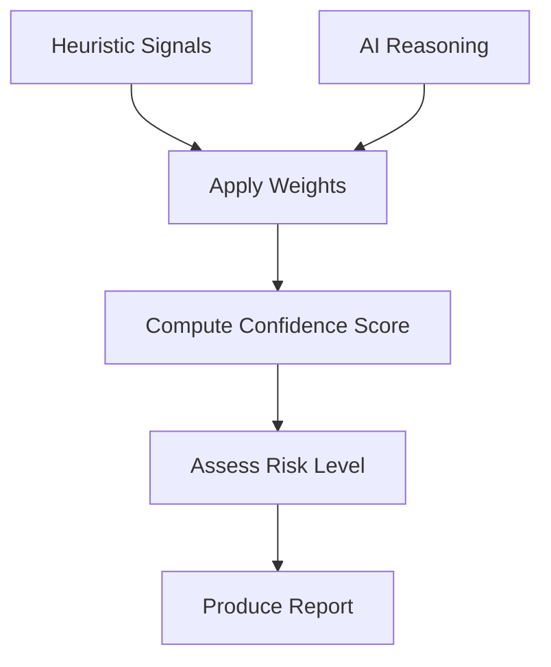
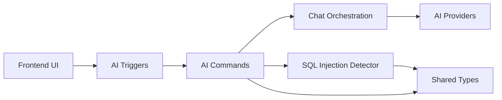

# AI Security Analysis & Recommendations

<cite>
**Referenced Files in This Document**
- [src-tauri/src/ai/mod.rs](file://src-tauri/src/ai/mod.rs)
- [src-tauri/src/ai/providers.rs](file://src-tauri/src/ai/providers.rs)
- [src-tauri/src/ai/types.rs](file://src-tauri/src/ai/types.rs)
- [src-tauri/src/ai/chat.rs](file://src-tauri/src/ai/chat.rs)
- [src-tauri/src/ai/commands.rs](file://src-tauri/src/ai/commands.rs)
- [src-tauri/src/sqli/mod.rs](file://src-tauri/src/sqli/mod.rs)
- [src-tauri/src/sqli/detector.rs](file://src-tauri/src/sqli/detector.rs)
- [src-tauri/src/sqli/payloads.rs](file://src-tauri/src/sqli/payloads.rs)
- [src-tauri/src/sqli/types.rs](file://src-tauri/src/sqli/types.rs)
- [src/pages/sql-injection/index.tsx](file://src/pages/sql-injection/index.tsx)
- [src/pages/xss-generator/index.tsx](file://src/pages/xss-generator/index.tsx)
- [src/stores/app-settings-store.ts](file://src/stores/app-settings-store.ts)
- [src/components/ai-elements/conversation.tsx](file://src/components/ai-elements/conversation.tsx)
- [src/components/ai-elements/tool.tsx](file://src/components/ai-elements/tool.tsx)
- [src/triggers/invoker/ai-tool.ts](file://src/triggers/invoker/ai-tool.ts)
- [src/triggers/repeater/ai-tool.ts](file://src/triggers/repeater/ai-tool.ts)
- [src/triggers/intercept/ai-tool.ts](file://src/triggers/intercept/ai-tool.ts)
- [src/lib/http-message.ts](file://src/lib/http-message.ts)
</cite>

## Table of Contents
1. [Introduction](#introduction)
2. [Project Structure](#project-structure)
3. [Core Components](#core-components)
4. [Architecture Overview](#architecture-overview)
5. [Detailed Component Analysis](#detailed-component-analysis)
6. [Dependency Analysis](#dependency-analysis)
7. [Performance Considerations](#performance-considerations)
8. [Troubleshooting Guide](#troubleshooting-guide)
9. [Conclusion](#conclusion)
10. [Appendices](#appendices)

## Introduction
This document explains Apprecon’s AI-powered security analysis capabilities, focusing on how AI assists with vulnerability detection, code review, and threat analysis. It covers AI-enhanced SQL injection detection, XSS payload generation, a security recommendation engine, and automated security testing workflows. The document maps the end-to-end pipeline from input data to actionable insights, including confidence scoring and integration with security best practices. Examples of AI-generated reports, remediation suggestions, and risk assessment outputs are provided conceptually to guide usage and interpretation.

## Project Structure
Apprecon integrates AI across both the Rust backend (Tauri) and the React frontend:
- Backend AI module provides provider abstraction, chat orchestration, and typed payloads for AI interactions.
- SQL injection detection is implemented as a dedicated module with detector logic, payload sets, and types.
- Frontend pages expose interactive tools for SQL injection and XSS generation, while AI triggers connect UI actions to backend commands.
- Settings and stores manage AI configuration and state.

**Diagram sources**
- [src/pages/sql-injection/index.tsx](file://src/pages/sql-injection/index.tsx)
- [src/pages/xss-generator/index.tsx](file://src/pages/xss-generator/index.tsx)
- [src/components/ai-elements/conversation.tsx](file://src/components/ai-elements/conversation.tsx)
- [src/triggers/invoker/ai-tool.ts](file://src/triggers/invoker/ai-tool.ts)
- [src/triggers/repeater/ai-tool.ts](file://src/triggers/repeater/ai-tool.ts)
- [src/triggers/intercept/ai-tool.ts](file://src/triggers/intercept/ai-tool.ts)
- [src-tauri/src/ai/mod.rs](file://src-tauri/src/ai/mod.rs)
- [src-tauri/src/ai/providers.rs](file://src-tauri/src/ai/providers.rs)
- [src-tauri/src/ai/types.rs](file://src-tauri/src/ai/types.rs)
- [src-tauri/src/ai/chat.rs](file://src-tauri/src/ai/chat.rs)
- [src-tauri/src/ai/commands.rs](file://src-tauri/src/ai/commands.rs)
- [src-tauri/src/sqli/mod.rs](file://src-tauri/src/sqli/mod.rs)
- [src-tauri/src/sqli/detector.rs](file://src-tauri/src/sqli/detector.rs)
- [src-tauri/src/sqli/payloads.rs](file://src-tauri/src/sqli/payloads.rs)
- [src-tauri/src/sqli/types.rs](file://src-tauri/src/sqli/types.rs)
- [src/lib/http-message.ts](file://src/lib/http-message.ts)

**Section sources**
- [src-tauri/src/ai/mod.rs](file://src-tauri/src/ai/mod.rs)
- [src-tauri/src/ai/providers.rs](file://src-tauri/src/ai/providers.rs)
- [src-tauri/src/ai/types.rs](file://src-tauri/src/ai/types.rs)
- [src-tauri/src/ai/chat.rs](file://src-tauri/src/ai/chat.rs)
- [src-tauri/src/ai/commands.rs](file://src-tauri/src/ai/commands.rs)
- [src-tauri/src/sqli/mod.rs](file://src-tauri/src/sqli/mod.rs)
- [src-tauri/src/sqli/detector.rs](file://src-tauri/src/sqli/detector.rs)
- [src-tauri/src/sqli/payloads.rs](file://src-tauri/src/sqli/payloads.rs)
- [src-tauri/src/sqli/types.rs](file://src-tauri/src/sqli/types.rs)
- [src/pages/sql-injection/index.tsx](file://src/pages/sql-injection/index.tsx)
- [src/pages/xss-generator/index.tsx](file://src/pages/xss-generator/index.tsx)
- [src/components/ai-elements/conversation.tsx](file://src/components/ai-elements/conversation.tsx)
- [src/triggers/invoker/ai-tool.ts](file://src/triggers/invoker/ai-tool.ts)
- [src/triggers/repeater/ai-tool.ts](file://src/triggers/repeater/ai-tool.ts)
- [src/triggers/intercept/ai-tool.ts](file://src/triggers/intercept/ai-tool.ts)
- [src/lib/http-message.ts](file://src/lib/http-message.ts)

## Core Components
- AI Module: Provides provider abstraction, chat orchestration, typed request/response structures, and command bindings for invoking AI capabilities from the UI.
- SQL Injection Module: Encapsulates detection logic, payload sets, and shared types for analyzing HTTP requests/responses for SQL injection indicators.
- Frontend Tools: Interactive pages for SQL injection and XSS generation; AI conversation UI for guided analysis and reporting.
- Triggers: Connect user actions in Invoker, Repeater, and Intercept to AI tooling for automated analysis and recommendations.

Key responsibilities:
- Input normalization and context assembly for AI prompts.
- Execution of deterministic checks (e.g., SQL injection heuristics).
- Generation of tailored payloads and remediation guidance via AI.
- Confidence scoring and structured output for downstream consumption.

**Section sources**
- [src-tauri/src/ai/mod.rs](file://src-tauri/src/ai/mod.rs)
- [src-tauri/src/ai/providers.rs](file://src-tauri/src/ai/providers.rs)
- [src-tauri/src/ai/types.rs](file://src-tauri/src/ai/types.rs)
- [src-tauri/src/ai/chat.rs](file://src-tauri/src/ai/chat.rs)
- [src-tauri/src/ai/commands.rs](file://src-tauri/src/ai/commands.rs)
- [src-tauri/src/sqli/mod.rs](file://src-tauri/src/sqli/mod.rs)
- [src-tauri/src/sqli/detector.rs](file://src-tauri/src/sqli/detector.rs)
- [src-tauri/src/sqli/payloads.rs](file://src-tauri/src/sqli/payloads.rs)
- [src-tauri/src/sqli/types.rs](file://src-tauri/src/sqli/types.rs)
- [src/pages/sql-injection/index.tsx](file://src/pages/sql-injection/index.tsx)
- [src/pages/xss-generator/index.tsx](file://src/pages/xss-generator/index.tsx)
- [src/components/ai-elements/conversation.tsx](file://src/components/ai-elements/conversation.tsx)
- [src/triggers/invoker/ai-tool.ts](file://src/triggers/invoker/ai-tool.ts)
- [src/triggers/repeater/ai-tool.ts](file://src/triggers/repeater/ai-tool.ts)
- [src/triggers/intercept/ai-tool.ts](file://src/triggers/intercept/ai-tool.ts)

## Architecture Overview
The AI security pipeline combines deterministic checks with model-driven reasoning:
- Inputs: HTTP messages, source snippets, or user queries.
- Deterministic layer: Heuristics and pattern matching (e.g., SQL injection detectors).
- AI layer: Provider-agnostic chat and command interfaces generate insights, payloads, and recommendations.
- Outputs: Structured findings with confidence scores, remediation steps, and risk assessments.

**Diagram sources**
- [src/triggers/invoker/ai-tool.ts](file://src/triggers/invoker/ai-tool.ts)
- [src/triggers/repeater/ai-tool.ts](file://src/triggers/repeater/ai-tool.ts)
- [src/triggers/intercept/ai-tool.ts](file://src/triggers/intercept/ai-tool.ts)
- [src-tauri/src/ai/commands.rs](file://src-tauri/src/ai/commands.rs)
- [src-tauri/src/ai/chat.rs](file://src-tauri/src/ai/chat.rs)
- [src-tauri/src/ai/providers.rs](file://src-tauri/src/ai/providers.rs)
- [src-tauri/src/sqli/detector.rs](file://src-tauri/src/sqli/detector.rs)

## Detailed Component Analysis

### AI Module (Providers, Types, Chat, Commands)
- Providers: Abstracts different AI backends, normalizing calls and responses.
- Types: Defines structured payloads for prompts, results, and metadata.
- Chat: Orchestrates conversations, manages context, and formats outputs.
- Commands: Exposes Tauri commands to invoke AI features from the frontend.

**Diagram sources**
- [src-tauri/src/ai/commands.rs](file://src-tauri/src/ai/commands.rs)
- [src-tauri/src/ai/chat.rs](file://src-tauri/src/ai/chat.rs)
- [src-tauri/src/ai/providers.rs](file://src-tauri/src/ai/providers.rs)
- [src-tauri/src/ai/types.rs](file://src-tauri/src/ai/types.rs)

**Section sources**
- [src-tauri/src/ai/mod.rs](file://src-tauri/src/ai/mod.rs)
- [src-tauri/src/ai/providers.rs](file://src-tauri/src/ai/providers.rs)
- [src-tauri/src/ai/types.rs](file://src-tauri/src/ai/types.rs)
- [src-tauri/src/ai/chat.rs](file://src-tauri/src/ai/chat.rs)
- [src-tauri/src/ai/commands.rs](file://src-tauri/src/ai/commands.rs)

### SQL Injection Detection Module
- Detector: Implements heuristic checks against request parameters, headers, and responses to identify potential SQL injection vectors.
- Payloads: Curated sets of payloads used to probe endpoints safely and interpret behavior.
- Types: Shared structures for findings, evidence, and confidence metrics.

**Diagram sources**
- [src-tauri/src/sqli/detector.rs](file://src-tauri/src/sqli/detector.rs)
- [src-tauri/src/sqli/payloads.rs](file://src-tauri/src/sqli/payloads.rs)
- [src-tauri/src/sqli/types.rs](file://src-tauri/src/sqli/types.rs)

**Section sources**
- [src-tauri/src/sqli/mod.rs](file://src-tauri/src/sqli/mod.rs)
- [src-tauri/src/sqli/detector.rs](file://src-tauri/src/sqli/detector.rs)
- [src-tauri/src/sqli/payloads.rs](file://src-tauri/src/sqli/payloads.rs)
- [src-tauri/src/sqli/types.rs](file://src-tauri/src/sqli/types.rs)

### XSS Payload Generation
- Frontend page orchestrates generation strategies and displays results.
- AI integration augments deterministic generators with contextual payloads based on target application characteristics.

**Diagram sources**
- [src/pages/xss-generator/index.tsx](file://src/pages/xss-generator/index.tsx)
- [src/triggers/invoker/ai-tool.ts](file://src/triggers/invoker/ai-tool.ts)

**Section sources**
- [src/pages/xss-generator/index.tsx](file://src/pages/xss-generator/index.tsx)
- [src/triggers/invoker/ai-tool.ts](file://src/triggers/invoker/ai-tool.ts)

### Automated Security Testing Triggers
- Triggers in Invoker, Repeater, and Intercept connect user actions to AI tools for automated analysis.
- They assemble context (e.g., HTTP message details), call AI commands, and present findings within the UI.

**Diagram sources**
- [src/triggers/invoker/ai-tool.ts](file://src/triggers/invoker/ai-tool.ts)
- [src/triggers/repeater/ai-tool.ts](file://src/triggers/repeater/ai-tool.ts)
- [src/triggers/intercept/ai-tool.ts](file://src/triggers/intercept/ai-tool.ts)
- [src-tauri/src/ai/commands.rs](file://src-tauri/src/ai/commands.rs)
- [src-tauri/src/ai/chat.rs](file://src-tauri/src/ai/chat.rs)
- [src-tauri/src/ai/providers.rs](file://src-tauri/src/ai/providers.rs)

**Section sources**
- [src/triggers/invoker/ai-tool.ts](file://src/triggers/invoker/ai-tool.ts)
- [src/triggers/repeater/ai-tool.ts](file://src/triggers/repeater/ai-tool.ts)
- [src/triggers/intercept/ai-tool.ts](file://src/triggers/intercept/ai-tool.ts)
- [src-tauri/src/ai/commands.rs](file://src-tauri/src/ai/commands.rs)
- [src-tauri/src/ai/chat.rs](file://src-tauri/src/ai/chat.rs)
- [src-tauri/src/ai/providers.rs](file://src-tauri/src/ai/providers.rs)

### Security Recommendation Engine
- Combines deterministic findings (e.g., SQL injection indicators) with AI-generated remediation advice.
- Produces prioritized recommendations aligned with security best practices.

**Diagram sources**
- [src-tauri/src/ai/commands.rs](file://src-tauri/src/ai/commands.rs)
- [src-tauri/src/ai/chat.rs](file://src-tauri/src/ai/chat.rs)
- [src-tauri/src/sqli/detector.rs](file://src-tauri/src/sqli/detector.rs)

**Section sources**
- [src-tauri/src/ai/commands.rs](file://src-tauri/src/ai/commands.rs)
- [src-tauri/src/ai/chat.rs](file://src-tauri/src/ai/chat.rs)
- [src-tauri/src/sqli/detector.rs](file://src-tauri/src/sqli/detector.rs)

### Confidence Scoring and Risk Assessment
- Confidence scoring aggregates signal strength from heuristics and AI reasoning.
- Risk assessment considers exploitability, impact, and mitigation feasibility.

**Diagram sources**
- [src-tauri/src/sqli/types.rs](file://src-tauri/src/sqli/types.rs)
- [src-tauri/src/ai/types.rs](file://src-tauri/src/ai/types.rs)

**Section sources**
- [src-tauri/src/sqli/types.rs](file://src-tauri/src/sqli/types.rs)
- [src-tauri/src/ai/types.rs](file://src-tauri/src/ai/types.rs)

## Dependency Analysis
The AI and security modules interact through well-defined boundaries:
- Frontend triggers depend on AI commands and chat orchestration.
- AI commands coordinate with providers and optional deterministic detectors.
- SQL injection module provides findings that feed into AI recommendations.

**Diagram sources**
- [src/triggers/invoker/ai-tool.ts](file://src/triggers/invoker/ai-tool.ts)
- [src/triggers/repeater/ai-tool.ts](file://src/triggers/repeater/ai-tool.ts)
- [src/triggers/intercept/ai-tool.ts](file://src/triggers/intercept/ai-tool.ts)
- [src-tauri/src/ai/commands.rs](file://src-tauri/src/ai/commands.rs)
- [src-tauri/src/ai/chat.rs](file://src-tauri/src/ai/chat.rs)
- [src-tauri/src/ai/providers.rs](file://src-tauri/src/ai/providers.rs)
- [src-tauri/src/sqli/detector.rs](file://src-tauri/src/sqli/detector.rs)
- [src-tauri/src/sqli/types.rs](file://src-tauri/src/sqli/types.rs)

**Section sources**
- [src/triggers/invoker/ai-tool.ts](file://src/triggers/invoker/ai-tool.ts)
- [src/triggers/repeater/ai-tool.ts](file://src/triggers/repeater/ai-tool.ts)
- [src/triggers/intercept/ai-tool.ts](file://src/triggers/intercept/ai-tool.ts)
- [src-tauri/src/ai/commands.rs](file://src-tauri/src/ai/commands.rs)
- [src-tauri/src/ai/chat.rs](file://src-tauri/src/ai/chat.rs)
- [src-tauri/src/ai/providers.rs](file://src-tauri/src/ai/providers.rs)
- [src-tauri/src/sqli/detector.rs](file://src-tauri/src/sqli/detector.rs)
- [src-tauri/src/sqli/types.rs](file://src-tauri/src/sqli/types.rs)

## Performance Considerations
- Batch processing: Group multiple analyses to reduce provider round-trips.
- Caching: Cache common prompts and results where appropriate.
- Asynchronous execution: Ensure UI remains responsive during long-running AI calls.
- Efficient payload sets: Limit probe payloads to minimize network overhead.

[No sources needed since this section provides general guidance]

## Troubleshooting Guide
Common issues and resolutions:
- Provider errors: Check provider configuration and credentials; handle retries gracefully.
- Empty findings: Verify input normalization and ensure sufficient context is passed to AI.
- High false positives: Adjust heuristic thresholds and refine confidence scoring.
- Slow responses: Optimize prompt size and enable caching.

**Section sources**
- [src-tauri/src/ai/providers.rs](file://src-tauri/src/ai/providers.rs)
- [src-tauri/src/ai/chat.rs](file://src-tauri/src/ai/chat.rs)
- [src-tauri/src/sqli/detector.rs](file://src-tauri/src/sqli/detector.rs)

## Conclusion
Apprecon’s AI-powered security analysis blends deterministic checks with intelligent reasoning to deliver actionable insights. The modular architecture supports flexible provider integration, robust SQL injection detection, and contextual XSS payload generation. Confidence scoring and best-practice-aligned recommendations help prioritize remediation efforts effectively.

[No sources needed since this section summarizes without analyzing specific files]

## Appendices

### Example AI-Generated Security Reports
Conceptual structure:
- Summary: Overview of findings and overall risk posture.
- Findings: Each finding includes description, evidence, confidence score, and severity.
- Recommendations: Prioritized remediation steps mapped to best practices.
- Risk Assessment: Exploitability, impact, and mitigation feasibility.

[No sources needed since this section provides conceptual examples]

### Integration with Security Best Practices
- OWASP Top 10 alignment for categorization and remediation guidance.
- Secure coding patterns recommended by AI based on detected vulnerabilities.
- Continuous feedback loop: Use findings to improve heuristics and prompts.

[No sources needed since this section provides conceptual guidance]