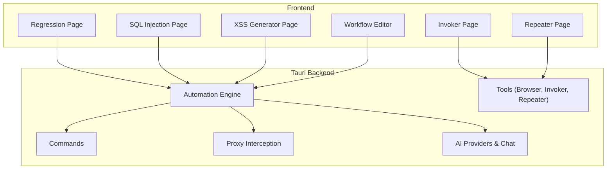
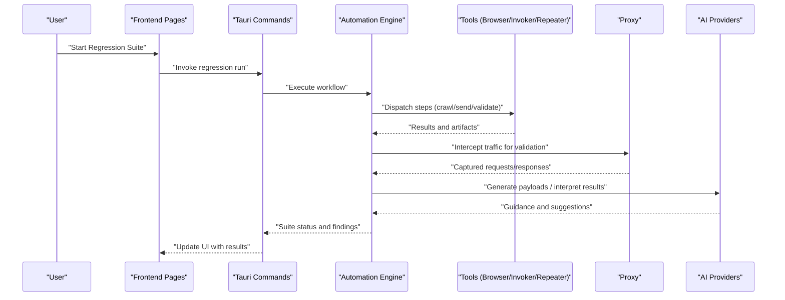
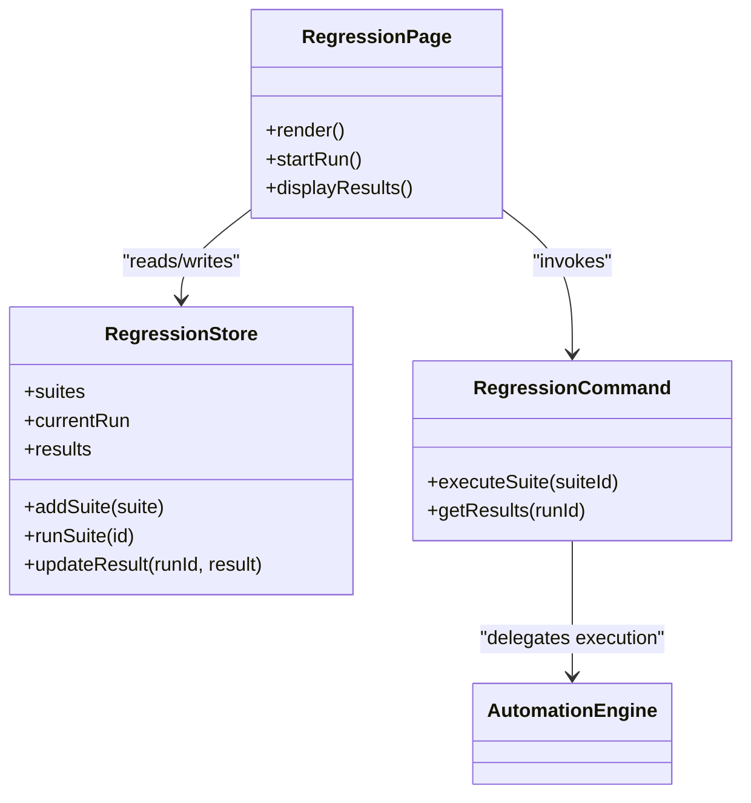
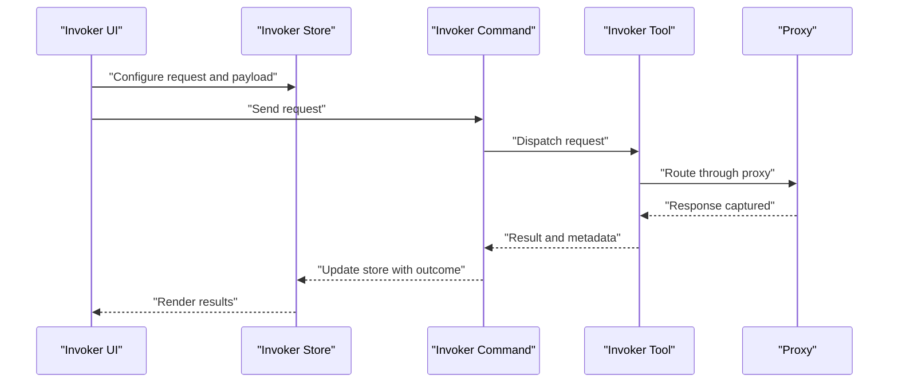
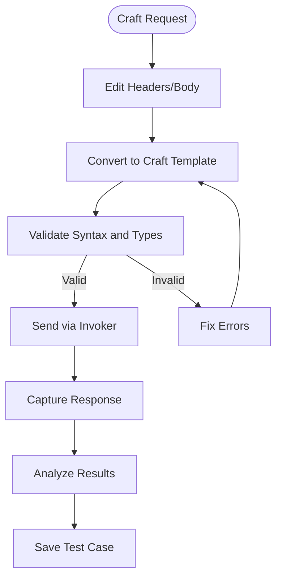
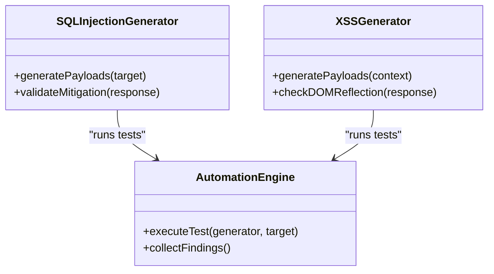
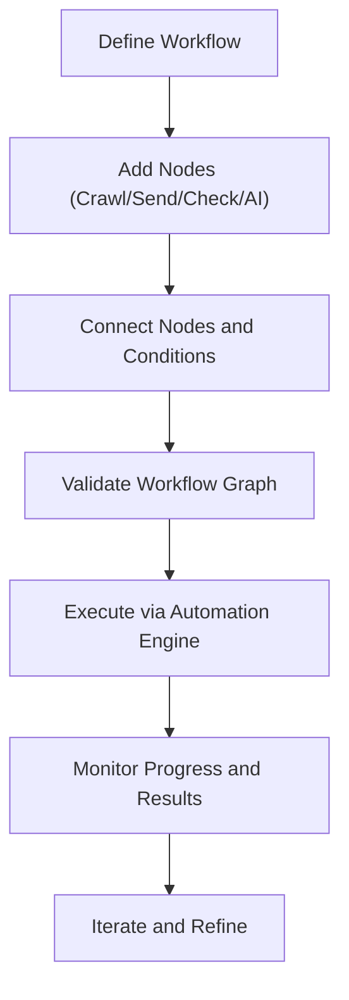
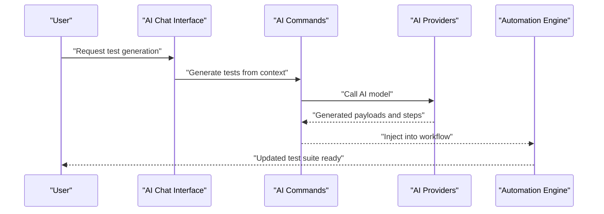
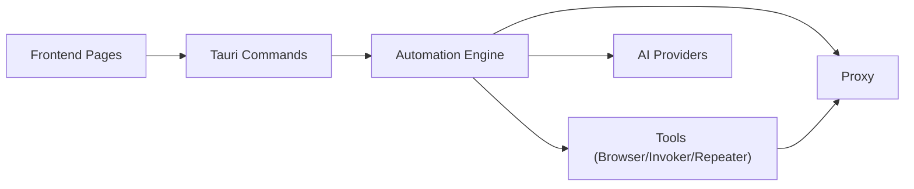
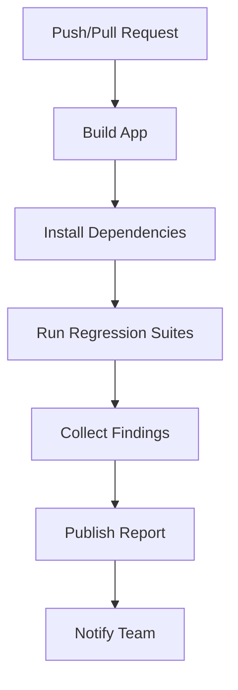

# Automated Security Testing

<cite>
**Referenced Files in This Document**
- [README.md](file://README.md)
- [AGENTS.md](file://AGENTS.md)
- [DESIGN.md](file://DESIGN.md)
- [src/pages/regression/index.tsx](file://src/pages/regression/index.tsx)
- [src/stores/regression.ts](file://src/stores/regression.ts)
- [src/pages/invoker/index.tsx](file://src/pages/invoker/index.tsx)
- [src/stores/invoker.ts](file://src/stores/invoker.ts)
- [src/pages/repeater/index.tsx](file://src/pages/repeater/index.tsx)
- [src/stores/repeater.ts](file://src/stores/repeater.ts)
- [src/pages/sql-injection/index.tsx](file://src/pages/sql-injection/index.tsx)
- [src/pages/xss-generator/index.tsx](file://src/pages/xss-generator/index.tsx)
- [src/pages/workflow/index.tsx](file://src/pages/workflow/index.tsx)
- [src/pages/workflow/templates.ts](file://src/pages/workflow/templates.ts)
- [src/pages/workflow/node-type-registry.ts](file://src/pages/workflow/node-type-registry.ts)
- [src/triggers/invoker/attack.ts](file://src/triggers/invoker/attack.ts)
- [src/triggers/repeater/craft.ts](file://src/triggers/repeater/craft.ts)
- [src/triggers/repeater/convert-to-craft.ts](file://src/triggers/repeater/convert-to-craft.ts)
- [src/triggers/live-traffic/captured.ts](file://src/triggers/live-traffic/captured.ts)
- [src/triggers/browser/crawl.ts](file://src/triggers/browser/crawl.ts)
- [src/triggers/browser/page-crawled.ts](file://src/triggers/browser/page-crawled.ts)
- [src/lib/http-message.ts](file://src/lib/http-message.ts)
- [src-tauri/src/commands/regression.rs](file://src-tauri/src/commands/regression.rs)
- [src-tauri/src/automation/mod.rs](file://src-tauri/src/automation/mod.rs)
- [src-tauri/src/automation/types.rs](file://src-tauri/src/automation/types.rs)
- [src-tauri/src/automation/execution.rs](file://src-tauri/src/automation/execution.rs)
- [src-tauri/src/automation/state.rs](file://src-tauri/src/automation/state.rs)
- [src-tauri/src/proxy/mod.rs](file://src-tauri/src/proxy/mod.rs)
- [src-tauri/src/sqli/mod.rs](file://src-tauri/src/sqli/mod.rs)
- [src-tauri/src/sqli/payloads.rs](file://src-tauri/src/sqli/payloads.rs)
- [src-tauri/src/tools/invoker.rs](file://src-tauri/src/tools/invoker.rs)
- [src-tauri/src/tools/repeater.rs](file://src-tauri/src/tools/repeater.rs)
- [src-tauri/src/tools/browser.rs](file://src-tauri/src/tools/browser.rs)
- [src-tauri/src/ai/mod.rs](file://src-tauri/src/ai/mod.rs)
- [src-tauri/src/ai/providers.rs](file://src-tauri/src/ai/providers.rs)
- [src-tauri/src/ai/chat.rs](file://src-tauri/src/ai/chat.rs)
- [src-tauri/src/ai/commands.rs](file://src-tauri/src/ai/commands.rs)
- [src-tauri/src/ai/auto_mark.rs](file://src-tauri/src/ai/auto_mark.rs)
- [src-tauri/src/automation/actions.rs](file://src-tauri/src/automation/actions.rs)
- [src-tauri/src/automation/events.rs](file://src-tauri/src/automation/events.rs)
- [src-tauri/src/automation/intercept.rs](file://src-tauri/src/automation/intercept.rs)
- [src-tauri/src/automation/websocket.rs](file://src-tauri/src/automation/websocket.rs)
- [src-tauri/src/automation/port_scan.rs](file://src-tauri/src/automation/port_scan.rs)
- [src-tauri/src/automation/scan_completed.rs](file://src-tauri/src/automation/scan_completed.rs)
- [src-tauri/src/automation/scheduled.rs](file://src-tauri/src/automation/scheduled.rs)
- [src-tauri/src/automation/page_crawled.rs](file://src-tauri/src/automation/page_crawled.rs)
- [src-tauri/src/automation/live_traffic.rs](file://src-tauri/src/automation/live_traffic.rs)
- [src-tauri/src/automation/condition.rs](file://src-tauri/src/automation/condition.rs)
- [src-tauri/src/commands/ai.rs](file://src-tauri/src/commands/ai.rs)
- [src-tauri/src/commands/invoker.rs](file://src-tauri/src/commands/invoker.rs)
- [src-tauri/src/commands/repeater.rs](file://src-tauri/src/commands/repeater.rs)
- [src-tairi/src/commands/browser.rs](file://src-tauri/src/commands/browser.rs)
- [src-tauri/src/commands/proxy.rs](file://src-tauri/src/commands/proxy.rs)
- [src-tauri/src/commands/r2.rs](file://src-tauri/src/commands/r2.rs)
- [src-tauri/src/commands/storage.rs](file://src-tauri/src/commands/storage.rs)
- [src-tauri/src/commands/vpn.rs](file://src-tauri/src/commands/vpn.rs)
- [src-tauri/src/commands/history.rs](file://src-tauri/src/commands/history.rs)
- [src-tauri/src/commands/mock_forge.rs](file://src-tauri/src/commands/mock_forge.rs)
- [src-tauri/src/commands/api_collection.rs](file://src-tauri/src/commands/api_collection.rs)
- [src-tauri/src/commands/cert.rs](file://src-tauri/src/commands/cert.rs)
- [src-tauri/src/commands/chat_sessions.rs](file://src-tauri/src/commands/chat_sessions.rs)
- [src-tauri/src/commands/collaborator.rs](file://src-tauri/src/commands/collaborator.rs)
- [src-tauri/src/commands/terminal.rs](file://src-tauri/src/commands/terminal.rs)
- [src-tauri/src/commands/mod.rs](file://src-tauri/src/commands/mod.rs)
- [src-tauri/src/app_commands.rs](file://src-tauri/src/app_commands.rs)
- [src-tauri/src/lib.rs](file://src-tauri/src/lib.rs)
- [src-tauri/src/main.rs](file://src-tauri/src/main.rs)
- [src-tauri/src/setup.rs](file://src-tauri/src/setup.rs)
- [src-tauri/src/tray.rs](file://src-tauri/src/tray.rs)
- [src-tauri/src/types.rs](file://src-tauri/src/types.rs)
- [src-tauri/Cargo.toml](file://src-tauri/Cargo.toml)
- [src-tauri/build.rs](file://src-tauri/build.rs)
- [src-tauri/tauri.conf.json](file://src-tauri/tauri.conf.json)
- [.github/workflows/build.yml](file://.github/workflows/build.yml)
- [.github/workflows/docs-deploy.yml](file://.github/workflows/docs-deploy.yml)
</cite>

## Table of Contents
1. [Introduction](#introduction)
2. [Project Structure](#project-structure)
3. [Core Components](#core-components)
4. [Architecture Overview](#architecture-overview)
5. [Detailed Component Analysis](#detailed-component-analysis)
6. [Dependency Analysis](#dependency-analysis)
7. [Performance Considerations](#performance-considerations)
8. [Troubleshooting Guide](#troubleshooting-guide)
9. [Conclusion](#conclusion)
10. [Appendices](#appendices)

## Introduction
This document explains the AI-enhanced automated security testing capabilities implemented in the project. It covers how test cases are generated, how security scans are executed, and how security controls are validated automatically. It also documents test generation algorithms, payload crafting strategies, regression testing approaches, examples of automated security test suites, continuous integration pipelines, and workflows for integrating with existing CI/CD systems. The goal is to make these advanced features accessible to both technical and non-technical users.

## Project Structure
The application is a hybrid desktop app built with Tauri (Rust backend) and a React frontend. Key areas relevant to automated security testing include:
- Frontend pages and stores for Regression, Invoker, Repeater, SQL Injection, XSS Generator, and Workflow orchestration
- Triggers that connect UI actions to automation flows
- Rust backend modules for automation execution, proxy interception, AI tooling, and command interfaces
- GitHub Actions workflows for build and documentation deployment

**Diagram sources**
- [src/pages/regression/index.tsx](file://src/pages/regression/index.tsx)
- [src/pages/invoker/index.tsx](file://src/pages/invoker/index.tsx)
- [src/pages/repeater/index.tsx](file://src/pages/repeater/index.tsx)
- [src/pages/sql-injection/index.tsx](file://src/pages/sql-injection/index.tsx)
- [src/pages/xss-generator/index.tsx](file://src/pages/xss-generator/index.tsx)
- [src/pages/workflow/index.tsx](file://src/pages/workflow/index.tsx)
- [src-tauri/src/commands/mod.rs](file://src-tauri/src/commands/mod.rs)
- [src-tauri/src/automation/mod.rs](file://src-tauri/src/automation/mod.rs)
- [src-tauri/src/proxy/mod.rs](file://src-tauri/src/proxy/mod.rs)
- [src-tauri/src/ai/mod.rs](file://src-tauri/src/ai/mod.rs)
- [src-tauri/src/tools/invoker.rs](file://src-tauri/src/tools/invoker.rs)
- [src-tauri/src/tools/repeater.rs](file://src-tauri/src/tools/repeater.rs)
- [src-tauri/src/tools/browser.rs](file://src-tauri/src/tools/browser.rs)

**Section sources**
- [README.md](file://README.md)
- [AGENTS.md](file://AGENTS.md)
- [DESIGN.md](file://DESIGN.md)

## Core Components
- Regression Testing: Stores and UI for defining, running, and tracking regression suites across endpoints and scenarios.
- Invoker: Executes crafted requests against targets, integrates with tools for sending payloads and capturing responses.
- Repeater: Crafts and converts HTTP messages into repeatable tests; supports payload transformation and templating.
- SQL Injection and XSS Generators: Specialized generators for vulnerability-specific payloads and validation checks.
- Workflow Orchestration: Visual editor for composing multi-step security tests, including browser crawling, traffic inspection, and conditional logic.
- Automation Engine (Backend): Executes workflows, manages state, and coordinates tools and proxies.
- Proxy Interception: Captures and manipulates live traffic for dynamic test generation and validation.
- AI Integration: Provides AI-assisted test generation, payload crafting, and auto-marking of findings.

**Section sources**
- [src/stores/regression.ts](file://src/stores/regression.ts)
- [src/stores/invoker.ts](file://src/stores/invoker.ts)
- [src/stores/repeater.ts](file://src/stores/repeater.ts)
- [src/pages/workflow/templates.ts](file://src/pages/workflow/templates.ts)
- [src/pages/workflow/node-type-registry.ts](file://src/pages/workflow/node-type-registry.ts)
- [src-tauri/src/automation/mod.rs](file://src-tauri/src/automation/mod.rs)
- [src-tauri/src/proxy/mod.rs](file://src-tauri/src/proxy/mod.rs)
- [src-tauri/src/ai/mod.rs](file://src-tauri/src/ai/mod.rs)

## Architecture Overview
The system combines a reactive frontend with a robust Rust backend to automate security testing. Workflows are defined visually and executed by the automation engine, which orchestrates tools like the browser, invoker, and repeater. Live traffic captured via the proxy feeds back into test generation and validation. AI components assist in generating payloads, interpreting results, and marking findings automatically.

**Diagram sources**
- [src/pages/regression/index.tsx](file://src/pages/regression/index.tsx)
- [src-tauri/src/commands/regression.rs](file://src-tauri/src/commands/regression.rs)
- [src-tauri/src/automation/execution.rs](file://src-tauri/src/automation/execution.rs)
- [src-tauri/src/tools/browser.rs](file://src-tauri/src/tools/browser.rs)
- [src-tauri/src/tools/invoker.rs](file://src-tauri/src/tools/invoker.rs)
- [src-tauri/src/tools/repeater.rs](file://src-tauri/src/tools/repeater.rs)
- [src-tauri/src/proxy/mod.rs](file://src-tauri/src/proxy/mod.rs)
- [src-tauri/src/ai/providers.rs](file://src-tauri/src/ai/providers.rs)

## Detailed Component Analysis

### Regression Testing
The regression module provides a structured way to define, execute, and track security test suites. It maintains suite definitions, execution states, and results. The frontend page exposes controls to start runs and view outcomes, while the backend commands coordinate execution through the automation engine.

**Diagram sources**
- [src/stores/regression.ts](file://src/stores/regression.ts)
- [src/pages/regression/index.tsx](file://src/pages/regression/index.tsx)
- [src-tauri/src/commands/regression.rs](file://src-tauri/src/commands/regression.rs)
- [src-tauri/src/automation/mod.rs](file://src-tauri/src/automation/mod.rs)

**Section sources**
- [src/stores/regression.ts](file://src/stores/regression.ts)
- [src/pages/regression/index.tsx](file://src/pages/regression/index.tsx)
- [src-tauri/src/commands/regression.rs](file://src-tauri/src/commands/regression.rs)

### Invoker and Payload Execution
The Invoker component sends crafted requests to targets and captures responses. It integrates with tools for request dispatch and works closely with the automation engine to support dynamic payload injection and response validation.

**Diagram sources**
- [src/stores/invoker.ts](file://src/stores/invoker.ts)
- [src/pages/invoker/index.tsx](file://src/pages/invoker/index.tsx)
- [src-tauri/src/commands/invoker.rs](file://src-tauri/src/commands/invoker.rs)
- [src-tauri/src/tools/invoker.rs](file://src-tauri/src/tools/invoker.rs)
- [src-tauri/src/proxy/mod.rs](file://src-tauri/src/proxy/mod.rs)

**Section sources**
- [src/stores/invoker.ts](file://src/stores/invoker.ts)
- [src/pages/invoker/index.tsx](file://src/pages/invoker/index.tsx)
- [src-tauri/src/commands/invoker.rs](file://src-tauri/src/commands/invoker.rs)
- [src-tauri/src/tools/invoker.rs](file://src-tauri/src/tools/invoker.rs)

### Repeater and Payload Crafting
The Repeater enables crafting and converting HTTP messages into repeatable tests. It supports payload transformation, templating, and conversion from captured traffic or manual edits.

**Diagram sources**
- [src/stores/repeater.ts](file://src/stores/repeater.ts)
- [src/pages/repeater/index.tsx](file://src/pages/repeater/index.tsx)
- [src/triggers/repeater/craft.ts](file://src/triggers/repeater/craft.ts)
- [src/triggers/repeater/convert-to-craft.ts](file://src/triggers/repeater/convert-to-craft.ts)
- [src-tauri/src/commands/repeater.rs](file://src-tauri/src/commands/repeater.rs)
- [src-tauri/src/tools/repeater.rs](file://src-tauri/src/tools/repeater.rs)

**Section sources**
- [src/stores/repeater.ts](file://src/stores/repeater.ts)
- [src/pages/repeater/index.tsx](file://src/pages/repeater/index.tsx)
- [src/triggers/repeater/craft.ts](file://src/triggers/repeater/craft.ts)
- [src/triggers/repeater/convert-to-craft.ts](file://src/triggers/repeater/convert-to-craft.ts)
- [src-tauri/src/commands/repeater.rs](file://src-tauri/src/commands/repeater.rs)
- [src-tauri/src/tools/repeater.rs](file://src-tauri/src/tools/repeater.rs)

### SQL Injection and XSS Generators
Specialized generators create targeted payloads for SQL injection and cross-site scripting vulnerabilities. They integrate with the automation engine to validate detection and mitigation controls.

**Diagram sources**
- [src/pages/sql-injection/index.tsx](file://src/pages/sql-injection/index.tsx)
- [src/pages/xss-generator/index.tsx](file://src/pages/xss-generator/index.tsx)
- [src-tauri/src/sqli/mod.rs](file://src-tauri/src/sqli/mod.rs)
- [src-tauri/src/sqli/payloads.rs](file://src-tauri/src/sqli/payloads.rs)
- [src-tauri/src/automation/mod.rs](file://src-tauri/src/automation/mod.rs)

**Section sources**
- [src/pages/sql-injection/index.tsx](file://src/pages/sql-injection/index.tsx)
- [src/pages/xss-generator/index.tsx](file://src/pages/xss-generator/index.tsx)
- [src-tauri/src/sqli/mod.rs](file://src-tauri/src/sqli/mod.rs)
- [src-tauri/src/sqli/payloads.rs](file://src-tauri/src/sqli/payloads.rs)

### Workflow Orchestration
The workflow editor allows composing multi-step security tests using nodes such as browser crawl, request send, condition checks, and AI-assisted steps. Templates and node types provide reusable patterns for common security testing scenarios.

**Diagram sources**
- [src/pages/workflow/index.tsx](file://src/pages/workflow/index.tsx)
- [src/pages/workflow/templates.ts](file://src/pages/workflow/templates.ts)
- [src/pages/workflow/node-type-registry.ts](file://src/pages/workflow/node-type-registry.ts)
- [src-tauri/src/automation/execution.rs](file://src-tauri/src/automation/execution.rs)
- [src-tauri/src/automation/state.rs](file://src-tauri/src/automation/state.rs)

**Section sources**
- [src/pages/workflow/index.tsx](file://src/pages/workflow/index.tsx)
- [src/pages/workflow/templates.ts](file://src/pages/workflow/templates.ts)
- [src/pages/workflow/node-type-registry.ts](file://src/pages/workflow/node-type-registry.ts)
- [src-tauri/src/automation/execution.rs](file://src-tauri/src/automation/execution.rs)
- [src-tauri/src/automation/state.rs](file://src-tauri/src/automation/state.rs)

### AI-Assisted Test Generation and Validation
AI providers and chat interfaces assist in generating payloads, interpreting responses, and auto-marking findings. The AI layer integrates with commands and automation to enhance test creation and validation accuracy.

**Diagram sources**
- [src-tauri/src/ai/chat.rs](file://src-tauri/src/ai/chat.rs)
- [src-tauri/src/ai/commands.rs](file://src-tauri/src/ai/commands.rs)
- [src-tauri/src/ai/providers.rs](file://src-tauri/src/ai/providers.rs)
- [src-tauri/src/automation/execution.rs](file://src-tauri/src/automation/execution.rs)

**Section sources**
- [src-tauri/src/ai/chat.rs](file://src-tauri/src/ai/chat.rs)
- [src-tauri/src/ai/commands.rs](file://src-tauri/src/ai/commands.rs)
- [src-tauri/src/ai/providers.rs](file://src-tauri/src/ai/providers.rs)
- [src-tauri/src/ai/auto_mark.rs](file://src-tauri/src/ai/auto_mark.rs)

## Dependency Analysis
The system exhibits clear separation between frontend UI, backend commands, automation execution, and external integrations (proxy, AI). Dependencies are primarily unidirectional: UI triggers commands, commands delegate to automation, automation uses tools and proxies, and AI enhances decision-making.

**Diagram sources**
- [src-tauri/src/commands/mod.rs](file://src-tauri/src/commands/mod.rs)
- [src-tauri/src/automation/mod.rs](file://src-tauri/src/automation/mod.rs)
- [src-tauri/src/tools/invoker.rs](file://src-tauri/src/tools/invoker.rs)
- [src-tauri/src/tools/repeater.rs](file://src-tauri/src/tools/repeater.rs)
- [src-tauri/src/tools/browser.rs](file://src-tauri/src/tools/browser.rs)
- [src-tauri/src/proxy/mod.rs](file://src-tauri/src/proxy/mod.rs)
- [src-tauri/src/ai/providers.rs](file://src-tauri/src/ai/providers.rs)

**Section sources**
- [src-tauri/src/commands/mod.rs](file://src-tauri/src/commands/mod.rs)
- [src-tauri/src/automation/mod.rs](file://src-tauri/src/automation/mod.rs)

## Performance Considerations
- Parallelization: Automation engine should parallelize independent steps where safe to reduce total execution time.
- Caching: Cache repeated payloads and responses to avoid redundant network calls during regression runs.
- Resource Limits: Enforce rate limits and concurrency caps to prevent overwhelming targets or exhausting system resources.
- Streaming Results: Stream test results incrementally to keep UI responsive and allow early termination on critical failures.
- Memory Management: Avoid large in-memory payloads; stream data when possible and clean up artifacts after execution.

[No sources needed since this section provides general guidance]

## Troubleshooting Guide
Common issues and resolutions:
- Proxy Misconfiguration: Ensure CA installation and certificate trust settings are correct; verify intercepted traffic appears in history.
- AI Provider Errors: Check API keys, quotas, and network connectivity; fall back to cached templates if provider is unavailable.
- Workflow Execution Failures: Inspect step logs and conditions; validate node connections and required inputs.
- Payload Validation Errors: Use Repeater’s syntax checks and template previews to fix malformed requests before execution.
- Regression Suite Stalls: Monitor automation state and tool health; restart failed tools and re-run affected steps.

**Section sources**
- [src-tauri/src/proxy/mod.rs](file://src-tauri/src/proxy/mod.rs)
- [src-tauri/src/ai/providers.rs](file://src-tauri/src/ai/providers.rs)
- [src-tauri/src/automation/state.rs](file://src-tauri/src/automation/state.rs)
- [src-tauri/src/automation/execution.rs](file://src-tauri/src/automation/execution.rs)

## Conclusion
The project delivers a comprehensive, AI-enhanced automated security testing platform. It combines visual workflow orchestration, robust payload crafting, live traffic interception, and AI assistance to generate, execute, and validate security tests efficiently. By integrating with CI/CD pipelines and supporting customization, it enables teams to embed security validation throughout their development lifecycle.

[No sources needed since this section summarizes without analyzing specific files]

## Appendices

### Continuous Integration Pipelines
GitHub Actions workflows can be extended to run regression suites, collect findings, and publish reports. Typical steps include setting up dependencies, building the app, executing tests, and archiving artifacts.

**Diagram sources**
- [.github/workflows/build.yml](file://.github/workflows/build.yml)
- [.github/workflows/docs-deploy.yml](file://.github/workflows/docs-deploy.yml)

**Section sources**
- [.github/workflows/build.yml](file://.github/workflows/build.yml)
- [.github/workflows/docs-deploy.yml](file://.github/workflows/docs-deploy.yml)

### Customization and Integration Tips
- Extend Node Types: Register new workflow nodes to support custom security checks or third-party tools.
- Customize Payloads: Use Repeater templates and AI prompts to tailor payloads for specific applications.
- Integrate with CI/CD: Invoke regression commands from pipeline jobs and parse outputs for gatekeeping.
- Configure Proxies: Adjust interception rules and filters to focus on relevant endpoints and parameters.

[No sources needed since this section provides general guidance]