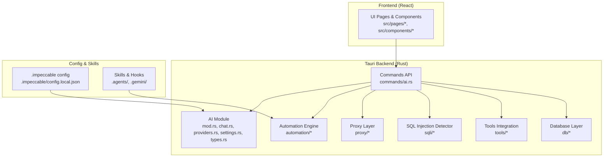
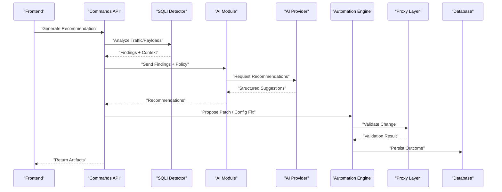
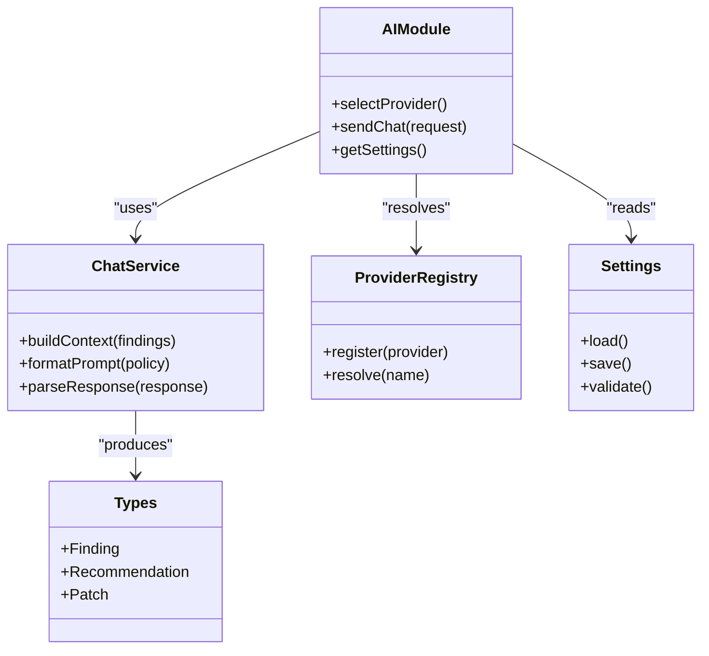
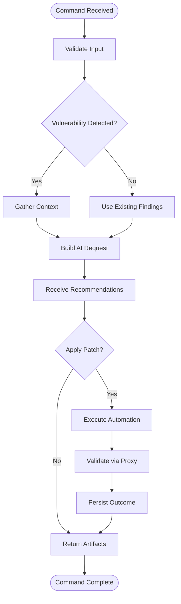
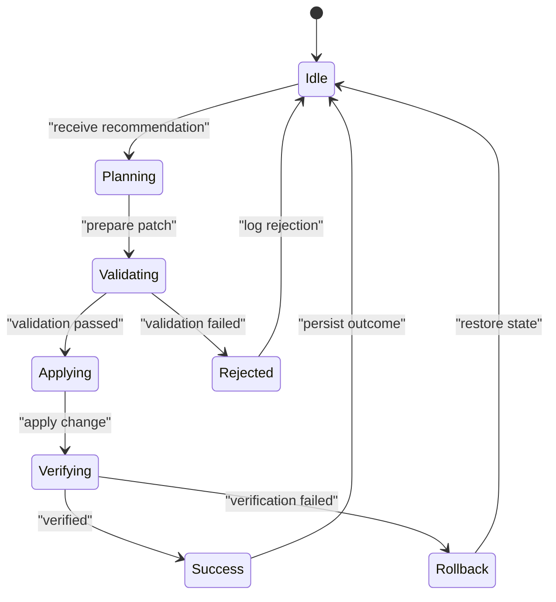
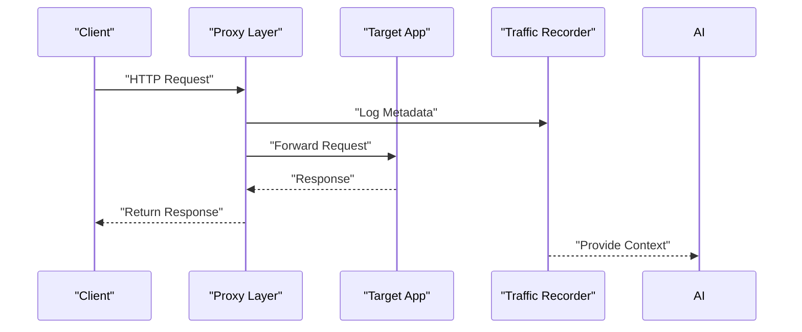
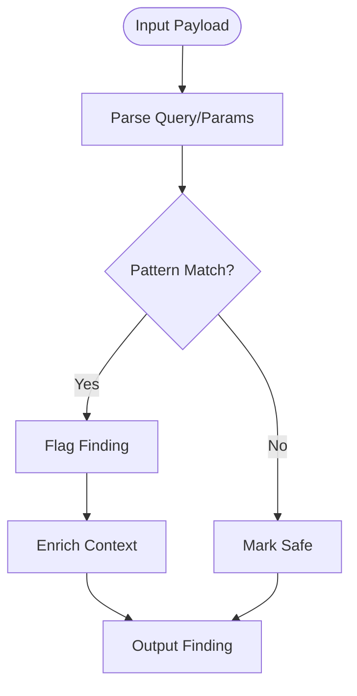
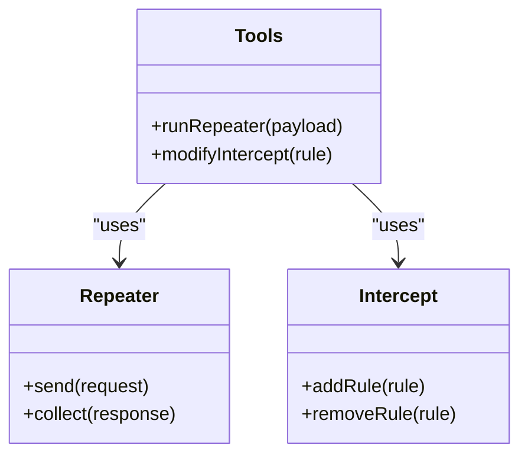
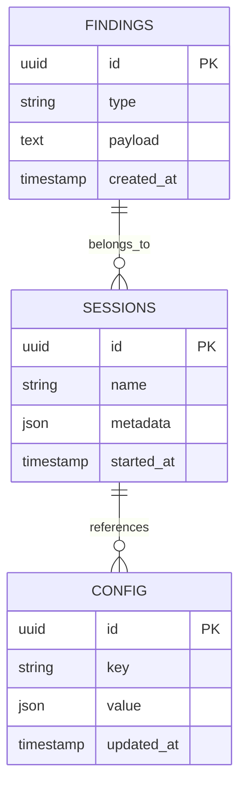
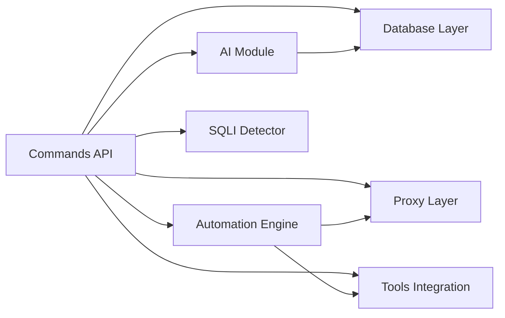

# Security Recommendations & Remediation

<cite>
**Referenced Files in This Document**
- [README.md](file://README.md)
- [src/ai/mod.rs](file://src-tauri/src/ai/mod.rs)
- [src/ai/chat.rs](file://src-tauri/src/ai/chat.rs)
- [src/ai/providers.rs](file://src-tauri/src/ai/providers.rs)
- [src/ai/settings.rs](file://src-tauri/src/ai/settings.rs)
- [src/ai/types.rs](file://src-tauri/src/ai/types.rs)
- [src/commands/ai.rs](file://src-tauri/src/commands/ai.rs)
- [src/automation/mod.rs](file://src-tauri/src/automation/mod.rs)
- [src/automation/actions.rs](file://src-tauri/src/automation/actions.rs)
- [src/automation/execution.rs](file://src-tauri/src/automation/execution.rs)
- [src/automation/state.rs](file://src-tauri/src/automation/state.rs)
- [src/proxy/mod.rs](file://src-tauri/src/proxy/mod.rs)
- [src/proxy/lifecycle.rs](file://src-tauri/src/proxy/lifecycle.rs)
- [src/sqli/mod.rs](file://src-tauri/src/sqli/mod.rs)
- [src/sqli/detector.rs](file://src-tauri/src/sqli/detector.rs)
- [src/sqli/payloads.rs](file://src-tauri/src/sqli/payloads.rs)
- [src/tools/mod.rs](file://src-tauri/src/tools/mod.rs)
- [src/tools/intercept.rs](file://src-tauri/src/tools/intercept.rs)
- [src/tools/repeater.rs](file://src-tauri/src/tools/repeater.rs)
- [src/db/mod.rs](file://src-tauri/src/db/mod.rs)
- [src/db/schema.rs](file://src-tauri/src/db/schema.rs)
- [src/app_commands.rs](file://src-tauri/src/app_commands.rs)
- [src/main.rs](file://src-tauri/src/main.rs)
- [src/setup.rs](file://src-tauri/src/setup.rs)
- [src/tray.rs](file://src-tauri/src/tray.rs)
- [Cargo.toml](file://src-tauri/Cargo.toml)
- [tauri.conf.json](file://src-tauri/tauri.conf.json)
- [.impeccable/config.local.json](file://.impeccable/config.local.json)
- [scripts/build.sh](file://scripts/build.sh)
- [scripts/install.sh](file://scripts/install.sh)
</cite>

## Table of Contents
1. [Introduction](#introduction)
2. [Project Structure](#project-structure)
3. [Core Components](#core-components)
4. [Architecture Overview](#architecture-overview)
5. [Detailed Component Analysis](#detailed-component-analysis)
6. [Dependency Analysis](#dependency-analysis)
7. [Performance Considerations](#performance-considerations)
8. [Troubleshooting Guide](#troubleshooting-guide)
9. [Conclusion](#conclusion)
10. [Appendices](#appendices)

## Introduction
This document explains the AI-driven security recommendation system that generates actionable remediation steps, security best practices, and code fixes based on detected vulnerabilities. It covers the recommendation engine’s knowledge base, context-aware suggestions, integration with development workflows, examples of generated recommendations and patches, and customization options for organization-specific policies and compliance requirements.

The system combines:
- Vulnerability detection (e.g., SQL injection patterns)
- Context collection from live traffic and tools
- An AI provider abstraction to generate tailored recommendations
- Automation hooks to apply safe remediations or propose diffs
- Persistent storage for findings, sessions, and policy configurations

## Project Structure
At a high level, the application is a Tauri-based desktop app with Rust backend modules and a React frontend. The AI and automation subsystems are implemented in Rust under src-tauri/src, while UI components reside under src. Configuration and skills are stored under .impeccable and .agents/.gemini directories.

**Diagram sources**
- [src-tauri/src/ai/mod.rs](file://src-tauri/src/ai/mod.rs)
- [src-tauri/src/commands/ai.rs](file://src-tauri/src/commands/ai.rs)
- [src-tauri/src/automation/mod.rs](file://src-tauri/src/automation/mod.rs)
- [src-tauri/src/proxy/mod.rs](file://src-tauri/src/proxy/mod.rs)
- [src-tauri/src/sqli/mod.rs](file://src-tauri/src/sqli/mod.rs)
- [src-tauri/src/tools/mod.rs](file://src-tauri/src/tools/mod.rs)
- [src-tauri/src/db/mod.rs](file://src-tauri/src/db/mod.rs)
- [.impeccable/config.local.json](file://.impeccable/config.local.json)

**Section sources**
- [README.md](file://README.md)
- [src-tauri/Cargo.toml](file://src-tauri/Cargo.toml)
- [src-tauri/tauri.conf.json](file://src-tauri/tauri.conf.json)

## Core Components
- AI Module: Provides chat orchestration, provider selection, and typed request/response structures.
- Commands API: Exposes Tauri commands for generating recommendations, applying patches, and querying history.
- Automation Engine: Executes actions, manages state, and integrates with proxy and tools to validate changes.
- Proxy Layer: Intercepts and forwards requests, enabling context capture for AI analysis.
- SQL Injection Detector: Identifies vulnerable patterns and payloads for targeted remediation.
- Tools Integration: Bridges between AI outputs and concrete tooling (repeater, intercept).
- Database Layer: Persists findings, sessions, and configuration for continuity across runs.

Key responsibilities:
- Collect contextual data (traffic, payloads, file paths)
- Generate recommendations via configured AI providers
- Produce actionable artifacts (patches, configs, tests)
- Persist outcomes and enable iterative refinement

**Section sources**
- [src-tauri/src/ai/mod.rs](file://src-tauri/src/ai/mod.rs)
- [src-tauri/src/ai/chat.rs](file://src-tauri/src/ai/chat.rs)
- [src-tauri/src/ai/providers.rs](file://src-tauri/src/ai/providers.rs)
- [src-tauri/src/ai/settings.rs](file://src-tauri/src/ai/settings.rs)
- [src-tauri/src/ai/types.rs](file://src-tauri/src/ai/types.rs)
- [src-tauri/src/commands/ai.rs](file://src-tauri/src/commands/ai.rs)
- [src-tauri/src/automation/mod.rs](file://src-tauri/src/automation/mod.rs)
- [src-tauri/src/automation/actions.rs](file://src-tauri/src/automation/actions.rs)
- [src-tauri/src/automation/execution.rs](file://src-tauri/src/automation/execution.rs)
- [src-tauri/src/automation/state.rs](file://src-tauri/src/automation/state.rs)
- [src-tauri/src/proxy/mod.rs](file://src-tauri/src/proxy/mod.rs)
- [src-tauri/src/proxy/lifecycle.rs](file://src-tauri/src/proxy/lifecycle.rs)
- [src-tauri/src/sqli/mod.rs](file://src-tauri/src/sqli/mod.rs)
- [src-tauri/src/sqli/detector.rs](file://src-tauri/src/sqli/detector.rs)
- [src-tauri/src/sqli/payloads.rs](file://src-tauri/src/sqli/payloads.rs)
- [src-tauri/src/tools/mod.rs](file://src-tauri/src/tools/mod.rs)
- [src-tauri/src/tools/intercept.rs](file://src-tauri/src/tools/intercept.rs)
- [src-tauri/src/tools/repeater.rs](file://src-tauri/src/tools/repeater.rs)
- [src-tauri/src/db/mod.rs](file://src-tauri/src/db/mod.rs)
- [src-tauri/src/db/schema.rs](file://src-tauri/src/db/schema.rs)

## Architecture Overview
The recommendation pipeline starts when a vulnerability is detected or a user triggers an analysis. Context is gathered from the proxy and tools, then passed to the AI module which selects a provider and returns structured recommendations. Automation can apply safe changes or propose diffs, validated through the proxy and tools before persistence.

**Diagram sources**
- [src-tauri/src/commands/ai.rs](file://src-tauri/src/commands/ai.rs)
- [src-tauri/src/sqli/detector.rs](file://src-tauri/src/sqli/detector.rs)
- [src-tauri/src/ai/mod.rs](file://src-tauri/src/ai/mod.rs)
- [src-tauri/src/ai/providers.rs](file://src-tauri/src/ai/providers.rs)
- [src-tauri/src/automation/execution.rs](file://src-tauri/src/automation/execution.rs)
- [src-tauri/src/proxy/mod.rs](file://src-tauri/src/proxy/mod.rs)
- [src-tauri/src/db/mod.rs](file://src-tauri/src/db/mod.rs)

## Detailed Component Analysis

### AI Module and Providers
The AI module centralizes chat orchestration, provider selection, and typed message handling. It supports multiple providers and allows configuration via settings.

**Diagram sources**
- [src-tauri/src/ai/mod.rs](file://src-tauri/src/ai/mod.rs)
- [src-tauri/src/ai/chat.rs](file://src-tauri/src/ai/chat.rs)
- [src-tauri/src/ai/providers.rs](file://src-tauri/src/ai/providers.rs)
- [src-tauri/src/ai/settings.rs](file://src-tauri/src/ai/settings.rs)
- [src-tauri/src/ai/types.rs](file://src-tauri/src/ai/types.rs)

**Section sources**
- [src-tauri/src/ai/mod.rs](file://src-tauri/src/ai/mod.rs)
- [src-tauri/src/ai/chat.rs](file://src-tauri/src/ai/chat.rs)
- [src-tauri/src/ai/providers.rs](file://src-tauri/src/ai/providers.rs)
- [src-tauri/src/ai/settings.rs](file://src-tauri/src/ai/settings.rs)
- [src-tauri/src/ai/types.rs](file://src-tauri/src/ai/types.rs)

### Commands API
The commands layer exposes Tauri endpoints for generating recommendations, applying patches, and retrieving history. It coordinates detectors, AI, automation, and persistence.

**Diagram sources**
- [src-tauri/src/commands/ai.rs](file://src-tauri/src/commands/ai.rs)
- [src-tauri/src/automation/execution.rs](file://src-tauri/src/automation/execution.rs)
- [src-tauri/src/proxy/mod.rs](file://src-tauri/src/proxy/mod.rs)
- [src-tauri/src/db/mod.rs](file://src-tauri/src/db/mod.rs)

**Section sources**
- [src-tauri/src/commands/ai.rs](file://src-tauri/src/commands/ai.rs)

### Automation Engine
The automation engine executes remediation actions, tracks state, and integrates with proxy validation and tools. It ensures safe application of changes and rollback capabilities.

**Diagram sources**
- [src-tauri/src/automation/state.rs](file://src-tauri/src/automation/state.rs)
- [src-tauri/src/automation/actions.rs](file://src-tauri/src/automation/actions.rs)
- [src-tauri/src/automation/execution.rs](file://src-tauri/src/automation/execution.rs)
- [src-tauri/src/proxy/mod.rs](file://src-tauri/src/proxy/mod.rs)

**Section sources**
- [src-tauri/src/automation/mod.rs](file://src-tauri/src/automation/mod.rs)
- [src-tauri/src/automation/actions.rs](file://src-tauri/src/automation/actions.rs)
- [src-tauri/src/automation/execution.rs](file://src-tauri/src/automation/execution.rs)
- [src-tauri/src/automation/state.rs](file://src-tauri/src/automation/state.rs)

### Proxy Layer
The proxy captures and forwards HTTP traffic, providing rich context for AI analysis and enabling validation of proposed changes.

**Diagram sources**
- [src-tauri/src/proxy/mod.rs](file://src-tauri/src/proxy/mod.rs)
- [src-tauri/src/proxy/lifecycle.rs](file://src-tauri/src/proxy/lifecycle.rs)

**Section sources**
- [src-tauri/src/proxy/mod.rs](file://src-tauri/src/proxy/mod.rs)
- [src-tauri/src/proxy/lifecycle.rs](file://src-tauri/src/proxy/lifecycle.rs)

### SQL Injection Detector
The detector identifies vulnerable patterns and payloads, feeding findings into the AI module for targeted remediation.

**Diagram sources**
- [src-tauri/src/sqli/detector.rs](file://src-tauri/src/sqli/detector.rs)
- [src-tauri/src/sqli/payloads.rs](file://src-tauri/src/sqli/payloads.rs)

**Section sources**
- [src-tauri/src/sqli/mod.rs](file://src-tauri/src/sqli/mod.rs)
- [src-tauri/src/sqli/detector.rs](file://src-tauri/src/sqli/detector.rs)
- [src-tauri/src/sqli/payloads.rs](file://src-tauri/src/sqli/payloads.rs)

### Tools Integration
Integration with repeater and intercept enables automated testing and validation of remediation changes.

**Diagram sources**
- [src-tauri/src/tools/mod.rs](file://src-tauri/src/tools/mod.rs)
- [src-tauri/src/tools/repeater.rs](file://src-tauri/src/tools/repeater.rs)
- [src-tauri/src/tools/intercept.rs](file://src-tauri/src/tools/intercept.rs)

**Section sources**
- [src-tauri/src/tools/mod.rs](file://src-tauri/src/tools/mod.rs)
- [src-tauri/src/tools/repeater.rs](file://src-tauri/src/tools/repeater.rs)
- [src-tauri/src/tools/intercept.rs](file://src-tauri/src/tools/intercept.rs)

### Database Layer
Persistence of findings, sessions, and configuration ensures continuity and auditability.

**Diagram sources**
- [src-tauri/src/db/schema.rs](file://src-tauri/src/db/schema.rs)
- [src-tauri/src/db/mod.rs](file://src-tauri/src/db/mod.rs)

**Section sources**
- [src-tauri/src/db/mod.rs](file://src-tauri/src/db/mod.rs)
- [src-tauri/src/db/schema.rs](file://src-tauri/src/db/schema.rs)

## Dependency Analysis
The system exhibits clear separation of concerns:
- Commands API orchestrates flows without deep coupling
- AI module abstracts provider details
- Automation encapsulates execution and state
- Proxy provides context and validation
- Detector focuses on pattern recognition
- Tools bridge to external utilities
- Database persists state consistently

**Diagram sources**
- [src-tauri/src/commands/ai.rs](file://src-tauri/src/commands/ai.rs)
- [src-tauri/src/ai/mod.rs](file://src-tauri/src/ai/mod.rs)
- [src-tauri/src/automation/mod.rs](file://src-tauri/src/automation/mod.rs)
- [src-tauri/src/proxy/mod.rs](file://src-tauri/src/proxy/mod.rs)
- [src-tauri/src/sqli/mod.rs](file://src-tauri/src/sqli/mod.rs)
- [src-tauri/src/tools/mod.rs](file://src-tauri/src/tools/mod.rs)
- [src-tauri/src/db/mod.rs](file://src-tauri/src/db/mod.rs)

**Section sources**
- [src-tauri/src/commands/ai.rs](file://src-tauri/src/commands/ai.rs)
- [src-tauri/src/ai/mod.rs](file://src-tauri/src/ai/mod.rs)
- [src-tauri/src/automation/mod.rs](file://src-tauri/src/automation/mod.rs)
- [src-tauri/src/proxy/mod.rs](file://src-tauri/src/proxy/mod.rs)
- [src-tauri/src/sqli/mod.rs](file://src-tauri/src/sqli/mod.rs)
- [src-tauri/src/tools/mod.rs](file://src-tauri/src/tools/mod.rs)
- [src-tauri/src/db/mod.rs](file://src-tauri/src/db/mod.rs)

## Performance Considerations
- Batch context gathering to reduce redundant network calls
- Cache frequent AI responses for identical contexts
- Stream large payloads through proxy efficiently
- Defer heavy computations to background tasks
- Use incremental updates in automation to minimize downtime

[No sources needed since this section provides general guidance]

## Troubleshooting Guide
Common issues and resolutions:
- AI provider errors: Verify credentials and endpoint availability; check settings validation.
- Automation failures: Inspect state transitions and rollback logs; ensure proxy is running.
- Detection false positives: Tune pattern rules and payload sets; review enriched context.
- Persistence problems: Validate database schema migrations and permissions.

**Section sources**
- [src-tauri/src/ai/settings.rs](file://src-tauri/src/ai/settings.rs)
- [src-tauri/src/automation/state.rs](file://src-tauri/src/automation/state.rs)
- [src-tauri/src/sqli/detector.rs](file://src-tauri/src/sqli/detector.rs)
- [src-tauri/src/db/schema.rs](file://src-tauri/src/db/schema.rs)

## Conclusion
The AI-driven security recommendation system integrates detection, context capture, AI-powered analysis, and automated remediation within a cohesive architecture. By leveraging modular components and persistent state, it delivers actionable, organization-specific security improvements while maintaining safety and auditability.

[No sources needed since this section summarizes without analyzing specific files]

## Appendices

### Examples of Generated Recommendations
- Code Fixes: Parameterized queries, input sanitization, secure headers
- Configuration Improvements: TLS settings, CORS policies, rate limiting
- Best Practices: Secure coding guidelines, dependency updates, monitoring

[No sources needed since this section provides conceptual examples]

### Customization Options
- Organization Policies: Define allowed patterns, severity thresholds, and compliance rules
- Compliance Requirements: Map findings to regulatory frameworks and reporting formats
- Skill Integration: Extend detection and remediation via skills and hooks

**Section sources**
- [.impeccable/config.local.json](file://.impeccable/config.local.json)
- [src-tauri/src/ai/settings.rs](file://src-tauri/src/ai/settings.rs)

### Installation and Setup
- Build scripts and installation procedures ensure environment readiness
- Tauri configuration defines capabilities and resources

**Section sources**
- [scripts/build.sh](file://scripts/build.sh)
- [scripts/install.sh](file://scripts/install.sh)
- [src-tauri/tauri.conf.json](file://src-tauri/tauri.conf.json)