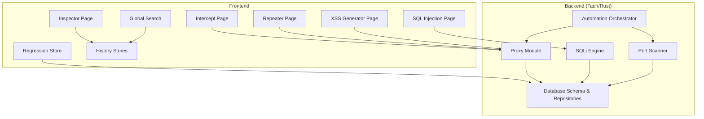
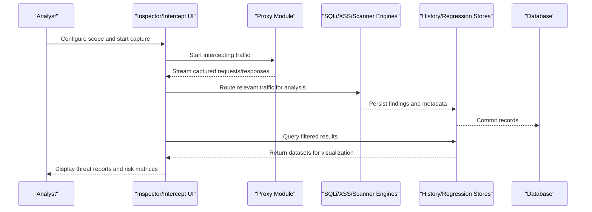
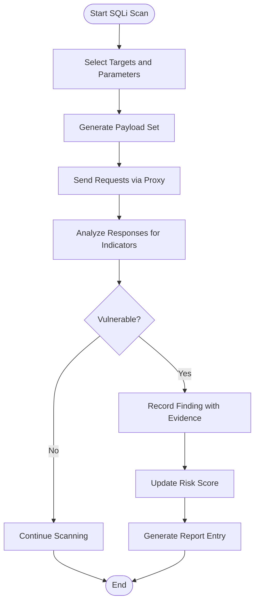
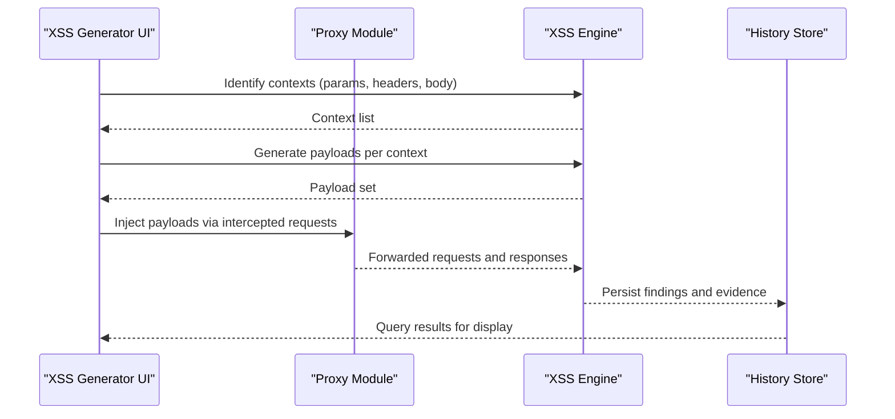
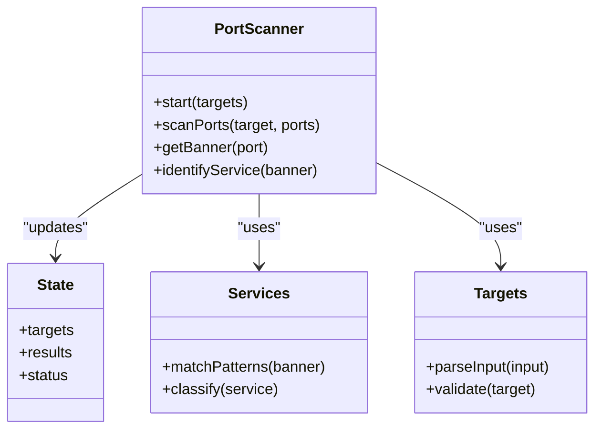
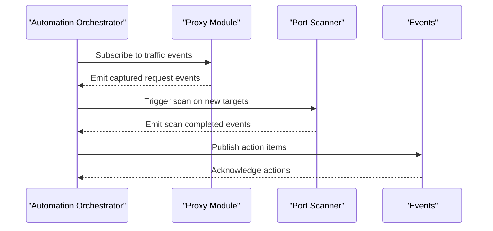
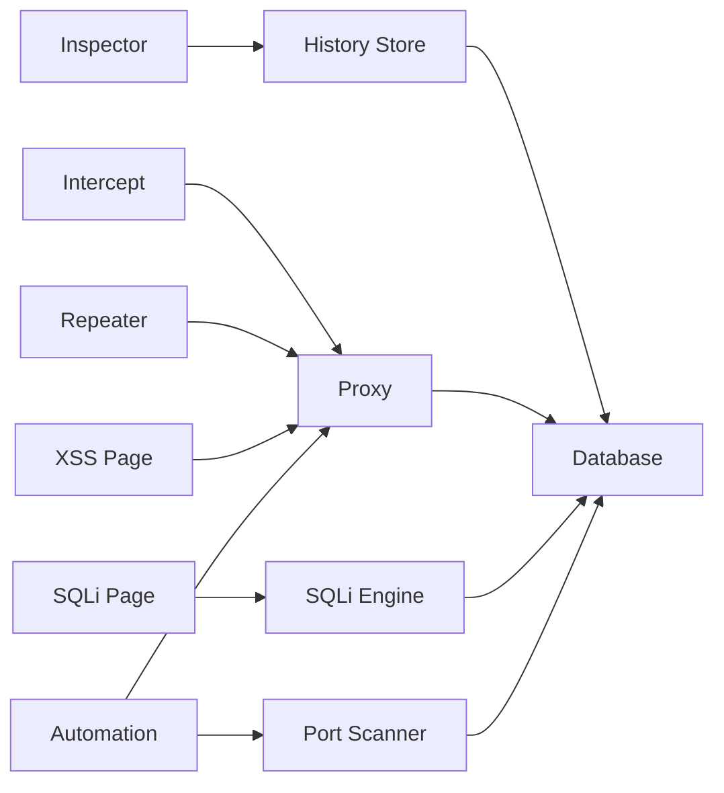

# Threat Analysis & Risk Assessment

<cite>
**Referenced Files in This Document**
- [README.md](file://README.md)
- [DESIGN.md](file://DESIGN.md)
- [src/pages/inspector/index.tsx](file://src/pages/inspector/index.tsx)
- [src/pages/inspector/types.ts](file://src/pages/inspector/types.ts)
- [src/pages/inspector/api.ts](file://src/pages/inspector/api.ts)
- [src/pages/intercept/index.tsx](file://src/pages/intercept/index.tsx)
- [src/pages/intercept/types.ts](file://src/pages/intercept/types.ts)
- [src/pages/intercept/lib.ts](file://src/pages/intercept/lib.ts)
- [src/pages/repeater/index.tsx](file://src/pages/repeater/index.tsx)
- [src/pages/repeater/types.ts](file://src/pages/repeater/types.ts)
- [src/pages/sql-injection/index.tsx](file://src/pages/sql-injection/index.tsx)
- [src/pages/sql-injection/types.ts](file://src/pages/sql-injection/types.ts)
- [src/pages/xss-generator/index.tsx](file://src/pages/xss-generator/index.tsx)
- [src/pages/xss-generator/types.ts](file://src/pages/xss-generator/types.ts)
- [src/stores/regression.ts](file://src/stores/regression.ts)
- [src/stores/tools.ts](file://src/stores/tools.ts)
- [src/stores/target.ts](file://src/stores/target.ts)
- [src/stores/history/http-query.ts](file://src/stores/history/http-query.ts)
- [src/stores/history/http-blacklist.ts](file://src/stores/history/http-blacklist.ts)
- [src/stores/history/http-highlight.ts](file://src/stores/history/http-highlight.ts)
- [src/stores/history/http-pinned.ts](file://src/stores/history/http-pinned.ts)
- [src/stores/filter.ts](file://src/stores/filter.ts)
- [src/layout/global-search/index.tsx](file://src/layout/global-search/index.tsx)
- [src/layout/global-search/http-history-search.tsx](file://src/layout/global-search/http-history-search.tsx)
- [src/components/ui/data-table.tsx](file://src/components/ui/data-table.tsx)
- [src/components/ui/badge.tsx](file://src/components/ui/badge.tsx)
- [src/components/status-badge.tsx](file://src/components/status-badge.tsx)
- [src-tauri/src/sqli/mod.rs](file://src-tauri/src/sqli/mod.rs)
- [src-tauri/src/sqli/detector.rs](file://src-tauri/src/sqli/detector.rs)
- [src-tauri/src/sqli/payloads.rs](file://src-tauri/src/sqli/payloads.rs)
- [src-tauri/src/sqli/types.rs](file://src-tauri/src/sqli/types.rs)
- [src-tauri/src/port-scanner/mod.rs](file://src-tauri/src/port-scanner/mod.rs)
- [src-tauri/src/port-scanner/scanner.rs](file://src-tauri/src/port-scanner/scanner.rs)
- [src-tauri/src/port-scanner/services.rs](file://src-tauri/src/port-scanner/services.rs)
- [src-tauri/src/port-scanner/state.rs](file://src-tauri/src/port-scanner/state.rs)
- [src-tauri/src/port-scanner/targets.rs](file://src-tauri/src/port-scanner/targets.rs)
- [src-tauri/src/port-scanner/banner.rs](file://src-tauri/src/port-scanner/banner.rs)
- [src-tauri/src/proxy/mod.rs](file://src-tauri/src/proxy/mod.rs)
- [src-tauri/src/proxy/state.rs](file://src-tauri/src/proxy/state.rs)
- [src-tauri/src/proxy/types.rs](file://src-tauri/src/proxy/types.rs)
- [src-tauri/src/automation/mod.rs](file://src-tauri/src/automation/mod.rs)
- [src-tauri/src/automation/actions.rs](file://src-tauri/src/automation/actions.rs)
- [src-tauri/src/automation/events.rs](file://src-tauri/src/automation/events.rs)
- [src-tauri/src/automation/execution.rs](file://src-tauri/src/automation/execution.rs)
- [src-tauri/src/automation/live_traffic.rs](file://src-tauri/src/automation/live_traffic.rs)
- [src-tauri/src/automation/port_scan.rs](file://src-tauri/src/automation/port_scan.rs)
- [src-tauri/src/automation/scan_completed.rs](file://src-tauri/src/automation/scan_completed.rs)
- [src-tauri/src/commands/mod.rs](file://src-tauri/src/commands/mod.rs)
- [src-tauri/src/commands/proxy.rs](file://src-tauri/src/commands/proxy.rs)
- [src-tauri/src/commands/browser.rs](file://src-tauri/src/commands/browser.rs)
- [src-tauri/src/commands/invoker.rs](file://src-tauri/src/commands/invoker.rs)
- [src-tauri/src/commands/repeater.rs](file://src-tauri/src/commands/repeater.rs)
- [src-tauri/src/commands/regression.rs](file://src-tauri/src/commands/regression.rs)
- [src-tauri/src/db/schema.rs](file://src-tauri/src/db/schema.rs)
- [src-tauri/src/db/repository/mod.rs](file://src-tauri/src/db/repository/mod.rs)
</cite>

## Table of Contents
1. [Introduction](#introduction)
2. [Project Structure](#project-structure)
3. [Core Components](#core-components)
4. [Architecture Overview](#architecture-overview)
5. [Detailed Component Analysis](#detailed-component-analysis)
6. [Dependency Analysis](#dependency-analysis)
7. [Performance Considerations](#performance-considerations)
8. [Troubleshooting Guide](#troubleshooting-guide)
9. [Conclusion](#conclusion)
10. [Appendices](#appendices)

## Introduction
This document explains the threat analysis and risk assessment capabilities implemented in the application. It focuses on how the system evaluates potential threats, calculates risk scores, and provides contextual security insights across HTTP traffic, web application vulnerabilities (SQL injection and XSS), port scanning, and automation workflows. It also covers threat modeling approaches, attack surface analysis, vulnerability impact assessment, examples of threat reports, risk matrices, and integration points for dashboards and automated reporting.

The system combines:
- Live traffic inspection and interception
- Automated vulnerability detection engines
- Port and service discovery
- Regression testing and replay capabilities
- Persistent storage and queryable history
- UI components for visualization and filtering

These capabilities enable analysts to identify risks, quantify their severity, and produce actionable reports.

## Project Structure
The codebase is organized into a frontend (React/TypeScript) and a native backend (Rust via Tauri). Security-related functionality spans multiple pages, stores, and Rust modules:
- Frontend pages provide interactive interfaces for inspection, interception, repeater, SQL injection testing, XSS generation, and regression testing.
- Stores manage state for history, filters, targets, and tool configurations.
- Rust modules implement core engines for SQL injection detection, port scanning, proxy operations, and automation orchestration.

**Diagram sources**
- [src/pages/inspector/index.tsx](file://src/pages/inspector/index.tsx)
- [src/pages/intercept/index.tsx](file://src/pages/intercept/index.tsx)
- [src/pages/repeater/index.tsx](file://src/pages/repeater/index.tsx)
- [src/pages/sql-injection/index.tsx](file://src/pages/sql-injection/index.tsx)
- [src/pages/xss-generator/index.tsx](file://src/pages/xss-generator/index.tsx)
- [src/stores/regression.ts](file://src/stores/regression.ts)
- [src/stores/history/http-query.ts](file://src/stores/history/http-query.ts)
- [src/layout/global-search/index.tsx](file://src/layout/global-search/index.tsx)
- [src-tauri/src/proxy/mod.rs](file://src-tauri/src/proxy/mod.rs)
- [src-tauri/src/sqli/mod.rs](file://src-tauri/src/sqli/mod.rs)
- [src-tauri/src/port-scanner/mod.rs](file://src-tauri/src/port-scanner/mod.rs)
- [src-tauri/src/automation/mod.rs](file://src-tauri/src/automation/mod.rs)
- [src-tauri/src/db/schema.rs](file://src-tauri/src/db/schema.rs)

**Section sources**
- [README.md](file://README.md)
- [DESIGN.md](file://DESIGN.md)

## Core Components
- Inspector: Displays captured requests/responses with metadata and highlights for quick triage.
- Intercept: Intercepts live traffic, allows modification, and forwards requests through the proxy.
- Repeater: Manages collections of crafted requests for systematic testing and replay.
- SQL Injection: Executes payload sets against endpoints and records findings.
- XSS Generator: Generates payloads and tests reflected or stored XSS vectors.
- Automation: Orchestrates scans, live traffic triggers, and post-scan actions.
- Proxy: Central traffic capture and forwarding engine with CA management and mock support.
- Port Scanner: Discovers open ports, banners, and services to map attack surfaces.
- History Stores: Persist and query HTTP and WebSocket events for analysis and reporting.
- Regression Store: Tracks changes over time to detect regressions and validate fixes.

Key responsibilities:
- Data ingestion from live traffic and scanners
- Detection logic for vulnerabilities
- Risk scoring and categorization
- Visualization and filtering for analysts
- Export and integration hooks for dashboards

**Section sources**
- [src/pages/inspector/index.tsx](file://src/pages/inspector/index.tsx)
- [src/pages/intercept/index.tsx](file://src/pages/intercept/index.tsx)
- [src/pages/repeater/index.tsx](file://src/pages/repeater/index.tsx)
- [src/pages/sql-injection/index.tsx](file://src/pages/sql-injection/index.tsx)
- [src/pages/xss-generator/index.tsx](file://src/pages/xss-generator/index.tsx)
- [src/stores/regression.ts](file://src/stores/regression.ts)
- [src/stores/history/http-query.ts](file://src/stores/history/http-query.ts)
- [src-tauri/src/proxy/mod.rs](file://src-tauri/src/proxy/mod.rs)
- [src-tauri/src/sqli/mod.rs](file://src-tauri/src/sqli/mod.rs)
- [src-tauri/src/port-scanner/mod.rs](file://src-tauri/src/port-scanner/mod.rs)
- [src-tauri/src/automation/mod.rs](file://src-tauri/src/automation/mod.rs)

## Architecture Overview
The architecture integrates frontend pages with backend engines via Tauri commands and WebSocket channels. The proxy captures traffic, which is then analyzed by specialized engines (SQLi, XSS, port scanner). Findings are persisted and exposed through stores and APIs for visualization and reporting.

**Diagram sources**
- [src/pages/inspector/index.tsx](file://src/pages/inspector/index.tsx)
- [src/pages/intercept/index.tsx](file://src/pages/intercept/index.tsx)
- [src-tauri/src/proxy/mod.rs](file://src-tauri/src/proxy/mod.rs)
- [src-tauri/src/sqli/mod.rs](file://src-tauri/src/sqli/mod.rs)
- [src-tauri/src/port-scanner/mod.rs](file://src-tauri/src/port-scanner/mod.rs)
- [src/stores/history/http-query.ts](file://src/stores/history/http-query.ts)
- [src/stores/regression.ts](file://src/stores/regression.ts)
- [src-tauri/src/db/schema.rs](file://src-tauri/src/db/schema.rs)

## Detailed Component Analysis

### Threat Modeling Approach
Threat modeling in this system is driven by:
- Attack surface mapping via port scanning and service enumeration
- Traffic-based profiling using intercepted HTTP/WebSocket messages
- Rule-based and heuristic detection for known patterns (e.g., SQLi payloads)
- Contextual enrichment from headers, cookies, parameters, and response bodies

The approach supports:
- Asset identification (targets, endpoints, services)
- Threat actor simulation through automated payloads
- Impact assessment based on data sensitivity and exposure
- Likelihood estimation derived from exploitability signals

**Section sources**
- [src-tauri/src/port-scanner/targets.rs](file://src-tauri/src/port-scanner/targets.rs)
- [src-tauri/src/port-scanner/services.rs](file://src-tauri/src/port-scanner/services.rs)
- [src-tauri/src/sqli/payloads.rs](file://src-tauri/src/sqli/payloads.rs)
- [src/stores/history/http-query.ts](file://src/stores/history/http-query.ts)

### Attack Surface Analysis
Attack surface analysis is performed by:
- Discovering open ports and associated services
- Enumerating banners and version information
- Correlating discovered services with known vulnerabilities
- Mapping endpoints from captured traffic to functional areas

Outputs include:
- Service inventory with versions and banners
- Endpoint catalog with methods and parameters
- Exposure indicators (publicly accessible paths, debug endpoints)

**Section sources**
- [src-tauri/src/port-scanner/scanner.rs](file://src-tauri/src/port-scanner/scanner.rs)
- [src-tauri/src/port-scanner/banner.rs](file://src-tauri/src/port-scanner/banner.rs)
- [src-tauri/src/port-scanner/state.rs](file://src-tauri/src/port-scanner/state.rs)
- [src/stores/history/http-query.ts](file://src/stores/history/http-query.ts)

### Vulnerability Impact Assessment
Impact assessment considers:
- Confidentiality, integrity, and availability implications
- Data sensitivity classification (PII, credentials, tokens)
- Authentication and authorization bypass potential
- Lateral movement and privilege escalation pathways

Risk scoring methodology:
- Base score derived from CVSS-like factors (exploitability, impact)
- Adjustments for environment context (exposure, mitigations)
- Aggregation across multiple findings per target

**Section sources**
- [src-tauri/src/sqli/types.rs](file://src-tauri/src/sqli/types.rs)
- [src-tauri/src/sqli/detector.rs](file://src-tauri/src/sqli/detector.rs)
- [src/stores/history/http-highlight.ts](file://src/stores/history/http-highlight.ts)
- [src/stores/history/http-pinned.ts](file://src/stores/history/http-pinned.ts)

### SQL Injection Detection Flow
The SQLi engine applies payload sets to inputs and analyzes responses for indicative behavior.

**Diagram sources**
- [src-tauri/src/sqli/detector.rs](file://src-tauri/src/sqli/detector.rs)
- [src-tauri/src/sqli/payloads.rs](file://src-tauri/src/sqli/payloads.rs)
- [src-tauri/src/sqli/types.rs](file://src-tauri/src/sqli/types.rs)
- [src-tauri/src/proxy/mod.rs](file://src-tauri/src/proxy/mod.rs)

**Section sources**
- [src-tauri/src/sqli/detector.rs](file://src-tauri/src/sqli/detector.rs)
- [src-tauri/src/sqli/payloads.rs](file://src-tauri/src/sqli/payloads.rs)
- [src-tauri/src/sqli/types.rs](file://src-tauri/src/sqli/types.rs)

### XSS Generation and Testing Flow
XSS testing involves generating payloads and injecting them into contexts identified during traffic inspection.

**Diagram sources**
- [src/pages/xss-generator/index.tsx](file://src/pages/xss-generator/index.tsx)
- [src-tauri/src/proxy/mod.rs](file://src-tauri/src/proxy/mod.rs)
- [src/stores/history/http-query.ts](file://src/stores/history/http-query.ts)

**Section sources**
- [src/pages/xss-generator/index.tsx](file://src/pages/xss-generator/index.tsx)
- [src-tauri/src/proxy/mod.rs](file://src-tauri/src/proxy/mod.rs)
- [src/stores/history/http-query.ts](file://src/stores/history/http-query.ts)

### Port Scanning and Service Enumeration
Port scanning discovers open ports and gathers banner/service information to map the attack surface.

**Diagram sources**
- [src-tauri/src/port-scanner/scanner.rs](file://src-tauri/src/port-scanner/scanner.rs)
- [src-tauri/src/port-scanner/state.rs](file://src-tauri/src/port-scanner/state.rs)
- [src-tauri/src/port-scanner/services.rs](file://src-tauri/src/port-scanner/services.rs)
- [src-tauri/src/port-scanner/targets.rs](file://src-tauri/src/port-scanner/targets.rs)

**Section sources**
- [src-tauri/src/port-scanner/scanner.rs](file://src-tauri/src/port-scanner/scanner.rs)
- [src-tauri/src/port-scanner/state.rs](file://src-tauri/src/port-scanner/state.rs)
- [src-tauri/src/port-scanner/services.rs](file://src-tauri/src/port-scanner/services.rs)
- [src-tauri/src/port-scanner/targets.rs](file://src/tauri/src/port-scanner/targets.rs)

### Automation and Live Traffic Triggers
Automation orchestrates scans and reacts to live traffic events to trigger targeted analyses.

**Diagram sources**
- [src-tauri/src/automation/mod.rs](file://src-tauri/src/automation/mod.rs)
- [src-tauri/src/automation/live_traffic.rs](file://src-tauri/src/automation/live_traffic.rs)
- [src-tauri/src/automation/port_scan.rs](file://src-tauri/src/automation/port_scan.rs)
- [src-tauri/src/automation/scan_completed.rs](file://src-tauri/src/automation/scan_completed.rs)
- [src-tauri/src/proxy/mod.rs](file://src-tauri/src/proxy/mod.rs)

**Section sources**
- [src-tauri/src/automation/mod.rs](file://src-tauri/src/automation/mod.rs)
- [src-tauri/src/automation/live_traffic.rs](file://src-tauri/src/automation/live_traffic.rs)
- [src-tauri/src/automation/port_scan.rs](file://src-tauri/src/automation/port_scan.rs)
- [src-tauri/src/automation/scan_completed.rs](file://src-tauri/src/automation/scan_completed.rs)

### Risk Matrices and Security Posture Evaluations
Risk matrices aggregate findings by severity and category to evaluate overall posture:
- Categories: SQLi, XSS, Open Ports, Misconfigurations
- Severity levels: Critical, High, Medium, Low
- Posture score: Weighted aggregation considering exposure and mitigation status

Evaluations include:
- Trend analysis via regression store
- Heatmaps of vulnerable endpoints
- Recommendations prioritized by risk score

**Section sources**
- [src/stores/regression.ts](file://src/stores/regression.ts)
- [src/stores/history/http-query.ts](file://src/stores/history/http-query.ts)
- [src/stores/history/http-highlight.ts](file://src/stores/history/http-highlight.ts)

### Examples of Threat Reports
Threat reports summarize:
- Target scope and assets
- Detected vulnerabilities with evidence
- Risk scores and categories
- Remediation recommendations

Reports can be exported and integrated with dashboards via API endpoints exposed by stores and commands.

**Section sources**
- [src/stores/history/http-query.ts](file://src/stores/history/http-query.ts)
- [src-tauri/src/commands/mod.rs](file://src-tauri/src/commands/mod.rs)
- [src-tauri/src/db/schema.rs](file://src-tauri/src/db/schema.rs)

## Dependency Analysis
Components interact through well-defined interfaces:
- Frontend pages depend on stores for state and persistence
- Backend modules expose functionality via Tauri commands
- Automation orchestrator coordinates between proxy, scanners, and event handlers

Potential coupling:
- Heavy reliance on proxy for traffic access
- Tight integration between stores and database schema
- Automation depends on consistent event contracts

**Diagram sources**
- [src/pages/inspector/index.tsx](file://src/pages/inspector/index.tsx)
- [src/pages/intercept/index.tsx](file://src/pages/intercept/index.tsx)
- [src/pages/repeater/index.tsx](file://src/pages/repeater/index.tsx)
- [src/pages/sql-injection/index.tsx](file://src/pages/sql-injection/index.tsx)
- [src/pages/xss-generator/index.tsx](file://src/pages/xss-generator/index.tsx)
- [src/stores/history/http-query.ts](file://src/stores/history/http-query.ts)
- [src-tauri/src/proxy/mod.rs](file://src-tauri/src/proxy/mod.rs)
- [src-tauri/src/sqli/mod.rs](file://src-tauri/src/sqli/mod.rs)
- [src-tauri/src/port-scanner/mod.rs](file://src-tauri/src/port-scanner/mod.rs)
- [src-tauri/src/automation/mod.rs](file://src-tauri/src/automation/mod.rs)
- [src-tauri/src/db/schema.rs](file://src-tauri/src/db/schema.rs)

**Section sources**
- [src-tauri/src/commands/mod.rs](file://src-tauri/src/commands/mod.rs)
- [src-tauri/src/db/schema.rs](file://src-tauri/src/db/schema.rs)

## Performance Considerations
- Batch processing of payloads to reduce overhead
- Streaming responses from proxy to avoid blocking
- Indexing frequently queried fields in database schema
- Caching results for repeated scans within sessions
- Limiting concurrency for resource-intensive operations

[No sources needed since this section provides general guidance]

## Troubleshooting Guide
Common issues and resolutions:
- Proxy not capturing traffic: Verify CA installation and browser settings
- SQLi false positives: Adjust payload sets and response indicators
- Port scan timeouts: Increase timeouts and limit concurrent probes
- Store synchronization errors: Check database schema and migration status
- Automation events not firing: Validate event subscriptions and permissions

**Section sources**
- [src-tauri/src/proxy/state.rs](file://src-tauri/src/proxy/state.rs)
- [src-tauri/src/sqli/detector.rs](file://src-tauri/src/sqli/detector.rs)
- [src-tauri/src/port-scanner/state.rs](file://src-tauri/src/port-scanner/state.rs)
- [src-tauri/src/db/schema.rs](file://src-tauri/src/db/schema.rs)

## Conclusion
The system provides comprehensive threat analysis and risk assessment capabilities through integrated traffic inspection, automated vulnerability detection, and robust reporting. By combining attack surface mapping, contextual analysis, and risk scoring, it enables effective identification and mitigation of security risks. Integration points facilitate dashboard connectivity and automated reporting workflows.

[No sources needed since this section summarizes without analyzing specific files]

## Appendices

### Risk Matrix Template
- Axes: Likelihood vs. Impact
- Categories: SQLi, XSS, Open Ports, Misconfigurations
- Scoring: Numeric values mapped to severity bands

[No sources needed since this diagram shows conceptual workflow, not actual code structure]

### Security Posture Evaluation Checklist
- Scope definition and asset inventory
- Traffic capture and endpoint catalog
- Vulnerability scanning and validation
- Risk scoring and prioritization
- Remediation tracking and regression monitoring

[No sources needed since this section doesn't analyze specific files]