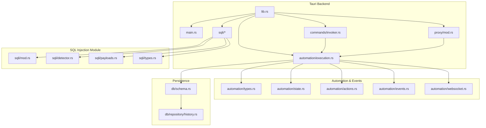
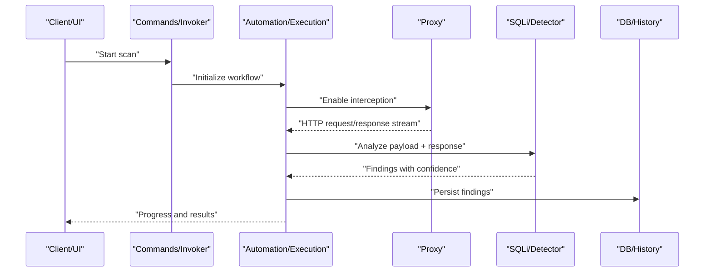
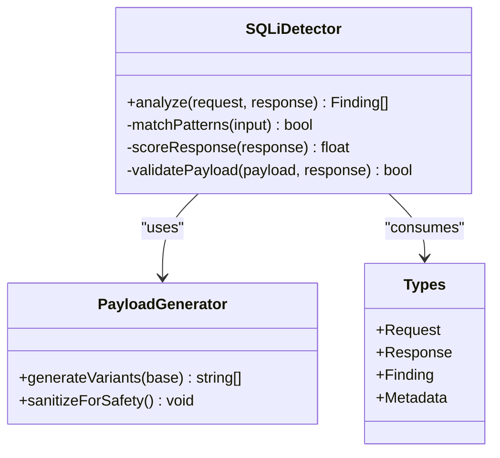
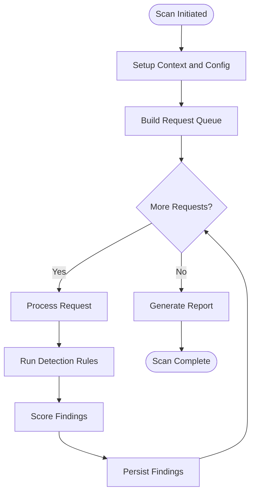
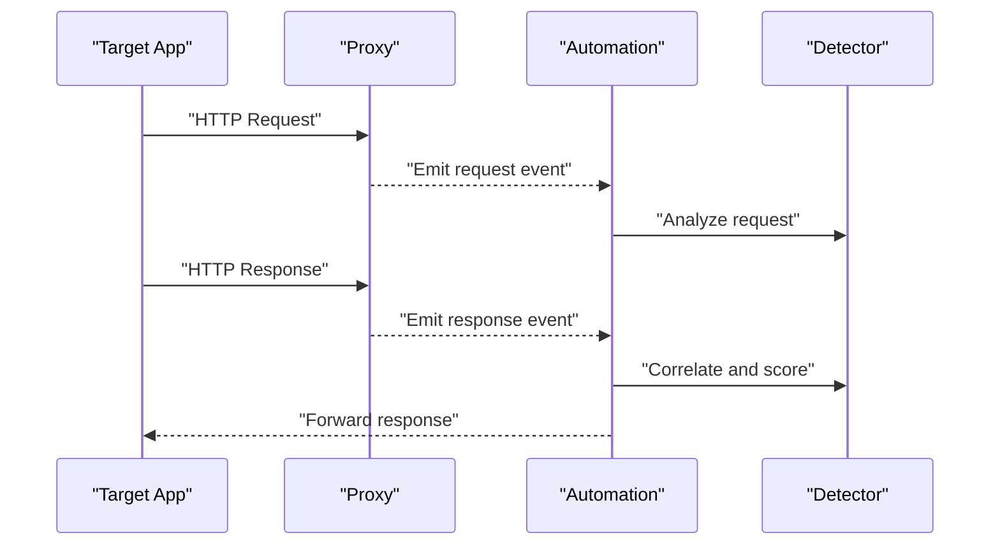
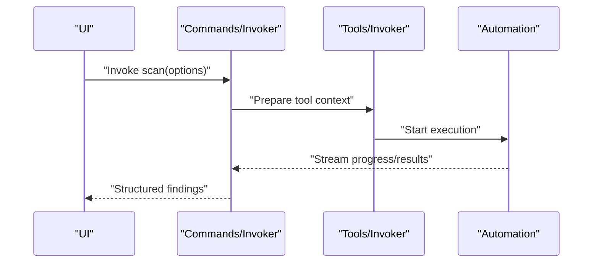
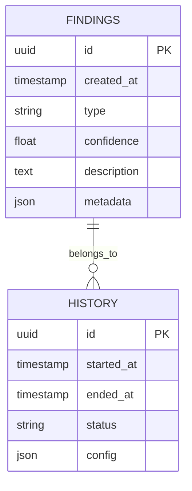
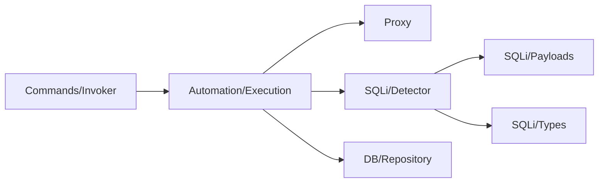

# Vulnerability Detection Engine

<cite>
**Referenced Files in This Document**
- [README.md](file://README.md)
- [src/sqli/detector.rs](file://src-tauri/src/sqli/detector.rs)
- [src/sqli/mod.rs](file://src-tauri/src/sqli/mod.rs)
- [src/sqli/payloads.rs](file://src-tauri/src/sqli/payloads.rs)
- [src/sqli/types.rs](file://src-tauri/src/sqli/types.rs)
- [src/commands/invoker.rs](file://src-tauri/src/commands/invoker.rs)
- [src/automation/execution.rs](file://src-tauri/src/automation/execution.rs)
- [src/proxy/mod.rs](file://src-tauri/src/proxy/mod.rs)
- [src/lib.rs](file://src-tauri/src/lib.rs)
- [src/main.rs](file://src-tauri/src/main.rs)
- [src/automation/types.rs](file://src-tauri/src/automation/types.rs)
- [src/automation/state.rs](file://src-tauri/src/automation/state.rs)
- [src/db/schema.rs](file://src-tauri/src/db/schema.rs)
- [src/db/repository/history.rs](file://src-tauri/src/db/repository/history.rs)
- [src/tools/invoker.rs](file://src-tauri/src/tools/invoker.rs)
- [src/automation/actions.rs](file://src-tauri/src/automation/actions.rs)
- [src/automation/events.rs](file://src-tauri/src/automation/events.rs)
- [src/automation/websocket.rs](file://src-tauri/src/automation/websocket.rs)
</cite>

## Table of Contents
1. [Introduction](#introduction)
2. [Project Structure](#project-structure)
3. [Core Components](#core-components)
4. [Architecture Overview](#architecture-overview)
5. [Detailed Component Analysis](#detailed-component-analysis)
6. [Dependency Analysis](#dependency-analysis)
7. [Performance Considerations](#performance-considerations)
8. [Troubleshooting Guide](#troubleshooting-guide)
9. [Conclusion](#conclusion)

## Introduction
This document explains the AI-powered vulnerability detection engine that analyzes code and network traffic to identify security vulnerabilities such as SQL injection, cross-site scripting (XSS), and other common attack vectors. It covers detection algorithms, pattern matching strategies, machine learning models, confidence scoring, false positive reduction, integration with the analysis pipeline, and how findings are prioritized and reported.

## Project Structure
The vulnerability detection engine is implemented primarily in Rust within the Tauri backend and integrates with the frontend via commands and events. Key areas include:
- SQL injection detection module
- Automation execution and event handling
- Proxy integration for live traffic inspection
- Command interfaces for invoking scans and retrieving results
- Data persistence for history and findings

**Diagram sources**
- [src/lib.rs](file://src-tauri/src/lib.rs)
- [src/main.rs](file://src-tauri/src/main.rs)
- [src/commands/invoker.rs](file://src-tauri/src/commands/invoker.rs)
- [src/automation/execution.rs](file://src-tauri/src/automation/execution.rs)
- [src/proxy/mod.rs](file://src-tauri/src/proxy/mod.rs)
- [src/sqli/mod.rs](file://src-tauri/src/sqli/mod.rs)
- [src/sqli/detector.rs](file://src-tauri/src/sqli/detector.rs)
- [src/sqli/payloads.rs](file://src-tauri/src/sqli/payloads.rs)
- [src/sqli/types.rs](file://src-tauri/src/sqli/types.rs)
- [src/automation/types.rs](file://src-tauri/src/automation/types.rs)
- [src/automation/state.rs](file://src-tauri/src/automation/state.rs)
- [src/automation/actions.rs](file://src-tauri/src/automation/actions.rs)
- [src/automation/events.rs](file://src-tauri/src/automation/events.rs)
- [src/automation/websocket.rs](file://src-tauri/src/automation/websocket.rs)
- [src/db/schema.rs](file://src-tauri/src/db/schema.rs)
- [src/db/repository/history.rs](file://src-tauri/src/db/repository/history.rs)

**Section sources**
- [README.md](file://README.md)

## Core Components
- SQL Injection Detector: Implements pattern-based and heuristic checks against request parameters, headers, and responses to detect potential SQL injection points.
- Payload Generator: Supplies canonical payloads and variants to probe endpoints safely while minimizing noise.
- Types and Models: Define structured representations for requests, responses, findings, and metadata used across modules.
- Automation Execution: Orchestrates scanning workflows, including scheduling, parallelization, and state management.
- Proxy Integration: Intercepts HTTP traffic to feed live requests/responses into the detector.
- Commands API: Exposes functions for triggering scans, retrieving results, and managing configurations.
- Persistence Layer: Stores findings, history, and configuration for reporting and regression testing.

**Section sources**
- [src/sqli/detector.rs](file://src-tauri/src/sqli/detector.rs)
- [src/sqli/payloads.rs](file://src-tauri/src/sqli/payloads.rs)
- [src/sqli/types.rs](file://src-tauri/src/sqli/types.rs)
- [src/automation/execution.rs](file://src-tauri/src/automation/execution.rs)
- [src/proxy/mod.rs](file://src-tauri/src/proxy/mod.rs)
- [src/commands/invoker.rs](file://src-tauri/src/commands/invoker.rs)
- [src/db/schema.rs](file://src-tauri/src/db/schema.rs)

## Architecture Overview
The detection engine operates as a pipeline:
- Traffic Ingestion: The proxy captures HTTP requests and responses.
- Preprocessing: Requests are normalized; sensitive fields are redacted where needed.
- Detection: Pattern matching and heuristics evaluate inputs and outputs for vulnerability indicators.
- Scoring: Findings receive confidence scores based on signal strength and contextual factors.
- Reporting: Results are persisted and surfaced through commands and UI events.

**Diagram sources**
- [src/commands/invoker.rs](file://src-tauri/src/commands/invoker.rs)
- [src/automation/execution.rs](file://src-tauri/src/automation/execution.rs)
- [src/proxy/mod.rs](file://src-tauri/src/proxy/mod.rs)
- [src/sqli/detector.rs](file://src-tauri/src/sqli/detector.rs)
- [src/db/repository/history.rs](file://src-tauri/src/db/repository/history.rs)

## Detailed Component Analysis

### SQL Injection Detection Module
The SQLi module provides targeted detection for SQL injection patterns by analyzing request parameters, headers, and response characteristics. It uses:
- Pattern matching against known SQL syntax fragments and error signatures
- Heuristic scoring based on parameter sensitivity and response anomalies
- Controlled payload generation to validate suspected injection points without causing harm

**Diagram sources**
- [src/sqli/detector.rs](file://src-tauri/src/sqli/detector.rs)
- [src/sqli/payloads.rs](file://src-tauri/src/sqli/payloads.rs)
- [src/sqli/types.rs](file://src-tauri/src/sqli/types.rs)

Key responsibilities:
- Input normalization and context extraction
- Rule-based pattern matching for SQL keywords, operators, and error messages
- Response analysis for time-based or boolean-based indicators
- Confidence scoring and deduplication

**Section sources**
- [src/sqli/detector.rs](file://src-tauri/src/sqli/detector.rs)
- [src/sqli/payloads.rs](file://src-tauri/src/sqli/payloads.rs)
- [src/sqli/types.rs](file://src-tauri/src/sqli/types.rs)

### Automation Execution and State Management
The automation layer orchestrates scanning tasks, manages concurrency, and maintains state across runs. It coordinates:
- Task scheduling and lifecycle
- Parallel processing of requests
- Event emission for progress and results
- State transitions for active, paused, and completed scans

**Diagram sources**
- [src/automation/execution.rs](file://src-tauri/src/automation/execution.rs)
- [src/automation/types.rs](file://src-tauri/src/automation/types.rs)
- [src/automation/state.rs](file://src-tauri/src/automation/state.rs)

**Section sources**
- [src/automation/execution.rs](file://src-tauri/src/automation/execution.rs)
- [src/automation/types.rs](file://src-tauri/src/automation/types.rs)
- [src/automation/state.rs](file://src-tauri/src/automation/state.rs)

### Proxy Integration for Live Traffic Inspection
The proxy intercepts HTTP traffic and forwards it to the automation pipeline for real-time analysis. Responsibilities include:
- Capturing request/response pairs
- Filtering scope and rate limiting
- Emitting events to subscribers
- Ensuring safe forwarding and TLS handling

**Diagram sources**
- [src/proxy/mod.rs](file://src-tauri/src/proxy/mod.rs)
- [src/automation/execution.rs](file://src-tauri/src/automation/execution.rs)
- [src/sqli/detector.rs](file://src-tauri/src/sqli/detector.rs)

**Section sources**
- [src/proxy/mod.rs](file://src-tauri/src/proxy/mod.rs)

### Commands API and Tooling
The commands layer exposes functions to trigger scans, retrieve results, and manage configurations. It acts as the bridge between the UI and backend logic:
- Invoking scans with configurable options
- Returning structured findings and metadata
- Integrating with tools for further analysis

**Diagram sources**
- [src/commands/invoker.rs](file://src-tauri/src/commands/invoker.rs)
- [src/tools/invoker.rs](file://src-tauri/src/tools/invoker.rs)
- [src/automation/execution.rs](file://src-tauri/src/automation/execution.rs)

**Section sources**
- [src/commands/invoker.rs](file://src-tauri/src/commands/invoker.rs)
- [src/tools/invoker.rs](file://src-tauri/src/tools/invoker.rs)

### Data Persistence and History
Findings and related metadata are stored for reporting, regression testing, and audit trails:
- Schema definitions for tables and relationships
- Repository methods for CRUD operations
- Query helpers for filtering and aggregation

**Diagram sources**
- [src/db/schema.rs](file://src-tauri/src/db/schema.rs)
- [src/db/repository/history.rs](file://src-tauri/src/db/repository/history.rs)

**Section sources**
- [src/db/schema.rs](file://src-tauri/src/db/schema.rs)
- [src/db/repository/history.rs](file://src-tauri/src/db/repository/history.rs)

## Dependency Analysis
The system exhibits clear separation of concerns:
- Commands depend on automation and tools
- Automation depends on proxy and detectors
- Detectors rely on types and payload generators
- Persistence is accessed via repositories

**Diagram sources**
- [src/commands/invoker.rs](file://src-tauri/src/commands/invoker.rs)
- [src/automation/execution.rs](file://src-tauri/src/automation/execution.rs)
- [src/proxy/mod.rs](file://src-tauri/src/proxy/mod.rs)
- [src/sqli/detector.rs](file://src-tauri/src/sqli/detector.rs)
- [src/sqli/payloads.rs](file://src-tauri/src/sqli/payloads.rs)
- [src/sqli/types.rs](file://src-tauri/src/sqli/types.rs)
- [src/db/repository/history.rs](file://src-tauri/src/db/repository/history.rs)

**Section sources**
- [src/lib.rs](file://src-tauri/src/lib.rs)
- [src/main.rs](file://src-tauri/src/main.rs)

## Performance Considerations
- Concurrency: Use bounded parallelism to avoid overwhelming targets or local resources.
- Caching: Cache static rules and frequently matched patterns to reduce CPU overhead.
- Early Exit: Short-circuit detection when inputs are clearly benign.
- Sampling: Apply sampling for high-volume traffic to maintain responsiveness.
- Memory: Stream large payloads and avoid unnecessary copies.

[No sources needed since this section provides general guidance]

## Troubleshooting Guide
Common issues and resolutions:
- False positives: Tune pattern thresholds and add negative examples to reduce noise.
- Missed detections: Expand rule sets and incorporate additional heuristics.
- Performance bottlenecks: Profile detection hotspots and optimize regex usage.
- Proxy misconfiguration: Verify certificate installation and port bindings.
- Persistence errors: Check database schema migrations and repository access permissions.

**Section sources**
- [src/automation/actions.rs](file://src-tauri/src/automation/actions.rs)
- [src/automation/events.rs](file://src-tauri/src/automation/events.rs)
- [src/automation/websocket.rs](file://src-tauri/src/automation/websocket.rs)

## Conclusion
The AI-powered vulnerability detection engine combines robust pattern matching, controlled payload probing, and intelligent scoring to identify vulnerabilities like SQL injection and XSS. Integrated tightly with the automation pipeline and proxy, it delivers actionable findings with confidence metrics and supports ongoing improvement through persistence and feedback loops. By following best practices for performance and accuracy, teams can effectively prioritize remediation efforts and strengthen application security.