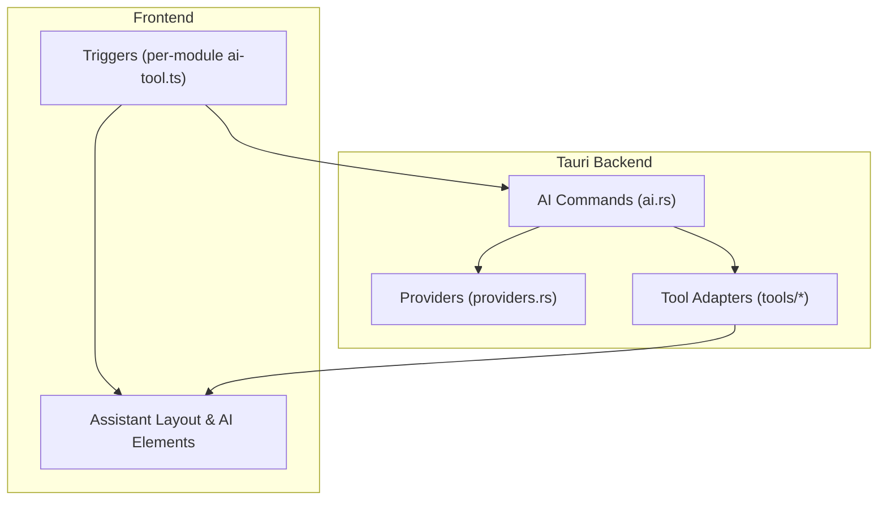
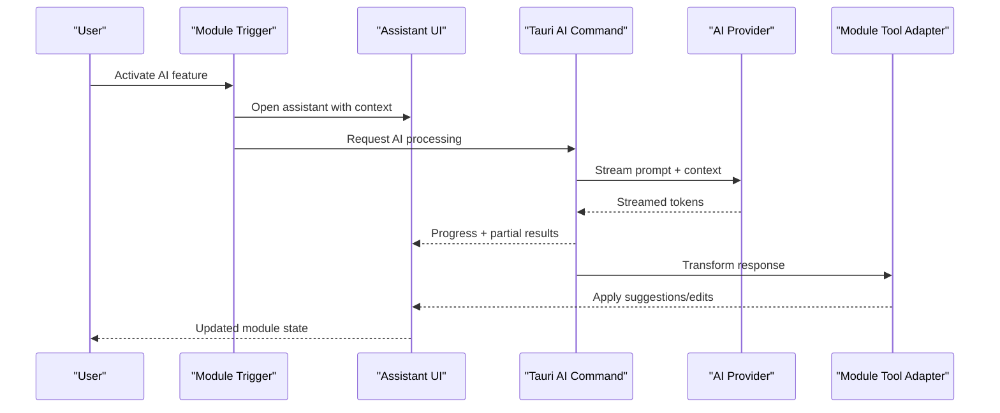
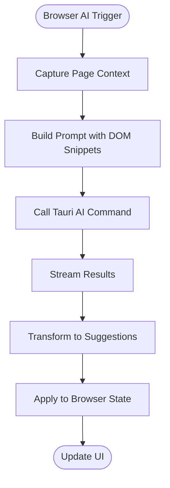
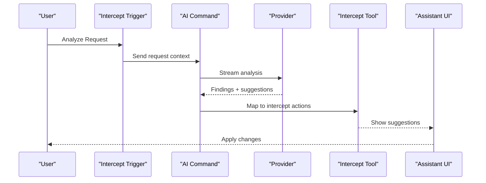
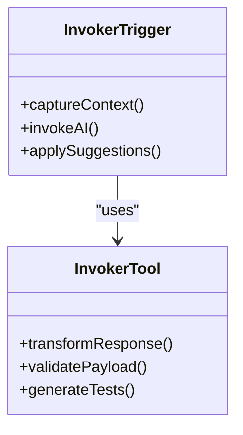
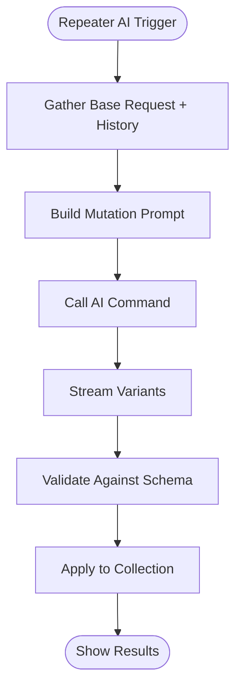
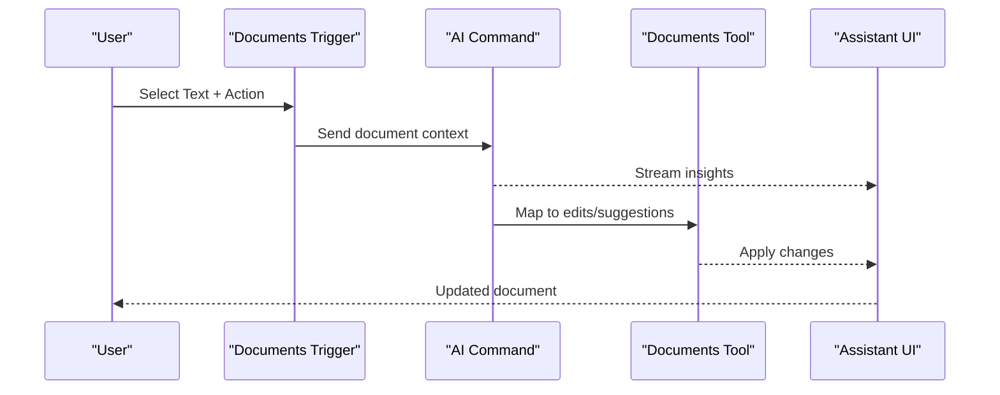
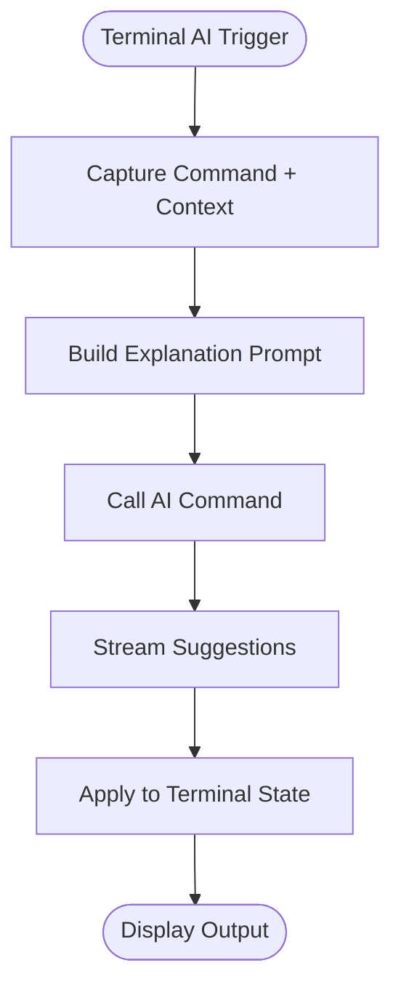

# AI Tools Across Modules

<cite>
**Referenced Files in This Document**
- [src/triggers/index.ts](file://src/triggers/index.ts)
- [src/triggers/browser/ai-tool.ts](file://src/triggers/browser/ai-tool.ts)
- [src/triggers/documents/ai-tool.ts](file://src/triggers/documents/ai-tool.ts)
- [src/triggers/intercept/ai-tool.ts](file://src/triggers/intercept/ai-tool.ts)
- [src/triggers/invoker/ai-tool.ts](file://src/triggers/invoker/ai-tool.ts)
- [src/triggers/repeater/ai-tool.ts](file://src/triggers/repeater/ai-tool.ts)
- [src/triggers/terminal/ai-tool.ts](file://src/triggers/terminal/ai-tool.ts)
- [src/components/ai-elements/agent.tsx](file://src/components/ai-elements/agent.tsx)
- [src/components/ai-elements/conversation.tsx](file://src/components/ai-elements/conversation.tsx)
- [src/components/ai-elements/tool.tsx](file://src/components/ai-elements/tool.tsx)
- [src/layout/assistant/index.tsx](file://src/layout/assistant/index.tsx)
- [src-tauri/src/ai/mod.rs](file://src-tauri/src/ai/mod.rs)
- [src-tauri/src/ai/providers.rs](file://src-tauri/src/ai/providers.rs)
- [src-tauri/src/commands/ai.rs](file://src-tauri/src/commands/ai.rs)
- [src-tauri/src/tools/mod.rs](file://src-tauri/src/tools/mod.rs)
- [src-tauri/src/tools/browser.rs](file://src-tauri/src/tools/browser.rs)
- [src-tauri/src/tools/intercept.rs](file://src-tauri/src/tools/intercept.rs)
- [src-tauri/src/tools/invoker.rs](file://src-tauri/src/tools/invoker.rs)
- [src-tauri/src/tools/repeater.rs](file://src-tauri/src/tools/repeater.rs)
- [src-tauri/src/tools/terminal.rs](file://src-tauri/src/tools/terminal.rs)
- [src-tauri/src/tools/documents.rs](file://src-tauri/src/tools/documents.rs)
</cite>

## Table of Contents
1. [Introduction](#introduction)
2. [Project Structure](#project-structure)
3. [Core Components](#core-components)
4. [Architecture Overview](#architecture-overview)
5. [Detailed Component Analysis](#detailed-component-analysis)
6. [Dependency Analysis](#dependency-analysis)
7. [Performance Considerations](#performance-considerations)
8. [Troubleshooting Guide](#troubleshooting-guide)
9. [Conclusion](#conclusion)
10. [Appendices](#appendices)

## Introduction
This document explains how Apprecon integrates AI capabilities across its modules, including browser inspection, API testing, request interception, document analysis, and security scanning tools. It covers the trigger system that activates AI assistance per module, how context is passed to AI services, and how responses are handled back into the UI and tool state. It also provides examples of AI-powered features such as intelligent payload generation, vulnerability detection suggestions, code analysis recommendations, and automated test case creation, along with guidance on module-specific prompts and customization options.

## Project Structure
Apprecon’s AI integration spans three layers:
- Frontend triggers and UI components: Each module exposes an ai-tool trigger file that defines when and how AI is invoked, what context is captured, and how results are applied. The assistant layout and AI elements provide a consistent chat and tooling experience.
- Tauri backend commands and providers: Rust commands expose AI operations to the frontend, while providers manage model selection, configuration, and streaming responses.
- Tool adapters: Module-specific tool adapters translate between Apprecon’s internal data models and AI payloads/responses.

**Diagram sources**
- [src/triggers/index.ts](file://src/triggers/index.ts)
- [src/layout/assistant/index.tsx](file://src/layout/assistant/index.tsx)
- [src-tauri/src/commands/ai.rs](file://src-tauri/src/commands/ai.rs)
- [src-tauri/src/ai/providers.rs](file://src-tauri/src/ai/providers.rs)
- [src-tauri/src/tools/mod.rs](file://src-tauri/src/tools/mod.rs)

**Section sources**
- [src/triggers/index.ts](file://src/triggers/index.ts)
- [src/layout/assistant/index.tsx](file://src/layout/assistant/index.tsx)
- [src-tauri/src/commands/ai.rs](file://src-tauri/src/commands/ai.rs)
- [src-tauri/src/ai/providers.rs](file://src-tauri/src/ai/providers.rs)
- [src-tauri/src/tools/mod.rs](file://src-tauri/src/tools/mod.rs)

## Core Components
- Trigger system: Per-module ai-tool files define activation conditions, context capture, and result application. They register actions like “Generate,” “Analyze,” or “Suggest” and pass structured context to the backend.
- Assistant UI: A unified chat interface renders messages, tool invocations, and artifacts. It supports streaming updates and contextual attachments.
- AI commands: Tauri commands orchestrate provider calls, handle authentication/config, and stream responses back to the frontend.
- Providers: Abstraction over different AI models/services, handling rate limits, retries, and response parsing.
- Tool adapters: Convert module-specific data (requests, documents, browser state) into AI-friendly payloads and map AI outputs back to actionable changes.

Key responsibilities:
- Context passing: Triggers serialize relevant state (e.g., current request, selected text, page metadata) into a stable schema for AI consumption.
- Response handling: Responses are streamed and transformed into UI artifacts (suggestions, edits, payloads), then committed via module APIs.
- Customization: Module-level prompts and behaviors can be tuned through settings and trigger configurations.

**Section sources**
- [src/triggers/browser/ai-tool.ts](file://src/triggers/browser/ai-tool.ts)
- [src/triggers/documents/ai-tool.ts](file://src/triggers/documents/ai-tool.ts)
- [src/triggers/intercept/ai-tool.ts](file://src/triggers/intercept/ai-tool.ts)
- [src/triggers/invoker/ai-tool.ts](file://src/triggers/invoker/ai-tool.ts)
- [src/triggers/repeater/ai-tool.ts](file://src/triggers/repeater/ai-tool.ts)
- [src/triggers/terminal/ai-tool.ts](file://src/triggers/terminal/ai-tool.ts)
- [src/components/ai-elements/conversation.tsx](file://src/components/ai-elements/conversation.tsx)
- [src-tauri/src/commands/ai.rs](file://src-tauri/src/commands/ai.rs)
- [src-tauri/src/ai/providers.rs](file://src-tauri/src/ai/providers.rs)

## Architecture Overview
The AI flow follows a consistent pattern across modules:
1. User action triggers a module-specific ai-tool handler.
2. Handler captures context and invokes a Tauri AI command.
3. Command selects a provider and streams the AI response.
4. Tool adapter transforms the response into module-specific actions.
5. Assistant UI displays progress and commits changes to module state.

**Diagram sources**
- [src/triggers/index.ts](file://src/triggers/index.ts)
- [src/components/ai-elements/conversation.tsx](file://src/components/ai-elements/conversation.tsx)
- [src-tauri/src/commands/ai.rs](file://src-tauri/src/commands/ai.rs)
- [src-tauri/src/ai/providers.rs](file://src-tauri/src/ai/providers.rs)
- [src-tauri/src/tools/mod.rs](file://src-tauri/src/tools/mod.rs)

## Detailed Component Analysis

### Browser Inspection AI
- Purpose: Assist with analyzing web pages, generating selectors, suggesting improvements, and creating automation scripts.
- Trigger: Activated from browser panel actions (e.g., “Analyze Page,” “Generate Script”).
- Context: Current URL, DOM snapshot snippets, network activity, and user selections.
- Features: Intelligent payload generation for form interactions, vulnerability hints based on observed patterns, and automated test case scaffolding.
- Customization: Prompt templates for selector generation, script style preferences, and sensitivity thresholds.

**Diagram sources**
- [src/triggers/browser/ai-tool.ts](file://src/triggers/browser/ai-tool.ts)
- [src-tauri/src/tools/browser.rs](file://src-tauri/src/tools/browser.rs)

**Section sources**
- [src/triggers/browser/ai-tool.ts](file://src/triggers/browser/ai-tool.ts)
- [src-tauri/src/tools/browser.rs](file://src-tauri/src/tools/browser.rs)

### Intercept AI
- Purpose: Enhance request/response inspection by suggesting modifications, detecting anomalies, and proposing mitigations.
- Trigger: Available when viewing intercepted requests or during live traffic analysis.
- Context: Full HTTP message, headers, cookies, body content, and timing metrics.
- Features: Vulnerability detection suggestions, header normalization, payload fuzzing ideas, and response classification.
- Customization: Rule sets for anomaly detection, severity thresholds, and output formats.

**Diagram sources**
- [src/triggers/intercept/ai-tool.ts](file://src/triggers/intercept/ai-tool.ts)
- [src-tauri/src/tools/intercept.rs](file://src-tauri/src/tools/intercept.rs)

**Section sources**
- [src/triggers/intercept/ai-tool.ts](file://src/triggers/intercept/ai-tool.ts)
- [src-tauri/src/tools/intercept.rs](file://src-tauri/src/tools/intercept.rs)

### Invoker AI
- Purpose: Aid in crafting and sending API requests with intelligent defaults and validation.
- Trigger: Invoked from the invoker panel for request generation, parameter suggestion, and error diagnosis.
- Context: Endpoint definition, sample payloads, environment variables, and historical responses.
- Features: Automated test case creation, parameter inference, and response schema validation.
- Customization: Templates for common frameworks, auth strategies, and assertion styles.

**Diagram sources**
- [src/triggers/invoker/ai-tool.ts](file://src/triggers/invoker/ai-tool.ts)
- [src-tauri/src/tools/invoker.rs](file://src-tauri/src/tools/invoker.rs)

**Section sources**
- [src/triggers/invoker/ai-tool.ts](file://src/triggers/invoker/ai-tool.ts)
- [src-tauri/src/tools/invoker.rs](file://src-tauri/src/tools/invoker.rs)

### Repeater AI
- Purpose: Optimize repetitive API testing with smart payload variations and regression checks.
- Trigger: Accessible from repeater actions like “Generate Variants” or “Check Regression.”
- Context: Base request, previous responses, and collection metadata.
- Features: Intelligent payload mutation, diff-based regression detection, and batch test generation.
- Customization: Mutation rules, coverage targets, and reporting preferences.

**Diagram sources**
- [src/triggers/repeater/ai-tool.ts](file://src/triggers/repeater/ai-tool.ts)
- [src-tauri/src/tools/repeater.rs](file://src-tauri/src/tools/repeater.rs)

**Section sources**
- [src/triggers/repeater/ai-tool.ts](file://src/triggers/repeater/ai-tool.ts)
- [src-tauri/src/tools/repeater.rs](file://src-tauri/src/tools/repeater.rs)

### Documents AI
- Purpose: Assist with analyzing and editing documentation, extracting schemas, and generating summaries.
- Trigger: Available in document editor panels for “Summarize,” “Extract Schema,” or “Improve.”
- Context: Selected text, document structure, and metadata.
- Features: Code analysis recommendations, schema extraction, and consistency checks.
- Customization: Output formats, emphasis areas, and style guides.

**Diagram sources**
- [src/triggers/documents/ai-tool.ts](file://src/triggers/documents/ai-tool.ts)
- [src-tauri/src/tools/documents.rs](file://src-tauri/src/tools/documents.rs)

**Section sources**
- [src/triggers/documents/ai-tool.ts](file://src/triggers/documents/ai-tool.ts)
- [src-tauri/src/tools/documents.rs](file://src-tauri/src/tools/documents.rs)

### Terminal AI
- Purpose: Provide intelligent command suggestions, explanations, and safe execution helpers.
- Trigger: Accessed from terminal input for “Explain,” “Suggest,” or “Fix.”
- Context: Command history, current working directory, and environment variables.
- Features: Command translation, error resolution, and safety checks.
- Customization: Shell profiles, allowed commands, and verbosity levels.

**Diagram sources**
- [src/triggers/terminal/ai-tool.ts](file://src/triggers/terminal/ai-tool.ts)
- [src-tauri/src/tools/terminal.rs](file://src-tauri/src/tools/terminal.rs)

**Section sources**
- [src/triggers/terminal/ai-tool.ts](file://src/triggers/terminal/ai-tool.ts)
- [src-tauri/src/tools/terminal.rs](file://src/t