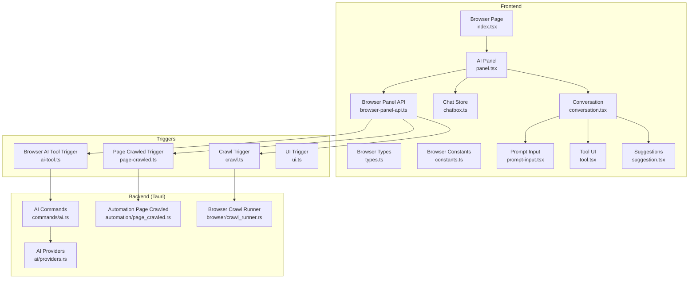
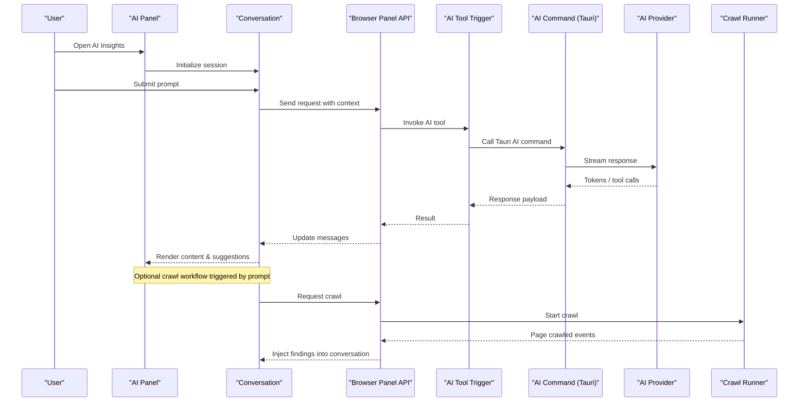
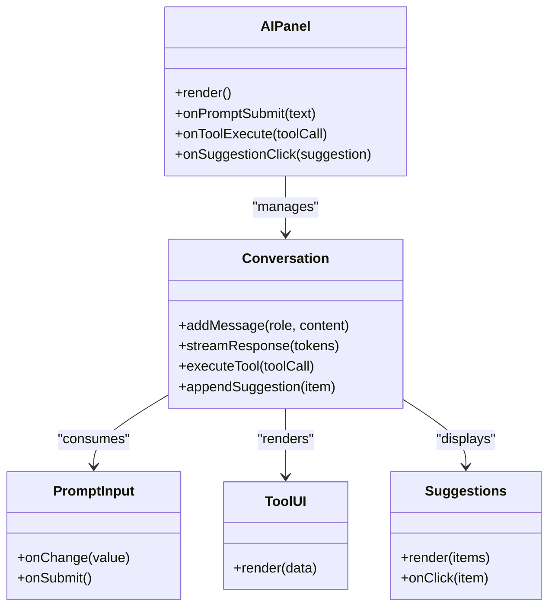
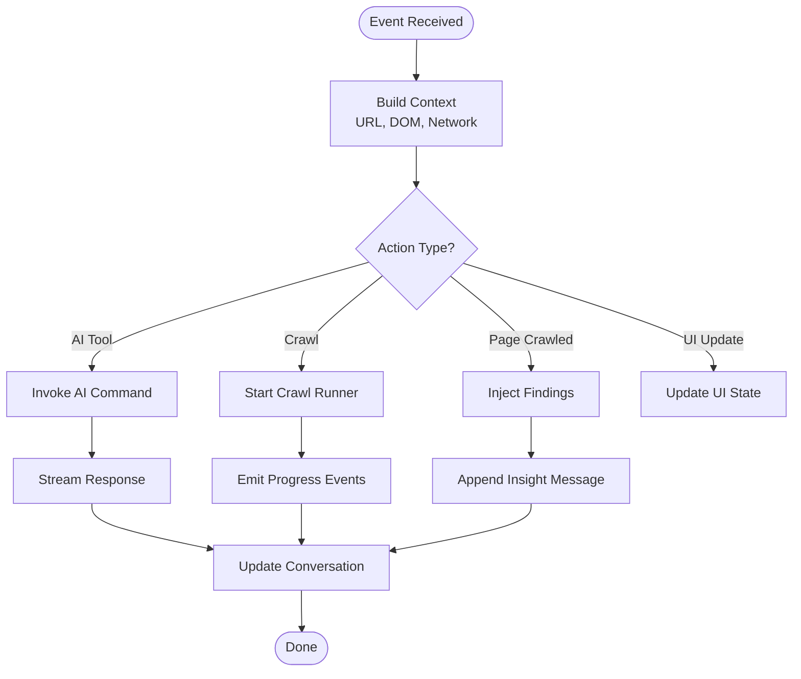
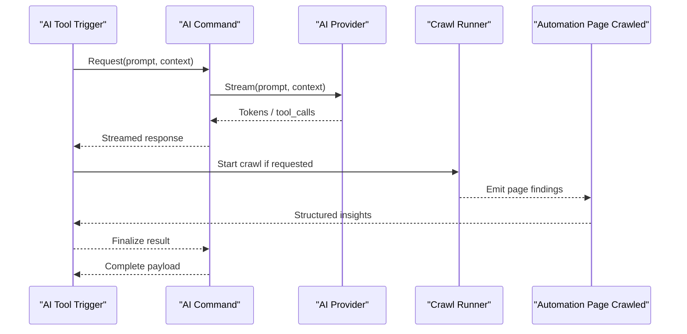
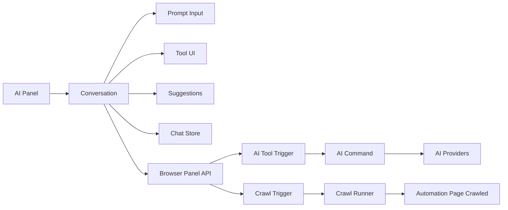

# Browser AI Integration

<cite>
**Referenced Files in This Document**
- [browser/index.tsx](file://src/pages/browser/index.tsx)
- [browser/types.ts](file://src/pages/browser/types.ts)
- [browser/constants.ts](file://src/pages/browser/constants.ts)
- [triggers/browser/ai-tool.ts](file://src/triggers/browser/ai-tool.ts)
- [triggers/browser/crawl.ts](file://src/triggers/browser/crawl.ts)
- [triggers/browser/page-crawled.ts](file://src/triggers/browser/page-crawled.ts)
- [triggers/browser/ui.ts](file://src/triggers/browser/ui.ts)
- [components/ai-elements/panel.tsx](file://src/components/ai-elements/panel.tsx)
- [components/ai-elements/conversation.tsx](file://src/components/ai-elements/conversation.tsx)
- [components/ai-elements/prompt-input.tsx](file://src/components/ai-elements/prompt-input.tsx)
- [components/ai-elements/tool.tsx](file://src/components/ai-elements/tool.tsx)
- [components/ai-elements/suggestion.tsx](file://src/components/ai-elements/suggestion.tsx)
- [stores/chatbox.ts](file://src/stores/chatbox.ts)
- [lib/browser-panel-api.ts](file://src/lib/browser-panel-api.ts)
- [src-tauri/src/commands/ai.rs](file://src-tauri/src/commands/ai.rs)
- [src-tauri/src/ai/mod.rs](file://src-tauri/src/ai/mod.rs)
- [src-tauri/src/ai/providers.rs](file://src-tauri/src/ai/providers.rs)
- [src-tauri/src/automation/page_crawled.rs](file://src-tauri/src/automation/page_crawled.rs)
- [src-tauri/src/browser/crawl_runner.rs](file://src-tauri/src/browser/crawl_runner.rs)
</cite>

## Table of Contents
1. [Introduction](#introduction)
2. [Project Structure](#project-structure)
3. [Core Components](#core-components)
4. [Architecture Overview](#architecture-overview)
5. [Detailed Component Analysis](#detailed-component-analysis)
6. [Dependency Analysis](#dependency-analysis)
7. [Performance Considerations](#performance-considerations)
8. [Troubleshooting Guide](#troubleshooting-guide)
9. [Conclusion](#conclusion)

## Introduction
This document explains how the Browser module integrates AI to assist with page analysis, accessibility testing, API discovery, and crawl optimization. It covers the AI insights panel, automated vulnerability detection suggestions, intelligent navigation recommendations, and the mechanisms for passing context from browser events to AI tools and handling responses. Examples include DOM analysis assistance, security scanning prompts, and performance optimization suggestions.

## Project Structure
The Browser AI integration spans frontend components, trigger handlers, and backend commands:
- Frontend UI: AI elements (panel, conversation, prompt input, tool, suggestion)
- Browser triggers: AI tool invocation, crawl orchestration, page-crawled events, and UI hooks
- Stores and APIs: Chat state and browser panel API for event bridging
- Backend Tauri: AI command handler, providers, and automation crawlers

**Diagram sources**
- [browser/index.tsx](file://src/pages/browser/index.tsx)
- [components/ai-elements/panel.tsx](file://src/components/ai-elements/panel.tsx)
- [components/ai-elements/conversation.tsx](file://src/components/ai-elements/conversation.tsx)
- [components/ai-elements/prompt-input.tsx](file://src/components/ai-elements/prompt-input.tsx)
- [components/ai-elements/tool.tsx](file://src/components/ai-elements/tool.tsx)
- [components/ai-elements/suggestion.tsx](file://src/components/ai-elements/suggestion.tsx)
- [stores/chatbox.ts](file://src/stores/chatbox.ts)
- [lib/browser-panel-api.ts](file://src/lib/browser-panel-api.ts)
- [triggers/browser/ai-tool.ts](file://src/triggers/browser/ai-tool.ts)
- [triggers/browser/crawl.ts](file://src/triggers/browser/crawl.ts)
- [triggers/browser/page-crawled.ts](file://src/triggers/browser/page-crawled.ts)
- [src-tauri/src/commands/ai.rs](file://src-tauri/src/commands/ai.rs)
- [src-tauri/src/ai/providers.rs](file://src-tauri/src/ai/providers.rs)
- [src-tauri/src/automation/page_crawled.rs](file://src-tauri/src/automation/page_crawled.rs)
- [src-tauri/src/browser/crawl_runner.rs](file://src-tauri/src/browser/crawl_runner.rs)

**Section sources**
- [browser/index.tsx](file://src/pages/browser/index.tsx)
- [components/ai-elements/panel.tsx](file://src/components/ai-elements/panel.tsx)
- [components/ai-elements/conversation.tsx](file://src/components/ai-elements/conversation.tsx)
- [components/ai-elements/prompt-input.tsx](file://src/components/ai-elements/prompt-input.tsx)
- [components/ai-elements/tool.tsx](file://src/components/ai-elements/tool.tsx)
- [components/ai-elements/suggestion.tsx](file://src/components/ai-elements/suggestion.tsx)
- [stores/chatbox.ts](file://src/stores/chatbox.ts)
- [lib/browser-panel-api.ts](file://src/lib/browser-panel-api.ts)
- [triggers/browser/ai-tool.ts](file://src/triggers/browser/ai-tool.ts)
- [triggers/browser/crawl.ts](file://src/triggers/browser/crawl.ts)
- [triggers/browser/page-crawled.ts](file://src/triggers/browser/page-crawled.ts)
- [src-tauri/src/commands/ai.rs](file://src-tauri/src/commands/ai.rs)
- [src-tauri/src/ai/providers.rs](file://src-tauri/src/ai/providers.rs)
- [src-tauri/src/automation/page_crawled.rs](file://src-tauri/src/automation/page_crawled.rs)
- [src-tauri/src/browser/crawl_runner.rs](file://src-tauri/src/browser/crawl_runner.rs)

## Core Components
- AI Insights Panel: Central UI for AI interactions within the Browser tab, displaying conversations, tool outputs, and suggestions.
- Conversation Engine: Manages message history, streaming responses, and tool execution results.
- Prompt Input: Accepts user queries and contextual hints; supports quick actions like “Analyze DOM,” “Scan for vulnerabilities,” and “Optimize performance.”
- Tool UI: Renders structured outputs from AI tools (e.g., findings, diffs, recommendations).
- Suggestions: Context-aware recommendations surfaced by AI based on current page state and crawl data.
- Chat Store: Persists chat sessions and coordinates updates across components.
- Browser Panel API: Bridges browser events to triggers and invokes AI tools or crawl workflows.

Examples of AI-powered features:
- DOM analysis assistance: Summarizes structure, identifies heavy nodes, suggests optimizations.
- Security scanning prompts: Detects potential XSS, CSRF misconfigurations, insecure cookies, and CSP issues.
- Performance optimization suggestions: Highlights render-blocking resources, large assets, and layout thrashing patterns.

**Section sources**
- [components/ai-elements/panel.tsx](file://src/components/ai-elements/panel.tsx)
- [components/ai-elements/conversation.tsx](file://src/components/ai-elements/conversation.tsx)
- [components/ai-elements/prompt-input.tsx](file://src/components/ai-elements/prompt-input.tsx)
- [components/ai-elements/tool.tsx](file://src/components/ai-elements/tool.tsx)
- [components/ai-elements/suggestion.tsx](file://src/components/ai-elements/suggestion.tsx)
- [stores/chatbox.ts](file://src/stores/chatbox.ts)
- [lib/browser-panel-api.ts](file://src/lib/browser-panel-api.ts)

## Architecture Overview
The Browser AI architecture connects user prompts to AI services via Tauri commands, while leveraging browser events to enrich context. Crawl workflows are orchestrated through triggers that call into the backend crawler runner. Responses stream back to the conversation UI as text, tool outputs, and suggestions.

**Diagram sources**
- [components/ai-elements/panel.tsx](file://src/components/ai-elements/panel.tsx)
- [components/ai-elements/conversation.tsx](file://src/components/ai-elements/conversation.tsx)
- [lib/browser-panel-api.ts](file://src/lib/browser-panel-api.ts)
- [triggers/browser/ai-tool.ts](file://src/triggers/browser/ai-tool.ts)
- [src-tauri/src/commands/ai.rs](file://src-tauri/src/commands/ai.rs)
- [src-tauri/src/ai/providers.rs](file://src-tauri/src/ai/providers.rs)
- [src-tauri/src/browser/crawl_runner.rs](file://src-tauri/src/browser/crawl_runner.rs)

## Detailed Component Analysis

### AI Insights Panel
- Responsibilities: Hosts conversation, renders tool outputs, manages suggestions, and exposes quick actions.
- Behavior: Initializes a chat session, subscribes to store updates, and forwards user inputs to the conversation engine.
- Integration: Uses the Browser Panel API to invoke AI tools and crawl workflows.

**Diagram sources**
- [components/ai-elements/panel.tsx](file://src/components/ai-elements/panel.tsx)
- [components/ai-elements/conversation.tsx](file://src/components/ai-elements/conversation.tsx)
- [components/ai-elements/prompt-input.tsx](file://src/components/ai-elements/prompt-input.tsx)
- [components/ai-elements/tool.tsx](file://src/components/ai-elements/tool.tsx)
- [components/ai-elements/suggestion.tsx](file://src/components/ai-elements/suggestion.tsx)

**Section sources**
- [components/ai-elements/panel.tsx](file://src/components/ai-elements/panel.tsx)
- [components/ai-elements/conversation.tsx](file://src/components/ai-elements/conversation.tsx)
- [components/ai-elements/prompt-input.tsx](file://src/components/ai-elements/prompt-input.tsx)
- [components/ai-elements/tool.tsx](file://src/components/ai-elements/tool.tsx)
- [components/ai-elements/suggestion.tsx](file://src/components/ai-elements/suggestion.tsx)

### Triggers and Context Passing
- AI Tool Trigger: Receives requests from the Browser Panel API, constructs context (URL, DOM snapshot, network events), and calls the Tauri AI command.
- Crawl Trigger: Starts or resumes crawling based on user intent or scheduled tasks; emits progress and results.
- Page Crawled Trigger: Handles page-level findings and injects them into the conversation as actionable insights.
- UI Trigger: Updates UI states, such as enabling/disabling controls and showing status indicators.

**Diagram sources**
- [triggers/browser/ai-tool.ts](file://src/triggers/browser/ai-tool.ts)
- [triggers/browser/crawl.ts](file://src/triggers/browser/crawl.ts)
- [triggers/browser/page-crawled.ts](file://src/triggers/browser/page-crawled.ts)
- [triggers/browser/ui.ts](file://src/triggers/browser/ui.ts)
- [lib/browser-panel-api.ts](file://src/lib/browser-panel-api.ts)

**Section sources**
- [triggers/browser/ai-tool.ts](file://src/triggers/browser/ai-tool.ts)
- [triggers/browser/crawl.ts](file://src/triggers/browser/crawl.ts)
- [triggers/browser/page-crawled.ts](file://src/triggers/browser/page-crawled.ts)
- [triggers/browser/ui.ts](file://src/triggers/browser/ui.ts)
- [lib/browser-panel-api.ts](file://src/lib/browser-panel-api.ts)

### Backend AI Command Flow
- Tauri AI Command: Validates input, selects provider, streams tokens, and returns structured tool calls when applicable.
- AI Providers: Abstracts different AI service integrations and normalizes responses.
- Automation Page Crawled: Emits structured findings for pages discovered during crawling.
- Browser Crawl Runner: Orchestrates navigation, captures events, and aggregates results.

**Diagram sources**
- [src-tauri/src/commands/ai.rs](file://src-tauri/src/commands/ai.rs)
- [src-tauri/src/ai/providers.rs](file://src-tauri/src/ai/providers.rs)
- [src-tauri/src/automation/page_crawled.rs](file://src-tauri/src/automation/page_crawled.rs)
- [src-tauri/src/browser/crawl_runner.rs](file://src-tauri/src/browser/crawl_runner.rs)

**Section sources**
- [src-tauri/src/commands/ai.rs](file://src-tauri/src/commands/ai.rs)
- [src-tauri/src/ai/providers.rs](file://src-tauri/src/ai/providers.rs)
- [src-tauri/src/automation/page_crawled.rs](file://src-tauri/src/automation/page_crawled.rs)
- [src-tauri/src/browser/crawl_runner.rs](file://src-tauri/src/browser/crawl_runner.rs)

### AI-Powered Features Examples
- DOM Analysis Assistance:
  - Context: Current URL, DOM snapshot, computed styles, and event listeners.
  - Output: Summary of node hierarchy, heavy elements, and optimization tips.
- Security Scanning Prompts:
  - Context: Network requests, headers, cookies, and CSP policies.
  - Output: Vulnerability suggestions (XSS, CSRF, insecure cookies), remediation steps.
- Performance Optimization Suggestions:
  - Context: Resource load times, render blocking scripts, and layout metrics.
  - Output: Recommendations to reduce bundle size, defer non-critical JS, and optimize images.

These examples are surfaced via the Conversation component’s rendering of tool outputs and suggestions.

**Section sources**
- [components/ai-elements/conversation.tsx](file://src/components/ai-elements/conversation.tsx)
- [components/ai-elements/tool.tsx](file://src/components/ai-elements/tool.tsx)
- [components/ai-elements/suggestion.tsx](file://src/components/ai-elements/suggestion.tsx)

## Dependency Analysis
- Frontend dependencies:
  - AI Panel depends on Conversation, Prompt Input, Tool UI, and Suggestions.
  - Conversation depends on Chat Store for persistence and Browser Panel API for external calls.
- Trigger dependencies:
  - AI Tool Trigger depends on Browser Panel API and Tauri AI Command.
  - Crawl Trigger depends on Crawl Runner and Automation Page Crawled events.
- Backend dependencies:
  - AI Command depends on AI Providers and validates inputs.
  - Crawl Runner orchestrates automation and emits structured findings.

**Diagram sources**
- [components/ai-elements/panel.tsx](file://src/components/ai-elements/panel.tsx)
- [components/ai-elements/conversation.tsx](file://src/components/ai-elements/conversation.tsx)
- [components/ai-elements/prompt-input.tsx](file://src/components/ai-elements/prompt-input.tsx)
- [components/ai-elements/tool.tsx](file://src/components/ai-elements/tool.tsx)
- [components/ai-elements/suggestion.tsx](file://src/components/ai-elements/suggestion.tsx)
- [stores/chatbox.ts](file://src/stores/chatbox.ts)
- [lib/browser-panel-api.ts](file://src/lib/browser-panel-api.ts)
- [triggers/browser/ai-tool.ts](file://src/triggers/browser/ai-tool.ts)
- [triggers/browser/crawl.ts](file://src/triggers/browser/crawl.ts)
- [src-tauri/src/commands/ai.rs](file://src-tauri/src/commands/ai.rs)
- [src-tauri/src/ai/providers.rs](file://src-tauri/src/ai/providers.rs)
- [src-tauri/src/automation/page_crawled.rs](file://src-tauri/src/automation/page_crawled.rs)
- [src-tauri/src/browser/crawl_runner.rs](file://src-tauri/src/browser/crawl_runner.rs)

**Section sources**
- [components/ai-elements/panel.tsx](file://src/components/ai-elements/panel.tsx)
- [components/ai-elements/conversation.tsx](file://src/components/ai-elements/conversation.tsx)
- [components/ai-elements/prompt-input.tsx](file://src/components/ai-elements/prompt-input.tsx)
- [components/ai-elements/tool.tsx](file://src/components/ai-elements/tool.tsx)
- [components/ai-elements/suggestion.tsx](file://src/components/ai-elements/suggestion.tsx)
- [stores/chatbox.ts](file://src/stores/chatbox.ts)
- [lib/browser-panel-api.ts](file://src/lib/browser-panel-api.ts)
- [triggers/browser/ai-tool.ts](file://src/triggers/browser/ai-tool.ts)
- [triggers/browser/crawl.ts](file://src/triggers/browser/crawl.ts)
- [src-tauri/src/commands/ai.rs](file://src-tauri/src/commands/ai.rs)
- [src-tauri/src/ai/providers.rs](file://src-tauri/src/ai/providers.rs)
- [src-tauri/src/automation/page_crawled.rs](file://src-tauri/src/automation/page_crawled.rs)
- [src-tauri/src/browser/crawl_runner.rs](file://src-tauri/src/browser/crawl_runner.rs)

## Performance Considerations
- Streaming responses: Use token streaming to reduce perceived latency and enable incremental rendering.
- Context size management: Limit DOM snapshots and network logs to relevant subsets to avoid oversized payloads.
- Debounce rapid events: Throttle frequent browser events before sending to AI tools to prevent overload.
- Crawl pacing: Implement rate limiting and concurrency controls in the crawl runner to balance speed and stability.
- UI responsiveness: Offload heavy computations to background processes and update UI incrementally.

[No sources needed since this section provides general guidance]

## Troubleshooting Guide
- No AI response:
  - Verify Tauri AI command availability and provider configuration.
  - Check network connectivity and authentication for AI providers.
- Empty or truncated context:
  - Ensure DOM snapshot and network logs are captured correctly before invoking AI tools.
  - Validate context serialization and size limits.
- Crawl not starting:
  - Confirm crawl trigger is invoked and permissions are granted.
  - Inspect crawl runner logs for errors and adjust concurrency settings.
- UI not updating:
  - Check Chat Store subscriptions and ensure messages are appended correctly.
  - Verify streaming callbacks update the conversation state.

**Section sources**
- [src-tauri/src/commands/ai.rs](file://src-tauri/src/commands/ai.rs)
- [src-tauri/src/ai/providers.rs](file://src-tauri/src/ai/providers.rs)
- [triggers/browser/ai-tool.ts](file://src/triggers/browser/ai-tool.ts)
- [triggers/browser/crawl.ts](file://src/triggers/browser/crawl.ts)
- [stores/chatbox.ts](file://src/stores/chatbox.ts)

## Conclusion
The Browser module’s AI integration delivers a cohesive experience where user prompts are enriched with live browser context, processed by robust backend services, and presented through an interactive insights panel. By combining AI-driven analysis, automated vulnerability detection, and intelligent navigation recommendations, developers can accelerate debugging, improve security posture, and optimize performance effectively.

[No sources needed since this section summarizes without analyzing specific files]