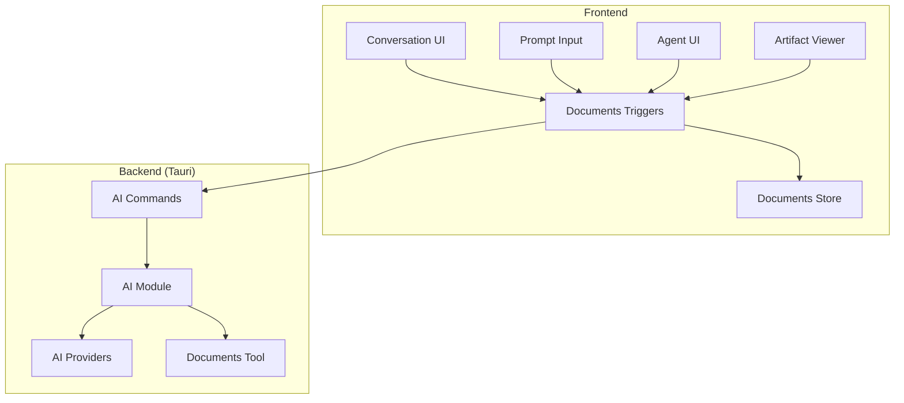
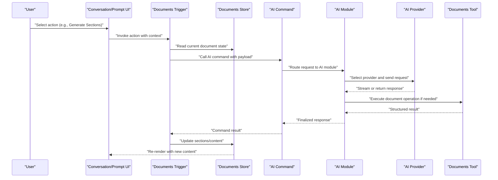
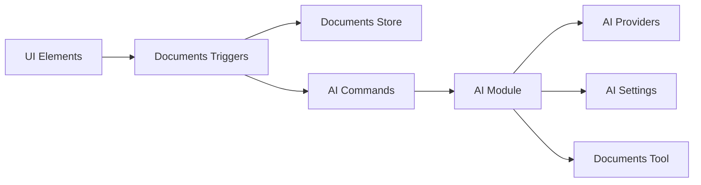

# Documents AI Integration

<cite>
**Referenced Files in This Document**
- [documents.ts](file://src/stores/documents.ts)
- [ai-tool.ts](file://src/triggers/documents/ai-tool.ts)
- [sections.ts](file://src/triggers/documents/sections.ts)
- [index.ts](file://src/triggers/documents/index.ts)
- [ai.rs](file://src-tauri/src/commands/ai.rs)
- [mod.rs](file://src-tauri/src/ai/mod.rs)
- [providers.rs](file://src-tauri/src/ai/providers.rs)
- [types.rs](file://src-tauri/src/ai/types.rs)
- [settings.rs](file://src-tauri/src/ai/settings.rs)
- [chat.rs](file://src-tauri/src/ai/chat.rs)
- [documents.rs](file://src-tauri/src/tools/documents.rs)
- [agent.tsx](file://src/components/ai-elements/agent.tsx)
- [artifact.tsx](file://src/components/ai-elements/artifact.tsx)
- [conversation.tsx](file://src/components/ai-elements/conversation.tsx)
- [prompt-input.tsx](file://src/components/ai-elements/prompt-input.tsx)
- [suggestion.tsx](file://src/components/ai-elements/suggestion.tsx)
</cite>

## Table of Contents
1. [Introduction](#introduction)
2. [Project Structure](#project-structure)
3. [Core Components](#core-components)
4. [Architecture Overview](#architecture-overview)
5. [Detailed Component Analysis](#detailed-component-analysis)
6. [Dependency Analysis](#dependency-analysis)
7. [Performance Considerations](#performance-considerations)
8. [Troubleshooting Guide](#troubleshooting-guide)
9. [Conclusion](#conclusion)

## Introduction
This document explains how the Documents module integrates AI to assist with document analysis, content generation, and structured data extraction. It covers automatic section generation, content summarization, template creation, intelligent suggestions, and format conversion assistance. The system provides context-aware responses based on document type and user requirements, enabling efficient workflows for creating, editing, and transforming documents.

## Project Structure
The Documents AI integration spans frontend components, triggers, stores, and backend services:
- Frontend UI elements render conversations, prompts, artifacts, and suggestions.
- Triggers connect user actions to AI capabilities.
- A store manages document state and AI interactions.
- Backend commands and AI modules handle provider configuration, chat sessions, and tooling.

**Diagram sources**
- [conversation.tsx](file://src/components/ai-elements/conversation.tsx)
- [prompt-input.tsx](file://src/components/ai-elements/prompt-input.tsx)
- [agent.tsx](file://src/components/ai-elements/agent.tsx)
- [artifact.tsx](file://src/components/ai-elements/artifact.tsx)
- [documents.ts](file://src/stores/documents.ts)
- [index.ts](file://src/triggers/documents/index.ts)
- [ai-tool.ts](file://src/triggers/documents/ai-tool.ts)
- [ai.rs](file://src-tauri/src/commands/ai.rs)
- [mod.rs](file://src-tauri/src/ai/mod.rs)
- [providers.rs](file://src-tauri/src/ai/providers.rs)
- [documents.rs](file://src-tauri/src/tools/documents.rs)

**Section sources**
- [documents.ts](file://src/stores/documents.ts)
- [index.ts](file://src/triggers/documents/index.ts)
- [ai-tool.ts](file://src/triggers/documents/ai-tool.ts)
- [ai.rs](file://src-tauri/src/commands/ai.rs)
- [mod.rs](file://src-tauri/src/ai/mod.rs)
- [providers.rs](file://src-tauri/src/ai/providers.rs)
- [documents.rs](file://src-tauri/src/tools/documents.rs)

## Core Components
- Documents Store: Holds document metadata, sections, and AI interaction history. It exposes methods to update content, manage sections, and persist changes.
- Documents Triggers: Expose actions such as “Generate Sections,” “Summarize,” “Create Template,” and “Convert Format.” They orchestrate calls to the AI backend and update the store.
- AI Commands (Backend): Provide Tauri commands that route requests to the AI module, select providers, and execute tools.
- AI Module: Manages provider selection, session management, and tool execution. It includes settings for API keys and model preferences.
- Documents Tool: Implements document-specific operations like parsing, section detection, summarization, and structured extraction.

Key responsibilities:
- Context-aware routing based on document type and user intent.
- Streaming or batched responses for long-running tasks.
- Error handling and retry strategies for provider failures.

**Section sources**
- [documents.ts](file://src/stores/documents.ts)
- [index.ts](file://src/triggers/documents/index.ts)
- [ai-tool.ts](file://src/triggers/documents/ai-tool.ts)
- [ai.rs](file://src-tauri/src/commands/ai.rs)
- [mod.rs](file://src-tauri/src/ai/mod.rs)
- [providers.rs](file://src-tauri/src/ai/providers.rs)
- [documents.rs](file://src-tauri/src/tools/documents.rs)

## Architecture Overview
The Documents AI architecture follows a layered approach:
- UI Layer: Renders conversation, prompt input, agent controls, and artifact previews.
- Trigger Layer: Maps user actions to AI operations and updates the store.
- Command Layer: Exposes Tauri commands for secure cross-process communication.
- AI Layer: Handles provider configuration, chat sessions, and tool execution.
- Tool Layer: Provides domain-specific functions for document processing.

**Diagram sources**
- [conversation.tsx](file://src/components/ai-elements/conversation.tsx)
- [prompt-input.tsx](file://src/components/ai-elements/prompt-input.tsx)
- [index.ts](file://src/triggers/documents/index.ts)
- [documents.ts](file://src/stores/documents.ts)
- [ai.rs](file://src-tauri/src/commands/ai.rs)
- [mod.rs](file://src-tauri/src/ai/mod.rs)
- [providers.rs](file://src-tauri/src/ai/providers.rs)
- [documents.rs](file://src-tauri/src/tools/documents.rs)

## Detailed Component Analysis

### Documents Store
Responsibilities:
- Maintain document structure, including sections and metadata.
- Manage AI interaction history and suggestions.
- Provide methods to apply generated content and persist changes.

Complexity considerations:
- Efficient diffing when applying large sections.
- Optimistic updates for responsive UI during streaming.

Error handling:
- Graceful fallbacks when AI responses are incomplete.
- Validation before applying changes to prevent corruption.

**Section sources**
- [documents.ts](file://src/stores/documents.ts)

### Documents Triggers
Responsibilities:
- Expose actions like “Generate Sections,” “Summarize,” “Create Template,” and “Convert Format.”
- Build payloads with document context, type, and user requirements.
- Update the store with results and errors.

Context awareness:
- Detect document type from metadata or content heuristics.
- Adjust prompts and parameters based on detected type and user goals.

**Section sources**
- [index.ts](file://src/triggers/documents/index.ts)
- [ai-tool.ts](file://src/triggers/documents/ai-tool.ts)

### AI Commands (Backend)
Responsibilities:
- Define Tauri commands for AI operations.
- Validate inputs and enforce security policies.
- Route requests to the AI module with appropriate parameters.

Integration points:
- Provider selection based on configuration.
- Tool invocation for document-specific tasks.

**Section sources**
- [ai.rs](file://src-tauri/src/commands/ai.rs)

### AI Module
Responsibilities:
- Manage provider configurations and credentials.
- Handle chat sessions and message flows.
- Execute tools and aggregate results.

Settings:
- Model selection, temperature, and output constraints.
- Fallback providers and retry policies.

**Section sources**
- [mod.rs](file://src-tauri/src/ai/mod.rs)
- [providers.rs](file://src-tauri/src/ai/providers.rs)
- [settings.rs](file://src-tauri/src/ai/settings.rs)
- [chat.rs](file://src-tauri/src/ai/chat.rs)

### Documents Tool
Responsibilities:
- Parse and analyze document content.
- Extract structured data (tables, lists, key-value pairs).
- Generate summaries and templates tailored to document type.

Algorithms:
- Section detection using semantic boundaries and headings.
- Summarization with length and focus controls.
- Format conversion preserving structure and semantics.

**Section sources**
- [documents.rs](file://src-tauri/src/tools/documents.rs)

### UI Elements
Responsibilities:
- Render conversations and prompts for AI interactions.
- Display artifacts (generated sections, tables, code blocks).
- Provide suggestions and inline edits.

Components:
- Conversation: Chat-like interface for iterative refinement.
- Prompt Input: Rich input with attachments and context.
- Agent: Controls for automated workflows.
- Artifact: Viewers for structured outputs.
- Suggestion: Inline recommendations and quick actions.

**Section sources**
- [conversation.tsx](file://src/components/ai-elements/conversation.tsx)
- [prompt-input.tsx](file://src/components/ai-elements/prompt-input.tsx)
- [agent.tsx](file://src/components/ai-elements/agent.tsx)
- [artifact.tsx](file://src/components/ai-elements/artifact.tsx)
- [suggestion.tsx](file://src/components/ai-elements/suggestion.tsx)

## Dependency Analysis
The Documents AI integration has clear dependencies between layers:
- UI depends on triggers for actions.
- Triggers depend on the store for state and commands for AI operations.
- Commands depend on the AI module for provider and tool execution.
- The AI module depends on providers and settings.
- The documents tool is invoked by the AI module for domain-specific tasks.

**Diagram sources**
- [conversation.tsx](file://src/components/ai-elements/conversation.tsx)
- [prompt-input.tsx](file://src/components/ai-elements/prompt-input.tsx)
- [agent.tsx](file://src/components/ai-elements/agent.tsx)
- [artifact.tsx](file://src/components/ai-elements/artifact.tsx)
- [suggestion.tsx](file://src/components/ai-elements/suggestion.tsx)
- [index.ts](file://src/triggers/documents/index.ts)
- [documents.ts](file://src/stores/documents.ts)
- [ai.rs](file://src-tauri/src/commands/ai.rs)
- [mod.rs](file://src-tauri/src/ai/mod.rs)
- [providers.rs](file://src-tauri/src/ai/providers.rs)
- [settings.rs](file://src-tauri/src/ai/settings.rs)
- [documents.rs](file://src-tauri/src/tools/documents.rs)

**Section sources**
- [index.ts](file://src/triggers/documents/index.ts)
- [documents.ts](file://src/stores/documents.ts)
- [ai.rs](file://src-tauri/src/commands/ai.rs)
- [mod.rs](file://src-tauri/src/ai/mod.rs)
- [providers.rs](file://src-tauri/src/ai/providers.rs)
- [settings.rs](file://src-tauri/src/ai/settings.rs)
- [documents.rs](file://src-tauri/src/tools/documents.rs)

## Performance Considerations
- Streaming responses: Prefer incremental updates for long-running tasks to keep UI responsive.
- Caching: Cache frequent AI results (summaries, templates) keyed by document hash and parameters.
- Batching: Group multiple document operations into single requests where possible.
- Memory management: Stream large content instead of loading entire files into memory.
- Provider selection: Choose faster providers for simple tasks and more capable models for complex analysis.

[No sources needed since this section provides general guidance]

## Troubleshooting Guide
Common issues and resolutions:
- Provider authentication failures: Verify API keys and endpoint configuration in settings.
- Incomplete sections: Check document parsing logic and ensure proper boundary detection.
- Slow responses: Reduce payload size, enable caching, or switch to a faster provider.
- Data corruption: Validate AI outputs before applying; use diffs and rollback mechanisms.
- Context mismatch: Ensure document type detection is accurate; adjust prompts accordingly.

Debugging steps:
- Inspect trigger payloads and store updates.
- Log AI command inputs and outputs.
- Review provider error messages and retry logs.
- Validate document tool outputs against expected schemas.

**Section sources**
- [settings.rs](file://src-tauri/src/ai/settings.rs)
- [chat.rs](file://src-tauri/src/ai/chat.rs)
- [documents.rs](file://src-tauri/src/tools/documents.rs)

## Conclusion
The Documents module’s AI integration provides powerful capabilities for analysis, generation, and extraction. By leveraging context-aware prompts, robust provider management, and specialized tools, it enables efficient workflows for section generation, summarization, template creation, and format conversion. Proper performance tuning and troubleshooting practices ensure reliable and responsive experiences.

[No sources needed since this section summarizes without analyzing specific files]