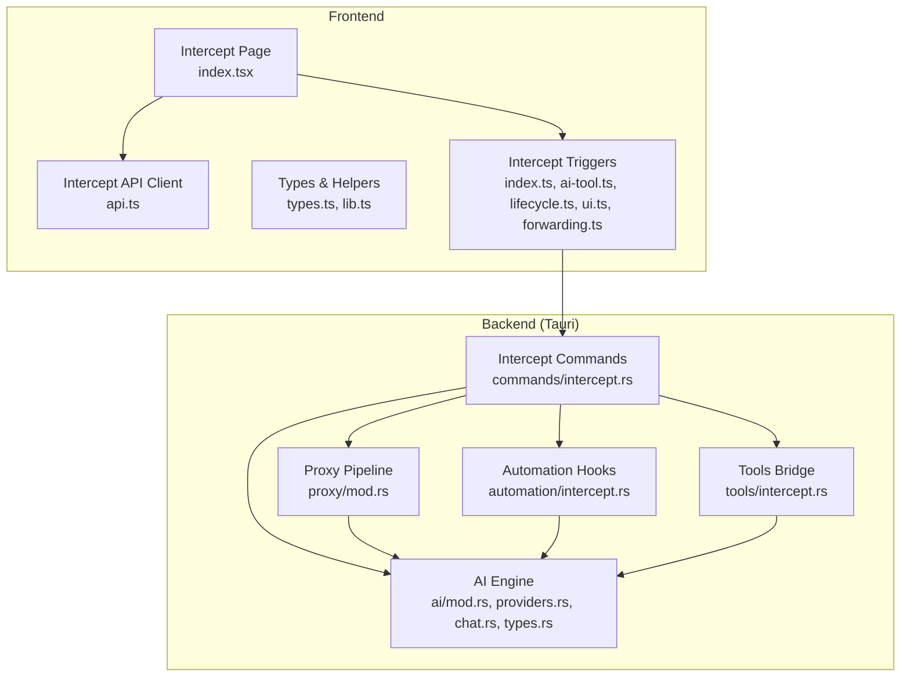
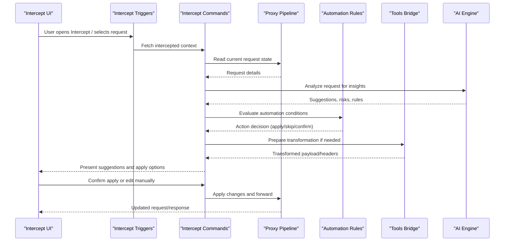
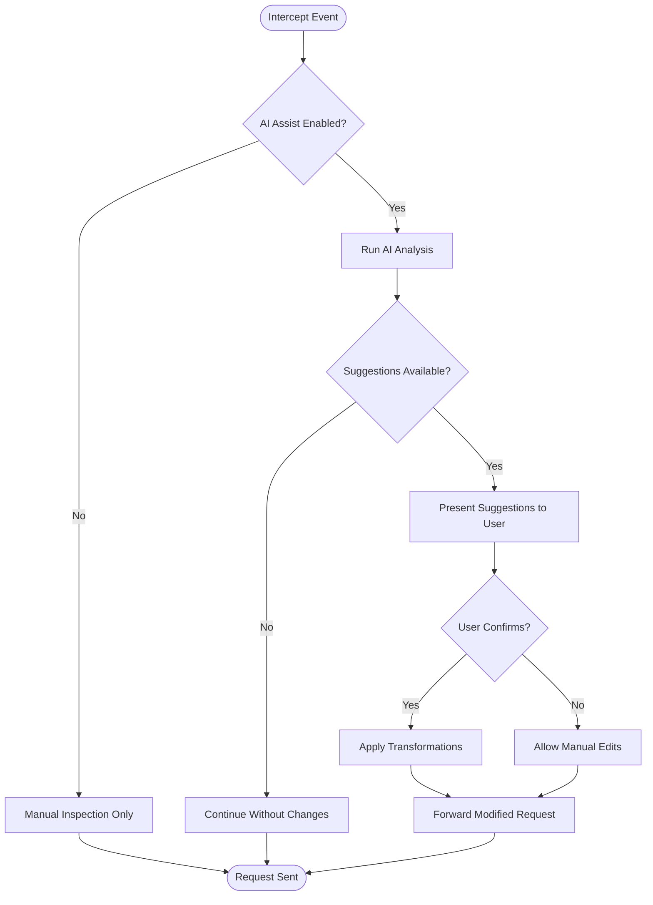
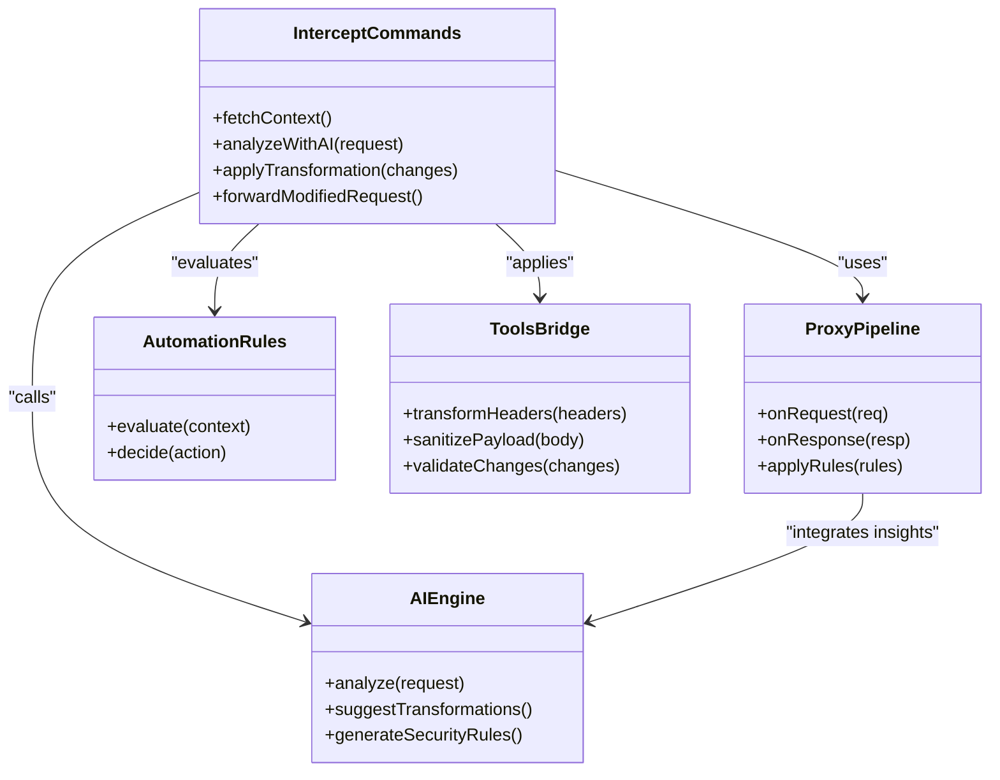
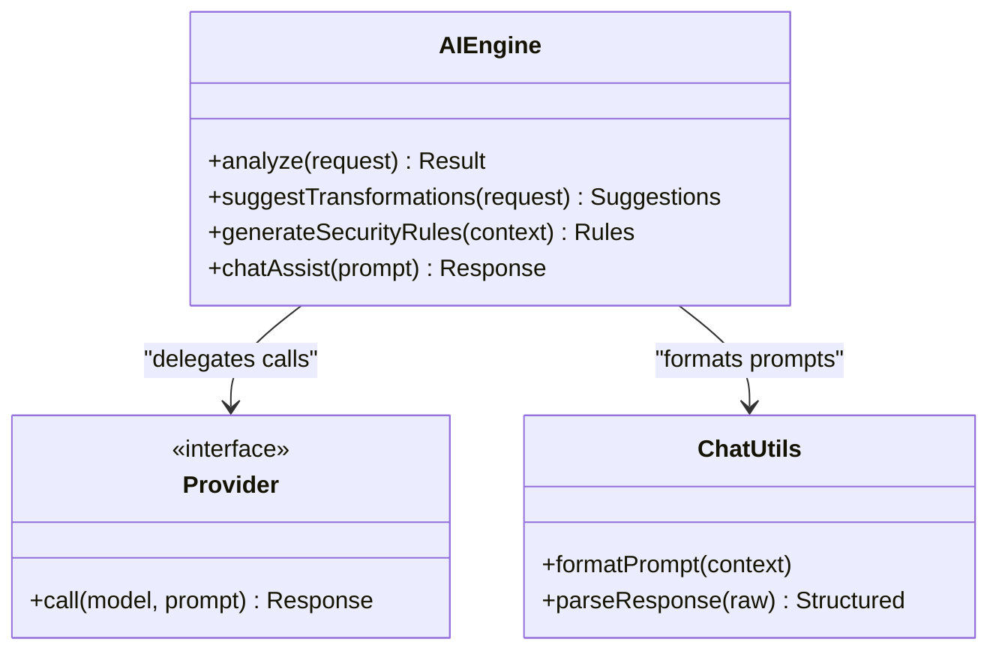
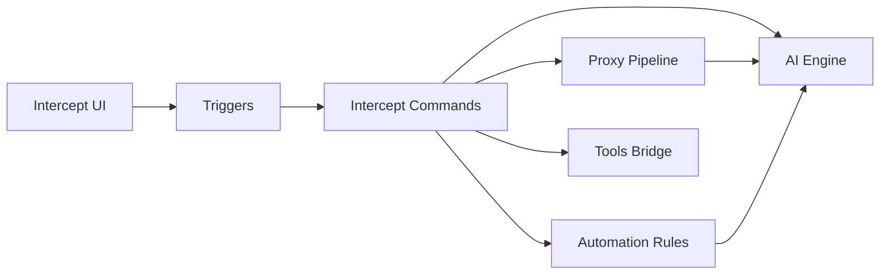

# Intercept AI Integration

<cite>
**Referenced Files in This Document**
- [intercept/index.tsx](file://src/pages/intercept/index.tsx)
- [intercept/api.ts](file://src/pages/intercept/api.ts)
- [intercept/types.ts](file://src/pages/intercept/types.ts)
- [intercept/lib.ts](file://src/pages/intercept/lib.ts)
- [triggers/intercept/index.ts](file://src/triggers/intercept/index.ts)
- [triggers/intercept/ai-tool.ts](file://src/triggers/intercept/ai-tool.ts)
- [triggers/intercept/lifecycle.ts](file://src/triggers/intercept/lifecycle.ts)
- [triggers/intercept/ui.ts](file://src/triggers/intercept/ui.ts)
- [triggers/intercept/forwarding.ts](file://src/triggers/intercept/forwarding.ts)
- [commands/intercept.rs](file://src-tauri/src/commands/intercept.rs)
- [proxy/mod.rs](file://src-tauri/src/proxy/mod.rs)
- [automation/intercept.rs](file://src-tauri/src/automation/intercept.rs)
- [tools/intercept.rs](file://src-tauri/src/tools/intercept.rs)
- [ai/mod.rs](file://src-tauri/src/ai/mod.rs)
- [ai/providers.rs](file://src-tauri/src/ai/providers.rs)
- [ai/chat.rs](file://src-tauri/src/ai/chat.rs)
- [ai/types.rs](file://src-tauri/src/ai/types.rs)
</cite>

## Table of Contents
1. [Introduction](#introduction)
2. [Project Structure](#project-structure)
3. [Core Components](#core-components)
4. [Architecture Overview](#architecture-overview)
5. [Detailed Component Analysis](#detailed-component-analysis)
6. [Dependency Analysis](#dependency-analysis)
7. [Performance Considerations](#performance-considerations)
8. [Troubleshooting Guide](#troubleshooting-guide)
9. [Conclusion](#conclusion)

## Introduction
This document explains how the Intercept module integrates AI to assist with traffic analysis, request modification suggestions, and security threat detection. It covers intelligent request transformation, automated security rule generation, anomaly detection, real-time assistance during interception, and automated response generation. The goal is to help users understand the end-to-end flow from intercepted HTTP requests through AI-powered insights and suggested actions, while maintaining control and safety.

## Project Structure
The Intercept AI integration spans both the frontend (TypeScript/React) and backend (Rust/Tauri). Key areas include:
- Frontend Intercept page and UI triggers for AI features
- Backend intercept commands and proxy pipeline hooks
- Automation rules that can trigger AI-based actions
- AI provider abstractions and chat utilities used by intercept flows

**Diagram sources**
- [intercept/index.tsx](file://src/pages/intercept/index.tsx)
- [intercept/api.ts](file://src/pages/intercept/api.ts)
- [intercept/types.ts](file://src/pages/intercept/types.ts)
- [intercept/lib.ts](file://src/pages/intercept/lib.ts)
- [triggers/intercept/index.ts](file://src/triggers/intercept/index.ts)
- [triggers/intercept/ai-tool.ts](file://src/triggers/intercept/ai-tool.ts)
- [triggers/intercept/lifecycle.ts](file://src/triggers/intercept/lifecycle.ts)
- [triggers/intercept/ui.ts](file://src/triggers/intercept/ui.ts)
- [triggers/intercept/forwarding.ts](file://src/triggers/intercept/forwarding.ts)
- [commands/intercept.rs](file://src-tauri/src/commands/intercept.rs)
- [proxy/mod.rs](file://src-tauri/src/proxy/mod.rs)
- [automation/intercept.rs](file://src-tauri/src/automation/intercept.rs)
- [tools/intercept.rs](file://src-tauri/src/tools/intercept.rs)
- [ai/mod.rs](file://src-tauri/src/ai/mod.rs)
- [ai/providers.rs](file://src-tauri/src/ai/providers.rs)
- [ai/chat.rs](file://src-tauri/src/ai/chat.rs)
- [ai/types.rs](file://src-tauri/src/ai/types.rs)

**Section sources**
- [intercept/index.tsx](file://src/pages/intercept/index.tsx)
- [intercept/api.ts](file://src/pages/intercept/api.ts)
- [triggers/intercept/index.ts](file://src/triggers/intercept/index.ts)
- [commands/intercept.rs](file://src-tauri/src/commands/intercept.rs)
- [proxy/mod.rs](file://src-tauri/src/proxy/mod.rs)
- [automation/intercept.rs](file://src-tauri/src/automation/intercept.rs)
- [tools/intercept.rs](file://src-tauri/src/tools/intercept.rs)
- [ai/mod.rs](file://src-tauri/src/ai/mod.rs)

## Core Components
- Intercept Page and API client: Presents intercepted requests, exposes AI-driven actions, and communicates with backend commands.
- Intercept Triggers: Event-driven hooks that connect UI interactions and lifecycle events to AI tools and automation.
- Backend Intercept Commands: Tauri commands orchestrating interception, AI calls, and proxy modifications.
- Proxy Pipeline: Intercepts HTTP traffic, applies transformations, and integrates AI insights into the request/response flow.
- Automation Layer: Evaluates rules and conditions to trigger AI-assisted responses or policy enforcement.
- Tools Bridge: Provides utility functions for inspecting and transforming messages, payloads, and headers.
- AI Engine: Abstraction over AI providers, chat utilities, and typed interfaces for generating suggestions and policies.

Key responsibilities:
- Real-time suggestion generation for request edits and security checks
- Automated rule generation based on observed patterns
- Anomaly detection and alerting within the interception workflow
- Safe application of transformations with user confirmation where needed

**Section sources**
- [intercept/index.tsx](file://src/pages/intercept/index.tsx)
- [intercept/api.ts](file://src/pages/intercept/api.ts)
- [triggers/intercept/ai-tool.ts](file://src/triggers/intercept/ai-tool.ts)
- [triggers/intercept/lifecycle.ts](file://src/triggers/intercept/lifecycle.ts)
- [triggers/intercept/ui.ts](file://src/triggers/intercept/ui.ts)
- [triggers/intercept/forwarding.ts](file://src/triggers/intercept/forwarding.ts)
- [commands/intercept.rs](file://src-tauri/src/commands/intercept.rs)
- [proxy/mod.rs](file://src-tauri/src/proxy/mod.rs)
- [automation/intercept.rs](file://src-tauri/src/automation/intercept.rs)
- [tools/intercept.rs](file://src-tauri/src/tools/intercept.rs)
- [ai/mod.rs](file://src-tauri/src/ai/mod.rs)
- [ai/providers.rs](file://src-tauri/src/ai/providers.rs)
- [ai/chat.rs](file://src-tauri/src/ai/chat.rs)
- [ai/types.rs](file://src-tauri/src/ai/types.rs)

## Architecture Overview
The Intercept AI architecture combines a reactive frontend with a robust backend pipeline. When a request is captured, the system can:
- Analyze the request using AI to identify anomalies or potential threats
- Suggest intelligent transformations (e.g., header normalization, payload sanitization)
- Generate or update security rules automatically based on observed behavior
- Apply changes either automatically (per policy) or with user confirmation

**Diagram sources**
- [intercept/index.tsx](file://src/pages/intercept/index.tsx)
- [triggers/intercept/index.ts](file://src/triggers/intercept/index.ts)
- [triggers/intercept/ai-tool.ts](file://src/triggers/intercept/ai-tool.ts)
- [commands/intercept.rs](file://src-tauri/src/commands/intercept.rs)
- [proxy/mod.rs](file://src-tauri/src/proxy/mod.rs)
- [automation/intercept.rs](file://src-tauri/src/automation/intercept.rs)
- [tools/intercept.rs](file://src-tauri/src/tools/intercept.rs)
- [ai/mod.rs](file://src-tauri/src/ai/mod.rs)

## Detailed Component Analysis

### Intercept Triggers and AI Tooling
The triggers layer connects UI and lifecycle events to AI capabilities. It wires up:
- AI tool invocation for request analysis and suggestions
- Lifecycle hooks to start/stop AI-assisted interception
- UI prompts for confirming or editing AI-suggested changes
- Forwarding controls to apply transformations before sending

**Diagram sources**
- [triggers/intercept/index.ts](file://src/triggers/intercept/index.ts)
- [triggers/intercept/ai-tool.ts](file://src/triggers/intercept/ai-tool.ts)
- [triggers/intercept/lifecycle.ts](file://src/triggers/intercept/lifecycle.ts)
- [triggers/intercept/ui.ts](file://src/triggers/intercept/ui.ts)
- [triggers/intercept/forwarding.ts](file://src/triggers/intercept/forwarding.ts)

**Section sources**
- [triggers/intercept/index.ts](file://src/triggers/intercept/index.ts)
- [triggers/intercept/ai-tool.ts](file://src/triggers/intercept/ai-tool.ts)
- [triggers/intercept/lifecycle.ts](file://src/triggers/intercept/lifecycle.ts)
- [triggers/intercept/ui.ts](file://src/triggers/intercept/ui.ts)
- [triggers/intercept/forwarding.ts](file://src/triggers/intercept/forwarding.ts)

### Backend Intercept Commands and Proxy Integration
The backend coordinates interception, AI analysis, and proxy modifications:
- Intercept commands expose operations to fetch context, run AI analysis, and apply changes
- Proxy pipeline integrates AI insights into the request/response lifecycle
- Automation rules evaluate conditions to decide whether to auto-apply or prompt
- Tools bridge provides safe transformation utilities for headers, bodies, and metadata

**Diagram sources**
- [commands/intercept.rs](file://src-tauri/src/commands/intercept.rs)
- [proxy/mod.rs](file://src-tauri/src/proxy/mod.rs)
- [automation/intercept.rs](file://src-tauri/src/automation/intercept.rs)
- [tools/intercept.rs](file://src-tauri/src/tools/intercept.rs)
- [ai/mod.rs](file://src-tauri/src/ai/mod.rs)

**Section sources**
- [commands/intercept.rs](file://src-tauri/src/commands/intercept.rs)
- [proxy/mod.rs](file://src-tauri/src/proxy/mod.rs)
- [automation/intercept.rs](file://src-tauri/src/automation/intercept.rs)
- [tools/intercept.rs](file://src-tauri/src/tools/intercept.rs)

### AI Engine and Providers
The AI engine abstracts provider-specific implementations and offers typed interfaces for:
- Request analysis and risk scoring
- Intelligent transformation suggestions
- Automated security rule generation
- Chat-based assistance for contextual guidance

**Diagram sources**
- [ai/mod.rs](file://src-tauri/src/ai/mod.rs)
- [ai/providers.rs](file://src-tauri/src/ai/providers.rs)
- [ai/chat.rs](file://src-tauri/src/ai/chat.rs)
- [ai/types.rs](file://src-tauri/src/ai/types.rs)

**Section sources**
- [ai/mod.rs](file://src-tauri/src/ai/mod.rs)
- [ai/providers.rs](file://src-tauri/src/ai/providers.rs)
- [ai/chat.rs](file://src-tauri/src/ai/chat.rs)
- [ai/types.rs](file://src-tauri/src/ai/types.rs)

### Frontend Intercept Page and Types
The Intercept page surfaces AI suggestions and allows users to:
- View intercepted requests with AI-generated insights
- Accept or modify suggested transformations
- Toggle AI assistance modes and automation policies
- Inspect generated security rules and anomaly alerts

Types and helpers define structures for:
- Request/response payloads
- AI suggestions and rule sets
- Transformation operations and validation results

**Section sources**
- [intercept/index.tsx](file://src/pages/intercept/index.tsx)
- [intercept/types.ts](file://src/pages/intercept/types.ts)
- [intercept/lib.ts](file://src/pages/intercept/lib.ts)
- [intercept/api.ts](file://src/pages/intercept/api.ts)

## Dependency Analysis
The Intercept AI integration exhibits clear separation between UI, triggers, commands, proxy, automation, tools, and AI layers. Dependencies are primarily unidirectional:
- UI depends on triggers and API client
- Triggers depend on lifecycle and UI helpers
- Commands depend on proxy, automation, tools, and AI
- Proxy integrates AI insights into request/response flow
- Automation evaluates rules and may invoke AI for dynamic decisions
- Tools provide safe transformation utilities
- AI engine abstracts provider calls and formats prompts

Potential coupling points:
- Command-to-proxy interaction must maintain consistent request/state contracts
- Automation rules should be decoupled from specific AI outputs via typed interfaces
- AI provider abstraction ensures swappable backends without changing upstream logic

**Diagram sources**
- [intercept/index.tsx](file://src/pages/intercept/index.tsx)
- [triggers/intercept/index.ts](file://src/triggers/intercept/index.ts)
- [commands/intercept.rs](file://src-tauri/src/commands/intercept.rs)
- [proxy/mod.rs](file://src-tauri/src/proxy/mod.rs)
- [automation/intercept.rs](file://src-tauri/src/automation/intercept.rs)
- [tools/intercept.rs](file://src-tauri/src/tools/intercept.rs)
- [ai/mod.rs](file://src-tauri/src/ai/mod.rs)

**Section sources**
- [intercept/index.tsx](file://src/pages/intercept/index.tsx)
- [triggers/intercept/index.ts](file://src/triggers/intercept/index.ts)
- [commands/intercept.rs](file://src-tauri/src/commands/intercept.rs)
- [proxy/mod.rs](file://src-tauri/src/proxy/mod.rs)
- [automation/intercept.rs](file://src-tauri/src/automation/intercept.rs)
- [tools/intercept.rs](file://src-tauri/src/tools/intercept.rs)
- [ai/mod.rs](file://src-tauri/src/ai/mod.rs)

## Performance Considerations
- Asynchronous AI calls: Ensure non-blocking analysis to avoid UI freezes; stream responses where possible.
- Caching frequent analyses: Cache common request patterns to reduce redundant AI calls.
- Rule evaluation efficiency: Keep automation rules lightweight; defer heavy computations to background tasks.
- Proxy throughput: Minimize overhead in request/response transformations; batch operations when feasible.
- Memory management: Avoid retaining large payloads in memory; stream or chunk data as needed.

[No sources needed since this section provides general guidance]

## Troubleshooting Guide
Common issues and resolutions:
- AI suggestions not appearing: Verify AI provider configuration and network connectivity; check error logs in AI engine.
- Transformations not applied: Validate transformation schema and ensure user permissions allow auto-apply; review automation rule conditions.
- Proxy delays: Inspect transformation complexity and AI call latency; consider caching or rate limiting.
- Rule conflicts: Audit overlapping automation rules; prioritize explicit overrides and log decision paths.

**Section sources**
- [ai/mod.rs](file://src-tauri/src/ai/mod.rs)
- [commands/intercept.rs](file://src-tauri/src/commands/intercept.rs)
- [automation/intercept.rs](file://src-tauri/src/automation/intercept.rs)
- [proxy/mod.rs](file://src-tauri/src/proxy/mod.rs)

## Conclusion
The Intercept module’s AI integration enhances traffic analysis, request modification, and security threat detection through intelligent suggestions, automated rule generation, and anomaly detection. By separating concerns across UI, triggers, commands, proxy, automation, tools, and AI layers, the system remains flexible, secure, and performant. Users benefit from real-time assistance while retaining full control over applied changes.

[No sources needed since this section summarizes without analyzing specific files]