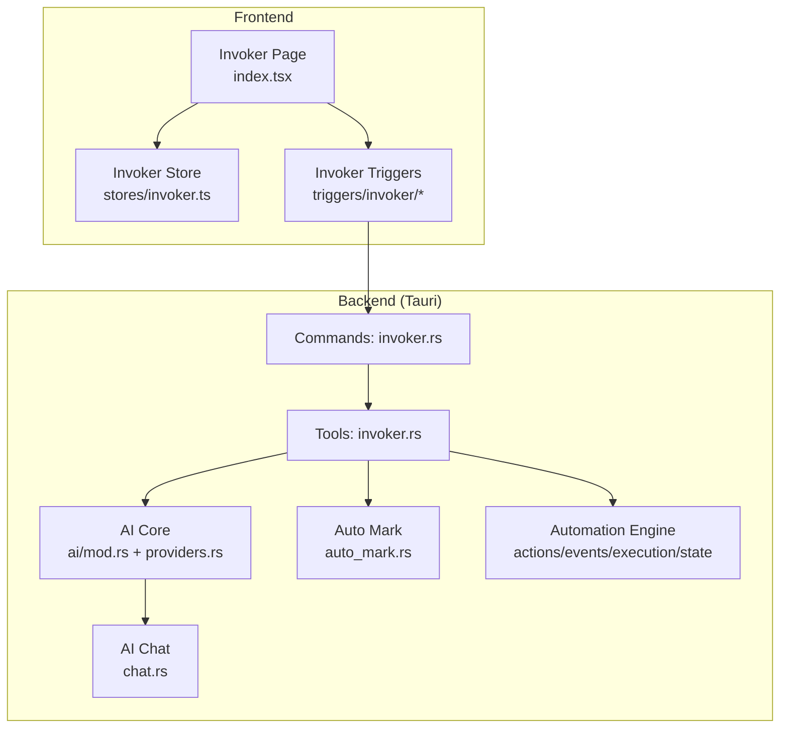
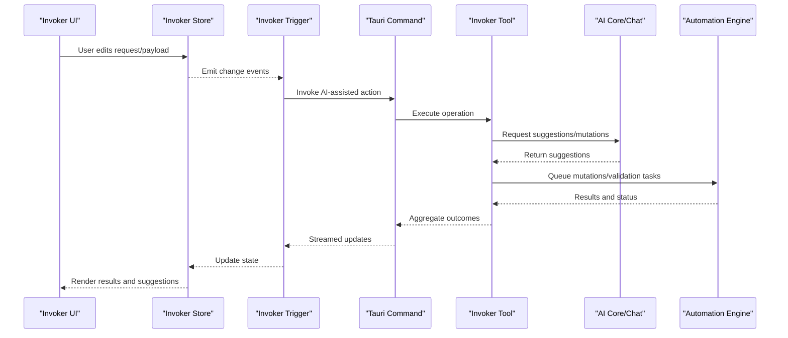
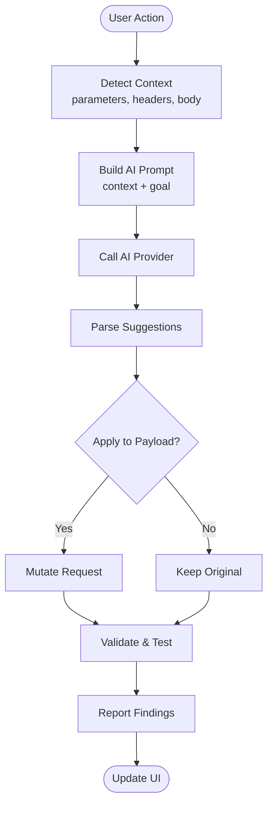
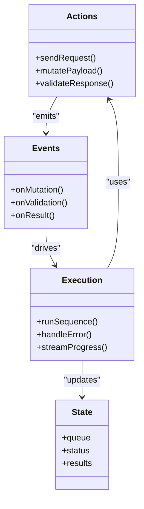
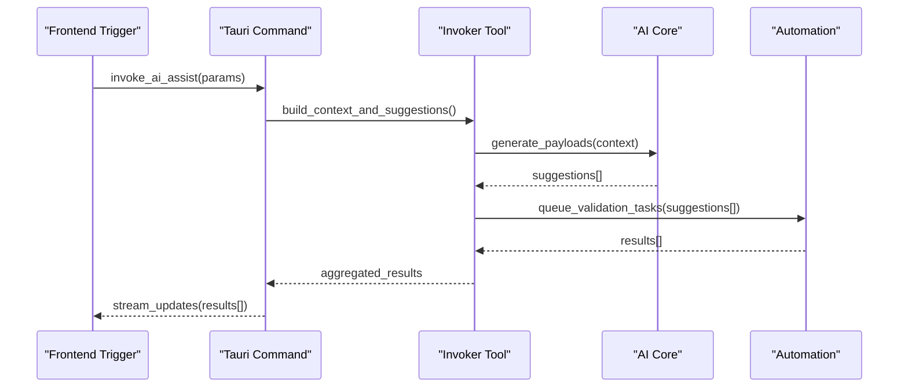
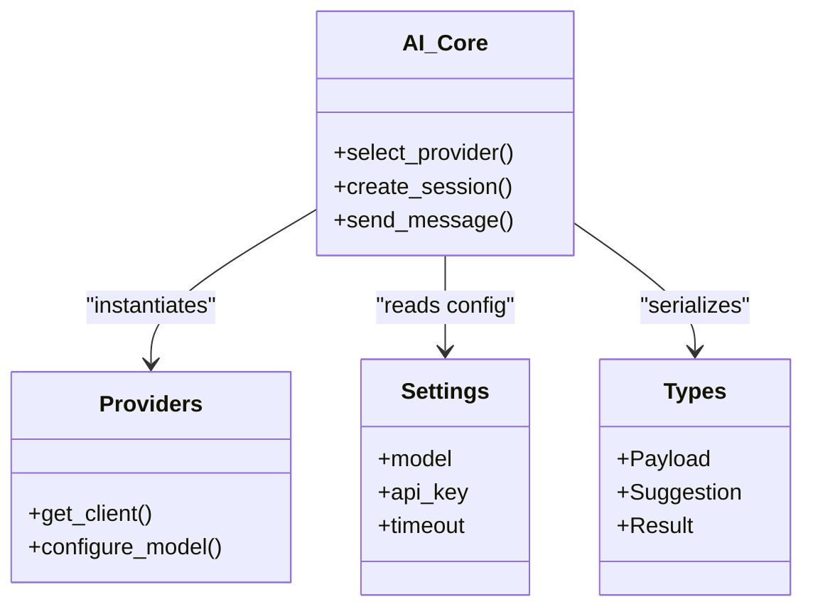
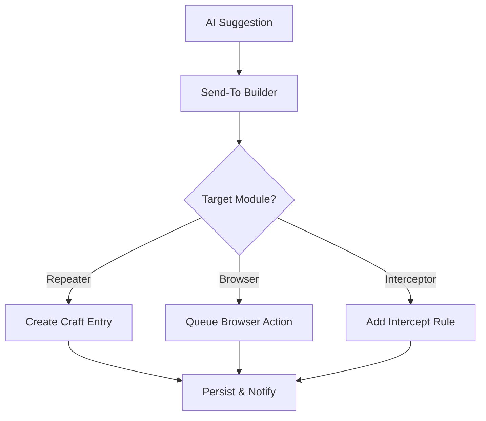
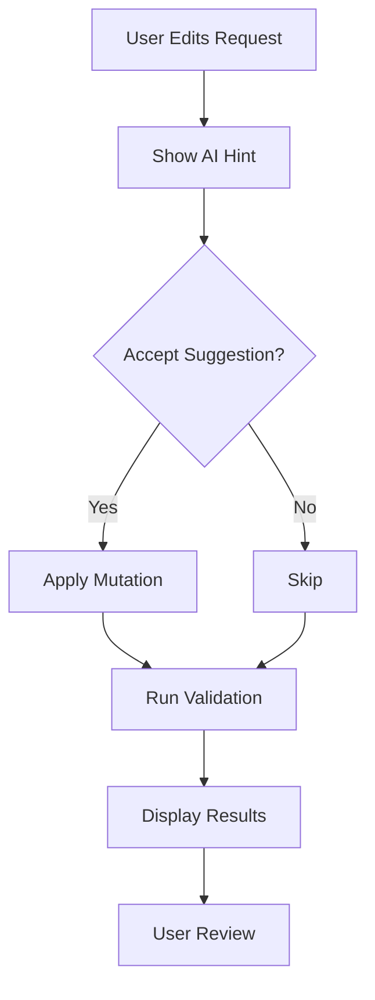
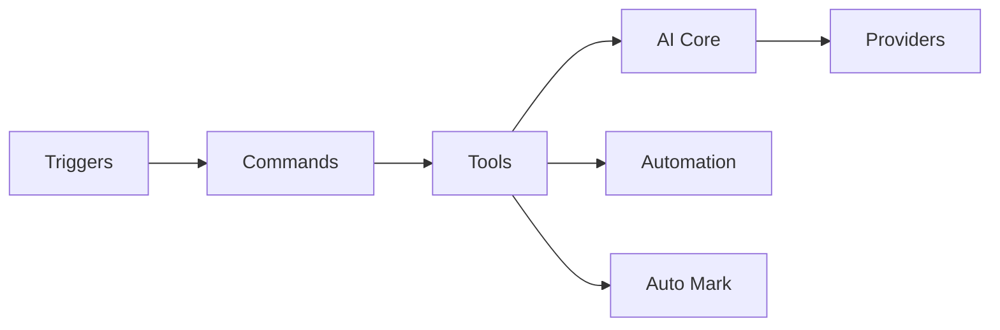

# Invoker AI Integration

<cite>
**Referenced Files in This Document**
- [src/pages/invoker/index.tsx](file://src/pages/invoker/index.tsx)
- [src/stores/invoker.ts](file://src/stores/invoker.ts)
- [src/triggers/invoker/index.ts](file://src/triggers/invoker/index.ts)
- [src/triggers/invoker/ai-tool.ts](file://src/triggers/invoker/ai-tool.ts)
- [src/triggers/invoker/attack.ts](file://src/triggers/invoker/attack.ts)
- [src/triggers/invoker/send-to.ts](file://src/triggers/invoker/send-to.ts)
- [src/triggers/invoker/ui.ts](file://src/triggers/invoker/ui.ts)
- [src-tauri/src/commands/invoker.rs](file://src-tauri/src/commands/invoker.rs)
- [src-tauri/src/tools/invoker.rs](file://src-tauri/src/tools/invoker.rs)
- [src-tauri/src/ai/mod.rs](file://src-tauri/src/ai/mod.rs)
- [src-tauri/src/ai/providers.rs](file://src-tauri/src/ai/providers.rs)
- [src-tauri/src/ai/settings.rs](file://src-tauri/src/ai/settings.rs)
- [src-tauri/src/ai/types.rs](file://src-tauri/src/ai/types.rs)
- [src-tauri/src/ai/chat.rs](file://src-tauri/src/ai/chat.rs)
- [src-tauri/src/ai/auto_mark.rs](file://src-tauri/src/ai/auto_mark.rs)
- [src-tauri/src/automation/actions.rs](file://src-tauri/src/automation/actions.rs)
- [src-tauri/src/automation/events.rs](file://src-tauri/src/automation/events.rs)
- [src-tauri/src/automation/execution.rs](file://src-tauri/src/automation/execution.rs)
- [src-tauri/src/automation/state.rs](file://src-tauri/src/automation/state.rs)
- [src-tauri/src/automation/types.rs](file://src-tauri/src/automation/types.rs)
</cite>

## Table of Contents
1. [Introduction](#introduction)
2. [Project Structure](#project-structure)
3. [Core Components](#core-components)
4. [Architecture Overview](#architecture-overview)
5. [Detailed Component Analysis](#detailed-component-analysis)
6. [Dependency Analysis](#dependency-analysis)
7. [Performance Considerations](#performance-considerations)
8. [Troubleshooting Guide](#troubleshooting-guide)
9. [Conclusion](#conclusion)
10. [Appendices](#appendices)

## Introduction
This document explains how the Invoker module integrates AI to enhance security testing workflows. It covers intelligent payload generation, vulnerability assessment, attack simulation, automated exploit development assistance, parameter brute-forcing support, and result interpretation. It also details how AI suggestions integrate with existing attack workflows and provides guidance for custom payload development.

## Project Structure
The Invoker AI integration spans both frontend (TypeScript/React) and backend (Rust/Tauri):
- Frontend: Invoker page, store, triggers, and UI hooks orchestrate user interactions and state updates.
- Backend: Tauri commands expose AI capabilities, tools execute attacks, and automation modules handle event-driven flows.

**Diagram sources**
- [src/pages/invoker/index.tsx](file://src/pages/invoker/index.tsx)
- [src/stores/invoker.ts](file://src/stores/invoker.ts)
- [src/triggers/invoker/index.ts](file://src/triggers/invoker/index.ts)
- [src-tauri/src/commands/invoker.rs](file://src-tauri/src/commands/invoker.rs)
- [src-tauri/src/tools/invoker.rs](file://src-tauri/src/tools/invoker.rs)
- [src-tauri/src/ai/mod.rs](file://src-tauri/src/ai/mod.rs)
- [src-tauri/src/ai/providers.rs](file://src-tauri/src/ai/providers.rs)
- [src-tauri/src/ai/chat.rs](file://src-tauri/src/ai/chat.rs)
- [src-tauri/src/ai/auto_mark.rs](file://src-tauri/src/ai/auto_mark.rs)
- [src-tauri/src/automation/actions.rs](file://src-tauri/src/automation/actions.rs)
- [src-tauri/src/automation/events.rs](file://src-tauri/src/automation/events.rs)
- [src-tauri/src/automation/execution.rs](file://src-tauri/src/automation/execution.rs)
- [src-tauri/src/automation/state.rs](file://src-tauri/src/automation/state.rs)

**Section sources**
- [src/pages/invoker/index.tsx](file://src/pages/invoker/index.tsx)
- [src/stores/invoker.ts](file://src/stores/invoker.ts)
- [src/triggers/invoker/index.ts](file://src/triggers/invoker/index.ts)
- [src-tauri/src/commands/invoker.rs](file://src-tauri/src/commands/invoker.rs)
- [src-tauri/src/tools/invoker.rs](file://src-tauri/src/tools/invoker.rs)

## Core Components
- Invoker Store: Centralized state for payloads, results, and AI-assisted actions.
- Invoker Triggers: Event-driven hooks that connect UI actions to backend commands and automation.
- Tauri Commands: Expose AI-powered operations to the frontend via secure IPC.
- Tools: Execute attacks, mutate payloads, and coordinate with automation and AI services.
- AI Core: Provider abstraction, settings, chat session management, and auto-marking logic.

Key responsibilities:
- Generate and mutate payloads using AI context (request/response, parameters, headers).
- Assist in brute-force campaigns by suggesting high-probability values.
- Validate vulnerabilities by synthesizing targeted follow-up requests.
- Interpret results and propose next steps or mitigations.

**Section sources**
- [src/stores/invoker.ts](file://src/stores/invoker.ts)
- [src/triggers/invoker/index.ts](file://src/triggers/invoker/index.ts)
- [src-tauri/src/commands/invoker.rs](file://src-tauri/src/commands/invoker.rs)
- [src-tauri/src/tools/invoker.rs](file://src-tauri/src/tools/invoker.rs)
- [src-tauri/src/ai/mod.rs](file://src-tauri/src/ai/mod.rs)
- [src-tauri/src/ai/providers.rs](file://src-tauri/src/ai/providers.rs)
- [src-tauri/src/ai/settings.rs](file://src-tauri/src/ai/settings.rs)
- [src-tauri/src/ai/types.rs](file://src-tauri/src/ai/types.rs)
- [src-tauri/src/ai/chat.rs](file://src-tauri/src/ai/chat.rs)
- [src-tauri/src/ai/auto_mark.rs](file://src-tauri/src/ai/auto_mark.rs)

## Architecture Overview
The Invoker AI flow connects user actions to AI-enhanced execution and feedback loops:

**Diagram sources**
- [src/pages/invoker/index.tsx](file://src/pages/invoker/index.tsx)
- [src/stores/invoker.ts](file://src/stores/invoker.ts)
- [src/triggers/invoker/index.ts](file://src/triggers/invoker/index.ts)
- [src-tauri/src/commands/invoker.rs](file://src-tauri/src/commands/invoker.rs)
- [src-tauri/src/tools/invoker.rs](file://src-tauri/src/tools/invoker.rs)
- [src-tauri/src/ai/chat.rs](file://src-tauri/src/ai/chat.rs)
- [src-tauri/src/automation/execution.rs](file://src-tauri/src/automation/execution.rs)

## Detailed Component Analysis

### Invoker Triggers and AI Tooling
The triggers layer bridges UI actions to backend commands and orchestrates AI tool usage. The AI tool trigger enables contextual prompts and structured responses for payload generation and validation.

**Diagram sources**
- [src/triggers/invoker/ai-tool.ts](file://src/triggers/invoker/ai-tool.ts)
- [src/triggers/invoker/index.ts](file://src/triggers/invoker/index.ts)
- [src-tauri/src/ai/chat.rs](file://src-tauri/src/ai/chat.rs)
- [src-tauri/src/ai/providers.rs](file://src-tauri/src/ai/providers.rs)

**Section sources**
- [src/triggers/invoker/ai-tool.ts](file://src/triggers/invoker/ai-tool.ts)
- [src/triggers/invoker/index.ts](file://src/triggers/invoker/index.ts)

### Attack Orchestration and Automation
Attack orchestration leverages automation actions and events to run sequences of tests, including brute-force campaigns and targeted validations.

**Diagram sources**
- [src-tauri/src/automation/actions.rs](file://src-tauri/src/automation/actions.rs)
- [src-tauri/src/automation/events.rs](file://src-tauri/src/automation/events.rs)
- [src-tauri/src/automation/execution.rs](file://src-tauri/src/automation/execution.rs)
- [src-tauri/src/automation/state.rs](file://src-tauri/src/automation/state.rs)

**Section sources**
- [src-tauri/src/automation/actions.rs](file://src-tauri/src/automation/actions.rs)
- [src-tauri/src/automation/events.rs](file://src-tauri/src/automation/events.rs)
- [src-tauri/src/automation/execution.rs](file://src-tauri/src/automation/execution.rs)
- [src-tauri/src/automation/state.rs](file://src-tauri/src/automation/state.rs)

### Tauri Commands and Tools
Commands expose AI-invoked operations to the frontend; tools implement the actual attack logic, mutation strategies, and integration with AI and automation.

**Diagram sources**
- [src-tauri/src/commands/invoker.rs](file://src-tauri/src/commands/invoker.rs)
- [src-tauri/src/tools/invoker.rs](file://src-tauri/src/tools/invoker.rs)
- [src-tauri/src/ai/mod.rs](file://src-tauri/src/ai/mod.rs)
- [src-tauri/src/automation/execution.rs](file://src-tauri/src/automation/execution.rs)

**Section sources**
- [src-tauri/src/commands/invoker.rs](file://src-tauri/src/commands/invoker.rs)
- [src-tauri/src/tools/invoker.rs](file://src-tauri/src/tools/invoker.rs)

### AI Core, Providers, and Settings
The AI core abstracts provider selection, configuration, and chat sessions. Settings manage model selection, API keys, and behavior flags. Types define payloads, suggestions, and results.

**Diagram sources**
- [src-tauri/src/ai/mod.rs](file://src-tauri/src/ai/mod.rs)
- [src-tauri/src/ai/providers.rs](file://src-tauri/src/ai/providers.rs)
- [src-tauri/src/ai/settings.rs](file://src-tauri/src/ai/settings.rs)
- [src-tauri/src/ai/types.rs](file://src-tauri/src/ai/types.rs)

**Section sources**
- [src-tauri/src/ai/mod.rs](file://src-tauri/src/ai/mod.rs)
- [src-tauri/src/ai/providers.rs](file://src-tauri/src/ai/providers.rs)
- [src-tauri/src/ai/settings.rs](file://src-tauri/src/ai/settings.rs)
- [src-tauri/src/ai/types.rs](file://src-tauri/src/ai/types.rs)

### Send-To Integration and Workflow Hooks
Send-to functionality allows moving crafted payloads into other workflows (e.g., Repeater, Browser Automation). This ensures AI-generated payloads can be reused across modules seamlessly.

**Diagram sources**
- [src/triggers/invoker/send-to.ts](file://src/triggers/invoker/send-to.ts)

**Section sources**
- [src/triggers/invoker/send-to.ts](file://src/triggers/invoker/send-to.ts)

### UI Enhancements and Feedback
The UI trigger layer renders AI suggestions, highlights mutated fields, and streams progress. It supports inline acceptance/rejection of suggestions and displays validation outcomes.

**Diagram sources**
- [src/triggers/invoker/ui.ts](file://src/triggers/invoker/ui.ts)

**Section sources**
- [src/triggers/invoker/ui.ts](file://src/triggers/invoker/ui.ts)

## Dependency Analysis
The Invoker AI integration depends on a layered architecture:
- Frontend triggers depend on Tauri commands for IPC.
- Commands delegate to tools for execution.
- Tools rely on AI core for suggestions and automation for sequencing.
- AI core uses providers and settings to configure models and credentials.

**Diagram sources**
- [src/triggers/invoker/index.ts](file://src/triggers/invoker/index.ts)
- [src-tauri/src/commands/invoker.rs](file://src-tauri/src/commands/invoker.rs)
- [src-tauri/src/tools/invoker.rs](file://src-tauri/src/tools/invoker.rs)
- [src-tauri/src/ai/mod.rs](file://src-tauri/src/ai/mod.rs)
- [src-tauri/src/ai/providers.rs](file://src-tauri/src/ai/providers.rs)
- [src-tauri/src/automation/execution.rs](file://src-tauri/src/automation/execution.rs)
- [src-tauri/src/ai/auto_mark.rs](file://src-tauri/src/ai/auto_mark.rs)

**Section sources**
- [src/triggers/invoker/index.ts](file://src/triggers/invoker/index.ts)
- [src-tauri/src/commands/invoker.rs](file://src-tauri/src/commands/invoker.rs)
- [src-tauri/src/tools/invoker.rs](file://src-tauri/src/tools/invoker.rs)
- [src-tauri/src/ai/mod.rs](file://src-tauri/src/ai/mod.rs)
- [src-tauri/src/ai/providers.rs](file://src-tauri/src/ai/providers.rs)
- [src-tauri/src/automation/execution.rs](file://src-tauri/src/automation/execution.rs)
- [src-tauri/src/ai/auto_mark.rs](file://src-tauri/src/ai/auto_mark.rs)

## Performance Considerations
- Streamed Updates: Use streaming responses from AI and automation to keep UI responsive.
- Batch Mutations: Group related mutations to reduce redundant network calls.
- Rate Limiting: Respect provider rate limits and target server constraints.
- Caching: Cache frequent suggestions based on stable request fingerprints.
- Concurrency Control: Limit parallel tasks per campaign to avoid overwhelming targets.

[No sources needed since this section provides general guidance]

## Troubleshooting Guide
Common issues and resolutions:
- AI Provider Errors: Verify API keys, model names, and timeouts in settings. Check provider availability and quotas.
- No Suggestions: Ensure context is complete (parameters, headers, body). Validate prompt construction in AI tool trigger.
- Slow Campaigns: Reduce concurrency, enable batching, and filter low-value payloads early.
- Misinterpreted Results: Refine validation rules and add explicit indicators in response parsing.
- UI Not Updating: Confirm IPC channels are open and events are emitted correctly from triggers.

**Section sources**
- [src-tauri/src/ai/settings.rs](file://src-tauri/src/ai/settings.rs)
- [src/triggers/invoker/ai-tool.ts](file://src/triggers/invoker/ai-tool.ts)
- [src-tauri/src/automation/execution.rs](file://src-tauri/src/automation/execution.rs)

## Conclusion
The Invoker module’s AI integration enhances security testing by automating payload generation, assisting in brute-force campaigns, validating vulnerabilities, and interpreting results within existing workflows. Its modular design—triggers, commands, tools, AI core, and automation—enables flexible customization and robust performance.

[No sources needed since this section summarizes without analyzing specific files]

## Appendices

### AI-Suggested Attack Patterns
- Parameter Tampering: Suggests value ranges and encodings based on observed types.
- Injection Vectors: Proposes SQLi, XSS, and command injection variants tailored to endpoints.
- Authentication Bypass: Generates tokens or header manipulations aligned with observed auth schemes.

[No sources needed since this section provides conceptual examples]

### Intelligent Payload Mutation
- Type-Aware Mutation: Adjusts payloads according to parameter types and expected formats.
- Contextual Encoding: Applies encoding strategies derived from observed server behavior.
- Adaptive Sequencing: Orders mutations to maximize discovery while minimizing noise.

[No sources needed since this section provides conceptual examples]

### Result Interpretation Guidance
- Indicator Extraction: Highlights HTTP status changes, response size deltas, and error patterns.
- Confidence Scoring: Ranks findings based on consistency across multiple probes.
- Next Steps: Recommends focused follow-ups to confirm or dismiss suspected vulnerabilities.

[No sources needed since this section provides conceptual examples]

### Custom Payload Development
- Define Context: Capture relevant request attributes and environment variables.
- Build Prompts: Provide clear goals and constraints for AI to generate targeted payloads.
- Validate Early: Implement quick checks before launching full campaigns.
- Iterate: Use feedback loops to refine suggestions and improve accuracy.

[No sources needed since this section provides conceptual examples]