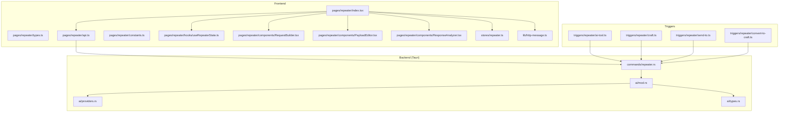
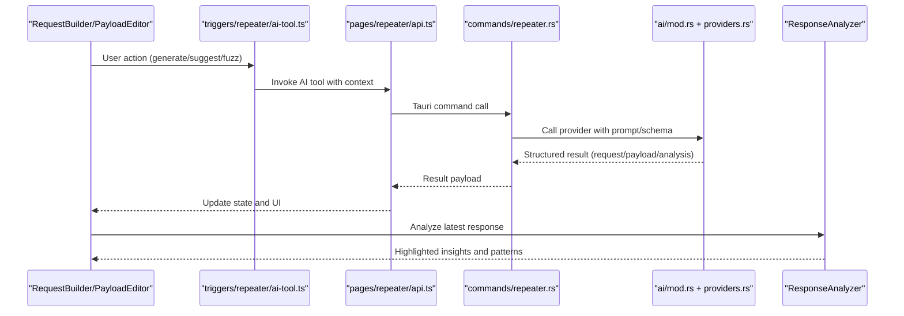
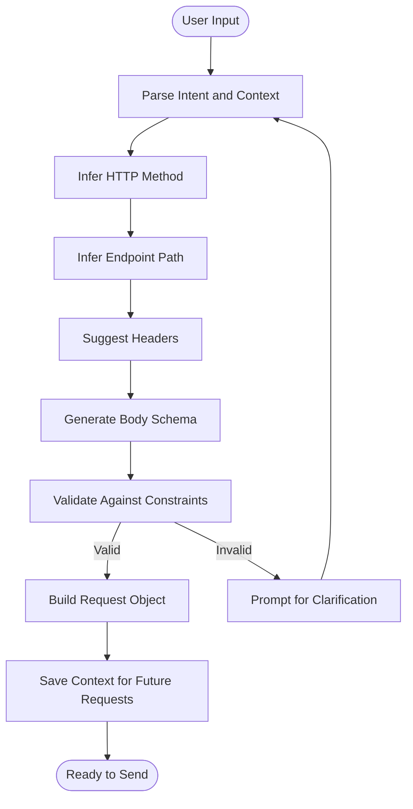
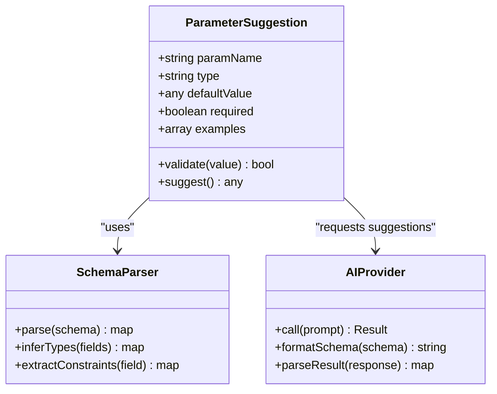
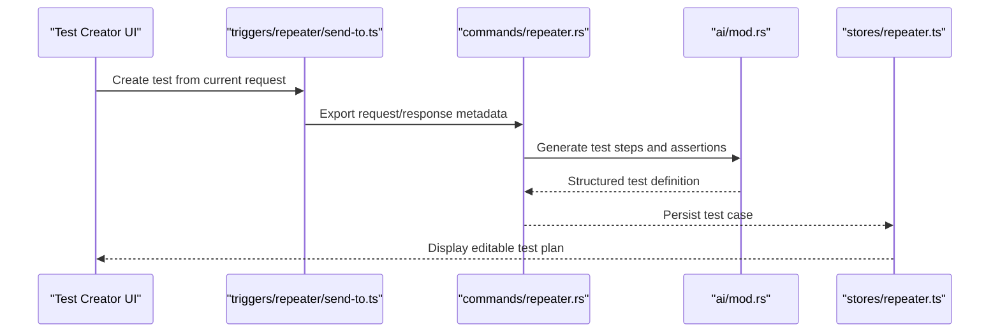
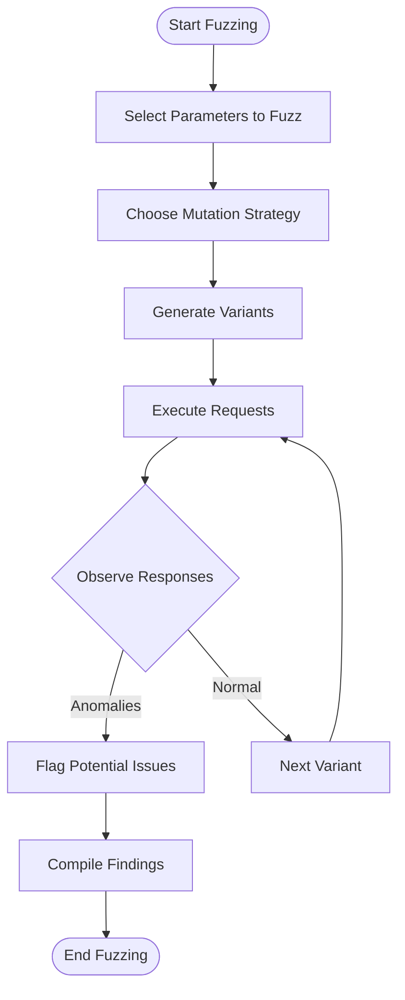
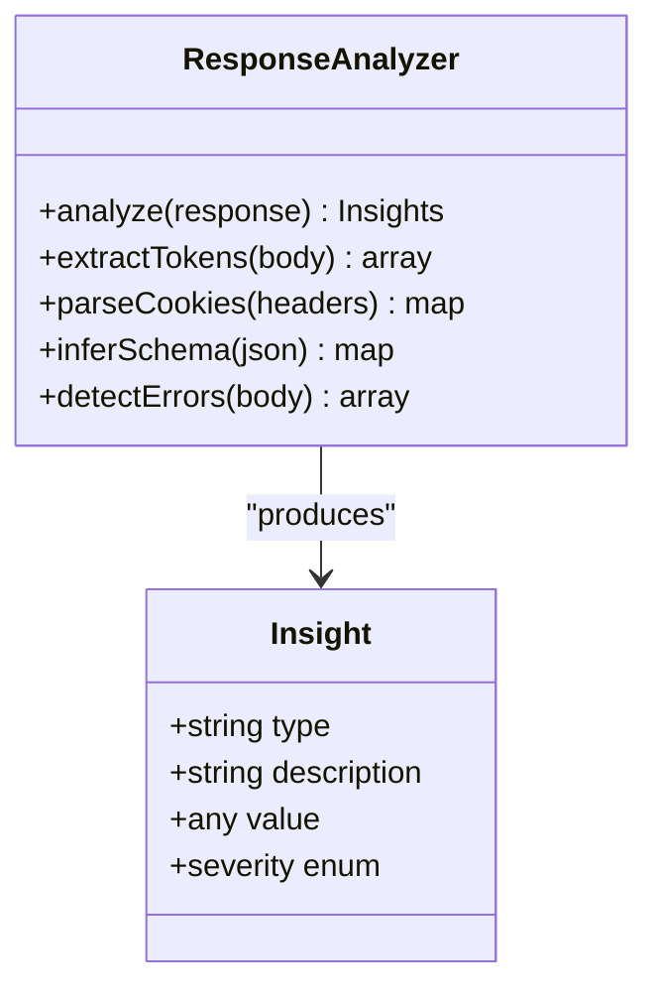
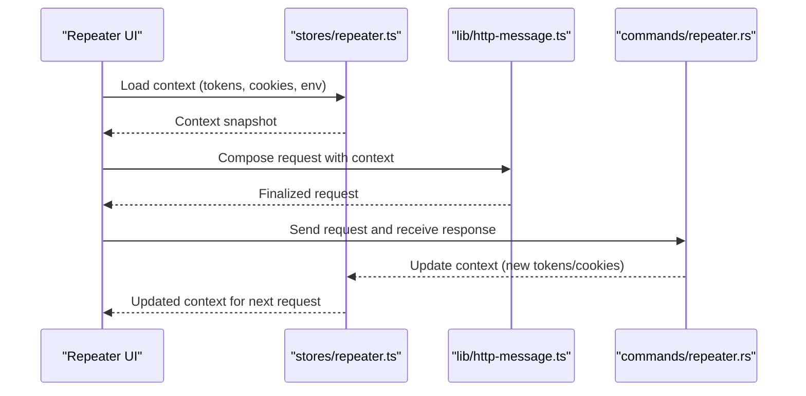
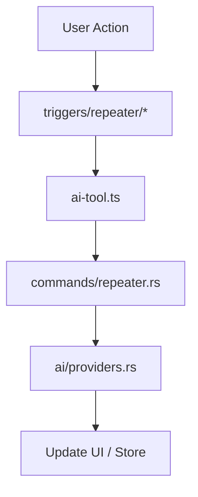
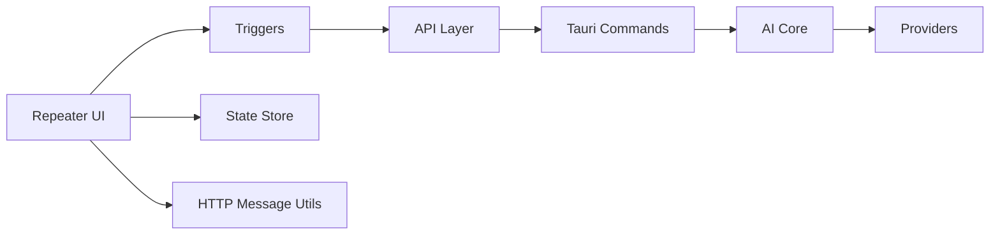

# Repeater AI Integration

<cite>
**Referenced Files in This Document**
- [repeater/index.tsx](file://src/pages/repeater/index.tsx)
- [repeater/types.ts](file://src/pages/repeater/types.ts)
- [repeater/api.ts](file://src/pages/repeater/api.ts)
- [repeater/constants.ts](file://src/pages/repeater/constants.ts)
- [repeater/hooks/useRepeaterState.ts](file://src/pages/repeater/hooks/useRepeaterState.ts)
- [repeater/components/RequestBuilder.tsx](file://src/pages/repeater/components/RequestBuilder.tsx)
- [repeater/components/PayloadEditor.tsx](file://src/pages/repeater/components/PayloadEditor.tsx)
- [repeater/components/ResponseAnalyzer.tsx](file://src/pages/repeater/components/ResponseAnalyzer.tsx)
- [triggers/repeater/ai-tool.ts](file://src/triggers/repeater/ai-tool.ts)
- [triggers/repeater/craft.ts](file://src/triggers/repeater/craft.ts)
- [triggers/repeater/send-to.ts](file://src/triggers/repeater/send-to.ts)
- [triggers/repeater/convert-to-craft.ts](file://src/triggers/repeater/convert-to-craft.ts)
- [src/stores/repeater.ts](file://src/stores/repeater.ts)
- [src/lib/http-message.ts](file://src/lib/http-message.ts)
- [src-tauri/src/commands/repeater.rs](file://src-tauri/src/commands/repeater.rs)
- [src-tauri/src/ai/mod.rs](file://src-tauri/src/ai/mod.rs)
- [src-tauri/src/ai/providers.rs](file://src-tauri/src/ai/providers.rs)
- [src-tauri/src/ai/types.rs](file://src-tauri/src/ai/types.rs)
</cite>

## Table of Contents
1. [Introduction](#introduction)
2. [Project Structure](#project-structure)
3. [Core Components](#core-components)
4. [Architecture Overview](#architecture-overview)
5. [Detailed Component Analysis](#detailed-component-analysis)
6. [Dependency Analysis](#dependency-analysis)
7. [Performance Considerations](#performance-considerations)
8. [Troubleshooting Guide](#troubleshooting-guide)
9. [Conclusion](#conclusion)

## Introduction
This document explains the AI capabilities integrated into the Repeater module. It covers how AI assists with crafting requests, generating payloads, manipulating parameters, and analyzing responses. It also documents the AI-powered request builder, intelligent parameter suggestions, automated test case creation, smart fuzzing strategies, response pattern recognition, and context preservation across requests for workflow automation.

## Project Structure
The Repeater module is implemented both on the frontend (React/TypeScript) and backend (Tauri/Rust). The frontend provides the UI and orchestration logic, while the backend exposes commands to interact with AI providers and execute operations securely.

**Diagram sources**
- [repeater/index.tsx](file://src/pages/repeater/index.tsx)
- [repeater/types.ts](file://src/pages/repeater/types.ts)
- [repeater/api.ts](file://src/pages/repeater/api.ts)
- [repeater/constants.ts](file://src/pages/repeater/constants.ts)
- [repeater/hooks/useRepeaterState.ts](file://src/pages/repeater/hooks/useRepeaterState.ts)
- [repeater/components/RequestBuilder.tsx](file://src/pages/repeater/components/RequestBuilder.tsx)
- [repeater/components/PayloadEditor.tsx](file://src/pages/repeater/components/PayloadEditor.tsx)
- [repeater/components/ResponseAnalyzer.tsx](file://src/pages/repeater/components/ResponseAnalyzer.tsx)
- [triggers/repeater/ai-tool.ts](file://src/triggers/repeater/ai-tool.ts)
- [triggers/repeater/craft.ts](file://src/triggers/repeater/craft.ts)
- [triggers/repeater/send-to.ts](file://src/triggers/repeater/send-to.ts)
- [triggers/repeater/convert-to-craft.ts](file://src/triggers/repeater/convert-to-craft.ts)
- [src/stores/repeater.ts](file://src/stores/repeater.ts)
- [src/lib/http-message.ts](file://src/lib/http-message.ts)
- [src-tauri/src/commands/repeater.rs](file://src-tauri/src/commands/repeater.rs)
- [src-tauri/src/ai/mod.rs](file://src-tauri/src/ai/mod.rs)
- [src-tauri/src/ai/providers.rs](file://src-tauri/src/ai/providers.rs)
- [src-tauri/src/ai/types.rs](file://src-tauri/src/ai/types.rs)

**Section sources**
- [repeater/index.tsx](file://src/pages/repeater/index.tsx)
- [repeater/types.ts](file://src/pages/repeater/types.ts)
- [repeater/api.ts](file://src/pages/repeater/api.ts)
- [repeater/constants.ts](file://src/pages/repeater/constants.ts)
- [repeater/hooks/useRepeaterState.ts](file://src/pages/repeater/hooks/useRepeaterState.ts)
- [repeater/components/RequestBuilder.tsx](file://src/pages/repeater/components/RequestBuilder.tsx)
- [repeater/components/PayloadEditor.tsx](file://src/pages/repeater/components/PayloadEditor.tsx)
- [repeater/components/ResponseAnalyzer.tsx](file://src/pages/repeater/components/ResponseAnalyzer.tsx)
- [triggers/repeater/ai-tool.ts](file://src/triggers/repeater/ai-tool.ts)
- [triggers/repeater/craft.ts](file://src/triggers/repeater/craft.ts)
- [triggers/repeater/send-to.ts](file://src/triggers/repeater/send-to.ts)
- [triggers/repeater/convert-to-craft.ts](file://src/triggers/repeater/convert-to-craft.ts)
- [src/stores/repeater.ts](file://src/stores/repeater.ts)
- [src/lib/http-message.ts](file://src/lib/http-message.ts)
- [src-tauri/src/commands/repeater.rs](file://src-tauri/src/commands/repeater.rs)
- [src-tauri/src/ai/mod.rs](file://src-tauri/src/ai/mod.rs)
- [src-tauri/src/ai/providers.rs](file://src-tauri/src/ai/providers.rs)
- [src-tauri/src/ai/types.rs](file://src-tauri/src/ai/types.rs)

## Core Components
- Request Builder: An AI-assisted interface that constructs HTTP requests from natural language or partial inputs, inferring method, path, headers, and body structure.
- Payload Editor: Context-aware editor that suggests and generates payloads based on parameter types, schemas, and prior responses.
- Response Analyzer: Parses and highlights patterns in responses, extracts tokens, cookies, JSON structures, and flags anomalies.
- Triggers: Event-driven hooks that connect UI actions to AI tools, enabling one-click generation, conversion, and sending.
- State Management: Centralized store for current request, history, collections, and AI context.
- Backend Commands: Secure Rust endpoints that call AI providers and perform operations like crafting, fuzzing, and analysis.

Key responsibilities:
- Maintain context between requests (auth tokens, cookies, session state).
- Provide intelligent suggestions for parameters and payloads.
- Automate repetitive tasks via triggers and templates.
- Ensure safe execution through backend validation and provider abstraction.

**Section sources**
- [repeater/components/RequestBuilder.tsx](file://src/pages/repeater/components/RequestBuilder.tsx)
- [repeater/components/PayloadEditor.tsx](file://src/pages/repeater/components/PayloadEditor.tsx)
- [repeater/components/ResponseAnalyzer.tsx](file://src/pages/repeater/components/ResponseAnalyzer.tsx)
- [triggers/repeater/ai-tool.ts](file://src/triggers/repeater/ai-tool.ts)
- [triggers/repeater/craft.ts](file://src/triggers/repeater/craft.ts)
- [triggers/repeater/send-to.ts](file://src/triggers/repeater/send-to.ts)
- [triggers/repeater/convert-to-craft.ts](file://src/triggers/repeater/convert-to-craft.ts)
- [src/stores/repeater.ts](file://src/stores/repeater.ts)
- [src/lib/http-message.ts](file://src/lib/http-message.ts)
- [src-tauri/src/commands/repeater.rs](file://src-tauri/src/commands/repeater.rs)
- [src-tauri/src/ai/mod.rs](file://src-tauri/src/ai/mod.rs)
- [src-tauri/src/ai/providers.rs](file://src-tauri/src/ai/providers.rs)
- [src-tauri/src/ai/types.rs](file://src-tauri/src/ai/types.rs)

## Architecture Overview
The Repeater AI architecture combines a React frontend with Tauri-backed Rust commands. Frontend components trigger AI workflows via triggers; these calls are routed to backend commands which interact with AI providers. Results flow back to the UI for display and further interaction.

**Diagram sources**
- [repeater/components/RequestBuilder.tsx](file://src/pages/repeater/components/RequestBuilder.tsx)
- [repeater/components/PayloadEditor.tsx](file://src/pages/repeater/components/PayloadEditor.tsx)
- [triggers/repeater/ai-tool.ts](file://src/triggers/repeater/ai-tool.ts)
- [repeater/api.ts](file://src/pages/repeater/api.ts)
- [src-tauri/src/commands/repeater.rs](file://src-tauri/src/commands/repeater.rs)
- [src-tauri/src/ai/mod.rs](file://src-tauri/src/ai/mod.rs)
- [src-tauri/src/ai/providers.rs](file://src-tauri/src/ai/providers.rs)
- [repeater/components/ResponseAnalyzer.tsx](file://src/pages/repeater/components/ResponseAnalyzer.tsx)

## Detailed Component Analysis

### AI-Powered Request Builder
The Request Builder accepts natural language or partial request details and produces a fully formed HTTP request. It leverages AI to infer method, URL, headers, and body structure based on context and historical data.

Key behaviors:
- Infers HTTP method and endpoint from user intent.
- Suggests headers (e.g., content-type, authorization).
- Generates structured bodies (JSON, form, multipart) using schema hints.
- Preserves context such as auth tokens and cookies across sessions.

**Diagram sources**
- [repeater/components/RequestBuilder.tsx](file://src/pages/repeater/components/RequestBuilder.tsx)
- [triggers/repeater/craft.ts](file://src/triggers/repeater/craft.ts)
- [src/lib/http-message.ts](file://src/lib/http-message.ts)
- [src/stores/repeater.ts](file://src/stores/repeater.ts)

**Section sources**
- [repeater/components/RequestBuilder.tsx](file://src/pages/repeater/components/RequestBuilder.tsx)
- [triggers/repeater/craft.ts](file://src/triggers/repeater/craft.ts)
- [src/lib/http-message.ts](file://src/lib/http-message.ts)
- [src/stores/repeater.ts](file://src/stores/repeater.ts)

### Intelligent Parameter Suggestions
Parameter suggestions are driven by AI models that analyze existing parameters, response samples, and known schemas to propose values, types, and formats.

Capabilities:
- Type inference for parameters (string, number, boolean, array, object).
- Value suggestions based on domain knowledge and previous responses.
- Auto-completion and validation feedback.
- Contextual defaults derived from environment variables and stored collections.

**Diagram sources**
- [repeater/components/PayloadEditor.tsx](file://src/pages/repeater/components/PayloadEditor.tsx)
- [src-tauri/src/ai/types.rs](file://src-tauri/src/ai/types.rs)
- [src-tauri/src/ai/providers.rs](file://src-tauri/src/ai/providers.rs)

**Section sources**
- [repeater/components/PayloadEditor.tsx](file://src/pages/repeater/components/PayloadEditor.tsx)
- [src-tauri/src/ai/types.rs](file://src-tauri/src/ai/types.rs)
- [src-tauri/src/ai/providers.rs](file://src-tauri/src/ai/providers.rs)

### Automated Test Case Creation
Automated test cases are generated from existing requests and responses. The system captures successful flows and transforms them into repeatable tests with assertions.

Workflow:
- Capture baseline request/response pairs.
- Extract key fields and expected patterns.
- Generate test steps with assertions (status codes, headers, body fields).
- Allow manual refinement and export to test suites.

**Diagram sources**
- [triggers/repeater/send-to.ts](file://src/triggers/repeater/send-to.ts)
- [src-tauri/src/commands/repeater.rs](file://src-tauri/src/commands/repeater.rs)
- [src-tauri/src/ai/mod.rs](file://src-tauri/src/ai/mod.rs)
- [src/stores/repeater.ts](file://src/stores/repeater.ts)

**Section sources**
- [triggers/repeater/send-to.ts](file://src/triggers/repeater/send-to.ts)
- [src-tauri/src/commands/repeater.rs](file://src-tauri/src/commands/repeater.rs)
- [src-tauri/src/ai/mod.rs](file://src-tauri/src/ai/mod.rs)
- [src/stores/repeater.ts](file://src/stores/repeater.ts)

### Smart Parameter Fuzzing
Smart fuzzing uses AI to generate targeted variations of parameters to uncover vulnerabilities or unexpected behavior. It focuses on high-value targets and respects rate limits and safety constraints.

Features:
- Context-aware mutation strategies (boundary values, encoding, injection patterns).
- Adaptive selection based on prior responses and error rates.
- Safe execution with timeouts and retries.
- Aggregation of findings for review.

**Diagram sources**
- [repeater/components/PayloadEditor.tsx](file://src/pages/repeater/components/PayloadEditor.tsx)
- [src-tauri/src/commands/repeater.rs](file://src-tauri/src/commands/repeater.rs)
- [src-tauri/src/ai/providers.rs](file://src-tauri/src/ai/providers.rs)

**Section sources**
- [repeater/components/PayloadEditor.tsx](file://src/pages/repeater/components/PayloadEditor.tsx)
- [src-tauri/src/commands/repeater.rs](file://src-tauri/src/commands/repeater.rs)
- [src-tauri/src/ai/providers.rs](file://src-tauri/src/ai/providers.rs)

### Response Pattern Recognition
Response analysis identifies common patterns, extracts tokens, cookies, and JSON structures, and highlights anomalies or security-relevant information.

Functions:
- Token extraction (JWT, session IDs).
- Cookie parsing and classification.
- JSON schema inference and field highlighting.
- Error pattern detection and suggestion of fixes.

**Diagram sources**
- [repeater/components/ResponseAnalyzer.tsx](file://src/pages/repeater/components/ResponseAnalyzer.tsx)
- [src/lib/http-message.ts](file://src/lib/http-message.ts)

**Section sources**
- [repeater/components/ResponseAnalyzer.tsx](file://src/pages/repeater/components/ResponseAnalyzer.tsx)
- [src/lib/http-message.ts](file://src/lib/http-message.ts)

### Context Preservation Between Requests
Context preservation ensures continuity across requests by maintaining authentication, cookies, environment variables, and session state. This enables seamless workflows where subsequent requests build upon previous interactions.

Mechanisms:
- Persistent storage of tokens and cookies.
- Environment variable resolution at runtime.
- Collection-based grouping and sharing of context.
- AI prompts enriched with context for better suggestions.

**Diagram sources**
- [src/stores/repeater.ts](file://src/stores/repeater.ts)
- [src/lib/http-message.ts](file://src/lib/http-message.ts)
- [src-tauri/src/commands/repeater.rs](file://src-tauri/src/commands/repeater.rs)

**Section sources**
- [src/stores/repeater.ts](file://src/stores/repeater.ts)
- [src/lib/http-message.ts](file://src/lib/http-message.ts)
- [src-tauri/src/commands/repeater.rs](file://src-tauri/src/commands/repeater.rs)

### AI-Assisted Workflow Automation
Triggers enable one-click automation for common tasks such as converting raw text to crafted requests, sending results to collections, and invoking AI tools.

Common automations:
- Convert clipboard or selected text into a request.
- Send current request to a predefined collection.
- Generate payloads or analyze responses on demand.

**Diagram sources**
- [triggers/repeater/ai-tool.ts](file://src/triggers/repeater/ai-tool.ts)
- [triggers/repeater/convert-to-craft.ts](file://src/triggers/repeater/convert-to-craft.ts)
- [triggers/repeater/send-to.ts](file://src/triggers/repeater/send-to.ts)
- [src-tauri/src/commands/repeater.rs](file://src-tauri/src/commands/repeater.rs)
- [src-tauri/src/ai/providers.rs](file://src-tauri/src/ai/providers.rs)

**Section sources**
- [triggers/repeater/ai-tool.ts](file://src/triggers/repeater/ai-tool.ts)
- [triggers/repeater/convert-to-craft.ts](file://src/triggers/repeater/convert-to-craft.ts)
- [triggers/repeater/send-to.ts](file://src/triggers/repeater/send-to.ts)
- [src-tauri/src/commands/repeater.rs](file://src-tauri/src/commands/repeater.rs)
- [src-tauri/src/ai/providers.rs](file://src-tauri/src/ai/providers.rs)

## Dependency Analysis
The Repeater module depends on several internal modules and external AI providers. Dependencies are managed through clear interfaces and commands.

**Diagram sources**
- [repeater/index.tsx](file://src/pages/repeater/index.tsx)
- [triggers/repeater/ai-tool.ts](file://src/triggers/repeater/ai-tool.ts)
- [repeater/api.ts](file://src/pages/repeater/api.ts)
- [src-tauri/src/commands/repeater.rs](file://src-tauri/src/commands/repeater.rs)
- [src-tauri/src/ai/mod.rs](file://src-tauri/src/ai/mod.rs)
- [src-tauri/src/ai/providers.rs](file://src-tauri/src/ai/providers.rs)
- [src/stores/repeater.ts](file://src/stores/repeater.ts)
- [src/lib/http-message.ts](file://src/lib/http-message.ts)

**Section sources**
- [repeater/index.tsx](file://src/pages/repeater/index.tsx)
- [triggers/repeater/ai-tool.ts](file://src/triggers/repeater/ai-tool.ts)
- [repeater/api.ts](file://src/pages/repeater/api.ts)
- [src-tauri/src/commands/repeater.rs](file://src-tauri/src/commands/repeater.rs)
- [src-tauri/src/ai/mod.rs](file://src-tauri/src/ai/mod.rs)
- [src-tauri/src/ai/providers.rs](file://src-tauri/src/ai/providers.rs)
- [src/stores/repeater.ts](file://src/stores/repeater.ts)
- [src/lib/http-message.ts](file://src/lib/http-message.ts)

## Performance Considerations
- Cache frequent AI responses when appropriate to reduce latency.
- Use streaming responses for long-running AI tasks to improve UX.
- Limit payload sizes sent to AI providers to minimize overhead.
- Implement retry and timeout policies for robustness.
- Debounce user inputs to avoid excessive AI calls.

[No sources needed since this section provides general guidance]

## Troubleshooting Guide
Common issues and resolutions:
- AI provider errors: Check configuration and credentials; verify network connectivity.
- Invalid request construction: Validate schema and ensure required fields are present.
- Context loss: Confirm persistence of tokens and cookies; reinitialize session if needed.
- Slow responses: Reduce payload size, enable caching, or switch to faster providers.

**Section sources**
- [src-tauri/src/ai/providers.rs](file://src-tauri/src/ai/providers.rs)
- [src-tauri/src/commands/repeater.rs](file://src-tauri/src/commands/repeater.rs)
- [src/stores/repeater.ts](file://src/stores/repeater.ts)

## Conclusion
The Repeater module integrates AI throughout its workflow to enhance productivity and accuracy. From request building and payload generation to parameter manipulation and response analysis, AI assists users in creating effective tests and exploring APIs efficiently. Context preservation and automation ensure smooth, repeatable workflows, while performance and troubleshooting considerations help maintain reliability.

[No sources needed since this section summarizes without analyzing specific files]