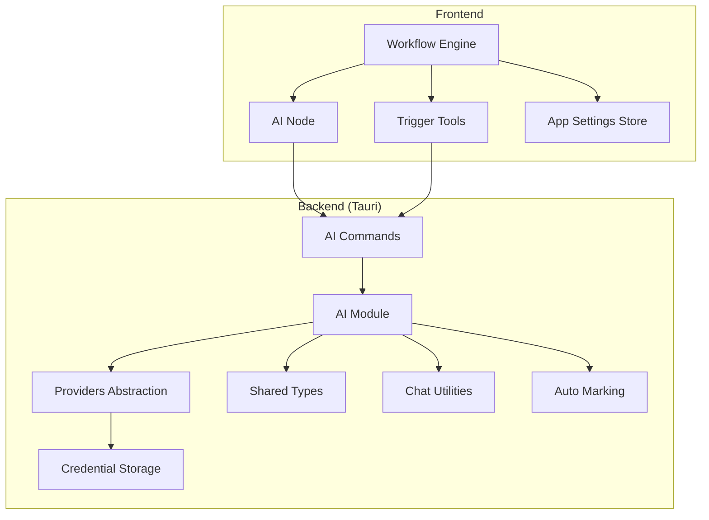
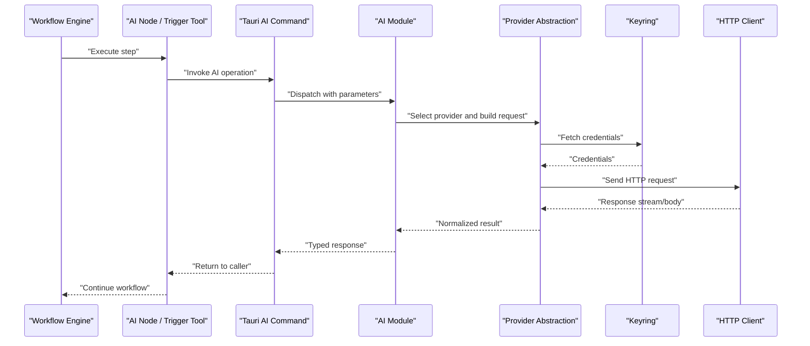
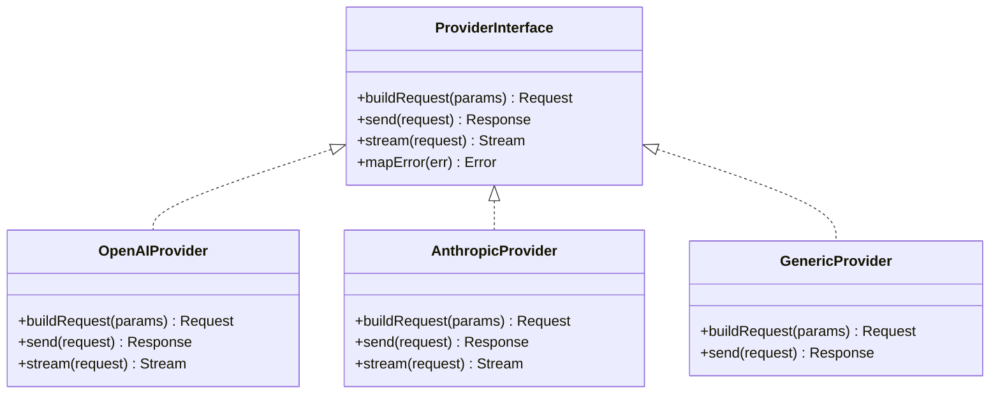
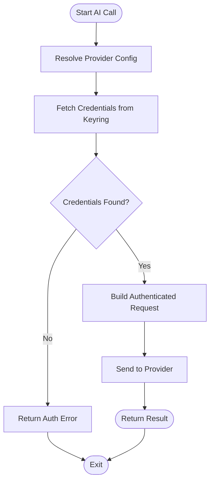
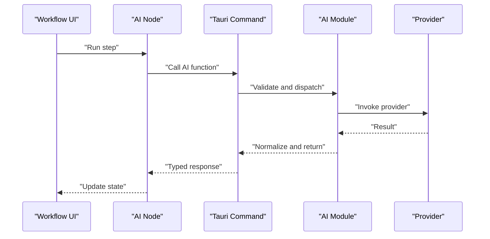
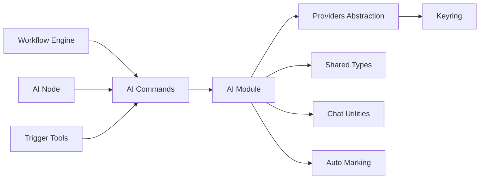

# AI Service Integration & Communication Patterns

<cite>
**Referenced Files in This Document**
- [src-tauri/src/ai/mod.rs](file://src-tauri/src/ai/mod.rs)
- [src-tauri/src/ai/providers.rs](file://src-tauri/src/ai/providers.rs)
- [src-tauri/src/ai/types.rs](file://src-tauri/src/ai/types.rs)
- [src-tauri/src/ai/settings.rs](file://src-tauri/src/ai/settings.rs)
- [src-tauri/src/ai/chat.rs](file://src-tauri/src/ai/chat.rs)
- [src-tauri/src/ai/auto_mark.rs](file://src-tauri/src/ai/auto_mark.rs)
- [src-tauri/src/ai/keyring.rs](file://src-tauri/src/ai/keyring.rs)
- [src-tauri/src/commands/ai.rs](file://src-tauri/src/commands/ai.rs)
- [src/pages/workflow/index.tsx](file://src/pages/workflow/index.tsx)
- [src/pages/workflow/lib/workflow-engine.ts](file://src/pages/workflow/lib/workflow-engine.ts)
- [src/pages/workflow/nodes/ai-node.tsx](file://src/pages/workflow/nodes/ai-node.tsx)
- [src/triggers/invoker/ai-tool.ts](file://src/triggers/invoker/ai-tool.ts)
- [src/triggers/repeater/ai-tool.ts](file://src/triggers/repeater/ai-tool.ts)
- [src/triggers/intercept/ai-tool.ts](file://src/triggers/intercept/ai-tool.ts)
- [src/stores/app-settings-store.ts](file://src/stores/app-settings-store.ts)
</cite>

## Table of Contents
1. [Introduction](#introduction)
2. [Project Structure](#project-structure)
3. [Core Components](#core-components)
4. [Architecture Overview](#architecture-overview)
5. [Detailed Component Analysis](#detailed-component-analysis)
6. [Dependency Analysis](#dependency-analysis)
7. [Performance Considerations](#performance-considerations)
8. [Troubleshooting Guide](#troubleshooting-guide)
9. [Conclusion](#conclusion)

## Introduction
This document explains how Apprecon’s workflow engine integrates with AI providers, handles API calls and authentication, processes responses, and manages reliability through retries and rate limiting. It focuses on the provider abstraction layer, error handling strategies, and practical patterns for integrating multiple AI services within workflows.

## Project Structure
Apprecon implements AI integration across a Rust backend (Tauri) and a TypeScript frontend:
- Backend (Rust): AI provider abstraction, configuration, secure credential storage, and command interfaces exposed to the frontend.
- Frontend (TypeScript): Workflow UI, node definitions, trigger integrations, and settings management that orchestrate AI calls from the UI and automation flows.

**Diagram sources**
- [src/pages/workflow/index.tsx](file://src/pages/workflow/index.tsx)
- [src/pages/workflow/nodes/ai-node.tsx](file://src/pages/workflow/nodes/ai-node.tsx)
- [src/triggers/invoker/ai-tool.ts](file://src/triggers/invoker/ai-tool.ts)
- [src/triggers/repeater/ai-tool.ts](file://src/triggers/repeater/ai-tool.ts)
- [src/triggers/intercept/ai-tool.ts](file://src/triggers/intercept/ai-tool.ts)
- [src/stores/app-settings-store.ts](file://src/stores/app-settings-store.ts)
- [src-tauri/src/commands/ai.rs](file://src-tauri/src/commands/ai.rs)
- [src-tauri/src/ai/mod.rs](file://src-tauri/src/ai/mod.rs)
- [src-tauri/src/ai/providers.rs](file://src-tauri/src/ai/providers.rs)
- [src-tauri/src/ai/types.rs](file://src-tauri/src/ai/types.rs)
- [src-tauri/src/ai/chat.rs](file://src-tauri/src/ai/chat.rs)
- [src-tauri/src/ai/auto_mark.rs](file://src-tauri/src/ai/auto_mark.rs)
- [src-tauri/src/ai/keyring.rs](file://src-tauri/src/ai/keyring.rs)

**Section sources**
- [src-tauri/src/ai/mod.rs](file://src-tauri/src/ai/mod.rs)
- [src-tauri/src/ai/providers.rs](file://src-tauri/src/ai/providers.rs)
- [src-tauri/src/ai/types.rs](file://src-tauri/src/ai/types.rs)
- [src-tauri/src/ai/settings.rs](file://src-tauri/src/ai/settings.rs)
- [src-tauri/src/ai/chat.rs](file://src-tauri/src/ai/chat.rs)
- [src-tauri/src/ai/auto_mark.rs](file://src-tauri/src/ai/auto_mark.rs)
- [src-tauri/src/ai/keyring.rs](file://src-tauri/src/ai/keyring.rs)
- [src-tauri/src/commands/ai.rs](file://src-tauri/src/commands/ai.rs)
- [src/pages/workflow/index.tsx](file://src/pages/workflow/index.tsx)
- [src/pages/workflow/nodes/ai-node.tsx](file://src/pages/workflow/nodes/ai-node.tsx)
- [src/triggers/invoker/ai-tool.ts](file://src/triggers/invoker/ai-tool.ts)
- [src/triggers/repeater/ai-tool.ts](file://src/triggers/repeater/ai-tool.ts)
- [src/triggers/intercept/ai-tool.ts](file://src/triggers/intercept/ai-tool.ts)
- [src/stores/app-settings-store.ts](file://src/stores/app-settings-store.ts)

## Core Components
- Provider Abstraction Layer: A unified interface for invoking different AI providers, normalizing requests and responses across vendors.
- Command Interface: Tauri commands that expose AI operations to the frontend, including chat completions and specialized tasks like auto-marking.
- Shared Types: Common data structures for messages, models, and provider configurations used by both frontend and backend.
- Credential Management: Secure storage and retrieval of provider keys and secrets via platform keyring or equivalent mechanisms.
- Chat Utilities: Helpers for building prompts, streaming responses, and formatting outputs for consumption by workflows.
- Auto Marking: Specialized logic to automatically annotate findings based on AI analysis.

Key responsibilities:
- Normalize provider-specific APIs into a consistent contract.
- Centralize authentication and secret handling.
- Provide retry and error-handling policies at the call site.
- Expose typed results back to the workflow engine.

**Section sources**
- [src-tauri/src/ai/providers.rs](file://src-tauri/src/ai/providers.rs)
- [src-tauri/src/ai/types.rs](file://src-tauri/src/ai/types.rs)
- [src-tauri/src/ai/keyring.rs](file://src-tauri/src/ai/keyring.rs)
- [src-tauri/src/ai/chat.rs](file://src-tauri/src/ai/chat.rs)
- [src-tauri/src/ai/auto_mark.rs](file://src-tauri/src/ai/auto_mark.rs)
- [src-tauri/src/commands/ai.rs](file://src-tauri/src/commands/ai.rs)

## Architecture Overview
The workflow engine triggers AI actions via nodes or tool integrations. These invoke Tauri commands which route to the AI module. The AI module selects a provider implementation using the abstraction layer, authenticates securely, performs the request, and returns structured results to the caller.

**Diagram sources**
- [src/pages/workflow/nodes/ai-node.tsx](file://src/pages/workflow/nodes/ai-node.tsx)
- [src/triggers/invoker/ai-tool.ts](file://src/triggers/invoker/ai-tool.ts)
- [src/tailor/src/commands/ai.rs](file://src-tauri/src/commands/ai.rs)
- [src-tauri/src/ai/mod.rs](file://src-tauri/src/ai/mod.rs)
- [src-tauri/src/ai/providers.rs](file://src-tauri/src/ai/providers.rs)
- [src-tauri/src/ai/keyring.rs](file://src-tauri/src/ai/keyring.rs)

## Detailed Component Analysis

### Provider Abstraction Layer
The provider abstraction defines a common interface for all AI providers. Implementations encapsulate vendor-specific details such as endpoint URLs, headers, payload formats, and streaming behavior. The abstraction ensures the rest of the system remains decoupled from provider specifics.

Key aspects:
- Unified request/response model.
- Pluggable implementations per provider.
- Centralized error mapping to common types.
- Optional streaming support for long-running responses.

**Diagram sources**
- [src-tauri/src/ai/providers.rs](file://src-tauri/src/ai/providers.rs)
- [src-tauri/src/ai/types.rs](file://src-tauri/src/ai/types.rs)

**Section sources**
- [src-tauri/src/ai/providers.rs](file://src-tauri/src/ai/providers.rs)
- [src-tauri/src/ai/types.rs](file://src-tauri/src/ai/types.rs)

### Authentication and Credentials
Authentication is handled centrally through secure storage. Providers retrieve secrets via a keyring abstraction, ensuring tokens and API keys are not embedded in code or logs.

Responsibilities:
- Resolve provider credentials at runtime.
- Support token refresh where applicable.
- Fail fast when credentials are missing or invalid.

**Diagram sources**
- [src-tauri/src/ai/keyring.rs](file://src-tauri/src/ai/keyring.rs)
- [src-tauri/src/ai/providers.rs](file://src-tauri/src/ai/providers.rs)

**Section sources**
- [src-tauri/src/ai/keyring.rs](file://src-tauri/src/ai/keyring.rs)
- [src-tauri/src/ai/providers.rs](file://src-tauri/src/ai/providers.rs)

### Command Interface and Workflow Integration
Tauri commands expose AI capabilities to the frontend. The workflow engine and trigger tools call these commands to execute AI steps within automation flows.

Highlights:
- Strongly typed parameters and responses.
- Centralized logging and metrics hooks.
- Consistent error propagation to the UI.

**Diagram sources**
- [src-tauri/src/commands/ai.rs](file://src-tauri/src/commands/ai.rs)
- [src/pages/workflow/nodes/ai-node.tsx](file://src/pages/workflow/nodes/ai-node.tsx)

**Section sources**
- [src-tauri/src/commands/ai.rs](file://src-tauri/src/commands/ai.rs)
- [src/pages/workflow/nodes/ai-node.tsx](file://src/pages/workflow/nodes/ai-node.tsx)

### Chat Utilities and Prompt Handling
Chat utilities assist in constructing prompts, managing conversation context, and formatting outputs for downstream processing. They also handle streaming responses where supported by providers.

Key behaviors:
- Template-based prompt assembly.
- Context window management.
- Streaming parsing and partial updates.

**Section sources**
- [src-tauri/src/ai/chat.rs](file://src-tauri/src/ai/chat.rs)

### Auto Marking Logic
Auto marking leverages AI to automatically annotate findings. It uses structured prompts and post-processing to convert raw AI output into actionable annotations.

**Section sources**
- [src-tauri/src/ai/auto_mark.rs](file://src-tauri/src/ai/auto_mark.rs)

### Trigger Integrations
Triggers in various modules (Invoker, Repeater, Intercept) integrate AI tools directly into their workflows. They construct payloads from captured traffic or user inputs and send them to the AI backend.

Examples:
- Invoker AI tool: transforms invocations into AI prompts.
- Repeater AI tool: analyzes repeated requests for insights.
- Intercept AI tool: inspects intercepted traffic for anomalies.

**Section sources**
- [src/triggers/invoker/ai-tool.ts](file://src/triggers/invoker/ai-tool.ts)
- [src/triggers/repeater/ai-tool.ts](file://src/triggers/repeater/ai-tool.ts)
- [src/triggers/intercept/ai-tool.ts](file://src/triggers/intercept/ai-tool.ts)

### Settings and Configuration
Settings store provider configurations, default models, and feature flags. The frontend reads/writes these settings to control AI behavior in workflows.

**Section sources**
- [src/stores/app-settings-store.ts](file://src/stores/app-settings-store.ts)
- [src-tauri/src/ai/settings.rs](file://src-tauri/src/ai/settings.rs)

## Dependency Analysis
The following diagram shows dependencies between core components involved in AI integration.

**Diagram sources**
- [src/pages/workflow/index.tsx](file://src/pages/workflow/index.tsx)
- [src/pages/workflow/nodes/ai-node.tsx](file://src/pages/workflow/nodes/ai-node.tsx)
- [src/triggers/invoker/ai-tool.ts](file://src/triggers/invoker/ai-tool.ts)
- [src-tauri/src/commands/ai.rs](file://src-tauri/src/commands/ai.rs)
- [src-tauri/src/ai/mod.rs](file://src-tauri/src/ai/mod.rs)
- [src-tauri/src/ai/providers.rs](file://src-tauri/src/ai/providers.rs)
- [src-tauri/src/ai/keyring.rs](file://src-tauri/src/ai/keyring.rs)
- [src-tauri/src/ai/types.rs](file://src-tauri/src/ai/types.rs)
- [src-tauri/src/ai/chat.rs](file://src-tauri/src/ai/chat.rs)
- [src-tauri/src/ai/auto_mark.rs](file://src-tauri/src/ai/auto_mark.rs)

**Section sources**
- [src-tauri/src/ai/mod.rs](file://src-tauri/src/ai/mod.rs)
- [src-tauri/src/ai/providers.rs](file://src-tauri/src/ai/providers.rs)
- [src-tauri/src/ai/types.rs](file://src-tauri/src/ai/types.rs)
- [src-tauri/src/commands/ai.rs](file://src-tauri/src/commands/ai.rs)

## Performance Considerations
- Streaming Responses: Prefer streaming endpoints to reduce perceived latency and enable incremental UI updates.
- Concurrency Limits: Throttle concurrent AI calls to avoid overwhelming providers and hitting rate limits.
- Caching: Cache frequent prompts or responses where appropriate to minimize redundant calls.
- Payload Optimization: Minimize payload size by selecting concise prompts and trimming unnecessary context.
- Backoff Strategies: Implement exponential backoff with jitter for transient errors and rate limiting.

[No sources needed since this section provides general guidance]

## Troubleshooting Guide
Common issues and resolutions:
- Missing or Invalid Credentials: Ensure keys are stored correctly in the keyring and accessible to the provider.
- Rate Limit Errors: Reduce concurrency, implement backoff, and consider rotating keys if available.
- Network Timeouts: Increase timeouts for large payloads or slow providers; verify network connectivity.
- Malformed Responses: Validate provider responses against shared types and add robust error mapping.

Operational tips:
- Log provider selection and request metadata without secrets.
- Surface actionable errors to the workflow UI for quick remediation.
- Use health checks to validate provider availability before executing critical workflows.

**Section sources**
- [src-tauri/src/ai/keyring.rs](file://src-tauri/src/ai/keyring.rs)
- [src-tauri/src/ai/providers.rs](file://src-tauri/src/ai/providers.rs)
- [src-tauri/src/commands/ai.rs](file://src-tauri/src/commands/ai.rs)

## Conclusion
Apprecon’s AI integration centers around a robust provider abstraction, secure credential management, and clear command interfaces that connect the workflow engine to diverse AI services. By standardizing requests, responses, and error handling, the system enables reliable, scalable AI usage within automated workflows. Adopting streaming, caching, and resilient retry/backoff strategies further enhances performance and user experience.

[No sources needed since this section summarizes without analyzing specific files]