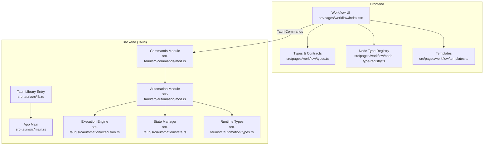
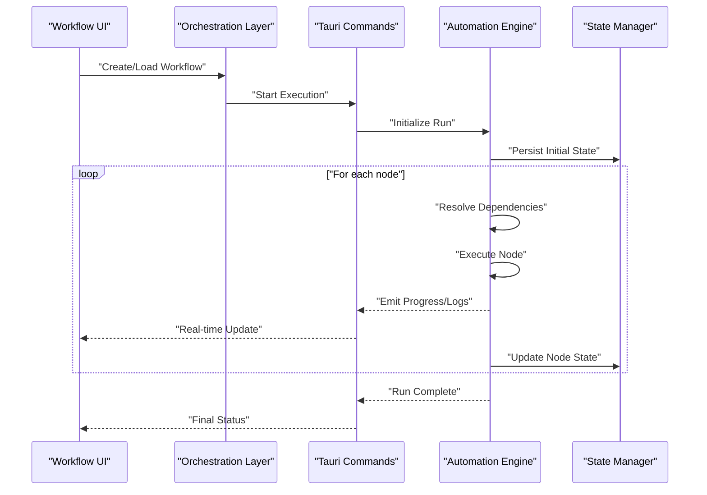
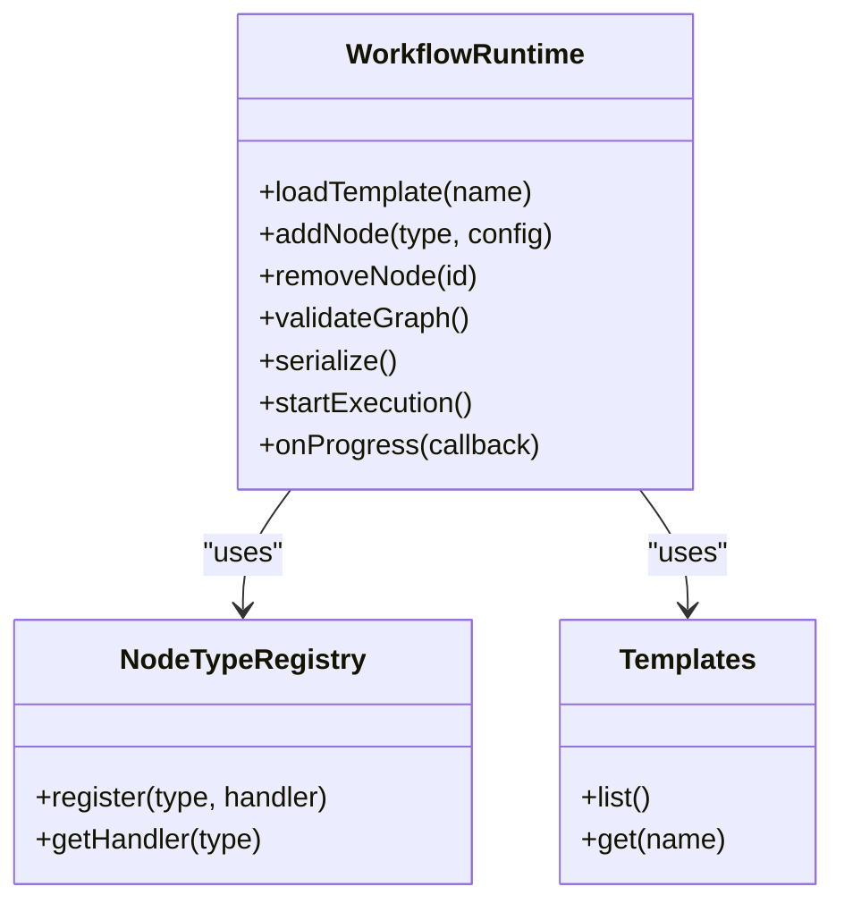
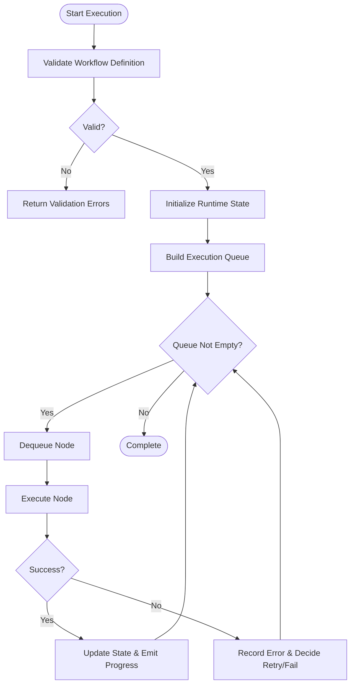
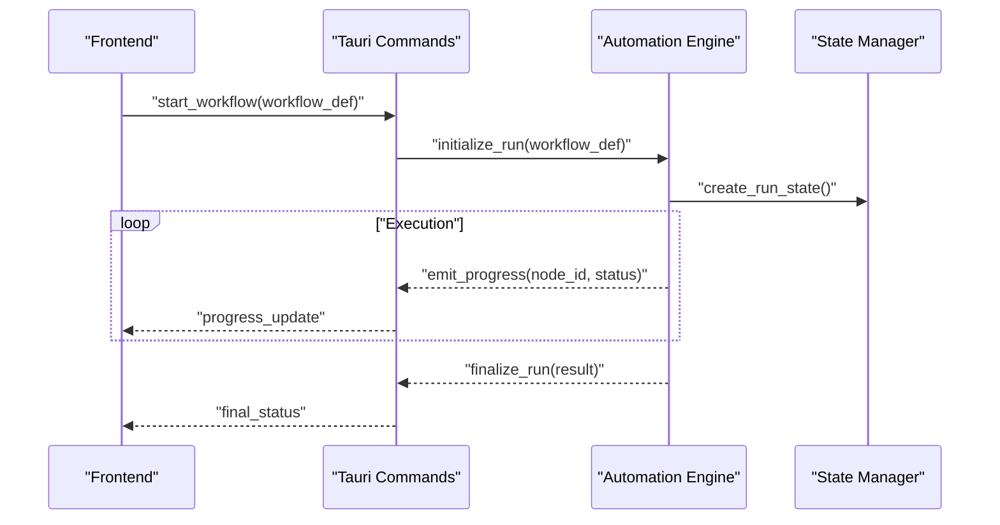
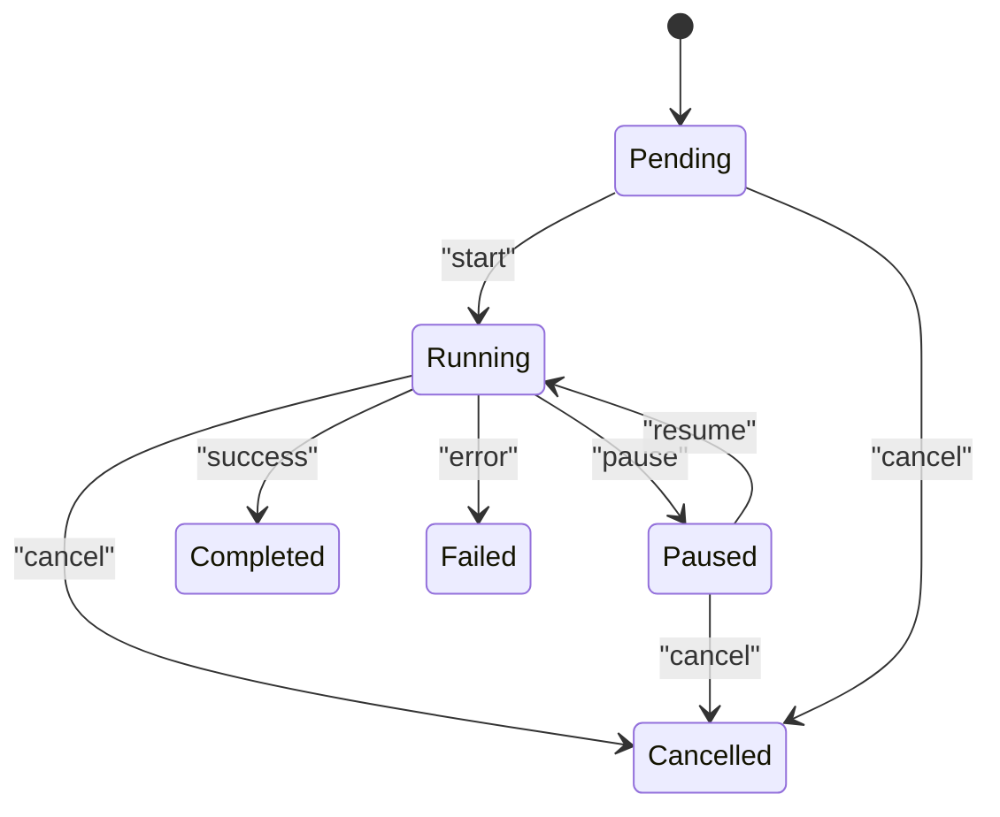
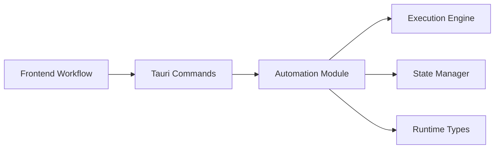

# AI Workflow Engine Architecture

<cite>
**Referenced Files in This Document**
- [workflow/index.tsx](file://src/pages/workflow/index.tsx)
- [workflow/types.ts](file://src/pages/workflow/types.ts)
- [workflow/node-type-registry.ts](file://src/pages/workflow/node-type-registry.ts)
- [workflow/templates.ts](file://src/pages/workflow/templates.ts)
- [automation/mod.rs](file://src-tauri/src/automation/mod.rs)
- [automation/execution.rs](file://src-tauri/src/automation/execution.rs)
- [automation/state.rs](file://src-tauri/src/automation/state.rs)
- [automation/types.rs](file://src-tauri/src/automation/types.rs)
- [commands/mod.rs](file://src-tauri/src/commands/mod.rs)
- [lib.rs](file://src-tauri/src/lib.rs)
- [main.rs](file://src-tauri/src/main.rs)
</cite>

## Table of Contents
1. [Introduction](#introduction)
2. [Project Structure](#project-structure)
3. [Core Components](#core-components)
4. [Architecture Overview](#architecture-overview)
5. [Detailed Component Analysis](#detailed-component-analysis)
6. [Dependency Analysis](#dependency-analysis)
7. [Performance Considerations](#performance-considerations)
8. [Troubleshooting Guide](#troubleshooting-guide)
9. [Conclusion](#conclusion)

## Introduction
This document explains the AI workflow engine architecture in Apprecon, focusing on how the frontend workflow components integrate with the backend Rust execution engine to orchestrate AI-powered automation. It covers the execution pipeline, state management, real-time updates, lifecycle management, error handling strategies, and performance optimization techniques. It also includes examples of workflow execution patterns, state transitions, and monitoring capabilities.

## Project Structure
The workflow system spans both the frontend (TypeScript/React) and the backend (Rust/Tauri):
- Frontend workflow UI and runtime orchestration live under src/pages/workflow.
- Backend execution engine and automation logic live under src-tauri/src/automation and are exposed via Tauri commands.

**Diagram sources**
- [workflow/index.tsx](file://src/pages/workflow/index.tsx)
- [workflow/types.ts](file://src/pages/workflow/types.ts)
- [workflow/node-type-registry.ts](file://src/pages/workflow/node-type-registry.ts)
- [workflow/templates.ts](file://src/pages/workflow/templates.ts)
- [lib.rs](file://src-tauri/src/lib.rs)
- [main.rs](file://src-tauri/src/main.rs)
- [commands/mod.rs](file://src-tauri/src/commands/mod.rs)
- [automation/mod.rs](file://src-tauri/src/automation/mod.rs)
- [automation/execution.rs](file://src-tauri/src/automation/execution.rs)
- [automation/state.rs](file://src-tauri/src/automation/state.rs)
- [automation/types.rs](file://src-tauri/src/automation/types.rs)

**Section sources**
- [workflow/index.tsx](file://src/pages/workflow/index.tsx)
- [workflow/types.ts](file://src/pages/workflow/types.ts)
- [workflow/node-type-registry.ts](file://src/pages/workflow/node-type-registry.ts)
- [workflow/templates.ts](file://src/pages/workflow/templates.ts)
- [lib.rs](file://src-tauri/src/lib.rs)
- [main.rs](file://src-tauri/src/main.rs)
- [commands/mod.rs](file://src-tauri/src/commands/mod.rs)
- [automation/mod.rs](file://src-tauri/src/automation/mod.rs)
- [automation/execution.rs](file://src-tauri/src/automation/execution.rs)
- [automation/state.rs](file://src-tauri/src/automation/state.rs)
- [automation/types.rs](file://src-tauri/src/automation/types.rs)

## Core Components
- Frontend Workflow Runtime: Manages node graph composition, user interactions, and dispatches execution requests to the backend via Tauri commands. It uses a registry for node types and templates for quick workflow creation.
- Backend Automation Engine: Executes workflows defined by nodes, manages runtime state, and provides real-time status updates through Tauri channels or events.
- Command Layer: Exposes functions to start, pause, resume, stop, and query workflow execution from the frontend.
- State Management: Tracks workflow run states, node statuses, and intermediate results for persistence and recovery.

Key responsibilities:
- Execution Pipeline: Parses workflow definitions, resolves dependencies, schedules tasks, and executes them deterministically.
- Real-Time Updates: Streams progress, logs, and partial outputs back to the UI.
- Error Handling: Captures failures at node boundaries, supports retries, and exposes diagnostics.
- Performance: Uses concurrency where safe, batches operations, and avoids blocking the main thread.

**Section sources**
- [workflow/index.tsx](file://src/pages/workflow/index.tsx)
- [workflow/types.ts](file://src/pages/workflow/types.ts)
- [workflow/node-type-registry.ts](file://src/pages/workflow/node-type-registry.ts)
- [workflow/templates.ts](file://src/pages/workflow/templates.ts)
- [automation/mod.rs](file://src-tauri/src/automation/mod.rs)
- [automation/execution.rs](file://src-tauri/src/automation/execution.rs)
- [automation/state.rs](file://src-tauri/src/automation/state.rs)
- [automation/types.rs](file://src-tauri/src/automation/types.rs)
- [commands/mod.rs](file://src-tauri/src/commands/mod.rs)

## Architecture Overview
The workflow engine follows a layered architecture:
- UI Layer: Renders the workflow canvas, handles user actions, and displays live status.
- Orchestration Layer: Validates workflow graphs, prepares execution context, and invokes backend commands.
- Execution Layer: Schedules and runs nodes, manages state, and emits events.
- Persistence Layer: Stores workflow definitions, run history, and artifacts.

**Diagram sources**
- [workflow/index.tsx](file://src/pages/workflow/index.tsx)
- [commands/mod.rs](file://src-tauri/src/commands/mod.rs)
- [automation/mod.rs](file://src-tauri/src/automation/mod.rs)
- [automation/execution.rs](file://src-tauri/src/automation/execution.rs)
- [automation/state.rs](file://src-tauri/src/automation/state.rs)

## Detailed Component Analysis

### Frontend Workflow Runtime
Responsibilities:
- Maintain the workflow graph (nodes and edges).
- Provide node type registration and template-based scaffolding.
- Validate inputs and serialize workflow definitions for backend execution.
- Subscribe to real-time updates and render progress.

**Diagram sources**
- [workflow/index.tsx](file://src/pages/workflow/index.tsx)
- [workflow/node-type-registry.ts](file://src/pages/workflow/node-type-registry.ts)
- [workflow/templates.ts](file://src/pages/workflow/templates.ts)

**Section sources**
- [workflow/index.tsx](file://src/pages/workflow/index.tsx)
- [workflow/node-type-registry.ts](file://src/pages/workflow/node-type-registry.ts)
- [workflow/templates.ts](file://src/pages/workflow/templates.ts)
- [workflow/types.ts](file://src/pages/workflow/types.ts)

### Backend Automation Engine
Responsibilities:
- Parse and validate workflow definitions.
- Schedule node execution respecting dependencies and concurrency limits.
- Manage runtime state and persist checkpoints.
- Emit progress and error events to the frontend.

**Diagram sources**
- [automation/execution.rs](file://src-tauri/src/automation/execution.rs)
- [automation/state.rs](file://src-tauri/src/automation/state.rs)
- [automation/types.rs](file://src-tauri/src/automation/types.rs)

**Section sources**
- [automation/mod.rs](file://src-tauri/src/automation/mod.rs)
- [automation/execution.rs](file://src-tauri/src/automation/execution.rs)
- [automation/state.rs](file://src-tauri/src/automation/state.rs)
- [automation/types.rs](file://src-tauri/src/automation/types.rs)

### Command Layer Integration
Responsibilities:
- Expose Tauri commands for workflow lifecycle operations.
- Bridge frontend calls to backend execution and state APIs.
- Stream real-time updates back to the UI.

**Diagram sources**
- [commands/mod.rs](file://src-tauri/src/commands/mod.rs)
- [automation/mod.rs](file://src-tauri/src/automation/mod.rs)
- [automation/execution.rs](file://src-tauri/src/automation/execution.rs)
- [automation/state.rs](file://src-tauri/src/automation/state.rs)

**Section sources**
- [commands/mod.rs](file://src-tauri/src/commands/mod.rs)
- [automation/mod.rs](file://src-tauri/src/automation/mod.rs)
- [automation/execution.rs](file://src-tauri/src/automation/execution.rs)
- [automation/state.rs](file://src-tauri/src/automation/state.rs)

### State Management and Transitions
Workflow run states typically include:
- Pending: Awaiting execution.
- Running: Active execution.
- Paused: Temporarily halted.
- Completed: Finished successfully.
- Failed: Terminated due to errors.
- Cancelled: Interrupted by user.

**Diagram sources**
- [automation/state.rs](file://src-tauri/src/automation/state.rs)
- [automation/types.rs](file://src-tauri/src/automation/types.rs)

**Section sources**
- [automation/state.rs](file://src-tauri/src/automation/state.rs)
- [automation/types.rs](file://src-tauri/src/automation/types.rs)

### Monitoring and Real-Time Updates
- Progress Events: Emitted per node execution with status, logs, and partial outputs.
- Live Dashboard: UI subscribes to events and updates node visuals accordingly.
- Diagnostics: Error messages, stack traces, and context captured for debugging.

**Section sources**
- [automation/execution.rs](file://src-tauri/src/automation/execution.rs)
- [commands/mod.rs](file://src-tauri/src/commands/mod.rs)

## Dependency Analysis
The workflow engine has clear separation between UI and execution layers, connected via Tauri commands. The backend modules are cohesive around automation concerns.

**Diagram sources**
- [commands/mod.rs](file://src-tauri/src/commands/mod.rs)
- [automation/mod.rs](file://src-tauri/src/automation/mod.rs)
- [automation/execution.rs](file://src-tauri/src/automation/execution.rs)
- [automation/state.rs](file://src-tauri/src/automation/state.rs)
- [automation/types.rs](file://src-tauri/src/automation/types.rs)

**Section sources**
- [commands/mod.rs](file://src-tauri/src/commands/mod.rs)
- [automation/mod.rs](file://src-tauri/src/automation/mod.rs)
- [automation/execution.rs](file://src-tauri/src/automation/execution.rs)
- [automation/state.rs](file://src-tauri/src/automation/state.rs)
- [automation/types.rs](file://src-tauri/src/automation/types.rs)

## Performance Considerations
- Concurrency: Execute independent nodes concurrently while respecting resource constraints.
- Batching: Group small operations to reduce overhead.
- Streaming: Use event streaming for progress to avoid large payloads.
- Caching: Cache reusable artifacts and model responses when safe.
- Backpressure: Limit queue size to prevent memory spikes during long runs.
- I/O Optimization: Use asynchronous I/O for file and network operations.

[No sources needed since this section provides general guidance]

## Troubleshooting Guide
Common issues and resolutions:
- Validation Errors: Ensure workflow definitions match expected schemas; check node configurations and required fields.
- Execution Failures: Inspect node-level error logs; consider retry policies and environment prerequisites.
- State Inconsistencies: Re-initialize run state if corrupted; verify checkpoint integrity.
- Real-Time Updates Missing: Confirm command channel subscriptions and event emission paths.

**Section sources**
- [automation/execution.rs](file://src-tauri/src/automation/execution.rs)
- [automation/state.rs](file://src-tauri/src/automation/state.rs)
- [commands/mod.rs](file://src-tauri/src/commands/mod.rs)

## Conclusion
The AI workflow engine in Apprecon combines a responsive frontend with a robust Rust backend to deliver reliable, observable, and high-performance automation. By separating orchestration, execution, and state management, it enables scalable workflows with clear lifecycle control, comprehensive error handling, and real-time monitoring. Adopting the recommended patterns ensures maintainability and extensibility as new AI tools and integrations are added.