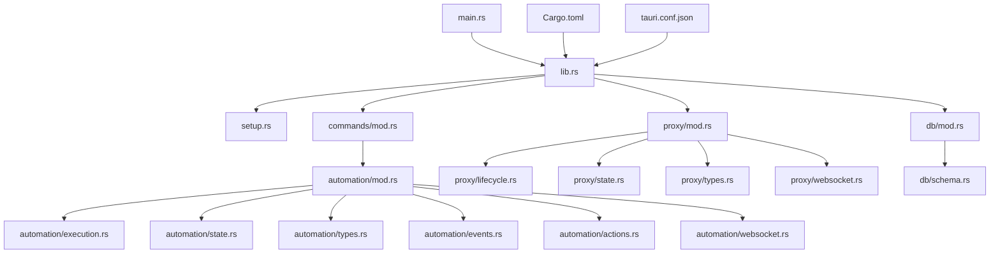
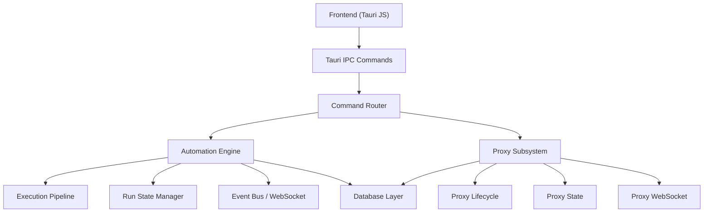
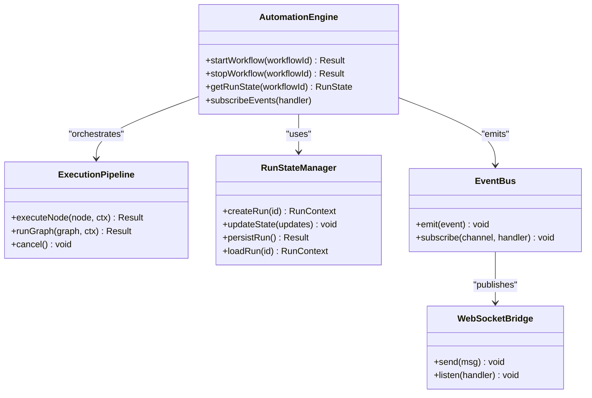
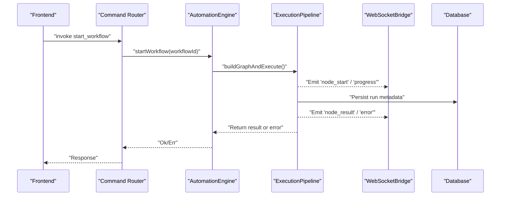
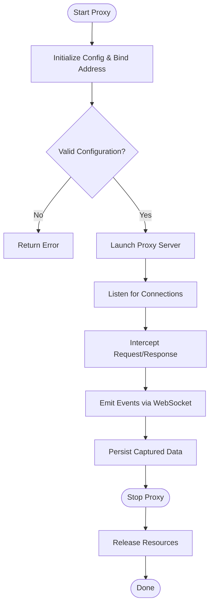
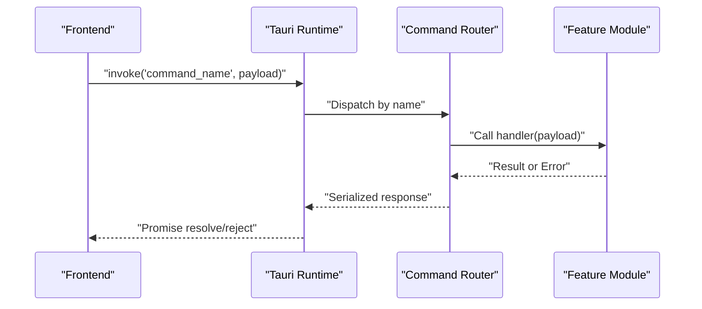
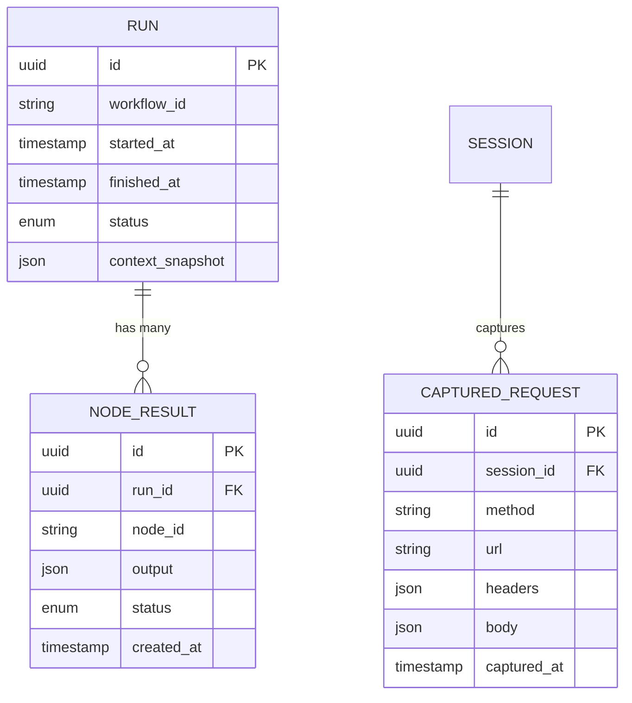
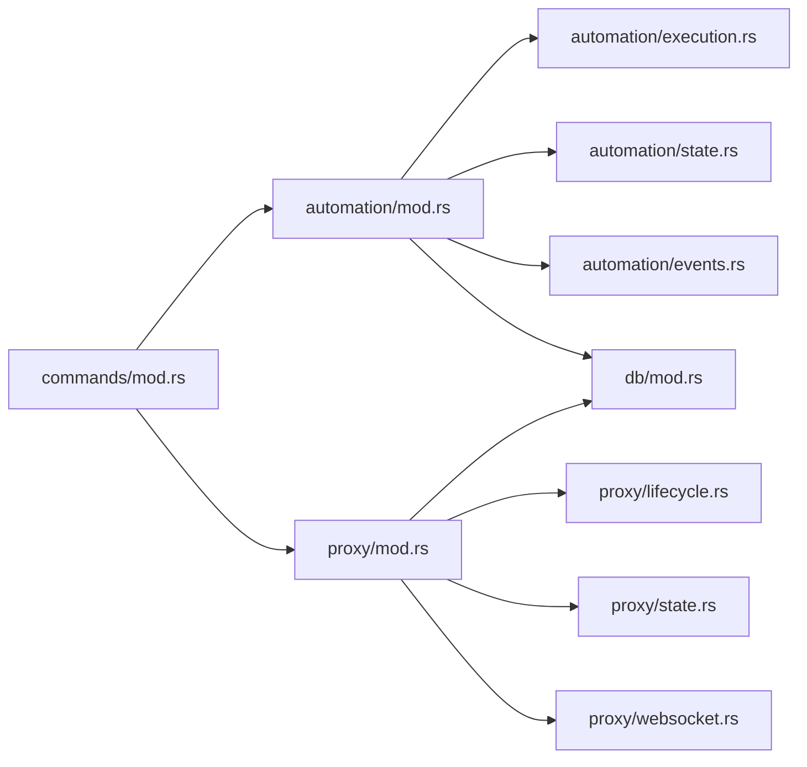

# Backend Execution Engine

<cite>
**Referenced Files in This Document**
- [src-tauri/src/lib.rs](file://src-tauri/src/lib.rs)
- [src-tauri/src/main.rs](file://src-tauri/src/main.rs)
- [src-tauri/src/setup.rs](file://src-tauri/src/setup.rs)
- [src-tauri/src/commands/mod.rs](file://src-tauri/src/commands/mod.rs)
- [src-tauri/src/automation/mod.rs](file://src-tauri/src/automation/mod.rs)
- [src-tauri/src/automation/execution.rs](file://src-tauri/src/automation/execution.rs)
- [src-tauri/src/automation/state.rs](file://src-tauri/src/automation/state.rs)
- [src-tauri/src/automation/types.rs](file://src-tauri/src/automation/types.rs)
- [src-tauri/src/automation/events.rs](file://src-tauri/src/automation/events.rs)
- [src-tauri/src/automation/actions.rs](file://src-tauri/src/automation/actions.rs)
- [src-tauri/src/automation/websocket.rs](file://src-tauri/src/automation/websocket.rs)
- [src-tauri/src/proxy/mod.rs](file://src-tauri/src/proxy/mod.rs)
- [src-tauri/src/proxy/lifecycle.rs](file://src-tauri/src/proxy/lifecycle.rs)
- [src-tauri/src/proxy/state.rs](file://src-tauri/src/proxy/state.rs)
- [src-tauri/src/proxy/types.rs](file://src-tauri/src/proxy/types.rs)
- [src-tauri/src/proxy/websocket.rs](file://src-tauri/src/proxy/websocket.rs)
- [src-tauri/src/db/mod.rs](file://src-tauri/src/db/mod.rs)
- [src-tauri/src/db/schema.rs](file://src-tauri/src/db/schema.rs)
- [src-tauri/Cargo.toml](file://src-tauri/Cargo.toml)
- [src-tauri/tauri.conf.json](file://src-tauri/tauri.conf.json)
</cite>

## Table of Contents
1. [Introduction](#introduction)
2. [Project Structure](#project-structure)
3. [Core Components](#core-components)
4. [Architecture Overview](#architecture-overview)
5. [Detailed Component Analysis](#detailed-component-analysis)
6. [Dependency Analysis](#dependency-analysis)
7. [Performance Considerations](#performance-considerations)
8. [Troubleshooting Guide](#troubleshooting-guide)
9. [Conclusion](#conclusion)

## Introduction
This document explains the Rust backend execution engine that powers workflow automation within the Tauri application. It focuses on how native modules process workflow nodes, manage execution context, and handle asynchronous operations. It also documents the IPC layer between the frontend and backend, error propagation strategies, performance optimizations, state persistence, and resource management patterns used across the system.

## Project Structure
The Rust backend is organized into feature-oriented modules under src-tauri/src:
- Entry points and initialization: main.rs, lib.rs, setup.rs
- Command routing for IPC: commands/mod.rs
- Automation subsystem: automation/* (execution, state, types, events, actions, websocket)
- Proxy subsystem: proxy/* (lifecycle, state, types, websocket)
- Database access: db/* (mod, schema)
- Configuration and packaging: Cargo.toml, tauri.conf.json

**Diagram sources**
- [src-tauri/src/main.rs](file://src-tauri/src/main.rs)
- [src-tauri/src/lib.rs](file://src-tauri/src/lib.rs)
- [src-tauri/src/setup.rs](file://src-tauri/src/setup.rs)
- [src-tauri/src/commands/mod.rs](file://src-tauri/src/commands/mod.rs)
- [src-tauri/src/automation/mod.rs](file://src-tauri/src/automation/mod.rs)
- [src-tauri/src/proxy/mod.rs](file://src-tauri/src/proxy/mod.rs)
- [src-tauri/src/db/mod.rs](file://src-tauri/src/db/mod.rs)
- [src-tauri/Cargo.toml](file://src-tauri/Cargo.toml)
- [src-tauri/tauri.conf.json](file://src-tauri/tauri.conf.json)

**Section sources**
- [src-tauri/src/main.rs](file://src-tauri/src/main.rs)
- [src-tauri/src/lib.rs](file://src-tauri/src/lib.rs)
- [src-tauri/src/setup.rs](file://src-tauri/src/setup.rs)
- [src-tauri/src/commands/mod.rs](file://src-tauri/src/commands/mod.rs)
- [src-tauri/Cargo.toml](file://src-tauri/Cargo.toml)
- [src-tauri/tauri.conf.json](file://src-tauri/tauri.conf.json)

## Core Components
- IPC command router: Exposes Tauri commands to the frontend and dispatches them to domain handlers.
- Automation engine: Orchestrates workflow node execution, maintains per-run state, emits lifecycle events, and integrates with WebSocket channels for real-time updates.
- Proxy subsystem: Manages lifecycle and state of the HTTP proxy, exposes events and configuration via WebSocket.
- Persistence layer: Provides database access and schema definitions for durable storage of workflows, runs, and related artifacts.

Key responsibilities:
- Node execution pipeline with async task scheduling and cancellation.
- Context scoping and variable resolution across nodes.
- Event-driven progress reporting and error propagation back to the UI.
- Resource cleanup and safe shutdown.

**Section sources**
- [src-tauri/src/commands/mod.rs](file://src-tauri/src/commands/mod.rs)
- [src-tauri/src/automation/mod.rs](file://src-tauri/src/automation/mod.rs)
- [src-tauri/src/automation/execution.rs](file://src-tauri/src/automation/execution.rs)
- [src-tauri/src/automation/state.rs](file://src-tauri/src/automation/state.rs)
- [src-tauri/src/automation/types.rs](file://src-tauri/src/automation/types.rs)
- [src-tauri/src/automation/events.rs](file://src-tauri/src/automation/events.rs)
- [src-tauri/src/automation/actions.rs](file://src-tauri/src/automation/actions.rs)
- [src-tauri/src/automation/websocket.rs](file://src-tauri/src/automation/websocket.rs)
- [src-tauri/src/proxy/mod.rs](file://src-tauri/src/proxy/mod.rs)
- [src-tauri/src/proxy/lifecycle.rs](file://src-tauri/src/proxy/lifecycle.rs)
- [src-tauri/src/proxy/state.rs](file://src-tauri/src/proxy/state.rs)
- [src-tauri/src/proxy/types.rs](file://src-tauri/src/proxy/types.rs)
- [src-tauri/src/proxy/websocket.rs](file://src-tauri/src/proxy/websocket.rs)
- [src-tauri/src/db/mod.rs](file://src-tauri/src/db/mod.rs)
- [src-tauri/src/db/schema.rs](file://src-tauri/src/db/schema.rs)

## Architecture Overview
The backend follows a layered architecture:
- Frontend calls Tauri commands over IPC.
- Commands route to automation or proxy handlers.
- Automation orchestrates node execution using an event bus and WebSocket channel for live updates.
- Proxy manages network interception and forwards events to the frontend.
- Database module persists state and results.

**Diagram sources**
- [src-tauri/src/commands/mod.rs](file://src-tauri/src/commands/mod.rs)
- [src-tauri/src/automation/mod.rs](file://src-tauri/src/automation/mod.rs)
- [src-tauri/src/automation/execution.rs](file://src-tauri/src/automation/execution.rs)
- [src-tauri/src/automation/state.rs](file://src-tauri/src/automation/state.rs)
- [src-tauri/src/automation/events.rs](file://src-tauri/src/automation/events.rs)
- [src-tauri/src/automation/websocket.rs](file://src-tauri/src/automation/websocket.rs)
- [src-tauri/src/proxy/mod.rs](file://src-tauri/src/proxy/mod.rs)
- [src-tauri/src/proxy/lifecycle.rs](file://src-tauri/src/proxy/lifecycle.rs)
- [src-tauri/src/proxy/state.rs](file://src-tauri/src/proxy/state.rs)
- [src-tauri/src/proxy/websocket.rs](file://src-tauri/src/proxy/websocket.rs)
- [src-tauri/src/db/mod.rs](file://src-tauri/src/db/mod.rs)

## Detailed Component Analysis

### Automation Engine
The automation engine coordinates workflow execution:
- Parses and validates workflow definitions.
- Builds an execution graph and schedules tasks.
- Maintains per-run context and variables.
- Emits lifecycle events and progress updates through WebSocket.
- Persists run metadata and outputs.

**Diagram sources**
- [src-tauri/src/automation/mod.rs](file://src-tauri/src/automation/mod.rs)
- [src-tauri/src/automation/execution.rs](file://src-tauri/src/automation/execution.rs)
- [src-tauri/src/automation/state.rs](file://src-tauri/src/automation/state.rs)
- [src-tauri/src/automation/events.rs](file://src-tauri/src/automation/events.rs)
- [src-tauri/src/automation/websocket.rs](file://src-tauri/src/automation/websocket.rs)

#### Node Execution Flow

**Diagram sources**
- [src-tauri/src/commands/mod.rs](file://src-tauri/src/commands/mod.rs)
- [src-tauri/src/automation/execution.rs](file://src-tauri/src/automation/execution.rs)
- [src-tauri/src/automation/websocket.rs](file://src-tauri/src/automation/websocket.rs)
- [src-tauri/src/db/mod.rs](file://src-tauri/src/db/mod.rs)

**Section sources**
- [src-tauri/src/automation/execution.rs](file://src-tauri/src/automation/execution.rs)
- [src-tauri/src/automation/state.rs](file://src-tauri/src/automation/state.rs)
- [src-tauri/src/automation/types.rs](file://src-tauri/src/automation/types.rs)
- [src-tauri/src/automation/events.rs](file://src-tauri/src/automation/events.rs)
- [src-tauri/src/automation/actions.rs](file://src-tauri/src/automation/actions.rs)
- [src-tauri/src/automation/websocket.rs](file://src-tauri/src/automation/websocket.rs)

### Proxy Subsystem
The proxy subsystem controls HTTP interception:
- Lifecycle management for starting/stopping the proxy.
- State tracking for active sessions and captured traffic.
- WebSocket bridge to stream events and payloads to the frontend.

**Diagram sources**
- [src-tauri/src/proxy/lifecycle.rs](file://src-tauri/src/proxy/lifecycle.rs)
- [src-tauri/src/proxy/state.rs](file://src-tauri/src/proxy/state.rs)
- [src-tauri/src/proxy/types.rs](file://src-tauri/src/proxy/types.rs)
- [src-tauri/src/proxy/websocket.rs](file://src-tauri/src/proxy/websocket.rs)

**Section sources**
- [src-tauri/src/proxy/mod.rs](file://src-tauri/src/proxy/mod.rs)
- [src-tauri/src/proxy/lifecycle.rs](file://src-tauri/src/proxy/lifecycle.rs)
- [src-tauri/src/proxy/state.rs](file://src-tauri/src/proxy/state.rs)
- [src-tauri/src/proxy/types.rs](file://src-tauri/src/proxy/types.rs)
- [src-tauri/src/proxy/websocket.rs](file://src-tauri/src/proxy/websocket.rs)

### IPC Communication Layer
Tauri commands expose functionality to the frontend:
- Commands are registered in the command router.
- Each command maps to a handler function that delegates to automation or proxy modules.
- Responses are serialized and returned to the frontend; errors are propagated as structured results.

**Diagram sources**
- [src-tauri/src/commands/mod.rs](file://src-tauri/src/commands/mod.rs)
- [src-tauri/src/automation/mod.rs](file://src-tauri/src/automation/mod.rs)
- [src-tauri/src/proxy/mod.rs](file://src-tauri/src/proxy/mod.rs)

**Section sources**
- [src-tauri/src/commands/mod.rs](file://src-tauri/src/commands/mod.rs)

### State Persistence and Resource Management
- Database module provides schema definitions and repository abstractions.
- Automation persists run metadata, node outputs, and checkpoints.
- Proxy persists captured requests/responses and session state.
- Resource management ensures proper cleanup on shutdown or cancellation.

**Diagram sources**
- [src-tauri/src/db/schema.rs](file://src-tauri/src/db/schema.rs)
- [src-tauri/src/db/mod.rs](file://src-tauri/src/db/mod.rs)

**Section sources**
- [src-tauri/src/db/mod.rs](file://src-tauri/src/db/mod.rs)
- [src-tauri/src/db/schema.rs](file://src-tauri/src/db/schema.rs)

## Dependency Analysis
The backend exhibits clear separation of concerns:
- Commands depend on automation and proxy modules.
- Automation depends on execution, state, events, and database.
- Proxy depends on lifecycle, state, and websocket utilities.
- Shared types and configuration are centralized.

**Diagram sources**
- [src-tauri/src/commands/mod.rs](file://src-tauri/src/commands/mod.rs)
- [src-tauri/src/automation/mod.rs](file://src-tauri/src/automation/mod.rs)
- [src-tauri/src/automation/execution.rs](file://src-tauri/src/automation/execution.rs)
- [src-tauri/src/automation/state.rs](file://src-tauri/src/automation/state.rs)
- [src-tauri/src/automation/events.rs](file://src-tauri/src/automation/events.rs)
- [src-tauri/src/proxy/mod.rs](file://src-tauri/src/proxy/mod.rs)
- [src-tauri/src/proxy/lifecycle.rs](file://src-tauri/src/proxy/lifecycle.rs)
- [src-tauri/src/proxy/state.rs](file://src-tauri/src/proxy/state.rs)
- [src-tauri/src/proxy/websocket.rs](file://src-tauri/src/proxy/websocket.rs)
- [src-tauri/src/db/mod.rs](file://src-tauri/src/db/mod.rs)

**Section sources**
- [src-tauri/src/commands/mod.rs](file://src-tauri/src/commands/mod.rs)
- [src-tauri/src/automation/mod.rs](file://src-tauri/src/automation/mod.rs)
- [src-tauri/src/proxy/mod.rs](file://src-tauri/src/proxy/mod.rs)
- [src-tauri/src/db/mod.rs](file://src-tauri/src/db/mod.rs)

## Performance Considerations
- Asynchronous execution: Use async I/O for network and disk operations to avoid blocking the runtime.
- Event streaming: Stream progress and logs via WebSocket to reduce payload size and improve responsiveness.
- Batched persistence: Group writes where possible to minimize database contention.
- Resource pooling: Reuse connections and buffers for repeated operations.
- Cancellation: Implement graceful cancellation to release resources promptly and prevent leaks.
- Backpressure: Apply limits on concurrent tasks and queue sizes to maintain stability under load.

[No sources needed since this section provides general guidance]

## Troubleshooting Guide
Common issues and resolutions:
- IPC failures: Verify command registration and payload serialization; check error responses from handlers.
- Node execution hangs: Inspect event emissions and WebSocket connectivity; ensure timeouts and cancellation paths are exercised.
- Proxy startup errors: Validate configuration and port availability; review lifecycle logs for binding failures.
- Persistence errors: Check database schema migrations and connection settings; validate transaction boundaries.

**Section sources**
- [src-tauri/src/commands/mod.rs](file://src-tauri/src/commands/mod.rs)
- [src-tauri/src/automation/execution.rs](file://src-tauri/src/automation/execution.rs)
- [src-tauri/src/proxy/lifecycle.rs](file://src-tauri/src/proxy/lifecycle.rs)
- [src-tauri/src/db/mod.rs](file://src-tauri/src/db/mod.rs)

## Conclusion
The Rust backend execution engine provides a robust, modular foundation for workflow automation and proxy-based interception. Its design emphasizes clear separation of concerns, asynchronous execution, event-driven communication, and durable state management. By following the documented patterns for node execution, IPC usage, error propagation, and resource handling, developers can extend capabilities safely and efficiently.

[No sources needed since this section summarizes without analyzing specific files]