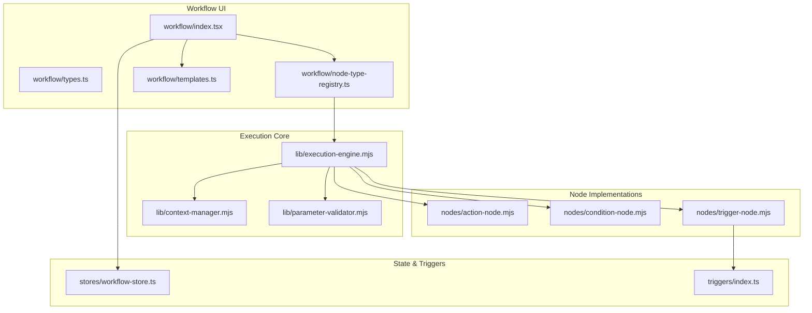
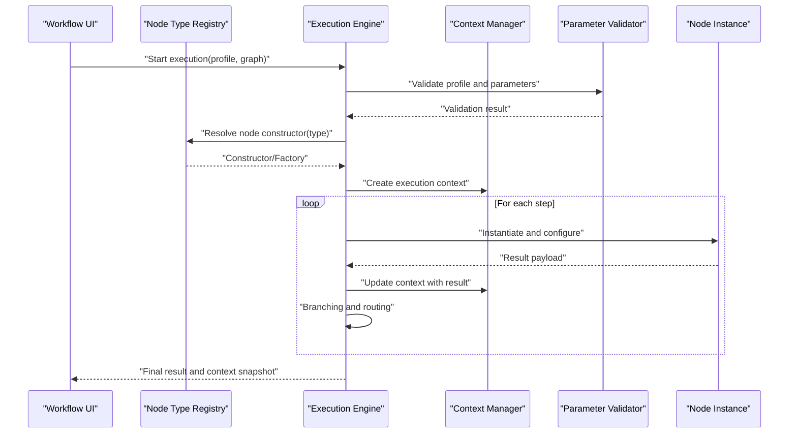
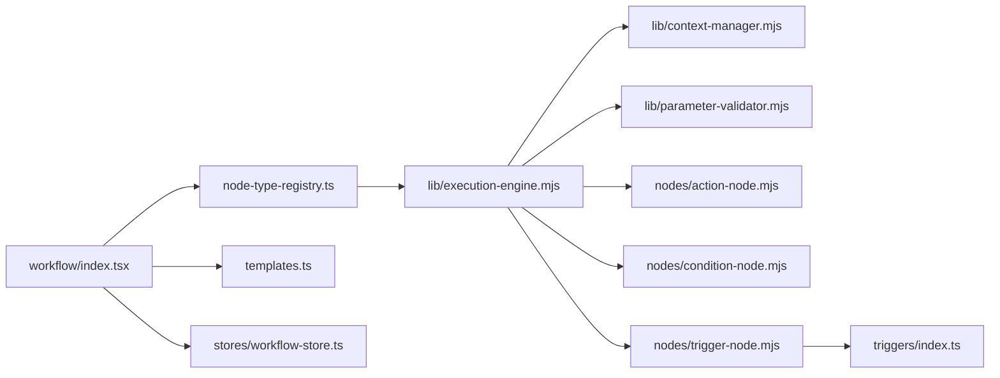

# Node Execution Pipeline

<cite>
**Referenced Files in This Document**
- [src/pages/workflow/index.tsx](file://src/pages/workflow/index.tsx)
- [src/pages/workflow/types.ts](file://src/pages/workflow/types.ts)
- [src/pages/workflow/node-type-registry.ts](file://src/pages/workflow/node-type-registry.ts)
- [src/pages/workflow/templates.ts](file://src/pages/workflow/templates.ts)
- [src/pages/workflow/lib/execution-engine.mjs](file://src/pages/workflow/lib/execution-engine.mjs)
- [src/pages/workflow/lib/context-manager.mjs](file://src/pages/workflow/lib/context-manager.mjs)
- [src/pages/workflow/lib/parameter-validator.mjs](file://src/pages/workflow/lib/parameter-validator.mjs)
- [src/pages/workflow/nodes/action-node.mjs](file://src/pages/workflow/nodes/action-node.mjs)
- [src/pages/workflow/nodes/condition-node.mjs](file://src/pages/workflow/nodes/condition-node.mjs)
- [src/pages/workflow/nodes/trigger-node.mjs](file://src/pages/workflow/nodes/trigger-node.mjs)
- [src/stores/workflow-store.ts](file://src/stores/workflow-store.ts)
- [src/triggers/index.ts](file://src/triggers/index.ts)
</cite>

## Table of Contents
1. [Introduction](#introduction)
2. [Project Structure](#project-structure)
3. [Core Components](#core-components)
4. [Architecture Overview](#architecture-overview)
5. [Detailed Component Analysis](#detailed-component-analysis)
6. [Dependency Analysis](#dependency-analysis)
7. [Performance Considerations](#performance-considerations)
8. [Troubleshooting Guide](#troubleshooting-guide)
9. [Conclusion](#conclusion)

## Introduction
This document explains the node execution pipeline architecture used to build, configure, and run workflow nodes of different types: actions, conditions, and triggers. It covers the factory pattern for node instantiation, profile-based configuration, execution context management, parameter validation, and result processing. The goal is to provide a clear mental model for both new contributors and experienced developers extending or debugging the pipeline.

## Project Structure
The workflow subsystem lives under src/pages/workflow with supporting modules for execution, context, validation, and node implementations. Triggers are also exposed through a dedicated registry.

**Diagram sources**
- [src/pages/workflow/index.tsx](file://src/pages/workflow/index.tsx)
- [src/pages/workflow/node-type-registry.ts](file://src/pages/workflow/node-type-registry.ts)
- [src/pages/workflow/templates.ts](file://src/pages/workflow/templates.ts)
- [src/pages/workflow/lib/execution-engine.mjs](file://src/pages/workflow/lib/execution-engine.mjs)
- [src/pages/workflow/lib/context-manager.mjs](file://src/pages/workflow/lib/context-manager.mjs)
- [src/pages/workflow/lib/parameter-validator.mjs](file://src/pages/workflow/lib/parameter-validator.mjs)
- [src/pages/workflow/nodes/action-node.mjs](file://src/pages/workflow/nodes/action-node.mjs)
- [src/pages/workflow/nodes/condition-node.mjs](file://src/pages/workflow/nodes/condition-node.mjs)
- [src/pages/workflow/nodes/trigger-node.mjs](file://src/pages/workflow/nodes/trigger-node.mjs)
- [src/stores/workflow-store.ts](file://src/stores/workflow-store.ts)
- [src/triggers/index.ts](file://src/triggers/index.ts)

**Section sources**
- [src/pages/workflow/index.tsx](file://src/pages/workflow/index.tsx)
- [src/pages/workflow/types.ts](file://src/pages/workflow/types.ts)
- [src/pages/workflow/node-type-registry.ts](file://src/pages/workflow/node-type-registry.ts)
- [src/pages/workflow/templates.ts](file://src/pages/workflow/templates.ts)
- [src/pages/workflow/lib/execution-engine.mjs](file://src/pages/workflow/lib/execution-engine.mjs)
- [src/pages/workflow/lib/context-manager.mjs](file://src/pages/workflow/lib/context-manager.mjs)
- [src/pages/workflow/lib/parameter-validator.mjs](file://src/pages/workflow/lib/parameter-validator.mjs)
- [src/pages/workflow/nodes/action-node.mjs](file://src/pages/workflow/nodes/action-node.mjs)
- [src/pages/workflow/nodes/condition-node.mjs](file://src/pages/workflow/nodes/condition-node.mjs)
- [src/pages/workflow/nodes/trigger-node.mjs](file://src/pages/workflow/nodes/trigger-node.mjs)
- [src/stores/workflow-store.ts](file://src/stores/workflow-store.ts)
- [src/triggers/index.ts](file://src/triggers/index.ts)

## Core Components
- Node Type Registry: Central mapping from node type identifiers to constructors/factories. Enables dynamic instantiation based on configuration.
- Execution Engine: Orchestrates lifecycle: load profile, validate parameters, create nodes, execute steps, manage context, and process results.
- Context Manager: Provides per-execution state (inputs, outputs, variables, error handling, and branching metadata).
- Parameter Validator: Validates node inputs against schemas defined in profiles or templates.
- Node Implementations: Concrete classes/modules for action, condition, and trigger nodes that implement standardized interfaces.
- Templates: Reusable node definitions and default configurations for quick setup.
- Workflow Store: Persistent state for workflows, including node graphs, profiles, and execution history.

Key responsibilities:
- Factory pattern decouples node creation from execution logic.
- Profile-based configuration allows environment-specific behavior without code changes.
- Context isolation ensures safe concurrent executions.
- Validation prevents runtime errors early.
- Result processing standardizes outputs across node types.

**Section sources**
- [src/pages/workflow/node-type-registry.ts](file://src/pages/workflow/node-type-registry.ts)
- [src/pages/workflow/lib/execution-engine.mjs](file://src/pages/workflow/lib/execution-engine.mjs)
- [src/pages/workflow/lib/context-manager.mjs](file://src/pages/workflow/lib/context-manager.mjs)
- [src/pages/workflow/lib/parameter-validator.mjs](file://src/pages/workflow/lib/parameter-validator.mjs)
- [src/pages/workflow/nodes/action-node.mjs](file://src/pages/workflow/nodes/action-node.mjs)
- [src/pages/workflow/nodes/condition-node.mjs](file://src/pages/workflow/nodes/condition-node.mjs)
- [src/pages/workflow/nodes/trigger-node.mjs](file://src/pages/workflow/nodes/trigger-node.mjs)
- [src/pages/workflow/templates.ts](file://src/pages/workflow/templates.ts)
- [src/stores/workflow-store.ts](file://src/stores/workflow-store.ts)

## Architecture Overview
The pipeline follows a layered design:
- UI layer composes workflows using templates and registers node types.
- Execution engine loads profiles, validates parameters, instantiates nodes via the registry, and executes them within an isolated context.
- Nodes perform work and return standardized results consumed by downstream nodes or the engine’s result processor.

**Diagram sources**
- [src/pages/workflow/index.tsx](file://src/pages/workflow/index.tsx)
- [src/pages/workflow/node-type-registry.ts](file://src/pages/workflow/node-type-registry.ts)
- [src/pages/workflow/lib/execution-engine.mjs](file://src/pages/workflow/lib/execution-engine.mjs)
- [src/pages/workflow/lib/context-manager.mjs](file://src/pages/workflow/lib/context-manager.mjs)
- [src/pages/workflow/lib/parameter-validator.mjs](file://src/pages/workflow/lib/parameter-validator.mjs)

## Detailed Component Analysis

### Node Type Registry
Responsibilities:
- Maintain a map of node type identifiers to constructors or factories.
- Provide lookup and registration APIs for adding custom node types at runtime.
- Support versioned or profile-scoped registrations if needed.

Design patterns:
- Registry pattern centralizes discovery and instantiation.
- Optional factory function enables dependency injection and lazy initialization.

Usage:
- Execution engine requests a constructor by type before creating a node instance.
- UI components can register additional node types dynamically.

**Section sources**
- [src/pages/workflow/node-type-registry.ts](file://src/pages/workflow/node-type-registry.ts)

### Execution Engine
Responsibilities:
- Load and parse workflow profiles.
- Validate parameters against schemas.
- Instantiate nodes via the registry.
- Manage execution context and orchestrate step execution.
- Process results and handle branching/routing.

Key flows:
- Start execution: receives profile and graph, initializes context, iterates steps.
- Step execution: resolves node type, creates instance, runs it, updates context.
- Error handling: captures exceptions, records diagnostics, supports retry policies.

Optimization opportunities:
- Parallel execution for independent branches.
- Caching of validated profiles and compiled schemas.

**Section sources**
- [src/pages/workflow/lib/execution-engine.mjs](file://src/pages/workflow/lib/execution-engine.mjs)

### Context Manager
Responsibilities:
- Provide per-execution storage for inputs, outputs, variables, and metadata.
- Expose methods to read/write shared state safely.
- Track execution history and diagnostics.

Design considerations:
- Immutable snapshots for reproducibility.
- Scoped variables to avoid cross-step contamination.
- Error propagation and recovery hooks.

**Section sources**
- [src/pages/workflow/lib/context-manager.mjs](file://src/pages/workflow/lib/context-manager.mjs)

### Parameter Validator
Responsibilities:
- Validate node parameters against schemas defined in profiles or templates.
- Enforce required fields, types, ranges, and custom rules.
- Produce actionable error messages for UI feedback.

Integration points:
- Called during execution start and when updating node configurations.
- Can be extended with custom validators per node type.

**Section sources**
- [src/pages/workflow/lib/parameter-validator.mjs](file://src/pages/workflow/lib/parameter-validator.mjs)

### Node Implementations

#### Action Node
Purpose:
- Performs side effects or computations (e.g., HTTP calls, file operations).
- Returns structured results consumed by subsequent nodes.

Interface expectations:
- Configurable inputs derived from profile/template.
- Standardized output shape for downstream consumption.

Extensibility:
- Implement a constructor compatible with the registry.
- Register under a unique type identifier.

**Section sources**
- [src/pages/workflow/nodes/action-node.mjs](file://src/pages/workflow/nodes/action-node.mjs)

#### Condition Node
Purpose:
- Evaluates boolean expressions based on context and inputs.
- Controls branching logic in the workflow graph.

Interface expectations:
- Input schema defines conditions and thresholds.
- Output includes branch selection and evaluation details.

Extensibility:
- Add custom condition evaluators via registry.

**Section sources**
- [src/pages/workflow/nodes/condition-node.mjs](file://src/pages/workflow/nodes/condition-node.mjs)

#### Trigger Node
Purpose:
- Listens to external events and initiates workflow execution.
- Bridges application events to the execution engine.

Integration:
- Uses triggers registry to subscribe to event sources.
- Converts events into workflow input payloads.

**Section sources**
- [src/pages/workflow/nodes/trigger-node.mjs](file://src/pages/workflow/nodes/trigger-node.mjs)
- [src/triggers/index.ts](file://src/triggers/index.ts)

### Templates and Profiles
Templates:
- Provide reusable node definitions and default configurations.
- Simplify authoring workflows by composing predefined blocks.

Profiles:
- Environment-specific settings (e.g., endpoints, credentials placeholders).
- Applied during execution to resolve concrete values.

Best practices:
- Keep templates declarative and minimal.
- Use profiles for sensitive or environment-dependent data.

**Section sources**
- [src/pages/workflow/templates.ts](file://src/pages/workflow/templates.ts)

### Workflow Store
Responsibilities:
- Persist workflow definitions, profiles, and execution history.
- Provide reactive updates to UI components.

Operations:
- Save/load workflows.
- Snapshot contexts after successful runs.
- Manage versions and rollbacks.

**Section sources**
- [src/stores/workflow-store.ts](file://src/stores/workflow-store.ts)

## Dependency Analysis
The following diagram shows how components depend on each other during execution.

**Diagram sources**
- [src/pages/workflow/index.tsx](file://src/pages/workflow/index.tsx)
- [src/pages/workflow/node-type-registry.ts](file://src/pages/workflow/node-type-registry.ts)
- [src/pages/workflow/templates.ts](file://src/pages/workflow/templates.ts)
- [src/stores/workflow-store.ts](file://src/stores/workflow-store.ts)
- [src/pages/workflow/lib/execution-engine.mjs](file://src/pages/workflow/lib/execution-engine.mjs)
- [src/pages/workflow/lib/context-manager.mjs](file://src/pages/workflow/lib/context-manager.mjs)
- [src/pages/workflow/lib/parameter-validator.mjs](file://src/pages/workflow/lib/parameter-validator.mjs)
- [src/pages/workflow/nodes/action-node.mjs](file://src/pages/workflow/nodes/action-node.mjs)
- [src/pages/workflow/nodes/condition-node.mjs](file://src/pages/workflow/nodes/condition-node.mjs)
- [src/pages/workflow/nodes/trigger-node.mjs](file://src/pages/workflow/nodes/trigger-node.mjs)
- [src/triggers/index.ts](file://src/triggers/index.ts)

**Section sources**
- [src/pages/workflow/index.tsx](file://src/pages/workflow/index.tsx)
- [src/pages/workflow/node-type-registry.ts](file://src/pages/workflow/node-type-registry.ts)
- [src/pages/workflow/lib/execution-engine.mjs](file://src/pages/workflow/lib/execution-engine.mjs)
- [src/pages/workflow/lib/context-manager.mjs](file://src/pages/workflow/lib/context-manager.mjs)
- [src/pages/workflow/lib/parameter-validator.mjs](file://src/pages/workflow/lib/parameter-validator.mjs)
- [src/pages/workflow/nodes/action-node.mjs](file://src/pages/workflow/nodes/action-node.mjs)
- [src/pages/workflow/nodes/condition-node.mjs](file://src/pages/workflow/nodes/condition-node.mjs)
- [src/pages/workflow/nodes/trigger-node.mjs](file://src/pages/workflow/nodes/trigger-node.mjs)
- [src/triggers/index.ts](file://src/triggers/index.ts)

## Performance Considerations
- Profile caching: Cache parsed profiles and compiled validation schemas to reduce startup time.
- Parallel execution: Execute independent branches concurrently where safe.
- Lazy loading: Defer node construction until execution to minimize memory footprint.
- Context snapshots: Use efficient serialization for history and rollback.
- Event-driven triggers: Avoid polling; use event subscriptions to reduce overhead.

[No sources needed since this section provides general guidance]

## Troubleshooting Guide
Common issues and resolutions:
- Invalid parameters: Check validation errors returned by the validator and ensure profile values match expected schemas.
- Node not found: Verify the node type is registered in the registry and the identifier matches exactly.
- Context errors: Inspect context snapshots to identify missing inputs or unexpected mutations.
- Trigger not firing: Confirm trigger subscription and event source availability.

Debugging tips:
- Enable detailed logs in the execution engine and context manager.
- Use workflow store snapshots to compare pre- and post-execution states.
- Isolate failing nodes by running minimal profiles.

**Section sources**
- [src/pages/workflow/lib/parameter-validator.mjs](file://src/pages/workflow/lib/parameter-validator.mjs)
- [src/pages/workflow/lib/context-manager.mjs](file://src/pages/workflow/lib/context-manager.mjs)
- [src/pages/workflow/lib/execution-engine.mjs](file://src/pages/workflow/lib/execution-engine.mjs)

## Conclusion
The node execution pipeline combines a registry-driven factory pattern, robust context management, and strict parameter validation to deliver a flexible and reliable workflow system. By adhering to standardized node interfaces and leveraging templates and profiles, developers can extend functionality quickly while maintaining consistency and performance.

[No sources needed since this section summarizes without analyzing specific files]