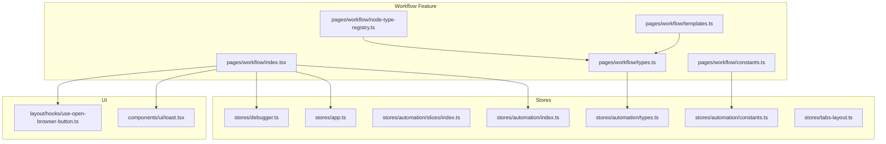
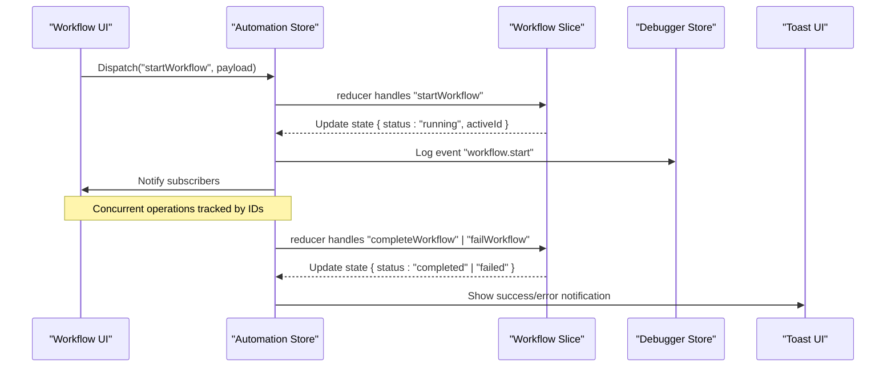
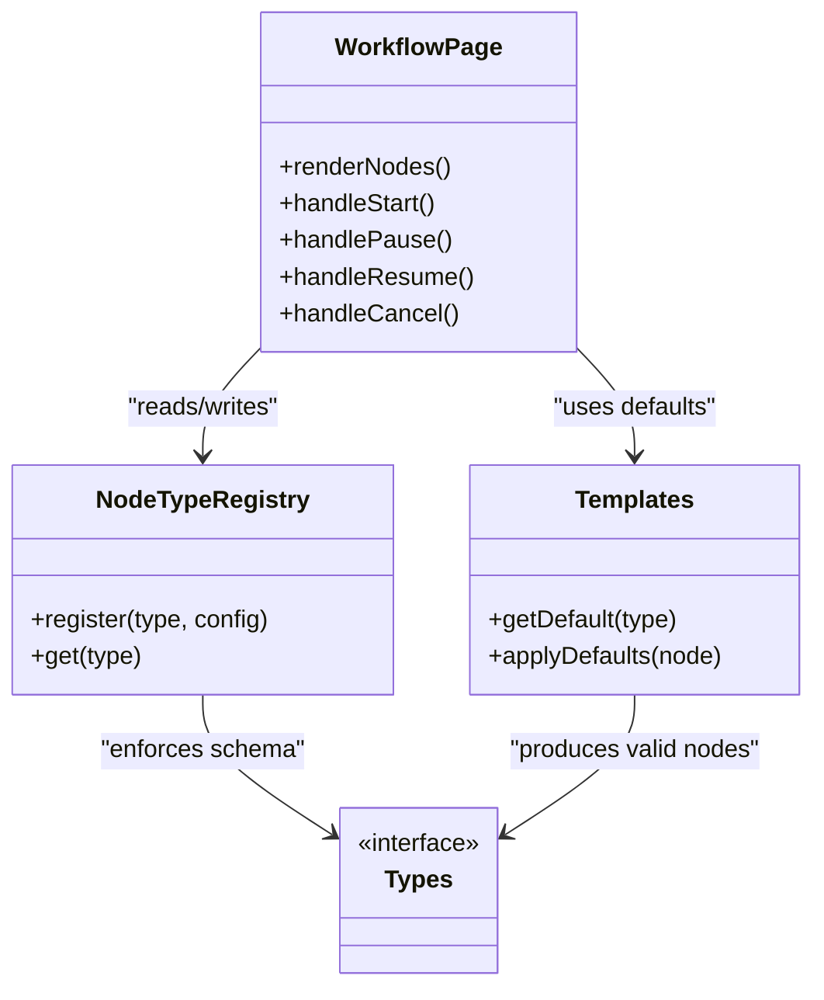
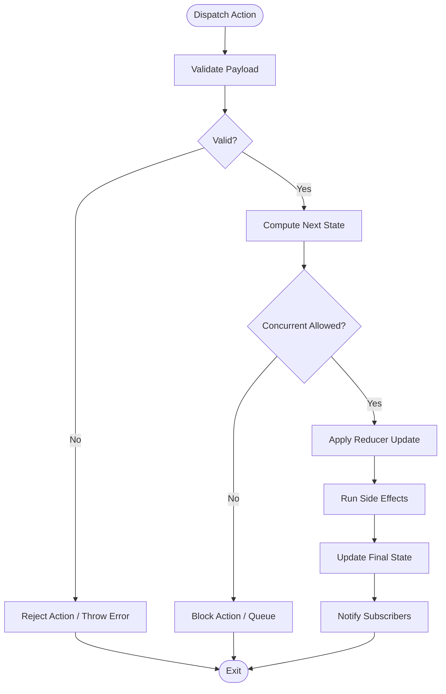
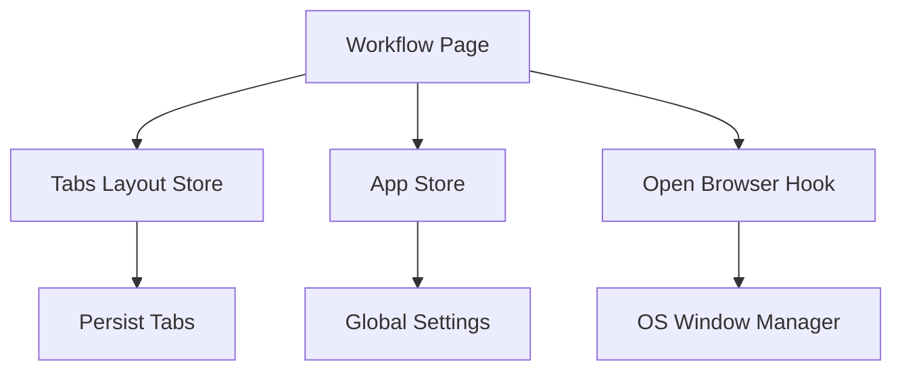
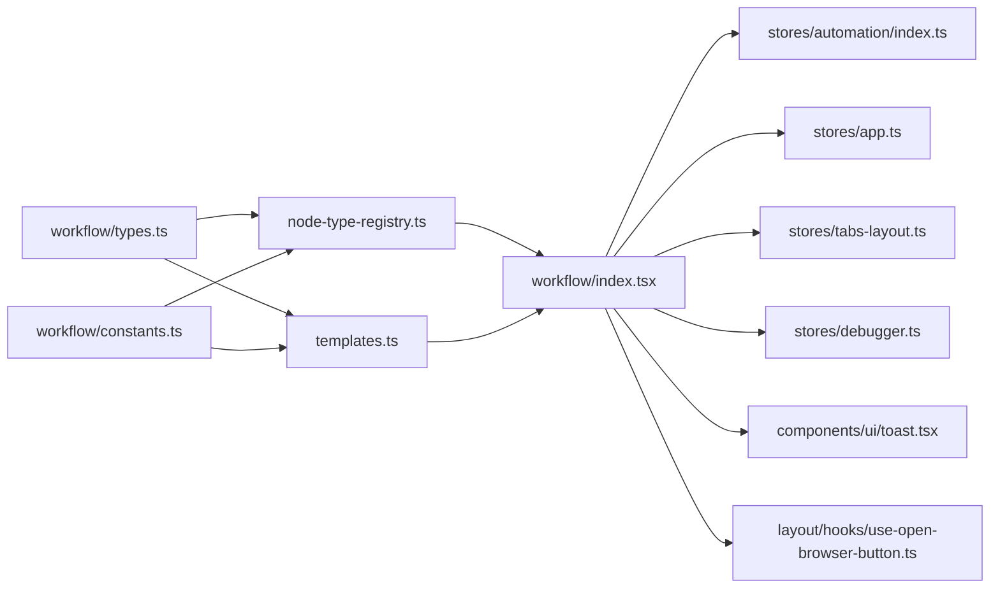

# State Management System

<cite>
**Referenced Files in This Document**
- [workflow/index.tsx](file://src/pages/workflow/index.tsx)
- [workflow/types.ts](file://src/pages/workflow/types.ts)
- [workflow/constants.ts](file://src/pages/workflow/constants.ts)
- [workflow/node-type-registry.ts](file://src/pages/workflow/node-type-registry.ts)
- [workflow/templates.ts](file://src/pages/workflow/templates.ts)
- [stores/app.ts](file://src/stores/app.ts)
- [stores/automation/index.ts](file://src/stores/automation/index.ts)
- [stores/automation/slices/index.ts](file://src/stores/automation/slices/index.ts)
- [stores/automation/types.ts](file://src/stores/automation/types.ts)
- [stores/automation/constants.ts](file://src/stores/automation/constants.ts)
- [stores/debugger.ts](file://src/stores/debugger.ts)
- [stores/tabs-layout.ts](file://src/stores/tabs-layout.ts)
- [layout/hooks/use-open-browser-button.ts](file://src/layout/hooks/use-open-browser-button.ts)
- [components/ui/toast.tsx](file://src/components/ui/toast.tsx)
</cite>

## Table of Contents
1. [Introduction](#introduction)
2. [Project Structure](#project-structure)
3. [Core Components](#core-components)
4. [Architecture Overview](#architecture-overview)
5. [Detailed Component Analysis](#detailed-component-analysis)
6. [Dependency Analysis](#dependency-analysis)
7. [Performance Considerations](#performance-considerations)
8. [Troubleshooting Guide](#troubleshooting-guide)
9. [Conclusion](#conclusion)
10. [Appendices](#appendices)

## Introduction
This document explains the workflow state management system that orchestrates execution, concurrency, and data consistency across the application. It focuses on how Redux slices manage workflow execution state, handle concurrent operations, and maintain consistent UI and runtime state. You will find:
- State schemas for workflows and automation
- Action creators and reducers used to orchestrate workflow steps
- Selectors for reading workflow state efficiently
- Examples of state transitions and error recovery patterns
- Debugging techniques using built-in debugging stores and toast notifications

## Project Structure
The workflow feature is implemented under src/pages/workflow with supporting store logic under src/stores. The key areas are:
- Workflow page and node registry: defines nodes, templates, and types
- Automation store: centralizes workflow execution state and actions
- App store: global app state including tabs and browser integration
- Debugger store: provides logging and inspection utilities
- UI components: provide feedback via toasts and layout hooks

**Diagram sources**
- [workflow/index.tsx](file://src/pages/workflow/index.tsx)
- [workflow/types.ts](file://src/pages/workflow/types.ts)
- [workflow/constants.ts](file://src/pages/workflow/constants.ts)
- [workflow/node-type-registry.ts](file://src/pages/workflow/node-type-registry.ts)
- [workflow/templates.ts](file://src/pages/workflow/templates.ts)
- [stores/app.ts](file://src/stores/app.ts)
- [stores/automation/index.ts](file://src/stores/automation/index.ts)
- [stores/automation/slices/index.ts](file://src/stores/automation/slices/index.ts)
- [stores/automation/types.ts](file://src/stores/automation/types.ts)
- [stores/automation/constants.ts](file://src/stores/automation/constants.ts)
- [stores/debugger.ts](file://src/stores/debugger.ts)
- [stores/tabs-layout.ts](file://src/stores/tabs-layout.ts)
- [components/ui/toast.tsx](file://src/components/ui/toast.tsx)
- [layout/hooks/use-open-browser-button.ts](file://src/layout/hooks/use-open-browser-button.ts)

**Section sources**
- [workflow/index.tsx](file://src/pages/workflow/index.tsx)
- [stores/automation/index.ts](file://src/stores/automation/index.ts)
- [stores/app.ts](file://src/stores/app.ts)

## Core Components
This section outlines the core pieces that implement workflow state management:
- Workflow page component: coordinates UI interactions and dispatches actions
- Automation store and slices: define state shape, action creators, and reducers
- Types and constants: enforce schema and shared values
- Node registry and templates: map node types to behaviors and default configurations
- Debugger and toast utilities: support observability and user feedback

Key responsibilities:
- Maintain a single source of truth for workflow execution state
- Provide typed selectors for efficient reads
- Handle concurrency by tracking running tasks and preventing conflicts
- Persist and restore state where appropriate
- Surface errors and progress to users through notifications

**Section sources**
- [stores/automation/index.ts](file://src/stores/automation/index.ts)
- [stores/automation/slices/index.ts](file://src/stores/automation/slices/index.ts)
- [stores/automation/types.ts](file://src/stores/automation/types.ts)
- [stores/automation/constants.ts](file://src/stores/automation/constants.ts)
- [workflow/types.ts](file://src/pages/workflow/types.ts)
- [workflow/node-type-registry.ts](file://src/pages/workflow/node-type-registry.ts)
- [workflow/templates.ts](file://src/pages/workflow/templates.ts)

## Architecture Overview
The workflow state management follows a unidirectional data flow:
- UI triggers actions (e.g., start, pause, resume, cancel)
- Slices process actions and update state immutably
- Selectors expose derived data to components
- Side effects run asynchronously and update state upon completion or failure

**Diagram sources**
- [stores/automation/index.ts](file://src/stores/automation/index.ts)
- [stores/automation/slices/index.ts](file://src/stores/automation/slices/index.ts)
- [stores/debugger.ts](file://src/stores/debugger.ts)
- [components/ui/toast.tsx](file://src/components/ui/toast.tsx)

## Detailed Component Analysis

### Workflow Page and Node Orchestration
The workflow page integrates with the automation store to:
- Initialize workflow instances
- Manage node execution order and dependencies
- Render node-specific UI based on type registry
- Apply templates for quick setup

**Diagram sources**
- [workflow/index.tsx](file://src/pages/workflow/index.tsx)
- [workflow/node-type-registry.ts](file://src/pages/workflow/node-type-registry.ts)
- [workflow/templates.ts](file://src/pages/workflow/templates.ts)
- [workflow/types.ts](file://src/pages/workflow/types.ts)

**Section sources**
- [workflow/index.tsx](file://src/pages/workflow/index.tsx)
- [workflow/node-type-registry.ts](file://src/pages/workflow/node-type-registry.ts)
- [workflow/templates.ts](file://src/pages/workflow/templates.ts)
- [workflow/types.ts](file://src/pages/workflow/types.ts)

### Automation Store and Slices
The automation store centralizes workflow state and exposes actions:
- State schema includes execution status, active task IDs, results, and metadata
- Action creators encapsulate complex updates and side effects
- Reducers ensure immutable updates and guard against invalid transitions
- Selectors compute derived data such as running count and last error

Concurrency handling:
- Track active task IDs to prevent overlapping executions
- Use atomic state transitions for start/pause/resume/cancel
- Aggregate results and errors per task ID

Error recovery:
- Normalize error payloads into a consistent structure
- Allow retry actions with optional backoff parameters
- Persist partial results to avoid data loss on crash

**Diagram sources**
- [stores/automation/index.ts](file://src/stores/automation/index.ts)
- [stores/automation/slices/index.ts](file://src/stores/automation/slices/index.ts)
- [stores/automation/types.ts](file://src/stores/automation/types.ts)
- [stores/automation/constants.ts](file://src/stores/automation/constants.ts)

**Section sources**
- [stores/automation/index.ts](file://src/stores/automation/index.ts)
- [stores/automation/slices/index.ts](file://src/stores/automation/slices/index.ts)
- [stores/automation/types.ts](file://src/stores/automation/types.ts)
- [stores/automation/constants.ts](file://src/stores/automation/constants.ts)

### Global App Integration
The workflow interacts with global app state:
- Tabs layout manages open workflow tabs and persistence
- Browser integration hooks coordinate opening and focusing windows
- App settings influence workflow behavior (e.g., auto-start, concurrency limits)

**Diagram sources**
- [stores/tabs-layout.ts](file://src/stores/tabs-layout.ts)
- [stores/app.ts](file://src/stores/app.ts)
- [layout/hooks/use-open-browser-button.ts](file://src/layout/hooks/use-open-browser-button.ts)

**Section sources**
- [stores/tabs-layout.ts](file://src/stores/tabs-layout.ts)
- [stores/app.ts](file://src/stores/app.ts)
- [layout/hooks/use-open-browser-button.ts](file://src/layout/hooks/use-open-browser-button.ts)

## Dependency Analysis
The workflow system has clear boundaries and minimal coupling:
- Workflow page depends on automation store for state and actions
- Node registry and templates depend on shared types and constants
- UI components depend on toast and layout hooks for feedback and navigation
- Debugger store is used optionally for logging and inspection

**Diagram sources**
- [workflow/types.ts](file://src/pages/workflow/types.ts)
- [workflow/node-type-registry.ts](file://src/pages/workflow/node-type-registry.ts)
- [workflow/templates.ts](file://src/pages/workflow/templates.ts)
- [workflow/constants.ts](file://src/pages/workflow/constants.ts)
- [workflow/index.tsx](file://src/pages/workflow/index.tsx)
- [stores/automation/index.ts](file://src/stores/automation/index.ts)
- [stores/app.ts](file://src/stores/app.ts)
- [stores/tabs-layout.ts](file://src/stores/tabs-layout.ts)
- [stores/debugger.ts](file://src/stores/debugger.ts)
- [components/ui/toast.tsx](file://src/components/ui/toast.tsx)
- [layout/hooks/use-open-browser-button.ts](file://src/layout/hooks/use-open-browser-button.ts)

**Section sources**
- [workflow/index.tsx](file://src/pages/workflow/index.tsx)
- [stores/automation/index.ts](file://src/stores/automation/index.ts)

## Performance Considerations
- Prefer memoized selectors to minimize re-renders when reading derived state
- Batch related state updates within a single action to reduce churn
- Avoid deep object mutations; use immutable updates to leverage structural sharing
- Defer heavy computations off the main thread where possible
- Limit concurrent operations via configurable limits in automation store
- Use lazy loading for large node definitions and templates

[No sources needed since this section provides general guidance]

## Troubleshooting Guide
Common issues and resolutions:
- Stuck in running state: Check for missing completion/failure actions; verify async handlers
- Duplicate executions: Ensure concurrency guards block overlapping starts
- Inconsistent UI: Confirm selectors derive from canonical state and avoid stale closures
- Missing notifications: Verify toast dispatch paths and error normalization
- Tab persistence problems: Inspect tabs store serialization and deserialization

Debugging techniques:
- Enable debugger store logs around critical actions
- Use toast messages to trace action flows and outcomes
- Add temporary selectors to inspect intermediate state shapes
- Validate node templates against types before execution

**Section sources**
- [stores/debugger.ts](file://src/stores/debugger.ts)
- [components/ui/toast.tsx](file://src/components/ui/toast.tsx)

## Conclusion
The workflow state management system provides a robust foundation for orchestrating complex operations with clear state transitions, concurrency controls, and consistent data modeling. By leveraging typed schemas, centralized slices, and selective debugging tools, developers can build reliable workflows that scale with application complexity.

[No sources needed since this section summarizes without analyzing specific files]

## Appendices

### State Schema Overview
- Execution status: idle, running, paused, completed, failed
- Active task IDs: set of identifiers for concurrent operations
- Results map: keyed by task ID with normalized result payloads
- Errors map: keyed by task ID with standardized error objects
- Metadata: timestamps, versioning, and configuration flags

**Section sources**
- [stores/automation/types.ts](file://src/stores/automation/types.ts)
- [stores/automation/constants.ts](file://src/stores/automation/constants.ts)

### Example State Transitions
- Start: idle -> running, add active ID, initialize result placeholders
- Pause: running -> paused, preserve active IDs and partial results
- Resume: paused -> running, rehydrate context and continue execution
- Complete: running -> completed, remove active ID, finalize result
- Fail: running -> failed, remove active ID, record normalized error

**Section sources**
- [stores/automation/slices/index.ts](file://src/stores/automation/slices/index.ts)
- [stores/automation/types.ts](file://src/stores/automation/types.ts)

### Error Recovery Patterns
- Normalize error payloads to include message, code, and context
- Retry actions accept optional backoff and max attempts
- Partial results persist to allow resuming after failures
- User feedback via toast ensures visibility of transient errors

**Section sources**
- [stores/automation/slices/index.ts](file://src/stores/automation/slices/index.ts)
- [components/ui/toast.tsx](file://src/components/ui/toast.tsx)