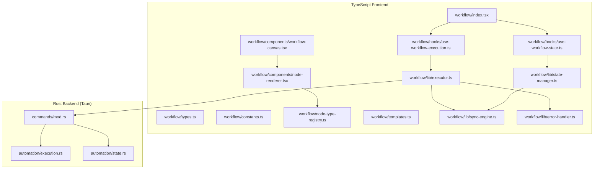
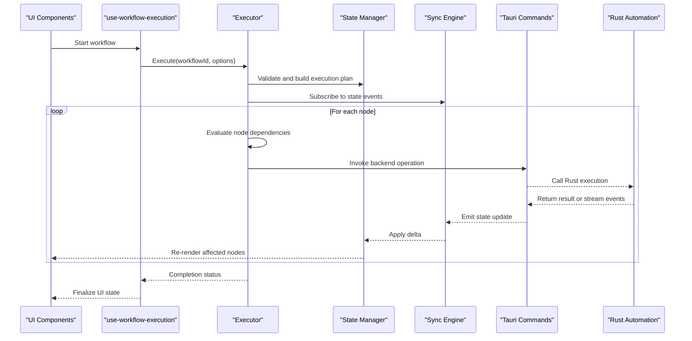
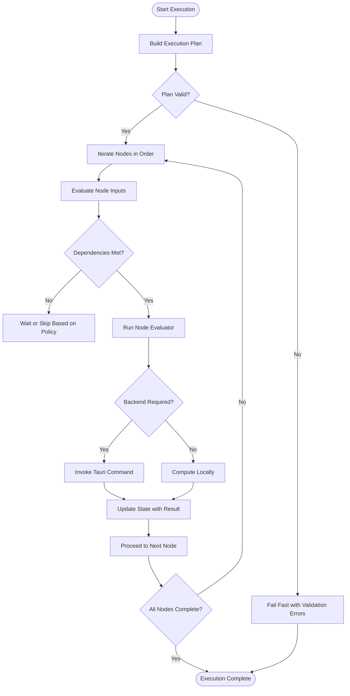
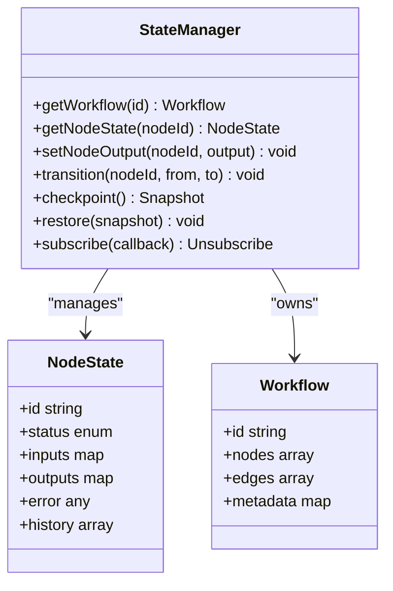
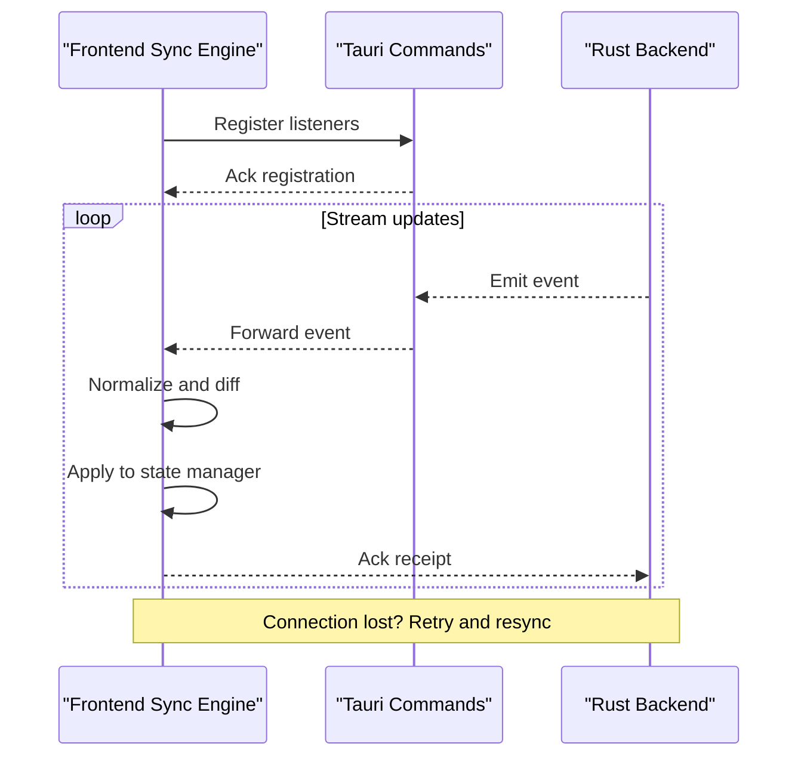
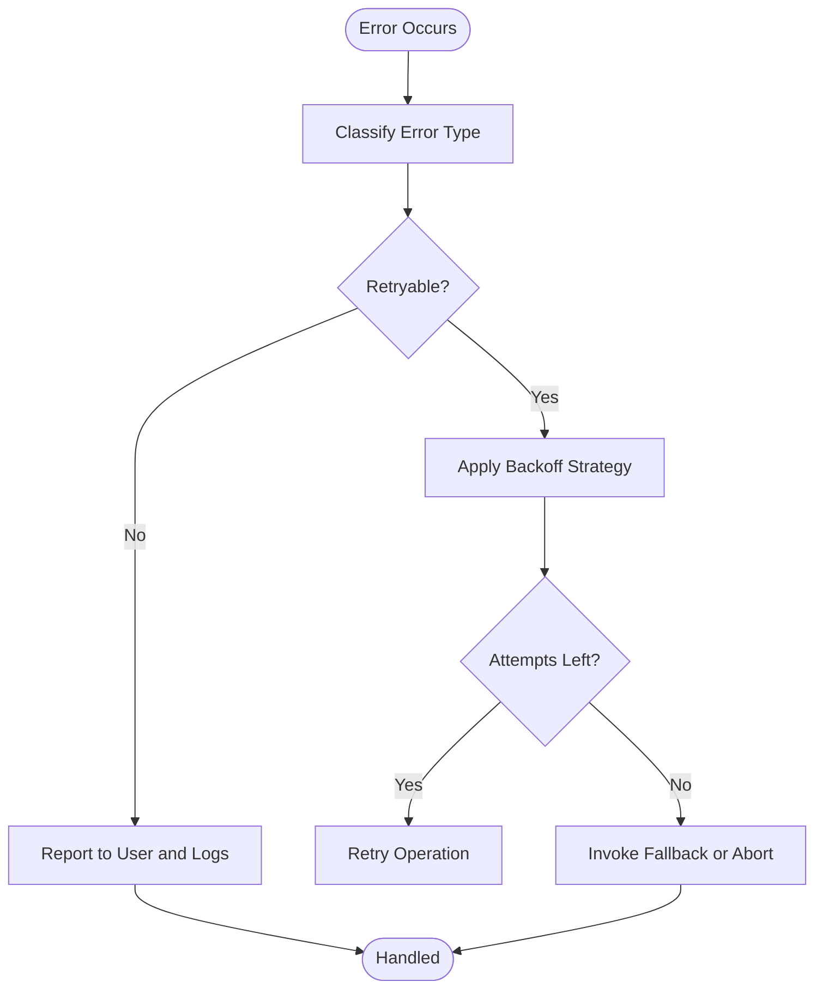
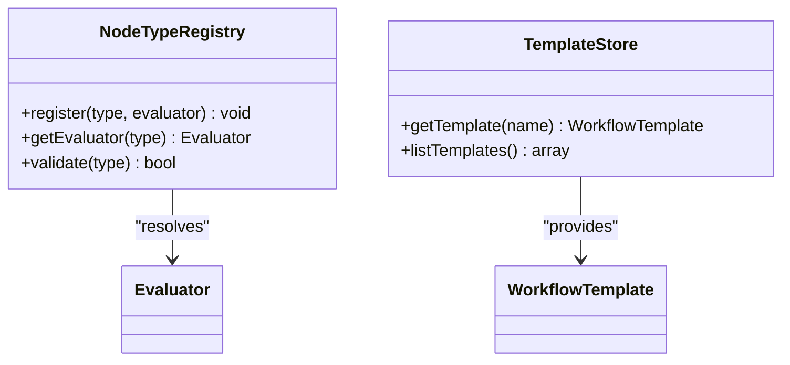
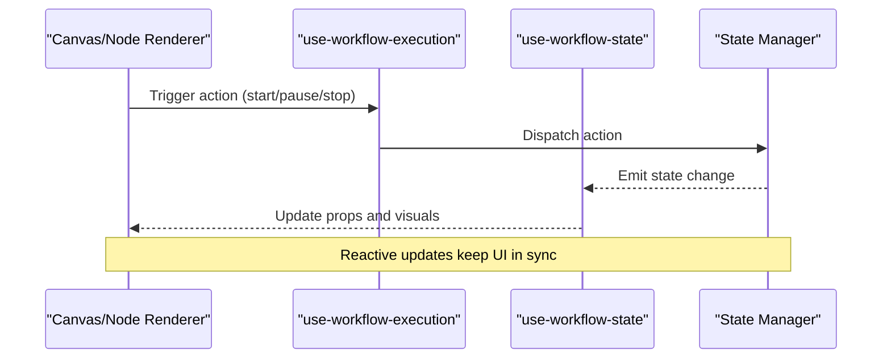
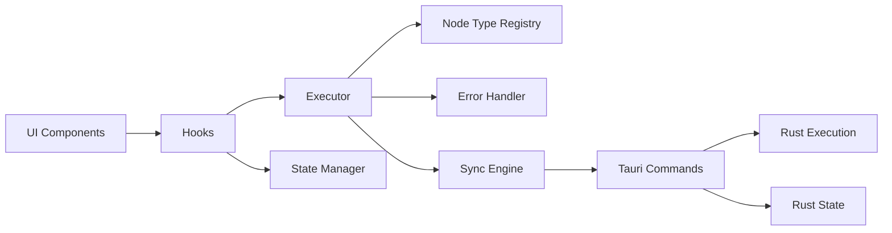

# Workflow Runtime Core

<cite>
**Referenced Files in This Document**
- [workflow/index.tsx](file://src/pages/workflow/index.tsx)
- [workflow/types.ts](file://src/pages/workflow/types.ts)
- [workflow/constants.ts](file://src/pages/workflow/constants.ts)
- [workflow/node-type-registry.ts](file://src/pages/workflow/node-type-registry.ts)
- [workflow/templates.ts](file://src/pages/workflow/templates.ts)
- [workflow/lib/executor.ts](file://src/pages/workflow/lib/executor.ts)
- [workflow/lib/state-manager.ts](file://src/pages/workflow/lib/state-manager.ts)
- [workflow/lib/sync-engine.ts](file://src/pages/workflow/lib/sync-engine.ts)
- [workflow/lib/error-handler.ts](file://src/pages/workflow/lib/error-handler.ts)
- [workflow/components/workflow-canvas.tsx](file://src/pages/workflow/components/workflow-canvas.tsx)
- [workflow/components/node-renderer.tsx](file://src/pages/workflow/components/node-renderer.tsx)
- [workflow/hooks/use-workflow-execution.ts](file://src/pages/workflow/hooks/use-workflow-execution.ts)
- [workflow/hooks/use-workflow-state.ts](file://src/pages/workflow/hooks/use-workflow-state.ts)
- [src-tauri/src/automation/execution.rs](file://src-tauri/src/automation/execution.rs)
- [src-tauri/src/automation/state.rs](file://src-tauri/src/automation/state.rs)
- [src-tauri/src/commands/mod.rs](file://src-tauri/src/commands/mod.rs)
</cite>

## Table of Contents
1. [Introduction](#introduction)
2. [Project Structure](#project-structure)
3. [Core Components](#core-components)
4. [Architecture Overview](#architecture-overview)
5. [Detailed Component Analysis](#detailed-component-analysis)
6. [Dependency Analysis](#dependency-analysis)
7. [Performance Considerations](#performance-considerations)
8. [Troubleshooting Guide](#troubleshooting-guide)
9. [Conclusion](#conclusion)

## Introduction
This document explains the workflow runtime core that powers TypeScript-based workflow execution within the application. It covers how the runtime manages workflow execution state, evaluates nodes, coordinates with the backend Rust engine, and synchronizes state to the UI in real time. It also documents lifecycle management, error handling strategies, and integration points with UI components.

## Project Structure
The workflow runtime is implemented primarily under src/pages/workflow with supporting logic in lib, hooks, components, and node definitions. The backend coordination lives in src-tauri/src/automation and commands.

**Diagram sources**
- [workflow/index.tsx](file://src/pages/workflow/index.tsx)
- [workflow/types.ts](file://src/pages/workflow/types.ts)
- [workflow/constants.ts](file://src/pages/workflow/constants.ts)
- [workflow/node-type-registry.ts](file://src/pages/workflow/node-type-registry.ts)
- [workflow/templates.ts](file://src/pages/workflow/templates.ts)
- [workflow/lib/executor.ts](file://src/pages/workflow/lib/executor.ts)
- [workflow/lib/state-manager.ts](file://src/pages/workflow/lib/state-manager.ts)
- [workflow/lib/sync-engine.ts](file://src/pages/workflow/lib/sync-engine.ts)
- [workflow/lib/error-handler.ts](file://src/pages/workflow/lib/error-handler.ts)
- [workflow/components/workflow-canvas.tsx](file://src/pages/workflow/components/workflow-canvas.tsx)
- [workflow/components/node-renderer.tsx](file://src/pages/workflow/components/node-renderer.tsx)
- [workflow/hooks/use-workflow-execution.ts](file://src/pages/workflow/hooks/use-workflow-execution.ts)
- [workflow/hooks/use-workflow-state.ts](file://src/pages/workflow/hooks/use-workflow-state.ts)
- [src-tauri/src/automation/execution.rs](file://src-tauri/src/automation/execution.rs)
- [src-tauri/src/automation/state.rs](file://src-tauri/src/automation/state.rs)
- [src-tauri/src/commands/mod.rs](file://src-tauri/src/commands/mod.rs)

**Section sources**
- [workflow/index.tsx](file://src/pages/workflow/index.tsx)
- [workflow/types.ts](file://src/pages/workflow/types.ts)
- [workflow/constants.ts](file://src/pages/workflow/constants.ts)
- [workflow/node-type-registry.ts](file://src/pages/workflow/node-type-registry.ts)
- [workflow/templates.ts](file://src/pages/workflow/templates.ts)
- [workflow/lib/executor.ts](file://src/pages/workflow/lib/executor.ts)
- [workflow/lib/state-manager.ts](file://src/pages/workflow/lib/state-manager.ts)
- [workflow/lib/sync-engine.ts](file://src/pages/workflow/lib/sync-engine.ts)
- [workflow/lib/error-handler.ts](file://src/pages/workflow/lib/error-handler.ts)
- [workflow/components/workflow-canvas.tsx](file://src/pages/workflow/components/workflow-canvas.tsx)
- [workflow/components/node-renderer.tsx](file://src/pages/workflow/components/node-renderer.tsx)
- [workflow/hooks/use-workflow-execution.ts](file://src/pages/workflow/hooks/use-workflow-execution.ts)
- [workflow/hooks/use-workflow-state.ts](file://src/pages/workflow/hooks/use-workflow-state.ts)
- [src-tauri/src/automation/execution.rs](file://src-tauri/src/automation/execution.rs)
- [src-tauri/src/automation/state.rs](file://src-tauri/src/automation/state.rs)
- [src-tauri/src/commands/mod.rs](file://src-tauri/src/commands/mod.rs)

## Core Components
- Execution Engine: Orchestrates node evaluation, dependency resolution, and execution ordering.
- State Manager: Maintains workflow graph state, node states, inputs/outputs, and transitions.
- Synchronization Engine: Bridges frontend state changes to the Rust backend and pushes updates back to the UI.
- Error Handler: Centralized error capture, categorization, retry/backoff, and user-visible feedback.
- Node Type Registry: Maps node IDs to evaluators and metadata for rendering and execution.
- Templates: Provides reusable workflow skeletons and default configurations.
- Hooks: React hooks encapsulating execution control and reactive state subscriptions.
- UI Components: Canvas and node renderer visualize and interact with workflows.

Key responsibilities:
- Lifecycle: Initialize, validate, execute, pause/resume, checkpoint, and terminate workflows.
- Evaluation: Topological traversal, conditional branching, parallelism where applicable.
- Coordination: Tauri commands to invoke Rust execution and persist state.
- Real-time sync: Event-driven updates from backend to UI via state manager and sync engine.

**Section sources**
- [workflow/lib/executor.ts](file://src/pages/workflow/lib/executor.ts)
- [workflow/lib/state-manager.ts](file://src/pages/workflow/lib/state-manager.ts)
- [workflow/lib/sync-engine.ts](file://src/pages/workflow/lib/sync-engine.ts)
- [workflow/lib/error-handler.ts](file://src/pages/workflow/lib/error-handler.ts)
- [workflow/node-type-registry.ts](file://src/pages/workflow/node-type-registry.ts)
- [workflow/templates.ts](file://src/pages/workflow/templates.ts)
- [workflow/hooks/use-workflow-execution.ts](file://src/pages/workflow/hooks/use-workflow-execution.ts)
- [workflow/hooks/use-workflow-state.ts](file://src/pages/workflow/hooks/use-workflow-state.ts)

## Architecture Overview
The runtime follows a layered architecture:
- UI Layer: Canvas and node renderers display workflow graphs and accept user actions.
- Hook Layer: Encapsulates execution control and reactive state subscriptions.
- Core Layer: Executor and state manager implement evaluation and state transitions.
- Sync Layer: Handles bidirectional communication with the Rust backend.
- Backend Layer: Rust automation engine executes heavy operations and persists state.

**Diagram sources**
- [workflow/components/workflow-canvas.tsx](file://src/pages/workflow/components/workflow-canvas.tsx)
- [workflow/hooks/use-workflow-execution.ts](file://src/pages/workflow/hooks/use-workflow-execution.ts)
- [workflow/lib/executor.ts](file://src/pages/workflow/lib/executor.ts)
- [workflow/lib/state-manager.ts](file://src/pages/workflow/lib/state-manager.ts)
- [workflow/lib/sync-engine.ts](file://src/pages/workflow/lib/sync-engine.ts)
- [src-tauri/src/commands/mod.rs](file://src-tauri/src/commands/mod.rs)
- [src-tauri/src/automation/execution.rs](file://src-tauri/src/automation/execution.rs)

## Detailed Component Analysis

### Execution Engine
Responsibilities:
- Build execution plan using dependency graph analysis.
- Traverse nodes in topological order, respecting conditions and branches.
- Manage concurrency limits and resource usage.
- Coordinate with state manager to apply transitions and outputs.
- Integrate with sync engine to push intermediate results and errors.

**Diagram sources**
- [workflow/lib/executor.ts](file://src/pages/workflow/lib/executor.ts)
- [workflow/lib/state-manager.ts](file://src/pages/workflow/lib/state-manager.ts)
- [workflow/lib/sync-engine.ts](file://src/pages/workflow/lib/sync-engine.ts)
- [src-tauri/src/commands/mod.rs](file://src-tauri/src/commands/mod.rs)

**Section sources**
- [workflow/lib/executor.ts](file://src/pages/workflow/lib/executor.ts)

### State Manager
Responsibilities:
- Maintain workflow graph structure and node states.
- Track input/output values, execution history, and checkpoints.
- Apply atomic state transitions and ensure consistency.
- Provide selectors and subscriptions for UI reactivity.

**Diagram sources**
- [workflow/lib/state-manager.ts](file://src/pages/workflow/lib/state-manager.ts)
- [workflow/types.ts](file://src/pages/workflow/types.ts)

**Section sources**
- [workflow/lib/state-manager.ts](file://src/pages/workflow/lib/state-manager.ts)
- [workflow/types.ts](file://src/pages/workflow/types.ts)

### Synchronization Engine
Responsibilities:
- Establish and manage communication channels with the Rust backend.
- Normalize backend events into frontend state deltas.
- Handle retries, timeouts, and connection recovery.
- Ensure eventual consistency between UI and backend state.

**Diagram sources**
- [workflow/lib/sync-engine.ts](file://src/pages/workflow/lib/sync-engine.ts)
- [src-tauri/src/commands/mod.rs](file://src-tauri/src/commands/mod.rs)
- [src-tauri/src/automation/state.rs](file://src-tauri/src/automation/state.rs)

**Section sources**
- [workflow/lib/sync-engine.ts](file://src/pages/workflow/lib/sync-engine.ts)
- [src-tauri/src/commands/mod.rs](file://src-tauri/src/commands/mod.rs)
- [src-tauri/src/automation/state.rs](file://src-tauri/src/automation/state.rs)

### Error Handler
Responsibilities:
- Capture and categorize errors during evaluation and backend calls.
- Implement retry policies and backoff strategies.
- Surface actionable messages to users and logs.
- Support partial failure isolation and rollback when possible.

**Diagram sources**
- [workflow/lib/error-handler.ts](file://src/pages/workflow/lib/error-handler.ts)

**Section sources**
- [workflow/lib/error-handler.ts](file://src/pages/workflow/lib/error-handler.ts)

### Node Type Registry and Templates
Responsibilities:
- Map node identifiers to evaluators and metadata.
- Provide templates for common workflow patterns.
- Enable dynamic loading and validation of node types.

**Diagram sources**
- [workflow/node-type-registry.ts](file://src/pages/workflow/node-type-registry.ts)
- [workflow/templates.ts](file://src/pages/workflow/templates.ts)

**Section sources**
- [workflow/node-type-registry.ts](file://src/pages/workflow/node-type-registry.ts)
- [workflow/templates.ts](file://src/pages/workflow/templates.ts)

### Hooks and UI Integration
Responsibilities:
- use-workflow-execution: Exposes start/pause/stop controls and execution status.
- use-workflow-state: Subscribes to state changes and provides derived data for UI.
- Canvas and node renderer: Visualize workflow graph and handle interactions.

**Diagram sources**
- [workflow/components/workflow-canvas.tsx](file://src/pages/workflow/components/workflow-canvas.tsx)
- [workflow/components/node-renderer.tsx](file://src/pages/workflow/components/node-renderer.tsx)
- [workflow/hooks/use-workflow-execution.ts](file://src/pages/workflow/hooks/use-workflow-execution.ts)
- [workflow/hooks/use-workflow-state.ts](file://src/pages/workflow/hooks/use-workflow-state.ts)
- [workflow/lib/state-manager.ts](file://src/pages/workflow/lib/state-manager.ts)

**Section sources**
- [workflow/hooks/use-workflow-execution.ts](file://src/pages/workflow/hooks/use-workflow-execution.ts)
- [workflow/hooks/use-workflow-state.ts](file://src/pages/workflow/hooks/use-workflow-state.ts)
- [workflow/components/workflow-canvas.tsx](file://src/pages/workflow/components/workflow-canvas.tsx)
- [workflow/components/node-renderer.tsx](file://src/pages/workflow/components/node-renderer.tsx)

## Dependency Analysis
The runtime exhibits clear separation of concerns:
- UI depends on hooks for behavior and state.
- Hooks depend on executor and state manager.
- Executor depends on registry and error handler.
- Sync engine bridges frontend and backend commands.
- Backend exposes commands and state modules.

**Diagram sources**
- [workflow/components/workflow-canvas.tsx](file://src/pages/workflow/components/workflow-canvas.tsx)
- [workflow/hooks/use-workflow-execution.ts](file://src/pages/workflow/hooks/use-workflow-execution.ts)
- [workflow/lib/executor.ts](file://src/pages/workflow/lib/executor.ts)
- [workflow/lib/state-manager.ts](file://src/pages/workflow/lib/state-manager.ts)
- [workflow/lib/sync-engine.ts](file://src/pages/workflow/lib/sync-engine.ts)
- [workflow/node-type-registry.ts](file://src/pages/workflow/node-type-registry.ts)
- [workflow/lib/error-handler.ts](file://src/pages/workflow/lib/error-handler.ts)
- [src-tauri/src/commands/mod.rs](file://src-tauri/src/commands/mod.rs)
- [src-tauri/src/automation/execution.rs](file://src-tauri/src/automation/execution.rs)
- [src-tauri/src/automation/state.rs](file://src-tauri/src/automation/state.rs)

**Section sources**
- [workflow/lib/executor.ts](file://src/pages/workflow/lib/executor.ts)
- [workflow/lib/state-manager.ts](file://src/pages/workflow/lib/state-manager.ts)
- [workflow/lib/sync-engine.ts](file://src/pages/workflow/lib/sync-engine.ts)
- [workflow/node-type-registry.ts](file://src/pages/workflow/node-type-registry.ts)
- [workflow/lib/error-handler.ts](file://src/pages/workflow/lib/error-handler.ts)
- [src-tauri/src/commands/mod.rs](file://src-tauri/src/commands/mod.rs)
- [src-tauri/src/automation/execution.rs](file://src-tauri/src/automation/execution.rs)
- [src-tauri/src/automation/state.rs](file://src-tauri/src/automation/state.rs)

## Performance Considerations
- Minimize re-renders by batching state updates and using fine-grained subscriptions.
- Prefer lazy evaluation of expensive nodes and cache outputs where safe.
- Limit concurrent backend calls to avoid resource contention.
- Use incremental diffs in synchronization to reduce payload size.
- Profile execution plans to identify bottlenecks and optimize dependency chains.

[No sources needed since this section provides general guidance]

## Troubleshooting Guide
Common issues and resolutions:
- Validation failures: Check node configuration and required inputs; consult error categories.
- Backend call timeouts: Inspect network connectivity and backend health; adjust retry/backoff settings.
- State drift: Force resync and reconcile snapshots; verify event ordering.
- Partial failures: Isolate failing nodes and review logs; consider fallback strategies.

Operational tips:
- Use checkpoints to recover from interruptions.
- Monitor execution logs and error traces for root cause analysis.
- Validate templates before deployment to catch misconfigurations early.

**Section sources**
- [workflow/lib/error-handler.ts](file://src/pages/workflow/lib/error-handler.ts)
- [workflow/lib/sync-engine.ts](file://src/pages/workflow/lib/sync-engine.ts)
- [workflow/lib/state-manager.ts](file://src/pages/workflow/lib/state-manager.ts)

## Conclusion
The workflow runtime core provides a robust, extensible system for managing workflow execution in TypeScript with tight integration to a Rust backend. Its layered design ensures clarity, performance, and reliability. By following the documented lifecycle, error handling, and synchronization patterns, developers can build complex workflows with confidence and maintain seamless UI responsiveness.

[No sources needed since this section summarizes without analyzing specific files]