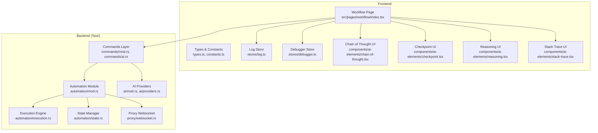
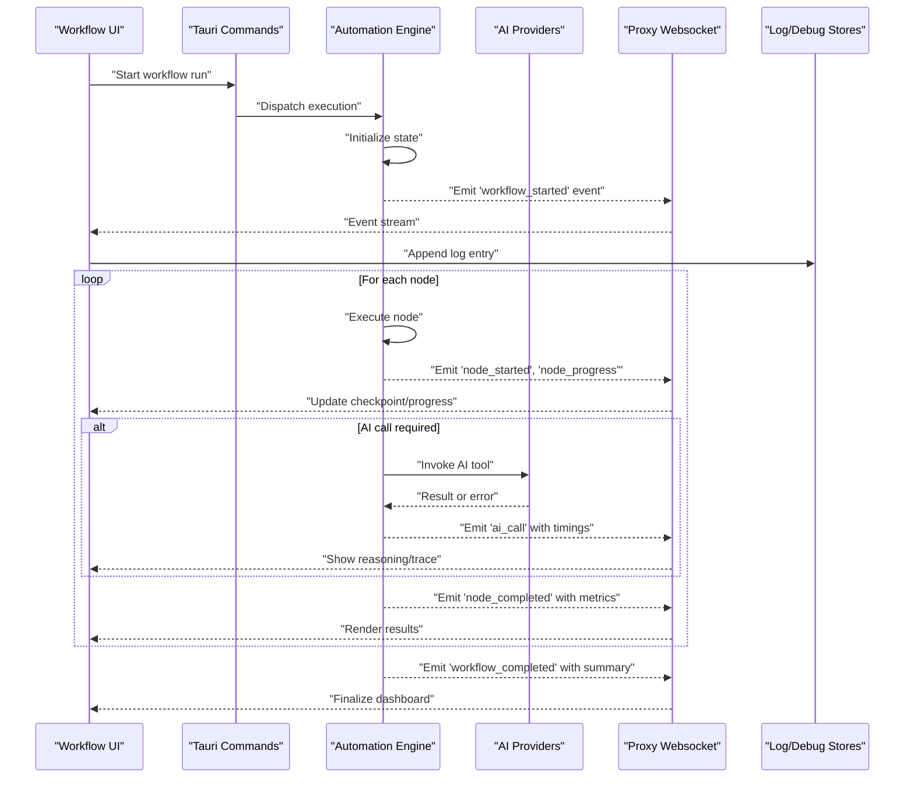
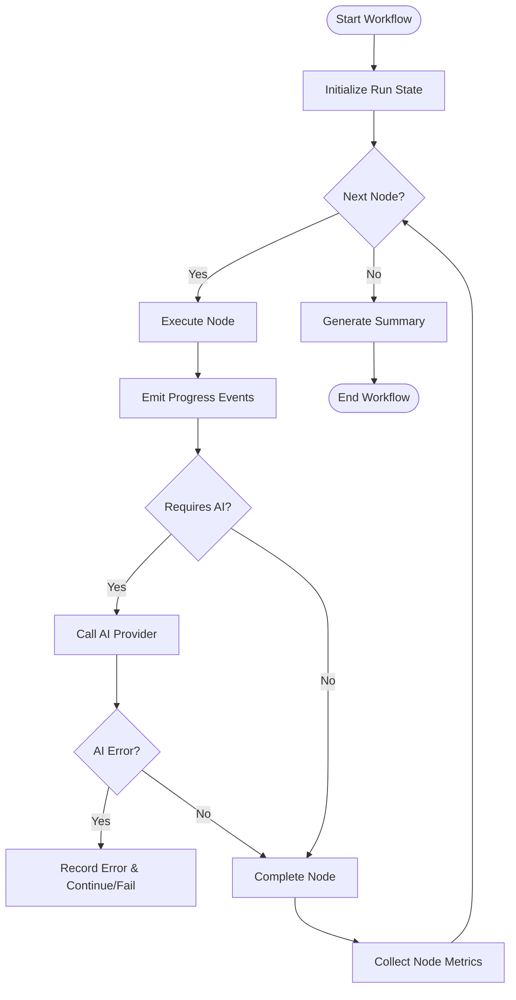
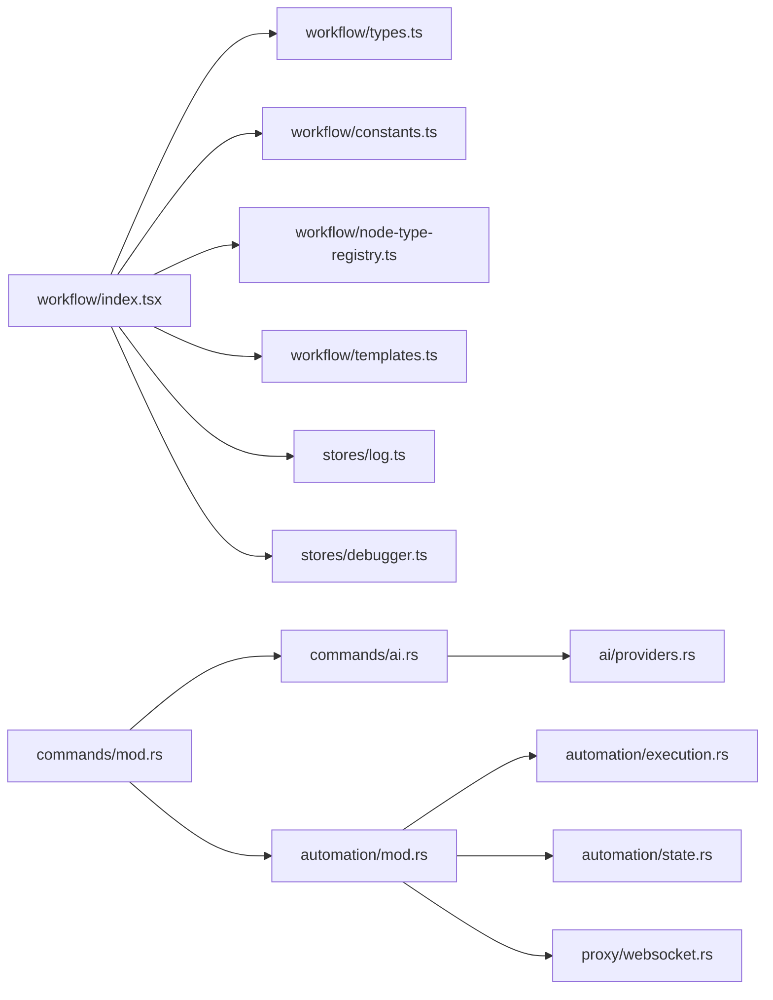

# AI Workflow Monitoring & Debugging

<cite>
**Referenced Files in This Document**
- [README.md](file://README.md)
- [src/pages/workflow/index.tsx](file://src/pages/workflow/index.tsx)
- [src/pages/workflow/types.ts](file://src/pages/workflow/types.ts)
- [src/pages/workflow/constants.ts](file://src/pages/workflow/constants.ts)
- [src/pages/workflow/node-type-registry.ts](file://src/pages/workflow/node-type-registry.ts)
- [src/pages/workflow/templates.ts](file://src/pages/workflow/templates.ts)
- [src/stores/log.ts](file://src/stores/log.ts)
- [src/stores/debugger.ts](file://src/stores/debugger.ts)
- [src/components/ai-elements/chain-of-thought.tsx](file://src/components/ai-elements/chain-of-thought.tsx)
- [src/components/ai-elements/checkpoint.tsx](file://src/components/ai-elements/checkpoint.tsx)
- [src/components/ai-elements/reasoning.tsx](file://src/components/ai-elements/reasoning.tsx)
- [src/components/ai-elements/stack-trace.tsx](file://src/components/ai-elements/stack-trace.tsx)
- [src-tauri/src/automation/mod.rs](file://src-tauri/src/automation/mod.rs)
- [src-tauri/src/automation/execution.rs](file://src-tauri/src/automation/execution.rs)
- [src-tauri/src/automation/state.rs](file://src-tauri/src/automation/state.rs)
- [src-tauri/src/commands/mod.rs](file://src-tauri/src/commands/mod.rs)
- [src-tauri/src/commands/ai.rs](file://src-tauri/src/commands/ai.rs)
- [src-tauri/src/ai/mod.rs](file://src-tauri/src/ai/mod.rs)
- [src-tauri/src/ai/providers.rs](file://src-tauri/src/ai/providers.rs)
- [src-tauri/src/proxy/websocket.rs](file://src-tauri/src/proxy/websocket.rs)
</cite>

## Table of Contents
1. [Introduction](#introduction)
2. [Project Structure](#project-structure)
3. [Core Components](#core-components)
4. [Architecture Overview](#architecture-overview)
5. [Detailed Component Analysis](#detailed-component-analysis)
6. [Dependency Analysis](#dependency-analysis)
7. [Performance Considerations](#performance-considerations)
8. [Troubleshooting Guide](#troubleshooting-guide)
9. [Conclusion](#conclusion)
10. [Appendices](#appendices)

## Introduction
This document explains how to monitor and debug AI-powered workflows in Apprecon. It covers tracking workflow execution, monitoring AI service calls, analyzing performance metrics, and troubleshooting issues. You will learn how the logging system works, how events are tracked, and which diagnostic tools are available for debugging workflows both in development and production.

## Project Structure
Apprecon’s workflow monitoring spans the frontend (React UI), Tauri backend (Rust), and inter-process communication via commands and websockets. Key areas:
- Frontend workflow pages and stores for visualization and state management
- Rust automation engine for execution, state, and event emission
- AI provider integration and command layer for invoking AI services
- Proxy websocket channel used to stream runtime events back to the UI

**Diagram sources**
- [src/pages/workflow/index.tsx](file://src/pages/workflow/index.tsx)
- [src/pages/workflow/types.ts](file://src/pages/workflow/types.ts)
- [src/pages/workflow/constants.ts](file://src/pages/workflow/constants.ts)
- [src/stores/log.ts](file://src/stores/log.ts)
- [src/stores/debugger.ts](file://src/stores/debugger.ts)
- [src/components/ai-elements/chain-of-thought.tsx](file://src/components/ai-elements/chain-of-thought.tsx)
- [src/components/ai-elements/checkpoint.tsx](file://src/components/ai-elements/checkpoint.tsx)
- [src/components/ai-elements/reasoning.tsx](file://src/components/ai-elements/reasoning.tsx)
- [src/components/ai-elements/stack-trace.tsx](file://src/components/ai-elements/stack-trace.tsx)
- [src-tauri/src/commands/mod.rs](file://src-tauri/src/commands/mod.rs)
- [src-tauri/src/commands/ai.rs](file://src-tauri/src/commands/ai.rs)
- [src-tauri/src/automation/mod.rs](file://src-tauri/src/automation/mod.rs)
- [src-tauri/src/automation/execution.rs](file://src-tauri/src/automation/execution.rs)
- [src-tauri/src/automation/state.rs](file://src-tauri/src/automation/state.rs)
- [src-tauri/src/ai/mod.rs](file://src-tauri/src/ai/mod.rs)
- [src-tauri/src/ai/providers.rs](file://src-tauri/src/ai/providers.rs)
- [src-tauri/src/proxy/websocket.rs](file://src-tauri/src/proxy/websocket.rs)

**Section sources**
- [README.md](file://README.md)

## Core Components
- Workflow page and registry: Orchestrates node types, templates, and execution lifecycle on the frontend.
- Logging store: Centralized log ingestion, filtering, and persistence for workflow events.
- Debugger store: Captures breakpoints, step-through controls, and diagnostic snapshots.
- Automation engine (Rust): Executes nodes, manages state, emits events, and integrates with AI providers.
- AI providers: Encapsulate calls to external AI services with configuration and error handling.
- Proxy websocket: Streams real-time events from backend to frontend for live monitoring.

Key responsibilities:
- Track start/end of each workflow run and individual nodes
- Emit structured logs and checkpoints
- Surface stack traces and reasoning steps
- Provide profiling hooks around AI calls and long-running tasks

**Section sources**
- [src/pages/workflow/index.tsx](file://src/pages/workflow/index.tsx)
- [src/pages/workflow/types.ts](file://src/pages/workflow/types.ts)
- [src/pages/workflow/constants.ts](file://src/pages/workflow/constants.ts)
- [src/pages/workflow/node-type-registry.ts](file://src/pages/workflow/node-type-registry.ts)
- [src/pages/workflow/templates.ts](file://src/pages/workflow/templates.ts)
- [src/stores/log.ts](file://src/stores/log.ts)
- [src/stores/debugger.ts](file://src/stores/debugger.ts)
- [src-tauri/src/automation/mod.rs](file://src-tauri/src/automation/mod.rs)
- [src-tauri/src/automation/execution.rs](file://src-tauri/src/automation/execution.rs)
- [src-tauri/src/automation/state.rs](file://src-tauri/src/automation/state.rs)
- [src-tauri/src/commands/ai.rs](file://src-tauri/src/commands/ai.rs)
- [src-tauri/src/ai/providers.rs](file://src-tauri/src/ai/providers.rs)
- [src-tauri/src/proxy/websocket.rs](file://src-tauri/src/proxy/websocket.rs)

## Architecture Overview
The monitoring architecture connects the React UI to the Rust backend through Tauri commands and a websocket channel. The automation engine executes workflow nodes, records state transitions, and streams events to the UI. AI provider calls are wrapped with timing and error telemetry.

**Diagram sources**
- [src/pages/workflow/index.tsx](file://src/pages/workflow/index.tsx)
- [src-tauri/src/commands/mod.rs](file://src-tauri/src/commands/mod.rs)
- [src-tauri/src/automation/mod.rs](file://src-tauri/src/automation/mod.rs)
- [src-tauri/src/automation/execution.rs](file://src-tauri/src/automation/execution.rs)
- [src-tauri/src/automation/state.rs](file://src-tauri/src/automation/state.rs)
- [src-tauri/src/ai/providers.rs](file://src-tauri/src/ai/providers.rs)
- [src-tauri/src/proxy/websocket.rs](file://src-tauri/src/proxy/websocket.rs)
- [src/stores/log.ts](file://src/stores/log.ts)
- [src/stores/debugger.ts](file://src/stores/debugger.ts)

## Detailed Component Analysis

### Workflow Execution and Node Lifecycle
- The workflow page initializes node types and templates, then triggers execution via commands.
- The automation engine maintains per-run state, iterates over nodes, and emits lifecycle events.
- Each node can emit progress updates and final results; failures are captured and surfaced.

**Diagram sources**
- [src-tauri/src/automation/execution.rs](file://src-tauri/src/automation/execution.rs)
- [src-tauri/src/automation/state.rs](file://src-tauri/src/automation/state.rs)
- [src-tauri/src/ai/providers.rs](file://src-tauri/src/ai/providers.rs)

**Section sources**
- [src/pages/workflow/index.tsx](file://src/pages/workflow/index.tsx)
- [src/pages/workflow/types.ts](file://src/pages/workflow/types.ts)
- [src/pages/workflow/constants.ts](file://src/pages/workflow/constants.ts)
- [src/pages/workflow/node-type-registry.ts](file://src/pages/workflow/node-type-registry.ts)
- [src/pages/workflow/templates.ts](file://src/pages/workflow/templates.ts)
- [src-tauri/src/automation/execution.rs](file://src-tauri/src/automation/execution.rs)
- [src-tauri/src/automation/state.rs](file://src-tauri/src/automation/state.rs)

### Logging System
- The log store centralizes ingestion of structured logs from both frontend and backend.
- Logs include timestamps, levels, workflow IDs, node IDs, and payloads.
- Filtering and search capabilities allow quick isolation of relevant entries.

Best practices:
- Use consistent log levels (debug, info, warn, error).
- Include correlation IDs for tracing across components.
- Avoid logging sensitive data; sanitize inputs.

**Section sources**
- [src/stores/log.ts](file://src/stores/log.ts)

### Debugger Store and Breakpoints
- The debugger store captures breakpoints, step controls, and snapshot states.
- Useful for reproducing failures and inspecting intermediate values during runs.

Operational tips:
- Set breakpoints at node boundaries and AI call boundaries.
- Export snapshots for offline analysis.
- Combine with logs to correlate state changes.

**Section sources**
- [src/stores/debugger.ts](file://src/stores/debugger.ts)

### AI Service Call Monitoring
- AI provider wrappers record request metadata, latency, token usage (if available), and errors.
- Events are streamed to the UI for real-time visibility into model interactions.

Monitoring checklist:
- Verify provider configuration and rate limits.
- Inspect error responses and retry policies.
- Track latency percentiles and failure rates.

**Section sources**
- [src-tauri/src/ai/providers.rs](file://src-tauri/src/ai/providers.rs)
- [src-tauri/src/commands/ai.rs](file://src-tauri/src/commands/ai.rs)

### Event Streaming via Proxy Websocket
- The proxy websocket relays backend events to the frontend in near real time.
- Ensures UI reflects current workflow state without polling overhead.

Reliability considerations:
- Implement reconnection logic and message ordering guarantees where possible.
- Throttle high-frequency events if needed to avoid UI lag.

**Section sources**
- [src-tauri/src/proxy/websocket.rs](file://src-tauri/src/proxy/websocket.rs)

### Diagnostic UI Components
- Chain of thought, reasoning, checkpoint, and stack trace components visualize execution details.
- They render structured outputs from logs and events to aid debugging.

Usage guidance:
- Enable detailed reasoning output for complex nodes.
- Use checkpoints to mark critical milestones.
- Inspect stack traces for precise error locations.

**Section sources**
- [src/components/ai-elements/chain-of-thought.tsx](file://src/components/ai-elements/chain-of-thought.tsx)
- [src/components/ai-elements/reasoning.tsx](file://src/components/ai-elements/reasoning.tsx)
- [src/components/ai-elements/checkpoint.tsx](file://src/components/ai-elements/checkpoint.tsx)
- [src/components/ai-elements/stack-trace.tsx](file://src/components/ai-elements/stack-trace.tsx)

## Dependency Analysis
The following diagram shows key dependencies between frontend workflow modules, backend automation, AI providers, and the websocket channel.

**Diagram sources**
- [src/pages/workflow/index.tsx](file://src/pages/workflow/index.tsx)
- [src/pages/workflow/types.ts](file://src/pages/workflow/types.ts)
- [src/pages/workflow/constants.ts](file://src/pages/workflow/constants.ts)
- [src/pages/workflow/node-type-registry.ts](file://src/pages/workflow/node-type-registry.ts)
- [src/pages/workflow/templates.ts](file://src/pages/workflow/templates.ts)
- [src/stores/log.ts](file://src/stores/log.ts)
- [src/stores/debugger.ts](file://src/stores/debugger.ts)
- [src-tauri/src/commands/mod.rs](file://src-tauri/src/commands/mod.rs)
- [src-tauri/src/commands/ai.rs](file://src-tauri/src/commands/ai.rs)
- [src-tauri/src/automation/mod.rs](file://src-tauri/src/automation/mod.rs)
- [src-tauri/src/automation/execution.rs](file://src-tauri/src/automation/execution.rs)
- [src-tauri/src/automation/state.rs](file://src-tauri/src/automation/state.rs)
- [src-tauri/src/ai/providers.rs](file://src-tauri/src/ai/providers.rs)
- [src-tauri/src/proxy/websocket.rs](file://src-tauri/src/proxy/websocket.rs)

**Section sources**
- [src-tauri/src/commands/mod.rs](file://src-tauri/src/commands/mod.rs)
- [src-tauri/src/automation/mod.rs](file://src-tauri/src/automation/mod.rs)

## Performance Considerations
- Instrument AI provider calls with latency and throughput metrics to identify bottlenecks.
- Stream events efficiently; consider batching or throttling high-volume messages.
- Use checkpoints to reduce unnecessary re-renders in the UI.
- Profile long-running nodes by splitting them into smaller steps with intermediate metrics.
- Monitor memory usage in both frontend and backend; avoid large payload logging.

[No sources needed since this section provides general guidance]

## Troubleshooting Guide
Common scenarios and steps:
- Workflow hangs:
  - Inspect node progress events and checkpoints.
  - Check AI provider connectivity and rate limits.
  - Review logs for timeouts or retries.
- AI call failures:
  - Examine error payloads and status codes.
  - Validate provider credentials and endpoints.
  - Use stack trace component to pinpoint failure location.
- Slow performance:
  - Analyze latency distributions for AI calls and node executions.
  - Reduce payload sizes and enable compression where applicable.
  - Increase concurrency cautiously while monitoring resource usage.
- Missing events:
  - Verify websocket connection health and reconnection behavior.
  - Ensure event emission paths are not blocked by errors.

Diagnostic tools:
- Log store filters and search
- Debugger store snapshots and breakpoints
- Stack trace and reasoning components
- WebSocket event inspector in browser devtools

**Section sources**
- [src/stores/log.ts](file://src/stores/log.ts)
- [src/stores/debugger.ts](file://src/stores/debugger.ts)
- [src/components/ai-elements/stack-trace.tsx](file://src/components/ai-elements/stack-trace.tsx)
- [src/components/ai-elements/reasoning.tsx](file://src/components/ai-elements/reasoning.tsx)
- [src-tauri/src/proxy/websocket.rs](file://src-tauri/src/proxy/websocket.rs)

## Conclusion
Apprecon’s workflow monitoring combines structured logging, event streaming, and rich diagnostic UI components to provide deep visibility into AI-powered workflows. By instrumenting AI calls, capturing checkpoints, and leveraging the debugger store, teams can reliably track execution, analyze performance, and troubleshoot issues in both development and production environments.

[No sources needed since this section summarizes without analyzing specific files]

## Appendices
- Best practices for production monitoring:
  - Enable persistent logging with rotation
  - Aggregate metrics and set alerts for anomalies
  - Standardize correlation IDs across all layers
  - Regularly review error budgets and SLOs for AI services

[No sources needed since this section provides general guidance]