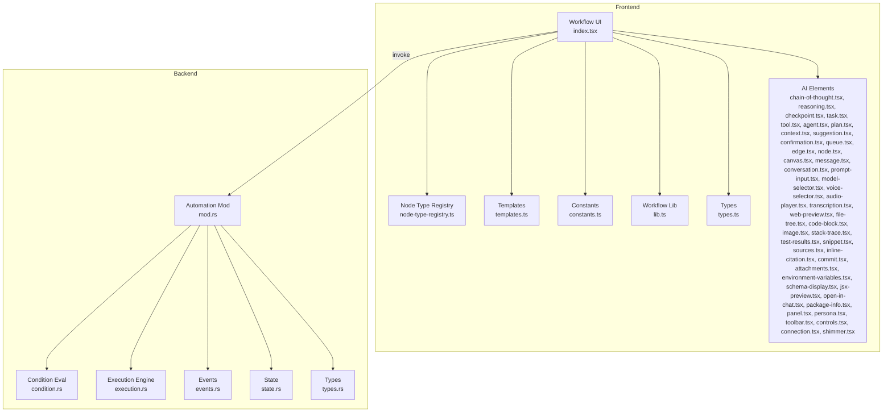
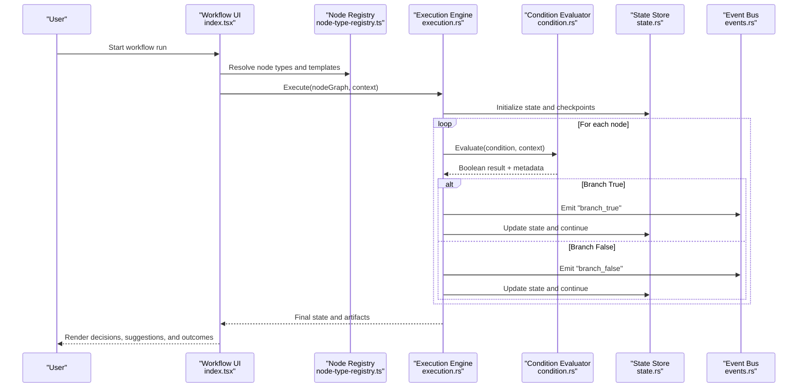
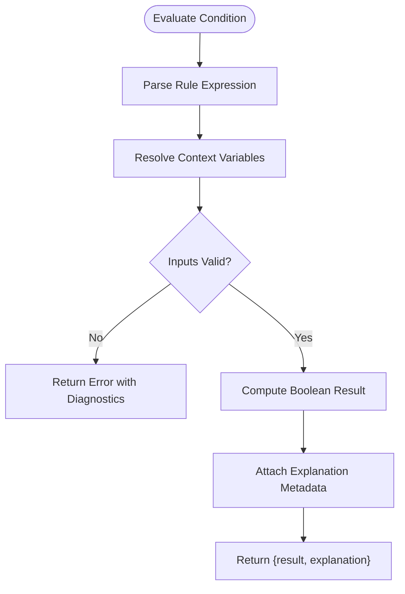
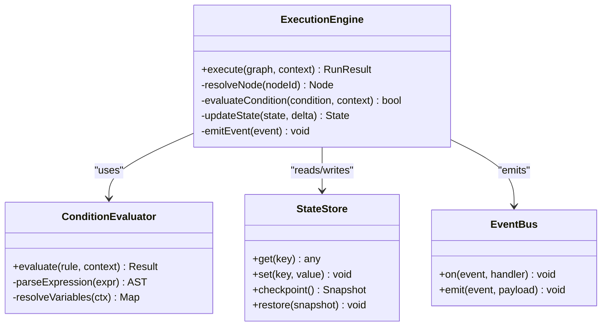
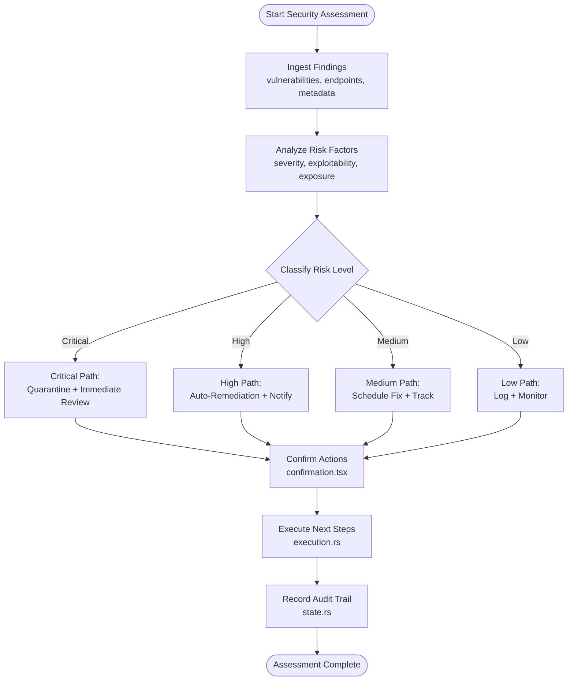
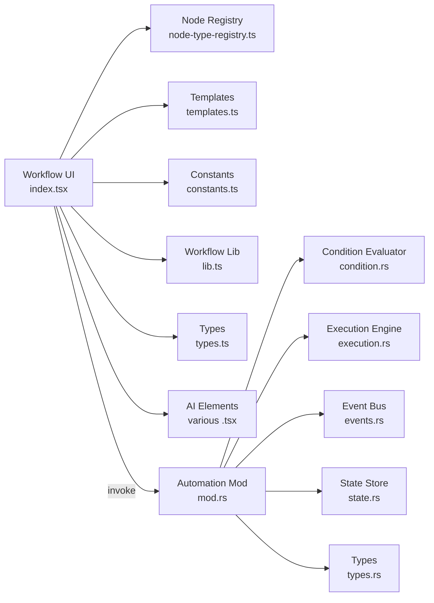

# AI-Driven Conditional Logic & Decision Making

<cite>
**Referenced Files in This Document**
- [condition.rs](file://src-tauri/src/automation/condition.rs)
- [execution.rs](file://src-tauri/src/automation/execution.rs)
- [types.rs](file://src-tauri/src/automation/types.rs)
- [mod.rs](file://src-tauri/src/automation/mod.rs)
- [events.rs](file://src-tauri/src/automation/events.rs)
- [state.rs](file://src-tauri/src/automation/state.rs)
- [index.tsx](file://src/pages/workflow/index.tsx)
- [node-type-registry.ts](file://src/pages/workflow/node-type-registry.ts)
- [templates.ts](file://src/pages/workflow/templates.ts)
- [constants.ts](file://src/pages/workflow/constants.ts)
- [lib.ts](file://src/pages/workflow/lib.ts)
- [types.ts](file://src/pages/workflow/types.ts)
- [components/chain-of-thought.tsx](file://src/components/ai-elements/chain-of-thought.tsx)
- [components/reasoning.tsx](file://src/components/ai-elements/reasoning.tsx)
- [components/checkpoint.tsx](file://src/components/ai-elements/checkpoint.tsx)
- [components/task.tsx](file://src/components/ai-elements/task.tsx)
- [components/tool.tsx](file://src/components/ai-elements/tool.tsx)
- [components/agent.tsx](file://src/components/ai-elements/agent.tsx)
- [components/plan.tsx](file://src/components/ai-elements/plan.tsx)
- [components/context.tsx](file://src/components/ai-elements/context.tsx)
- [components/suggestion.tsx](file://src/components/ai-elements/suggestion.tsx)
- [components/confirmation.tsx](file://src/components/ai-elements/confirmation.tsx)
- [components/queue.tsx](file://src/components/ai-elements/queue.tsx)
- [components/edge.tsx](file://src/components/ai-elements/edge.tsx)
- [components/node.tsx](file://src/components/ai-elements/node.tsx)
- [components/canvas.tsx](file://src/components/ai-elements/canvas.tsx)
- [components/message.tsx](file://src/components/ai-elements/message.tsx)
- [components/conversation.tsx](file://src/components/ai-elements/conversation.tsx)
- [components/prompt-input.tsx](file://src/components/ai-elements/prompt-input.tsx)
- [components/model-selector.tsx](file://src/components/ai-elements/model-selector.tsx)
- [components/voice-selector.tsx](file://src/components/ai-elements/voice-selector.tsx)
- [components/audio-player.tsx](file://src/components/ai-elements/audio-player.tsx)
- [components/transcription.tsx](file://src/components/ai-elements/transcription.tsx)
- [components/web-preview.tsx](file://src/components/ai-elements/web-preview.tsx)
- [components/file-tree.tsx](file://src/components/ai-elements/file-tree.tsx)
- [components/code-block.tsx](file://src/components/ai-elements/code-block.tsx)
- [components/image.tsx](file://src/components/ai-elements/image.tsx)
- [components/stack-trace.tsx](file://src/components/ai-elements/stack-trace.tsx)
- [components/test-results.tsx](file://src/components/ai-elements/test-results.tsx)
- [components/snippet.tsx](file://src/components/ai-elements/snippet.tsx)
- [components/sources.tsx](file://src/components/ai-elements/sources.tsx)
- [components/inline-citation.tsx](file://src/components/ai-elements/inline-citation.tsx)
- [components/commit.tsx](file://src/components/ai-elements/commit.tsx)
- [components/attachments.tsx](file://src/components/ai-elements/attachments.tsx)
- [components/environment-variables.tsx](file://src/components/ai-elements/environment-variables.tsx)
- [components/schema-display.tsx](file://src/components/ai-elements/schema-display.tsx)
- [components/jsx-preview.tsx](file://src/components/ai-elements/jsx-preview.tsx)
- [components/open-in-chat.tsx](file://src/components/ai-elements/open-in-chat.tsx)
- [components/package-info.tsx](file://src/components/ai-elements/package-info.tsx)
- [components/panel.tsx](file://src/components/ai-elements/panel.tsx)
- [components/persona.tsx](file://src/components/ai-elements/persona.tsx)
- [components/toolbar.tsx](file://src/components/ai-elements/toolbar.tsx)
- [components/controls.tsx](file://src/components/ai-elements/controls.tsx)
- [components/connection.tsx](file://src/components/ai-elements/connection.tsx)
- [components/shimmer.tsx](file://src/components/ai-elements/shimmer.tsx)
</cite>

## Table of Contents
1. [Introduction](#introduction)
2. [Project Structure](#project-structure)
3. [Core Components](#core-components)
4. [Architecture Overview](#architecture-overview)
5. [Detailed Component Analysis](#detailed-component-analysis)
6. [Dependency Analysis](#dependency-analysis)
7. [Performance Considerations](#performance-considerations)
8. [Troubleshooting Guide](#troubleshooting-guide)
9. [Conclusion](#conclusion)
10. [Appendices](#appendices)

## Introduction
This document explains how the system implements AI-driven conditional logic and decision-making within workflows. It focuses on:
- How AI analyzes context to make intelligent routing decisions
- How complex conditions are evaluated and adapted based on dynamic inputs
- The condition evaluation system, AI-powered decision trees, and adaptive branching logic
- A concrete example of a security assessment workflow where AI determines next steps based on vulnerability findings and risk analysis

The goal is to provide both conceptual clarity and code-level traceability for developers and practitioners integrating or extending these capabilities.

## Project Structure
At a high level, the AI-driven conditional logic spans two layers:
- Backend (Rust/Tauri): Condition evaluation, execution engine, state management, and event handling
- Frontend (TypeScript/React): Workflow UI, node registry, templates, and AI elements that visualize reasoning and decisions

**Diagram sources**
- [index.tsx](file://src/pages/workflow/index.tsx)
- [node-type-registry.ts](file://src/pages/workflow/node-type-registry.ts)
- [templates.ts](file://src/pages/workflow/templates.ts)
- [constants.ts](file://src/pages/workflow/constants.ts)
- [lib.ts](file://src/pages/workflow/lib.ts)
- [types.ts](file://src/pages/workflow/types.ts)
- [mod.rs](file://src-tauri/src/automation/mod.rs)
- [condition.rs](file://src-tauri/src/automation/condition.rs)
- [execution.rs](file://src-tauri/src/automation/execution.rs)
- [events.rs](file://src-tauri/src/automation/events.rs)
- [state.rs](file://src-tauri/src/automation/state.rs)
- [types.rs](file://src-tauri/src/automation/types.rs)

**Section sources**
- [index.tsx](file://src/pages/workflow/index.tsx)
- [mod.rs](file://src-tauri/src/automation/mod.rs)

## Core Components
- Condition Evaluation: Centralizes rule parsing, context resolution, and boolean outcomes used by the execution engine to branch workflows.
- Execution Engine: Orchestrates step-by-step workflow runs, invoking nodes, evaluating conditions, and managing state transitions.
- State Management: Tracks runtime variables, intermediate results, and checkpoints to support adaptive branching and rollback.
- Event System: Emits lifecycle events for observability, enabling external systems to react to decisions and state changes.
- Types: Defines shared structures for conditions, nodes, edges, and execution contexts.

These components collaborate to implement AI-powered decision trees and adaptive branching logic.

**Section sources**
- [condition.rs](file://src-tauri/src/automation/condition.rs)
- [execution.rs](file://src-tauri/src/automation/execution.rs)
- [state.rs](file://src-tauri/src/automation/state.rs)
- [events.rs](file://src-tauri/src/automation/events.rs)
- [types.rs](file://src-tauri/src/automation/types.rs)

## Architecture Overview
The architecture integrates frontend workflow orchestration with backend condition evaluation and execution. AI elements render reasoning, suggestions, and confirmations to guide users through adaptive flows.

**Diagram sources**
- [index.tsx](file://src/pages/workflow/index.tsx)
- [node-type-registry.ts](file://src/pages/workflow/node-type-registry.ts)
- [execution.rs](file://src-tauri/src/automation/execution.rs)
- [condition.rs](file://src-tauri/src/automation/condition.rs)
- [state.rs](file://src-tauri/src/automation/state.rs)
- [events.rs](file://src-tauri/src/automation/events.rs)

## Detailed Component Analysis

### Condition Evaluation System
The condition evaluator parses and evaluates rules against the current context. It supports:
- Context variable resolution
- Logical operators and nested expressions
- Dynamic inputs from prior nodes and external signals
- Metadata output for explainability (e.g., which fields influenced the decision)

**Diagram sources**
- [condition.rs](file://src-tauri/src/automation/condition.rs)

**Section sources**
- [condition.rs](file://src-tauri/src/automation/condition.rs)

### Execution Engine and Adaptive Branching
The execution engine drives workflow runs, invoking nodes and using condition outputs to determine next steps. It maintains checkpoints and can adapt paths based on runtime data.

**Diagram sources**
- [execution.rs](file://src-tauri/src/automation/execution.rs)
- [condition.rs](file://src-tauri/src/automation/condition.rs)
- [state.rs](file://src-tauri/src/automation/state.rs)
- [events.rs](file://src-tauri/src/automation/events.rs)

**Section sources**
- [execution.rs](file://src-tauri/src/automation/execution.rs)
- [state.rs](file://src-tauri/src/automation/state.rs)
- [events.rs](file://src-tauri/src/automation/events.rs)

### AI-Powered Decision Trees and Reasoning UI
AI elements provide visualization and interaction for reasoning, suggestions, and confirmations during workflow execution. They help users understand why a branch was taken and what alternatives exist.

```mermaid
graph TB
COT["Chain of Thought<br/>chain-of-thought.tsx"]
REASON["Reasoning Panel<br/>reasoning.tsx"]
CKPT["Checkpoint Display<br/>checkpoint.tsx"]
TASK["Task Renderer<br/>task.tsx"]
TOOL["Tool Invocation UI<br/>tool.tsx"]
AGENT["Agent Orchestration UI<br/>agent.tsx"]
PLAN["Plan View<br/>plan.tsx"]
CTX["Context Viewer<br/>context.tsx"]
SUGG["Suggestions<br/>suggestion.tsx"]
CONF["Confirmation Dialog<br/>confirmation.tsx"]
Q["Queue Manager<br/>queue.tsx"]
EDGE["Edge Visualizer<br/>edge.tsx"]
NODE["Node Renderer<br/>node.tsx"]
CANVAS["Canvas Container<br/>canvas.tsx"]
MSG["Message Stream<br/>message.tsx"]
CONV["Conversation UI<br/>conversation.tsx"]
PINPUT["Prompt Input<br/>prompt-input.tsx"]
MODEL["Model Selector<br/>model-selector.tsx"]
VOICE["Voice Selector<br/>voice-selector.tsx"]
AUDIO["Audio Player<br/>audio-player.tsx"]
TRANSC["Transcription<br/>transcription.tsx"]
WEBPREV["Web Preview<br/>web-preview.tsx"]
FTree["File Tree<br/>file-tree.tsx"]
CODE["Code Block<br/>code-block.tsx"]
IMG["Image Viewer<br/>image.tsx"]
STACK["Stack Trace<br/>stack-trace.tsx"]
TEST["Test Results<br/>test-results.tsx"]
SNIP["Snippet Viewer<br/>snippet.tsx"]
SRC["Sources Panel<br/>sources.tsx"]
ICITE["Inline Citation<br/>inline-citation.tsx"]
COMMIT["Commit UI<br/>commit.tsx"]
ATTACH["Attachments<br/>attachments.tsx"]
ENV["Environment Variables<br/>environment-variables.tsx"]
SCHEMA["Schema Display<br/>schema-display.tsx"]
JSX["JSX Preview<br/>jsx-preview.tsx"]
OPENCHAT["Open in Chat<br/>open-in-chat.tsx"]
PKG["Package Info<br/>package-info.tsx"]
PANEL["Panel Layout<br/>panel.tsx"]
PERSONA["Persona Selector<br/>persona.tsx"]
TOOLBAR["Toolbar<br/>toolbar.tsx"]
CTRL["Controls<br/>controls.tsx"]
CONN["Connection Status<br/>connection.tsx"]
SHIM["Shimmer Loader<br/>shimmer.tsx"]
COT --> REASON
REASON --> CKPT
CKPT --> TASK
TASK --> TOOL
TOOL --> AGENT
AGENT --> PLAN
PLAN --> CTX
CTX --> SUGG
SUGG --> CONF
CONF --> Q
Q --> EDGE
EDGE --> NODE
NODE --> CANVAS
CANVAS --> MSG
MSG --> CONV
CONV --> PINPUT
PINPUT --> MODEL
MODEL --> VOICE
VOICE --> AUDIO
AUDIO --> TRANSC
TRANSC --> WEBPREV
WEBPREV --> FTree
FTree --> CODE
CODE --> IMG
IMG --> STACK
STACK --> TEST
TEST --> SNIP
SNIP --> SRC
SRC --> ICITE
ICITE --> COMMIT
COMMIT --> ATTACH
ATTACH --> ENV
ENV --> SCHEMA
SCHEMA --> JSX
JSX --> OPENCHAT
OPENCHAT --> PKG
PKG --> PANEL
PANEL --> PERSONA
PERSONA --> TOOLBAR
TOOLBAR --> CTRL
CTRL --> CONN
CONN --> SHIM
```

**Diagram sources**
- [chain-of-thought.tsx](file://src/components/ai-elements/chain-of-thought.tsx)
- [reasoning.tsx](file://src/components/ai-elements/reasoning.tsx)
- [checkpoint.tsx](file://src/components/ai-elements/checkpoint.tsx)
- [task.tsx](file://src/components/ai-elements/task.tsx)
- [tool.tsx](file://src/components/ai-elements/tool.tsx)
- [agent.tsx](file://src/components/ai-elements/agent.tsx)
- [plan.tsx](file://src/components/ai-elements/plan.tsx)
- [context.tsx](file://src/components/ai-elements/context.tsx)
- [suggestion.tsx](file://src/components/ai-elements/suggestion.tsx)
- [confirmation.tsx](file://src/components/ai-elements/confirmation.tsx)
- [queue.tsx](file://src/components/ai-elements/queue.tsx)
- [edge.tsx](file://src/components/ai-elements/edge.tsx)
- [node.tsx](file://src/components/ai-elements/node.tsx)
- [canvas.tsx](file://src/components/ai-elements/canvas.tsx)
- [message.tsx](file://src/components/ai-elements/message.tsx)
- [conversation.tsx](file://src/components/ai-elements/conversation.tsx)
- [prompt-input.tsx](file://src/components/ai-elements/prompt-input.tsx)
- [model-selector.tsx](file://src/components/ai-elements/model-selector.tsx)
- [voice-selector.tsx](file://src/components/ai-elements/voice-selector.tsx)
- [audio-player.tsx](file://src/components/ai-elements/audio-player.tsx)
- [transcription.tsx](file://src/components/ai-elements/transcription.tsx)
- [web-preview.tsx](file://src/components/ai-elements/web-preview.tsx)
- [file-tree.tsx](file://src/components/ai-elements/file-tree.tsx)
- [code-block.tsx](file://src/components/ai-elements/code-block.tsx)
- [image.tsx](file://src/components/ai-elements/image.tsx)
- [stack-trace.tsx](file://src/components/ai-elements/stack-trace.tsx)
- [test-results.tsx](file://src/components/ai-elements/test-results.tsx)
- [snippet.tsx](file://src/components/ai-elements/snippet.tsx)
- [sources.tsx](file://src/components/ai-elements/sources.tsx)
- [inline-citation.tsx](file://src/components/ai-elements/inline-citation.tsx)
- [commit.tsx](file://src/components/ai-elements/commit.tsx)
- [attachments.tsx](file://src/components/ai-elements/attachments.tsx)
- [environment-variables.tsx](file://src/components/ai-elements/environment-variables.tsx)
- [schema-display.tsx](file://src/components/ai-elements/schema-display.tsx)
- [jsx-preview.tsx](file://src/components/ai-elements/jsx-preview.tsx)
- [open-in-chat.tsx](file://src/components/ai-elements/open-in-chat.tsx)
- [package-info.tsx](file://src/components/ai-elements/package-info.tsx)
- [panel.tsx](file://src/components/ai-elements/panel.tsx)
- [persona.tsx](file://src/components/ai-elements/persona.tsx)
- [toolbar.tsx](file://src/components/ai-elements/toolbar.tsx)
- [controls.tsx](file://src/components/ai-elements/controls.tsx)
- [connection.tsx](file://src/components/ai-elements/connection.tsx)
- [shimmer.tsx](file://src/components/ai-elements/shimmer.tsx)

**Section sources**
- [chain-of-thought.tsx](file://src/components/ai-elements/chain-of-thought.tsx)
- [reasoning.tsx](file://src/components/ai-elements/reasoning.tsx)
- [checkpoint.tsx](file://src/components/ai-elements/checkpoint.tsx)
- [task.tsx](file://src/components/ai-elements/task.tsx)
- [tool.tsx](file://src/components/ai-elements/tool.tsx)
- [agent.tsx](file://src/components/ai-elements/agent.tsx)
- [plan.tsx](file://src/components/ai-elements/plan.tsx)
- [context.tsx](file://src/components/ai-elements/context.tsx)
- [suggestion.tsx](file://src/components/ai-elements/suggestion.tsx)
- [confirmation.tsx](file://src/components/ai-elements/confirmation.tsx)
- [queue.tsx](file://src/components/ai-elements/queue.tsx)
- [edge.tsx](file://src/components/ai-elements/edge.tsx)
- [node.tsx](file://src/components/ai-elements/node.tsx)
- [canvas.tsx](file://src/components/ai-elements/canvas.tsx)
- [message.tsx](file://src/components/ai-elements/message.tsx)
- [conversation.tsx](file://src/components/ai-elements/conversation.tsx)
- [prompt-input.tsx](file://src/components/ai-elements/prompt-input.tsx)
- [model-selector.tsx](file://src/components/ai-elements/model-selector.tsx)
- [voice-selector.tsx](file://src/components/ai-elements/voice-selector.tsx)
- [audio-player.tsx](file://src/components/ai-elements/audio-player.tsx)
- [transcription.tsx](file://src/components/ai-elements/transcription.tsx)
- [web-preview.tsx](file://src/components/ai-elements/web-preview.tsx)
- [file-tree.tsx](file://src/components/ai-elements/file-tree.tsx)
- [code-block.tsx](file://src/components/ai-elements/code-block.tsx)
- [image.tsx](file://src/components/ai-elements/image.tsx)
- [stack-trace.tsx](file://src/components/ai-elements/stack-trace.tsx)
- [test-results.tsx](file://src/components/ai-elements/test-results.tsx)
- [snippet.tsx](file://src/components/ai-elements/snippet.tsx)
- [sources.tsx](file://src/components/ai-elements/sources.tsx)
- [inline-citation.tsx](file://src/components/ai-elements/inline-citation.tsx)
- [commit.tsx](file://src/components/ai-elements/commit.tsx)
- [attachments.tsx](file://src/components/ai-elements/attachments.tsx)
- [environment-variables.tsx](file://src/components/ai-elements/environment-variables.tsx)
- [schema-display.tsx](file://src/components/ai-elements/schema-display.tsx)
- [jsx-preview.tsx](file://src/components/ai-elements/jsx-preview.tsx)
- [open-in-chat.tsx](file://src/components/ai-elements/open-in-chat.tsx)
- [package-info.tsx](file://src/components/ai-elements/package-info.tsx)
- [panel.tsx](file://src/components/ai-elements/panel.tsx)
- [persona.tsx](file://src/components/ai-elements/persona.tsx)
- [toolbar.tsx](file://src/components/ai-elements/toolbar.tsx)
- [controls.tsx](file://src/components/ai-elements/controls.tsx)
- [connection.tsx](file://src/components/ai-elements/connection.tsx)
- [shimmer.tsx](file://src/components/ai-elements/shimmer.tsx)

### Security Assessment Workflow Example
This example demonstrates how AI determines next steps based on vulnerability findings and risk analysis:
- Inputs: Scan results, target metadata, historical risk scores
- Conditions: Severity thresholds, exploitability indicators, compliance constraints
- Decisions: Escalate to manual review, auto-patch, quarantine endpoint, notify stakeholders
- Outputs: Actionable recommendations, audit trails, updated risk posture

**Diagram sources**
- [execution.rs](file://src-tauri/src/automation/execution.rs)
- [state.rs](file://src-tauri/src/automation/state.rs)
- [confirmation.tsx](file://src/components/ai-elements/confirmation.tsx)

**Section sources**
- [execution.rs](file://src-tauri/src/automation/execution.rs)
- [state.rs](file://src-tauri/src/automation/state.rs)
- [confirmation.tsx](file://src/components/ai-elements/confirmation.tsx)

## Dependency Analysis
The workflow system exhibits clear separation between UI orchestration and backend execution. Dependencies are primarily unidirectional:
- Frontend depends on node registry, templates, constants, and types
- Backend encapsulates condition evaluation, execution, state, and events
- AI elements depend on UI primitives and state updates

**Diagram sources**
- [index.tsx](file://src/pages/workflow/index.tsx)
- [node-type-registry.ts](file://src/pages/workflow/node-type-registry.ts)
- [templates.ts](file://src/pages/workflow/templates.ts)
- [constants.ts](file://src/pages/workflow/constants.ts)
- [lib.ts](file://src/pages/workflow/lib.ts)
- [types.ts](file://src/pages/workflow/types.ts)
- [mod.rs](file://src-tauri/src/automation/mod.rs)
- [condition.rs](file://src-tauri/src/automation/condition.rs)
- [execution.rs](file://src-tauri/src/automation/execution.rs)
- [events.rs](file://src-tauri/src/automation/events.rs)
- [state.rs](file://src-tauri/src/automation/state.rs)
- [types.rs](file://src-tauri/src/automation/types.rs)

**Section sources**
- [index.tsx](file://src/pages/workflow/index.tsx)
- [mod.rs](file://src-tauri/src/automation/mod.rs)

## Performance Considerations
- Condition evaluation should be memoized for repeated contexts to avoid redundant computations
- Execution engine should batch state updates and emit consolidated events to reduce overhead
- AI elements should lazy-load heavy components and debounce user interactions
- Use checkpoints sparingly; snapshot only at critical decision points to minimize memory usage
- Prefer streaming responses for long-running tasks to keep UI responsive

[No sources needed since this section provides general guidance]

## Troubleshooting Guide
Common issues and resolutions:
- Condition evaluation errors: Inspect diagnostics returned by the evaluator; validate input schemas and context variables
- Execution stalls: Check event emissions and state transitions; ensure no deadlocks in node dependencies
- UI not reflecting decisions: Verify AI element bindings to state; confirm checkpoint rendering and message streams
- Performance degradation: Profile condition evaluations and node invocations; consider caching and batching

**Section sources**
- [condition.rs](file://src-tauri/src/automation/condition.rs)
- [execution.rs](file://src-tauri/src/automation/execution.rs)
- [state.rs](file://src-tauri/src/automation/state.rs)
- [events.rs](file://src-tauri/src/automation/events.rs)

## Conclusion
The system combines robust backend condition evaluation and execution with rich frontend AI elements to deliver adaptive, intelligent workflows. By leveraging context-aware decision trees and dynamic branching, it enables sophisticated automation scenarios such as security assessments that respond to real-time findings and risk analysis.

[No sources needed since this section summarizes without analyzing specific files]

## Appendices
- Best practices for designing conditions: Keep expressions simple, use descriptive variable names, and include explanations for transparency
- Extending the node registry: Register new node types with clear interfaces and validation rules
- Integrating external AI services: Ensure secure configuration and fallback strategies for provider outages

[No sources needed since this section provides general guidance]