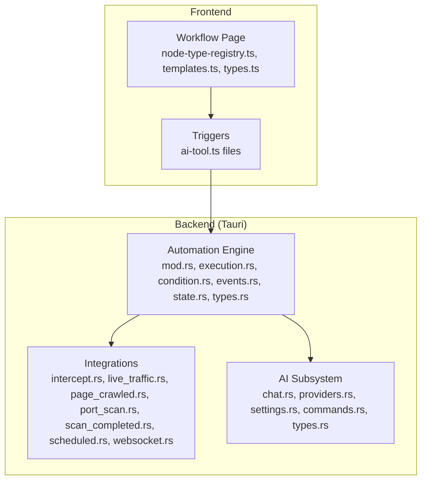
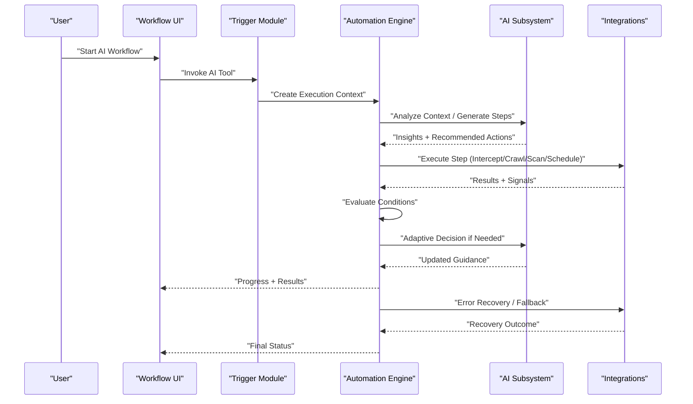
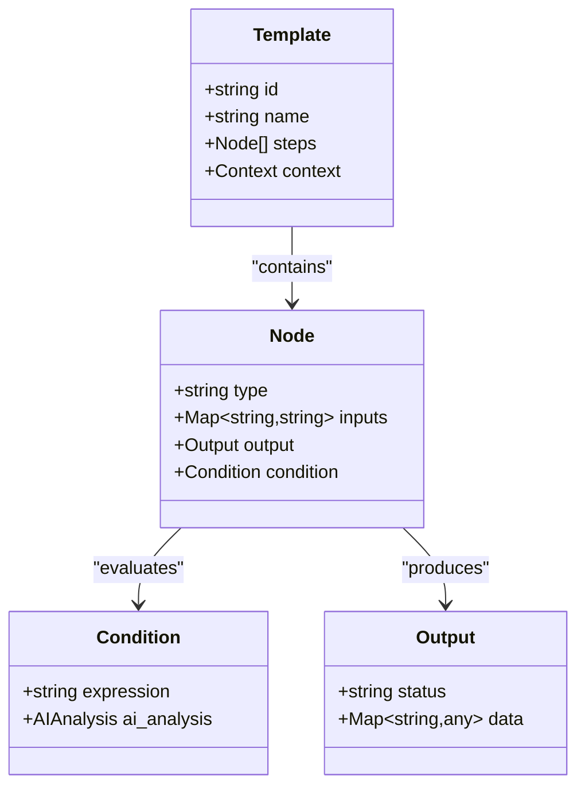
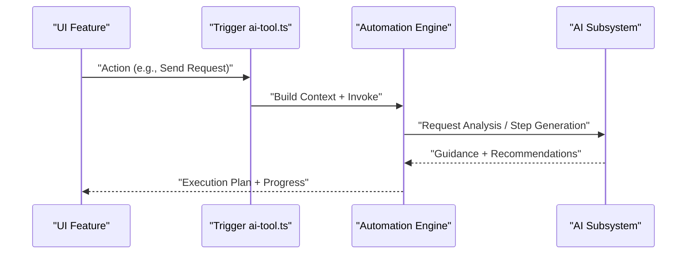
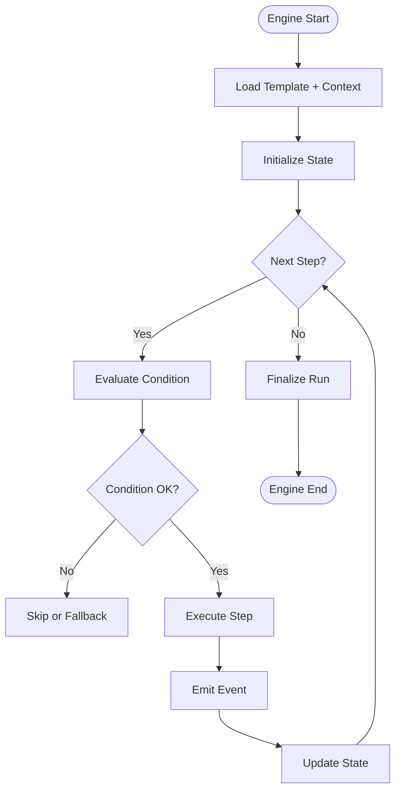
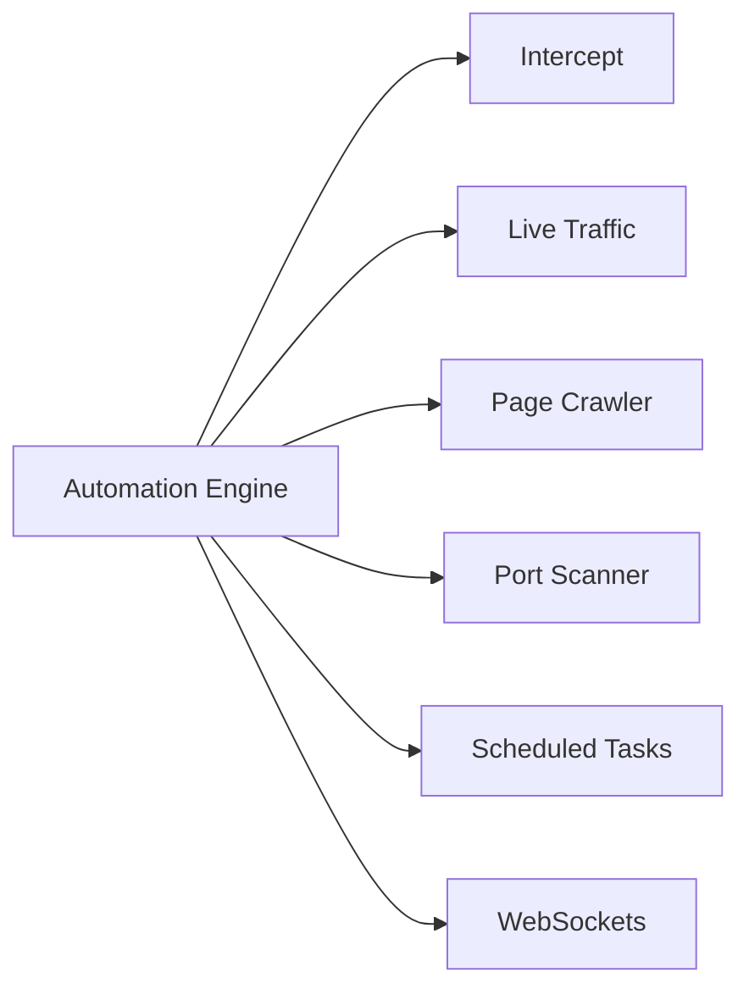
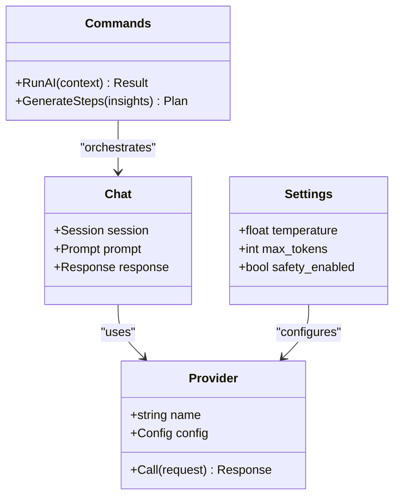
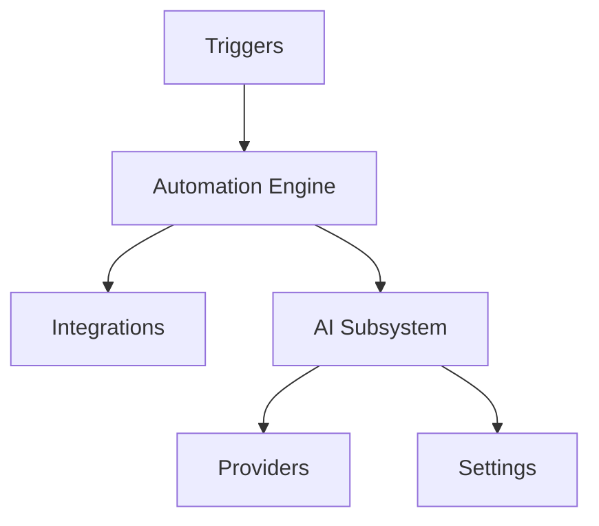

# AI-Powered Automation Workflows

<cite>
**Referenced Files in This Document**
- [workflows.mdx](file://docs/website/content/docs/ai-and-automation/workflows.mdx)
- [index.mdx](file://docs/website/content/docs/ai-and-automation/index.mdx)
- [browser.mdx](file://docs/website/content/docs/ai-and-automation/browser.mdx)
- [regression.mdx](file://docs/website/content/docs/ai-and-automation/regression.mdx)
- [node-type-registry.ts](file://src/pages/workflow/node-type-registry.ts)
- [templates.ts](file://src/pages/workflow/templates.ts)
- [types.ts](file://src/pages/workflow/types.ts)
- [mod.rs](file://src-tauri/src/automation/mod.rs)
- [execution.rs](file://src-tauri/src/automation/execution.rs)
- [condition.rs](file://src-tauri/src/automation/condition.rs)
- [events.rs](file://src-tauri/src/automation/events.rs)
- [state.rs](file://src-tauri/src/automation/state.rs)
- [types.rs](file://src-tauri/src/automation/types.rs)
- [intercept.rs](file://src-tauri/src/automation/intercept.rs)
- [live_traffic.rs](file://src-tauri/src/automation/live_traffic.rs)
- [page_crawled.rs](file://src-tauri/src/automation/page_crawled.rs)
- [port_scan.rs](file://src-tauri/src/automation/port_scan.rs)
- [scan_completed.rs](file://src-tauri/src/automation/scan_completed.rs)
- [scheduled.rs](file://src-tauri/src/automation/scheduled.rs)
- [websocket.rs](file://src-tauri/src/automation/websocket.rs)
- [ai-tool.ts](file://src/triggers/invoker/ai-tool.ts)
- [ai-tool.ts](file://src/triggers/repeater/ai-tool.ts)
- [ai-tool.ts](file://src/triggers/intercept/ai-tool.ts)
- [ai-tool.ts](file://src/triggers/browser/ai-tool.ts)
- [ai-tool.ts](file://src/triggers/documents/ai-tool.ts)
- [ai-tool.ts](file://src/triggers/terminal/ai-tool.ts)
- [chat.rs](file://src-tauri/src/ai/chat.rs)
- [providers.rs](file://src-tauri/src/ai/providers.rs)
- [settings.rs](file://src-tauri/src/ai/settings.rs)
- [commands.rs](file://src-tauri/src/ai/commands.rs)
- [types.rs](file://src-tauri/src/ai/types.rs)
</cite>

## Table of Contents
1. [Introduction](#introduction)
2. [Project Structure](#project-structure)
3. [Core Components](#core-components)
4. [Architecture Overview](#architecture-overview)
5. [Detailed Component Analysis](#detailed-component-analysis)
6. [Dependency Analysis](#dependency-analysis)
7. [Performance Considerations](#performance-considerations)
8. [Troubleshooting Guide](#troubleshooting-guide)
9. [Conclusion](#conclusion)
10. [Appendices](#appendices)

## Introduction
This document explains how Apprecon’s AI-powered automation workflows enhance execution, decision-making, and adaptive behavior. It covers AI-driven workflow templates, intelligent routing based on context, automated response generation, conditional logic powered by AI analysis, dynamic step generation, and error recovery strategies. It also provides concrete examples for security testing workflows, automated vulnerability assessment pipelines, and intelligent test case generation.

## Project Structure
Apprecon implements AI-powered automation across both the frontend (workflow UI and triggers) and the backend (Tauri Rust engine). The key areas are:
- Documentation describing AI and automation concepts and workflows
- Workflow page with node registry, templates, and types
- Triggers that connect UI actions to AI tools
- Tauri automation engine modules for execution, conditions, events, and integrations
- AI subsystem for chat, providers, settings, and commands

**Diagram sources**
- [node-type-registry.ts](file://src/pages/workflow/node-type-registry.ts)
- [templates.ts](file://src/pages/workflow/templates.ts)
- [types.ts](file://src/pages/workflow/types.ts)
- [ai-tool.ts](file://src/triggers/invoker/ai-tool.ts)
- [ai-tool.ts](file://src/triggers/repeater/ai-tool.ts)
- [ai-tool.ts](file://src/triggers/intercept/ai-tool.ts)
- [ai-tool.ts](file://src/triggers/browser/ai-tool.ts)
- [ai-tool.ts](file://src/triggers/documents/ai-tool.ts)
- [ai-tool.ts](file://src/triggers/terminal/ai-tool.ts)
- [mod.rs](file://src-tauri/src/automation/mod.rs)
- [execution.rs](file://src-tauri/src/automation/execution.rs)
- [condition.rs](file://src-tauri/src/automation/condition.rs)
- [events.rs](file://src-tauri/src/automation/events.rs)
- [state.rs](file://src-tauri/src/automation/state.rs)
- [types.rs](file://src-tauri/src/automation/types.rs)
- [intercept.rs](file://src-tauri/src/automation/intercept.rs)
- [live_traffic.rs](file://src-tauri/src/automation/live_traffic.rs)
- [page_crawled.rs](file://src-tauri/src/automation/page_crawled.rs)
- [port_scan.rs](file://src-tauri/src/automation/port_scan.rs)
- [scan_completed.rs](file://src-tauri/src/automation/scan_completed.rs)
- [scheduled.rs](file://src-tauri/src/automation/scheduled.rs)
- [websocket.rs](file://src-tauri/src/automation/websocket.rs)
- [chat.rs](file://src-tauri/src/ai/chat.rs)
- [providers.rs](file://src-tauri/src/ai/providers.rs)
- [settings.rs](file://src-tauri/src/ai/settings.rs)
- [commands.rs](file://src-tauri/src/ai/commands.rs)
- [types.rs](file://src-tauri/src/ai/types.rs)

**Section sources**
- [workflows.mdx](file://docs/website/content/docs/ai-and-automation/workflows.mdx)
- [index.mdx](file://docs/website/content/docs/ai-and-automation/index.mdx)
- [browser.mdx](file://docs/website/content/docs/ai-and-automation/browser.mdx)
- [regression.mdx](file://docs/website/content/docs/ai-and-automation/regression.mdx)
- [node-type-registry.ts](file://src/pages/workflow/node-type-registry.ts)
- [templates.ts](file://src/pages/workflow/templates.ts)
- [types.ts](file://src/pages/workflow/types.ts)
- [mod.rs](file://src-tauri/src/automation/mod.rs)
- [execution.rs](file://src-tauri/src/automation/execution.rs)
- [condition.rs](file://src-tauri/src/automation/condition.rs)
- [events.rs](file://src-tauri/src/automation/events.rs)
- [state.rs](file://src-tauri/src/automation/state.rs)
- [types.rs](file://src-tauri/src/automation/types.rs)
- [intercept.rs](file://src-tauri/src/automation/intercept.rs)
- [live_traffic.rs](file://src-tauri/src/automation/live_traffic.rs)
- [page_crawled.rs](file://src-tauri/src/automation/page_crawled.rs)
- [port_scan.rs](file://src-tauri/src/automation/port_scan.rs)
- [scan_completed.rs](file://src-tauri/src/automation/scan_completed.rs)
- [scheduled.rs](file://src-tauri/src/automation/scheduled.rs)
- [websocket.rs](file://src-tauri/src/automation/websocket.rs)
- [chat.rs](file://src-tauri/src/ai/chat.rs)
- [providers.rs](file://src-tauri/src/ai/providers.rs)
- [settings.rs](file://src-tauri/src/ai/settings.rs)
- [commands.rs](file://src-tauri/src/ai/commands.rs)
- [types.rs](file://src-tauri/src/ai/types.rs)

## Core Components
- Workflow Templates and Node Registry: Define reusable workflow blueprints and register executable nodes.
- Trigger-to-AI Bridge: Connects UI actions to AI tool invocations via trigger modules.
- Automation Engine: Orchestrates execution, evaluates conditions, manages state, and emits events.
- Integrations: Intercepts traffic, crawls pages, scans ports, handles websockets, and schedules tasks.
- AI Subsystem: Manages provider configuration, chat sessions, and command orchestration.

Key responsibilities:
- Dynamic step generation from AI analysis results
- Context-aware routing decisions using AI insights
- Automated response generation for user feedback or downstream systems
- Conditional branching based on AI-derived confidence and risk signals
- Error recovery through retries, fallback steps, and safe rollbacks

**Section sources**
- [node-type-registry.ts](file://src/pages/workflow/node-type-registry.ts)
- [templates.ts](file://src/pages/workflow/templates.ts)
- [types.ts](file://src/pages/workflow/types.ts)
- [ai-tool.ts](file://src/triggers/invoker/ai-tool.ts)
- [ai-tool.ts](file://src/triggers/repeater/ai-tool.ts)
- [ai-tool.ts](file://src/triggers/intercept/ai-tool.ts)
- [ai-tool.ts](file://src/triggers/browser/ai-tool.ts)
- [ai-tool.ts](file://src/triggers/documents/ai-tool.ts)
- [ai-tool.ts](file://src/triggers/terminal/ai-tool.ts)
- [mod.rs](file://src-tauri/src/automation/mod.rs)
- [execution.rs](file://src-tauri/src/automation/execution.rs)
- [condition.rs](file://src-tauri/src/automation/condition.rs)
- [events.rs](file://src-tauri/src/automation/events.rs)
- [state.rs](file://src-tauri/src/automation/state.rs)
- [types.rs](file://src-tauri/src/automation/types.rs)
- [chat.rs](file://src-tauri/src/ai/chat.rs)
- [providers.rs](file://src-tauri/src/ai/providers.rs)
- [settings.rs](file://src-tauri/src/ai/settings.rs)
- [commands.rs](file://src-tauri/src/ai/commands.rs)
- [types.rs](file://src-tauri/src/ai/types.rs)

## Architecture Overview
The AI-powered workflow architecture integrates frontend triggers, a robust automation engine, and an AI subsystem. Workflows execute steps conditionally, adapt based on AI analysis, and interact with system features like intercepting traffic, crawling pages, scanning ports, and scheduling tasks.

**Diagram sources**
- [ai-tool.ts](file://src/triggers/invoker/ai-tool.ts)
- [mod.rs](file://src-tauri/src/automation/mod.rs)
- [execution.rs](file://src-tauri/src/automation/execution.rs)
- [condition.rs](file://src-tauri/src/automation/condition.rs)
- [events.rs](file://src-tauri/src/automation/events.rs)
- [state.rs](file://src-tauri/src/automation/state.rs)
- [types.rs](file://src-tauri/src/automation/types.rs)
- [chat.rs](file://src-tauri/src/ai/chat.rs)
- [providers.rs](file://src-tauri/src/ai/providers.rs)
- [settings.rs](file://src-tauri/src/ai/settings.rs)
- [commands.rs](file://src-tauri/src/ai/commands.rs)
- [types.rs](file://src-tauri/src/ai/types.rs)
- [intercept.rs](file://src-tauri/src/automation/intercept.rs)
- [live_traffic.rs](file://src-tauri/src/automation/live_traffic.rs)
- [page_crawled.rs](file://src-tauri/src/automation/page_crawled.rs)
- [port_scan.rs](file://src-tauri/src/automation/port_scan.rs)
- [scan_completed.rs](file://src-tauri/src/automation/scan_completed.rs)
- [scheduled.rs](file://src-tauri/src/automation/scheduled.rs)
- [websocket.rs](file://src-tauri/src/automation/websocket.rs)

## Detailed Component Analysis

### Workflow Templates and Node Registry
- Templates define reusable sequences of steps tailored for common scenarios such as security testing and regression validation.
- The node registry maps node types to their implementations, enabling dynamic composition and extension.
- Types unify the schema for nodes, inputs, outputs, and metadata used by the engine.

**Diagram sources**
- [templates.ts](file://src/pages/workflow/templates.ts)
- [node-type-registry.ts](file://src/pages/workflow/node-type-registry.ts)
- [types.ts](file://src/pages/workflow/types.ts)

**Section sources**
- [templates.ts](file://src/pages/workflow/templates.ts)
- [node-type-registry.ts](file://src/pages/workflow/node-type-registry.ts)
- [types.ts](file://src/pages/workflow/types.ts)

### Trigger-to-AI Bridge
- Each trigger module connects a specific UI feature (e.g., Invoker, Repeater, Intercept, Browser, Documents, Terminal) to AI tool invocations.
- Triggers construct context payloads and forward them to the automation engine for execution.

**Diagram sources**
- [ai-tool.ts](file://src/triggers/invoker/ai-tool.ts)
- [ai-tool.ts](file://src/triggers/repeater/ai-tool.ts)
- [ai-tool.ts](file://src/triggers/intercept/ai-tool.ts)
- [ai-tool.ts](file://src/triggers/browser/ai-tool.ts)
- [ai-tool.ts](file://src/triggers/documents/ai-tool.ts)
- [ai-tool.ts](file://src/triggers/terminal/ai-tool.ts)
- [mod.rs](file://src-tauri/src/automation/mod.rs)
- [execution.rs](file://src-tauri/src/automation/execution.rs)
- [chat.rs](file://src-tauri/src/ai/chat.rs)
- [providers.rs](file://src-tauri/src/ai/providers.rs)
- [settings.rs](file://src-tauri/src/ai/settings.rs)
- [commands.rs](file://src-tauri/src/ai/commands.rs)
- [types.rs](file://src-tauri/src/ai/types.rs)

**Section sources**
- [ai-tool.ts](file://src/triggers/invoker/ai-tool.ts)
- [ai-tool.ts](file://src/triggers/repeater/ai-tool.ts)
- [ai-tool.ts](file://src/triggers/intercept/ai-tool.ts)
- [ai-tool.ts](file://src/triggers/browser/ai-tool.ts)
- [ai-tool.ts](file://src/triggers/documents/ai-tool.ts)
- [ai-tool.ts](file://src/triggers/terminal/ai-tool.ts)

### Automation Engine: Execution, Conditions, Events, State
- Execution orchestrates step sequencing, concurrency, and lifecycle management.
- Condition evaluation supports static rules and AI-enhanced decisions.
- Events emit progress, results, and errors for UI updates and downstream consumers.
- State tracks run context, variables, and checkpoints for resiliency.

**Diagram sources**
- [execution.rs](file://src-tauri/src/automation/execution.rs)
- [condition.rs](file://src-tauri/src/automation/condition.rs)
- [events.rs](file://src-tauri/src/automation/events.rs)
- [state.rs](file://src-tauri/src/automation/state.rs)
- [types.rs](file://src-tauri/src/automation/types.rs)

**Section sources**
- [execution.rs](file://src-tauri/src/automation/execution.rs)
- [condition.rs](file://src-tauri/src/automation/condition.rs)
- [events.rs](file://src-tauri/src/automation/events.rs)
- [state.rs](file://src-tauri/src/automation/state.rs)
- [types.rs](file://src-tauri/src/automation/types.rs)

### Integrations: Intercept, Live Traffic, Crawling, Port Scan, Scheduled, WebSockets
- Intercept captures and manipulates HTTP traffic for analysis and mutation.
- Live traffic monitoring feeds real-time signals into workflows.
- Page crawling discovers endpoints and content for targeted testing.
- Port scanning identifies open services and banners for reconnaissance.
- Scheduled tasks automate recurring assessments.
- WebSockets enable bidirectional communication for streaming results.

**Diagram sources**
- [intercept.rs](file://src-tauri/src/automation/intercept.rs)
- [live_traffic.rs](file://src-tauri/src/automation/live_traffic.rs)
- [page_crawled.rs](file://src-tauri/src/automation/page_crawled.rs)
- [port_scan.rs](file://src-tauri/src/automation/port_scan.rs)
- [scan_completed.rs](file://src-tauri/src/automation/scan_completed.rs)
- [scheduled.rs](file://src-tauri/src/automation/scheduled.rs)
- [websocket.rs](file://src-tauri/src/automation/websocket.rs)

**Section sources**
- [intercept.rs](file://src-tauri/src/automation/intercept.rs)
- [live_traffic.rs](file://src-tauri/src/automation/live_traffic.rs)
- [page_crawled.rs](file://src-tauri/src/automation/page_crawled.rs)
- [port_scan.rs](file://src-tauri/src/automation/port_scan.rs)
- [scan_completed.rs](file://src-tauri/src/automation/scan_completed.rs)
- [scheduled.rs](file://src-tauri/src/automation/scheduled.rs)
- [websocket.rs](file://src-tauri/src/automation/websocket.rs)

### AI Subsystem: Chat, Providers, Settings, Commands
- Chat manages conversational context and prompts for AI interactions.
- Providers configure model backends and credentials.
- Settings control behavior such as temperature, max tokens, and safety filters.
- Commands orchestrate AI operations within workflows and tools.

**Diagram sources**
- [chat.rs](file://src-tauri/src/ai/chat.rs)
- [providers.rs](file://src-tauri/src/ai/providers.rs)
- [settings.rs](file://src-tauri/src/ai/settings.rs)
- [commands.rs](file://src-tauri/src/ai/commands.rs)
- [types.rs](file://src-tauri/src/ai/types.rs)

**Section sources**
- [chat.rs](file://src-tauri/src/ai/chat.rs)
- [providers.rs](file://src-tauri/src/ai/providers.rs)
- [settings.rs](file://src-tauri/src/ai/settings.rs)
- [commands.rs](file://src-tauri/src/ai/commands.rs)
- [types.rs](file://src-tauri/src/ai/types.rs)

## Dependency Analysis
The workflow system exhibits clear separation between UI triggers, the automation engine, integrations, and the AI subsystem. Dependencies are primarily unidirectional: triggers call the engine; the engine calls integrations and AI; AI depends on providers and settings.

**Diagram sources**
- [ai-tool.ts](file://src/triggers/invoker/ai-tool.ts)
- [mod.rs](file://src-tauri/src/automation/mod.rs)
- [execution.rs](file://src-tauri/src/automation/execution.rs)
- [intercept.rs](file://src-tauri/src/automation/intercept.rs)
- [live_traffic.rs](file://src-tauri/src/automation/live_traffic.rs)
- [page_crawled.rs](file://src-tauri/src/automation/page_crawled.rs)
- [port_scan.rs](file://src-tauri/src/automation/port_scan.rs)
- [scan_completed.rs](file://src-tauri/src/automation/scan_completed.rs)
- [scheduled.rs](file://src-tauri/src/automation/scheduled.rs)
- [websocket.rs](file://src-tauri/src/automation/websocket.rs)
- [chat.rs](file://src-tauri/src/ai/chat.rs)
- [providers.rs](file://src-tauri/src/ai/providers.rs)
- [settings.rs](file://src-tauri/src/ai/settings.rs)
- [commands.rs](file://src-tauri/src/ai/commands.rs)
- [types.rs](file://src-tauri/src/ai/types.rs)

**Section sources**
- [mod.rs](file://src-tauri/src/automation/mod.rs)
- [execution.rs](file://src-tauri/src/automation/execution.rs)
- [condition.rs](file://src-tauri/src/automation/condition.rs)
- [events.rs](file://src-tauri/src/automation/events.rs)
- [state.rs](file://src-tauri/src/automation/state.rs)
- [types.rs](file://src-tauri/src/automation/types.rs)
- [chat.rs](file://src-tauri/src/ai/chat.rs)
- [providers.rs](file://src-tauri/src/ai/providers.rs)
- [settings.rs](file://src-tauri/src/ai/settings.rs)
- [commands.rs](file://src-tauri/src/ai/commands.rs)
- [types.rs](file://src-tauri/src/ai/types.rs)

## Performance Considerations
- Concurrency: Parallelize independent steps where safe; serialize sensitive operations like intercept mutations.
- Caching: Cache AI responses for identical contexts to reduce latency and cost.
- Streaming: Use WebSockets for large result sets to avoid blocking UI.
- Backpressure: Limit concurrent AI calls and integrate rate limiting at providers.
- Memory: Stream payloads and avoid holding large intermediate states in memory.

[No sources needed since this section provides general guidance]

## Troubleshooting Guide
Common issues and resolutions:
- AI provider misconfiguration: Validate provider settings and credentials; check logs for authentication failures.
- Condition evaluation errors: Inspect expressions and ensure required context variables exist.
- Integration timeouts: Increase timeouts or implement retries; verify network connectivity and proxy settings.
- State inconsistencies: Review checkpoints and restore from last known good state.
- Event loss: Ensure event emission is reliable and UI listeners handle reconnection.

**Section sources**
- [execution.rs](file://src-tauri/src/automation/execution.rs)
- [condition.rs](file://src-tauri/src/automation/condition.rs)
- [events.rs](file://src-tauri/src/automation/events.rs)
- [state.rs](file://src-tauri/src/automation/state.rs)
- [settings.rs](file://src-tauri/src/ai/settings.rs)
- [providers.rs](file://src-tauri/src/ai/providers.rs)

## Conclusion
Apprecon’s AI-powered automation workflows combine template-driven design, intelligent routing, and adaptive execution to streamline security testing, vulnerability assessments, and test case generation. The modular architecture ensures scalability, resilience, and extensibility while maintaining clear separation between UI triggers, the automation engine, integrations, and the AI subsystem.

[No sources needed since this section summarizes without analyzing specific files]

## Appendices

### Example Workflows
- Security Testing Workflow: Uses intercept to capture requests, AI to analyze payloads, and port scanner to discover services. Conditional branches route high-risk findings to detailed analysis steps.
- Automated Vulnerability Assessment Pipeline: Crawls target pages, generates test cases via AI, executes tests through the invoker, and reports results via WebSocket streams.
- Intelligent Test Case Generation: Analyzes API schemas and historical traffic to propose edge-case inputs, validates outcomes, and iteratively refines tests.

**Section sources**
- [workflows.mdx](file://docs/website/content/docs/ai-and-automation/workflows.mdx)
- [browser.mdx](file://docs/website/content/docs/ai-and-automation/browser.mdx)
- [regression.mdx](file://docs/website/content/docs/ai-and-automation/regression.mdx)
- [intercept.rs](file://src-tauri/src/automation/intercept.rs)
- [page_crawled.rs](file://src-tauri/src/automation/page_crawled.rs)
- [port_scan.rs](file://src-tauri/src/automation/port_scan.rs)
- [websocket.rs](file://src-tauri/src/automation/websocket.rs)
- [ai-tool.ts](file://src/triggers/invoker/ai-tool.ts)