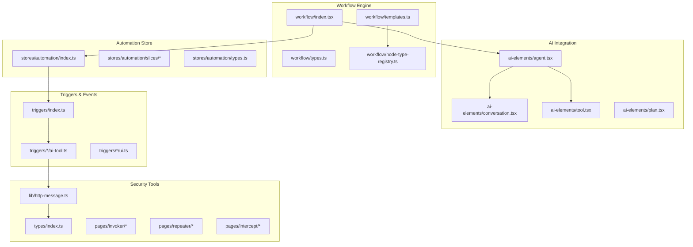
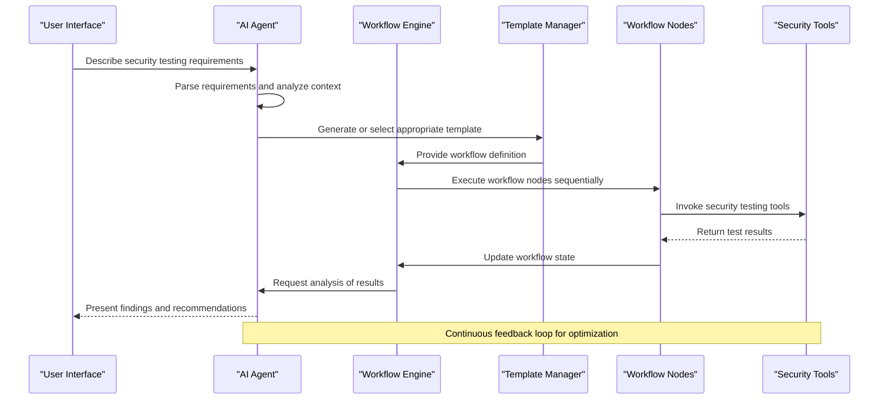
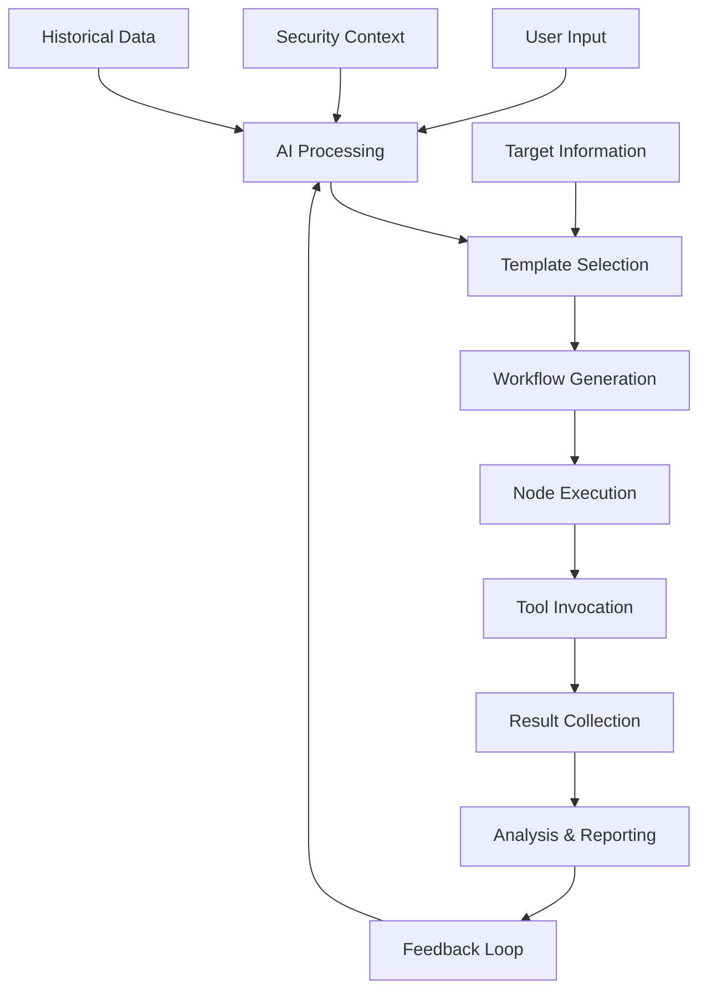
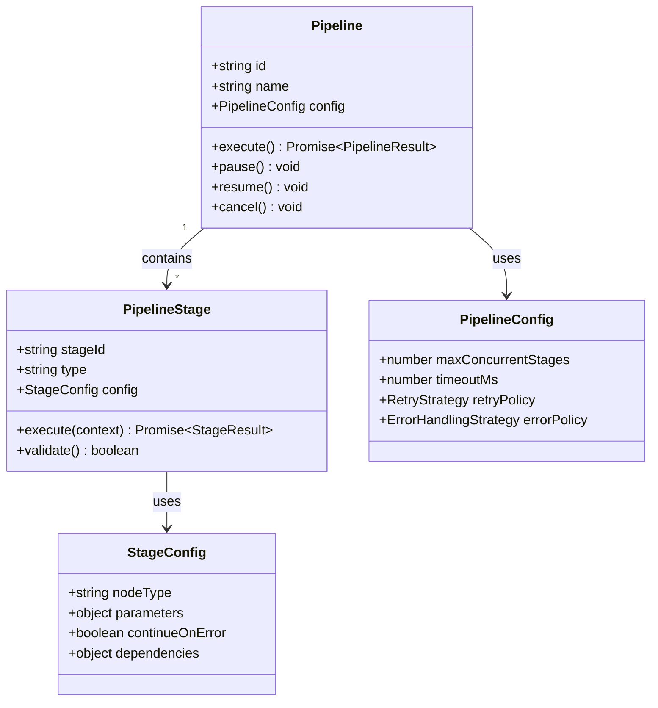
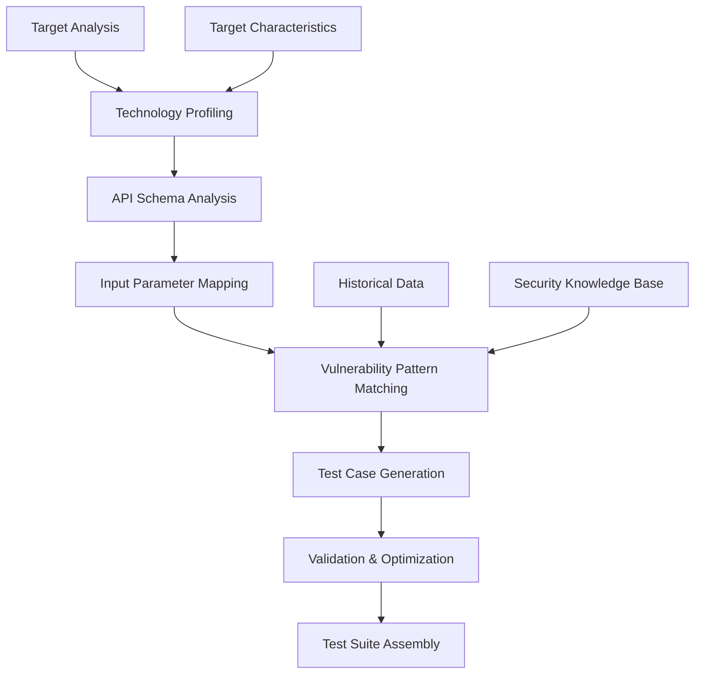
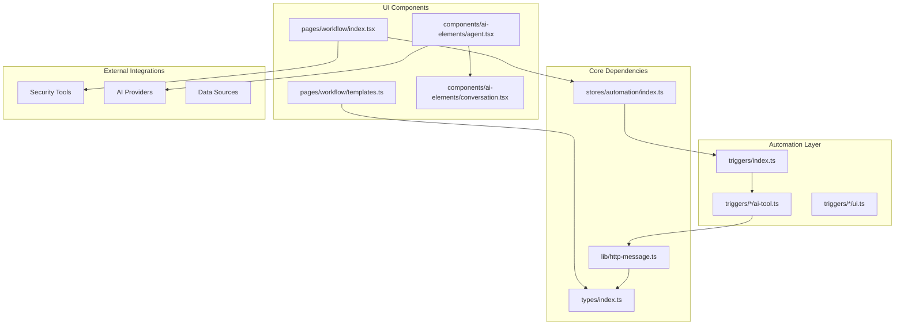

# AI-Powered Workflow Templates & Patterns

<cite>
**Referenced Files in This Document**
- [README.md](file://README.md)
- [src/pages/workflow/index.tsx](file://src/pages/workflow/index.tsx)
- [src/pages/workflow/templates.ts](file://src/pages/workflow/templates.ts)
- [src/stores/automation/index.ts](file://src/stores/automation/index.ts)
- [src/triggers/index.ts](file://src/triggers/index.ts)
- [src/components/ai-elements/agent.tsx](file://src/components/ai-elements/agent.tsx)
- [src/components/ai-elements/conversation.tsx](file://src/components/ai-elements/conversation.tsx)
- [src/components/ai-elements/tool.tsx](file://src/components/ai-elements/tool.tsx)
- [src/lib/http-message.ts](file://src/lib/http-message.ts)
- [src/types/index.ts](file://src/types/index.ts)
</cite>

## Table of Contents
1. [Introduction](#introduction)
2. [Project Structure](#project-structure)
3. [Core Components](#core-components)
4. [Architecture Overview](#architecture-overview)
5. [Detailed Component Analysis](#detailed-component-analysis)
6. [Dependency Analysis](#dependency-analysis)
7. [Performance Considerations](#performance-considerations)
8. [Troubleshooting Guide](#troubleshooting-guide)
9. [Conclusion](#conclusion)
10. [Appendices](#appendices)

## Introduction

Apprecon is a comprehensive security testing and reconnaissance platform that leverages artificial intelligence to automate and enhance security workflows. The platform provides intelligent workflow templates, automated vulnerability assessment pipelines, and adaptive test case generation capabilities designed to streamline security testing processes.

The AI-powered workflow system enables security professionals to create, customize, and execute sophisticated security testing scenarios through intuitive templates and intelligent recommendations. This documentation covers the pre-built security testing templates, automated vulnerability assessment pipelines, and intelligent test case generation workflows that form the core of Apprecon's AI capabilities.

## Project Structure

The Apprecon workflow system is organized into several key components:

**Diagram sources**
- [src/pages/workflow/index.tsx](file://src/pages/workflow/index.tsx)
- [src/pages/workflow/templates.ts](file://src/pages/workflow/templates.ts)
- [src/stores/automation/index.ts](file://src/stores/automation/index.ts)
- [src/triggers/index.ts](file://src/triggers/index.ts)

**Section sources**
- [README.md](file://README.md)

## Core Components

### Workflow Engine Architecture

The workflow engine serves as the central orchestration layer for AI-powered security testing. It manages template execution, state management, and integration with various security tools.

#### Key Workflow Components:

1. **Template Management**: Handles predefined and custom workflow templates
2. **Node Registry**: Manages different types of workflow nodes (HTTP requests, AI analysis, conditional logic)
3. **Execution Engine**: Processes workflow definitions and coordinates component interactions
4. **State Management**: Maintains workflow execution state and data flow between nodes

#### Template System Features:

- **Pre-built Security Templates**: Common vulnerability scanning patterns
- **Custom Template Creation**: User-defined workflow compositions
- **Template Validation**: Ensures workflow integrity and compatibility
- **Version Control**: Tracks template modifications and changes

**Section sources**
- [src/pages/workflow/index.tsx](file://src/pages/workflow/index.tsx)
- [src/pages/workflow/templates.ts](file://src/pages/workflow/templates.ts)

### AI Integration Layer

The AI integration layer provides intelligent automation capabilities through conversational interfaces and automated decision-making.

#### AI Agent Capabilities:

- **Natural Language Processing**: Understands security testing requirements in plain language
- **Template Generation**: Creates workflow templates from user descriptions
- **Adaptive Recommendations**: Suggests optimal workflow structures based on target characteristics
- **Intelligent Test Case Generation**: Automatically generates security test cases

#### Conversation Interface:

- **Contextual Understanding**: Maintains conversation history for coherent interactions
- **Tool Invocation**: Executes security tools through natural language commands
- **Result Interpretation**: Analyzes and presents security findings
- **Iterative Refinement**: Improves test coverage through feedback loops

**Section sources**
- [src/components/ai-elements/agent.tsx](file://src/components/ai-elements/agent.tsx)
- [src/components/ai-elements/conversation.tsx](file://src/components/ai-elements/conversation.tsx)

### Automation Store

The automation store manages the state and lifecycle of automated security workflows.

#### State Management Features:

- **Workflow Execution State**: Tracks running, completed, and failed workflows
- **Data Flow Management**: Handles data passing between workflow nodes
- **Error Handling**: Manages exceptions and recovery strategies
- **Performance Monitoring**: Tracks execution metrics and resource usage

#### Slice Architecture:

- **Workflow Slice**: Manages workflow definitions and execution
- **Template Slice**: Handles template storage and retrieval
- **Execution Slice**: Controls workflow runtime behavior
- **Results Slice**: Stores and analyzes security findings

**Section sources**
- [src/stores/automation/index.ts](file://src/stores/automation/index.ts)

## Architecture Overview

The AI-powered workflow system follows a modular architecture that separates concerns while maintaining tight integration between components.

**Diagram sources**
- [src/components/ai-elements/agent.tsx](file://src/components/ai-elements/agent.tsx)
- [src/pages/workflow/index.tsx](file://src/pages/workflow/index.tsx)
- [src/stores/automation/index.ts](file://src/stores/automation/index.ts)

### Data Flow Architecture

The system implements a reactive data flow pattern where changes in one component automatically propagate through dependent components.

**Diagram sources**
- [src/lib/http-message.ts](file://src/lib/http-message.ts)
- [src/types/index.ts](file://src/types/index.ts)

## Detailed Component Analysis

### Pre-built Security Testing Templates

Apprecon provides a comprehensive set of pre-built security testing templates designed to cover common vulnerability categories and testing scenarios.

#### Template Categories:

1. **Vulnerability Scanning Templates**:
   - SQL Injection Detection
   - Cross-Site Scripting (XSS) Testing
   - Authentication Bypass Attempts
   - API Security Testing
   - File Upload Vulnerability Scanning

2. **Reconnaissance Templates**:
   - Technology Stack Identification
   - Directory Enumeration
   - Subdomain Discovery
   - API Endpoint Mapping
   - Security Header Analysis

3. **Compliance Testing Templates**:
   - OWASP Top 10 Compliance
   - PCI DSS Requirements
   - GDPR Data Protection Checks
   - Security Best Practices Validation

#### Template Customization:

Each template supports parameterization and customization to adapt to specific target environments and testing requirements.

**Section sources**
- [src/pages/workflow/templates.ts](file://src/pages/workflow/templates.ts)

### Automated Vulnerability Assessment Pipelines

The automated pipeline system orchestrates complex security assessments through coordinated workflow execution.

#### Pipeline Architecture:

**Diagram sources**
- [src/stores/automation/index.ts](file://src/stores/automation/index.ts)
- [src/stores/automation/types.ts](file://src/stores/automation/types.ts)

#### Pipeline Features:

- **Parallel Execution**: Multiple stages can run concurrently for improved performance
- **Dependency Management**: Stages can depend on previous stage results
- **Error Recovery**: Automatic retry and fallback mechanisms
- **Progress Tracking**: Real-time status updates and progress indicators
- **Resource Management**: Efficient allocation of computational resources

### Intelligent Test Case Generation

The AI-powered test case generation system creates comprehensive security test suites based on target analysis and historical patterns.

#### Generation Process:

**Diagram sources**
- [src/components/ai-elements/agent.tsx](file://src/components/ai-elements/agent.tsx)
- [src/lib/http-message.ts](file://src/lib/http-message.ts)

#### Test Case Types:

1. **Fuzzing Tests**: Randomized input generation for boundary condition testing
2. **Payload-Based Tests**: Known exploit payloads for specific vulnerabilities
3. **Logic Flaw Tests**: Business logic validation and bypass attempts
4. **Authentication Tests**: Credential manipulation and session hijacking attempts
5. **Authorization Tests**: Privilege escalation and access control bypasses

**Section sources**
- [src/components/ai-elements/agent.tsx](file://src/components/ai-elements/agent.tsx)
- [src/lib/http-message.ts](file://src/lib/http-message.ts)

### AI Enhancement Capabilities

The AI system enhances template creation and workflow design through intelligent assistance and adaptive recommendations.

#### Template Creation Assistance:

- **Natural Language to Template**: Convert descriptive requirements into executable workflows
- **Pattern Recognition**: Identify common testing patterns and suggest optimizations
- **Compatibility Checking**: Ensure template compatibility with target environments
- **Performance Optimization**: Suggest improvements for faster execution

#### Adaptive Recommendations:

- **Target-Aware Suggestions**: Customize recommendations based on target technology stack
- **Historical Learning**: Improve suggestions based on past testing outcomes
- **Risk-Based Prioritization**: Focus on high-risk areas first
- **Resource Optimization**: Balance thoroughness with execution time

**Section sources**
- [src/components/ai-elements/agent.tsx](file://src/components/ai-elements/agent.tsx)
- [src/components/ai-elements/conversation.tsx](file://src/components/ai-elements/conversation.tsx)

## Dependency Analysis

The workflow system maintains clear separation of concerns while enabling rich interactions between components.

**Diagram sources**
- [src/types/index.ts](file://src/types/index.ts)
- [src/lib/http-message.ts](file://src/lib/http-message.ts)
- [src/stores/automation/index.ts](file://src/stores/automation/index.ts)
- [src/triggers/index.ts](file://src/triggers/index.ts)

### Coupling and Cohesion Analysis

The system demonstrates good architectural principles with high cohesion within modules and loose coupling between components.

#### High Cohesion Areas:
- **Workflow Management**: All workflow-related functionality is centralized
- **AI Integration**: AI capabilities are grouped together for easy maintenance
- **Store Management**: State management follows consistent patterns
- **Trigger System**: Event handling is well-organized by domain

#### Loose Coupling Benefits:
- **Component Reusability**: Individual components can be used independently
- **Testing Isolation**: Each module can be tested separately
- **Scalability**: New features can be added without affecting existing code
- **Maintenance**: Changes are localized and less likely to cause side effects

**Section sources**
- [src/stores/automation/index.ts](file://src/stores/automation/index.ts)
- [src/triggers/index.ts](file://src/triggers/index.ts)

## Performance Considerations

The AI-powered workflow system is designed with performance optimization in mind, particularly for large-scale security testing operations.

### Optimization Strategies:

1. **Lazy Loading**: Components and templates are loaded on-demand
2. **Caching**: Frequently used templates and AI responses are cached
3. **Parallel Processing**: Independent workflow nodes execute concurrently
4. **Memory Management**: Efficient cleanup of temporary data and resources
5. **Batch Operations**: Group related operations to reduce overhead

### Resource Management:

- **Connection Pooling**: Reuse database and API connections
- **Request Throttling**: Prevent overwhelming external services
- **Timeout Handling**: Graceful handling of slow or unresponsive components
- **Memory Limits**: Prevent memory leaks in long-running workflows

### Scalability Considerations:

- **Horizontal Scaling**: Support for distributed workflow execution
- **Load Balancing**: Distribute workload across multiple instances
- **Queue Management**: Handle high-volume request processing
- **Monitoring**: Track performance metrics and identify bottlenecks

## Troubleshooting Guide

Common issues and their solutions when working with AI-powered workflows in Apprecon.

### Workflow Execution Issues:

1. **Template Validation Errors**:
   - Check template syntax and parameter definitions
   - Verify compatibility with target environment
   - Review dependency declarations

2. **AI Integration Problems**:
   - Validate AI provider credentials and configuration
   - Check network connectivity and API rate limits
   - Review conversation context and message formatting

3. **Performance Bottlenecks**:
   - Monitor workflow execution times
   - Identify slow nodes and optimize queries
   - Adjust parallel execution settings

### Error Handling Patterns:

- **Graceful Degradation**: Continue execution when non-critical failures occur
- **Retry Logic**: Automatic retry for transient failures
- **Fallback Mechanisms**: Alternative approaches when primary methods fail
- **Logging and Diagnostics**: Comprehensive logging for troubleshooting

**Section sources**
- [src/stores/automation/index.ts](file://src/stores/automation/index.ts)
- [src/components/ai-elements/agent.tsx](file://src/components/ai-elements/agent.tsx)

## Conclusion

Apprecon's AI-powered workflow system represents a significant advancement in automated security testing capabilities. The combination of intelligent template generation, adaptive recommendations, and comprehensive automation features enables security professionals to conduct thorough vulnerability assessments efficiently.

Key strengths of the system include:

- **Intelligent Automation**: AI-driven workflow creation and optimization
- **Comprehensive Coverage**: Extensive library of security testing templates
- **Adaptive Intelligence**: Learning from historical data to improve future tests
- **Scalable Architecture**: Support for large-scale security assessments
- **User-Friendly Interface**: Natural language interaction for complex operations

The system's modular design ensures maintainability and extensibility, allowing organizations to customize and extend capabilities as their security testing requirements evolve.

## Appendices

### A. Workflow Template Examples

#### Basic Vulnerability Scan Template:
1. Target Discovery
2. Technology Profiling
3. Port Scanning
4. Service Enumeration
5. Vulnerability Assessment
6. Report Generation

#### Advanced API Security Testing Template:
1. API Documentation Analysis
2. Authentication Testing
3. Authorization Validation
4. Input Validation Testing
5. Rate Limiting Verification
6. Error Handling Assessment
7. Security Headers Validation

### B. AI Prompt Engineering Guidelines

Effective prompts for workflow generation should include:
- Clear description of target application
- Specific security testing requirements
- Desired output format and scope
- Performance constraints and limitations
- Compliance requirements and standards

### C. Performance Tuning Recommendations

- Optimize template complexity for target environment
- Use appropriate concurrency levels based on system resources
- Implement caching strategies for repeated operations
- Monitor and adjust timeout configurations
- Regular template maintenance and optimization