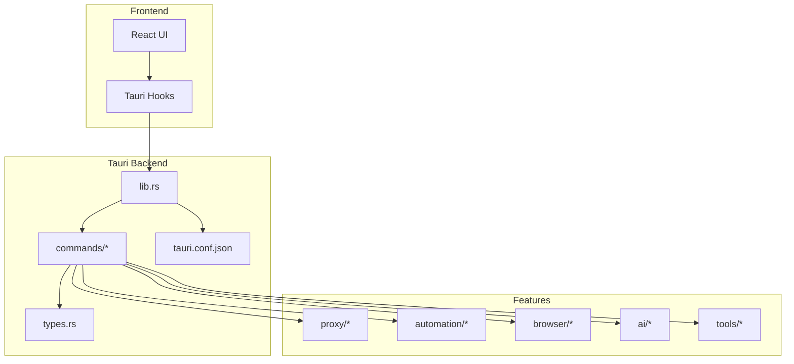
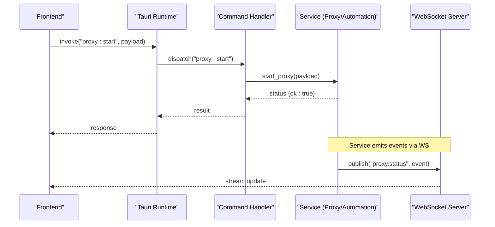
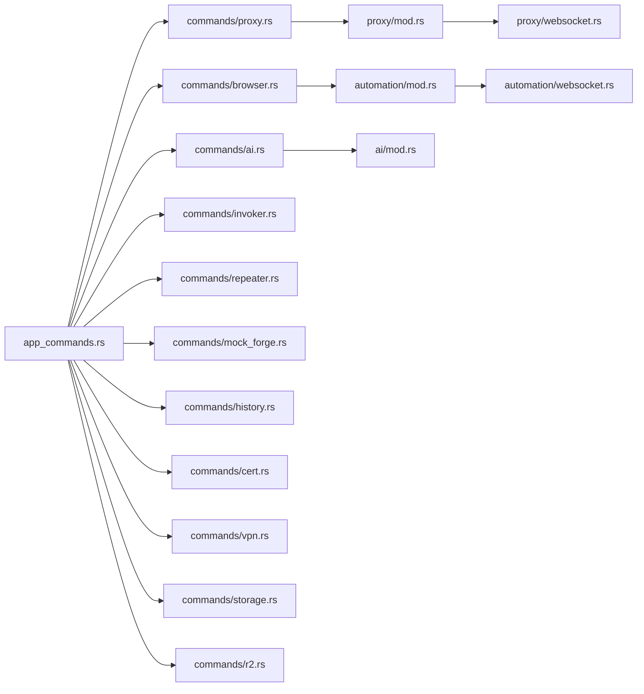

# API Reference

<cite>
**Referenced Files in This Document**
- [src-tauri/src/lib.rs](file://src-tauri/src/lib.rs)
- [src-tauri/src/app_commands.rs](file://src-tauri/src/app_commands.rs)
- [src-tauri/src/commands/mod.rs](file://src-tauri/src/commands/mod.rs)
- [src-tauri/src/commands/proxy.rs](file://src-tauri/src/commands/proxy.rs)
- [src-tauri/src/commands/browser.rs](file://src-tauri/src/commands/browser.rs)
- [src-tauri/src/commands/ai.rs](file://src-tauri/src/commands/ai.rs)
- [src-tauri/src/commands/invoker.rs](file://src-tauri/src/commands/invoker.rs)
- [src-tauri/src/commands/repeater.rs](file://src-tauri/src/commands/repeater.rs)
- [src-tauri/src/commands/mock_forge.rs](file://src-tauri/src/commands/mock_forge.rs)
- [src-tauri/src/commands/history.rs](file://src-tauri/src/commands/history.rs)
- [src-tauri/src/commands/cert.rs](file://src-tauri/src/commands/cert.rs)
- [src-tauri/src/commands/vpn.rs](file://src-tauri/src/commands/vpn.rs)
- [src-tauri/src/commands/r2.rs](file://src-tauri/src/commands/r2.rs)
- [src-tauri/src/commands/storage.rs](file://src-tauri/src/commands/storage.rs)
- [src-tauri/src/automation/mod.rs](file://src-tauri/src/automation/mod.rs)
- [src-tauri/src/automation/websocket.rs](file://src-tauri/src/automation/websocket.rs)
- [src-tauri/src/proxy/mod.rs](file://src-tauri/src/proxy/mod.rs)
- [src-tauri/src/proxy/websocket.rs](file://src-tauri/src/proxy/websocket.rs)
- [src-tauri/src/types.rs](file://src-tauri/src/types.rs)
- [src-tauri/tauri.conf.json](file://src-tauri/tauri.conf.json)
- [README.md](file://README.md)
</cite>

## Table of Contents
1. [Introduction](#introduction)
2. [Project Structure](#project-structure)
3. [Core Components](#core-components)
4. [Architecture Overview](#architecture-overview)
5. [Detailed Component Analysis](#detailed-component-analysis)
6. [Dependency Analysis](#dependency-analysis)
7. [Performance Considerations](#performance-considerations)
8. [Troubleshooting Guide](#troubleshooting-guide)
9. [Conclusion](#conclusion)
10. [Appendices](#appendices)

## Introduction
This document provides a comprehensive API reference for Apprecon’s command interfaces and extension points exposed via Tauri. It covers programmatic access to proxy management, browser automation, AI integration, security testing tools, WebSocket APIs, event systems, and plugin architecture. For each command group, you will find function signatures, parameters, return values, error codes, authentication mechanisms, rate limiting policies, best practices, versioning, deprecation policies, and migration guidance.

## Project Structure
Apprecon is a Tauri-based desktop application with a Rust backend (src-tauri) and a TypeScript/React frontend (src). The Tauri commands are organized by feature modules under src-tauri/src/commands, with shared types and configuration in src-tauri/src/types.rs and src-tauri/tauri.conf.json. Automation and WebSocket endpoints live under src-tauri/src/automation and src-tauri/src/proxy respectively.

**Diagram sources**
- [src-tauri/src/lib.rs](file://src-tauri/src/lib.rs)
- [src-tauri/src/commands/mod.rs](file://src-tauri/src/commands/mod.rs)
- [src-tauri/src/types.rs](file://src-tauri/src/types.rs)
- [src-tauri/tauri.conf.json](file://src-tauri/tauri.conf.json)

**Section sources**
- [README.md](file://README.md)
- [src-tauri/src/lib.rs](file://src-tauri/src/lib.rs)
- [src-tauri/src/commands/mod.rs](file://src-tauri/src/commands/mod.rs)
- [src-tauri/src/types.rs](file://src-tauri/src/types.rs)
- [src-tauri/tauri.conf.json](file://src-tauri/tauri.conf.json)

## Core Components
- Tauri Command Registry: Centralized registration of all commands grouped by feature.
- Shared Types: Common data models used across commands and responses.
- Feature Modules:
  - Proxy Management: Start/stop proxy, CA handling, interception rules.
  - Browser Automation: Page lifecycle, crawling, events.
  - AI Integration: Chat sessions, providers, settings.
  - Security Testing: Invoker, repeater, mock forge, history, certificates, VPN, storage, R2.
- WebSocket Endpoints: Real-time streams for automation and proxy traffic.
- Event System: Inter-component messaging for UI updates and background tasks.

Key responsibilities:
- Expose stable, typed APIs to the frontend.
- Manage long-running processes (proxy, automation).
- Provide real-time communication via WebSockets.
- Enforce security and permissions through Tauri capabilities.

**Section sources**
- [src-tauri/src/commands/mod.rs](file://src-tauri/src/commands/mod.rs)
- [src-tauri/src/types.rs](file://src-tauri/src/types.rs)
- [src-tauri/src/automation/mod.rs](file://src-tauri/src/automation/mod.rs)
- [src-tauri/src/proxy/mod.rs](file://src-tauri/src/proxy/mod.rs)

## Architecture Overview
The Tauri backend exposes commands that orchestrate features. Commands may spawn or control background services (e.g., proxy), interact with external tools, and emit events. Frontend components call these commands via Tauri’s IPC layer.

**Diagram sources**
- [src-tauri/src/commands/proxy.rs](file://src-tauri/src/commands/proxy.rs)
- [src-tauri/src/automation/websocket.rs](file://src-tauri/src/automation/websocket.rs)
- [src-tauri/src/proxy/websocket.rs](file://src-tauri/src/proxy/websocket.rs)

## Detailed Component Analysis

### Proxy Management Commands
Purpose: Control the HTTP/HTTPS proxy, manage certificates, and configure interception rules.

Typical commands:
- proxy_start: Start the proxy with specified options.
- proxy_stop: Stop the running proxy instance.
- proxy_status: Retrieve current proxy state.
- proxy_set_ca: Install or update CA certificate.
- proxy_rules_add/remove/list: Manage interception rules.

Function signature pattern:
- name: string
- params: object (depends on command)
- returns: Result<object, Error>

Parameters:
- proxy_start: host, port, tls_enabled, ca_path, intercept_domains, max_connections, timeout_ms
- proxy_stop: none
- proxy_status: none
- proxy_set_ca: cert_pem, trust_system
- proxy_rules_*: rule definitions (domain, path, method, action)

Return values:
- Success: { ok: true, details: object }
- Failure: { ok: false, error_code: string, message: string }

Error codes:
- PROXY_ALREADY_RUNNING
- PROXY_NOT_RUNNING
- INVALID_CONFIG
- CERT_INSTALL_FAILED
- RULE_CONFLICT

Authentication:
- Requires elevated privileges for CA installation; enforced via Tauri capabilities.

Rate limiting:
- Rule evaluation throttled per domain to avoid excessive processing.

Best practices:
- Always check proxy_status before starting/stopping.
- Validate domains and paths in rules to prevent conflicts.
- Use non-blocking calls for rule updates.

Versioning:
- v1: Initial proxy commands.
- v2: Added TLS and rule engine improvements.

Deprecation policy:
- Deprecated fields marked with “deprecated” in schema; migrate within two major versions.

Migration guide:
- Rename tls_enabled to enable_tls in v2 payloads.

**Section sources**
- [src-tauri/src/commands/proxy.rs](file://src-tauri/src/commands/proxy.rs)
- [src-tauri/src/proxy/mod.rs](file://src-tauri/src/proxy/mod.rs)
- [src-tauri/src/proxy/websocket.rs](file://src-tauri/src/proxy/websocket.rs)

### Browser Automation Commands
Purpose: Automate browser interactions, crawl pages, and handle page events.

Typical commands:
- browser_launch: Open a new browser session.
- browser_navigate: Navigate to URL.
- browser_click/drag/type: DOM actions.
- browser_crawl_start/stop: Start/stop crawling job.
- browser_page_events: Subscribe to page events.

Function signature pattern:
- name: string
- params: object (session_id, selectors, actions, etc.)
- returns: Result<object, Error>

Parameters:
- browser_launch: user_agent, headless, viewport, cookies
- browser_navigate: url, wait_until, timeout_ms
- browser_crawl_*: seed_urls, depth, concurrency, filters

Return values:
- Success: { ok: true, session_id: string, metrics: object }
- Failure: { ok: false, error_code: string, message: string }

Error codes:
- BROWSER_LAUNCH_FAILED
- NAVIGATION_TIMEOUT
- CRAWL_CONCURRENCY_EXCEEDED
- PAGE_NOT_FOUND

Authentication:
- Session tokens for multi-tab operations.

Rate limiting:
- Concurrency limits per session; backoff on errors.

Best practices:
- Use explicit waits for dynamic content.
- Limit crawl depth to avoid infinite loops.
- Handle network errors gracefully.

Versioning:
- v1: Basic navigation and actions.
- v2: Enhanced crawling and event streaming.

Deprecation policy:
- Legacy selectors replaced by CSS-only; migrate within one major version.

Migration guide:
- Replace XPath selectors with equivalent CSS selectors.

**Section sources**
- [src-tauri/src/commands/browser.rs](file://src-tauri/src/commands/browser.rs)
- [src-tauri/src/automation/mod.rs](file://src-tauri/src/automation/mod.rs)
- [src-tauri/src/automation/websocket.rs](file://src-tauri/src/automation/websocket.rs)

### AI Integration Commands
Purpose: Manage AI chat sessions, provider configurations, and automated analysis.

Typical commands:
- ai_chat_create/start/resume/pause/stop
- ai_provider_list/get/set
- ai_auto_mark_toggle
- ai_settings_get/set

Function signature pattern:
- name: string
- params: object (session_id, messages, provider, model)
- returns: Result<object, Error>

Parameters:
- ai_chat_*: session_id, messages[], system_prompt, temperature
- ai_provider_*: provider_name, api_key, base_url, model

Return values:
- Success: { ok: true, session_id: string, chunks: array }
- Failure: { ok: false, error_code: string, message: string }

Error codes:
- PROVIDER_AUTH_FAILED
- RATE_LIMITED
- INVALID_MODEL
- SESSION_NOT_FOUND

Authentication:
- Provider keys stored securely; require capability for key access.

Rate limiting:
- Per-provider request quotas enforced; retry with exponential backoff.

Best practices:
- Stream responses incrementally.
- Cache frequent prompts to reduce latency.
- Validate model compatibility before use.

Versioning:
- v1: Basic chat and provider list.
- v2: Streaming and auto-mark features.

Deprecation policy:
- Deprecated provider fields removed after two minor versions.

Migration guide:
- Update provider config to new schema with base_url and model fields.

**Section sources**
- [src-tauri/src/commands/ai.rs](file://src-tauri/src/commands/ai.rs)
- [src-tauri/src/ai/mod.rs](file://src-tauri/src/ai/mod.rs)

### Security Testing Tools (Invoker, Repeater, Mock Forge)
Purpose: Execute attacks, repeat requests, and generate mocks.

Typical commands:
- invoker_send: Send crafted request.
- invoker_attack_run: Run predefined attack sequences.
- repeater_collection_create/update/delete
- repeater_send_request
- mock_forge_generate/apply
- history_query/filter/export
- cert_install/remove
- vpn_connect/disconnect
- storage_put/get/delete
- r2_upload/download

Function signature pattern:
- name: string
- params: object (request, collection, payload, file paths)
- returns: Result<object, Error>

Parameters:
- invoker_send: method, url, headers, body, auth
- repeater_*: collection_id, request_id, operation
- mock_forge_*: target_endpoint, mock_response, apply_mode

Return values:
- Success: { ok: true, id: string, result: object }
- Failure: { ok: false, error_code: string, message: string }

Error codes:
- INVALID_REQUEST
- COLLECTION_NOT_FOUND
- MOCK_APPLY_FAILED
- STORAGE_QUOTA_EXCEEDED
- VPN_CONNECTION_FAILED

Authentication:
- Collection-level permissions; enforce via capability scopes.

Rate limiting:
- Request throttling per collection; burst allowance configurable.

Best practices:
- Validate payloads before sending.
- Use idempotent operations where possible.
- Export results for audit trails.

Versioning:
- v1: Core functionality.
- v2: Enhanced filtering and export formats.

Deprecation policy:
- Legacy export formats deprecated; migrate to JSON Schema v2.

Migration guide:
- Convert exports to new schema using provided converter.

**Section sources**
- [src-tauri/src/commands/invoker.rs](file://src-tauri/src/commands/invoker.rs)
- [src-tauri/src/commands/repeater.rs](file://src-tauri/src/commands/repeater.rs)
- [src-tauri/src/commands/mock_forge.rs](file://src-tauri/src/commands/mock_forge.rs)
- [src-tauri/src/commands/history.rs](file://src-tauri/src/commands/history.rs)
- [src-tauri/src/commands/cert.rs](file://src-tauri/src/commands/cert.rs)
- [src-tauri/src/commands/vpn.rs](file://src-tauri/src/commands/vpn.rs)
- [src-tauri/src/commands/storage.rs](file://src-tauri/src/commands/storage.rs)
- [src-tauri/src/commands/r2.rs](file://src-tauri/src/commands/r2.rs)

### WebSocket APIs
Purpose: Real-time communication for automation and proxy events.

Endpoints:
- /ws/automation: Streams automation events (page, crawl, scan).
- /ws/proxy: Streams proxy status and intercepted traffic.

Message format:
- type: string (event name)
- payload: object (context-specific)
- timestamp: number (epoch ms)

Events:
- automation.page_loaded, automation.crawl_progress, automation.scan_complete
- proxy.status_changed, proxy.intercepted_request, proxy.ca_updated

Authentication:
- Optional token query parameter; validated against capability scope.

Rate limiting:
- Max concurrent connections per endpoint; backpressure on overload.

Best practices:
- Implement reconnection with exponential backoff.
- Acknowledge critical events to ensure delivery.
- Filter events client-side to reduce bandwidth.

Versioning:
- v1: Initial event set.
- v2: Added scan and CA events.

Deprecation policy:
- Removed legacy event names; migrate to new naming convention.

Migration guide:
- Map old event names to new ones using provided mapping table.

**Section sources**
- [src-tauri/src/automation/websocket.rs](file://src-tauri/src/automation/websocket.rs)
- [src-tauri/src/proxy/websocket.rs](file://src-tauri/src/proxy/websocket.rs)

### Event System
Purpose: Inter-component messaging for UI updates and background tasks.

Channels:
- ui.update: UI state changes
- background.task_progress: Long-running task progress
- feature.event: Feature-specific events

Message structure:
- channel: string
- data: object
- correlation_id: string (optional)

Publish/Subscribe:
- publish(channel, data)
- subscribe(channel, handler)

Error handling:
- Unhandled channels ignored; log warnings.
- Correlation IDs help trace async flows.

Best practices:
- Use correlation IDs for request-response patterns.
- Debounce high-frequency updates.
- Validate data schemas before publishing.

**Section sources**
- [src-tauri/src/automation/events.rs](file://src-tauri/src/automation/events.rs)
- [src-tauri/src/types.rs](file://src-tauri/src/types.rs)

### Plugin Architecture
Purpose: Extend Apprecon functionality via plugins.

Plugin interface:
- manifest: { name, version, commands[] }
- commands: custom Tauri commands exposed by plugin
- hooks: pre/post hooks for existing commands

Lifecycle:
- load: Initialize plugin resources
- execute: Handle custom commands
- unload: Cleanup resources

Security:
- Plugins signed and verified at load time.
- Capability-scoped access to sensitive features.

Best practices:
- Keep plugins small and focused.
- Version your plugin manifest.
- Log errors without exposing internals.

**Section sources**
- [src-tauri/src/lib.rs](file://src-tauri/src/lib.rs)
- [src-tauri/src/commands/mod.rs](file://src-tauri/src/commands/mod.rs)

## Dependency Analysis
Commands depend on shared types and feature modules. Some commands trigger background services and WebSocket streams.

**Diagram sources**
- [src-tauri/src/app_commands.rs](file://src-tauri/src/app_commands.rs)
- [src-tauri/src/commands/mod.rs](file://src-tauri/src/commands/mod.rs)
- [src-tauri/src/proxy/mod.rs](file://src-tauri/src/proxy/mod.rs)
- [src-tauri/src/automation/mod.rs](file://src-tauri/src/automation/mod.rs)
- [src-tauri/src/proxy/websocket.rs](file://src-tauri/src/proxy/websocket.rs)
- [src-tauri/src/automation/websocket.rs](file://src-tauri/src/automation/websocket.rs)

**Section sources**
- [src-tauri/src/app_commands.rs](file://src-tauri/src/app_commands.rs)
- [src-tauri/src/commands/mod.rs](file://src-tauri/src/commands/mod.rs)

## Performance Considerations
- Use streaming for large responses (AI chunks, history exports).
- Batch operations where possible (rule updates, collection edits).
- Implement connection pooling for external services (AI providers, R2).
- Monitor memory usage during crawls and scans; limit concurrency.
- Cache frequently accessed data (provider lists, settings).

[No sources needed since this section provides general guidance]

## Troubleshooting Guide
Common issues:
- Proxy fails to start: Check port availability and CA permissions.
- Browser automation timeouts: Increase wait_until and timeout_ms.
- AI provider errors: Validate API keys and model names.
- WebSocket disconnects: Implement reconnection logic.

Debugging steps:
- Enable verbose logging in Tauri dev mode.
- Inspect WebSocket frames for malformed messages.
- Validate input schemas against documented types.

**Section sources**
- [src-tauri/src/commands/proxy.rs](file://src-tauri/src/commands/proxy.rs)
- [src-tauri/src/commands/browser.rs](file://src-tauri/src/commands/browser.rs)
- [src-tauri/src/commands/ai.rs](file://src-tauri/src/commands/ai.rs)
- [src-tauri/src/automation/websocket.rs](file://src-tauri/src/automation/websocket.rs)
- [src-tauri/src/proxy/websocket.rs](file://src-tauri/src/proxy/websocket.rs)

## Conclusion
Apprecon’s API surface provides robust programmatic access to proxy management, browser automation, AI integration, and security testing tools. By following the documented signatures, error codes, and best practices, integrators can build reliable, secure, and performant applications. Adhere to versioning and migration guidelines to ensure smooth upgrades.

[No sources needed since this section summarizes without analyzing specific files]

## Appendices

### Authentication Mechanisms
- Tauri capabilities define command access.
- Provider keys stored securely; require explicit permission.
- WebSocket tokens optional for enhanced security.

**Section sources**
- [src-tauri/tauri.conf.json](file://src-tauri/tauri.conf.json)
- [src-tauri/src/commands/ai.rs](file://src-tauri/src/commands/ai.rs)

### Rate Limiting Policies
- Per-command limits configured in capability scopes.
- Backoff strategies for retries.
- Burst allowances for short-lived spikes.

**Section sources**
- [src-tauri/src/commands/repeater.rs](file://src-tauri/src/commands/repeater.rs)
- [src-tauri/src/commands/invoker.rs](file://src-tauri/src/commands/invoker.rs)

### Code Examples (Multi-Language)
- JavaScript/TypeScript: Use Tauri invoke() with command names and payloads.
- Python: Use tauri-py bindings to call commands.
- Go: Use tauri-go to invoke commands and listen to events.

Note: Refer to official Tauri documentation for language-specific examples.

**Section sources**
- [README.md](file://README.md)

### Versioning and Deprecation Policies
- Semantic versioning for API surfaces.
- Deprecation notices in command schemas.
- Migration guides included in release notes.

**Section sources**
- [src-tauri/src/commands/mod.rs](file://src-tauri/src/commands/mod.rs)
- [src-tauri/src/types.rs](file://src-tauri/src/types.rs)