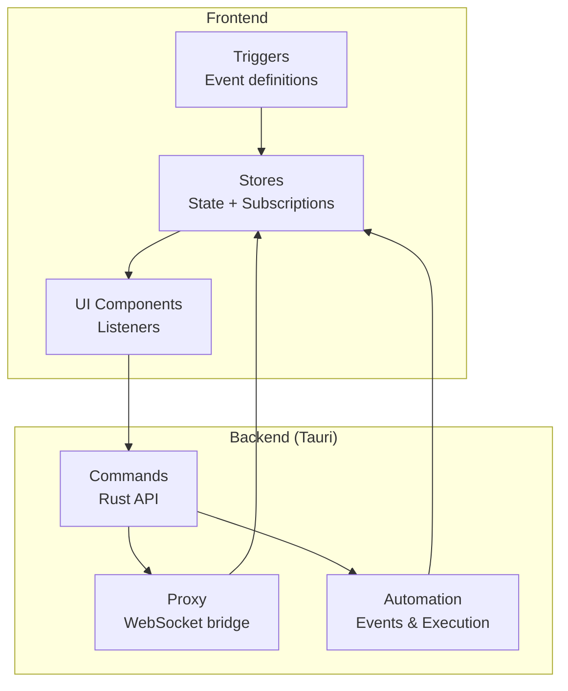
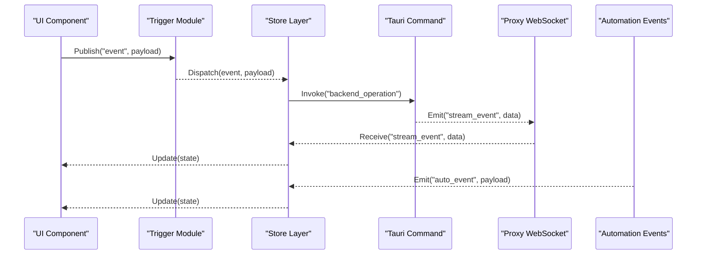
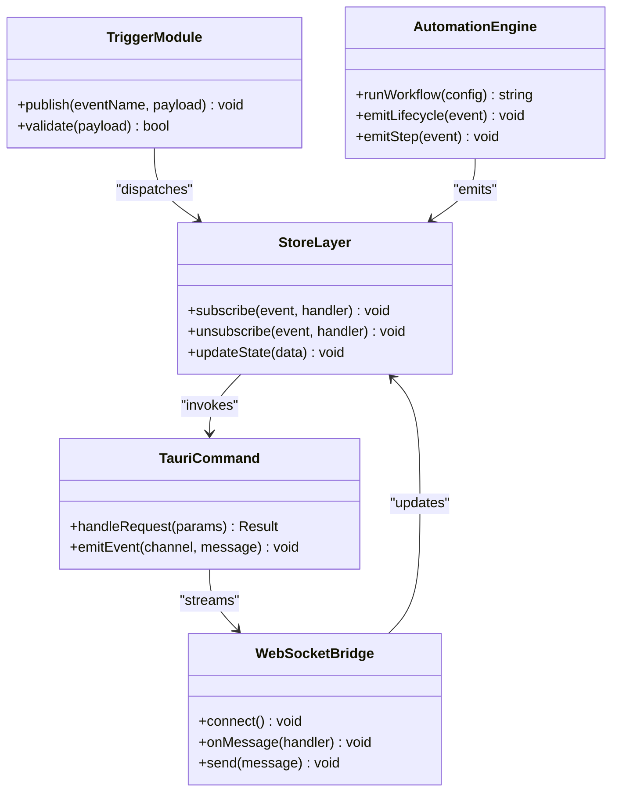
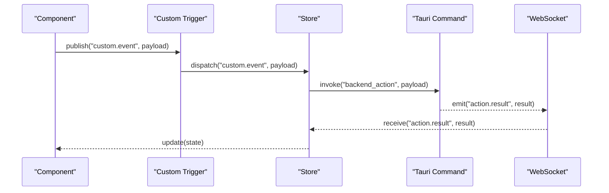
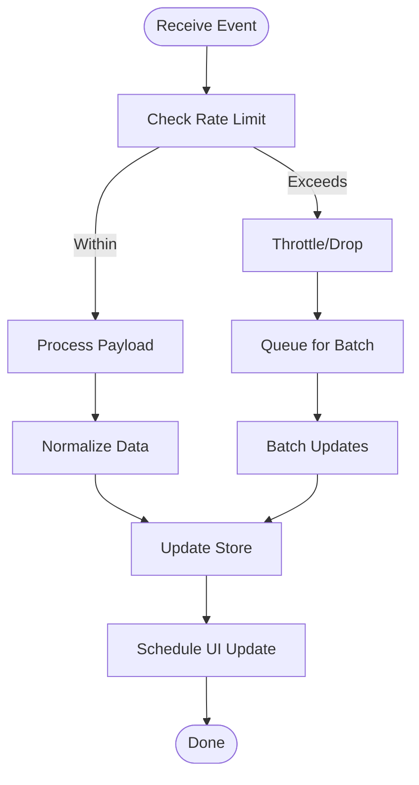
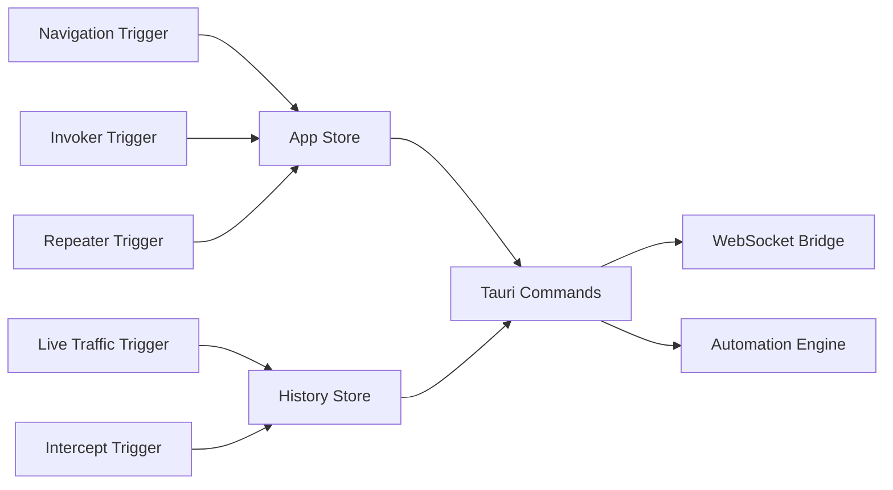

# Event System & IPC

<cite>
**Referenced Files in This Document**
- [src/triggers/index.ts](file://src/triggers/index.ts)
- [src/triggers/navigation/index.ts](file://src/triggers/navigation/index.ts)
- [src/triggers/live-traffic/index.ts](file://src/triggers/live-traffic/index.ts)
- [src/triggers/intercept/index.ts](file://src/triggers/intercept/index.ts)
- [src/triggers/invoker/index.ts](file://src/triggers/invoker/index.ts)
- [src/triggers/repeater/index.ts](file://src/triggers/repeater/index.ts)
- [src/stores/app.ts](file://src/stores/app.ts)
- [src/stores/history/index.ts](file://src/stores/history/index.ts)
- [src-tauri/src/lib.rs](file://src-tauri/src/lib.rs)
- [src-tauri/src/main.rs](file://src-tauri/src/main.rs)
- [src-tauri/src/commands/mod.rs](file://src-tauri/src/commands/mod.rs)
- [src-tauri/src/proxy/websocket.rs](file://src-tauri/src/proxy/websocket.rs)
- [src-tauri/src/automation/events.rs](file://src-tauri/src/automation/events.rs)
- [src-tauri/src/automation/types.rs](file://src-tauri/src/automation/types.rs)
</cite>

## Table of Contents
1. Introduction
2. Project Structure
3. Core Components
4. Architecture Overview
5. Detailed Component Analysis
6. Dependency Analysis
7. Performance Considerations
8. Troubleshooting Guide
9. Conclusion

## Introduction
This document explains Apprecon’s event system and inter-process communication (IPC) mechanisms across the frontend (React/TypeScript) and backend (Tauri/Rust). It covers:
- Event types and payload structures
- Subscription patterns and propagation
- Application lifecycle, UI state changes, data synchronization, and cross-component communication
- Event-driven architecture patterns and best practices
- Performance considerations for high-frequency events
- Debugging techniques
- Examples for creating custom events, subscribing to existing events, and implementing listeners in both frontend and backend components

## Project Structure
Apprecon uses a layered approach:
- Frontend triggers define domain-scoped events and utilities for publishing/subscribing within the browser process.
- Stores encapsulate application state and react to events to update UI or synchronize data.
- Tauri commands expose Rust-side functionality to the frontend via IPC.
- Backend modules (proxy, automation) emit events and handle long-running tasks, often bridged to the frontend via WebSocket or Tauri events.

**Diagram sources**
- [src/triggers/index.ts](file://src/triggers/index.ts)
- [src/stores/app.ts](file://src/stores/app.ts)
- [src-tauri/src/commands/mod.rs](file://src-tauri/src/commands/mod.rs)
- [src-tauri/src/proxy/websocket.rs](file://src-tauri/src/proxy/websocket.rs)
- [src-tauri/src/automation/events.rs](file://src-tauri/src/automation/events.rs)

**Section sources**
- [src/triggers/index.ts](file://src/triggers/index.ts)
- [src/stores/app.ts](file://src/stores/app.ts)
- [src-tauri/src/lib.rs](file://src-tauri/src/lib.rs)
- [src-tauri/src/main.rs](file://src-tauri/src/main.rs)

## Core Components
- Triggers: Centralized event registry per domain (navigation, live traffic, intercept, invoker, repeater). They define event names, payloads, and helpers for publishing.
- Stores: State containers that subscribe to events and update UI or persist data. They also publish domain-specific events to other stores/components.
- Commands: Tauri command handlers exposing backend operations to the frontend. They may emit backend events or push updates via WebSocket.
- Proxy/WebSocket: Bridges real-time traffic and backend events to the frontend store layer.
- Automation: Backend event bus and execution engine that emits structured events consumed by the frontend.

Key responsibilities:
- Define clear event contracts (names, payloads).
- Provide safe subscription APIs with lifecycle management.
- Ensure idempotent handling and error isolation.
- Route high-frequency events efficiently to avoid UI jank.

**Section sources**
- [src/triggers/navigation/index.ts](file://src/triggers/navigation/index.ts)
- [src/triggers/live-traffic/index.ts](file://src/triggers/live-traffic/index.ts)
- [src/triggers/intercept/index.ts](file://src/triggers/intercept/index.ts)
- [src/triggers/invoker/index.ts](file://src/triggers/invoker/index.ts)
- [src/triggers/repeater/index.ts](file://src/triggers/repeater/index.ts)
- [src/stores/history/index.ts](file://src/stores/history/index.ts)
- [src-tauri/src/commands/mod.rs](file://src-tauri/src/commands/mod.rs)
- [src-tauri/src/proxy/websocket.rs](file://src-tauri/src/proxy/websocket.rs)
- [src-tauri/src/automation/events.rs](file://src-tauri/src/automation/events.rs)

## Architecture Overview
The event system follows an event-driven architecture with clear separation between producers (triggers, backend commands, proxy) and consumers (stores, UI components). IPC is primarily handled by Tauri commands and WebSocket streams for real-time data.

**Diagram sources**
- [src/triggers/index.ts](file://src/triggers/index.ts)
- [src/stores/app.ts](file://src/stores/app.ts)
- [src-tauri/src/commands/mod.rs](file://src-tauri/src/commands/mod.rs)
- [src-tauri/src/proxy/websocket.rs](file://src-tauri/src/proxy/websocket.rs)
- [src-tauri/src/automation/events.rs](file://src-tauri/src/automation/events.rs)

## Detailed Component Analysis

### Triggers and Event Registry
Triggers organize events by feature area and provide consistent publishing semantics. Each trigger module defines:
- Event name constants
- Payload type definitions
- Publish helper functions
- Optional validation and normalization

Typical flow:
- UI calls trigger.publish(eventName, payload)
- Trigger validates payload and dispatches to subscribers
- Subscribers (stores, components) react accordingly

Best practices:
- Keep event names scoped and descriptive
- Validate payloads at publish time
- Avoid heavy computation inside publish; offload to async handlers

**Section sources**
- [src/triggers/navigation/index.ts](file://src/triggers/navigation/index.ts)
- [src/triggers/live-traffic/index.ts](file://src/triggers/live-traffic/index.ts)
- [src/triggers/intercept/index.ts](file://src/triggers/intercept/index.ts)
- [src/triggers/invoker/index.ts](file://src/triggers/invoker/index.ts)
- [src/triggers/repeater/index.ts](file://src/triggers/repeater/index.ts)

### Store Layer and Subscriptions
Stores manage application state and subscribe to events from triggers and backend streams. Responsibilities include:
- Registering subscriptions with proper cleanup
- Normalizing incoming payloads
- Updating state immutably
- Publishing derived events when needed

Subscription pattern:
- Subscribe on mount with a unique handler
- Unsubscribe on unmount to prevent leaks
- Debounce/throttle high-frequency updates where appropriate

Example flows:
- Navigation events update active tab and context
- Live traffic events append captured messages
- Automation events update progress and results

**Section sources**
- [src/stores/app.ts](file://src/stores/app.ts)
- [src/stores/history/index.ts](file://src/stores/history/index.ts)

### Tauri Commands and IPC
Tauri commands expose backend capabilities to the frontend. They:
- Accept typed parameters
- Perform I/O or orchestrate background tasks
- Return results or emit events via Tauri event channel
- Integrate with WebSocket for streaming updates

Command categories:
- Data operations (history, collections, settings)
- Browser and automation control
- Proxy and interception controls
- AI tool integrations

Error handling:
- Map backend errors to user-friendly messages
- Use structured error codes for client-side branching

**Section sources**
- [src-tauri/src/commands/mod.rs](file://src-tauri/src/commands/mod.rs)
- [src-tauri/src/lib.rs](file://src-tauri/src/lib.rs)
- [src-tauri/src/main.rs](file://src-tauri/src/main.rs)

### Proxy WebSocket Bridge
The proxy module bridges real-time network traffic and backend events to the frontend:
- Establishes WebSocket connection
- Emits typed events for captured requests/responses
- Handles reconnection and backoff strategies
- Buffers messages during transient failures

Data flow:
- Backend captures traffic -> formats event -> sends over WebSocket
- Frontend receives event -> normalizes payload -> updates store
- UI reacts to store changes

**Section sources**
- [src-tauri/src/proxy/websocket.rs](file://src-tauri/src/proxy/websocket.rs)

### Automation Events and Execution
Automation orchestrates complex workflows and emits structured events:
- Lifecycle events (start, pause, resume, complete, fail)
- Step-level events with payloads describing actions and results
- Aggregated status updates for UI progress indicators

Integration points:
- Frontend subscribes to automation events to render progress
- Stores persist partial results and final outcomes
- Commands trigger automation runs and return job IDs

**Section sources**
- [src-tauri/src/automation/events.rs](file://src-tauri/src/automation/events.rs)
- [src-tauri/src/automation/types.rs](file://src-tauri/src/automation/types.rs)

#### Class Diagram: Event Types and Handlers

**Diagram sources**
- [src/triggers/index.ts](file://src/triggers/index.ts)
- [src/stores/app.ts](file://src/stores/app.ts)
- [src-tauri/src/commands/mod.rs](file://src-tauri/src/commands/mod.rs)
- [src-tauri/src/proxy/websocket.rs](file://src-tauri/src/proxy/websocket.rs)
- [src-tauri/src/automation/events.rs](file://src-tauri/src/automation/events.rs)

#### Sequence Diagram: Custom Event Flow

**Diagram sources**
- [src/triggers/index.ts](file://src/triggers/index.ts)
- [src/stores/app.ts](file://src/stores/app.ts)
- [src-tauri/src/commands/mod.rs](file://src-tauri/src/commands/mod.rs)
- [src-tauri/src/proxy/websocket.rs](file://src-tauri/src/proxy/websocket.rs)

#### Flowchart: High-Frequency Event Handling

[No sources needed since this diagram shows conceptual workflow, not actual code structure]

## Dependency Analysis
Event system dependencies are organized by domain:
- Triggers depend on shared validation and typing utilities
- Stores depend on triggers and backend IPC layers
- Commands depend on backend services (proxy, automation)
- WebSocket bridge depends on connection management and serialization

Potential coupling risks:
- Tight coupling between trigger names and store handlers
- Circular dependencies if stores publish events consumed by the same trigger
- Over-reliance on global event bus without scoping

Mitigations:
- Use strongly-typed event contracts
- Scope events to feature modules
- Implement clear ownership boundaries between producers and consumers

**Diagram sources**
- [src/triggers/navigation/index.ts](file://src/triggers/navigation/index.ts)
- [src/triggers/live-traffic/index.ts](file://src/triggers/live-traffic/index.ts)
- [src/triggers/intercept/index.ts](file://src/triggers/intercept/index.ts)
- [src/triggers/invoker/index.ts](file://src/triggers/invoker/index.ts)
- [src/triggers/repeater/index.ts](file://src/triggers/repeater/index.ts)
- [src/stores/app.ts](file://src/stores/app.ts)
- [src/stores/history/index.ts](file://src/stores/history/index.ts)
- [src-tauri/src/commands/mod.rs](file://src-tauri/src/commands/mod.rs)
- [src-tauri/src/proxy/websocket.rs](file://src-tauri/src/proxy/websocket.rs)
- [src-tauri/src/automation/events.rs](file://src-tauri/src/automation/events.rs)

**Section sources**
- [src/triggers/index.ts](file://src/triggers/index.ts)
- [src/stores/app.ts](file://src/stores/app.ts)
- [src/stores/history/index.ts](file://src/stores/history/index.ts)
- [src-tauri/src/commands/mod.rs](file://src-tauri/src/commands/mod.rs)

## Performance Considerations
- Debounce/throttle high-frequency events (e.g., live traffic capture) to reduce UI churn
- Batch store updates to minimize re-renders
- Use efficient serialization for large payloads over WebSocket
- Offload heavy processing to Web Workers or backend threads
- Implement backpressure mechanisms to prevent memory growth
- Profile event handlers to identify bottlenecks using browser dev tools and Rust profiling

## Troubleshooting Guide
Common issues and resolutions:
- Missing event handlers: Verify subscription registration and lifecycle cleanup
- Stale state: Ensure immutable updates and proper dependency tracking
- Memory leaks: Audit event listener removal on component unmount
- WebSocket disconnects: Implement reconnection logic with exponential backoff
- Command failures: Log structured errors and map to user-friendly messages
- High CPU usage: Identify hot paths in event handlers and optimize algorithms

Debugging techniques:
- Add event tracing with timestamps and correlation IDs
- Use browser network panel to inspect WebSocket frames
- Enable verbose logging in Tauri commands and backend modules
- Create synthetic events to reproduce edge cases
- Monitor store size and update frequency with performance metrics

**Section sources**
- [src-tauri/src/proxy/websocket.rs](file://src-tauri/src/proxy/websocket.rs)
- [src-tauri/src/commands/mod.rs](file://src-tauri/src/commands/mod.rs)
- [src/stores/app.ts](file://src/stores/app.ts)

## Conclusion
Apprecon’s event system provides a robust foundation for decoupled communication between frontend components and backend services. By following established patterns for event definition, subscription management, and IPC handling, developers can build scalable and maintainable features. The combination of TypeScript triggers, React stores, Tauri commands, and WebSocket streaming enables real-time, responsive applications while maintaining clear boundaries and performance characteristics.