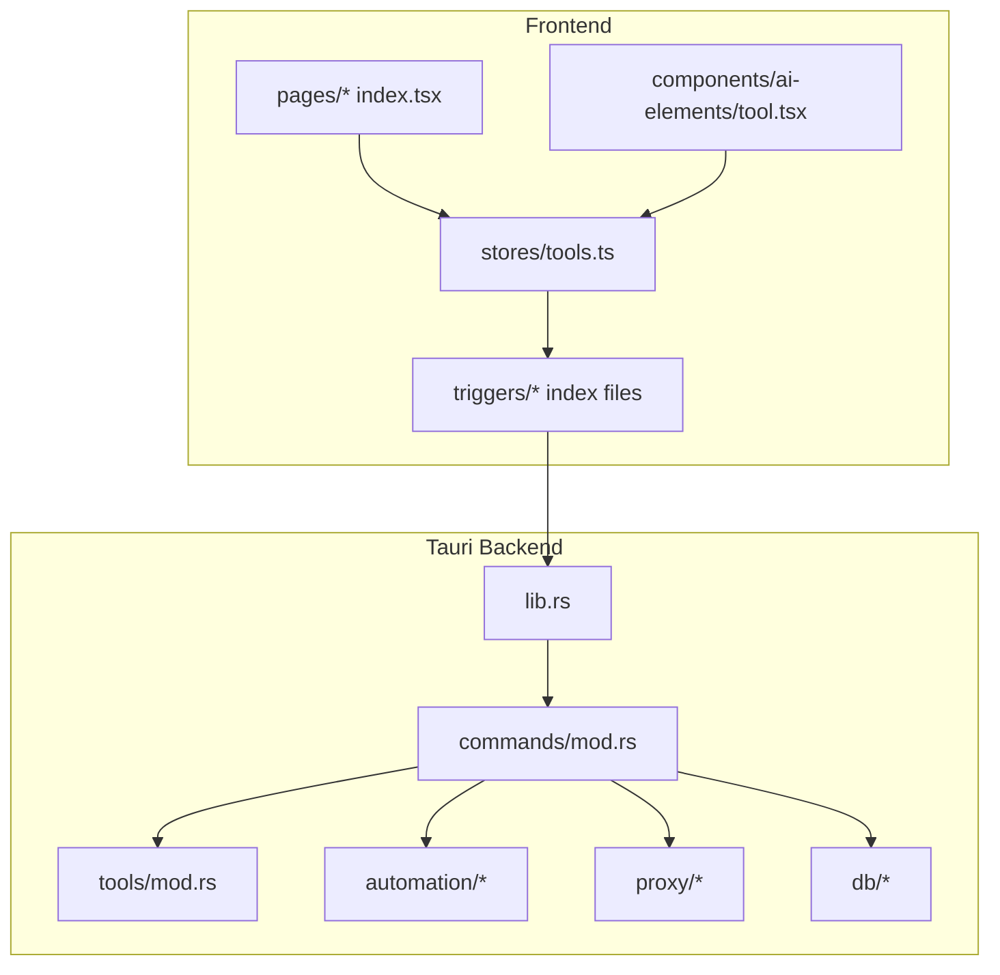
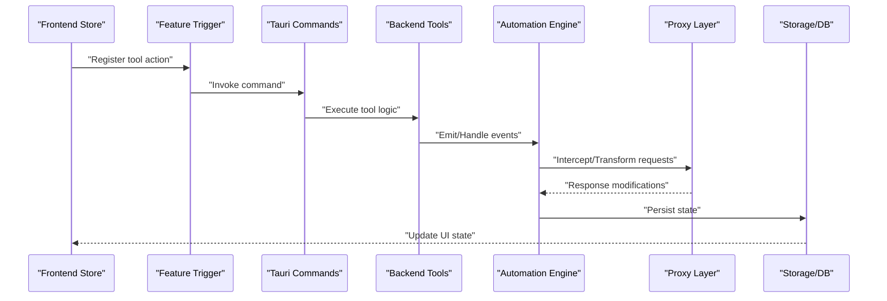
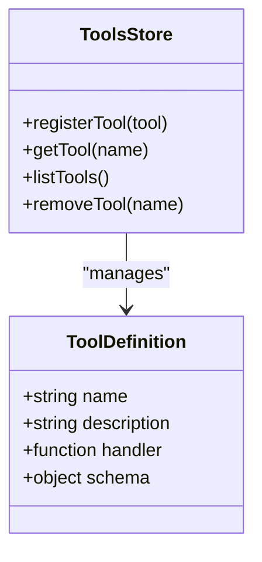
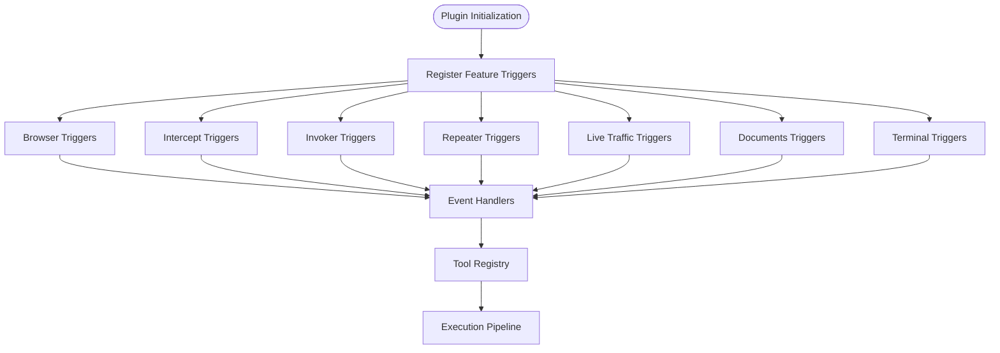
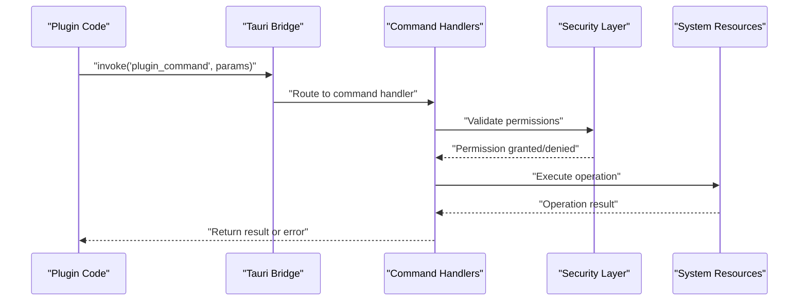
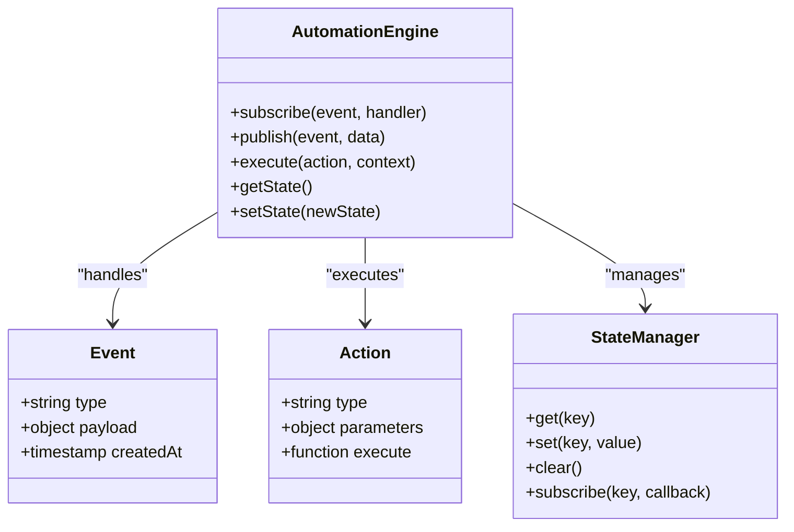
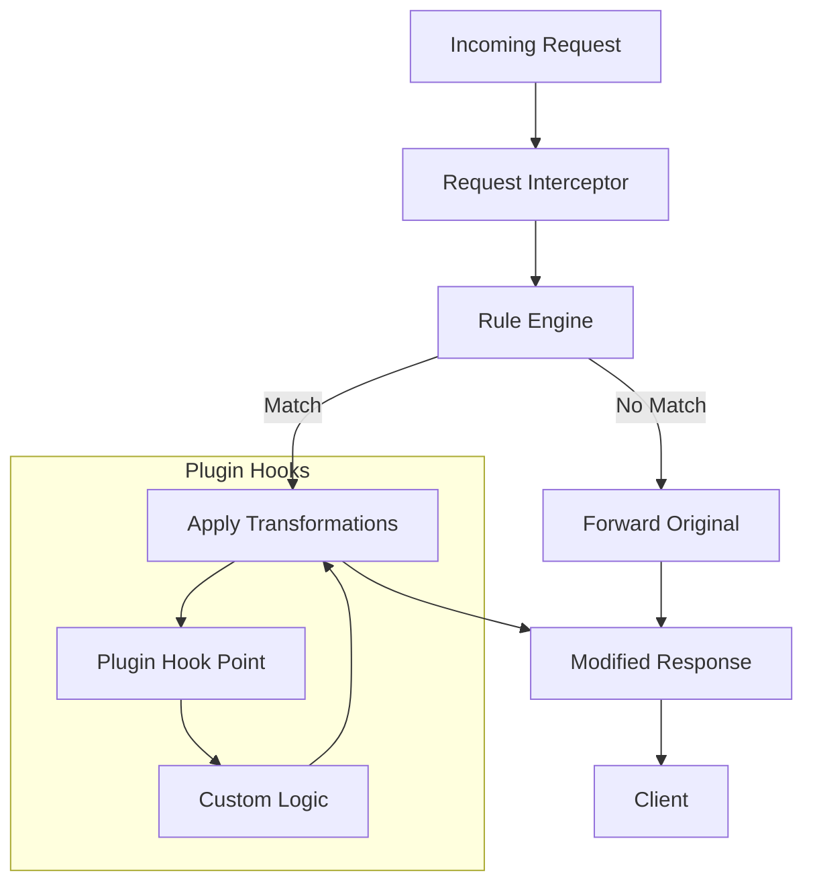
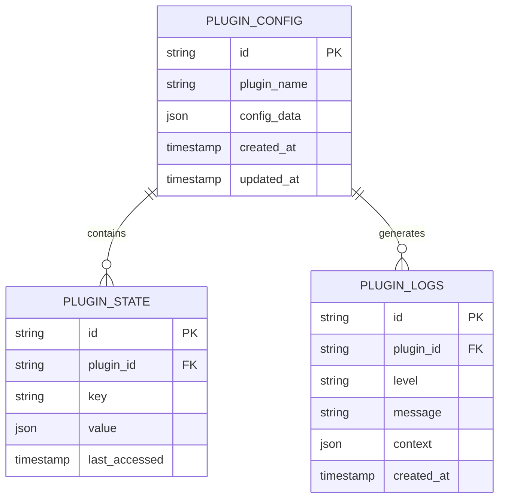
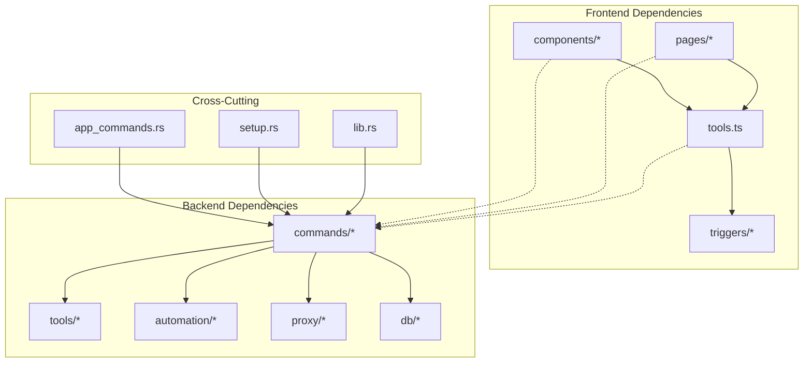

# Plugin Architecture & Extensions

<cite>
**Referenced Files in This Document**
- [src/stores/tools.ts](file://src/stores/tools.ts)
- [src/triggers/index.ts](file://src/triggers/index.ts)
- [src/triggers/browser/index.ts](file://src/triggers/browser/index.ts)
- [src/triggers/intercept/index.ts](file://src/triggers/intercept/index.ts)
- [src/triggers/invoker/index.ts](file://src/triggers/invoker/index.ts)
- [src/triggers/repeater/index.ts](file://src/triggers/repeater/index.ts)
- [src/triggers/live-traffic/index.ts](file://src/triggers/live-traffic/index.ts)
- [src/triggers/documents/index.ts](file://src/triggers/documents/index.ts)
- [src/triggers/terminal/index.ts](file://src/triggers/terminal/index.ts)
- [src-tauri/src/lib.rs](file://src-tauri/src/lib.rs)
- [src-tauri/src/commands/mod.rs](file://src-tauri/src/commands/mod.rs)
- [src-tauri/src/tools/mod.rs](file://src-tauri/src/tools/mod.rs)
- [src-tauri/src/tools/proxy_tool.rs](file://src-tauri/src/tools/proxy_tool.rs)
- [src-tauri/src/automation/mod.rs](file://src-tauri/src/automation/mod.rs)
- [src-tauri/src/automation/types.rs](file://src-tauri/src/automation/types.rs)
- [src-tauri/src/automation/events.rs](file://src-tauri/src/automation/events.rs)
- [src-tauri/src/automation/actions.rs](file://src-tauri/src/automation/actions.rs)
- [src-tauri/src/automation/execution.rs](file://src-tauri/src/automation/execution.rs)
- [src-tauri/src/automation/state.rs](file://src-tauri/src/automation/state.rs)
- [src-tauri/src/automation/websocket.rs](file://src-tauri/src/automation/websocket.rs)
- [src-tauri/src/proxy/lifecycle.rs](file://src-tauri/src/proxy/lifecycle.rs)
- [src-tauri/src/proxy/types.rs](file://src-tauri/src/proxy/types.rs)
- [src-tauri/src/proxy/mock_forge.rs](file://src-tauri/src/proxy/mock_forge.rs)
- [src-tauri/src/commands/ai.rs](file://src-tauri/src/commands/ai.rs)
- [src-tauri/src/commands/invoker.rs](file://src-tauri/src/commands/invoker.rs)
- [src-tauri/src/commands/repeater.rs](file://src-tauri/src/commands/repeater.rs)
- [src-tauri/src/commands/intercept.rs](file://src-tauri/src/commands/intercept.rs)
- [src-tauri/src/commands/browser.rs](file://src-tauri/src/commands/browser.rs)
- [src-tauri/src/commands/history.rs](file://src-tauri/src/commands/history.rs)
- [src-tauri/src/commands/storage.rs](file://src-tauri/src/commands/storage.rs)
- [src-tauri/src/db/mod.rs](file://src-tauri/src/db/mod.rs)
- [src-tauri/src/db/schema.rs](file://src-tauri/src/db/schema.rs)
- [src-tauri/src/app_commands.rs](file://src-tauri/src/app_commands.rs)
- [src-tauri/src/setup.rs](file://src-tauri/src/setup.rs)
- [src-tauri/src/tray.rs](file://src-tauri/src/tray.rs)
- [src/components/ai-elements/tool.tsx](file://src/components/ai-elements/tool.tsx)
- [src/components/ui/command.tsx](file://src/components/ui/command.tsx)
- [src/layout/constants.ts](file://src/layout/constants.ts)
- [src/pages/invoker/index.tsx](file://src/pages/invoker/index.tsx)
- [src/pages/repeater/index.tsx](file://src/pages/repeater/index.tsx)
- [src/pages/intercept/index.tsx](file://src/pages/intercept/index.tsx)
- [src/pages/browser/index.tsx](file://src/pages/browser/index.tsx)
- [src/stores/invoker.ts](file://src/stores/invoker.ts)
- [src/stores/repeater.ts](file://src/stores/repeater.ts)
- [src/stores/intercept.ts](file://src/stores/intercept.ts)
- [src/stores/tools.ts](file://src/stores/tools.ts)
- [src/stores/log.ts](file://src/stores/log.ts)
- [src-tauri/Cargo.toml](file://src-tauri/Cargo.toml)
- [src-tauri/tauri.conf.json](file://src-tauri/tauri.conf.json)
</cite>

## Table of Contents
1. [Introduction](#introduction)
2. [Project Structure](#project-structure)
3. [Core Components](#core-components)
4. [Architecture Overview](#architecture-overview)
5. [Detailed Component Analysis](#detailed-component-analysis)
6. [Dependency Analysis](#dependency-analysis)
7. [Performance Considerations](#performance-considerations)
8. [Troubleshooting Guide](#troubleshooting-guide)
9. [Conclusion](#conclusion)
10. [Appendices](#appendices)

## Introduction
This document explains Apprecon’s plugin architecture and extension points with a focus on how tools are registered, invoked, and integrated across the application. It covers:
- The plugin interface specifications for tools and triggers
- Tool registration mechanisms in both frontend and backend
- Extension lifecycle management from initialization to execution
- How to create custom tools, integrate third-party services, and extend existing functionality
- Plugin manifest formats, dependency management, security boundaries, and sandboxing
- Step-by-step guides for developing plugins, testing frameworks, deployment strategies, and version compatibility matrices
- Complete examples of simple and complex plugins demonstrating various extension patterns

The system is built around a Tauri-based Rust backend (for native capabilities and secure commands) and a React/TypeScript frontend (for UI and orchestration). Plugins can be implemented as:
- Frontend tool extensions that register actions, UI elements, and workflows
- Backend command extensions that expose secure operations via Tauri commands
- Automation events and actions that hook into browser, intercept, invoker, repeater, live traffic, documents, and terminal subsystems

## Project Structure
Apprecon organizes plugin-related code across several layers:
- Frontend stores and triggers define tool registrations and event-driven hooks
- Tauri backend exposes commands and tools for secure operations
- Automation framework provides event/action abstractions and execution pipelines
- Proxy layer supports interception and mock injection for extensibility
- Database and storage provide persistence for plugin state and configuration

**Diagram sources**
- [src/stores/tools.ts](file://src/stores/tools.ts)
- [src/triggers/index.ts](file://src/triggers/index.ts)
- [src-tauri/src/lib.rs](file://src-tauri/src/lib.rs)
- [src-tauri/src/commands/mod.rs](file://src-tauri/src/commands/mod.rs)
- [src-tauri/src/tools/mod.rs](file://src-tauri/src/tools/mod.rs)
- [src-tauri/src/automation/mod.rs](file://src-tauri/src/automation/mod.rs)
- [src-tauri/src/proxy/lifecycle.rs](file://src-tauri/src/proxy/lifecycle.rs)
- [src-tauri/src/db/mod.rs](file://src-tauri/src/db/mod.rs)

**Section sources**
- [src/stores/tools.ts](file://src/stores/tools.ts)
- [src/triggers/index.ts](file://src/triggers/index.ts)
- [src-tauri/src/lib.rs](file://src-tauri/src/lib.rs)
- [src-tauri/src/commands/mod.rs](file://src-tauri/src/commands/mod.rs)
- [src-tauri/src/tools/mod.rs](file://src-tauri/src/tools/mod.rs)
- [src-tauri/src/automation/mod.rs](file://src-tauri/src/automation/mod.rs)
- [src-tauri/src/proxy/lifecycle.rs](file://src-tauri/src/proxy/lifecycle.rs)
- [src-tauri/src/db/mod.rs](file://src/tauri/src/db/mod.rs)

## Core Components
Key components enabling plugin architecture:
- Tools store: central registry for available tools and their metadata
- Triggers: event-driven hooks per feature area (browser, intercept, invoker, repeater, live traffic, documents, terminal)
- Tauri commands: secure entry points exposed to the frontend
- Automation framework: event/action model with execution pipeline
- Proxy layer: interception and mock injection for extending HTTP/WebSocket flows
- Storage and DB: persistent plugin state and configuration

These components collectively allow plugins to:
- Register new tools and UI actions
- Hook into feature-specific events
- Execute secure backend operations
- Persist plugin data and settings
- Integrate with proxy and automation systems

**Section sources**
- [src/stores/tools.ts](file://src/stores/tools.ts)
- [src/triggers/index.ts](file://src/triggers/index.ts)
- [src-tauri/src/commands/mod.rs](file://src-tauri/src/commands/mod.rs)
- [src-tauri/src/automation/mod.rs](file://src-tauri/src/automation/mod.rs)
- [src-tauri/src/proxy/lifecycle.rs](file://src-tauri/src/proxy/lifecycle.rs)
- [src-tauri/src/db/mod.rs](file://src-tauri/src/db/mod.rs)

## Architecture Overview
The plugin architecture follows a layered approach:
- Frontend orchestrates tool discovery and UI integration
- Backend commands enforce security and access control
- Automation events/actions provide extensible workflows
- Proxy layer enables interception and transformation of network traffic
- Storage/DB persist plugin state and configurations

**Diagram sources**
- [src/stores/tools.ts](file://src/stores/tools.ts)
- [src/triggers/index.ts](file://src/triggers/index.ts)
- [src-tauri/src/commands/mod.rs](file://src-tauri/src/commands/mod.rs)
- [src-tauri/src/tools/mod.rs](file://src-tauri/src/tools/mod.rs)
- [src-tauri/src/automation/mod.rs](file://src-tauri/src/automation/mod.rs)
- [src-tauri/src/proxy/lifecycle.rs](file://src-tauri/src/proxy/lifecycle.rs)
- [src-tauri/src/db/mod.rs](file://src-tauri/src/db/mod.rs)

## Detailed Component Analysis

### Tools Registry and Registration
The tools store maintains a centralized registry of available tools, their metadata, and invocation handlers. Plugins can register new tools by adding entries to this registry, which then become discoverable by the UI and automation systems.

**Diagram sources**
- [src/stores/tools.ts](file://src/stores/tools.ts)

**Section sources**
- [src/stores/tools.ts](file://src/stores/tools.ts)

### Feature-Specific Triggers
Each major feature area has its own trigger module that defines extension points:
- Browser triggers: page navigation, DOM events, crawling
- Intercept triggers: request/response modification, forwarding
- Invoker triggers: command execution, attack payloads
- Repeater triggers: collection management, send-to operations
- Live traffic triggers: captured requests, target management
- Documents triggers: AI tool integration, section processing
- Terminal triggers: AI tool integration, command execution

**Diagram sources**
- [src/triggers/browser/index.ts](file://src/triggers/browser/index.ts)
- [src/triggers/intercept/index.ts](file://src/triggers/intercept/index.ts)
- [src/triggers/invoker/index.ts](file://src/triggers/invoker/index.ts)
- [src/triggers/repeater/index.ts](file://src/triggers/repeater/index.ts)
- [src/triggers/live-traffic/index.ts](file://src/triggers/live-traffic/index.ts)
- [src/triggers/documents/index.ts](file://src/triggers/documents/index.ts)
- [src/triggers/terminal/index.ts](file://src/triggers/terminal/index.ts)

**Section sources**
- [src/triggers/browser/index.ts](file://src/triggers/browser/index.ts)
- [src/triggers/intercept/index.ts](file://src/triggers/intercept/index.ts)
- [src/triggers/invoker/index.ts](file://src/triggers/invoker/index.ts)
- [src/triggers/repeater/index.ts](file://src/triggers/repeater/index.ts)
- [src/triggers/live-traffic/index.ts](file://src/triggers/live-traffic/index.ts)
- [src/triggers/documents/index.ts](file://src/triggers/documents/index.ts)
- [src/triggers/terminal/index.ts](file://src/triggers/terminal/index.ts)

### Tauri Command System
The Tauri backend exposes secure commands that plugins can invoke. These commands handle sensitive operations like file system access, network requests, and database operations.

**Diagram sources**
- [src-tauri/src/commands/mod.rs](file://src-tauri/src/commands/mod.rs)
- [src-tauri/src/commands/ai.rs](file://src-tauri/src/commands/ai.rs)
- [src-tauri/src/commands/invoker.rs](file://src-tauri/src/commands/invoker.rs)
- [src-tauri/src/commands/repeater.rs](file://src-tauri/src/commands/repeater.rs)
- [src-tauri/src/commands/intercept.rs](file://src-tauri/src/commands/intercept.rs)
- [src-tauri/src/commands/browser.rs](file://src-tauri/src/commands/browser.rs)

**Section sources**
- [src-tauri/src/commands/mod.rs](file://src-tauri/src/commands/mod.rs)
- [src-tauri/src/commands/ai.rs](file://src-tauri/src/commands/ai.rs)
- [src-tauri/src/commands/invoker.rs](file://src-tauri/src/commands/invoker.rs)
- [src-tauri/src/commands/repeater.rs](file://src-tauri/src/commands/repeater.rs)
- [src-tauri/src/commands/intercept.rs](file://src-tauri/src/commands/intercept.rs)
- [src-tauri/src/commands/browser.rs](file://src-tauri/src/commands/browser.rs)

### Automation Framework
The automation framework provides a structured way to handle events and execute actions across different subsystems.

**Diagram sources**
- [src-tauri/src/automation/mod.rs](file://src-tauri/src/automation/mod.rs)
- [src-tauri/src/automation/types.rs](file://src-tauri/src/automation/types.rs)
- [src-tauri/src/automation/events.rs](file://src-tauri/src/automation/events.rs)
- [src-tauri/src/automation/actions.rs](file://src-tauri/src/automation/actions.rs)
- [src-tauri/src/automation/state.rs](file://src-tauri/src/automation/state.rs)

**Section sources**
- [src-tauri/src/automation/mod.rs](file://src-tauri/src/automation/mod.rs)
- [src-tauri/src/automation/types.rs](file://src-tauri/src/automation/types.rs)
- [src-tauri/src/automation/events.rs](file://src-tauri/src/automation/events.rs)
- [src-tauri/src/automation/actions.rs](file://src-tauri/src/automation/actions.rs)
- [src-tauri/src/automation/state.rs](file://src-tauri/src/automation/state.rs)

### Proxy Interception Layer
The proxy layer enables plugins to intercept and modify HTTP/WebSocket traffic, providing powerful extension capabilities for security testing and analysis.

**Diagram sources**
- [src-tauri/src/proxy/lifecycle.rs](file://src-tauri/src/proxy/lifecycle.rs)
- [src-tauri/src/proxy/types.rs](file://src-tauri/src/proxy/types.rs)
- [src-tauri/src/proxy/mock_forge.rs](file://src-tauri/src/proxy/mock_forge.rs)

**Section sources**
- [src-tauri/src/proxy/lifecycle.rs](file://src-tauri/src/proxy/lifecycle.rs)
- [src-tauri/src/proxy/types.rs](file://src-tauri/src/proxy/types.rs)
- [src-tauri/src/proxy/mock_forge.rs](file://src-tauri/src/proxy/mock_forge.rs)

### Storage and Persistence
Plugins can persist their state and configuration using the built-in storage and database systems.

**Diagram sources**
- [src-tauri/src/db/mod.rs](file://src-tauri/src/db/mod.rs)
- [src-tauri/src/db/schema.rs](file://src-tauri/src/db/schema.rs)
- [src-tauri/src/commands/storage.rs](file://src-tauri/src/commands/storage.rs)

**Section sources**
- [src-tauri/src/db/mod.rs](file://src-tauri/src/db/mod.rs)
- [src-tauri/src/db/schema.rs](file://src-tauri/src/db/schema.rs)
- [src-tauri/src/commands/storage.rs](file://src-tauri/src/commands/storage.rs)

## Dependency Analysis
The plugin system has clear separation of concerns with minimal coupling between components:

**Diagram sources**
- [src/stores/tools.ts](file://src/stores/tools.ts)
- [src-tauri/src/lib.rs](file://src-tauri/src/lib.rs)
- [src-tauri/src/setup.rs](file://src-tauri/src/setup.rs)
- [src-tauri/src/app_commands.rs](file://src-tauri/src/app_commands.rs)

**Section sources**
- [src/stores/tools.ts](file://src/stores/tools.ts)
- [src-tauri/src/lib.rs](file://src-tauri/src/lib.rs)
- [src-tauri/src/setup.rs](file://src-tauri/src/setup.rs)
- [src-tauri/src/app_commands.rs](file://src-tauri/src/app_commands.rs)

## Performance Considerations
- **Lazy Loading**: Tools and triggers should be loaded lazily to minimize startup time
- **Event Debouncing**: High-frequency events should be debounced to prevent performance issues
- **Memory Management**: Large payloads should be streamed rather than loaded entirely into memory
- **Caching**: Frequently accessed data should be cached with appropriate invalidation strategies
- **Async Operations**: Long-running operations should run asynchronously with proper progress reporting
- **Resource Cleanup**: Plugins should properly clean up resources when unloaded

## Troubleshooting Guide
Common plugin development issues and solutions:

### Permission Errors
- Ensure proper Tauri permissions are configured in capabilities
- Check command authorization levels and scope restrictions
- Verify file system and network access permissions

### Event Handling Issues
- Validate event names and payload structures
- Check for circular dependencies in event chains
- Monitor event propagation and error handling

### Memory Leaks
- Implement proper cleanup in plugin teardown
- Use weak references for long-lived objects
- Monitor memory usage during development

### Performance Problems
- Profile slow operations and optimize critical paths
- Implement proper error boundaries and fallbacks
- Use appropriate data structures for large datasets

**Section sources**
- [src-tauri/src/commands/mod.rs](file://src-tauri/src/commands/mod.rs)
- [src-tauri/src/automation/execution.rs](file://src-tauri/src/automation/execution.rs)
- [src/stores/log.ts](file://src/stores/log.ts)

## Conclusion
Apprecon's plugin architecture provides a robust foundation for extending functionality through well-defined interfaces and secure communication channels. The combination of frontend triggers, backend commands, automation framework, and proxy interception enables powerful extensibility while maintaining security and performance. Developers can create sophisticated plugins that integrate seamlessly with existing features while following established patterns for reliability and maintainability.

## Appendices

### Plugin Development Checklist
- Define plugin manifest with metadata and dependencies
- Implement core functionality with proper error handling
- Register tools and triggers in appropriate modules
- Configure permissions and security boundaries
- Add comprehensive logging and monitoring
- Implement proper cleanup and resource management
- Test across different environments and scenarios
- Document API surface and usage patterns

### Testing Framework Guidelines
- Unit test individual plugin components
- Integration test plugin interactions with core systems
- End-to-end test complete plugin workflows
- Performance test under realistic load conditions
- Security test permission boundaries and input validation

### Deployment Strategies
- Package plugins as separate modules for independent updates
- Implement version compatibility checking
- Provide rollback mechanisms for failed updates
- Use staging environments for plugin testing
- Monitor plugin health and performance in production

### Version Compatibility Matrix
- Maintain semantic versioning for plugin APIs
- Document breaking changes in migration guides
- Support multiple plugin versions during transition periods
- Provide automated compatibility checking tools
- Establish deprecation policies for old APIs