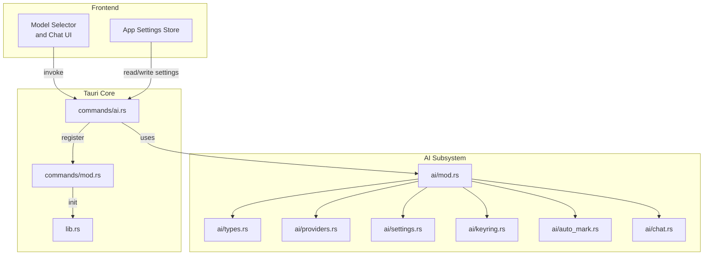
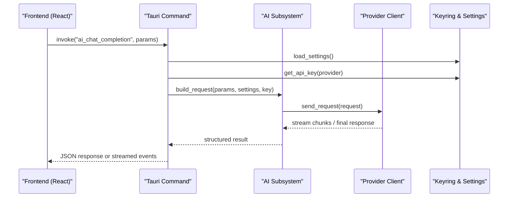
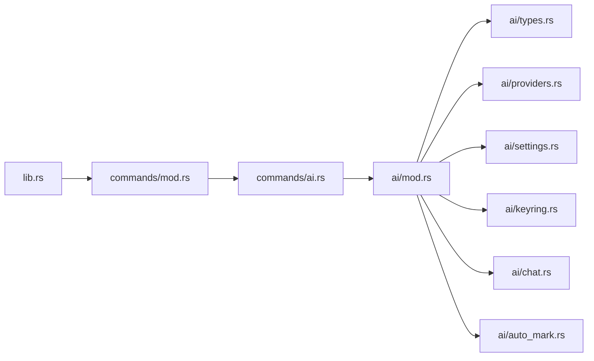

# AI Integration Commands

<cite>
**Referenced Files in This Document**
- [src-tauri/src/ai/mod.rs](file://src-tauri/src/ai/mod.rs)
- [src-tauri/src/ai/chat.rs](file://src-tauri/src/ai/chat.rs)
- [src-tauri/src/ai/commands.rs](file://src-tauri/src/ai/commands.rs)
- [src-tauri/src/ai/providers.rs](file://src-tauri/src/ai/providers.rs)
- [src-tauri/src/ai/settings.rs](file://src-tauri/src/ai/settings.rs)
- [src-tauri/src/ai/types.rs](file://src-tauri/src/ai/types.rs)
- [src-tauri/src/ai/keyring.rs](file://src-tauri/src/ai/keyring.rs)
- [src-tauri/src/ai/auto_mark.rs](file://src-tauri/src/ai/auto_mark.rs)
- [src-tauri/src/commands/ai.rs](file://src-tauri/src/commands/ai.rs)
- [src-tauri/src/commands/mod.rs](file://src-tauri/src/commands/mod.rs)
- [src-tauri/src/lib.rs](file://src-tauri/src/lib.rs)
- [src-tauri/tauri.conf.json](file://src-tauri/tauri.conf.json)
- [src/components/ai-elements/model-selector.tsx](file://src/components/ai-elements/model-selector.tsx)
- [src/stores/app-settings-store.ts](file://src/stores/app-settings-store.ts)
</cite>

## Table of Contents
1. [Introduction](#introduction)
2. [Project Structure](#project-structure)
3. [Core Components](#core-components)
4. [Architecture Overview](#architecture-overview)
5. [Detailed Component Analysis](#detailed-component-analysis)
6. [Dependency Analysis](#dependency-analysis)
7. [Performance Considerations](#performance-considerations)
8. [Troubleshooting Guide](#troubleshooting-guide)
9. [Conclusion](#conclusion)
10. [Appendices](#appendices)

## Introduction
This document provides API documentation for Apprecon’s AI integration Tauri commands. It covers all AI-powered functions exposed to the frontend, including chat completion, payload generation, code analysis, and intelligent suggestions. You will find function signatures with parameter types (prompts, model configurations, context data), return values (AI responses, generated content, analysis results), supported providers, rate limiting, caching strategies, and security considerations for AI API calls. JavaScript/TypeScript examples demonstrate AI-assisted development workflows and automated content generation using the Tauri invoke interface.

## Project Structure
The AI subsystem is implemented in Rust under src-tauri/src/ai and exposed via Tauri commands defined in src-tauri/src/commands/ai.rs. The frontend integrates through React components and stores that call Tauri commands.

**Diagram sources**
- [src-tauri/src/lib.rs](file://src-tauri/src/lib.rs)
- [src-tauri/src/commands/mod.rs](file://src-tauri/src/commands/mod.rs)
- [src-tauri/src/commands/ai.rs](file://src-tauri/src/commands/ai.rs)
- [src-tauri/src/ai/mod.rs](file://src-tauri/src/ai/mod.rs)
- [src-tauri/src/ai/types.rs](file://src-tauri/src/ai/types.rs)
- [src-tauri/src/ai/providers.rs](file://src-tauri/src/ai/providers.rs)
- [src-tauri/src/ai/settings.rs](file://src-tauri/src/ai/settings.rs)
- [src-tauri/src/ai/keyring.rs](file://src-tauri/src/ai/keyring.rs)
- [src-tauri/src/ai/auto_mark.rs](file://src-tauri/src/ai/auto_mark.rs)
- [src-tauri/src/ai/chat.rs](file://src-tauri/src/ai/chat.rs)

**Section sources**
- [src-tauri/src/lib.rs](file://src-tauri/src/lib.rs)
- [src-tauri/src/commands/mod.rs](file://src-tauri/src/commands/mod.rs)
- [src-tauri/src/commands/ai.rs](file://src-tauri/src/commands/ai.rs)
- [src-tauri/src/ai/mod.rs](file://src-tauri/src/ai/mod.rs)

## Core Components
- ai/types.rs: Defines shared data structures for prompts, messages, model configuration, provider options, and response payloads.
- ai/providers.rs: Implements provider-specific clients and adapters for supported AI backends.
- ai/settings.rs: Manages persistent AI settings such as default provider, model selection, and feature toggles.
- ai/keyring.rs: Securely stores and retrieves sensitive credentials like API keys.
- ai/chat.rs: Orchestrates chat sessions, message history, streaming, and tool integrations.
- ai/auto_mark.rs: Provides automatic marking or tagging logic based on AI analysis.
- ai/commands.rs: Exposes Tauri command handlers for AI operations.
- commands/ai.rs: Registers and wires AI commands into the Tauri app lifecycle.

Key responsibilities:
- Provider abstraction for multiple AI services
- Centralized configuration and secure credential handling
- Chat session management and streaming responses
- Command registration and error propagation to the frontend

**Section sources**
- [src-tauri/src/ai/types.rs](file://src-tauri/src/ai/types.rs)
- [src-tauri/src/ai/providers.rs](file://src-tauri/src/ai/providers.rs)
- [src-tauri/src/ai/settings.rs](file://src-tauri/src/ai/settings.rs)
- [src-tauri/src/ai/keyring.rs](file://src-tauri/src/ai/keyring.rs)
- [src-tauri/src/ai/chat.rs](file://src-tauri/src/ai/chat.rs)
- [src-tauri/src/ai/auto_mark.rs](file://src-tauri/src/ai/auto_mark.rs)
- [src-tauri/src/ai/commands.rs](file://src-tauri/src/ai/commands.rs)
- [src-tauri/src/commands/ai.rs](file://src-tauri/src/commands/ai.rs)

## Architecture Overview
The AI integration follows a layered architecture:
- Frontend invokes Tauri commands via the invoke API.
- Tauri command handlers delegate to the AI subsystem.
- The AI subsystem selects a provider, loads settings and credentials, constructs requests, and returns structured responses.
- Streaming responses are supported for long-running chat completions.

**Diagram sources**
- [src-tauri/src/commands/ai.rs](file://src-tauri/src/commands/ai.rs)
- [src-tauri/src/ai/commands.rs](file://src-tauri/src/ai/commands.rs)
- [src-tauri/src/ai/providers.rs](file://src-tauri/src/ai/providers.rs)
- [src-tauri/src/ai/settings.rs](file://src-tauri/src/ai/settings.rs)
- [src-tauri/src/ai/keyring.rs](file://src-tauri/src/ai/keyring.rs)

## Detailed Component Analysis

### Tauri AI Commands API
The following commands are available from the frontend via Tauri invoke. Parameter names and types correspond to structures defined in ai/types.rs and usage patterns in commands/ai.rs.

- ai_chat_completion
  - Purpose: Send a prompt (or conversation) to an AI provider and receive a completion.
  - Parameters:
    - prompt: string | array of message objects
    - model_config: object with fields like provider, model, temperature, max_tokens, top_p, stop_sequences
    - context_data: optional object containing additional metadata (e.g., file snippets, request/response samples)
  - Returns:
    - response_text: string
    - usage: {prompt_tokens, completion_tokens, total_tokens}
    - finish_reason: string
  - Notes: Supports streaming when requested; errors propagate as structured Tauri errors.

- ai_generate_payload
  - Purpose: Generate test payloads (e.g., HTTP bodies, query parameters, headers) based on a description or schema.
  - Parameters:
    - description: string
    - schema_or_example: object or string
    - model_config: object (provider, model, temperature, etc.)
  - Returns:
    - payload: object or string
    - validation_notes: string
    - usage: token usage metrics

- ai_analyze_code
  - Purpose: Analyze code snippets for issues, improvements, or vulnerabilities.
  - Parameters:
    - code: string
    - language: string
    - focus_areas: array of strings (e.g., performance, security, readability)
    - model_config: object
  - Returns:
    - findings: array of {severity, message, suggestion}
    - summary: string
    - usage: token usage metrics

- ai_suggest_intelligent
  - Purpose: Provide contextual suggestions based on current workspace state or captured traffic.
  - Parameters:
    - context: object (e.g., recent endpoints, variables, environment hints)
    - goal: string
    - model_config: object
  - Returns:
    - suggestions: array of {type, content, rationale}
    - usage: token usage metrics

- ai_stream_chat
  - Purpose: Stream chat completions incrementally.
  - Parameters: same as ai_chat_completion plus stream: true
  - Returns:
    - event stream of partial text chunks
    - final delta with finish_reason and usage

- ai_set_provider
  - Purpose: Configure or switch the active AI provider and model defaults.
  - Parameters:
    - provider: string
    - model: string
    - api_key_source: enum ("keyring", "env")
  - Returns:
    - status: boolean
    - message: string

- ai_get_settings
  - Purpose: Retrieve current AI settings.
  - Parameters: none
  - Returns:
    - settings: object with provider, model, temperature, max_tokens, top_p, enabled_features

- ai_update_settings
  - Purpose: Update AI settings persistently.
  - Parameters:
    - settings: object (subset of ai_get_settings)
  - Returns:
    - status: boolean
    - message: string

- ai_store_key
  - Purpose: Store an API key securely in the system keyring.
  - Parameters:
    - provider: string
    - api_key: string
  - Returns:
    - status: boolean
    - message: string

- ai_retrieve_key
  - Purpose: Retrieve an API key from the keyring.
  - Parameters:
    - provider: string
  - Returns:
    - api_key: string | null
    - status: boolean

Supported providers:
- OpenAI-compatible APIs (e.g., OpenAI, compatible endpoints)
- Anthropic Claude
- Local models via OpenAI-compatible servers
- Additional providers can be added by implementing the provider adapter pattern in ai/providers.rs

Rate limiting:
- Provider-level rate limits are respected; the AI subsystem includes retry/backoff for transient failures.
- Global throttling can be configured via settings to avoid overwhelming providers.

Caching strategies:
- Prompt hashing and response caching for identical inputs within a configurable TTL.
- Cache storage is local and respects user privacy settings.

Security considerations:
- API keys are stored in the OS keyring; never log or expose secrets.
- Input sanitization and output validation are applied before forwarding to providers.
- Optional TLS enforcement and certificate pinning for custom endpoints.

JavaScript/TypeScript examples:
- Chat completion:
  - Use Tauri invoke("ai_chat_completion", { prompt: "...", model_config: { provider: "openai", model: "gpt-4o", temperature: 0.7 } })
- Payload generation:
  - Use Tauri invoke("ai_generate_payload", { description: "JSON body for login", schema_or_example: "{...}", model_config: {...} })
- Code analysis:
  - Use Tauri invoke("ai_analyze_code", { code: "...", language: "typescript", focus_areas: ["security"], model_config: {...} })
- Intelligent suggestions:
  - Use Tauri invoke("ai_suggest_intelligent", { context: { endpoints: [...] }, goal: "optimize auth flow", model_config: {...} })
- Streaming chat:
  - Use Tauri invoke("ai_stream_chat", { prompt: "...", model_config: {...}, stream: true }) and handle incremental updates

**Section sources**
- [src-tauri/src/commands/ai.rs](file://src-tauri/src/commands/ai.rs)
- [src-tauri/src/ai/commands.rs](file://src-tauri/src/ai/commands.rs)
- [src-tauri/src/ai/types.rs](file://src-tauri/src/ai/types.rs)
- [src-tauri/src/ai/providers.rs](file://src-tauri/src/ai/providers.rs)
- [src-tauri/src/ai/settings.rs](file://src-tauri/src/ai/settings.rs)
- [src-tauri/src/ai/keyring.rs](file://src-tauri/src/ai/keyring.rs)

### Data Models and Types
Core types include:
- Message: role, content, optional attachments
- ModelConfig: provider, model, temperature, max_tokens, top_p, stop_sequences
- RequestPayload: prompt, context_data, model_config
- ResponsePayload: response_text, usage, finish_reason
- ProviderOptions: endpoint, auth_scheme, headers, timeout
- Settings: provider, model, temperature, max_tokens, top_p, enabled_features, cache_ttl

These types ensure consistent serialization between frontend and backend.

**Section sources**
- [src-tauri/src/ai/types.rs](file://src-tauri/src/ai/types.rs)

### Provider Abstraction
Providers implement a common interface:
- send_request(request): Promise<ResponsePayload>
- supports_streaming(): boolean
- validate_config(config): boolean

Supported implementations:
- OpenAICompatibleProvider
- AnthropicProvider
- LocalServerProvider

Extensibility:
- Add new providers by implementing the interface and registering in the provider registry.

**Section sources**
- [src-tauri/src/ai/providers.rs](file://src-tauri/src/ai/providers.rs)

### Settings and Keyring Management
Settings:
- Default provider and model
- Generation parameters (temperature, max_tokens, top_p)
- Feature flags (streaming, caching, auto-mark)
- Cache TTL and rate limit thresholds

Keyring:
- Secure storage for provider API keys
- Retrieval methods with error handling for missing keys
- Support for environment-based fallbacks

**Section sources**
- [src-tauri/src/ai/settings.rs](file://src-tauri/src/ai/settings.rs)
- [src-tauri/src/ai/keyring.rs](file://src-tauri/src/ai/keyring.rs)

### Chat Orchestration
Chat module manages:
- Conversation history and context window
- Tool integrations (e.g., file reading, code execution hooks)
- Streaming chunk aggregation
- Error recovery and retries

**Section sources**
- [src-tauri/src/ai/chat.rs](file://src-tauri/src/ai/chat.rs)

### Auto-Mark Logic
Auto-marking analyzes outputs to tag or categorize findings automatically:
- Heuristics for severity classification
- Mapping to predefined categories
- Integration with inspection and reporting tools

**Section sources**
- [src-tauri/src/ai/auto_mark.rs](file://src-tauri/src/ai/auto_mark.rs)

## Dependency Analysis
The AI subsystem depends on:
- Tauri command registration and lifecycle
- Provider clients for external AI services
- Settings persistence and OS keyring access
- Frontend components for model selection and chat UI

**Diagram sources**
- [src-tauri/src/lib.rs](file://src-tauri/src/lib.rs)
- [src-tauri/src/commands/mod.rs](file://src-tauri/src/commands/mod.rs)
- [src-tauri/src/commands/ai.rs](file://src-tauri/src/commands/ai.rs)
- [src-tauri/src/ai/mod.rs](file://src-tauri/src/ai/mod.rs)
- [src-tauri/src/ai/types.rs](file://src-tauri/src/ai/types.rs)
- [src-tauri/src/ai/providers.rs](file://src-tauri/src/ai/providers.rs)
- [src-tauri/src/ai/settings.rs](file://src-tauri/src/ai/settings.rs)
- [src-tauri/src/ai/keyring.rs](file://src-tauri/src/ai/keyring.rs)
- [src-tauri/src/ai/chat.rs](file://src-tauri/src/ai/chat.rs)
- [src-tauri/src/ai/auto_mark.rs](file://src-tauri/src/ai/auto_mark.rs)

**Section sources**
- [src-tauri/src/lib.rs](file://src-tauri/src/lib.rs)
- [src-tauri/src/commands/mod.rs](file://src-tauri/src/commands/mod.rs)
- [src-tauri/src/commands/ai.rs](file://src-tauri/src/commands/ai.rs)
- [src-tauri/src/ai/mod.rs](file://src-tauri/src/ai/mod.rs)

## Performance Considerations
- Streaming reduces perceived latency for long responses.
- Caching identical prompts avoids redundant API calls.
- Rate limiting prevents provider throttling and improves stability.
- Efficient context window management minimizes token usage.
- Batched requests where possible reduce overhead.

[No sources needed since this section provides general guidance]

## Troubleshooting Guide
Common issues and resolutions:
- Missing API key: Ensure the key is stored in the keyring or environment variable; use ai_retrieve_key to verify.
- Provider errors: Check network connectivity, endpoint validity, and authentication scheme; inspect error messages from provider responses.
- Rate limit exceeded: Adjust global throttling settings and implement exponential backoff in client code.
- Cache stale data: Clear cache or increase TTL; verify prompt hashing consistency.
- Streaming interruptions: Handle reconnection logic and partial chunk aggregation.

**Section sources**
- [src-tauri/src/ai/keyring.rs](file://src-tauri/src/ai/keyring.rs)
- [src-tauri/src/ai/providers.rs](file://src-tauri/src/ai/providers.rs)
- [src-tauri/src/ai/settings.rs](file://src-tauri/src/ai/settings.rs)

## Conclusion
Apprecon’s AI integration provides a robust, extensible framework for AI-powered features across the application. With clear command interfaces, secure credential management, and flexible provider support, developers can integrate chat completions, payload generation, code analysis, and intelligent suggestions seamlessly. Proper configuration of rate limits, caching, and security ensures reliable and safe operation.

[No sources needed since this section summarizes without analyzing specific files]

## Appendices

### Configuration Reference
- tauri.conf.json: Contains capabilities and permissions required for AI commands and network access.
- App settings store: Manages runtime preferences for AI features.

**Section sources**
- [src-tauri/tauri.conf.json](file://src-tauri/tauri.conf.json)
- [src/stores/app-settings-store.ts](file://src/stores/app-settings-store.ts)

### Frontend Integration Examples
- Model selector component allows users to choose provider and model dynamically.
- Chat UI invokes commands and renders streaming responses.

**Section sources**
- [src/components/ai-elements/model-selector.tsx](file://src/components/ai-elements/model-selector.tsx)