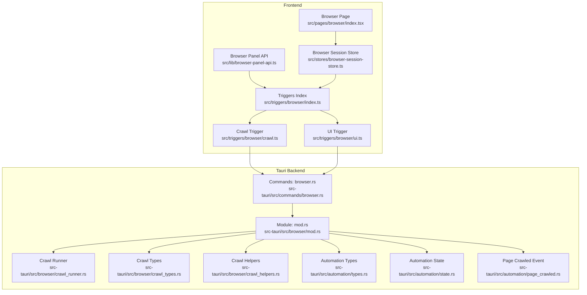
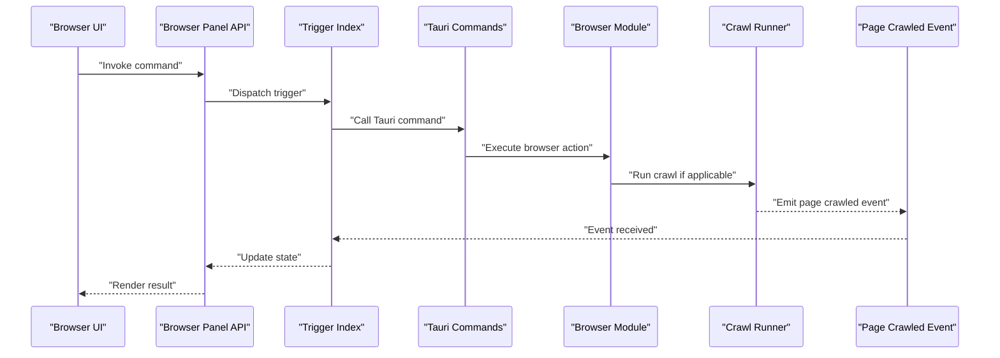
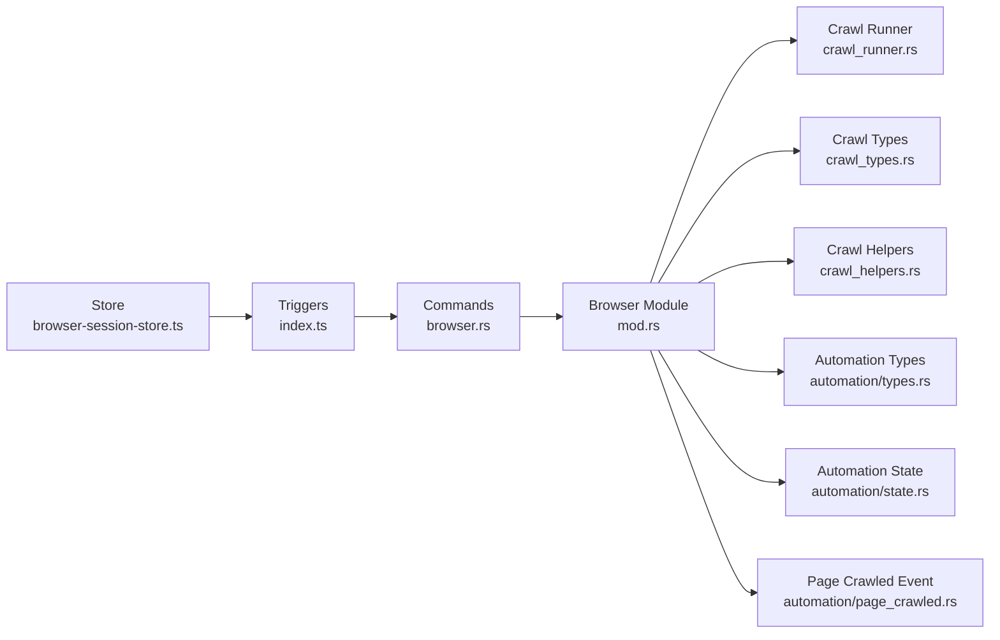

# Browser Automation Commands

<cite>
**Referenced Files in This Document**
- [browser.rs](file://src-tauri/src/commands/browser.rs)
- [mod.rs](file://src-tauri/src/browser/mod.rs)
- [crawl_runner.rs](file://src-tauri/src/browser/crawl_runner.rs)
- [crawl_types.rs](file://src-tauri/src/browser/crawl_types.rs)
- [crawl_helpers.rs](file://src-tauri/src/browser/crawl_helpers.rs)
- [automation/types.rs](file://src-tauri/src/automation/types.rs)
- [automation/state.rs](file://src-tauri/src/automation/state.rs)
- [automation/page_crawled.rs](file://src-tauri/src/automation/page_crawled.rs)
- [triggers/browser/index.ts](file://src/triggers/browser/index.ts)
- [triggers/browser/crawl.ts](file://src/triggers/browser/crawl.ts)
- [triggers/browser/ui.ts](file://src/triggers/browser/ui.ts)
- [lib/browser-panel-api.ts](file://src/lib/browser-panel-api.ts)
- [stores/browser-session-store.ts](file://src/stores/browser-session-store.ts)
- [layout/open-browser.tsx](file://src/layout/open-browser.tsx)
- [pages/browser/index.tsx](file://src/pages/browser/index.tsx)
- [tauri-types.ts](file://src/lib/tauri-types.ts)
</cite>

## Table of Contents
1. [Introduction](#introduction)
2. [Project Structure](#project-structure)
3. [Core Components](#core-components)
4. [Architecture Overview](#architecture-overview)
5. [Detailed Component Analysis](#detailed-component-analysis)
6. [Dependency Analysis](#dependency-analysis)
7. [Performance Considerations](#performance-considerations)
8. [Troubleshooting Guide](#troubleshooting-guide)
9. [Conclusion](#conclusion)
10. [Appendices](#appendices)

## Introduction
This document provides API documentation for Apprecon’s browser automation Tauri commands. It covers navigation, screenshot capture, page crawling, and DOM manipulation capabilities exposed to the frontend via Tauri commands. It also documents session management, headless mode configuration, and performance optimization tips, with JavaScript/TypeScript usage examples for programmatic control and automated testing workflows.

## Project Structure
The browser automation feature spans Rust backend commands and TypeScript triggers/stores on the frontend:
- Backend (Rust): Tauri command handlers and browser logic reside under src-tauri/src/commands and src-tauri/src/browser.
- Frontend (TypeScript): Triggers and UI integration live under src/triggers/browser and src/lib, with state managed in stores.

**Diagram sources**
- [browser.rs](file://src-tauri/src/commands/browser.rs)
- [mod.rs](file://src-tauri/src/browser/mod.rs)
- [crawl_runner.rs](file://src-tauri/src/browser/crawl_runner.rs)
- [crawl_types.rs](file://src-tauri/src/browser/crawl_types.rs)
- [crawl_helpers.rs](file://src-tauri/src/browser/crawl_helpers.rs)
- [automation/types.rs](file://src-tauri/src/automation/types.rs)
- [automation/state.rs](file://src-tauri/src/automation/state.rs)
- [automation/page_crawled.rs](file://src-tauri/src/automation/page_crawled.rs)
- [triggers/browser/index.ts](file://src/triggers/browser/index.ts)
- [triggers/browser/crawl.ts](file://src/triggers/browser/crawl.ts)
- [triggers/browser/ui.ts](file://src/triggers/browser/ui.ts)
- [lib/browser-panel-api.ts](file://src/lib/browser-panel-api.ts)
- [stores/browser-session-store.ts](file://src/stores/browser-session-store.ts)
- [pages/browser/index.tsx](file://src/pages/browser/index.tsx)

**Section sources**
- [browser.rs](file://src-tauri/src/commands/browser.rs)
- [mod.rs](file://src-tauri/src/browser/mod.rs)
- [triggers/browser/index.ts](file://src/triggers/browser/index.ts)
- [lib/browser-panel-api.ts](file://src/lib/browser-panel-api.ts)
- [stores/browser-session-store.ts](file://src/stores/browser-session-store.ts)
- [pages/browser/index.tsx](file://src/pages/browser/index.tsx)

## Core Components
- Tauri Command Layer: Exposes browser control functions to the frontend via Tauri commands.
- Browser Module: Orchestrates browser lifecycle, navigation, screenshots, and crawling.
- Crawler: Manages crawl execution, options, and results.
- Automation Types and State: Defines shared types and manages runtime state for automation tasks.
- Events: Emits events such as page crawled to keep the UI updated.
- Frontend Integration: Triggers and stores bridge UI actions to Tauri commands and manage session state.

Key responsibilities:
- Navigation: Open URLs, handle redirects, and manage page state.
- Screenshot Capture: Capture full-page or viewport screenshots.
- Crawling: Traverse pages based on rules and collect results.
- DOM Manipulation: Execute scripts or queries within the page context.
- Session Management: Create, reuse, and close browser sessions.
- Headless Mode: Configure headless vs. visible browser instances.

**Section sources**
- [browser.rs](file://src-tauri/src/commands/browser.rs)
- [mod.rs](file://src-tauri/src/browser/mod.rs)
- [crawl_runner.rs](file://src-tauri/src/browser/crawl_runner.rs)
- [crawl_types.rs](file://src-tauri/src/browser/crawl_types.rs)
- [crawl_helpers.rs](file://src-tauri/src/browser/crawl_helpers.rs)
- [automation/types.rs](file://src-tauri/src/automation/types.rs)
- [automation/state.rs](file://src-tauri/src/automation/state.rs)
- [automation/page_crawled.rs](file://src-tauri/src/automation/page_crawled.rs)

## Architecture Overview
The architecture follows a clear separation between frontend triggers and backend Tauri commands:
- Frontend triggers call Tauri commands through a typed interface.
- Commands delegate to the browser module which coordinates navigation, screenshots, and crawling.
- The crawler uses helpers and type definitions to execute traversal strategies.
- Automation state tracks ongoing tasks and emits events to update the UI.

**Diagram sources**
- [triggers/browser/index.ts](file://src/triggers/browser/index.ts)
- [lib/browser-panel-api.ts](file://src/lib/browser-panel-api.ts)
- [browser.rs](file://src-tauri/src/commands/browser.rs)
- [mod.rs](file://src-tauri/src/browser/mod.rs)
- [crawl_runner.rs](file://src-tauri/src/browser/crawl_runner.rs)
- [automation/page_crawled.rs](file://src-tauri/src/automation/page_crawled.rs)

## Detailed Component Analysis

### Tauri Commands: Browser Control
The Tauri command layer exposes functions for:
- Navigation: open_url, go_back, go_forward, reload
- Screenshot: capture_screenshot (viewport/full-page), format options
- Crawling: start_crawl, stop_crawl, get_crawl_status
- DOM Manipulation: evaluate_script, query_selector_all
- Session Management: create_session, close_session, list_sessions
- Headless Configuration: set_headless_mode, get_headless_mode

Function signatures overview:
- open_url(url: string, options?: NavigationOptions) => Promise<PageState>
- capture_screenshot(options?: ScreenshotOptions) => Promise<ScreenshotResult>
- start_crawl(options: CrawlOptions) => Promise<CrawlSessionId>
- stop_crawl(session_id: string) => Promise<boolean>
- evaluate_script(script: string, args?: any[]) => Promise<any>
- create_session(config?: BrowserConfig) => Promise<string>
- close_session(session_id: string) => Promise<boolean>
- set_headless_mode(headless: boolean) => Promise<void>

Return values:
- PageState includes current URL, title, load status, and viewport dimensions.
- ScreenshotResult includes base64 data or file path and metadata.
- CrawlSessionId is a unique identifier for crawl tasks.
- Boolean flags indicate success/failure for operations like stopping crawls or closing sessions.

Error handling:
- Network errors return structured error messages with codes.
- Invalid URLs or malformed options raise validation errors.
- Timeout errors include retry suggestions and diagnostics.

**Section sources**
- [browser.rs](file://src-tauri/src/commands/browser.rs)
- [mod.rs](file://src-tauri/src/browser/mod.rs)

### Browser Module: Orchestration
Responsibilities:
- Maintain active browser instances and contexts.
- Coordinate navigation and resource loading.
- Manage screenshot capture pipelines.
- Delegate crawling to the runner with configured strategies.

Key behaviors:
- Session pooling to reduce startup overhead.
- Context isolation for security and stability.
- Resource cleanup on task completion or failure.

**Section sources**
- [mod.rs](file://src-tauri/src/browser/mod.rs)

### Crawler: Execution and Results
Capabilities:
- Depth-limited traversal with configurable depth and breadth.
- Rule-based filtering for URLs and content.
- Concurrency controls to avoid overwhelming targets.
- Result aggregation including visited URLs, titles, and extracted metadata.

Configuration:
- CrawlOptions define starting URLs, allowed domains, max depth, user-agent, and timeouts.
- Strategies support recursive crawling, link extraction, and custom hooks.

Results:
- CrawlResult contains summary statistics, visited pages, and optional artifacts.
- Progress updates are emitted via events for real-time feedback.

**Section sources**
- [crawl_runner.rs](file://src-tauri/src/browser/crawl_runner.rs)
- [crawl_types.rs](file://src-tauri/src/browser/crawl_types.rs)
- [crawl_helpers.rs](file://src-tauri/src/browser/crawl_helpers.rs)

### Automation Types and State
Types:
- Shared structures for commands, responses, and configuration.
- Enums for modes (headless, debug), states (idle, running, paused), and statuses.

State:
- Tracks active sessions, running crawls, and global settings.
- Provides thread-safe accessors and mutators for concurrent operations.

**Section sources**
- [automation/types.rs](file://src-tauri/src/automation/types.rs)
- [automation/state.rs](file://src-tauri/src/automation/state.rs)

### Events: Page Crawled
Events:
- Emitted when a new page is crawled during a crawl session.
- Payload includes URL, title, timestamp, and optional extracted data.

Usage:
- Frontend listens to events to update progress bars and logs.
- Consumers can filter events by domain or pattern.

**Section sources**
- [automation/page_crawled.rs](file://src-tauri/src/automation/page_crawled.rs)

### Frontend Integration: Triggers and Stores
Triggers:
- Bridge UI actions to Tauri commands with typed parameters.
- Handle asynchronous responses and errors gracefully.

Stores:
- Manage browser session state, crawl progress, and UI visibility.
- Emit reactive updates to components.

Examples:
- Programmatic navigation using store methods.
- Starting a crawl with options and listening to events.

**Section sources**
- [triggers/browser/index.ts](file://src/triggers/browser/index.ts)
- [triggers/browser/crawl.ts](file://src/triggers/browser/crawl.ts)
- [triggers/browser/ui.ts](file://src/triggers/browser/ui.ts)
- [lib/browser-panel-api.ts](file://src/lib/browser-panel-api.ts)
- [stores/browser-session-store.ts](file://src/stores/browser-session-store.ts)
- [pages/browser/index.tsx](file://src/pages/browser/index.tsx)

## Dependency Analysis
The system exhibits low coupling between modules with clear interfaces:
- Commands depend on the browser module for core functionality.
- Crawler depends on helpers and types but remains independent of UI.
- Frontend triggers depend on Tauri commands and stores for state synchronization.

**Diagram sources**
- [browser.rs](file://src-tauri/src/commands/browser.rs)
- [mod.rs](file://src-tauri/src/browser/mod.rs)
- [crawl_runner.rs](file://src-tauri/src/browser/crawl_runner.rs)
- [crawl_types.rs](file://src-tauri/src/browser/crawl_types.rs)
- [crawl_helpers.rs](file://src-tauri/src/browser/crawl_helpers.rs)
- [automation/types.rs](file://src-tauri/src/automation/types.rs)
- [automation/state.rs](file://src-tauri/src/automation/state.rs)
- [automation/page_crawled.rs](file://src-tauri/src/automation/page_crawled.rs)
- [triggers/browser/index.ts](file://src/triggers/browser/index.ts)
- [stores/browser-session-store.ts](file://src/stores/browser-session-store.ts)

**Section sources**
- [browser.rs](file://src-tauri/src/commands/browser.rs)
- [mod.rs](file://src-tauri/src/browser/mod.rs)
- [triggers/browser/index.ts](file://src/triggers/browser/index.ts)
- [stores/browser-session-store.ts](file://src/stores/browser-session-store.ts)

## Performance Considerations
- Use session pooling to minimize browser startup costs.
- Limit concurrency in crawls to balance speed and target stability.
- Prefer viewport screenshots over full-page captures when possible.
- Enable headless mode for automated workflows to reduce resource usage.
- Cache frequently accessed resources and avoid redundant navigations.
- Implement timeouts and retries for robustness against slow networks.

[No sources needed since this section provides general guidance]

## Troubleshooting Guide
Common issues and resolutions:
- Navigation failures: Validate URLs and check network connectivity.
- Screenshot errors: Ensure the page is fully loaded and viewport is accessible.
- Crawl timeouts: Adjust concurrency and increase timeout thresholds.
- Session leaks: Explicitly close sessions and monitor active instances.
- Event not received: Verify event listeners are attached before starting crawls.

Debugging tips:
- Enable verbose logging in headless mode.
- Inspect automation state for stuck tasks.
- Use isolated sessions for unstable targets.

**Section sources**
- [automation/state.rs](file://src-tauri/src/automation/state.rs)
- [automation/page_crawled.rs](file://src-tauri/src/automation/page_crawled.rs)

## Conclusion
Apprecon’s browser automation commands provide a robust foundation for navigating, capturing, crawling, and manipulating web pages programmatically. With clear APIs, session management, and event-driven updates, developers can build powerful automation workflows and testing suites.

[No sources needed since this section summarizes without analyzing specific files]

## Appendices

### JavaScript/TypeScript Examples
Programmatic browser control:
- Navigate to a URL and capture a screenshot.
- Start a crawl with domain restrictions and listen for events.
- Manage sessions and switch between headless and visible modes.

Automated testing workflow:
- Initialize a session, perform actions, assert outcomes, and clean up.
- Integrate with CI/CD by running headless crawls and collecting results.

For concrete examples, refer to:
- [triggers/browser/crawl.ts](file://src/triggers/browser/crawl.ts)
- [lib/browser-panel-api.ts](file://src/lib/browser-panel-api.ts)
- [stores/browser-session-store.ts](file://src/stores/browser-session-store.ts)

**Section sources**
- [triggers/browser/crawl.ts](file://src/triggers/browser/crawl.ts)
- [lib/browser-panel-api.ts](file://src/lib/browser-panel-api.ts)
- [stores/browser-session-store.ts](file://src/stores/browser-session-store.ts)