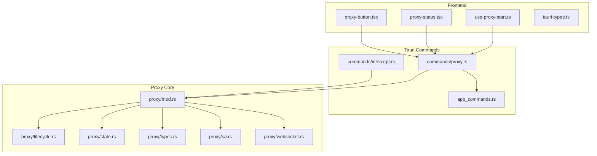
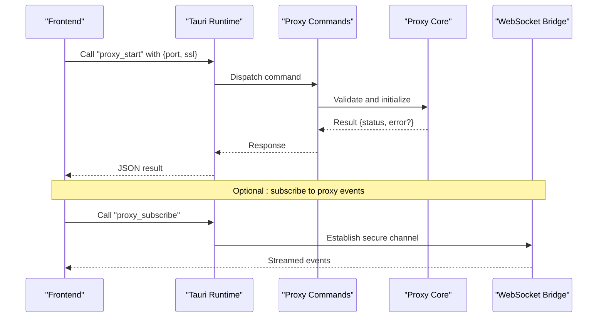
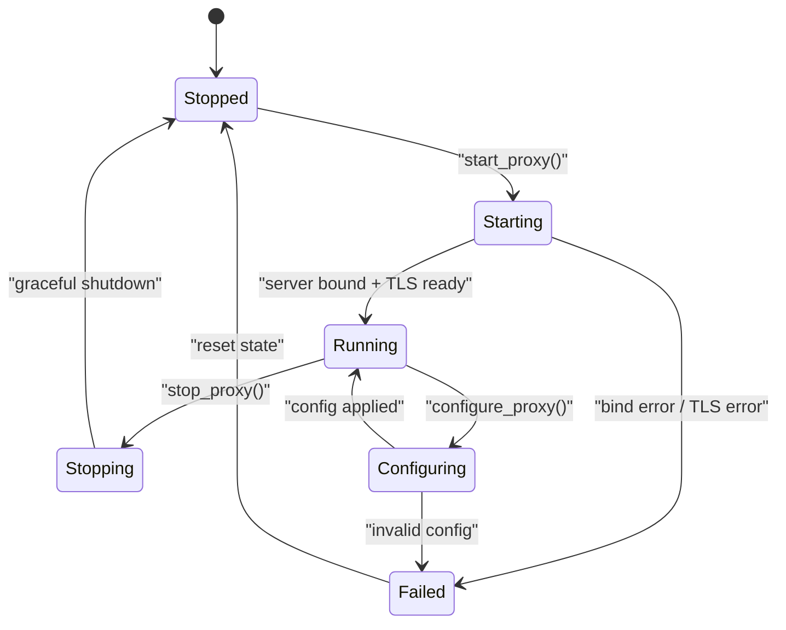
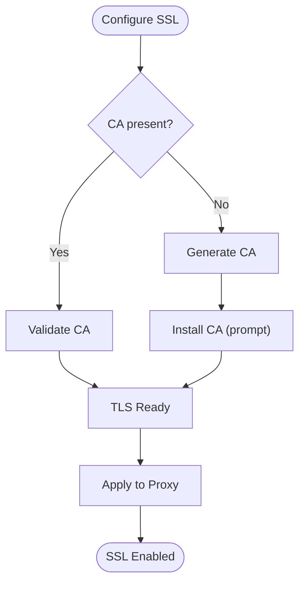
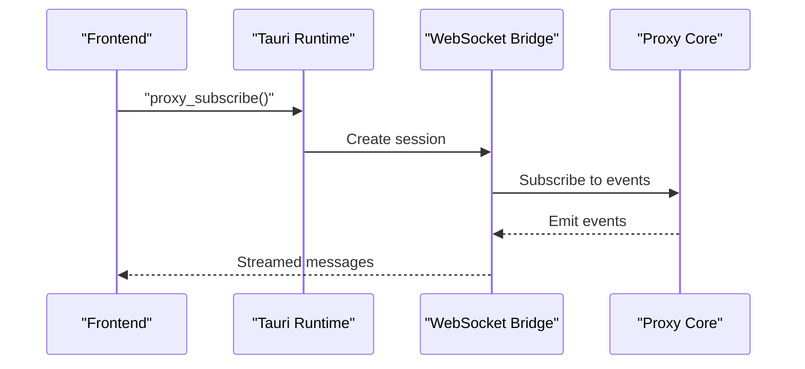
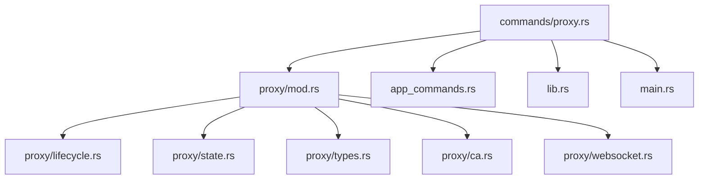

# Proxy Management Commands

<cite>
**Referenced Files in This Document**
- [proxy.rs](file://src-tauri/src/commands/proxy.rs)
- [mod.rs](file://src-tauri/src/proxy/mod.rs)
- [lifecycle.rs](file://src-tauri/src/proxy/lifecycle.rs)
- [state.rs](file://src-tauri/src/proxy/state.rs)
- [types.rs](file://src-tauri/src/proxy/types.rs)
- [ca.rs](file://src-tauri/src/proxy/ca.rs)
- [websocket.rs](file://src-tauri/src/proxy/websocket.rs)
- [intercept.rs](file://src-tauri/src/commands/intercept.rs)
- [app_commands.rs](file://src-tauri/src/app_commands.rs)
- [lib.rs](file://src-tauri/src/lib.rs)
- [main.rs](file://src-tauri/src/main.rs)
- [use-proxy-start.ts](file://src/hooks/use-proxy-start.ts)
- [proxy-status.tsx](file://src/layout/footer/proxy-status.tsx)
- [proxy-button.tsx](file://src/layout/proxy-button.tsx)
- [tauri-types.ts](file://src/lib/tauri-types.ts)
</cite>

## Table of Contents
1. [Introduction](#introduction)
2. [Project Structure](#project-structure)
3. [Core Components](#core-components)
4. [Architecture Overview](#architecture-overview)
5. [Detailed Component Analysis](#detailed-component-analysis)
6. [Dependency Analysis](#dependency-analysis)
7. [Performance Considerations](#performance-considerations)
8. [Troubleshooting Guide](#troubleshooting-guide)
9. [Conclusion](#conclusion)
10. [Appendices](#appendices)

## Introduction
This document provides API documentation for Apprecon’s proxy management Tauri commands. It covers the proxy lifecycle (start, stop, configure), status monitoring, SSL/TLS interception configuration, and intercept rules. It also outlines authentication requirements, rate limiting policies, performance considerations for high-throughput traffic interception, and includes JavaScript/TypeScript examples to control the proxy from the frontend.

## Project Structure
The proxy functionality is implemented in Rust under src-tauri/src/proxy and exposed via Tauri commands in src-tauri/src/commands/proxy.rs. The frontend integrates with these commands through hooks and UI components that call into Tauri’s command system.

**Diagram sources**
- [proxy.rs](file://src-tauri/src/commands/proxy.rs)
- [intercept.rs](file://src-tauri/src/commands/intercept.rs)
- [mod.rs](file://src-tauri/src/proxy/mod.rs)
- [lifecycle.rs](file://src-tauri/src/proxy/lifecycle.rs)
- [state.rs](file://src-tauri/src/proxy/state.rs)
- [types.rs](file://src-tauri/src/proxy/types.rs)
- [ca.rs](file://src-tauri/src/proxy/ca.rs)
- [websocket.rs](file://src-tauri/src/proxy/websocket.rs)
- [use-proxy-start.ts](file://src/hooks/use-proxy-start.ts)
- [proxy-status.tsx](file://src/layout/footer/proxy-status.tsx)
- [proxy-button.tsx](file://src/layout/proxy-button.tsx)
- [tauri-types.ts](file://src/lib/tauri-types.ts)
- [app_commands.rs](file://src-tauri/src/app_commands.rs)

**Section sources**
- [proxy.rs](file://src-tauri/src/commands/proxy.rs)
- [mod.rs](file://src-tauri/src/proxy/mod.rs)
- [lifecycle.rs](file://src-tauri/src/proxy/lifecycle.rs)
- [state.rs](file://src-tauri/src/proxy/state.rs)
- [types.rs](file://src-tauri/src/proxy/types.rs)
- [ca.rs](file://src-tauri/src/proxy/ca.rs)
- [websocket.rs](file://src-tauri/src/proxy/websocket.rs)
- [intercept.rs](file://src-tauri/src/commands/intercept.rs)
- [app_commands.rs](file://src-tauri/src/app_commands.rs)
- [lib.rs](file://src-tauri/src/lib.rs)
- [main.rs](file://src-tauri/src/main.rs)
- [use-proxy-start.ts](file://src/hooks/use-proxy-start.ts)
- [proxy-status.tsx](file://src/layout/footer/proxy-status.tsx)
- [proxy-button.tsx](file://src/layout/proxy-button.tsx)
- [tauri-types.ts](file://src/lib/tauri-types.ts)

## Core Components
- Proxy Command Layer: Exposes Tauri commands for starting, stopping, configuring, and querying proxy state.
- Proxy Lifecycle Manager: Handles start/stop transitions, port binding, TLS setup, and graceful shutdown.
- Proxy State Store: Tracks current running state, listening address/port, SSL settings, and intercept rules.
- CA and SSL Module: Manages certificate generation/installation and TLS interception configuration.
- WebSocket Bridge: Streams captured events or logs to the frontend over a secure channel.
- Intercept Rules Engine: Applies request/response filtering and modification based on configured patterns.

Key responsibilities:
- Start/Stop: Initialize or terminate the proxy server safely.
- Configure: Update listening port, SSL options, and intercept rules at runtime.
- Status: Return current operational state, including port, SSL mode, and active intercept rules.
- Interact: Allow intercept rule updates and event streaming.

**Section sources**
- [proxy.rs](file://src-tauri/src/commands/proxy.rs)
- [lifecycle.rs](file://src-tauri/src/proxy/lifecycle.rs)
- [state.rs](file://src-tauri/src/proxy/state.rs)
- [types.rs](file://src-tauri/src/proxy/types.rs)
- [ca.rs](file://src-tauri/src/proxy/ca.rs)
- [websocket.rs](file://src-tauri/src/proxy/websocket.rs)
- [intercept.rs](file://src-tauri/src/commands/intercept.rs)

## Architecture Overview
The proxy management follows a layered architecture:
- Frontend invokes Tauri commands via typed interfaces.
- Command handlers validate inputs and delegate to the proxy core.
- Proxy core manages lifecycle, state, SSL, and intercept rules.
- WebSocket bridge streams real-time events back to the frontend.

**Diagram sources**
- [proxy.rs](file://src-tauri/src/commands/proxy.rs)
- [mod.rs](file://src-tauri/src/proxy/mod.rs)
- [websocket.rs](file://src-tauri/src/proxy/websocket.rs)
- [use-proxy-start.ts](file://src/hooks/use-proxy-start.ts)

## Detailed Component Analysis

### Proxy Commands API
The following Tauri commands are available for proxy management. All commands return structured responses indicating success or failure.

- start_proxy
  - Purpose: Start the proxy server with specified configuration.
  - Parameters:
    - port: integer (listening port)
    - ssl_enabled: boolean (enable TLS interception)
    - ca_path: string (optional path to CA certificate)
    - intercept_rules: array of rule objects (see below)
  - Returns:
    - status: object {running: boolean, port: number, ssl: boolean}
    - error: string|null
  - Authentication: Requires elevated privileges if binding to privileged ports (<1024).
  - Rate Limiting: Enforced by backend; see Performance section.
  - Example usage: See TypeScript example in Appendices.

- stop_proxy
  - Purpose: Gracefully stop the proxy server.
  - Parameters: none
  - Returns:
    - status: object {running: boolean}
    - error: string|null

- configure_proxy
  - Purpose: Update proxy configuration at runtime.
  - Parameters:
    - port: integer (optional new port)
    - ssl_enabled: boolean (optional toggle TLS)
    - ca_path: string (optional update CA path)
    - intercept_rules: array of rule objects (optional replace rules)
  - Returns:
    - status: object {configured: boolean, port: number, ssl: boolean}
    - error: string|null

- get_proxy_status
  - Purpose: Retrieve current proxy state.
  - Parameters: none
  - Returns:
    - status: object {running: boolean, port: number, ssl: boolean, rules_count: number}
    - error: string|null

- set_intercept_rules
  - Purpose: Replace or append intercept rules.
  - Parameters:
    - rules: array of rule objects
  - Returns:
    - status: object {applied: boolean, rules_count: number}
    - error: string|null

Intercept Rule Object:
- match_type: enum {"url_pattern", "host", "method", "header"}
- pattern: string (regex or exact match depending on match_type)
- action: enum {"allow", "block", "modify"}
- modify_headers: object (optional key-value pairs to add/update headers)
- modify_body: boolean (optional flag to allow body inspection/modification)

Notes:
- Port conflicts will return an error; choose an available port.
- SSL requires valid CA certificate when enabled.
- Large intercept rule sets may impact performance; keep rules minimal and specific.

**Section sources**
- [proxy.rs](file://src-tauri/src/commands/proxy.rs)
- [types.rs](file://src-tauri/src/proxy/types.rs)
- [intercept.rs](file://src-tauri/src/commands/intercept.rs)

### Proxy Lifecycle and State
Lifecycle transitions are managed to ensure safe start/stop operations and consistent state reporting.

**Diagram sources**
- [lifecycle.rs](file://src-tauri/src/proxy/lifecycle.rs)
- [state.rs](file://src-tauri/src/proxy/state.rs)

**Section sources**
- [lifecycle.rs](file://src-tauri/src/proxy/lifecycle.rs)
- [state.rs](file://src-tauri/src/proxy/state.rs)

### SSL and CA Management
SSL interception requires a trusted CA certificate. The module handles:
- Certificate generation/validation
- Installation prompts (OS-specific)
- Runtime TLS configuration updates

**Diagram sources**
- [ca.rs](file://src-tauri/src/proxy/ca.rs)

**Section sources**
- [ca.rs](file://src-tauri/src/proxy/ca.rs)

### WebSocket Event Streaming
The WebSocket bridge streams proxy events (e.g., intercepted requests, errors) to the frontend.

**Diagram sources**
- [websocket.rs](file://src-tauri/src/proxy/websocket.rs)

**Section sources**
- [websocket.rs](file://src-tauri/src/proxy/websocket.rs)

### Frontend Integration Examples
Use the provided hooks and types to interact with proxy commands from the frontend.

- Start Proxy Hook: use-proxy-start.ts
- Status Display: proxy-status.tsx
- Button Control: proxy-button.tsx
- Typed Interfaces: tauri-types.ts

Example workflow:
- Call start_proxy with desired port and SSL flags.
- Monitor status using get_proxy_status periodically or via WebSocket events.
- Update intercept rules dynamically using set_intercept_rules.

**Section sources**
- [use-proxy-start.ts](file://src/hooks/use-proxy-start.ts)
- [proxy-status.tsx](file://src/layout/footer/proxy-status.tsx)
- [proxy-button.tsx](file://src/layout/proxy-button.tsx)
- [tauri-types.ts](file://src/lib/tauri-types.ts)

## Dependency Analysis
The proxy commands depend on internal modules for lifecycle, state, SSL, and WebSocket handling. External dependencies include Tauri runtime and OS-level networking libraries.

**Diagram sources**
- [proxy.rs](file://src-tauri/src/commands/proxy.rs)
- [mod.rs](file://src-tauri/src/proxy/mod.rs)
- [lifecycle.rs](file://src-tauri/src/proxy/lifecycle.rs)
- [state.rs](file://src-tauri/src/proxy/state.rs)
- [types.rs](file://src-tauri/src/proxy/types.rs)
- [ca.rs](file://src-tauri/src/proxy/ca.rs)
- [websocket.rs](file://src-tauri/src/proxy/websocket.rs)
- [app_commands.rs](file://src-tauri/src/app_commands.rs)
- [lib.rs](file://src-tauri/src/lib.rs)
- [main.rs](file://src-tauri/src/main.rs)

**Section sources**
- [proxy.rs](file://src-tauri/src/commands/proxy.rs)
- [mod.rs](file://src-tauri/src/proxy/mod.rs)
- [lifecycle.rs](file://src-tauri/src/proxy/lifecycle.rs)
- [state.rs](file://src-tauri/src/proxy/state.rs)
- [types.rs](file://src-tauri/src/proxy/types.rs)
- [ca.rs](file://src-tauri/src/proxy/ca.rs)
- [websocket.rs](file://src-tauri/src/proxy/websocket.rs)
- [app_commands.rs](file://src-tauri/src/app_commands.rs)
- [lib.rs](file://src-tauri/src/lib.rs)
- [main.rs](file://src-tauri/src/main.rs)

## Performance Considerations
- High-throughput interception:
  - Use efficient intercept rules; avoid overly broad patterns.
  - Enable connection pooling where applicable.
  - Monitor memory usage during large payload processing.
- Rate limiting:
  - Backend enforces per-client request limits to prevent abuse.
  - Adjust limits based on system resources and expected load.
- SSL overhead:
  - TLS interception adds CPU overhead; consider disabling for non-sensitive traffic.
  - Cache CA certificates to reduce repeated validation costs.
- WebSocket streaming:
  - Throttle event emission if needed to avoid frontend overload.
  - Use message batching for high-frequency events.

[No sources needed since this section provides general guidance]

## Troubleshooting Guide
Common issues and resolutions:
- Port already in use: Choose a different port or stop conflicting services.
- SSL certificate errors: Ensure CA is installed and valid; regenerate if necessary.
- Intercept rules not applied: Validate rule syntax and reload configuration.
- WebSocket disconnects: Re-establish subscription; check network permissions.

Error codes and messages are returned in command responses; inspect the error field for details.

**Section sources**
- [proxy.rs](file://src-tauri/src/commands/proxy.rs)
- [lifecycle.rs](file://src-tauri/src/proxy/lifecycle.rs)
- [state.rs](file://src-tauri/src/proxy/state.rs)

## Conclusion
Apprecon’s proxy management commands provide a robust interface for controlling HTTP interception, SSL/TLS configuration, and dynamic rule application. By following the documented API, integrating with frontend hooks, and adhering to performance best practices, developers can build powerful traffic inspection workflows within the Tauri desktop environment.

[No sources needed since this section summarizes without analyzing specific files]

## Appendices

### JavaScript/TypeScript Usage Examples
Below are conceptual examples demonstrating how to control the proxy from the frontend using Tauri commands. Replace placeholder function names with actual implementations as defined in your Tauri bindings.

- Start Proxy
  - Call start_proxy with port and SSL options.
  - Handle response status and errors.

- Stop Proxy
  - Invoke stop_proxy to gracefully shut down.

- Configure Proxy
  - Use configure_proxy to update settings without restart.

- Get Status
  - Poll get_proxy_status or subscribe to WebSocket events.

- Set Intercept Rules
  - Send updated rules via set_intercept_rules.

For concrete implementations, refer to:
- [use-proxy-start.ts](file://src/hooks/use-proxy-start.ts)
- [proxy-status.tsx](file://src/layout/footer/proxy-status.tsx)
- [proxy-button.tsx](file://src/layout/proxy-button.tsx)
- [tauri-types.ts](file://src/lib/tauri-types.ts)

**Section sources**
- [use-proxy-start.ts](file://src/hooks/use-proxy-start.ts)
- [proxy-status.tsx](file://src/layout/footer/proxy-status.tsx)
- [proxy-button.tsx](file://src/layout/proxy-button.tsx)
- [tauri-types.ts](file://src/lib/tauri-types.ts)