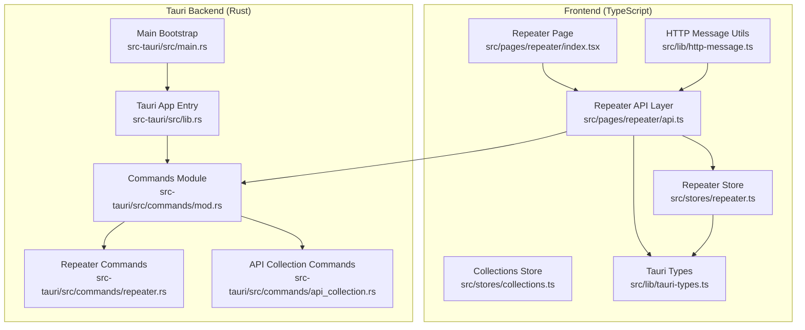
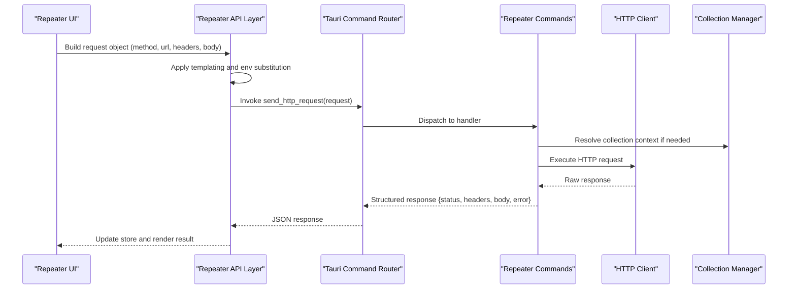
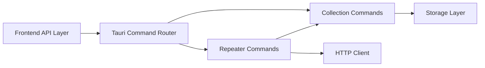

# Repeater & HTTP Client Commands

<cite>
**Referenced Files in This Document**
- [repeater.rs](file://src-tauri/src/commands/repeater.rs)
- [api_collection.rs](file://src-tauri/src/commands/api_collection.rs)
- [mod.rs](file://src-tauri/src/commands/mod.rs)
- [lib.rs](file://src-tauri/src/lib.rs)
- [main.rs](file://src-tauri/src/main.rs)
- [repeater.tsx](file://src/pages/repeater/index.tsx)
- [repeater_api.ts](file://src/pages/repeater/api.ts)
- [repeater_store.ts](file://src/stores/repeater.ts)
- [collections_store.ts](file://src/stores/collections.ts)
- [http_message.ts](file://src/lib/http-message.ts)
- [tauri-types.ts](file://src/lib/tauri-types.ts)
</cite>

## Table of Contents
1. [Introduction](#introduction)
2. [Project Structure](#project-structure)
3. [Core Components](#core-components)
4. [Architecture Overview](#architecture-overview)
5. [Detailed Component Analysis](#detailed-component-analysis)
6. [Dependency Analysis](#dependency-analysis)
7. [Performance Considerations](#performance-considerations)
8. [Troubleshooting Guide](#troubleshooting-guide)
9. [Conclusion](#conclusion)
10. [Appendices](#appendices)

## Introduction
This document provides API documentation for Apprecon’s repeater and HTTP client Tauri commands. It covers:
- HTTP request execution functions exposed via Tauri commands
- Collection management operations for organizing requests
- Response handling and error reporting
- Request templating and environment variable substitution
- Batch request execution patterns
- JavaScript/TypeScript examples for programmatic usage from the frontend

The goal is to enable developers to integrate with Apprecon’s HTTP client capabilities, manage collections of requests, and process responses reliably within the Tauri-based desktop application.

## Project Structure
Apprecon exposes HTTP-related functionality through Rust-based Tauri commands that are invoked by the TypeScript frontend. The key areas include:
- Tauri command definitions for repeater and API collection management
- Frontend pages and stores that call these commands
- Shared types and utilities for HTTP messages and Tauri bindings



**Diagram sources**
- [lib.rs](file://src-tauri/src/lib.rs)
- [main.rs](file://src-tauri/src/main.rs)
- [mod.rs](file://src-tauri/src/commands/mod.rs)
- [repeater.rs](file://src-tauri/src/commands/repeater.rs)
- [api_collection.rs](file://src-tauri/src/commands/api_collection.rs)
- [repeater.tsx](file://src/pages/repeater/index.tsx)
- [repeater_api.ts](file://src/pages/repeater/api.ts)
- [repeater_store.ts](file://src/stores/repeater.ts)
- [collections_store.ts](file://src/stores/collections.ts)
- [http_message.ts](file://src/lib/http-message.ts)
- [tauri-types.ts](file://src/lib/tauri-types.ts)

**Section sources**
- [lib.rs](file://src-tauri/src/lib.rs)
- [main.rs](file://src-tauri/src/main.rs)
- [mod.rs](file://src-tauri/src/commands/mod.rs)
- [repeater.rs](file://src-tauri/src/commands/repeater.rs)
- [api_collection.rs](file://src-tauri/src/commands/api_collection.rs)
- [repeater.tsx](file://src/pages/repeater/index.tsx)
- [repeater_api.ts](file://src/pages/repeater/api.ts)
- [repeater_store.ts](file://src/stores/repeater.ts)
- [collections_store.ts](file://src/stores/collections.ts)
- [http_message.ts](file://src/lib/http-message.ts)
- [tauri-types.ts](file://src/lib/tauri-types.ts)

## Core Components
This section outlines the primary components involved in executing HTTP requests and managing collections via Tauri commands.

- Repeater Commands (Rust): Define Tauri endpoints for sending HTTP requests, handling headers, payloads, authentication, and returning structured responses.
- API Collection Commands (Rust): Provide endpoints for creating, updating, deleting, and listing collections; associating requests with collections; and exporting/importing collections.
- Frontend API Layer (TypeScript): Wraps Tauri command invocations, constructs request objects, and processes responses.
- Stores (TypeScript): Manage state for repeater operations and collections, including batching and templating.
- HTTP Message Utilities (TypeScript): Normalize and serialize HTTP messages, handle headers, bodies, and templating variables.

Key responsibilities:
- Execute HTTP requests with full control over method, URL, headers, body, timeouts, and SSL settings
- Support templating and environment variable substitution before sending
- Organize requests into collections and persist them
- Return standardized response objects with status codes, headers, body, and errors

**Section sources**
- [repeater.rs](file://src-tauri/src/commands/repeater.rs)
- [api_collection.rs](file://src-tauri/src/commands/api_collection.rs)
- [repeater_api.ts](file://src/pages/repeater/api.ts)
- [repeater_store.ts](file://src/stores/repeater.ts)
- [collections_store.ts](file://src/stores/collections.ts)
- [http_message.ts](file://src/lib/http-message.ts)

## Architecture Overview
The architecture follows a clear separation between frontend and backend:
- The frontend constructs HTTP requests using typed models and calls Tauri commands.
- The backend executes network I/O securely, applies templating and environment substitution, and returns structured results.
- Collections are managed centrally and can be referenced by request IDs or names.



**Diagram sources**
- [repeater_api.ts](file://src/pages/repeater/api.ts)
- [repeater_store.ts](file://src/stores/repeater.ts)
- [repeater.rs](file://src-tauri/src/commands/repeater.rs)
- [api_collection.rs](file://src-tauri/src/commands/api_collection.rs)

## Detailed Component Analysis

### Repeater Commands (Tauri)
These commands expose HTTP request execution capabilities to the frontend. Typical operations include:
- Sending a single HTTP request with full customization
- Executing batch requests across multiple endpoints
- Handling authentication schemes (e.g., bearer tokens, basic auth)
- Returning standardized response objects

Function signatures (conceptual):
- send_http_request(request: HttpRequest) -> HttpResponse
- execute_batch_requests(requests: HttpRequest[]) -> HttpResponse[]
- resolve_template_variables(template: string, env: EnvMap) -> string

Request object fields:
- method: string (GET, POST, PUT, DELETE, etc.)
- url: string (with optional template variables)
- headers: Record<string, string>
- body: string | ArrayBuffer | FormData-like structure
- timeout_ms: number
- follow_redirects: boolean
- ssl_verify: boolean
- auth: AuthConfig (scheme-specific)

Response object fields:
- status_code: number
- headers: Record<string, string>
- body: string | ArrayBuffer
- error: string | null
- duration_ms: number

Authentication methods:
- Bearer token via Authorization header
- Basic authentication via username/password
- Custom schemes supported through extensible configuration

Templating and environment substitution:
- Variables like {{baseUrl}}, {{token}} are resolved before sending
- Environment maps provide dynamic values per context

Batch execution:
- Multiple requests can be sent concurrently or sequentially
- Results aggregated into an array with per-request metadata

JavaScript/TypeScript example (conceptual):
- Construct HttpRequest with method, url, headers, body
- Call send_http_request via Tauri invoke
- Handle HttpResponse and update UI/store

**Section sources**
- [repeater.rs](file://src-tauri/src/commands/repeater.rs)
- [repeater_api.ts](file://src/pages/repeater/api.ts)
- [http_message.ts](file://src/lib/http-message.ts)

### API Collection Commands (Tauri)
These commands manage collections of requests for organization and reuse. Operations include:
- create_collection(name: string, description?: string) -> CollectionId
- update_collection(id: CollectionId, updates: Partial<Collection>) -> void
- delete_collection(id: CollectionId) -> void
- list_collections() -> Collection[]
- add_request_to_collection(collection_id: CollectionId, request_id: RequestId) -> void
- export_collection(id: CollectionId) -> ExportPayload
- import_collection(payload: ImportPayload) -> CollectionId

Collection object fields:
- id: string
- name: string
- description: string
- created_at: timestamp
- updated_at: timestamp
- request_ids: string[]

Request association:
- Requests can be linked to collections by ID or name
- Bulk operations support adding/removing multiple requests

Export/Import:
- Serialize collections to JSON for sharing or backup
- Validate and reconstruct collections on import

JavaScript/TypeScript example (conceptual):
- Create a new collection
- Add existing requests to it
- Export the collection for reuse

**Section sources**
- [api_collection.rs](file://src-tauri/src/commands/api_collection.rs)
- [collections_store.ts](file://src/stores/collections.ts)

### Frontend API Layer and Stores
The frontend wraps Tauri commands and manages state:
- Repeater API layer constructs requests and invokes commands
- Stores handle response processing, error handling, and UI updates
- Templating and environment substitution are applied before sending

Key responsibilities:
- Normalize request objects to match backend expectations
- Parse and display responses consistently
- Maintain collection state and associations
- Provide utilities for templating and variable resolution

**Section sources**
- [repeater_api.ts](file://src/pages/repeater/api.ts)
- [repeater_store.ts](file://src/stores/repeater.ts)
- [collections_store.ts](file://src/stores/collections.ts)
- [http_message.ts](file://src/lib/http-message.ts)

## Dependency Analysis
The system exhibits clear separation of concerns:
- Frontend depends on Tauri command interfaces defined in Rust
- Backend commands depend on HTTP client libraries and storage modules
- Collections are managed independently but referenced by requests



**Diagram sources**
- [mod.rs](file://src-tauri/src/commands/mod.rs)
- [repeater.rs](file://src-tauri/src/commands/repeater.rs)
- [api_collection.rs](file://src-tauri/src/commands/api_collection.rs)

**Section sources**
- [mod.rs](file://src-tauri/src/commands/mod.rs)
- [repeater.rs](file://src-tauri/src/commands/repeater.rs)
- [api_collection.rs](file://src-tauri/src/commands/api_collection.rs)

## Performance Considerations
- Use batch execution for multiple requests to reduce overhead
- Implement connection pooling where possible
- Cache frequently used templates and environment variables
- Avoid unnecessary serialization/deserialization cycles
- Monitor timeouts and handle slow responses gracefully

[No sources needed since this section provides general guidance]

## Troubleshooting Guide
Common issues and resolutions:
- Network errors: Check connectivity, SSL settings, and proxy configurations
- Authentication failures: Verify credentials and token expiration
- Templating errors: Ensure all variables are defined and correctly formatted
- Collection mismatches: Confirm IDs and names match expected values
- Response parsing errors: Validate content types and encoding

Debugging steps:
- Enable verbose logging in the backend
- Inspect raw request/response payloads
- Validate template syntax and environment maps
- Test individual requests before batching

**Section sources**
- [repeater.rs](file://src-tauri/src/commands/repeater.rs)
- [api_collection.rs](file://src-tauri/src/commands/api_collection.rs)
- [repeater_api.ts](file://src/pages/repeater/api.ts)

## Conclusion
Apprecon’s repeater and HTTP client commands provide a robust foundation for programmatic HTTP interactions within a desktop application. By leveraging Tauri commands, developers can execute requests, manage collections, and process responses efficiently. The modular architecture supports extensibility and maintainability while offering powerful features like templating and batch execution.

[No sources needed since this section summarizes without analyzing specific files]

## Appendices

### JavaScript/TypeScript Examples

#### Sending an HTTP Request
```typescript
// Conceptual example
const request = {
  method: "GET",
  url: "https://api.example.com/data",
  headers: { "Authorization": "Bearer token123" },
  body: null,
  timeout_ms: 5000,
  follow_redirects: true,
  ssl_verify: true
};

try {
  const response = await invoke("send_http_request", request);
  console.log("Status:", response.status_code);
  console.log("Body:", response.body);
} catch (error) {
  console.error("Request failed:", error);
}
```

#### Managing Collections
```typescript
// Conceptual example
async function manageCollections() {
  // Create a new collection
  const collectionId = await invoke("create_collection", {
    name: "API Tests",
    description: "Test suite for API endpoints"
  });

  // Add a request to the collection
  await invoke("add_request_to_collection", {
    collection_id: collectionId,
    request_id: "req_123"
  });

  // Export the collection
  const payload = await invoke("export_collection", {
    id: collectionId
  });

  console.log("Exported collection:", payload);
}
```

#### Batch Execution
```typescript
// Conceptual example
const requests = [
  { method: "GET", url: "https://api.example.com/users" },
  { method: "POST", url: "https://api.example.com/login", body: "{...}" }
];

try {
  const responses = await invoke("execute_batch_requests", requests);
  responses.forEach((response, index) => {
    console.log(`Request ${index + 1}:`, response.status_code);
  });
} catch (error) {
  console.error("Batch execution failed:", error);
}
```

[No sources needed since this section provides conceptual examples]