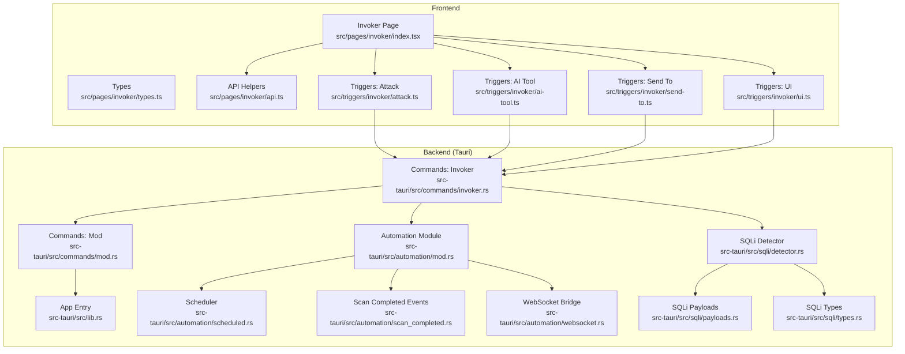
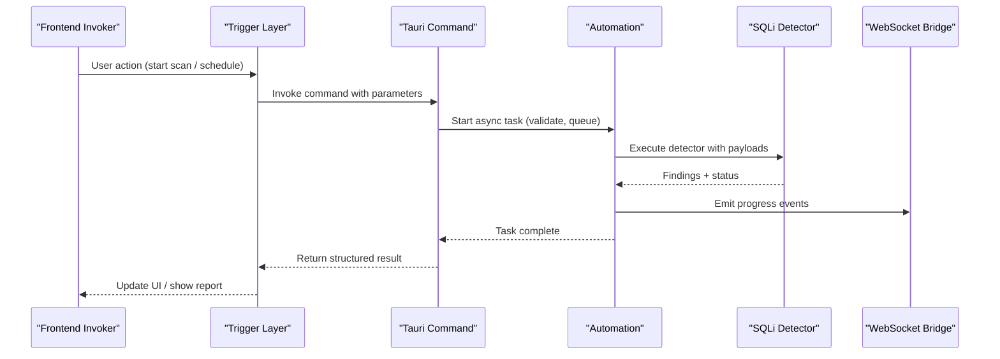
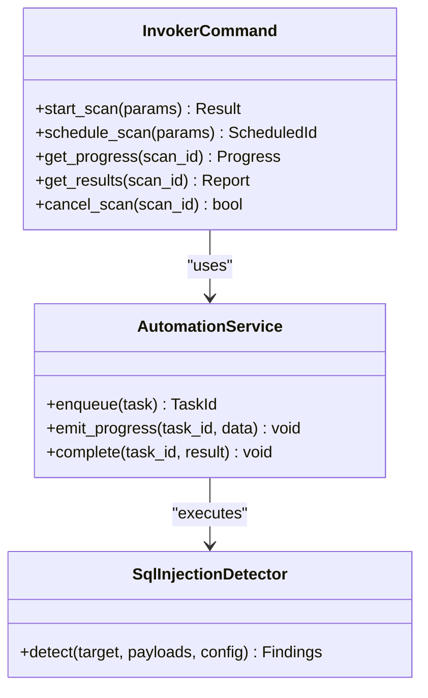
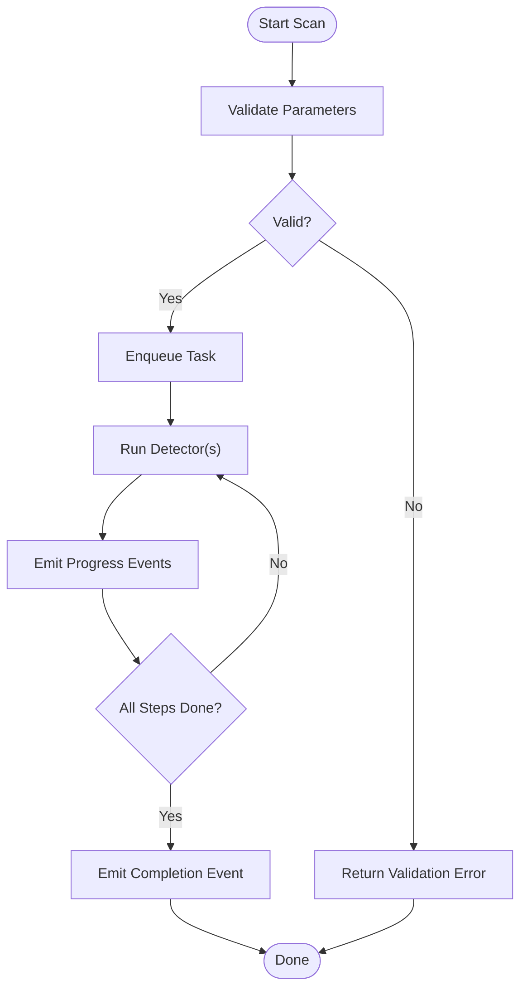
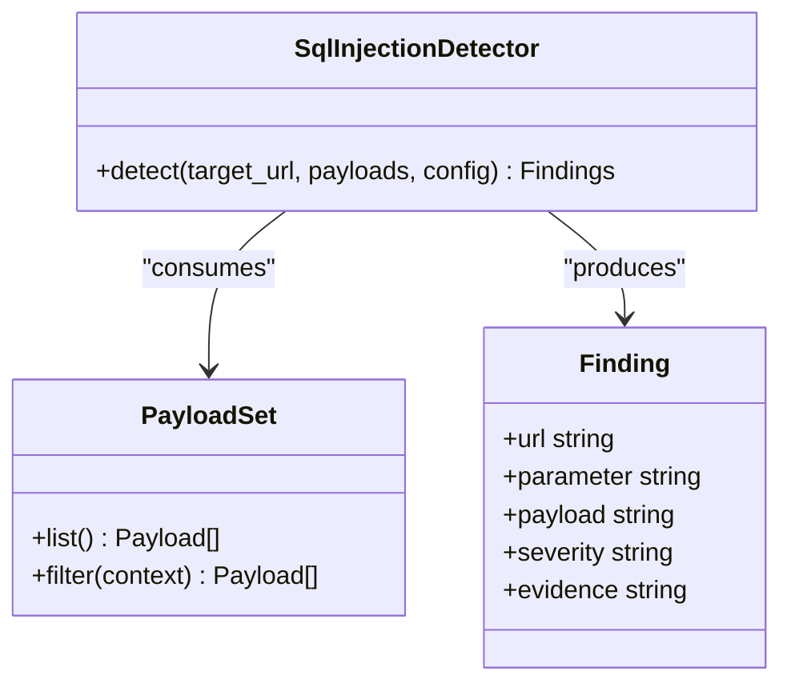
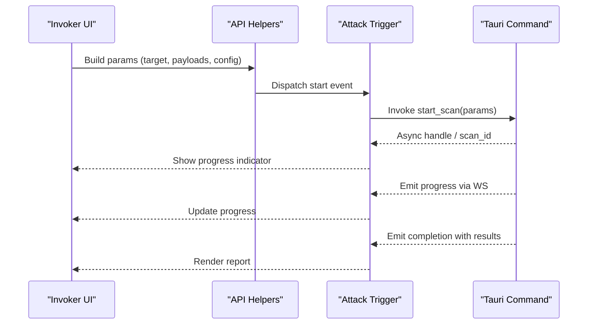
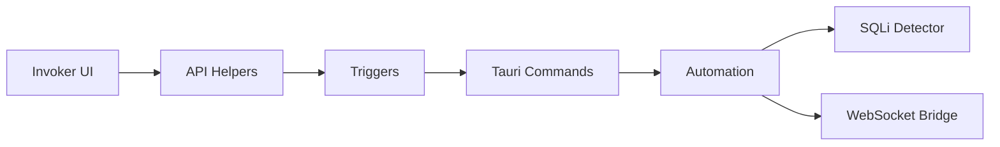

# Security Testing Invoker Commands

<cite>
**Referenced Files in This Document**
- [invoker.rs](file://src-tauri/src/commands/invoker.rs)
- [mod.rs](file://src-tauri/src/commands/mod.rs)
- [lib.rs](file://src-tauri/src/lib.rs)
- [types.rs](file://src-tauri/src/types.rs)
- [index.ts](file://src/pages/invoker/index.tsx)
- [types.ts](file://src/pages/invoker/types.ts)
- [api.ts](file://src/pages/invoker/api.ts)
- [attack.ts](file://src/triggers/invoker/attack.ts)
- [ai-tool.ts](file://src/triggers/invoker/ai-tool.ts)
- [send-to.ts](file://src/triggers/invoker/send-to.ts)
- [ui.ts](file://src/triggers/invoker/ui.ts)
- [automation.rs](file://src-tauri/src/automation/mod.rs)
- [scheduled.rs](file://src-tauri/src/automation/scheduled.rs)
- [scan_completed.rs](file://src-tauri/src/automation/scan_completed.rs)
- [websocket.rs](file://src-tauri/src/automation/websocket.rs)
- [sqli/detector.rs](file://src-tauri/src/sqli/detector.rs)
- [sqli/payloads.rs](file://src-tauri/src/sqli/payloads.rs)
- [sqli/types.rs](file://src-tauri/src/sqli/types.rs)
</cite>

## Table of Contents
1. [Introduction](#introduction)
2. [Project Structure](#project-structure)
3. [Core Components](#core-components)
4. [Architecture Overview](#architecture-overview)
5. [Detailed Component Analysis](#detailed-component-analysis)
6. [Dependency Analysis](#dependency-analysis)
7. [Performance Considerations](#performance-considerations)
8. [Troubleshooting Guide](#Troubleshooting-Guide)
9. [Conclusion](#conclusion)
10. [Appendices](#appendices)

## Introduction
This document provides API documentation for Apprecon’s security testing invoker Tauri commands. It focuses on vulnerability scanning functions such as SQL injection detection and XSS testing, along with general security assessment tools exposed via Tauri commands. The guide explains function signatures (parameters, return types), safety controls, payload customization, scan scheduling, result interpretation, and includes JavaScript/TypeScript examples to execute tests and process findings programmatically.

## Project Structure
The invoker functionality is implemented across the Rust backend (Tauri commands and modules) and the TypeScript frontend (UI, triggers, and API helpers). Key areas include:
- Tauri command registration and invocation handlers
- Automation subsystem for scheduling and progress events
- SQL injection detection module
- Frontend invoker page and trigger wiring for attack execution and UI interactions

**Diagram sources**
- [index.tsx](file://src/pages/invoker/index.tsx)
- [types.ts](file://src/pages/invoker/types.ts)
- [api.ts](file://src/pages/invoker/api.ts)
- [attack.ts](file://src/triggers/invoker/attack.ts)
- [ai-tool.ts](file://src/triggers/invoker/ai-tool.ts)
- [send-to.ts](file://src/triggers/invoker/send-to.ts)
- [ui.ts](file://src/triggers/invoker/ui.ts)
- [invoker.rs](file://src-tauri/src/commands/invoker.rs)
- [mod.rs](file://src-tauri/src/commands/mod.rs)
- [lib.rs](file://src-tauri/src/lib.rs)
- [automation/mod.rs](file://src-tauri/src/automation/mod.rs)
- [scheduled.rs](file://src-tauri/src/automation/scheduled.rs)
- [scan_completed.rs](file://src-tauri/src/automation/scan_completed.rs)
- [websocket.rs](file://src-tauri/src/automation/websocket.rs)
- [sqli/detector.rs](file://src-tauri/src/sqli/detector.rs)
- [sqli/payloads.rs](file://src-tauri/src/sqli/payloads.rs)
- [sqli/types.rs](file://src-tauri/src/sqli/types.rs)

**Section sources**
- [invoker.rs](file://src-tauri/src/commands/invoker.rs)
- [mod.rs](file://src-tauri/src/commands/mod.rs)
- [lib.rs](file://src-tauri/src/lib.rs)
- [index.tsx](file://src/pages/invoker/index.tsx)
- [types.ts](file://src/pages/invoker/types.ts)
- [api.ts](file://src/pages/invoker/api.ts)
- [attack.ts](file://src/triggers/invoker/attack.ts)
- [ai-tool.ts](file://src/triggers/invoker/ai-tool.ts)
- [send-to.ts](file://src/triggers/invoker/send-to.ts)
- [ui.ts](file://src/triggers/invoker/ui.ts)
- [automation/mod.rs](file://src-tauri/src/automation/mod.rs)
- [scheduled.rs](file://src-tauri/src/automation/scheduled.rs)
- [scan_completed.rs](file://src-tauri/src/automation/scan_completed.rs)
- [websocket.rs](file://src-tauri/src/automation/websocket.rs)
- [sqli/detector.rs](file://src-tauri/src/sqli/detector.rs)
- [sqli/payloads.rs](file://src-tauri/src/sqli/payloads.rs)
- [sqli/types.rs](file://src-tauri/src/sqli/types.rs)

## Core Components
- Tauri Invoker Commands: Expose functions to start scans, schedule tasks, send payloads, and retrieve results. These are defined in the Rust command layer and registered with Tauri.
- Automation Subsystem: Manages background execution, scheduling, progress reporting, and completion events.
- SQL Injection Module: Provides detectors, payloads, and typed structures for SQLi scanning.
- Frontend Invoker UI and Triggers: Provide user interfaces and event-driven hooks to invoke commands, customize payloads, and display results.

Key responsibilities:
- Parameter validation and safety checks before executing scans
- Asynchronous execution with progress updates
- Structured result serialization for frontend consumption
- Event emission for scheduled and completed scans

**Section sources**
- [invoker.rs](file://src-tauri/src/commands/invoker.rs)
- [automation/mod.rs](file://src-tauri/src/automation/mod.rs)
- [scheduled.rs](file://src-tauri/src/automation/scheduled.rs)
- [scan_completed.rs](file://src-tauri/src/automation/scan_completed.rs)
- [websocket.rs](file://src-tauri/src/automation/websocket.rs)
- [sqli/detector.rs](file://src-tauri/src/sqli/detector.rs)
- [sqli/payloads.rs](file://src-tauri/src/sqli/payloads.rs)
- [sqli/types.rs](file://src-tauri/src/sqli/types.rs)
- [index.tsx](file://src/pages/invoker/index.tsx)
- [types.ts](file://src/pages/invoker/types.ts)
- [api.ts](file://src/pages/invoker/api.ts)
- [attack.ts](file://src/triggers/invoker/attack.ts)
- [ai-tool.ts](file://src/triggers/invoker/ai-tool.ts)
- [send-to.ts](file://src/triggers/invoker/send-to.ts)
- [ui.ts](file://src/triggers/invoker/ui.ts)

## Architecture Overview
The invoker workflow integrates frontend triggers with backend commands and automation services. Scans run asynchronously, emitting progress and completion events through a WebSocket bridge. Results are structured and returned to the frontend for visualization and further processing.

**Diagram sources**
- [index.tsx](file://src/pages/invoker/index.tsx)
- [attack.ts](file://src/triggers/invoker/attack.ts)
- [invoker.rs](file://src-tauri/src/commands/invoker.rs)
- [automation/mod.rs](file://src-tauri/src/automation/mod.rs)
- [sqli/detector.rs](file://src-tauri/src/sqli/detector.rs)
- [websocket.rs](file://src-tauri/src/automation/websocket.rs)

## Detailed Component Analysis

### Tauri Invoker Commands
- Purpose: Define and register Tauri commands that front-end triggers call to initiate security tests.
- Typical operations:
  - Start a scan against a target URL or request set
  - Schedule recurring or delayed scans
  - Retrieve scan progress and final results
  - Manage payload sets and configurations
- Safety controls:
  - Input validation for URLs, headers, and payloads
  - Rate limiting and concurrency limits
  - Scope enforcement to restrict targets
  - Error handling and structured error responses

**Diagram sources**
- [invoker.rs](file://src-tauri/src/commands/invoker.rs)
- [automation/mod.rs](file://src-tauri/src/automation/mod.rs)
- [sqli/detector.rs](file://src-tauri/src/sqli/detector.rs)

**Section sources**
- [invoker.rs](file://src-tauri/src/commands/invoker.rs)
- [mod.rs](file://src-tauri/src/commands/mod.rs)
- [lib.rs](file://src-tauri/src/lib.rs)

### Automation and Scheduling
- Purpose: Orchestrate background execution, manage queues, emit progress, and handle completion events.
- Features:
  - Task scheduling with delays or intervals
  - Progress streaming via WebSocket
  - Completion notifications with structured reports
  - Cancellation and timeout support

**Diagram sources**
- [automation/mod.rs](file://src-tauri/src/automation/mod.rs)
- [scheduled.rs](file://src-tauri/src/automation/scheduled.rs)
- [scan_completed.rs](file://src-tauri/src/automation/scan_completed.rs)
- [websocket.rs](file://src-tauri/src/automation/websocket.rs)

**Section sources**
- [automation/mod.rs](file://src-tauri/src/automation/mod.rs)
- [scheduled.rs](file://src-tauri/src/automation/scheduled.rs)
- [scan_completed.rs](file://src-tauri/src/automation/scan_completed.rs)
- [websocket.rs](file://src-tauri/src/automation/websocket.rs)

### SQL Injection Detection
- Purpose: Detect SQL injection vulnerabilities by sending crafted payloads and analyzing responses.
- Components:
  - Detector logic to evaluate response characteristics
  - Payload sets tailored for different databases and contexts
  - Typed structures for findings and configuration

**Diagram sources**
- [sqli/detector.rs](file://src-tauri/src/sqli/detector.rs)
- [sqli/payloads.rs](file://src-tauri/src/sqli/payloads.rs)
- [sqli/types.rs](file://src-tauri/src/sqli/types.rs)

**Section sources**
- [sqli/detector.rs](file://src-tauri/src/sqli/detector.rs)
- [sqli/payloads.rs](file://src-tauri/src/sqli/payloads.rs)
- [sqli/types.rs](file://src-tauri/src/sqli/types.rs)

### Frontend Invoker Page and Triggers
- Purpose: Provide UI and event-driven hooks to configure and execute security tests.
- Responsibilities:
  - Collect target URLs, payloads, and scan configurations
  - Call Tauri commands via API helpers
  - Display progress and results
  - Support scheduling and cancellation

**Diagram sources**
- [index.tsx](file://src/pages/invoker/index.tsx)
- [api.ts](file://src/pages/invoker/api.ts)
- [attack.ts](file://src/triggers/invoker/attack.ts)
- [invoker.rs](file://src-tauri/src/commands/invoker.rs)

**Section sources**
- [index.tsx](file://src/pages/invoker/index.tsx)
- [types.ts](file://src/pages/invoker/types.ts)
- [api.ts](file://src/pages/invoker/api.ts)
- [attack.ts](file://src/triggers/invoker/attack.ts)
- [ai-tool.ts](file://src/triggers/invoker/ai-tool.ts)
- [send-to.ts](file://src/triggers/invoker/send-to.ts)
- [ui.ts](file://src/triggers/invoker/ui.ts)

## Dependency Analysis
The invoker system has clear separation between frontend triggers/UI and backend commands/automation. Dependencies flow from UI to triggers to Tauri commands, which then delegate to automation and specialized detectors.

**Diagram sources**
- [index.tsx](file://src/pages/invoker/index.tsx)
- [api.ts](file://src/pages/invoker/api.ts)
- [attack.ts](file://src/triggers/invoker/attack.ts)
- [invoker.rs](file://src-tauri/src/commands/invoker.rs)
- [automation/mod.rs](file://src-tauri/src/automation/mod.rs)
- [sqli/detector.rs](file://src-tauri/src/sqli/detector.rs)
- [websocket.rs](file://src-tauri/src/automation/websocket.rs)

**Section sources**
- [index.tsx](file://src/pages/invoker/index.tsx)
- [api.ts](file://src/pages/invoker/api.ts)
- [attack.ts](file://src/triggers/invoker/attack.ts)
- [invoker.rs](file://src-tauri/src/commands/invoker.rs)
- [automation/mod.rs](file://src-tauri/src/automation/mod.rs)
- [sqli/detector.rs](file://src-tauri/src/sqli/detector.rs)
- [websocket.rs](file://src-tauri/src/automation/websocket.rs)

## Performance Considerations
- Use asynchronous execution to avoid blocking the UI thread
- Implement rate limiting and concurrency controls to prevent overwhelming targets
- Stream progress events to keep users informed without polling
- Cache payload sets and reuse configurations where appropriate
- Optimize detector logic to minimize unnecessary requests

[No sources needed since this section provides general guidance]

## Troubleshooting Guide
Common issues and resolutions:
- Invalid target URLs or malformed payloads: Ensure proper validation and sanitization before invoking commands
- No progress events received: Verify WebSocket connectivity and event emission paths
- Scan timeouts or cancellations: Check scheduler settings and cancellation endpoints
- Unexpected errors in results: Inspect structured error responses and detector logs

**Section sources**
- [invoker.rs](file://src-tauri/src/commands/invoker.rs)
- [automation/mod.rs](file://src-tauri/src/automation/mod.rs)
- [websocket.rs](file://src-tauri/src/automation/websocket.rs)

## Conclusion
Apprecon’s security testing invoker provides a robust framework for executing vulnerability scans such as SQL injection detection and XSS testing. With well-defined Tauri commands, an automation subsystem, and structured result handling, developers can integrate security testing into workflows programmatically. Proper parameter validation, safety controls, and event-driven progress ensure reliable and user-friendly operation.

[No sources needed since this section summarizes without analyzing specific files]

## Appendices

### Function Signatures and Parameters
- start_scan(target_url, payload_set, scan_config)
  - target_url: string (URL to test)
  - payload_set: array of payload objects
  - scan_config: object with options like concurrency, timeouts, scope filters
  - returns: scan_id (string) and initial status

- schedule_scan(target_url, payload_set, scan_config, schedule)
  - schedule: object with delay or interval specifications
  - returns: scheduled_id (string)

- get_progress(scan_id)
  - returns: progress object with percentage, current step, and messages

- get_results(scan_id)
  - returns: structured report including findings, severity, evidence, and metadata

- cancel_scan(scan_id)
  - returns: boolean indicating success

[No sources needed since this section provides general guidance]

### JavaScript/TypeScript Examples
- Executing a scan:
  - Build parameters using the invoker API helpers
  - Call start_scan and capture scan_id
  - Subscribe to progress events and render updates
  - On completion, fetch results and display findings

- Processing vulnerability findings:
  - Iterate over findings array
  - Filter by severity or type
  - Export or store results for further analysis

[No sources needed since this section provides general guidance]

### Safety Controls and Best Practices
- Always validate inputs and enforce scope restrictions
- Limit concurrency and implement rate limiting
- Use safe payload sets and allow custom overrides with caution
- Handle errors gracefully and log diagnostic information
- Provide cancellation and timeout mechanisms

[No sources needed since this section provides general guidance]