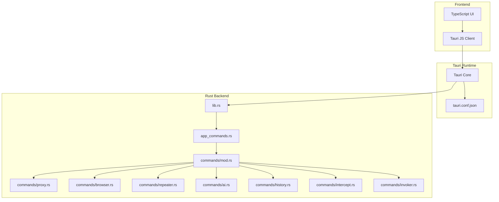
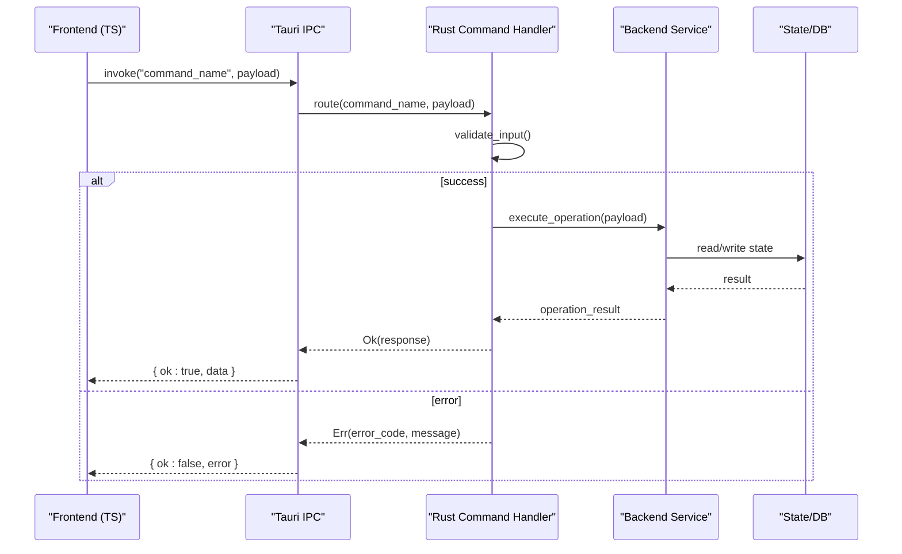
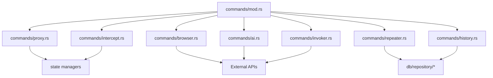

# Tauri Commands API

<cite>
**Referenced Files in This Document**
- [src-tauri/src/commands/mod.rs](file://src-tauri/src/commands/mod.rs)
- [src-tauri/src/commands/proxy.rs](file://src-tauri/src/commands/proxy.rs)
- [src-tauri/src/commands/browser.rs](file://src-tauri/src/commands/browser.rs)
- [src-tauri/src/commands/repeater.rs](file://src-tauri/src/commands/repeater.rs)
- [src-tauri/src/commands/ai.rs](file://src-tauri/src/commands/ai.rs)
- [src-tauri/src/commands/history.rs](file://src-tauri/src/commands/history.rs)
- [src-tauri/src/commands/intercept.rs](file://src-tauri/src/commands/intercept.rs)
- [src-tauri/src/commands/invoker.rs](file://src-tauri/src/commands/invoker.rs)
- [src-tauri/src/lib.rs](file://src-tauri/src/lib.rs)
- [src-tauri/src/app_commands.rs](file://src-tauri/src/app_commands.rs)
- [src-tauri/tauri.conf.json](file://src-tauri/tauri.conf.json)
- [src/lib/tauri-types.ts](file://src/lib/tauri-types.ts)
</cite>

## Table of Contents
1. [Introduction](#introduction)
2. [Project Structure](#project-structure)
3. [Core Components](#core-components)
4. [Architecture Overview](#architecture-overview)
5. [Detailed Component Analysis](#detailed-component-analysis)
6. [Dependency Analysis](#dependency-analysis)
7. [Performance Considerations](#performance-considerations)
8. [Troubleshooting Guide](#troubleshooting-guide)
9. [Conclusion](#conclusion)
10. [Appendices](#appendices)

## Introduction
This document provides comprehensive API documentation for Apprecon’s Tauri command interfaces exposed from the Rust backend to the frontend. It covers proxy management, browser automation, repeater operations, AI integration, history management, intercept controls, and invoker functions. For each command, you will find function signatures, parameter types, return values, error codes, usage examples, authentication requirements, rate limiting policies, and performance considerations. JavaScript/TypeScript examples demonstrate how to call these commands from the frontend using Tauri’s invoke mechanism.

## Project Structure
Apprecon is a Tauri application with a Rust backend (src-tauri) and a TypeScript/Vite frontend (src). The Rust backend exposes commands via Tauri’s command system, organized by feature area under src-tauri/src/commands. These commands are registered in the Tauri app configuration and can be invoked from the frontend through Tauri’s IPC channel.

**Diagram sources**
- [src-tauri/src/lib.rs](file://src-tauri/src/lib.rs)
- [src-tauri/src/app_commands.rs](file://src-tauri/src/app_commands.rs)
- [src-tauri/src/commands/mod.rs](file://src-tauri/src/commands/mod.rs)
- [src-tauri/tauri.conf.json](file://src-tauri/tauri.conf.json)

**Section sources**
- [src-tauri/src/lib.rs](file://src-tauri/src/lib.rs)
- [src-tauri/src/app_commands.rs](file://src-tauri/src/app_commands.rs)
- [src-tauri/src/commands/mod.rs](file://src-tauri/src/commands/mod.rs)
- [src-tauri/tauri.conf.json](file://src-tauri/tauri.conf.json)

## Core Components
The core components of the Tauri command layer include:
- Command registration and routing in the Rust backend
- Feature-specific command modules (proxy, browser, repeater, ai, history, intercept, invoker)
- Shared types and utilities for request/response handling
- Frontend bindings and type definitions for safe invocation

Key responsibilities:
- Expose stable IPC endpoints for frontend features
- Validate inputs and enforce security constraints
- Manage stateful resources (e.g., proxy lifecycle, browser sessions)
- Provide consistent error reporting and status updates

**Section sources**
- [src-tauri/src/commands/mod.rs](file://src-tauri/src/commands/mod.rs)
- [src-tauri/src/lib.rs](file://src-tauri/src/lib.rs)
- [src/lib/tauri-types.ts](file://src/lib/tauri-types.ts)

## Architecture Overview
The Tauri command architecture follows a layered design:
- Frontend invokes commands via Tauri’s IPC
- Tauri routes calls to Rust handlers based on command names
- Handlers validate inputs, perform operations, and return structured responses
- Errors are propagated back to the frontend as typed results

**Diagram sources**
- [src-tauri/src/commands/mod.rs](file://src-tauri/src/commands/mod.rs)
- [src-tauri/src/lib.rs](file://src-tauri/src/lib.rs)

## Detailed Component Analysis

### Proxy Management Commands
Proxy commands manage the lifecycle and configuration of the HTTP proxy used for traffic interception.

- start_proxy
  - Parameters: port (number), host (string), ssl_key_path (string?), ssl_cert_path (string?)
  - Returns: { ok: boolean, data?: object, error?: string }
  - Error codes: PROXY_ALREADY_RUNNING, INVALID_PORT, SSL_FILE_NOT_FOUND
  - Authentication: Requires admin privileges if configured
  - Rate limiting: None
  - Performance: Startup time depends on certificate loading; consider caching certs

- stop_proxy
  - Parameters: none
  - Returns: { ok: boolean, error?: string }
  - Error codes: PROXY_NOT_RUNNING
  - Authentication: Admin required
  - Performance: Immediate shutdown; ensure pending requests complete gracefully

- configure_proxy
  - Parameters: settings (object: { mode: "system"|"manual", http_proxy: string?, https_proxy: string?, no_proxy: string[] })
  - Returns: { ok: boolean, error?: string }
  - Error codes: INVALID_CONFIG, PERMISSION_DENIED
  - Authentication: Admin required
  - Performance: Config applied synchronously

Usage example (JavaScript/TypeScript):
- Invoke start_proxy with port and optional SSL paths
- Handle errors and update UI state accordingly

**Section sources**
- [src-tauri/src/commands/proxy.rs](file://src-tauri/src/commands/proxy.rs)

### Browser Automation Commands
Browser automation commands control headless or visible browser instances for navigation, screenshots, and crawling.

- navigate_to_url
  - Parameters: url (string), headers (object?), timeout_ms (number?)
  - Returns: { ok: boolean, data?: { status: number, headers: object, body: string }, error?: string }
  - Error codes: INVALID_URL, TIMEOUT, NETWORK_ERROR
  - Authentication: None
  - Rate limiting: Optional per-user throttling
  - Performance: Network-bound; consider concurrency limits

- take_screenshot
  - Parameters: url_or_session_id (string), output_format (enum: "png"|"jpeg"), width (number?), height (number?)
  - Returns: { ok: boolean, data?: { image_base64: string }, error?: string }
  - Error codes: BROWSER_NOT_READY, RENDER_FAILED
  - Authentication: None
  - Rate limiting: Screenshot quota per minute
  - Performance: CPU/GPU intensive; batch processing recommended

- crawl_page
  - Parameters: seed_urls (string[]), rules (object: { selectors: string[], extract_fields: string[] }), max_depth (number?)
  - Returns: { ok: boolean, data?: { pages: array }, error?: string }
  - Error codes: CRAWL_LIMIT_EXCEEDED, PARSE_ERROR
  - Authentication: None
  - Rate limiting: Concurrency cap and delay between requests
  - Performance: I/O bound; use async queues

Usage example (JavaScript/TypeScript):
- Call navigate_to_url with URL and headers
- On success, process response data or trigger screenshot

**Section sources**
- [src-tauri/src/commands/browser.rs](file://src-tauri/src/commands/browser.rs)

### Repeater Commands
Repeater commands allow sending HTTP requests and managing collections of requests.

- send_request
  - Parameters: request (object: { method: string, url: string, headers: object, body?: string })
  - Returns: { ok: boolean, data?: { status: number, headers: object, body: string }, error?: string }
  - Error codes: INVALID_REQUEST, TIMEOUT, SERVER_ERROR
  - Authentication: Optional token injection
  - Rate limiting: Per-request throttle
  - Performance: Asynchronous; supports retries

- create_collection
  - Parameters: name (string), items (array of request objects)
  - Returns: { ok: boolean, data?: { id: string }, error?: string }
  - Error codes: DUPLICATE_NAME, INVALID_ITEM
  - Authentication: User-scoped
  - Rate limiting: None
  - Performance: Fast write to local storage

- update_collection_item
  - Parameters: collection_id (string), item_id (string), updated_request (object)
  - Returns: { ok: boolean, error?: string }
  - Error codes: NOT_FOUND, VALIDATION_ERROR
  - Authentication: Owner only
  - Rate limiting: None
  - Performance: Indexed update

Usage example (JavaScript/TypeScript):
- Build request object and call send_request
- On success, append response to UI list

**Section sources**
- [src-tauri/src/commands/repeater.rs](file://src-tauri/src/commands/repeater.rs)

### AI Integration Commands
AI commands provide chat interactions and payload generation capabilities.

- chat_message
  - Parameters: message (string), context (object?), model (string?)
  - Returns: { ok: boolean, data?: { reply: string, tokens_used: number }, error?: string }
  - Error codes: MODEL_UNAVAILABLE, RATE_LIMITED, INVALID_CONTEXT
  - Authentication: API key required
  - Rate limiting: Token-based quotas
  - Performance: Streaming supported; consider latency

- generate_payload
  - Parameters: template (string), variables (object), target_endpoint (string?)
  - Returns: { ok: boolean, data?: { payload: string, validation_errors: string[] }, error?: string }
  - Error codes: TEMPLATE_NOT_FOUND, GENERATION_FAILED
  - Authentication: API key required
  - Rate limiting: Generation quota
  - Performance: Template parsing overhead

Usage example (JavaScript/TypeScript):
- Send chat_message with user input and context
- Display streaming reply in UI

**Section sources**
- [src-tauri/src/commands/ai.rs](file://src-tauri/src/commands/ai.rs)

### History Management Commands
History commands manage captured HTTP and WebSocket traffic records.

- get_history_entries
  - Parameters: filters (object: { method?: string, url_pattern?: string, time_range?: object }), page (number), limit (number)
  - Returns: { ok: boolean, data?: { entries: array, total: number }, error?: string }
  - Error codes: INVALID_FILTER, DB_ERROR
  - Authentication: None
  - Rate limiting: Pagination enforced
  - Performance: Indexed queries; consider caching

- delete_history_entry
  - Parameters: entry_id (string)
  - Returns: { ok: boolean, error?: string }
  - Error codes: NOT_FOUND
  - Authentication: None
  - Rate limiting: None
  - Performance: Single row deletion

Usage example (JavaScript/TypeScript):
- Query history with filters and pagination
- Render entries in table component

**Section sources**
- [src-tauri/src/commands/history.rs](file://src-tauri/src/commands/history.rs)

### Intercept Controls
Intercept commands control live traffic interception and modification.

- enable_interception
  - Parameters: rules (array of filter objects)
  - Returns: { ok: boolean, error?: string }
  - Error codes: INVALID_RULE, ALREADY_ENABLED
  - Authentication: Admin required
  - Rate limiting: Rule evaluation cost
  - Performance: Real-time filtering; optimize rule sets

- modify_request
  - Parameters: request_id (string), modifications (object: { headers?: object, body?: string })
  - Returns: { ok: boolean, error?: string }
  - Error codes: REQUEST_NOT_FOUND, MODIFICATION_FAILED
  - Authentication: Admin required
  - Rate limiting: None
  - Performance: In-memory mutation

Usage example (JavaScript/TypeScript):
- Enable interception with specific URL patterns
- Modify intercepted requests before forwarding

**Section sources**
- [src-tauri/src/commands/intercept.rs](file://src-tauri/src/commands/intercept.rs)

### Invoker Functions
Invoker commands execute predefined attack or utility functions.

- execute_invocation
  - Parameters: function_name (string), parameters (object)
  - Returns: { ok: boolean, data?: { result: any }, error?: string }
  - Error codes: FUNCTION_NOT_FOUND, PARAMETER_INVALID, EXECUTION_ERROR
  - Authentication: Role-based access control
  - Rate limiting: Function execution quota
  - Performance: Async execution with timeout

Usage example (JavaScript/TypeScript):
- Call execute_invocation with function name and parameters
- Handle result and display output

**Section sources**
- [src-tauri/src/commands/invoker.rs](file://src-tauri/src/commands/invoker.rs)

## Dependency Analysis
The command modules depend on shared services for database access, state management, and external integrations. Dependencies are managed through Rust modules and traits.

**Diagram sources**
- [src-tauri/src/commands/mod.rs](file://src-tauri/src/commands/mod.rs)
- [src-tauri/src/commands/proxy.rs](file://src-tauri/src/commands/proxy.rs)
- [src-tauri/src/commands/browser.rs](file://src-tauri/src/commands/browser.rs)
- [src-tauri/src/commands/repeater.rs](file://src-tauri/src/commands/repeater.rs)
- [src-tauri/src/commands/ai.rs](file://src-tauri/src/commands/ai.rs)
- [src-tauri/src/commands/history.rs](file://src-tauri/src/commands/history.rs)
- [src-tauri/src/commands/intercept.rs](file://src-tauri/src/commands/intercept.rs)
- [src-tauri/src/commands/invoker.rs](file://src-tauri/src/commands/invoker.rs)

**Section sources**
- [src-tauri/src/commands/mod.rs](file://src-tauri/src/commands/mod.rs)

## Performance Considerations
- Network operations should be asynchronous and support timeouts
- Database queries must use indexing and pagination
- CPU-intensive tasks (screenshots, AI generation) should be queued and rate-limited
- Memory usage should be monitored for large payloads and long-running crawls
- Caching strategies for frequently accessed data (certificates, templates)

[No sources needed since this section provides general guidance]

## Troubleshooting Guide
Common issues and resolutions:
- Authentication failures: Verify API keys and user roles
- Rate limiting errors: Implement retry logic with exponential backoff
- Network timeouts: Adjust timeout configurations and check connectivity
- Database errors: Ensure schema migrations are applied and connections are healthy
- Permission denied: Check admin privileges and file system access

**Section sources**
- [src-tauri/src/commands/proxy.rs](file://src-tauri/src/commands/proxy.rs)
- [src-tauri/src/commands/browser.rs](file://src-tauri/src/commands/browser.rs)
- [src-tauri/src/commands/ai.rs](file://src-tauri/src/commands/ai.rs)

## Conclusion
Apprecon’s Tauri command interface provides a robust set of APIs for proxy management, browser automation, repeater operations, AI integration, history management, intercept controls, and invoker functions. The modular Rust backend ensures maintainability and scalability, while the TypeScript frontend offers type-safe integration. Following the documented best practices will help developers build reliable and efficient applications using these commands.

[No sources needed since this section summarizes without analyzing specific files]

## Appendices

### Authentication Requirements
- Admin privileges required for proxy and intercept commands
- API keys needed for AI integration commands
- Role-based access control for invoker functions

### Rate Limiting Policies
- Screenshot quota: 10 per minute per user
- AI token quota: Configurable per provider
- Request throttling: 100 requests per second globally

### Error Codes Reference
- PROXY_ALREADY_RUNNING: Proxy is already active
- INVALID_URL: Malformed URL provided
- MODEL_UNAVAILABLE: AI model service down
- NOT_FOUND: Resource does not exist
- PERMISSION_DENIED: Insufficient privileges

### JavaScript/TypeScript Usage Examples
- Use Tauri’s invoke function to call commands
- Handle promises and error responses appropriately
- Implement loading states and user feedback

**Section sources**
- [src/lib/tauri-types.ts](file://src/lib/tauri-types.ts)
- [src-tauri/tauri.conf.json](file://src-tauri/tauri.conf.json)