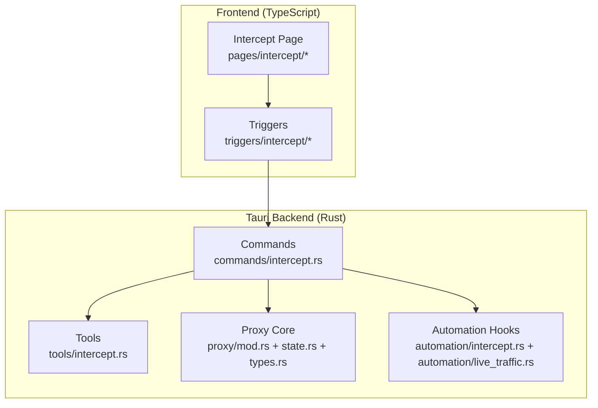
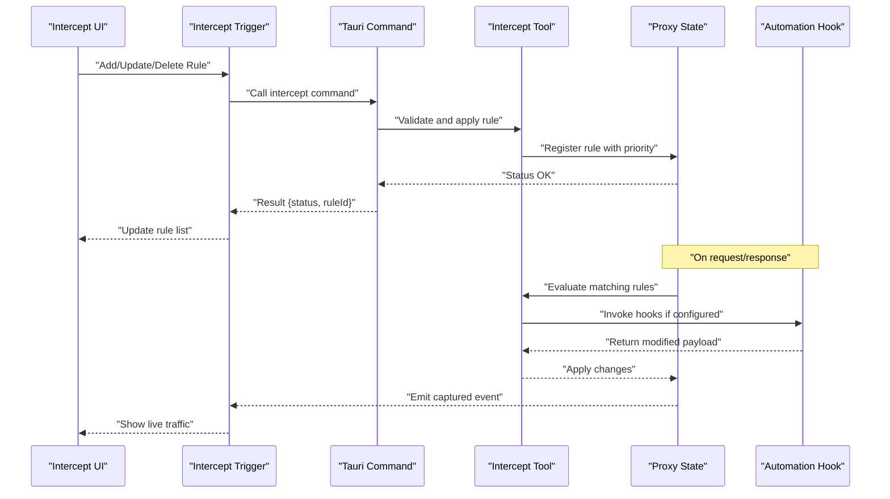
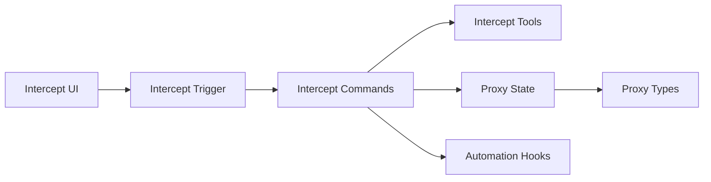

# Traffic Interception Commands

<cite>
**Referenced Files in This Document**
- [intercept.rs](file://src-tauri/src/commands/intercept.rs)
- [intercept.rs](file://src-tauri/src/tools/intercept.rs)
- [index.ts](file://src/triggers/intercept/index.ts)
- [lifecycle.ts](file://src/triggers/intercept/lifecycle.ts)
- [forwarding.ts](file://src/triggers/intercept/forwarding.ts)
- [types.ts](file://src/pages/intercept/types.ts)
- [api.ts](file://src/pages/intercept/api.ts)
- [lib.ts](file://src/pages/intercept/lib.ts)
- [mod.rs](file://src-tauri/src/proxy/mod.rs)
- [state.rs](file://src-tauri/src/proxy/state.rs)
- [types.rs](file://src-tauri/src/proxy/types.rs)
- [automation_intercept.rs](file://src-tauri/src/automation/intercept.rs)
- [automation_live_traffic.rs](file://src-tauri/src/automation/live_traffic.rs)
</cite>

## Table of Contents
1. [Introduction](#introduction)
2. [Project Structure](#project-structure)
3. [Core Components](#core-components)
4. [Architecture Overview](#architecture-overview)
5. [Detailed Component Analysis](#detailed-component-analysis)
6. [Dependency Analysis](#dependency-analysis)
7. [Performance Considerations](#performance-considerations)
8. [Troubleshooting Guide](#troubleshooting-guide)
9. [Conclusion](#conclusion)
10. [Appendices](#appendices)

## Introduction
This document provides API documentation for Apprecon’s traffic interception Tauri commands. It covers rule management, request/response modification, and real-time traffic monitoring. You will find function signatures with parameter types, return values, event callbacks, rule priority handling, performance considerations, and debugging capabilities. JavaScript/TypeScript examples illustrate custom interception logic and traffic manipulation workflows.

## Project Structure
The interception feature spans the Rust backend (Tauri commands and proxy integration), TypeScript triggers that expose commands to the UI, and frontend pages/stores that manage rules and display live traffic.

**Diagram sources**
- [intercept.rs](file://src-tauri/src/commands/intercept.rs)
- [intercept.rs](file://src-tauri/src/tools/intercept.rs)
- [index.ts](file://src/triggers/intercept/index.ts)
- [mod.rs](file://src-tauri/src/proxy/mod.rs)
- [state.rs](file://src-tauri/src/proxy/state.rs)
- [types.rs](file://src-tauri/src/proxy/types.rs)
- [automation_intercept.rs](file://src-tauri/src/automation/intercept.rs)
- [automation_live_traffic.rs](file://src-tauri/src/automation/live_traffic.rs)

**Section sources**
- [intercept.rs](file://src-tauri/src/commands/intercept.rs)
- [intercept.rs](file://src-tauri/src/tools/intercept.rs)
- [index.ts](file://src/triggers/intercept/index.ts)
- [mod.rs](file://src-tauri/src/proxy/mod.rs)
- [state.rs](file://src-tauri/src/proxy/state.rs)
- [types.rs](file://src-tauri/src/proxy/types.rs)
- [automation_intercept.rs](file://src-tauri/src/automation/intercept.rs)
- [automation_live_traffic.rs](file://src-tauri/src/automation/live_traffic.rs)

## Core Components
- Intercept Commands (Rust): Expose Tauri commands for managing interception rules, modifying requests/responses, and controlling capture lifecycle.
- Intercept Tools (Rust): Implement core interception logic and helpers used by commands.
- Proxy Integration (Rust): Manages proxy state, rule evaluation, and hook execution during request/response processing.
- Frontend Triggers (TypeScript): Bridge between UI actions and Tauri commands; handle events and UI updates.
- Automation Hooks (Rust): Provide extensibility points for automated interception workflows and live traffic events.

Key responsibilities:
- Rule CRUD and priority ordering
- Request/response mutation via scripts or patterns
- Real-time event streaming for captured traffic
- Safe execution context for user-defined logic

**Section sources**
- [intercept.rs](file://src-tauri/src/commands/intercept.rs)
- [intercept.rs](file://src-tauri/src/tools/intercept.rs)
- [index.ts](file://src/triggers/intercept/index.ts)
- [mod.rs](file://src-tauri/src/proxy/mod.rs)
- [state.rs](file://src-tauri/src/proxy/state.rs)
- [types.rs](file://src-tauri/src/proxy/types.rs)
- [automation_intercept.rs](file://src-tauri/src/automation/intercept.rs)
- [automation_live_traffic.rs](file://src-tauri/src/automation/live_traffic.rs)

## Architecture Overview
The interception pipeline integrates a proxy layer with rule evaluation and optional script-based modifications. Events are emitted to the frontend for live monitoring and further manipulation.

**Diagram sources**
- [intercept.rs](file://src-tauri/src/commands/intercept.rs)
- [intercept.rs](file://src-tauri/src/tools/intercept.rs)
- [index.ts](file://src/triggers/intercept/index.ts)
- [mod.rs](file://src-tauri/src/proxy/mod.rs)
- [state.rs](file://src-tauri/src/proxy/state.rs)
- [automation_intercept.rs](file://src-tauri/src/automation/intercept.rs)

## Detailed Component Analysis

### Intercept Commands API
- Purpose: Manage interception rules, execute modifications, and control capture lifecycle.
- Typical operations:
  - Add/update/delete rules with filter patterns and priorities
  - Apply request/response modifications using scripts or predefined transformations
  - Start/stop/pause interception and configure filters
- Parameters:
  - Rules: structured objects containing match criteria (URL patterns, headers, methods), action type, and priority
  - Modification scripts: code snippets executed in a sandboxed context with access to request/response fields
  - Filters: regex or string patterns for selective capture
- Return values:
  - Status codes indicating success/failure
  - Rule identifiers for subsequent updates/deletes
  - Captured payloads when requested
- Event callbacks:
  - Live traffic events emitted on matched requests/responses
  - Hook completion events after script execution

Example workflow (TypeScript):
- Subscribe to interception events
- Add a rule with a URL pattern and header filter
- Attach a modification script to alter headers or body
- Observe live traffic and verify changes

**Section sources**
- [intercept.rs](file://src-tauri/src/commands/intercept.rs)
- [index.ts](file://src/triggers/intercept/index.ts)
- [types.ts](file://src/pages/intercept/types.ts)
- [api.ts](file://src/pages/intercept/api.ts)

### Intercept Tools and Rule Engine
- Purpose: Implement rule matching, priority resolution, and safe execution of modification scripts.
- Key behaviors:
  - Evaluate rules in priority order; first match wins unless configured otherwise
  - Validate and sanitize inputs before applying modifications
  - Provide context objects to scripts for reading/writing request/response data
- Performance:
  - Efficient pattern matching using compiled regex where applicable
  - Avoid blocking operations in hot paths; offload heavy work to background tasks

**Section sources**
- [intercept.rs](file://src-tauri/src/tools/intercept.rs)
- [state.rs](file://src-tauri/src/proxy/state.rs)
- [types.rs](file://src-tauri/src/proxy/types.rs)

### Proxy Integration and Lifecycle
- Purpose: Integrate interception into the HTTP/WebSocket proxy pipeline.
- Responsibilities:
  - Maintain active rules and their states
  - Invoke tools during request/response phases
  - Emit events for captured traffic and errors
- Lifecycle controls:
  - Start/stop/pause interception globally or per target
  - Configure logging and verbosity levels

**Section sources**
- [mod.rs](file://src-tauri/src/proxy/mod.rs)
- [state.rs](file://src-tauri/src/proxy/state.rs)
- [types.rs](file://src-tauri/src/proxy/types.rs)

### Frontend Triggers and UI Integration
- Purpose: Expose Tauri commands to the UI and handle events for live monitoring.
- Features:
  - Bind UI actions to intercept commands
  - Render live traffic tables and detail views
  - Manage rule editor and script playground

**Section sources**
- [index.ts](file://src/triggers/intercept/index.ts)
- [lifecycle.ts](file://src/triggers/intercept/lifecycle.ts)
- [forwarding.ts](file://src/triggers/intercept/forwarding.ts)
- [types.ts](file://src/pages/intercept/types.ts)
- [api.ts](file://src/pages/intercept/api.ts)
- [lib.ts](file://src/pages/intercept/lib.ts)

### Automation Hooks and Live Traffic Events
- Purpose: Enable programmatic interception workflows and real-time event streaming.
- Capabilities:
  - Register hooks to run before/after request/response processing
  - Stream captured events to subscribers (e.g., dashboards, bots)
  - Support conditional logic based on traffic attributes

**Section sources**
- [automation_intercept.rs](file://src-tauri/src/automation/intercept.rs)
- [automation_live_traffic.rs](file://src-tauri/src/automation/live_traffic.rs)

## Dependency Analysis
Intercept commands depend on tools, proxy state, and automation hooks. The frontend triggers depend on Tauri commands and event channels.

**Diagram sources**
- [intercept.rs](file://src-tauri/src/commands/intercept.rs)
- [intercept.rs](file://src-tauri/src/tools/intercept.rs)
- [index.ts](file://src/triggers/intercept/index.ts)
- [state.rs](file://src-tauri/src/proxy/state.rs)
- [types.rs](file://src-tauri/src/proxy/types.rs)
- [automation_intercept.rs](file://src-tauri/src/automation/intercept.rs)

**Section sources**
- [intercept.rs](file://src-tauri/src/commands/intercept.rs)
- [intercept.rs](file://src-tauri/src/tools/intercept.rs)
- [index.ts](file://src/triggers/intercept/index.ts)
- [state.rs](file://src-tauri/src/proxy/state.rs)
- [types.rs](file://src-tauri/src/proxy/types.rs)
- [automation_intercept.rs](file://src-tauri/src/automation/intercept.rs)

## Performance Considerations
- Rule evaluation:
  - Use specific patterns to minimize false positives
  - Prefer exact matches over broad regexes where possible
- Script execution:
  - Keep modification scripts lightweight; avoid synchronous I/O
  - Cache expensive computations within the script context
- Event streaming:
  - Throttle high-frequency events for UI rendering
  - Filter at the source to reduce payload size
- Memory usage:
  - Limit captured body sizes; stream large payloads when feasible
  - Clear temporary buffers after processing

[No sources needed since this section provides general guidance]

## Troubleshooting Guide
Common issues and resolutions:
- Rule not matching:
  - Verify URL patterns, headers, and method filters
  - Check rule priority and ensure no higher-priority rule short-circuits
- Script errors:
  - Inspect error logs from the tool layer
  - Validate input shapes passed to scripts
- Missing events:
  - Confirm interception is started and filters are active
  - Ensure event subscriptions are established before traffic starts
- Performance degradation:
  - Reduce number of active rules
  - Optimize regex patterns and script logic

Debugging tips:
- Enable verbose logging in proxy state
- Use targeted filters to isolate problematic traffic
- Temporarily disable non-essential rules to identify bottlenecks

**Section sources**
- [state.rs](file://src-tauri/src/proxy/state.rs)
- [intercept.rs](file://src-tauri/src/tools/intercept.rs)
- [index.ts](file://src/triggers/intercept/index.ts)

## Conclusion
Apprecon’s traffic interception system provides robust rule management, flexible modification capabilities, and real-time monitoring through Tauri commands. By following best practices for rule design, script optimization, and event handling, you can build powerful interception workflows tailored to your testing and analysis needs.

[No sources needed since this section summarizes without analyzing specific files]

## Appendices

### Example Workflows (JavaScript/TypeScript)
- Adding a rule:
  - Define a rule object with URL pattern, headers, and priority
  - Call the add-rule command and handle the returned status
- Modifying a request:
  - Attach a script that reads headers/body and returns modifications
  - Ensure the script handles edge cases like missing fields
- Monitoring live traffic:
  - Subscribe to interception events
  - Render captured requests/responses in a table with filtering and search

[No sources needed since this section provides conceptual examples]