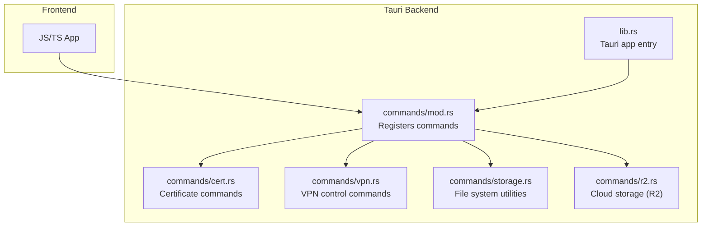
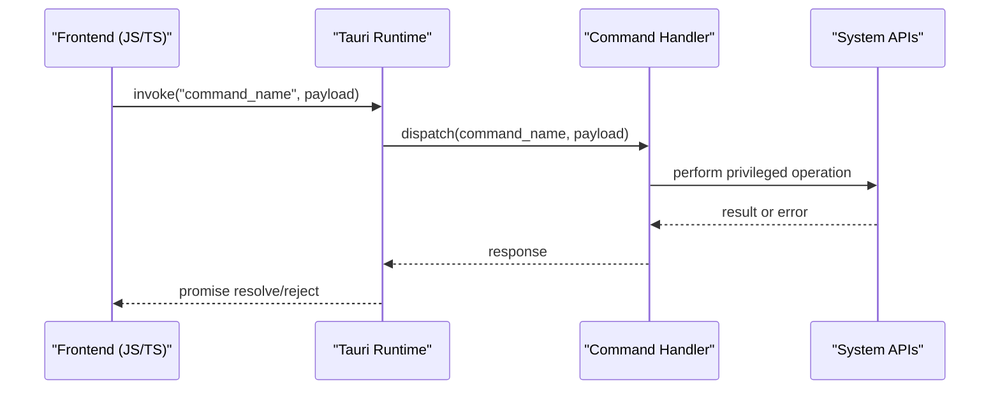
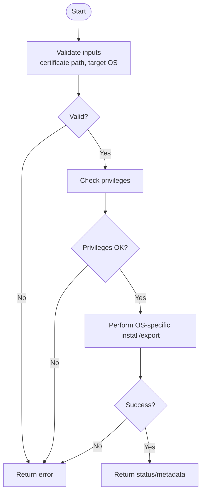
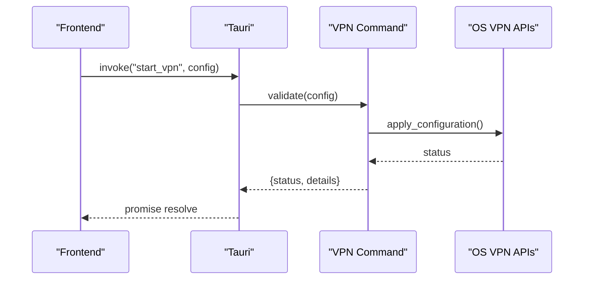
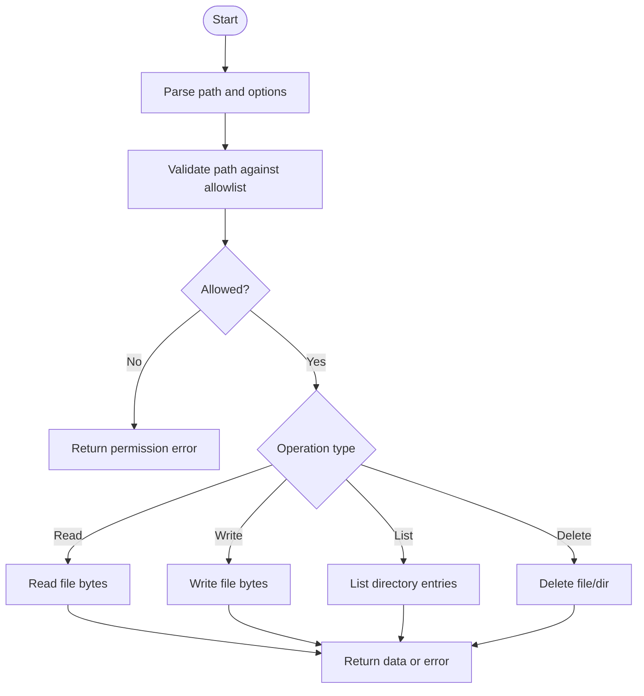
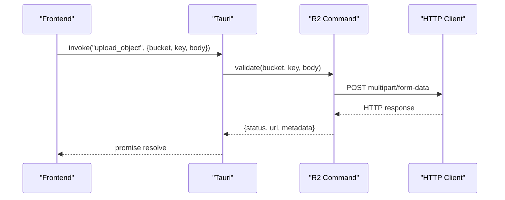
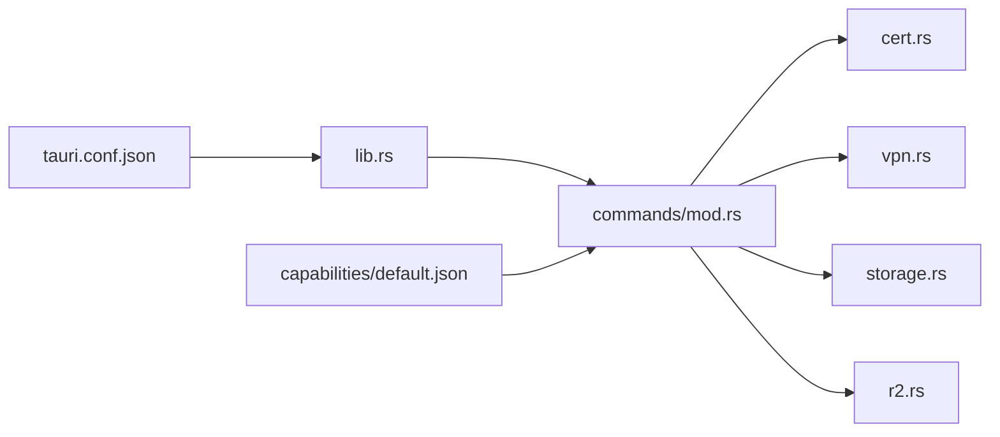

# Utility & System Commands

<cite>
**Referenced Files in This Document**
- [src-tauri/src/commands/mod.rs](file://src-tauri/src/commands/mod.rs)
- [src-tauri/src/commands/cert.rs](file://src-tauri/src/commands/cert.rs)
- [src-tauri/src/commands/vpn.rs](file://src-tauri/src/commands/vpn.rs)
- [src-tauri/src/commands/storage.rs](file://src-tauri/src/commands/storage.rs)
- [src-tauri/src/commands/r2.rs](file://src-tauri/src/commands/r2.rs)
- [src-tauri/src/lib.rs](file://src-tauri/src/lib.rs)
- [src-tauri/tauri.conf.json](file://src-tauri/tauri.conf.json)
- [src-tauri/capabilities/default.json](file://src-tauri/capabilities/default.json)
- [scripts/install.sh](file://scripts/install.sh)
- [scripts/setup-linux-deps.sh](file://scripts/setup-linux-deps.sh)
</cite>

## Table of Contents
1. [Introduction](#introduction)
2. [Project Structure](#project-structure)
3. [Core Components](#core-components)
4. [Architecture Overview](#architecture-overview)
5. [Detailed Component Analysis](#detailed-component-analysis)
6. [Dependency Analysis](#dependency-analysis)
7. [Performance Considerations](#performance-considerations)
8. [Troubleshooting Guide](#troubleshooting-guide)
9. [Conclusion](#conclusion)
10. [Appendices](#appendices)

## Introduction
This document provides API documentation for Apprecon’s utility and system Tauri commands. It focuses on system-level functions exposed to the frontend via Tauri, including certificate management, VPN controls, cloud storage operations (R2), and file system utilities. For each command, we specify parameters, return values, error handling, security considerations, permission requirements, and cross-platform compatibility notes. JavaScript/TypeScript integration examples are included to demonstrate how to call these commands from the frontend.

## Project Structure
Apprecon exposes system capabilities through Rust-based Tauri commands organized under src-tauri/src/commands. The main Tauri configuration and capability definitions govern permissions and platform behavior. Frontend code invokes commands using Tauri’s JS/TS client.

**Diagram sources**
- [src-tauri/src/commands/mod.rs](file://src-tauri/src/commands/mod.rs)
- [src-tauri/src/commands/cert.rs](file://src-tauri/src/commands/cert.rs)
- [src-tauri/src/commands/vpn.rs](file://src-tauri/src/commands/vpn.rs)
- [src-tauri/src/commands/storage.rs](file://src-tauri/src/commands/storage.rs)
- [src-tauri/src/commands/r2.rs](file://src-tauri/src/commands/r2.rs)
- [src-tauri/src/lib.rs](file://src-tauri/src/lib.rs)

**Section sources**
- [src-tauri/src/commands/mod.rs](file://src-tauri/src/commands/mod.rs)
- [src-tauri/src/lib.rs](file://src-tauri/src/lib.rs)
- [src-tauri/tauri.conf.json](file://src-tauri/tauri.conf.json)
- [src-tauri/capabilities/default.json](file://src-tauri/capabilities/default.json)

## Core Components
The following components implement the core system commands:

- Certificate Management (cert.rs): Install, export, and manage CA certificates used by the proxy.
- VPN Controls (vpn.rs): Start, stop, configure, and query VPN state.
- Storage Utilities (storage.rs): File system operations such as reading/writing files and directories.
- Cloud Storage (r2.rs): Interact with R2-compatible object storage for uploads/downloads and metadata.

These modules are registered with Tauri and invoked from the frontend via typed commands.

**Section sources**
- [src-tauri/src/commands/cert.rs](file://src-tauri/src/commands/cert.rs)
- [src-tauri/src/commands/vpn.rs](file://src-tauri/src/commands/vpn.rs)
- [src-tauri/src/commands/storage.rs](file://src-tauri/src/commands/storage.rs)
- [src-tauri/src/commands/r2.rs](file://src-tauri/src/commands/r2.rs)

## Architecture Overview
The Tauri architecture separates the UI (frontend) from privileged operations (backend). Commands are defined in Rust and exposed to JS/TS. Permissions are enforced via Tauri capabilities and OS-level privileges.

**Diagram sources**
- [src-tauri/src/lib.rs](file://src-tauri/src/lib.rs)
- [src-tauri/src/commands/mod.rs](file://src-tauri/src/commands/mod.rs)

## Detailed Component Analysis

### Certificate Management Commands
Purpose: Manage CA certificates required for HTTPS interception and trust.

Typical operations include installing a CA certificate, exporting it, and verifying its presence. Parameters typically involve paths to certificate files and target platforms. Return values indicate success/failure and may include metadata like fingerprint or installation status. Error handling covers invalid paths, insufficient permissions, and platform-specific failures.

Security considerations:
- Require elevated privileges on Windows/macOS for system-wide trust store modifications.
- Validate all input paths and file formats before operating.
- Avoid logging sensitive content; log only operation outcomes.

Cross-platform notes:
- Windows: Use certutil or Windows Trust Store APIs.
- macOS: Use security CLI or Keychain APIs.
- Linux: Use update-ca-certificates or distribution-specific tools.

JavaScript/TypeScript example:
- Call a function to install a CA certificate at a given path.
- Handle errors such as permission denied or invalid certificate format.

**Section sources**
- [src-tauri/src/commands/cert.rs](file://src-tauri/src/commands/cert.rs)

#### Certificate Command Flow

**Diagram sources**
- [src-tauri/src/commands/cert.rs](file://src-tauri/src/commands/cert.rs)

### VPN Control Commands
Purpose: Control VPN lifecycle and configuration.

Typical operations include starting/stopping VPN, applying configurations, and querying connection details. Parameters include configuration objects (e.g., server address, protocol, credentials) and flags. Return values include connection status, IP addresses, and error messages. Error handling covers invalid configs, network unavailability, and permission issues.

Security considerations:
- Sanitize configuration inputs to prevent injection.
- Restrict access to sensitive fields (credentials) and avoid logging them.
- Ensure secure transport for any remote configuration retrieval.

Cross-platform notes:
- Windows: Use Wintun or built-in VPN APIs.
- macOS: Use NetworkExtension framework.
- Linux: Use NetworkManager or systemd-networkd.

JavaScript/TypeScript example:
- Invoke start_vpn with a configuration object.
- Monitor status updates and handle errors gracefully.

**Section sources**
- [src-tauri/src/commands/vpn.rs](file://src-tauri/src/commands/vpn.rs)

#### VPN Control Sequence

**Diagram sources**
- [src-tauri/src/commands/vpn.rs](file://src-tauri/src/commands/vpn.rs)

### Storage Utilities Commands
Purpose: Provide file system operations for reading, writing, listing, and managing files/directories.

Typical operations include read_file, write_file, list_dir, delete_file, and get_metadata. Parameters include file paths, buffers/strings, and options. Return values include file contents, directory listings, and metadata (size, timestamps). Error handling covers I/O errors, permission denials, and invalid paths.

Security considerations:
- Enforce path validation and chroot-like restrictions where possible.
- Limit operations to allowed directories.
- Avoid exposing internal paths to the frontend.

Cross-platform notes:
- Normalize paths for Windows vs POSIX.
- Respect platform-specific permissions and ACLs.

JavaScript/TypeScript example:
- Read a file safely within an allowed directory.
- Write configuration files with proper encoding.

**Section sources**
- [src-tauri/src/commands/storage.rs](file://src-tauri/src/commands/storage.rs)

#### Storage Operation Flow

**Diagram sources**
- [src-tauri/src/commands/storage.rs](file://src-tauri/src/commands/storage.rs)

### Cloud Storage (R2) Commands
Purpose: Interact with R2-compatible object storage for uploading, downloading, and listing objects.

Typical operations include upload_object, download_object, list_objects, and get_object_metadata. Parameters include bucket name, object key, body/data, and optional headers. Return values include operation status, URLs, and metadata. Error handling covers network errors, authentication failures, and invalid requests.

Security considerations:
- Use secure credentials and avoid hardcoding secrets.
- Validate bucket names and object keys.
- Implement retry logic with exponential backoff for transient errors.

Cross-platform notes:
- Leverage standard HTTP clients compatible across platforms.
- Handle TLS correctly and respect proxy settings if applicable.

JavaScript/TypeScript example:
- Upload a file to a specified bucket and key.
- Download and display object content securely.

**Section sources**
- [src-tauri/src/commands/r2.rs](file://src-tauri/src/commands/r2.rs)

#### R2 Upload Sequence

**Diagram sources**
- [src-tauri/src/commands/r2.rs](file://src-tauri/src/commands/r2.rs)

## Dependency Analysis
Commands depend on Tauri runtime, OS-specific libraries, and external services (network). Capability definitions restrict which commands are available in production builds.

**Diagram sources**
- [src-tauri/src/commands/mod.rs](file://src-tauri/src/commands/mod.rs)
- [src-tauri/src/lib.rs](file://src-tauri/src/lib.rs)
- [src-tauri/capabilities/default.json](file://src-tauri/capabilities/default.json)
- [src-tauri/tauri.conf.json](file://src-tauri/tauri.conf.json)

**Section sources**
- [src-tauri/src/commands/mod.rs](file://src-tauri/src/commands/mod.rs)
- [src-tauri/src/lib.rs](file://src-tauri/src/lib.rs)
- [src-tauri/capabilities/default.json](file://src-tauri/capabilities/default.json)
- [src-tauri/tauri.conf.json](file://src-tauri/tauri.conf.json)

## Performance Considerations
- Batch operations where possible to reduce IPC overhead.
- Stream large files instead of loading entirely into memory.
- Use asynchronous calls and avoid blocking the event loop.
- Cache frequently accessed metadata (e.g., directory listings) when appropriate.
- Implement retries with backoff for network-bound operations.

[No sources needed since this section provides general guidance]

## Troubleshooting Guide
Common issues and resolutions:
- Permission Denied: Ensure the app has necessary OS privileges (admin/root). Verify capability definitions allow the command.
- Invalid Path: Confirm paths exist and are within allowed directories. Normalize paths per platform conventions.
- Network Errors: Check connectivity, proxies, and TLS settings. Inspect error messages for timeouts or auth failures.
- VPN State Mismatch: Re-query status and reapply configuration if inconsistent.

Platform-specific checks:
- Windows: Run as administrator for certificate and VPN changes.
- macOS: Grant Full Disk Access if required; check Keychain for certificates.
- Linux: Use sudo for system-wide changes; verify NetworkManager availability.

**Section sources**
- [src-tauri/capabilities/default.json](file://src-tauri/capabilities/default.json)
- [src-tauri/tauri.conf.json](file://src-tauri/tauri.conf.json)
- [scripts/install.sh](file://scripts/install.sh)
- [scripts/setup-linux-deps.sh](file://scripts/setup-linux-deps.sh)

## Conclusion
Apprecon’s Tauri commands provide robust system-level functionality for certificate management, VPN control, file system utilities, and cloud storage operations. By adhering to security best practices, validating inputs, and respecting platform constraints, developers can integrate these commands safely and efficiently in cross-platform applications.

[No sources needed since this section summarizes without analyzing specific files]

## Appendices

### JavaScript/TypeScript Integration Examples
- Certificate Installation:
  - Import Tauri invoke.
  - Call the certificate command with a valid certificate path.
  - Handle success and error responses.

- VPN Configuration:
  - Build a configuration object with required fields.
  - Invoke start_vpn and monitor status updates.
  - Catch and display errors to the user.

- File Operations:
  - Use read_file and write_file within allowed directories.
  - List directory contents and render in UI.
  - Delete files with confirmation prompts.

- R2 Operations:
  - Upload files using multipart form data.
  - Download and preview objects securely.
  - Handle rate limits and retries.

[No sources needed since this section provides general guidance]