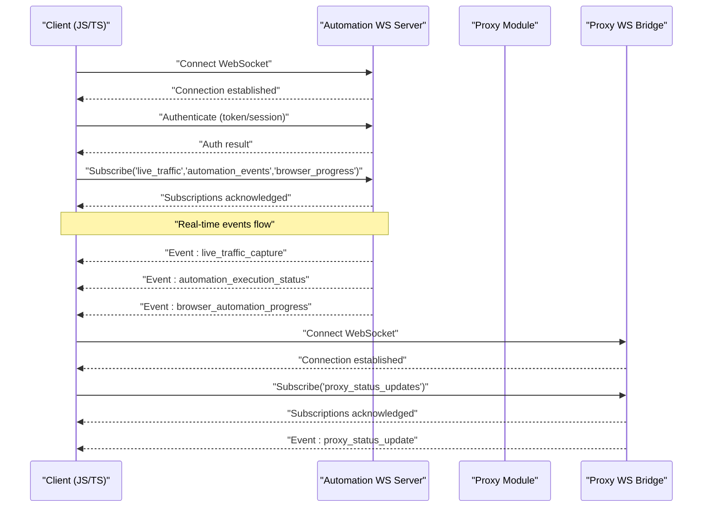
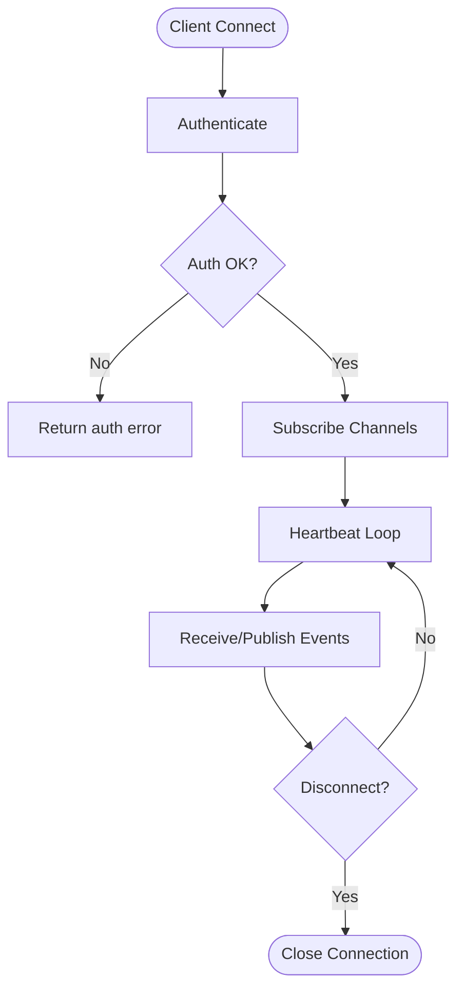
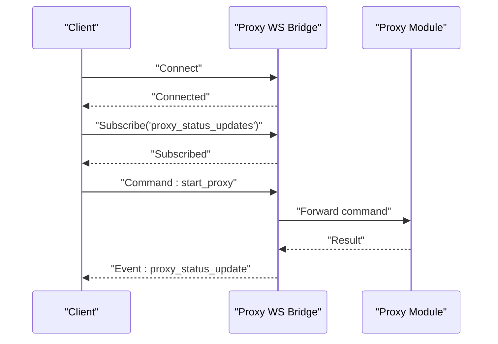
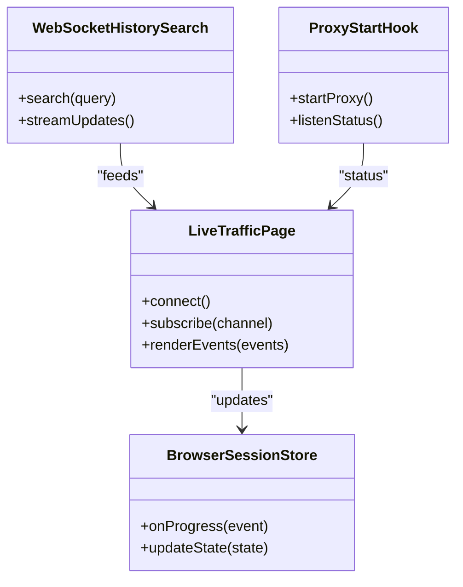
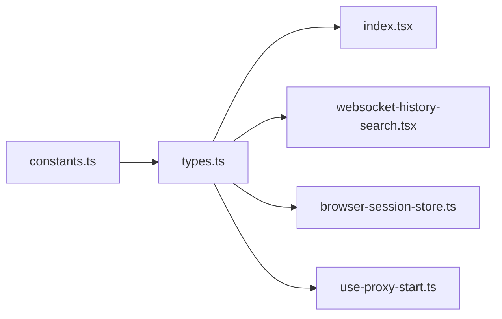

# WebSocket APIs

<cite>
**Referenced Files in This Document**
- [websocket.rs](file://src-tauri/src/automation/websocket.rs)
- [mod.rs](file://src-tauri/src/proxy/mod.rs)
- [websocket.rs](file://src-tauri/src/proxy/websocket.rs)
- [index.tsx](file://src/pages/live-traffic/index.tsx)
- [websocket-history-search.tsx](file://src/layout/global-search/websocket-history-search.tsx)
- [browser-session-store.ts](file://src/stores/browser-session-store.ts)
- [use-proxy-start.ts](file://src/hooks/use-proxy-start.ts)
- [constants.ts](file://src/pages/live-traffic/constants.ts)
- [types.ts](file://src/pages/live-traffic/types.ts)
</cite>

## Table of Contents
1. [Introduction](#introduction)
2. [Project Structure](#project-structure)
3. [Core Components](#core-components)
4. [Architecture Overview](#architecture-overview)
5. [Detailed Component Analysis](#detailed-component-analysis)
6. [Dependency Analysis](#dependency-analysis)
7. [Performance Considerations](#performance-considerations)
8. [Troubleshooting Guide](#troubleshooting-guide)
9. [Conclusion](#conclusion)
10. [Appendices](#appendices)

## Introduction
This document specifies the WebSocket API used by Apprecon for real-time communication between the frontend and backend services. It covers connection establishment, authentication, message formats, event types, and lifecycle management. It also documents live traffic monitoring, automation execution events, proxy status updates, and browser automation progress, along with request/response patterns, error handling strategies, reconnection logic, and performance optimization techniques. Client implementation examples are provided in JavaScript/TypeScript to demonstrate connection setup, event subscription, message sending, and error recovery.

## Project Structure
Apprecon’s WebSocket functionality spans both the Rust backend (Tauri) and the TypeScript frontend:
- Backend WebSocket server and handlers are implemented under src-tauri/src/automation and src-tauri/src/proxy.
- Frontend consumers include pages and hooks that connect to the WebSocket, subscribe to events, and render live data.

```mermaid
graph TB
subgraph "Frontend"
UI["Live Traffic UI<br/>pages/live-traffic/index.tsx"]
Search["WebSocket History Search<br/>layout/global-search/websocket-history-search.tsx"]
Store["Browser Session Store<br/>stores/browser-session-store.ts"]
Hook["Proxy Start Hook<br/>hooks/use-proxy-start.ts"]
end
subgraph "Backend (Tauri)"
WS_Automation["Automation WS Server<br/>src-tauri/src/automation/websocket.rs"]
ProxyMod["Proxy Module<br/>src-tauri/src/proxy/mod.rs"]
WS_Proxy["Proxy WS Bridge<br/>src-tauri/src/proxy/websocket.rs"]
end
UI --> WS_Automation
Search --> WS_Automation
Store --> WS_Automation
Hook --> WS_Proxy
WS_Automation < --> ProxyMod
ProxyMod < --> WS_Proxy
```

**Diagram sources**
- [index.tsx](file://src/pages/live-traffic/index.tsx)
- [websocket-history-search.tsx](file://src/layout/global-search/websocket-history-search.tsx)
- [browser-session-store.ts](file://src/stores/browser-session-store.ts)
- [use-proxy-start.ts](file://src/hooks/use-proxy-start.ts)
- [websocket.rs](file://src-tauri/src/automation/websocket.rs)
- [mod.rs](file://src-tauri/src/proxy/mod.rs)
- [websocket.rs](file://src-tauri/src/proxy/websocket.rs)

**Section sources**
- [index.tsx](file://src/pages/live-traffic/index.tsx)
- [websocket-history-search.tsx](file://src/layout/global-search/websocket-history-search.tsx)
- [browser-session-store.ts](file://src/stores/browser-session-store.ts)
- [use-proxy-start.ts](file://src/hooks/use-proxy-start.ts)
- [websocket.rs](file://src-tauri/src/automation/websocket.rs)
- [mod.rs](file://src-tauri/src/proxy/mod.rs)
- [websocket.rs](file://src-tauri/src/proxy/websocket.rs)

## Core Components
- Automation WebSocket Server: Manages connections and broadcasts automation-related events such as live traffic captures, automation execution progress, and browser automation state changes.
- Proxy WebSocket Bridge: Bridges proxy lifecycle and status updates to clients, enabling real-time proxy control and monitoring.
- Frontend Consumers: Live traffic page, global search for WebSocket history, browser session store, and proxy start hook integrate with the WebSocket endpoints to display and interact with real-time data.

Key responsibilities:
- Connection lifecycle: handshake, authentication, subscription, heartbeat, disconnect.
- Event routing: publish/subscribe model for typed events.
- Error propagation: structured error messages with codes and context.
- Performance: batching, throttling, backpressure, and efficient serialization.

**Section sources**
- [websocket.rs](file://src-tauri/src/automation/websocket.rs)
- [mod.rs](file://src-tauri/src/proxy/mod.rs)
- [websocket.rs](file://src-tauri/src/proxy/websocket.rs)
- [index.tsx](file://src/pages/live-traffic/index.tsx)
- [websocket-history-search.tsx](file://src/layout/global-search/websocket-history-search.tsx)
- [browser-session-store.ts](file://src/stores/browser-session-store.ts)
- [use-proxy-start.ts](file://src/hooks/use-proxy-start.ts)

## Architecture Overview
The WebSocket architecture follows a clear separation between the automation event bus and the proxy bridge, with the frontend subscribing to relevant channels.



**Diagram sources**
- [websocket.rs](file://src-tauri/src/automation/websocket.rs)
- [mod.rs](file://src-tauri/src/proxy/mod.rs)
- [websocket.rs](file://src-tauri/src/proxy/websocket.rs)
- [index.tsx](file://src/pages/live-traffic/index.tsx)
- [websocket-history-search.tsx](file://src/layout/global-search/websocket-history-search.tsx)
- [browser-session-store.ts](file://src/stores/browser-session-store.ts)
- [use-proxy-start.ts](file://src/hooks/use-proxy-start.ts)

## Detailed Component Analysis

### Automation WebSocket Server
Responsibilities:
- Accepts client connections and performs authentication.
- Maintains subscriptions per client for event channels.
- Publishes events from automation subsystems (live traffic, automation execution, browser automation).
- Handles heartbeats and graceful disconnects.

Message schema overview:
- Authentication request/response: includes token or session identifier; response indicates success or failure with error code.
- Subscription request/response: channel names and acknowledgment.
- Events: typed payloads with metadata (timestamp, correlation IDs).
- Errors: structured error objects with code, message, and optional details.



**Diagram sources**
- [websocket.rs](file://src-tauri/src/automation/websocket.rs)

**Section sources**
- [websocket.rs](file://src-tauri/src/automation/websocket.rs)

### Proxy WebSocket Bridge
Responsibilities:
- Bridges proxy lifecycle events to clients.
- Provides real-time proxy status updates.
- Supports commands to start/stop proxy and query current state.

Message schema overview:
- Status update events: include proxy state, port, errors, and logs.
- Commands: start/stop proxy, set configuration, retrieve status.
- Responses: acknowledge command execution and return results or errors.



**Diagram sources**
- [websocket.rs](file://src-tauri/src/proxy/websocket.rs)
- [mod.rs](file://src-tauri/src/proxy/mod.rs)

**Section sources**
- [websocket.rs](file://src-tauri/src/proxy/websocket.rs)
- [mod.rs](file://src-tauri/src/proxy/mod.rs)

### Frontend Integration Points
- Live Traffic Page: Connects to Automation WS, subscribes to live traffic events, renders captured requests/responses in real time.
- WebSocket History Search: Queries stored WebSocket history and integrates with live events for continuity.
- Browser Session Store: Manages browser automation state and progress via Automation WS events.
- Proxy Start Hook: Initiates proxy operations and listens for proxy status updates through Proxy WS.



**Diagram sources**
- [index.tsx](file://src/pages/live-traffic/index.tsx)
- [websocket-history-search.tsx](file://src/layout/global-search/websocket-history-search.tsx)
- [browser-session-store.ts](file://src/stores/browser-session-store.ts)
- [use-proxy-start.ts](file://src/hooks/use-proxy-start.ts)

**Section sources**
- [index.tsx](file://src/pages/live-traffic/index.tsx)
- [websocket-history-search.tsx](file://src/layout/global-search/websocket-history-search.tsx)
- [browser-session-store.ts](file://src/stores/browser-session-store.ts)
- [use-proxy-start.ts](file://src/hooks/use-proxy-start.ts)

## Dependency Analysis
The WebSocket components depend on shared constants and types to ensure consistent message schemas across frontend and backend.



**Diagram sources**
- [constants.ts](file://src/pages/live-traffic/constants.ts)
- [types.ts](file://src/pages/live-traffic/types.ts)
- [index.tsx](file://src/pages/live-traffic/index.tsx)
- [websocket-history-search.tsx](file://src/layout/global-search/websocket-history-search.tsx)
- [browser-session-store.ts](file://src/stores/browser-session-store.ts)
- [use-proxy-start.ts](file://src/hooks/use-proxy-start.ts)

**Section sources**
- [constants.ts](file://src/pages/live-traffic/constants.ts)
- [types.ts](file://src/pages/live-traffic/types.ts)
- [index.tsx](file://src/pages/live-traffic/index.tsx)
- [websocket-history-search.tsx](file://src/layout/global-search/websocket-history-search.tsx)
- [browser-session-store.ts](file://src/stores/browser-session-store.ts)
- [use-proxy-start.ts](file://src/hooks/use-proxy-start.ts)

## Performance Considerations
- Batching: Group multiple events into batches to reduce network overhead.
- Throttling: Limit event emission rate for high-frequency streams like live traffic.
- Backpressure: Pause subscriptions when the client cannot keep up; resume when ready.
- Efficient Serialization: Use compact JSON structures and avoid unnecessary fields.
- Heartbeats: Implement lightweight ping/pong to detect dead connections early.
- Connection Pooling: Reuse connections where possible to minimize handshake costs.

[No sources needed since this section provides general guidance]

## Troubleshooting Guide
Common issues and resolutions:
- Authentication failures: Verify token validity and expiration; check server-side auth logs.
- Subscription errors: Ensure channel names match expected constants; confirm permissions.
- Message parsing errors: Validate payload schemas against documented types; handle malformed JSON gracefully.
- Disconnections: Implement exponential backoff for reconnection; track retry counts and max attempts.
- Proxy status anomalies: Inspect proxy module logs; verify configuration parameters.

Error handling strategy:
- Structured error responses with codes and messages.
- Client-side retries with jitter and backoff.
- Graceful degradation when events are delayed or missing.

**Section sources**
- [websocket.rs](file://src-tauri/src/automation/websocket.rs)
- [websocket.rs](file://src-tauri/src/proxy/websocket.rs)
- [types.ts](file://src/pages/live-traffic/types.ts)

## Conclusion
Apprecon’s WebSocket API enables robust real-time communication for live traffic monitoring, automation execution, proxy status updates, and browser automation progress. By following the documented schemas, lifecycle patterns, and best practices, clients can implement reliable, performant integrations with resilient error handling and reconnection strategies.

[No sources needed since this section summarizes without analyzing specific files]

## Appendices

### Client Implementation Examples (JavaScript/TypeScript)
- Connection Setup: Establish WebSocket connection to the Automation WS endpoint; handle open, close, and error events.
- Authentication: Send an authentication message with credentials; await acknowledgment before proceeding.
- Event Subscription: Subscribe to channels such as live_traffic, automation_events, and browser_progress; manage unsubscribe on cleanup.
- Message Sending: Send commands to the Proxy WS for proxy control; handle responses and errors.
- Error Recovery: Implement exponential backoff with jitter; log errors and notify users; reconnect automatically.

Example references:
- Connection and subscription patterns: see [index.tsx](file://src/pages/live-traffic/index.tsx), [websocket-history-search.tsx](file://src/layout/global-search/websocket-history-search.tsx).
- Proxy control and status listening: see [use-proxy-start.ts](file://src/hooks/use-proxy-start.ts).
- State updates for browser automation: see [browser-session-store.ts](file://src/stores/browser-session-store.ts).

**Section sources**
- [index.tsx](file://src/pages/live-traffic/index.tsx)
- [websocket-history-search.tsx](file://src/layout/global-search/websocket-history-search.tsx)
- [use-proxy-start.ts](file://src/hooks/use-proxy-start.ts)
- [browser-session-store.ts](file://src/stores/browser-session-store.ts)