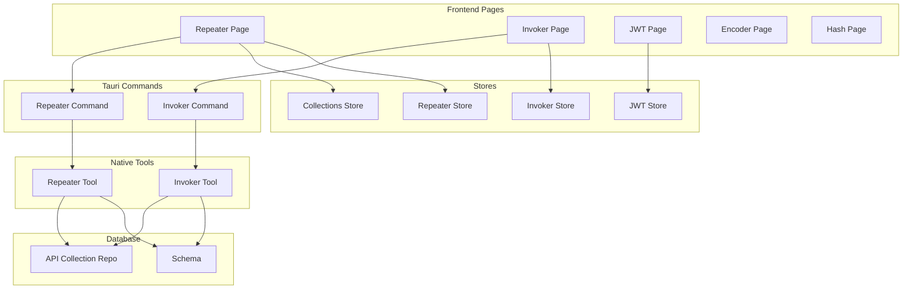
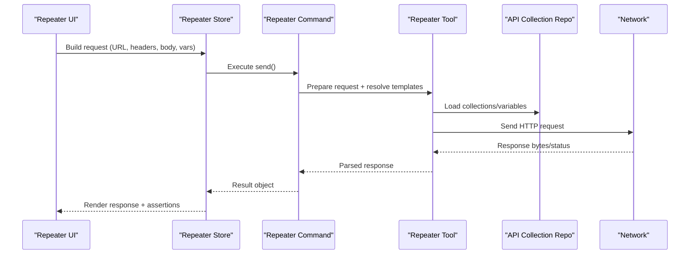
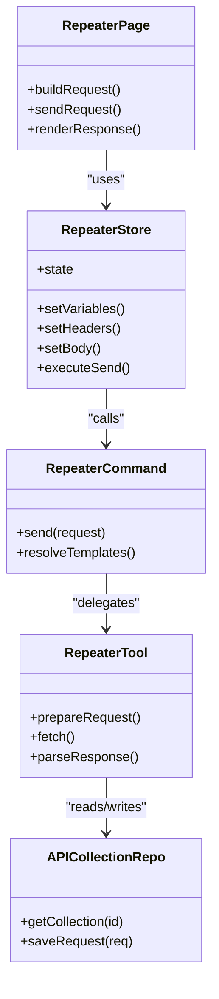
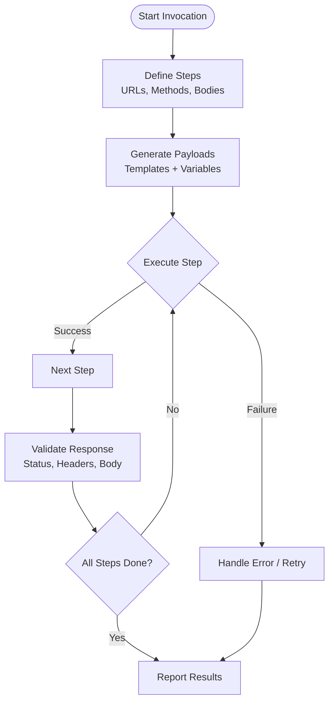
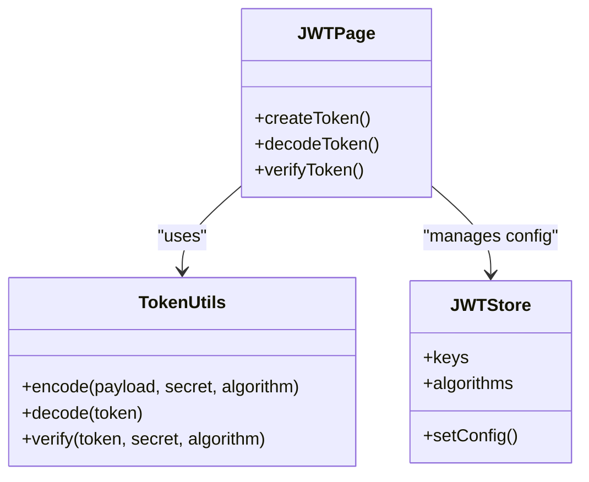
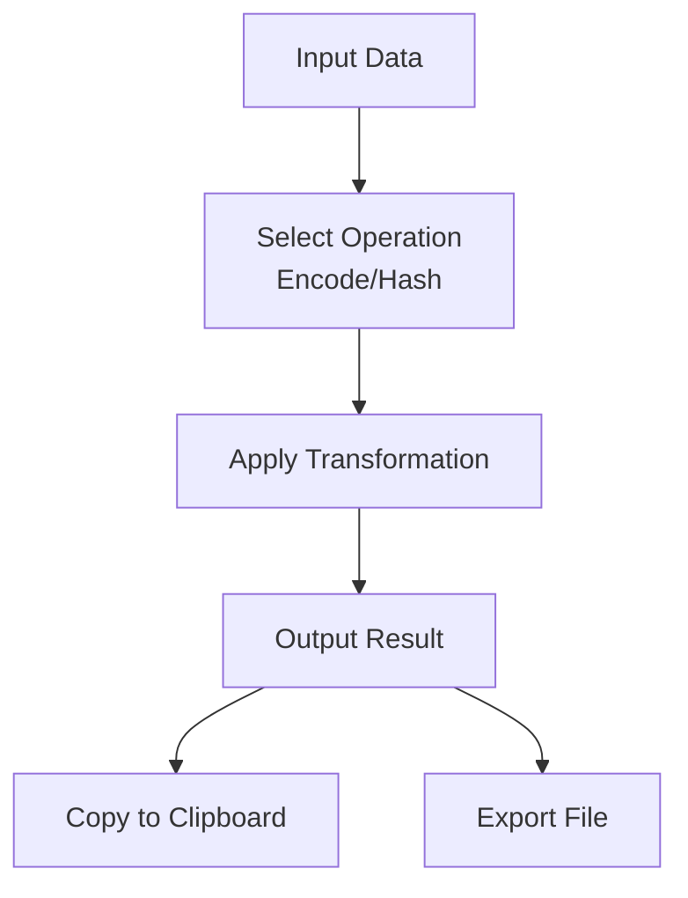
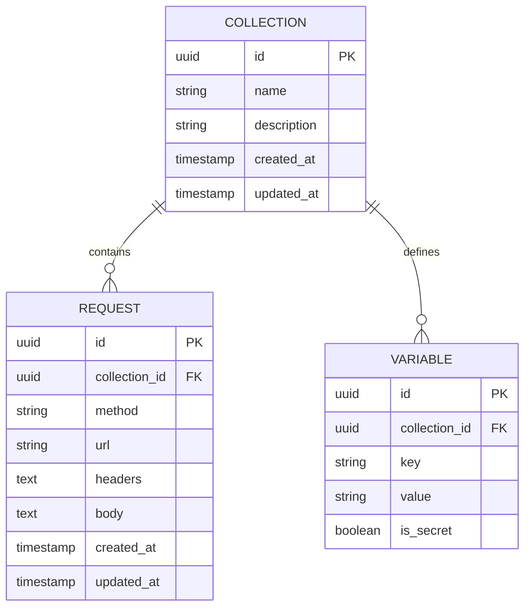
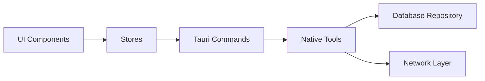

# API Testing & Development Tools

<cite>
**Referenced Files in This Document**
- [README.md](file://README.md)
- [repeater/index.tsx](file://src/pages/repeater/index.tsx)
- [repeater/api.ts](file://src/pages/repeater/api.ts)
- [repeater/constants.ts](file://src/pages/repeater/constants.ts)
- [repeater/types.ts](file://src/pages/repeater/types.ts)
- [repeater/lib/request-builder.ts](file://src/pages/repeater/lib/request-builder.ts)
- [repeater/components/RequestEditor.tsx](file://src/pages/repeater/components/RequestEditor.tsx)
- [repeater/components/ResponseViewer.tsx](file://src/pages/repeater/components/ResponseViewer.tsx)
- [repeater/hooks/useRepeater.ts](file://src/pages/repeater/hooks/useRepeater.ts)
- [stores/repeater.ts](file://src/stores/repeater.ts)
- [stores/collections.ts](file://src/stores/collections.ts)
- [invoker/index.tsx](file://src/pages/invoker/index.tsx)
- [invoker/types.ts](file://src/pages/invoker/types.ts)
- [invoker/lib/payload-generator.ts](file://src/pages/invoker/lib/payload-generator.ts)
- [invoker/components/InvokerRunner.tsx](file://src/pages/invoker/components/InvokerRunner.tsx)
- [stores/invoker.ts](file://src/stores/invoker.ts)
- [jwt/index.tsx](file://src/pages/jwt/index.tsx)
- [jwt/lib/token-utils.ts](file://src/pages/jwt/lib/token-utils.ts)
- [stores/jwt-store.ts](file://src/stores/jwt-store.ts)
- [encoder/index.tsx](file://src/pages/encoder/index.tsx)
- [encoder/lib/encoders.ts](file://src/pages/encoder/lib/encoders.ts)
- [hash/index.tsx](file://src/pages/hash/index.tsx)
- [hash/lib/hashes.ts](file://src/pages/hash/lib/hashes.ts)
- [commands/repeater.rs](file://src-tauri/src/commands/repeater.rs)
- [commands/invoker.rs](file://src-tauri/src/commands/invoker.rs)
- [tools/repeater.rs](file://src-tauri/src/tools/repeater.rs)
- [tools/invoker.rs](file://src-tauri/src/tools/invoker.rs)
- [automation/actions.rs](file://src-tauri/src/automation/actions.rs)
- [automation/execution.rs](file://src-tauri/src/automation/execution.rs)
- [automation/state.rs](file://src-tauri/src/automation/state.rs)
- [db/repository/api_collection.rs](file://src-tauri/src/db/repository/api_collection.rs)
- [db/schema.rs](file://src-tauri/src/db/schema.rs)
- [lib/http-message.ts](file://src/lib/http-message.ts)
- [triggers/repeater/index.ts](file://src/triggers/repeater/index.ts)
- [triggers/invoker/index.ts](file://src/triggers/invoker/index.ts)
</cite>

## Table of Contents
1. [Introduction](#introduction)
2. [Project Structure](#project-structure)
3. [Core Components](#core-components)
4. [Architecture Overview](#architecture-overview)
5. [Detailed Component Analysis](#detailed-component-analysis)
6. [Dependency Analysis](#dependency-analysis)
7. [Performance Considerations](#performance-considerations)
8. [Troubleshooting Guide](#troubleshooting-guide)
9. [Conclusion](#conclusion)
10. [Appendices](#appendices)

## Introduction
This document provides comprehensive documentation for Apprecon’s API testing and development toolkit, focusing on:
- Repeater: crafting and sending HTTP requests with templating and collection management
- Invoker: automated API testing, payload generation, and execution workflows
- JWT tools: token creation, decoding, signing, and verification utilities
- Utility encoders and hashes: data transformation helpers for encoding and hashing
- Collection management, request templating, response analysis, and scripting capabilities
- Advanced features: conditional logic, data-driven testing, result validation
- Performance optimization for large-scale API testing and debugging techniques for complex interactions

The goal is to help both new and experienced users build robust API test suites, automate security tests, and integrate into CI/CD pipelines effectively.

## Project Structure
Apprecon organizes its frontend pages and backend commands into clear modules:
- Frontend pages under src/pages implement UI components and local logic for each tool (Repeater, Invoker, JWT, Encoder, Hash)
- Stores under src/stores manage application state for each feature
- Tauri commands under src-tauri/src/commands expose native operations to the frontend
- Native tools under src-tauri/src/tools provide reusable functionality for HTTP, automation, and payloads
- Database schema and repositories under src-tauri/src/db define persistence structures and access patterns
- Triggers under src/triggers connect UI actions to automation flows

**Diagram sources**
- [repeater/index.tsx](file://src/pages/repeater/index.tsx)
- [invoker/index.tsx](file://src/pages/invoker/index.tsx)
- [jwt/index.tsx](file://src/pages/jwt/index.tsx)
- [encoder/index.tsx](file://src/pages/encoder/index.tsx)
- [hash/index.tsx](file://src/pages/hash/index.tsx)
- [stores/repeater.ts](file://src/stores/repeater.ts)
- [stores/invoker.ts](file://src/stores/invoker.ts)
- [stores/jwt-store.ts](file://src/stores/jwt-store.ts)
- [stores/collections.ts](file://src/stores/collections.ts)
- [commands/repeater.rs](file://src-tauri/src/commands/repeater.rs)
- [commands/invoker.rs](file://src-tauri/src/commands/invoker.rs)
- [tools/repeater.rs](file://src-tauri/src/tools/repeater.rs)
- [tools/invoker.rs](file://src-tauri/src/tools/invoker.rs)
- [db/schema.rs](file://src-tauri/src/db/schema.rs)
- [db/repository/api_collection.rs](file://src-tauri/src/db/repository/api_collection.rs)

**Section sources**
- [README.md](file://README.md)
- [repeater/index.tsx](file://src/pages/repeater/index.tsx)
- [invoker/index.tsx](file://src/pages/invoker/index.tsx)
- [jwt/index.tsx](file://src/pages/jwt/index.tsx)
- [encoder/index.tsx](file://src/pages/encoder/index.tsx)
- [hash/index.tsx](file://src/pages/hash/index.tsx)
- [stores/repeater.ts](file://src/stores/repeater.ts)
- [stores/invoker.ts](file://src/stores/invoker.ts)
- [stores/jwt-store.ts](file://src/stores/jwt-store.ts)
- [stores/collections.ts](file://src/stores/collections.ts)
- [commands/repeater.rs](file://src-tauri/src/commands/repeater.rs)
- [commands/invoker.rs](file://src-tauri/src/commands/invoker.rs)
- [tools/repeater.rs](file://src-tauri/src/tools/repeater.rs)
- [tools/invoker.rs](file://src-tauri/src/tools/invoker.rs)
- [db/schema.rs](file://src-tauri/src/db/schema.rs)
- [db/repository/api_collection.rs](file://src-tauri/src/db/repository/api_collection.rs)

## Core Components
- Repeater: A powerful HTTP client for building, templating, and sending requests; supports collections, environment variables, headers, body builders, and response inspection.
- Invoker: An automation engine for running sequences of API calls, generating payloads, applying conditions, and validating responses.
- JWT Tools: Utilities to create, decode, sign, and verify tokens; supports common algorithms and claims manipulation.
- Encoders and Hashes: Data transformation utilities for base64, URL encoding, hex, and cryptographic hashing (e.g., SHA-256).
- Collections Management: Persistent storage and organization of API endpoints, grouped by projects or environments.
- Request Templating: Variable substitution, environment-based values, and dynamic header/body construction.
- Response Analysis: Structured parsing, status code checks, content-type handling, and assertion support.
- Scripting Capabilities: Hooks and triggers to extend behavior, run custom logic, and integrate with external systems.

**Section sources**
- [repeater/index.tsx](file://src/pages/repeater/index.tsx)
- [invoker/index.tsx](file://src/pages/invoker/index.tsx)
- [jwt/index.tsx](file://src/pages/jwt/index.tsx)
- [encoder/index.tsx](file://src/pages/encoder/index.tsx)
- [hash/index.tsx](file://src/pages/hash/index.tsx)
- [stores/repeater.ts](file://src/stores/repeater.ts)
- [stores/invoker.ts](file://src/stores/invoker.ts)
- [stores/jwt-store.ts](file://src/stores/jwt-store.ts)
- [stores/collections.ts](file://src/stores/collections.ts)

## Architecture Overview
The system integrates a React-based frontend with Tauri-backed native commands and tools. Requests flow from UI components through stores to Tauri commands, which invoke native tools for network operations, payload generation, and database interactions. Responses are parsed and displayed in the UI, while automation flows can be orchestrated via triggers and execution engines.

**Diagram sources**
- [repeater/index.tsx](file://src/pages/repeater/index.tsx)
- [stores/repeater.ts](file://src/stores/repeater.ts)
- [commands/repeater.rs](file://src-tauri/src/commands/repeater.rs)
- [tools/repeater.rs](file://src-tauri/src/tools/repeater.rs)
- [db/repository/api_collection.rs](file://src-tauri/src/db/repository/api_collection.rs)

## Detailed Component Analysis

### Repeater
Repeater enables crafting and sending HTTP requests with advanced templating and collection management. It supports:
- Dynamic variable substitution across URLs, headers, and bodies
- Environment-aware configuration and per-collection overrides
- Rich request builders for JSON, form-data, and raw payloads
- Response viewers with syntax highlighting and structured inspection
- Integration with automation triggers for scripted workflows

**Diagram sources**
- [repeater/index.tsx](file://src/pages/repeater/index.tsx)
- [stores/repeater.ts](file://src/stores/repeater.ts)
- [commands/repeater.rs](file://src-tauri/src/commands/repeater.rs)
- [tools/repeater.rs](file://src-tauri/src/tools/repeater.rs)
- [db/repository/api_collection.rs](file://src-tauri/src/db/repository/api_collection.rs)

Key implementation highlights:
- Request building and templating are handled in the store and command layers, ensuring consistent variable resolution
- Response parsing leverages content-type detection and structured extraction for easier assertions
- Collections are persisted via repository methods, enabling reuse and sharing across environments

**Section sources**
- [repeater/index.tsx](file://src/pages/repeater/index.tsx)
- [repeater/api.ts](file://src/pages/repeater/api.ts)
- [repeater/constants.ts](file://src/pages/repeater/constants.ts)
- [repeater/types.ts](file://src/pages/repeater/types.ts)
- [repeater/lib/request-builder.ts](file://src/pages/repeater/lib/request-builder.ts)
- [repeater/components/RequestEditor.tsx](file://src/pages/repeater/components/RequestEditor.tsx)
- [repeater/components/ResponseViewer.tsx](file://src/pages/repeater/components/ResponseViewer.tsx)
- [repeater/hooks/useRepeater.ts](file://src/pages/repeater/hooks/useRepeater.ts)
- [stores/repeater.ts](file://src/stores/repeater.ts)
- [commands/repeater.rs](file://src-tauri/src/commands/repeater.rs)
- [tools/repeater.rs](file://src-tauri/src/tools/repeater.rs)
- [db/repository/api_collection.rs](file://src-tauri/src/db/repository/api_collection.rs)

### Invoker
Invoker automates API testing by executing sequences of requests, generating payloads, and validating outcomes. Features include:
- Step-based workflow definition with conditional branching
- Payload generators for various formats and schemas
- Assertion engine to validate status codes, headers, and bodies
- Integration with automation triggers and execution engine

**Diagram sources**
- [invoker/index.tsx](file://src/pages/invoker/index.tsx)
- [invoker/lib/payload-generator.ts](file://src/pages/invoker/lib/payload-generator.ts)
- [invoker/components/InvokerRunner.tsx](file://src/pages/invoker/components/InvokerRunner.tsx)
- [automation/execution.rs](file://src-tauri/src/automation/execution.rs)
- [automation/actions.rs](file://src-tauri/src/automation/actions.rs)

Advanced capabilities:
- Conditional logic based on previous step outputs
- Data-driven testing using CSV/JSON datasets
- Result validation with flexible assertion rules
- Automation integration via triggers and native execution

**Section sources**
- [invoker/index.tsx](file://src/pages/invoker/index.tsx)
- [invoker/types.ts](file://src/pages/invoker/types.ts)
- [invoker/lib/payload-generator.ts](file://src/pages/invoker/lib/payload-generator.ts)
- [invoker/components/InvokerRunner.tsx](file://src/pages/invoker/components/InvokerRunner.tsx)
- [stores/invoker.ts](file://src/stores/invoker.ts)
- [commands/invoker.rs](file://src-tauri/src/commands/invoker.rs)
- [tools/invoker.rs](file://src-tauri/src/tools/invoker.rs)
- [automation/execution.rs](file://src-tauri/src/automation/execution.rs)
- [automation/actions.rs](file://src-tauri/src/automation/actions.rs)

### JWT Tools
JWT tools provide comprehensive token manipulation:
- Create tokens with custom claims and algorithms
- Decode and inspect token contents
- Sign and verify tokens securely
- Manage keys and configurations via store

**Diagram sources**
- [jwt/index.tsx](file://src/pages/jwt/index.tsx)
- [jwt/lib/token-utils.ts](file://src/pages/jwt/lib/token-utils.ts)
- [stores/jwt-store.ts](file://src/stores/jwt-store.ts)

Use cases:
- Security testing with token forgery and validation
- Debugging authentication flows
- Generating test tokens for different user roles

**Section sources**
- [jwt/index.tsx](file://src/pages/jwt/index.tsx)
- [jwt/lib/token-utils.ts](file://src/pages/jwt/lib/token-utils.ts)
- [stores/jwt-store.ts](file://src/stores/jwt-store.ts)

### Encoders and Hashes
Utility tools for data transformation:
- Encoders: Base64, URL encoding, HTML entities, hex conversion
- Hashes: SHA-256, MD5, and other cryptographic functions
- Batch processing for large inputs
- Copy-to-clipboard and export capabilities

**Diagram sources**
- [encoder/index.tsx](file://src/pages/encoder/index.tsx)
- [encoder/lib/encoders.ts](file://src/pages/encoder/lib/encoders.ts)
- [hash/index.tsx](file://src/pages/hash/index.tsx)
- [hash/lib/hashes.ts](file://src/pages/hash/lib/hashes.ts)

**Section sources**
- [encoder/index.tsx](file://src/pages/encoder/index.tsx)
- [encoder/lib/encoders.ts](file://src/pages/encoder/lib/encoders.ts)
- [hash/index.tsx](file://src/pages/hash/index.tsx)
- [hash/lib/hashes.ts](file://src/pages/hash/lib/hashes.ts)

### Collection Management
Collections organize API endpoints and requests:
- Group requests by project, environment, or feature
- Share variables and headers across requests
- Persist collections in the database
- Import/export for collaboration

**Diagram sources**
- [db/schema.rs](file://src-tauri/src/db/schema.rs)
- [db/repository/api_collection.rs](file://src-tauri/src/db/repository/api_collection.rs)
- [stores/collections.ts](file://src/stores/collections.ts)

**Section sources**
- [stores/collections.ts](file://src/stores/collections.ts)
- [db/schema.rs](file://src-tauri/src/db/schema.rs)
- [db/repository/api_collection.rs](file://src-tauri/src/db/repository/api_collection.rs)

### Request Templating and Response Analysis
Templating allows dynamic request construction:
- Variable substitution in URLs, headers, and bodies
- Environment-specific configurations
- Conditional inclusion of fields

Response analysis includes:
- Status code validation
- Header inspection
- Body parsing and schema validation
- Assertion framework for automated testing

**Section sources**
- [repeater/lib/request-builder.ts](file://src/pages/repeater/lib/request-builder.ts)
- [repeater/components/ResponseViewer.tsx](file://src/pages/repeater/components/ResponseViewer.tsx)
- [lib/http-message.ts](file://src/lib/http-message.ts)

### Scripting Capabilities
Triggers enable extending functionality:
- Connect UI actions to automation flows
- Run custom scripts before/after requests
- Integrate with external systems via webhooks

**Section sources**
- [triggers/repeater/index.ts](file://src/triggers/repeater/index.ts)
- [triggers/invoker/index.ts](file://src/triggers/invoker/index.ts)
- [automation/state.rs](file://src-tauri/src/automation/state.rs)

## Dependency Analysis
The system exhibits clear separation between UI, state management, and native operations:
- Frontend components depend on stores for state
- Stores call Tauri commands for side effects
- Commands delegate to native tools for heavy lifting
- Database access is abstracted through repositories

**Diagram sources**
- [repeater/index.tsx](file://src/pages/repeater/index.tsx)
- [stores/repeater.ts](file://src/stores/repeater.ts)
- [commands/repeater.rs](file://src-tauri/src/commands/repeater.rs)
- [tools/repeater.rs](file://src-tauri/src/tools/repeater.rs)
- [db/repository/api_collection.rs](file://src-tauri/src/db/repository/api_collection.rs)

Potential coupling points:
- Store-command interface contracts must remain stable
- Tool interfaces should be well-defined for extensibility
- Database schema changes require migration strategies

**Section sources**
- [repeater/index.tsx](file://src/pages/repeater/index.tsx)
- [stores/repeater.ts](file://src/stores/repeater.ts)
- [commands/repeater.rs](file://src-tauri/src/commands/repeater.rs)
- [tools/repeater.rs](file://src-tauri/src/tools/repeater.rs)
- [db/repository/api_collection.rs](file://src-tauri/src/db/repository/api_collection.rs)

## Performance Considerations
For large-scale API testing:
- Use batch operations where possible to reduce network overhead
- Implement connection pooling and keep-alive settings
- Cache frequently accessed collections and variables
- Optimize payload generation for large datasets
- Monitor memory usage during long-running invocations
- Use streaming for large response processing

Debugging techniques:
- Enable detailed logging in development mode
- Use network inspection tools to trace request/response flows
- Implement assertion failures with contextual information
- Profile slow operations to identify bottlenecks

[No sources needed since this section provides general guidance]

## Troubleshooting Guide
Common issues and solutions:
- Connection errors: Verify proxy settings and network connectivity
- Authentication failures: Check token validity and expiration
- Payload parsing errors: Validate JSON/XML structure and encoding
- Template resolution failures: Ensure all variables are defined
- Permission issues: Confirm file system and network access rights

Debugging steps:
- Inspect browser console for JavaScript errors
- Review Tauri logs for native operation failures
- Use network tab to examine HTTP traffic
- Test individual components in isolation
- Validate database schema and migrations

**Section sources**
- [repeater/index.tsx](file://src/pages/repeater/index.tsx)
- [invoker/index.tsx](file://src/pages/invoker/index.tsx)
- [jwt/index.tsx](file://src/pages/jwt/index.tsx)
- [encoder/index.tsx](file://src/pages/encoder/index.tsx)
- [hash/index.tsx](file://src/pages/hash/index.tsx)

## Conclusion
Apprecon’s API testing and development toolkit provides a comprehensive solution for modern API development and testing needs. The Repeater enables precise request crafting, the Invoker automates complex testing scenarios, and the JWT, encoder, and hash tools support essential data manipulation tasks. With robust collection management, templating capabilities, and scripting support, teams can build scalable test suites that integrate seamlessly into CI/CD pipelines.

The architecture balances usability with power, offering both intuitive interfaces and advanced features for sophisticated testing requirements. By following the guidelines in this document, users can effectively leverage these tools to ensure API reliability, security, and performance.

[No sources needed since this section summarizes without analyzing specific files]

## Appendices

### Building API Test Suites
- Organize related endpoints into logical collections
- Use environment variables for configuration management
- Implement assertions for critical business logic
- Parameterize tests with data-driven approaches
- Version control your test collections for collaboration

### Automating Security Tests
- Create fuzzing payloads for input validation
- Test authentication and authorization flows
- Validate security headers and CORS policies
- Scan for common vulnerabilities (SQL injection, XSS)
- Integrate security scans into CI/CD pipelines

### CI/CD Integration
- Export test collections for headless execution
- Configure environment variables for different stages
- Generate reports and artifacts for analysis
- Set up notifications for test failures
- Use parallel execution for faster feedback

[No sources needed since this section provides general guidance]