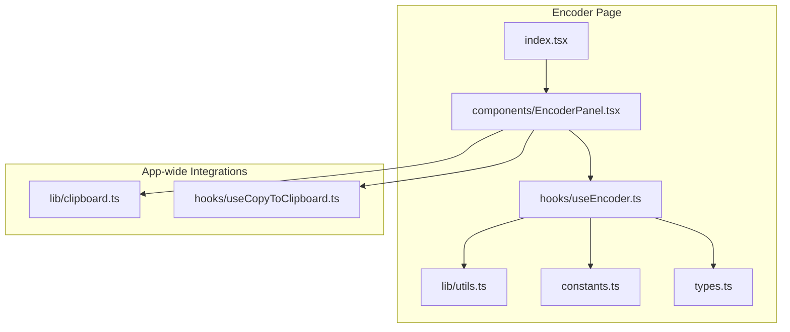
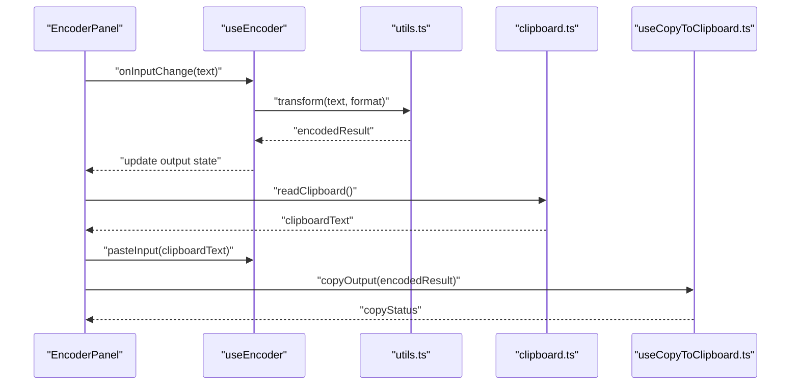
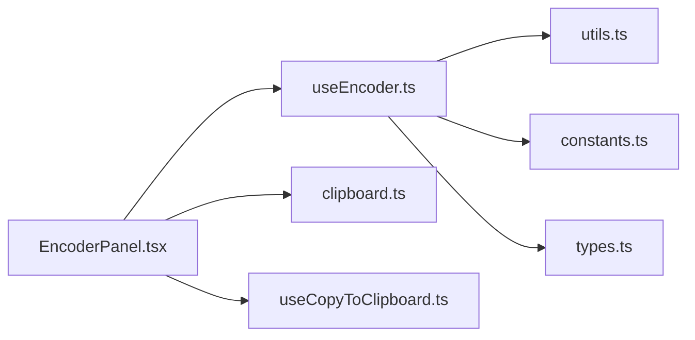

# Encoder - Data Transformation Utilities

<cite>
**Referenced Files in This Document**
- [encoder/index.tsx](file://src/pages/encoder/index.tsx)
- [encoder/constants.ts](file://src/pages/encoder/constants.ts)
- [encoder/types.ts](file://src/pages/encoder/types.ts)
- [encoder/lib/utils.ts](file://src/pages/encoder/lib/utils.ts)
- [encoder/components/EncoderPanel.tsx](file://src/pages/encoder/components/EncoderPanel.tsx)
- [encoder/hooks/useEncoder.ts](file://src/pages/encoder/hooks/useEncoder.ts)
- [clipboard.ts](file://src/lib/clipboard.ts)
- [useCopyToClipboard.ts](file://src/hooks/useCopyToClipboard.ts)
</cite>

## Table of Contents
1. [Introduction](#introduction)
2. [Project Structure](#project-structure)
3. [Core Components](#core-components)
4. [Architecture Overview](#architecture-overview)
5. [Detailed Component Analysis](#detailed-component-analysis)
6. [Dependency Analysis](#dependency-analysis)
7. [Performance Considerations](#performance-considerations)
8. [Troubleshooting Guide](#troubleshooting-guide)
9. [Conclusion](#conclusion)
10. [Appendices](#appendices)

## Introduction
This document explains Apprecon’s encoder utilities for data transformation and encoding operations. It covers supported formats (Base64, URL encoding, HTML entities, hex encoding), batch processing capabilities, input/output formatting options, clipboard integration, practical examples for API testing, troubleshooting tips, performance considerations for large datasets, and integration patterns with other Apprecon tools to streamline data workflows.

## Project Structure
The encoder feature is implemented as a dedicated page with modular components, hooks, types, constants, and utility functions. The structure follows a clear separation of concerns:
- UI layer: React components for the encoder interface
- State and logic: Hooks managing transformations and batch operations
- Core utilities: Encoding helpers and format-specific transformers
- Types and constants: Shared definitions for supported encodings and configuration
- Clipboard integration: Utilities for reading/writing clipboard content

**Diagram sources**
- [encoder/index.tsx](file://src/pages/encoder/index.tsx)
- [encoder/components/EncoderPanel.tsx](file://src/pages/encoder/components/EncoderPanel.tsx)
- [encoder/hooks/useEncoder.ts](file://src/pages/encoder/hooks/useEncoder.ts)
- [encoder/lib/utils.ts](file://src/pages/encoder/lib/utils.ts)
- [encoder/constants.ts](file://src/pages/encoder/constants.ts)
- [encoder/types.ts](file://src/pages/encoder/types.ts)
- [clipboard.ts](file://src/lib/clipboard.ts)
- [useCopyToClipboard.ts](file://src/hooks/useCopyToClipboard.ts)

**Section sources**
- [encoder/index.tsx](file://src/pages/encoder/index.tsx)
- [encoder/components/EncoderPanel.tsx](file://src/pages/encoder/components/EncoderPanel.tsx)
- [encoder/hooks/useEncoder.ts](file://src/pages/encoder/hooks/useEncoder.ts)
- [encoder/lib/utils.ts](file://src/pages/encoder/lib/utils.ts)
- [encoder/constants.ts](file://src/pages/encoder/constants.ts)
- [encoder/types.ts](file://src/pages/encoder/types.ts)
- [clipboard.ts](file://src/lib/clipboard.ts)
- [useCopyToClipboard.ts](file://src/hooks/useCopyToClipboard.ts)

## Core Components
- Encoder Panel: Provides the user interface for selecting encoding formats, entering input text, viewing results, and performing batch operations.
- useEncoder Hook: Encapsulates transformation logic, manages state for input/output, handles batch processing, and coordinates clipboard interactions.
- Utils Library: Implements encoding algorithms and helper functions for formatting and validation.
- Constants and Types: Define supported encodings, their labels, and shared interfaces used across the encoder module.

Key responsibilities:
- Format selection and application of transformations
- Real-time preview and result rendering
- Batch mode for multiple inputs or lines
- Clipboard read/write for seamless workflow integration
- Error handling and user feedback

**Section sources**
- [encoder/components/EncoderPanel.tsx](file://src/pages/encoder/components/EncoderPanel.tsx)
- [encoder/hooks/useEncoder.ts](file://src/pages/encoder/hooks/useEncoder.ts)
- [encoder/lib/utils.ts](file://src/pages/encoder/lib/utils.ts)
- [encoder/constants.ts](file://src/pages/encoder/constants.ts)
- [encoder/types.ts](file://src/pages/encoder/types.ts)

## Architecture Overview
The encoder architecture separates UI, state management, and transformation logic while integrating with app-wide clipboard utilities. The flow supports single-line and multi-line inputs, real-time updates, and batch processing.

**Diagram sources**
- [encoder/components/EncoderPanel.tsx](file://src/pages/encoder/components/EncoderPanel.tsx)
- [encoder/hooks/useEncoder.ts](file://src/pages/encoder/hooks/useEncoder.ts)
- [encoder/lib/utils.ts](file://src/pages/encoder/lib/utils.ts)
- [clipboard.ts](file://src/lib/clipboard.ts)
- [useCopyToClipboard.ts](file://src/hooks/useCopyToClipboard.ts)

## Detailed Component Analysis

### Encoder Panel (UI Layer)
Responsibilities:
- Render input area, format selector, and output display
- Trigger transformations on input changes
- Provide buttons for copy-to-clipboard and paste-from-clipboard
- Support batch mode toggles and line-based operations

User interactions:
- Select encoding format from dropdown
- Enter or paste text into input
- View encoded output in real time
- Copy results or paste new input from clipboard

Error handling:
- Display validation messages for unsupported formats
- Show clipboard permission errors when applicable

**Section sources**
- [encoder/components/EncoderPanel.tsx](file://src/pages/encoder/components/EncoderPanel.tsx)

### useEncoder Hook (State and Logic)
Responsibilities:
- Manage input/output states and selected format
- Apply transformations via utils
- Handle batch processing by splitting input into lines and applying transformations per line
- Integrate clipboard read/write through app-wide utilities
- Debounce heavy operations if needed for performance

Batch processing:
- Split multi-line input by newline
- Apply transformation to each line independently
- Aggregate results preserving order
- Optional trimming and filtering empty lines

Clipboard integration:
- Read clipboard content safely
- Write encoded results back to clipboard
- Provide user feedback on success/failure

**Section sources**
- [encoder/hooks/useEncoder.ts](file://src/pages/encoder/hooks/useEncoder.ts)

### Utils Library (Encoding Algorithms)
Responsibilities:
- Implement Base64 encode/decode
- Implement URL encoding/decoding
- Implement HTML entity encoding/decoding
- Implement hex encoding/decoding
- Provide custom transformation pipeline support

Complexity and performance:
- Linear time complexity O(n) for most transformations
- Efficient string handling to minimize allocations
- Avoid unnecessary conversions; reuse buffers where possible

Validation:
- Check input validity before transformation
- Return meaningful error messages for invalid inputs

**Section sources**
- [encoder/lib/utils.ts](file://src/pages/encoder/lib/utils.ts)

### Constants and Types
Responsibilities:
- Define supported encoding formats and their labels
- Specify type definitions for encoder inputs and outputs
- Centralize configuration for UI and logic layers

Supported formats:
- Base64
- URL encoding
- HTML entities
- Hex encoding
- Custom transformations (extensible)

**Section sources**
- [encoder/constants.ts](file://src/pages/encoder/constants.ts)
- [encoder/types.ts](file://src/pages/encoder/types.ts)

### Clipboard Integration
Responsibilities:
- Read clipboard content asynchronously
- Write encoded results to clipboard
- Handle permissions and fallbacks gracefully

Integration points:
- Use app-wide clipboard utility for consistent behavior
- Leverage copy hook for user feedback and status tracking

**Section sources**
- [clipboard.ts](file://src/lib/clipboard.ts)
- [useCopyToClipboard.ts](file://src/hooks/useCopyToClipboard.ts)

## Dependency Analysis
The encoder module depends on internal utilities and app-wide integrations. Coupling is minimized through well-defined interfaces and hooks.

**Diagram sources**
- [encoder/components/EncoderPanel.tsx](file://src/pages/encoder/components/EncoderPanel.tsx)
- [encoder/hooks/useEncoder.ts](file://src/pages/encoder/hooks/useEncoder.ts)
- [encoder/lib/utils.ts](file://src/pages/encoder/lib/utils.ts)
- [encoder/constants.ts](file://src/pages/encoder/constants.ts)
- [encoder/types.ts](file://src/pages/encoder/types.ts)
- [clipboard.ts](file://src/lib/clipboard.ts)
- [useCopyToClipboard.ts](file://src/hooks/useCopyToClipboard.ts)

**Section sources**
- [encoder/components/EncoderPanel.tsx](file://src/pages/encoder/components/EncoderPanel.tsx)
- [encoder/hooks/useEncoder.ts](file://src/pages/encoder/hooks/useEncoder.ts)
- [encoder/lib/utils.ts](file://src/pages/encoder/lib/utils.ts)
- [encoder/constants.ts](file://src/pages/encoder/constants.ts)
- [encoder/types.ts](file://src/pages/encoder/types.ts)
- [clipboard.ts](file://src/lib/clipboard.ts)
- [useCopyToClipboard.ts](file://src/hooks/useCopyToClipboard.ts)

## Performance Considerations
- Large datasets: Use batch processing to handle many lines efficiently; avoid re-rendering on every keystroke by debouncing input changes.
- Memory usage: Prefer streaming or chunked processing for very large inputs to prevent memory spikes.
- I/O operations: Clipboard access should be asynchronous and non-blocking; cache results when appropriate.
- Algorithm efficiency: Ensure linear-time transformations and avoid redundant conversions.

[No sources needed since this section provides general guidance]

## Troubleshooting Guide
Common issues and resolutions:
- Clipboard permission denied: Ensure browser/app permissions are granted; provide fallback instructions to manually copy/paste.
- Invalid input format: Validate input before transformation; show clear error messages indicating expected format.
- Unexpected output characters: Verify character encoding (UTF-8 vs ASCII); ensure proper decoding/encoding sequence.
- Batch processing errors: Inspect line separators and empty lines; trim whitespace consistently.

**Section sources**
- [encoder/hooks/useEncoder.ts](file://src/pages/encoder/hooks/useEncoder.ts)
- [encoder/lib/utils.ts](file://src/pages/encoder/lib/utils.ts)
- [clipboard.ts](file://src/lib/clipboard.ts)

## Conclusion
Apprecon’s encoder utilities provide a robust, extensible framework for data transformation and encoding operations. With support for common formats, batch processing, and clipboard integration, it streamlines API testing and data preparation workflows. By following best practices for performance and error handling, users can efficiently automate data transformations within Apprecon’s ecosystem.

[No sources needed since this section summarizes without analyzing specific files]

## Appendices

### Supported Encoding Formats
- Base64: Encode/decode binary data to/from Base64 strings
- URL encoding: Percent-encode special characters for URLs
- HTML entities: Convert characters to/from HTML entities
- Hex encoding: Convert bytes to/from hexadecimal representation
- Custom transformations: Extendable pipeline for domain-specific encodings

**Section sources**
- [encoder/constants.ts](file://src/pages/encoder/constants.ts)
- [encoder/types.ts](file://src/pages/encoder/types.ts)

### Practical Examples
- Prepare JSON payloads for API testing by URL-encoding query parameters
- Convert sensitive tokens to Base64 for safe transmission
- Escape HTML entities to prevent XSS vulnerabilities
- Generate hex dumps for binary analysis

[No sources needed since this section provides general guidance]

### Integration Patterns
- Use encoder results directly in Repeater for request crafting
- Automate transformations in Workflow nodes for end-to-end pipelines
- Share encoded data across tabs using clipboard integration

**Section sources**
- [encoder/components/EncoderPanel.tsx](file://src/pages/encoder/components/EncoderPanel.tsx)
- [encoder/hooks/useEncoder.ts](file://src/pages/encoder/hooks/useEncoder.ts)